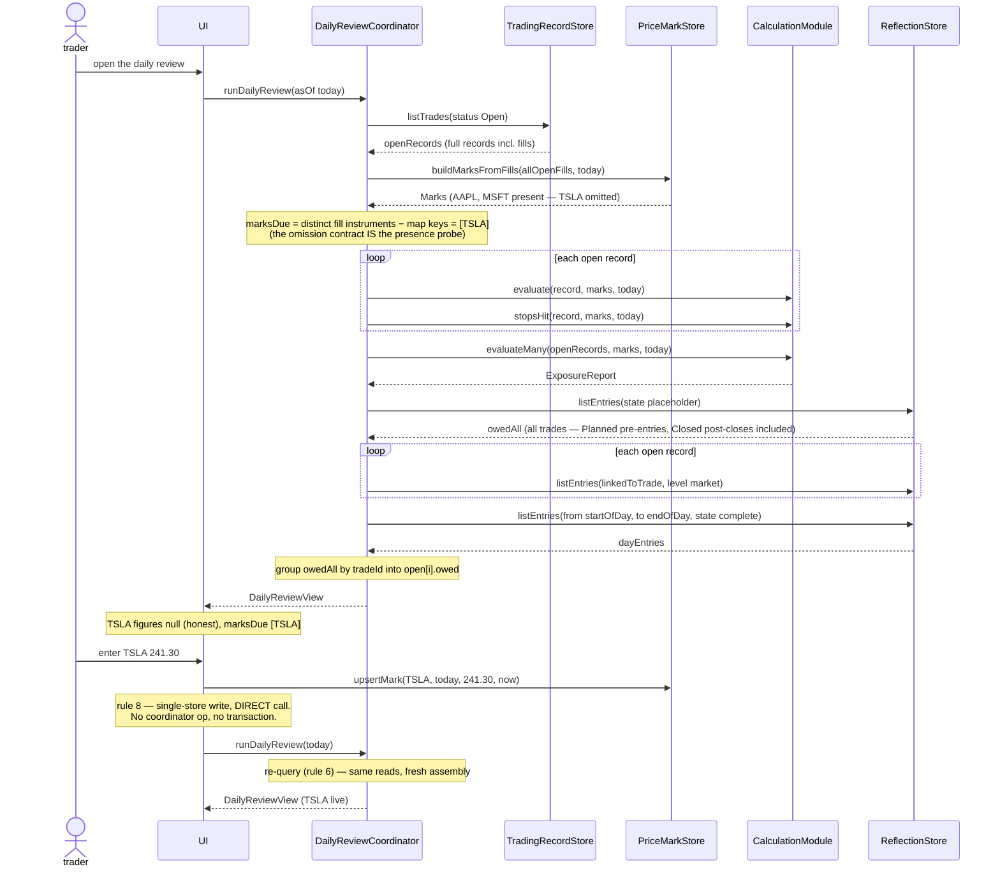
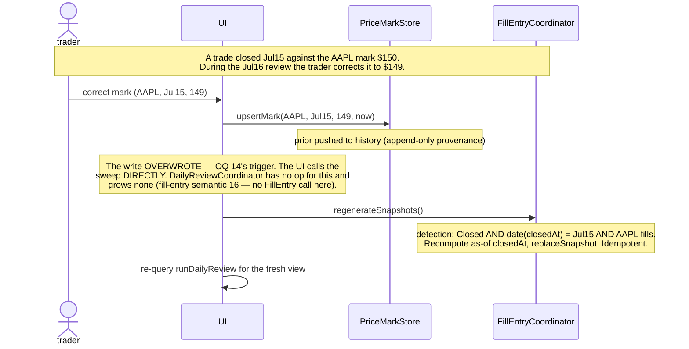
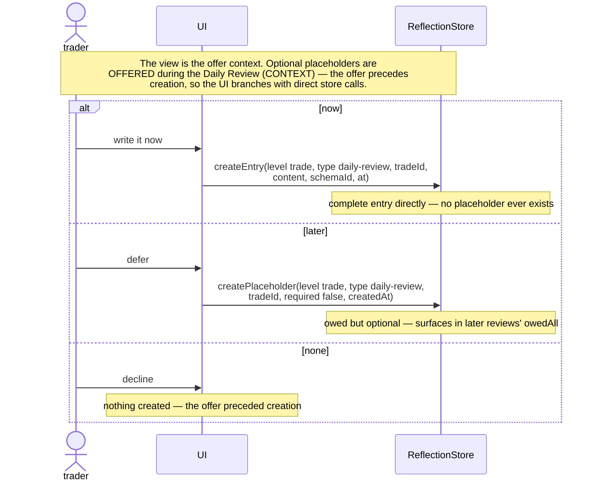
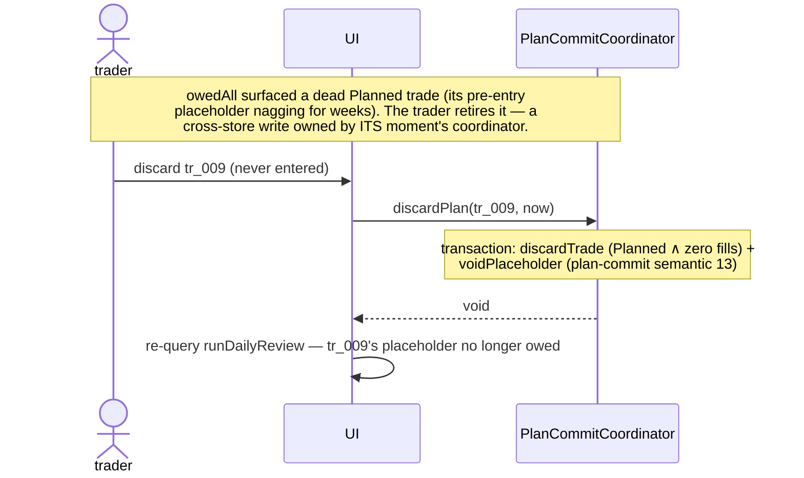

# DailyReviewCoordinator — initial interface design

The coordinator that owns the **daily-review assembly** — the system's widest
read join. One call returns the finished view of the whole trading day: the
open book (records + live figures + stops hit + what's owed + market context),
the portfolio's current exposure, the marks still due, and the day's
interleaved journal stream. Four dependencies joined — TradingRecordStore,
PriceMarkStore, ReflectionStore, CalculationModule — and nothing else.

It deliberately owns **no writes**: the review is a moment, not a transaction.
Every write a trader makes from the review screen — entering a mark, trailing
a stop, recording an observation, completing a placeholder, discarding a dead
plan — is a single-store act (or another coordinator's moment) the UI performs
directly (rule 8; decided semantics 7). This makes it the system's **first
read-only coordinator** (PerformanceReportingCoordinator, drilled down later,
is the second): no StorageBinding, no transaction, no clock. The
Phase-2 walkthrough drew the mark write inside `runDailyReview` behind an
interactive prompt; at drill-down granularity that sketch fails rule 8
mechanically (the write touches one store) and rule 6 (a synchronous call
cannot host an interactive form) — the session's structural finding, applied
as ripples across the three docs that carried the sketch.

One operation over constructor-injected dependencies:

```ts
/** Assemble the entire daily-review view in one call — the widest read join.
 *  Open trades + live figures + stops hit + what's owed + market context +
 *  the day's journal stream + open-book exposure + marks due. Read-only:
 *  this coordinator has no write op, no transaction, no clock. */
runDailyReview(asOf: Date): DailyReviewView
```

---

## Interface

### Operations

```ts
runDailyReview(asOf: Date): DailyReviewView
```

### Dependencies (constructor-injected)

```ts
tradingRecord: TradingRecordStore   // listTrades({status:'Open'}) — one call returns full
                                    //   records incl. fills (no getTradeRecord per trade)
priceMarks:    PriceMarkStore       // buildMarksFromFills — ONE marks map serves every
                                    //   calc call (evaluate, stopsHit, evaluateMany)
reflection:    ReflectionStore      // listEntries ×3 shapes: global owed, per-trade
                                    //   market context, the day's stream
calc:          CalculationModule    // evaluate + stopsHit (ADR 0010) per trade,
                                    //   evaluateMany (ADR 0008) for the open book
// NOTE: no StorageBinding — the only coordinator without one. It never writes,
// so it never needs the transaction primitive (OQ 9's other two homes).
```

### Types

```ts
/** Types consumed are canonical elsewhere: TradeRecord (trading-record-store.md),
 *  FigureSet, ExposureReport, StopsHit (calculation-module.md), Entry
 *  (reflection-store.md). Only the coordinator's own returns are defined here. */

type DailyReviewView = {
  asOf:       Date                  // echoed — the marks key and every calc call's asOf
  open:       OpenTradeReview[]     // one per Open trade — finished items, the UI projects
  marksDue:   InstrumentId[]        // distinct fill-instruments across open trades lacking
                                    //   an asOf mark — the mark-collection prompt's data
  exposure:   ExposureReport        // calc.evaluateMany — the open-book rollup (ADR 0008)
  owedAll:    Entry[]               // every placeholder owed, ALL trades — a Planned trade's
                                    //   pre-entry and a Closed trade's post-close included
  dayEntries: Entry[]               // complete entries written on asOf's calendar day, all
}                                     //   three levels, sorted by `at` ascending (ADR 0004)

type OpenTradeReview = {
  record:        TradeRecord        // the cohesive bundle — UI projects (strategy, plan
                                    //   levels, thesis, revisions)
  figures:       FigureSet          // calc.evaluate — live, nulls honest where a mark is
                                    //   missing (calc semantic 4)
  stopsHit:      StopsHit           // which declared sides today's marks crossed, per side
                                    //   (ADR 0010); `unevaluated` sides carry the missing
                                    //   mark honestly
  owed:          Entry[]            // owedAll grouped by this tradeId (trade-level AND
                                    //   fill-level — convention C2's denormalized tradeId)
  marketContext: Entry[]            // listEntries({linkedToTrade: tradeId, level:'market'})
}
```

### Caller's-eye usage

```ts
// The whole screen is one call plus re-queries:
const view = review.runDailyReview(today)
//   view.open[0].figures.pnl.unrealized   → +$200 (AAPL, mark present)
//   view.open[2].figures.pnl.unrealized   → null   (TSLA, mark absent — honest)
//   view.marksDue                          → ['TSLA']
//   view.exposure.totalUnrealized          → { dollars: 450, missingMarkCount: 1 }

// The mark-entry moment — the UI writes DIRECTLY (rule 8), then re-queries (rule 6):
priceMarks.upsertMark('TSLA', today, 241.30, now)
const fresh = review.runDailyReview(today)   // TSLA now live
```

---

## Decided semantics

Each ruling cites the principle or ADR it derives from. Veto any during review.

1. **One operation: `runDailyReview(asOf): DailyReviewView` — read-only.**
   The overview estimated one; one lands. No write op, no transaction, no
   StorageBinding, no clock — the only coordinator in the partition with none
   of these. Depth: one call joins four modules and returns everything the
   screen needs; the write-variant shapes were design-twice'd and rejected
   (see *Alternatives considered*). *(Depth; rule 8 — the deletion test run on
   every candidate write op.)*

2. **The assembly, in order.** (a) `tradingRecord.listTrades({status:'Open'})`
   — one call returns full records including fills (the store's collapse; a
   per-trade `getTradeRecord` loop would re-read what the list already
   returned). (b) `priceMarks.buildMarksFromFills(allOpenFills, asOf)` — ONE
   marks map for every calc call. (c) `calc.evaluate` + `calc.stopsHit` per
   open record, `calc.evaluateMany` over the list. (d) The three
   `reflection.listEntries` shapes (semantic 6). (e) Group `owedAll` by
   `tradeId` in hand. Every step is a read; nothing depends on write order
   because there are no writes. *(TradingRecordStore semantic — listTrades
   returns full records; ADR 0006 — the cheap indexed status filter.)*

3. **`marksDue` is computed in hand — no new store op.** The distinct
   instruments across open trades' fills, minus the keys of the marks map
   `buildMarksFromFills` returned — the omission contract (PriceMarkStore
   semantic 5) IS the presence probe. No `getMark` op exists and none is
   added (PriceMarkStore semantic 1 already rejected it as subsumed).
   *(PriceMarkStore semantics 1 + 5.)*

4. **Live figures per trade + one portfolio rollup — the honest 2× cost.**
   `evaluate` per record for the per-trade detail, `evaluateMany` over the
   list for `exposure` (which internally map(evaluates) again). Small N (the
   open-book count), pure cheap arithmetic, and the alternative — reshaping
   `evaluateMany` to return per-trade FigureSets, or folding coordinator-side
   — would violate calc's pinned contract or scatter its null/dollars-only
   conventions into a coordinator (exactly what ADR 0008 lifted OUT of
   callers). Two grains ride the view and both are honest: `marksDue` counts
   *instruments*, `exposure.missingMarkCount` counts *positions*. *(ADR 0008;
   calc semantics 14–17.)*

5. **Mark entry and correction are the UI's direct `upsertMark` calls —
   re-query after (the session's structural finding).** The write touches one
   store → rule 8: direct call, no coordinator. The interactive form lives in
   the UI, where interaction belongs (rule 6 — plain request/response); the
   loop is view → collect → write → re-`runDailyReview`. After an
   **overwriting** write (one whose prior mark existed — history non-empty),
   the UI calls `FillEntryCoordinator.regenerateSnapshots` directly: OQ 14's
   pinned trigger convention names the UI as the actor, coordinators may not
   call coordinators, and unifying the actor (the UI writes, the UI sweeps,
   the UI re-queries) keeps one moment in one pair of hands. **This doc grows
   no FillEntry call** — the FillEntry session's semantic 16 export, imported
   and honored. *(Rule 8; rule 6; OQ 14; fill-entry-coordinator semantic 16.)*

6. **Reflection reads: one global owed read, per-trade market context, one
   day stream.** `listEntries({state:'placeholder'})` ONCE — every owed
   placeholder across ALL trades — grouped by `tradeId` in hand (set
   operations over returned data, not derivation; OQ 5's spirit — the store
   filtered, the coordinator groups). This replaces N per-trade owed reads
   AND catches the placeholders the walkthrough's "open trades" framing
   misses: a **Planned** trade's pre-entry placeholder and a **Closed**
   trade's post-close one — CONTEXT says the review "surfaces incomplete
   journal placeholders," all of them. Market context stays per-trade
   (`listEntries({linkedToTrade, level:'market'})`) — no batch filter exists
   and none is needed (N small). The day stream is
   `listEntries({from: startOfDay(asOf), to: endOfDay(asOf), state:'complete'})`
   — everything *written* that day across all three attachment levels (ADR
   0004's "one interleaved stream"), sorted by `at` ascending. Placeholders
   *created* today are not in it (not written) — they surface in `owedAll`,
   so the two lists never overlap. *(OQ 5; ADR 0004; ReflectionStore
   semantics 3 + 16.)*

7. **The review's writes are all direct single-store calls (or another
   coordinator's moment) — performed by the UI.** The ruling, write by write:
   trailing a stop → `appendRevision` (TradingRecord only — rule 8's own
   canonical example, overview walkthrough 5); recording an observation →
   `createEntry` type `'daily-review'` (Reflection only — OQ 6 dissolved:
   journal-writing is a direct call); completing an owed placeholder →
   `completePlaceholder` (Reflection only); linking a market entry →
   `setMarketLinks` (Reflection only); the optional observation offer → the
   three-way now/later/none resolved via direct ReflectionStore calls
   (FillEntry semantic 3's precedent — the coordinator returns context, the
   UI branches); even the one cross-store write reachable from the screen —
   discarding a dead Planned trade — belongs to *its moment's* coordinator:
   the UI calls `planCommit.discardPlan` directly. The screen is a *place*;
   coordinators own *moments*. A writing facade would add five pass-throughs
   (each fails the deletion test), protect nothing (no write pairs with
   another across stores — there is no fact-pair to transact), and require a
   rule-8 deviation recorded in an ADR. *(Rule 8; OQ 6; fill-entry
   semantic 3; the moment-vs-transaction split — OQ 9's transactions exist
   only where cross-store fact-pairs do.)*

8. **A stop hit reports, never acts.** `stopsHit` is a finding on the view —
   "your downside stop was crossed at $146.80" — pairing with the optional
   observation offer (the journal captures the trader's response, not a
   status). No lifecycle mutation: close is fill-computable only (the close
   rule), a hit never closes, and the view carries no actions. The view
   reports `unevaluated` sides as honestly as `hit` ones. *(Calc semantic 23;
   CONTEXT close rule.)*

9. **`asOf` is caller-provided; the coordinator has no clock.** The day
   window (`from`/`to` for the stream) is derived from it — the calendar day
   containing `asOf`, coordinator-side. Marks key on the normalized calendar
   date (PriceMarkStore semantic 6 — the store normalizes its own key), so a
   `runDailyReview` called with any timestamp of the day reads the same
   marks. *(The no-clock pattern — TradingRecordStore semantic 7, PlanCommit
   semantic 10.)*

10. **No scoping — the whole book.** No account/strategy/underlying filters:
    the review walks everything Open. If a per-account review ever emerges,
    the shape grows additively (a filters param over `TradeFilters`) — the
    releases-implement-subsets principle; nothing here pre-empts it.
    *(Simplicity — no speculative configurability.)*

11. **Empty states are legitimate; nothing throws for them.** No open trades
    → `open: []`, `marksDue: []`, `exposure.positionCount: 0`, and the
    owed/day streams still returned (a day with no positions can still owe
    reflections — a Closed trade's post-close placeholder). The op has no
    failure branches of its own; store-level errors propagate. *(Rule 6;
    the codebase convention — errors throw, but emptiness is not error.)*

12. **The view carries finished items only (rule 1); re-query after any
    write (rule 6).** The UI projects (strategy, plan levels, thesis) and
    never re-derives — no calc call is needed to render the review screen.
    After any direct write (mark, entry, revision, completion), the UI
    re-calls `runDailyReview(asOf)` for the fresh view; nothing is pushed.
    *(Rule 1; rule 6.)*

13. **Discarded trades do not appear — but their story can.** The `Open`
    filter excludes them and their placeholder is voided (never owed), so
    neither `open` nor `owedAll` references a Discarded trade. A completed
    pre-entry reflection written on the review date may still appear in
    `dayEntries` — the forward-only grain (the story survives,
    plan-commit semantic 13) honored at read time. *(ADR 0006; plan-commit
    semantic 13.)*

14. **The view is present-tense; `asOf` is a lens, not a time machine**
    (audit finding F1). Membership reads *current* store state —
    `listTrades({status:'Open'})` returns the trades open now, `owedAll`
    the placeholders owed now — while marks, figures, `stopsHit`, and
    `dayEntries` evaluate as of the passed date. The tense mix is honest
    and one-directional: reviewing a past date renders today's open book
    through that day's marks. A trade that was open then but has since
    closed is absent entirely — a Closed trade reads its snapshot (ADR
    0007), and this coordinator never touches Closed trades (that history
    is PerformanceReporting's and the journal's). Corollary (gap/late):
    missed days are never prompted for backfill — `marksDue` is computed
    for `asOf` only; the chart's sparse series is the honest record of the
    gap, and the roadmap fetcher is the backfill path (`getMarkSeries`
    finds missing dates, `backfillMark` fills them). *(Audit finding F1;
    ADR 0002's sparse-series contract; rule 6.)*

---

## Worked examples

### Three open positions, one missing mark — the full view

AAPL 100 @ $150 (mark $152), MSFT 50 @ $300 (mark $305), TSLA 20 @ $240 (no
mark today):

```ts
const view = review.runDailyReview(july15)
// → {
//     asOf: july15,
//     open: [
//       { record: {…AAPL…},
//         figures: { pnl:{realized:0, unrealized:200}, risk:{planned:{3,$300}, current:{5,$500}, …}, … },
//         stopsHit: { hit: {}, unevaluated: [] },           // downside 147 vs mark 152 — not crossed
//         owed: [], marketContext: [ent_011 (Fed +25bp)] },
//       { record: {…MSFT…}, figures: {…}, stopsHit: {…}, owed: [], marketContext: [] },
//       { record: {…TSLA…},
//         figures: { pnl:{realized:0, unrealized:null}, risk:{…, current:null}, rr:{…, current:null} },
//         stopsHit: { hit: {}, unevaluated: ['downside'] },  // honest: no mark ⇒ can't evaluate
//         owed: [], marketContext: [] },
//     ],
//     marksDue: ['TSLA'],
//     exposure: { positionCount: 3,
//                 totalUnrealized:      { dollars: 450, missingMarkCount: 1 },
//                 totalCurrentRisk:     { dollars: 1050, missingMarkCount: 1 },
//                 totalPlannedRisk:     { dollars: 760 },
//                 totalIncrementalReward:{ dollars: 650, missingMarkCount: 1 } },
//     owedAll: [ ent_006 (fill, optional, tr_001), ent_012 (post-close, required, tr_005 — CLOSED trade),
//                ent_014 (pre-entry, required, tr_009 — PLANNED trade) ],
//     dayEntries: [ ent_013 (daily-review observation, at 19:40), … ]   // sorted by `at`
//   }
```

Note what `owedAll` catches that an open-trades-only read would miss: the
CLOSED trade's post-close reflection and the PLANNED trade's pre-entry one —
CONTEXT's "surfaces incomplete journal placeholders" is all placeholders, and
`open[0].owed` is just the grouped subset.

### The mark-entry moment — two phases, no coordinator between them

```ts
// Phase 1 — the view above: TSLA null, marksDue ['TSLA'].
// The trader checks their broker, enters the price:
priceMarks.upsertMark('TSLA', july15, 241.30, new Date('2024-07-15T20:05:00Z'))
// Phase 2 — re-query (rule 6):
const fresh = review.runDailyReview(july15)
//   open[2].figures.pnl.unrealized → +26, marksDue → [], exposure.missingMarkCount → 0
```

Had AAPL's mark been *corrected* (an overwriting write — history non-empty),
the UI would follow with `fillEntry.regenerateSnapshots()` directly — see the
correction sequence below.

### The stop-hit day — a finding, not an action

AAPL's downside stop is 147; the July 16 mark lands at 146.80:

```ts
const view = review.runDailyReview(july16)
//   open[0].stopsHit → { hit: { downside: { level: {basis:'underlying', at:147}, mark:146.80 } },
//                        unevaluated: [] }
// The trade is still Open. The view states the fact; the trader decides —
// honor it tomorrow (a closing fill, FillEntry's world) or hold (an
// appendRevision trailing the stop, a direct store call). The optional
// observation offer is the journal hook for whichever they choose.
```

### The optional observation — offered, never owed

```ts
// The view is the offer context (the UI already holds the trade list).
// Trader chooses "later" — a direct store call (rule 8, FillEntry semantic 3's pattern):
reflection.createPlaceholder({
  level: 'trade', type: 'daily-review', tradeId: 'tr_001',
  required: false, createdAt: new Date('2024-07-15T20:10:00Z'),
})
// → owed, optional. Surfaces in every later review's owedAll until completed.
// "now" would be createEntry directly; "none" creates nothing — the offer
// preceded creation.
```

---

## Sequence: daily-review assembly + the mark-entry moment (the happy path)



One read join, one direct write, one re-query. The interactive mark form
lives in the UI where interaction belongs; the coordinator stays a pure
assembler — trivially testable with literal records, marks, and entries.

## Sequence: mark correction + the regen sweep (FillEntry semantic 16 honored)



One actor performs the write, the sweep, and the re-query: the UI. This is
the unification OQ 14's trigger convention already pointed at — had the
coordinator owned the write, the moment would split across two actors (DRC
writes, UI sweeps) for no gain, since no coordinator→coordinator edge exists
to cascade through.

## Sequence: the optional observation offer (three-way, direct calls)



The mirror of fill-entry's diagram B (its semantic 3): the coordinator
returns context, the UI resolves the choice. No DailyReviewCoordinator op is
involved — and none is missed.

## Sequence: discarding a dead plan from the review screen



The screen is a place; coordinators own moments. Even the review screen's
one cross-store write routes to the coordinator that owns that moment —
DailyReviewCoordinator stays out of it entirely.

---

## Audit findings (sequence-diagram audit) — applied in this session

The audit applied the yield test to the five flow types beyond the four
diagrams above. Skipped with reason: **cold start / fresh install** (decided
semantics 11 already writes the empty behavior, including the day-one case
of a committed-but-unfilled plan exercising `owedAll`); **fill correction
from the review screen** (FillEntry's moment — the UI calls
`fillEntry.correctFill` directly, exactly the discard sequence's pattern;
staleness resolves by the same re-query every drawn diagram shows); **the
everything-at-once composite** (the happy-path diagram IS this screen's
composite — marks due, honest nulls, owed, and stop hits are each drawn
somewhere already; a combined variant names no new arrow);
**option-expiry detection** (no option positions in the MVP; the options
release owns the moment).

| Finding | Category | Resolution |
|---|---|---|
| **F1 — the past-date review's tense was unwritten.** `runDailyReview(lastFriday)` is callable, and nothing pinned what it returns: today's open book through Friday's marks? Friday's open book? Is a trade that was open Friday but closed since present or absent? | Unwritten rule | **Decided semantics 14:** membership is present-tense; marks, figures, `stopsHit`, and `dayEntries` use the passed date. A since-closed trade is absent (snapshots + the journal own history). Corollary: `marksDue` never prompts backfill for missed days. |
| **F2 — a never-entered plan with a *completed* pre-entry reflection is invisible to the review.** The discard-from-review path works via the nagging owed placeholder — but complete the pre-entry reflection and the dead `Planned` trade surfaces nowhere in the review (not Open, not owed). | Unowned detection | **Convention (veto invite): the review does not own Planned-trade nagging.** CONTEXT's review walks *open* trades; the owed-placeholders extension is its only other charter sentence. `listTrades({status:'Planned'})` serves any UI surface — the trade list is their home. If review-time nagging is ever wanted, the shape is an additive view field (parked as an open item; no seam impact). |
| **F3 — stray trailing `end` in 14 mermaid blocks across six prior docs** (surfaced by the owner's rendering report). Sequence diagrams need no terminator; the stray line breaks rendering. | Doc hygiene | Deleted across fill-entry, plan-commit, price-mark, reference-stores, reflection, and trading-record docs (14 lines; this doc's own four were fixed by the owner in place). The pre-commit lint now checks `alt`/`loop`/`rect` balance alongside the semicolon rule. |

---

## Requirements fulfilled / exported

### Closed here (imported commitments)

| Requirement | Resolution |
|---|---|
| **Overview row 10 charter** — open trades, marks due, live risk/P&L, placeholders, market entries, "the widest join" | All six land on one op's return (decided semantics 1–6). The write-side sketch is refined: the join is read-only; the review's writes are direct calls (semantic 7). |
| **PriceMarkStore's export** — "owns the mark-collecting step" | **Honestly refined:** owns the *due-resolution* (`marksDue`, in-hand set difference — semantic 3) and the build/evaluate reads. The write itself is the UI's direct `upsertMark` (semantic 5) — rule 8 applied to the last review-time write the prior docs sketched coordinator-side. Ripple applied to price-mark-store.md. |
| **ReflectionStore's export** — the two filters | Fulfilled, plus consolidated: ONE global `state:'placeholder'` read grouped in hand replaces N per-trade owed reads and catches non-open trades' placeholders (semantic 6); market context stays per-trade; the ADR 0004 day stream is the third read. Ripple applied to reflection-store.md's sequence. |
| **CalculationModule's exports** — `evaluate` per trade, `stopsHit` (ADR 0010 routes it here), `evaluateMany` (ADR 0008) | All three call sites realized, one shared marks map (semantic 4). Ripples applied to calculation-module.md's illustrative sequences. |
| **FillEntryCoordinator's semantic 16 export** — "its doc must not grow a FillEntry call" | Honored verbatim: no FillEntry call, no coordinator→coordinator edge; the UI performs write + sweep + re-query (semantic 5, correction sequence). Ripple: the semantic's premise clause ("DRC owns `upsertMark` there") updated — the ruling itself unchanged. |
| **ADR 0002's manual-entry moment** | The two-phase shape (view → direct write → re-query) is the manual-sourcing deliverable's exact flow; the API release's fetcher later joins the same marks store untouched (semantic 5 changes nothing about it). |
| **ADR 0004's day stream** | `dayEntries` — complete entries on the review date, all three levels, sorted by `at` (semantic 6). |
| **CONTEXT: Daily Review** — walk open trades, enter marks, assess P&L/R:R, record observations, surface owed placeholders | Walk/assess/surface = the view. Enter marks = the direct-write loop. Record observations = direct `createEntry` (OQ 6). Every sentence of the CONTEXT definition maps to a semantic in this doc. |

### Exported to downstream sessions (commitments)

- **→ options-release drill-down:** all-option positions with underlying-quoted
  levels need the underlying's mark *beside* the legs' — `marksDue`'s rule
  (fill instruments) is MVP-complete (a stock fill is its own underlying) but
  under-prompts on options day. The sanctioned probe shape already exists
  (`getMarkSeries` single-date range — PriceMarkStore semantic 1); joining it
  to the review's due-resolution belongs with the mark-to-market level
  readings ADR 0010 already parks there. See Open items.
- **→ UI-release drill-down:** the three-way offer wiring (sequence above);
  the mark-entry form's UX; how `stopsHit` findings are presented ("your stop
  was hit — did you honor it?" pairing with the observation offer); and the
  multi-day "hit since declaration" composition — calc semantic 23 pins it
  caller-side over `getMarkSeries`, and this coordinator deliberately does
  not absorb it (single-date is the review's question; the range is the
  review-detail/chart consumer's).
- **→ StorageBinding:** nothing — zero new transaction call sites. Notable as
  the only coordinator contributing none (OQ 9's homes remain PlanCommit's
  two and FillEntry's two).

---

## Open items

| Item | Owned by |
|---|---|
| **Underlying-mark probes for all-option positions.** `marksDue` lists distinct *fill* instruments — complete for the stock MVP (a stock fill is its underlying) but an all-option position with an underlying-quoted stop also needs the underlying's mark for `stopsHit`/`risk.current`. Probe via `getMarkSeries(instrument, asOf, asOf)` (the sanctioned single-date shape, PriceMarkStore semantic 1) or reshape the due-rule; decided with the mark-to-market readings ADR 0010 already parks there. Dormant until options ship. | options-release drill-down |
| **Per-account review scoping** — no requirement; if one emerges, an additive filters param over `TradeFilters` (semantic 10). | a session when a requirement emerges |
| **Stale-plan nagging in the review** (audit finding F2's parked branch): an additive view field (a lingering-`Planned` list over `listTrades({status:'Planned'})`) if the owner ever wants the review — not the trade list — to surface never-entered plans. No current requirement. | a session when a requirement emerges |
| **UI wiring** — offer branching, mark form, hits presentation, hit-since-declaration composition. | UI-release drill-down |

---

## Alternatives considered

### The mark-collection shape (design-it-twice — the session's structural question)

- **Candidate A — one interactive op with a prompt callback** (`runDailyReview(asOf,
  prompt: (instrument, date) => Price | null)`) **(rejected).** Matches the
  Phase-2 walkthrough literally: the coordinator prompts per missing mark,
  writes, evaluates, returns. Rejected on three grounds. A function-typed
  parameter drags live UI interaction across the domain seam — the same
  hazard calc rejected at its data-contract seam (calc semantic 5), and this
  is a workflow boundary but still a seam. Partial abandonment (the trader
  closes the form mid-prompt) has no story: marks written, view never
  returned. And `upsertMark`'s `at` would have to ride the prompt — the
  coordinator has no clock, so the callback grows a second return field.

- **Candidate B — a coordinator write op `enterMarks(date, entries, at)`
  (rejected).** Keeps interaction in the UI (view → form → one write call →
  re-query) and honors the prior docs' matrix cell. Rejected on the deletion
  test: its body is a pure fan-out over `upsertMark` — delete it, the UI
  calls the store N times, nothing is lost but a loop. And it is a rule-8
  deviation (a single-store workflow wrapped in a coordinator) — keeping it
  would require an ADR whose content is "we prefer the facade," a preference
  with no invariant behind it. The overview's own bullet was already
  self-contradictory: it lists price-mark entry under "direct writes that
  need no coordinator (rule 8)" while assigning the write to the coordinator.

- **Candidate C — read-only assembler + direct writes + re-query (adopted,
  decided semantics 5 + 7).** The review's READ is a genuine four-module
  join (coordinator's job); its WRITES are five independent single-store
  acts already ruled direct by prior sessions (rule 8's own text for
  `appendRevision`; OQ 6 for journal-writing; FillEntry semantic 3 for the
  offer) — the mark write joins them as the last holdout of the Phase-2
  granularity. One actor (the UI) performs write, sweep, and re-query. Cost,
  stated honestly: three prior docs' sketches needed ripples (applied
  in-session), and the "review coordinator" name now describes an assembler —
  the moment's writes live in the UI layer, discoverable only through this
  doc's semantics rather than one facade's method list.

### The writing-facade coordinator (the owner's challenge, answered at length)

- **Wrap the review's five writes as coordinator ops** (`enterMarks`,
  `recordObservation`, `completeOwed`, `trailStop`, `linkMarketEntry`)
  **(rejected).** One-stop surface for the screen. Fails three ways: each op
  is a pass-through (deletion test); no two of the writes form a cross-store
  fact-pair, so the facade adds no atomicity — a mark without an entry is
  fine, an entry without a mark is fine, each is an independent fact; and it
  re-opens OQ 6, dissolved precisely because journal-writing has no
  cross-store act. The precedent that settles the principle is FillEntry
  semantic 3: the optional fill-reflection offer happens *inside*
  FillEntryCoordinator's own moment, and the ruling was still UI-direct —
  coordinators own a moment's cross-store consequences; UIs own single-store
  follow-ups.
- **Read-only assembler (adopted).** See candidate C above — the same ruling
  applied to the whole write surface, not just marks.

### The view shape

- **Nested per-trade reviews (adopted).** `open: OpenTradeReview[]` — each
  trade's record, figures, hits, owed, and market context in one object. The
  finished-item shape (rule 1): the screen renders one object per row.
- **Flat parallel arrays** (`tradeIds[]`, `figures: Map<TradeId, FigureSet>`, …)
  **(rejected).** N arrays the UI must zip; a map keyed by id re-derives the
  grouping semantic 6 already performs. Nothing gained.

### The reflection read strategy

- **One global owed read + group in hand (adopted).** `listEntries({state:
  'placeholder'})` once, grouped by `tradeId` — 1 read replaces N, and the
  global read is the only shape that catches the Planned pre-entry and
  Closed post-close placeholders CONTEXT's "surfaces incomplete journal
  placeholders" demands.
- **Per-trade owed reads (the prior sketch — rejected).** N calls, and — the
  decisive flaw — scoped to OPEN trades it misses the non-open placeholders
  entirely, silently narrowing CONTEXT's charter. The grouping that replaces
  it is set operations over already-returned data, not a derivation (OQ 5's
  spirit preserved: the store filtered; the coordinator arranges).

### Module shape (the deletion test — checked, not skipped)

- **Dissolve DailyReviewCoordinator into UI code (rejected).** The deletion
  test's second half: what would it be deleted INTO? A four-module join
  (store list + marks build + 2N+1 calc calls + 3 reflection reads + grouping)
  re-implemented in every review surface — the overview's Candidate-B
  rejection verbatim ("the coordinator doesn't vanish; it gets exiled into
  caller code"). The module is not thin: one op hiding the system's widest
  join is depth, the same ratio as PerformanceAnalytics' one `aggregate`.
- **Keep as the read-join owner (adopted).** The only coordinator whose
  entire surface is one read op — which is exactly what the workflow is: one
  screen, one view, writes belonging elsewhere by rule.
