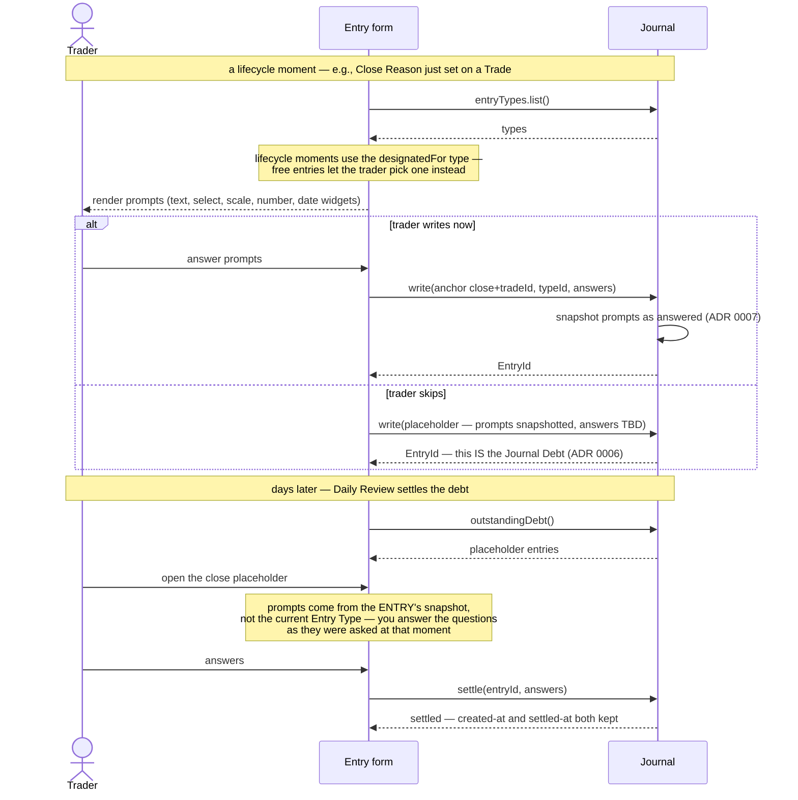

# Journal — initial interface design

All trader writing. Self-contained: knows nothing about Trade lifecycle (the UI writes entries at the right moments per the TradeBook sequences), and Journal Debt derives entirely from its own placeholder entries.

## Interface

```typescript
interface Journal {
  write(draft: EntryDraft): Promise<EntryId>            // full entry — or a TBD placeholder (how "skip" works, ADR 0006)
  settle(entryId: EntryId, answers: PromptAnswer[]): Promise<void>   // complete a placeholder — completion, not editing
  entriesFor(query: AnchorQuery): Promise<Entry[]>      // { trade: id } → everything anchored inside that Trade
  timeline(range?: DateRange, filter?: TimelineFilter): Promise<Entry[]>   // the growth story
  countFor(tradeId: TradeId): Promise<number>
  outstandingDebt(): Promise<Entry[]>                   // = unsettled placeholders; Review consumes this
  entryTypes: ListRegistry<EntryType>                   // same generic as TradeBook registries
}

type Anchor =
  | { kind: 'standalone' }
  | { kind: 'trade';     tradeId: TradeId }
  | { kind: 'plan';      tradeId: TradeId }
  | { kind: 'revision';  tradeId: TradeId; revisionId: RevisionId }
  | { kind: 'execution'; tradeId: TradeId; executionId: ExecutionId }
  | { kind: 'close';     tradeId: TradeId }
  | { kind: 'review';    date: ISODate; tradeId?: TradeId }
  | { kind: 'deviation'; tradeId: TradeId; deviationId: DeviationId }  // ADR 0012's "journal-linkable"
  | { kind: 'entry';     entryId: EntryId }             // an addendum — how immutable entries grow

interface Entry {
  id: EntryId
  at: Timestamp                                         // the lifecycle moment it belongs to
  anchor: Anchor
  entryTypeId: string
  answered: { prompt: Prompt; answer: PromptAnswer }[]  // snapshotted at write time (ADR 0007)
  placeholder: boolean
  settledAt?: Timestamp                                 // late journaling is visible: at vs settledAt
}

interface EntryType {
  id: string
  name: string
  designatedFor?: 'plan' | 'revision' | 'close' | 'review'   // which moment uses this type (seeded; re-designatable)
                                                         // 'review' = the Trade Review checkpoint; its select prompt IS the Action list
  prompts: Prompt[]
}

interface Prompt {
  id: string
  text: string
  kind: 'text' | 'select' | 'scale' | 'number' | 'date' // multi-select deferred until a real prompt demands it
  options?: string[]                                    // select
  scale?: { min: number; max: number }                  // scale
}
```

## Decided semantics

- **Entries are immutable; growth happens by addendum.** A written reflection is never edited — hindsight rewriting is exactly the self-deception a journal exists to catch (same philosophy as immutable Plans). An addendum is an ordinary Entry anchored `{ kind: 'entry' }` to its parent — no extra operation. Settling a placeholder is completion, not editing, and is always allowed.
- **Placeholders are the debt.** "Skip" writes a TBD placeholder silently; `outstandingDebt()` is just the unsettled-placeholder query — no cross-Book derivation. A settled placeholder keeps both timestamps, so "how late do I journal?" is queryable behavioral data for free.
- **Prompts answer in five kinds** — text, select-one, scale, number, date — enough for "emotional state" and "conviction 1–5" to be genuinely queryable in growth analysis while staying answerable in seconds.
- **Schema drift is tolerated by construction** (ADR 0007): each Entry snapshots its prompts as answered; Entry Type changes affect only future entries; `timeline` renders mixed shapes.
- **Placeholders snapshot their prompts at creation, and `settle()` answers that snapshot** — even if the Entry Type changed in between. You answer the questions as they were asked at the lifecycle moment, not today's revision of them.
- **Every in-Trade anchor carries `tradeId`** so `entriesFor({trade})` is one indexed query returning the whole campaign narrative — the trade-detail-page requirement.
- **Lifecycle moments map to designated Entry Types** via `designatedFor` on the seeded types (Plan, Revision, Close); the trader may edit their prompts or designate different types. Review Note and Trader Reflection ship undesignated.

## Sequence: composing, saving, and settling an entry



## Managing Entry Type structure

An EntryType *contains* its prompt list, so changing what a kind of entry asks is a whole-definition save — there are no fine-grained prompt operations (`addPrompt`, `reorderPrompts`, …) by design: editing a form is naturally a whole-form act, and ADR 0007 makes replacement safe by construction (existing entries keep their snapshotted prompts, so no historical shape can be corrupted — which also means EntryTypes need no version history of their own).

```typescript
const t = (await journal.entryTypes.list()).find(t => t.name === 'Plan')
t.prompts.push({ id: 'conviction', text: 'Conviction?', kind: 'scale', scale: { min: 1, max: 5 } })
await journal.entryTypes.save(t)     // future entries get the new structure — old entries keep theirs
```

Individual entry content has exactly two operations — `write()` and `settle()` — because entries are immutable; "editing an entry" is intentionally impossible (append an addendum instead).

## Open items

- Prompt *content* of the seeded default Entry Types — a Slice 1 design task (rich defaults were the requirement).
- `TimelineFilter` shape — settle alongside `TradeFilter` in the Analytics drill-down.
