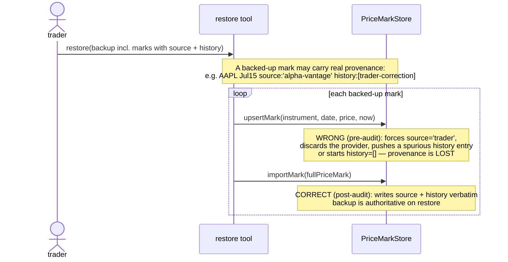
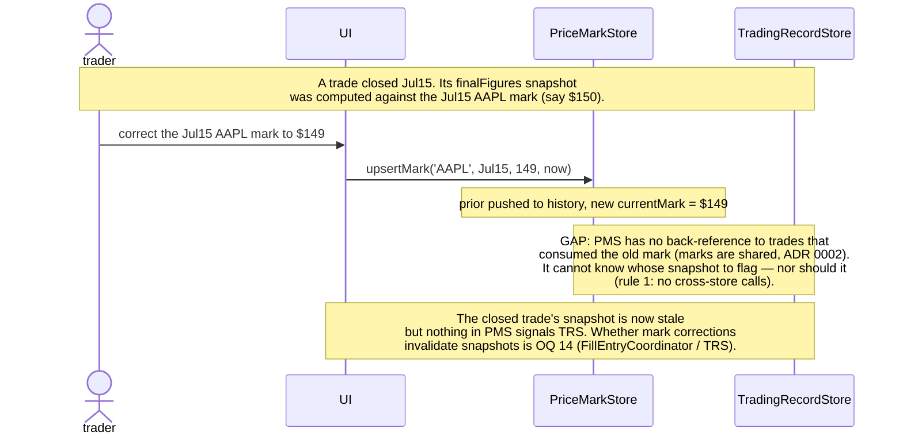

# PriceMarkStore — initial interface design

End-of-day Price Marks: a single end-of-day price for one instrument on one date,
keyed `(instrument, date)`, shared and deduplicated across Trades (ADR 0002). Three
Trades involving AAPL all read the one AAPL mark for July 15. A pure-fact store —
no P&L, no risk, no derivation beyond assembling the `Marks` map that
CalculationModule consumes. It holds facts only, over an injected StorageBinding
(rule 5).

It owns the exported `buildMarksFromFills` op (the deep read absorbing "distinct
instruments + per-instrument lookup" so FillEntry, DailyReview, and the evolution
chart never duplicate it), the chart's price-axis series, and the write paths that
set marks. It deliberately owns **no provider configuration** — `source` is
provenance on the mark, not configuration of the source (see exported requirement
→ PriceProviderStore).

Five operations, over an injected StorageBinding — testable with an in-memory
binding, no mock, no real backend:

```ts
/** TRADER force-write: initial entry or correction. source ← 'trader'. If a mark
 *  already exists for (instrument, date), pushes the prior currentMark to history
 *  before overwriting — provenance is append-only. */
upsertMark(instrument: InstrumentId, date: Date, price: Price, at: Date): void

/** AUTOMATED write-if-absent — records the provider. No-ops if (instrument, date) is
 *  already settled: this no-op IS the set-once protection. A re-sync can't clobber a
 *  mark the trader accepted or corrected. history starts empty. Retired provider ids
 *  stay valid on historical marks (forward-only retained — Taxonomy parallel). */
backfillMark(instrument: InstrumentId, date: Date, price: Price, provider: ProviderId, at: Date): void

/** Build the Marks map calc consumes — scalar, no source/history (calc doesn't care
 *  about provenance). Distinct instruments in fills, at one date. Instruments lacking
 *  a mark are OMITTED — Map.get returns undefined → calc returns null for mark-dependent
 *  fields. One op absorbs the build-marks step for FillEntry (close), DailyReview, and
 *  the evolution chart. */
buildMarksFromFills(fills: Fill[], date: Date): Marks

/** The chart's price axis AND the quality-analytic read — full PriceMark records
 *  (incl. source + history) across a date range, sparse (absent dates omitted; the
 *  chart connects available points). Chart reads .currentMark.price; analyzer reads
 *  .currentMark.source + .history. */
getMarkSeries(instrument: InstrumentId, from: Date, to: Date): PriceMark[]

/** Restore a fully-formed mark verbatim — current value + full provenance + complete
 *  history — in one call (ADR 0002 facts survive backup/restore). Unlike upsertMark
 *  (which forces source:'trader' and pushes any prior to history) and backfillMark
 *  (which no-ops on present and starts history empty), importMark writes exactly
 *  what it's given. Used by the restore path only. On a present key, it overwrites
 *  wholesale (the backup is authoritative on restore). */
importMark(mark: PriceMark): void
```

---

## Interface

### Operations

```ts
upsertMark(instrument: InstrumentId, date: Date, price: Price, at: Date): void

backfillMark(
  instrument: InstrumentId,
  date:       Date,
  price:      Price,
  provider:   ProviderId,
  at:         Date,
): void

buildMarksFromFills(fills: Fill[], date: Date): Marks

getMarkSeries(instrument: InstrumentId, from: Date, to: Date): PriceMark[]

importMark(mark: PriceMark): void
```

### Types

```ts
/** Identifiers (type aliases for readability; backing type is string).
 *  Defined in calculation-module.md; restated here for local readability. */
type InstrumentId = string
type Price        = number

/** Marks is the scalar map calc consumes — Map<InstrumentId, Price>.
 *  Defined in calculation-module.md; restated here. buildMarksFromFills returns it. */
type Marks = Map<InstrumentId, Price>

/** Who set this mark's value: 'trader' for manual entry, or a market-data provider
 *  id ('alpha-vantage', 'tiingo', …). Provenance, not configuration — see exported
 *  requirement → PriceProviderStore. Retired provider ids remain valid on historical
 *  marks (forward-only retained — the Taxonomy pattern, CONTEXT.md). */
type ProviderId = string

/** The natural unit of a mark's value-with-provenance: who set it, when, at what
 *  price. The current value and every superseded value are the SAME kind of thing —
 *  history.push(currentMark) is type-trivially correct, and the two shapes can't
 *  drift apart over time. */
type MarkEntry = {
  source: ProviderId
  at:     Date          // when this value was set (codebase convention: `at`)
  price:  Price
}

/** A Price Mark — one instrument, one end-of-day date. A shared, deduplicated fact
 *  keyed (instrument, date) (ADR 0002). The current value + its provenance live on
 *  currentMark; superseded values accumulate append-only on history. MVP fields only —
 *  no OHLC (sequenced out: the MVP chart is a line through end-of-day scalars; OHLC
 *  bars arrive only with automated quotes, CONTEXT.md). */
type PriceMark = {
  instrument:  InstrumentId
  date:        Date          // the PRICING date — part of the (instrument, date) key (ADR 0002)
  currentMark: MarkEntry     // the current value + its provenance
  history:     MarkEntry[]   // superseded values, append-only; empty until first overwrite
}
```

---

## Decided semantics

Each ruling cites the principle or ADR it derives from. Veto any during review.

1. **Five operations: `upsertMark`, `backfillMark`, `buildMarksFromFills`,
   `getMarkSeries`, `importMark`.** No `deleteMark` (correction = overwrite via
   `upsertMark`). No single-point `getMark` (subsumed by `buildMarksFromFills` — pass
   a one-fill list, or by `getMarkSeries` for a single-date range). `importMark` was
   added by the sequence-diagram audit (decided semantics 13) once `source` + `history`
   made `upsertMark` unable to restore a mark verbatim — see *Alternatives considered*
   and the audit findings table. *(Depth; deletion test — every removed op was a
   pass-through; the audit added the one op that earned its keep.)*

2. **`source: ProviderId` is provenance on the mark, not configuration of the
   source.** A mark records *who set this value* — `'trader'` for manual entry, or a
   provider id for automated. It serves three consumers: display ("you entered this"
   vs "the API gave this"), provider switching (reconfigure the fetcher with a new
   active id; new marks carry it, historical marks keep their original — the
   forward-only-retained pattern CONTEXT.md establishes for Taxonomy), and source
   quality analytics (the original motivation: quantify a provider's accuracy).
   `source` is *not* a foreign key the store validates — retired provider ids stay
   valid on old marks forever, exactly as retired Taxonomy values do. Provider
   configuration (which providers exist, which is active, credentials) is a separate
   module — see exported requirement → PriceProviderStore. *(ADR 0002; CONTEXT.md:
   Taxonomy forward-only-retained; charter discipline — provider config would drift
   this store's purpose.)*

3. **Two write ops encode the set-once model structurally.** `upsertMark` is the
   trader path: force-write, `source ← 'trader'`. `backfillMark` is the automated
   path: write-if-absent, records the provider. A fetcher cannot clobber a settled
   mark because it has no force op — `backfillMark` no-ops on a present slot. The
   trader always can. The override semantic ("manual entry retained as
   fallback/override," CONTEXT.md: Price Mark) holds by construction, not by
   fetcher discipline. This mirrors TradingRecordStore making `recordFill` the only
   status-mutating op — the invariant is structurally unbreakable rather than
   caller-enforced. *(TradingRecordStore decided semantics 2; charter —
   PriceMarkStore's job is to hold the set-once invariant, not trust the fetcher.)*

4. **`buildMarksFromFills` returns scalar `Marks` (`Map<InstrumentId, Price>`), not
   full `PriceMark` records.** Calc's data contract is `Map<InstrumentId, Price>`
   (calculation-module.md); `source` and `history` are provenance that calc doesn't
   consume. Returning full records would tax every call site (FillEntry close,
   DailyReview, the evolution chart's per-day loop) with a `.currentMark.price`
   projection — exactly the repetition the deep op exists to remove. The split is
   clean: `buildMarksFromFills` → scalar (calc feed), `getMarkSeries` → full records
   (chart + analytics). Each op returns exactly what its consumer needs.
   *(CalculationModule data contract; depth — the op's primary job is to feed calc,
   and calc wants a bag of numbers.)*

5. **Missing mark = omission, not sentinel or throw.** `buildMarksFromFills` omits
   instruments lacking a mark for the date; `Map.get` returns `undefined`; calc
   treats that as "no mark" → `null` for mark-dependent fields (calculation-module.md
   decided semantics 4). This closes OQ 1's downstream: the missing-mark contract is
   omission, confirming calc's `Marks: Map<InstrumentId, Price>` implication. *(OQ 1
   → B; calculation-module.md decided semantics 4.)*

6. **The store normalizes `date` to calendar-date for the key.** Input is `Date`,
   but the store strips time-of-day so `upsertMark('AAPL', <Jul 15 16:00>, …)` and a
   later `upsertMark('AAPL', <Jul 15 20:00>, …)` hit the same key. Marks are
   end-of-day, date-granularity facts (ADR 0002). Key normalization is the store's
   invariant, not caller discipline — callers can pass any `Date` in the day.
   *(ADR 0002.)*

7. **`history` is append-only; overwriting pushes the prior `currentMark`.** On
   `upsertMark` against an existing mark, the store reads the prior `currentMark`,
   appends it to `history`, then sets the new `currentMark`. Both are `MarkEntry` —
   the same type — so the push is type-trivially correct and the two shapes can't
   drift. `backfillMark` never appends to history (it no-ops on a present slot, so
   there's nothing to push; on a successful first write, `history` starts empty).
   This makes the full write-trail of any mark recoverable as `[...history,
   currentMark]` — the quality-analytic signal (accepted provider marks, rejected
   values, discrepancy magnitudes, correction latency) is captured at the store
   before any analyzer exists. *(CONTEXT.md append-only pattern — Plan Revisions
   ADR 0001, journal-entry stream; asymmetric-information capture — overwritten
   values can't be reconstructed later.)*

8. **`at: Date` is on `MarkEntry` (and therefore on `currentMark`) because the
   history feature requires it.** When a trader overwrites, the store pushes the
   prior value into `history` stamped with its when-set — but it can only stamp that
   entry if the prior value was carrying its when-set. First overwrite would lose
   the prior's when-set unless the current mark has one. So `at` appears on the mark
   not as a speculative addition but as a derived requirement of the append-on-
   overwrite rule. Naming follows the codebase convention for "when an event
   happened" (`fill.at`, `revision.at`, `committedAt`, `closedAt`); the pricing date
   stays `date` (ADR 0002's key), avoiding a `date`/`date` collision. *(Drafting
   finding — surfaced by the history feature.)*

9. **`MarkEntry` is the shared type for current and historical values.** The current
   value and every prior value are the same kind of thing: `{source, at, price}`.
   Naming it `MarkEntry` (not `MarkHistoryEntry`) makes the unit first-class and
   lets `PriceMark` carry a `currentMark: MarkEntry` alongside
   `history: MarkEntry[]`. The append-on-overwrite reads as plain English:
   `history.push(currentMark); currentMark = newEntry`. *(Type symmetry; depth — one
   type where two near-identical structs would drift.)*

10. **`getMarkSeries` returns full `PriceMark` records, sparse, date-sorted.** Only
    dates that have a mark appear; weekends and skipped reviews are absent (the chart
    connects available points). Sorted ascending by date. Returns the full record
    (incl. `source` + `history`) so the chart can tint by provider and the analyzer
    can read provenance. *(Store of facts returns what exists, not interpolated
    values; the chart and the analyzer are the two full-record consumers.)*

11. **No OHLC in the mark type.** The MVP renders the underlying price as a simple
    line through end-of-day scalars; OHLC bars arrive only with automated quotes
    (CONTEXT.md: Price Mark — "OHLC bars and candlestick rendering are introduced
    only when automated quotes arrive"). The `Price` scalar is the MVP shape; a
    later release may add an OHLC variant, but the mark type is not pre-shaped for
    it — when OHLC ships it arrives as an addition (a richer `MarkEntry.price` or a
    sibling field), not a reshape of these ops. *(Sequencing; CONTEXT.md.)*

12. **StorageBinding is the persistence seam — zero business rules.** All five ops
    delegate to put/get/range-query over opaque fact records. Two implementations:
    in-memory (unit tests) and real (prod). No per-backend business rules.
    *(Overview rule 5.)*

13. **`importMark` restores a mark verbatim — source + full history preserved
    (audit finding A, resolved).** This op exists *because* `source` and `history`
    do. Early in the session (before provenance was added) a mark was atomic
    `{instrument, date, price}` and writing it verbatim was identical to `upsertMark`,
    so no separate import op was needed — a correct call then. But once `source` and
    `history` landed, `upsertMark` could no longer restore a mark verbatim: it forces
    `source: 'trader'` (discarding the original provider) and pushes the existing
    `currentMark` to `history` (creating a spurious entry, or starting a fresh
    `history: []` on an empty key — neither reproduces the backup). The cold-start
    restore diagram exposed this: a backup of a provider-sourced mark with a real
    write-trail would restore as a sourceless, historyless trader mark. `importMark`
    writes exactly the `PriceMark` it's given — provenance and history intact — so
    backup/restore is lossless. On a present key it overwrites wholesale (the backup
    is authoritative on restore). Same pattern as `TradingRecordStore.importTrade`,
    earned for the same reason: the live write ops (`upsertMark`/`backfillMark`) build
    a mark's state through rules (force-trader-source, append-on-overwrite,
    write-if-absent) that a verbatim restore must bypass. *(ADR 0002 — facts survive
    backup/restore; audit finding A; same shape as TradingRecordStore decided
    semantics 13.)*

---

## Worked examples

### Manual entry during the Daily Review — AAPL at $150, July 15

Three open Trades all involve AAPL. The trader enters AAPL's price once during the
review; all three pick it up (ADR 0002).

```ts
// Daily Review write path (one entry, deduplicated):
priceMarks.upsertMark('AAPL', new Date('2024-07-15'), 150, new Date('2024-07-15T20:00:00Z'))
// → mark = { instrument:'AAPL', date:Jul15,
//            currentMark:{ source:'trader', at:20:00, price:150 }, history:[] }

// The three open Trades all read it via buildMarksFromFills:
for (const trade of openTrades) {
  const marks = priceMarks.buildMarksFromFills(trade.fills, july15)
  // → Map { 'AAPL' => 150 }   (same Map for all three; the one mark, looked up)
  const figures = calc.evaluate(trade, marks, july15)
}
```

### Automated backfill then trader override — the set-once protection

The (roadmap) market-data API syncs during the Daily Review, then the trader
disagrees and corrects. Next day, the API re-syncs.

```ts
// Day 1 — API fetcher sees no mark for AAPL/Jul15, fetches, writes:
priceMarks.backfillMark('AAPL', july15, 150.10, 'alpha-vantage', new Date('2024-07-15T16:00:00Z'))
// → mark = { date:Jul15, currentMark:{ source:'alpha-vantage', at:16:00, price:150.10 }, history:[] }

// Day 1 — review: trader thinks the API close is off, corrects:
priceMarks.upsertMark('AAPL', july15, 150.00, new Date('2024-07-15T20:00:00Z'))
// → prior currentMark pushed to history, new currentMark set:
// → mark = { date:Jul15,
//            currentMark:{ source:'trader', at:20:00, price:150.00 },
//            history:[{ source:'alpha-vantage', at:16:00, price:150.10 }] }

// Day 2 — API re-sync attempts Jul15 again (fetcher logic re-runs):
priceMarks.backfillMark('AAPL', july15, 150.10, 'alpha-vantage', new Date('2024-07-16T16:00:00Z'))
// → NO-OP: (AAPL, Jul15) is already settled. The trader's $150.00 SURVIVES.
// → mark unchanged.
```

The override holds by construction: `backfillMark` has no force path. The full
write-trail is recoverable as `[...history, currentMark]` = `[$150.10/alpha-vantage
@16:00, $150.00/trader @20:00]` — discrepancy `$0.10`, correction latency 4h. That
is the quality-analytic signal.

### The evolution chart — sparse price series across a range

```ts
// Chart's price axis for AAPL across the trade's duration (say Jul 15–Aug 15):
const series = priceMarks.getMarkSeries('AAPL', july15, aug15)
// → [ { instrument:'AAPL', date:Jul15, currentMark:{…}, history:[…] },
//     { instrument:'AAPL', date:Jul16, currentMark:{…}, history:[…] },
//     … (absent dates — weekends, skipped reviews — simply omitted) ]
// Chart plots .currentMark.price per date, connecting available points.
```

### Provider switch — historical marks keep their original provider

```ts
// Before: fetcher configured with 'alpha-vantage'. Marks carry source:'alpha-vantage'.
// Switch: trader reconfigures the fetcher's active provider to 'tiingo' (in the
//         PriceProviderStore — not this store's concern). New fetcher runs:
priceMarks.backfillMark('AAPL', aug16, 162.00, 'tiingo', …)
// → new marks carry source:'tiingo'. Existing marks (Jul15, etc.) keep
//   source:'alpha-vantage' — unchanged. Retired id 'alpha-vantage' stays valid on them.
```

---

## Sequence: daily-review mark-collecting (the two-phase loop)

The Daily Review is the primary mark-collecting moment (CONTEXT.md). The
coordinator's view resolves which underlyings lack a mark (`marksDue`); the UI
collects from the trader and writes each mark **directly** (rule 8 — a
single-store act), then re-queries. (Pinned in
[daily-review-coordinator.md](daily-review-coordinator.md); shown here for the
store's half.)

```
UI → DailyReviewCoordinator.runDailyReview(today)        // the view incl. marksDue
trader enters each due end-of-day price
UI → PriceMarkStore.upsertMark(instrument, today, price, now)   // DIRECT write, deduped (ADR 0002)
UI → DailyReviewCoordinator.runDailyReview(today)        // re-query (rule 6)
  → marks = PriceMarkStore.buildMarksFromFills(allOpenFills, today)   // ONE map, every calc call
```

The deduplication payoff (ADR 0002): the trader enters AAPL once; `buildMarksFromFills`
resolves it for every Trade holding an AAPL fill. The write is per-instrument-per-date;
the read is one build over all open fills.

## Sequence: automated backfill (the roadmap API path)

```
market-data fetcher (scheduled, e.g. end of session)
  → for each instrument the journal tracks:
      → existing = PriceMarkStore.getMarkSeries(instrument, from, today)
      → settledDates = existing.map(m => m.date)
      → missingDates = business days in [from, today] not in settledDates
      → for each missingDate:
          → price = marketDataApi.fetch(instrument, missingDate)
          → PriceMarkStore.backfillMark(instrument, missingDate, price, provider, now)
              └─ if still absent: writes (history starts empty)
              └─ if meanwhile settled (trader entered it): no-op, trader's mark wins
```

This flow shows the interface already serves the API deliverable without new ops:
the fetcher reads `getMarkSeries` to find missing dates, then `backfillMark` each.
`upsertMark` is the trader's force path; `backfillMark` is the fetcher's gentle
path. The set-once protection is structural (`backfillMark` no-ops on present
slots), so a buggy or over-eager fetcher cannot clobber settled marks.

---

## Requirements fulfilled / exported

### Closed here (open questions resolved)

| OQ | Resolution |
|---|---|
| **1 (downstream) — missing-mark contract** | **Omission.** `buildMarksFromFills` omits instruments lacking a mark; `Map.get` → `undefined`; calc returns `null` for mark-dependent fields. Confirms the `Marks: Map<InstrumentId, Price>` implication. |
| **(exported from CalculationModule) — `buildMarksFromFills`** | **Defined and returning scalar `Marks`.** One deep op absorbing the build-marks step for FillEntry (close), DailyReview, and the evolution chart. Return shape decided: scalar `Map<InstrumentId, Price>` (calc's contract), not full records — see decided semantics 4. |

### Audit findings (sequence-diagram audit) — applied in this session

The audit drew four candidate flows and applied the yield test. Two were drawn
(cold-start restore; mark-correction ripple); two were skipped with reason
(unowned-detection — the "notice missing marks" trigger lives in the Daily Review
coordinator and the roadmap fetcher, not the store, and `getMarkSeries` already
serves the fetcher's "find missing dates" read; gap/late — a skipped day yields an
absent mark → `buildMarksFromFills` omits → calc returns `null` → the Daily Review
prompts for it, fully served, no finding).

| Finding | Category | Resolution |
|---|---|---|
| **A — `upsertMark` cannot restore a mark verbatim once `source` + `history` exist.** Before provenance was added, a mark was atomic and writing it verbatim was identical to `upsertMark`. But `upsertMark` forces `source: 'trader'` (discarding the provider) and pushes any prior to `history` (creating a spurious entry or a fresh `[]`). A backup of a provider-sourced mark with a real write-trail would restore as a sourceless, historyless trader mark — silent provenance loss. | Missing operation | **`importMark` added** (decided semantics 13). Writes exactly the `PriceMark` given — source + full history intact — so backup/restore is lossless. Same shape of finding that grew TradingRecordStore from 6→7 ops (`importTrade`). |
| **B — A mark correction can stale a closed-trade snapshot, but PriceMarkStore has no signal path to TradingRecordStore.** Correcting AAPL's July-15 mark changes the unrealized-P&L that a *closed* trade's snapshot computed against (ADR 0007). But marks are shared (ADR 0002) with no back-reference to consuming trades, so this store can't know whose snapshot to invalidate — nor should it (rule 1: no cross-store calls). | Unowned responsibility (exported) | **Exported** to FillEntryCoordinator / TradingRecordStore (OQ 14). ADR 0007 currently scopes invalidation to fill corrections + calc fixes; whether *mark* corrections join is a downstream decision. See Open items. |

## Sequence: cold-start restore (audit diagram A — provenance loss without importMark)



This diagram is what exposed finding A. The fix is `importMark` (decided semantics
13): a dedicated verbatim-write op that bypasses `upsertMark`'s force-trader-source
and append-on-overwrite rules, because those rules express *live-entry* semantics a
restore must not impose on historical data.

## Sequence: mark correction rippling to a closed-trade snapshot (audit diagram B — an unowned signal)



Finding B is *exported*, not resolved here: this store has no business knowing
which trades consumed a mark (that would require a back-reference index across the
shared/deduplicated keying that ADR 0002 deliberately removes). The decision —
whether mark corrections join ADR 0007's invalidation triggers (currently fill
corrections + calc fixes only) — belongs to the session that owns the snapshot
regeneration path. Recorded as OQ 14.

### Exported to downstream sessions (commitments)

- **→ PriceProviderStore (new module, step-5 reference session):** provider
  configuration — which providers exist, which is active, credentials. `source:
  ProviderId` on a mark is provenance that *references* a provider id, exactly as
  `strategy: StrategyId` on a Trade references TaxonomyStore. The registry is
  forward-only-retained (retired provider ids stay valid on historical marks).
  Provisional ~3 ops: `listProviders`, `setActiveProvider`, `addProvider`/
  `configureProvider`. PriceMarkStore is provider-id-opaque; display resolution
  (id → human name) is a read-side coordinator join, not this store's job. This is
  a partition addition (overview module table gains a row); see overview sync.
- **→ FillEntryCoordinator (close path):** calls
  `priceMarks.buildMarksFromFills(simFills, now)` before `calc.evaluate` to build
  the close-snapshot marks. Already reflected in TradingRecordStore's close path
  and the overview walkthrough.
- **→ DailyReviewCoordinator:** owns the mark-DUE resolution and the read path
  (`buildMarksFromFills` → evaluate; `marksDue` = wanted instruments − map keys,
  computed in hand). The WRITE is the UI's direct `upsertMark` (rule 8 — a
  single-store act; refined by the DailyReview session, which corrected this
  export's original "owns `upsertMark` each" sketch). See
  [daily-review-coordinator.md](daily-review-coordinator.md) semantics 3 + 5.
- **→ the (roadmap) market-data fetcher:** consumes `getMarkSeries` (find missing
  dates) + `backfillMark` (write-if-absent). No new op is needed when the API ships
  — the interface is API-ready now because `backfillMark` + provenance already
  exist. This is the real reason the overview's "the API adapter arrives later
  without changing the store's interface" claim holds (the prior wording's premise
  was wrong; the sync fixes it).
- **→ Backup/restore (OQ 8):** this store's restore slice is served by `importMark`
  — a verbatim mark write preserving source + full history (decided semantics 13,
  added by the audit). The broader backup architecture (OQ 8) remains open globally.
- **→ CalculationModule (ripple, applied in this session):** none required. calc's
  `Marks: Map<InstrumentId, Price>` is served exactly by `buildMarksFromFills`. No
  type changes in calculation-module.md.

---

## Open items

| Item | Owned by |
|---|---|
| **OQ 8 — backup/export/import architecture.** This store's restore slice is served (`importMark` writes a verbatim mark with source + history intact, decided semantics 13). ~~The broader architecture (storage-seam fan-out vs. coordinator) remains open globally.~~ **Narrowed by ADR 0011 + the StorageBinding session** — full backup is the single-file database (copy the file); the remainder is the export format + cross-device transfer UX, owned by the backup/restore feature design (see the overview's OQ 8). | backup/restore feature design (OQ 8 remainder) |
| **OQ 9 — multi-fact write atomicity.** ~~`upsertMark` against an existing mark is a read-modify-write (read prior → push to history → write new) — a single-store multi-fact write that should be atomic, same class as `recordFill`'s close path. Whether atomicity comes from the StorageBinding (a transaction primitive) or the store's own batching is OQ 9.~~ **RESOLVED by the StorageBinding drill-down** ([storage-binding.md](storage-binding.md) semantic 3): single-threaded writer ⇒ the read-modify-write is one atomic whole-value `put` — no transaction needed; the primitive is reserved for cross-collection flows. | [storage-binding.md](storage-binding.md) ✓ |
| **PriceProviderStore (new module).** Provider configuration — list/activate/configure providers. A partition addition; joins the step-5 reference-session cluster (AccountStore + TaxonomyStore). Provisional ~3 ops. | step-5 reference session |
| **StorageBinding shape.** ~~This store assumes put/get/range-query over opaque records (overview rule 5). `getMarkSeries` needs a range query on (instrument, date); whether the binding supports compound range filters or the store filters in memory is deferred.~~ **RESOLVED by the StorageBinding drill-down** ([storage-binding.md](storage-binding.md)): primary key is the composite `` `${instrument}|${date}` `` (ISO dates sort lexicographically), so `getMarkSeries` is a native primary-key prefix+bounds range; point reads (`buildMarksFromFills`) are keyed gets. No indexes declared. | [storage-binding.md](storage-binding.md) ✓ |
| **OHLC when automated quotes ship.** The mark type is `Price` (scalar) for the MVP line chart. OHLC arrives with the API deliverable as an addition, not a reshape — the exact shape (richer `MarkEntry.price` vs a sibling field) deferred to the API-release drill-down. | API-release drill-down |
| **Quality-analytic consumer.** The `history` field captures the write-trail; the consumer that reads it (source-quality report) is a later analytics feature, not this store's concern. | later analytics feature |
| **`ProviderId` generation / format.** `'trader'` is fixed; provider ids are configured in PriceProviderStore. Format (UUID, slug like `'alpha-vantage'`) is an implementation detail of that store. | PriceProviderStore / implementation |
| **OQ 14 — mark correction invalidating a closed-trade snapshot (audit finding B, exported).** A mark correction changes the unrealized-P&L a closed trade's snapshot was computed against (ADR 0007), but PriceMarkStore has no back-reference to consuming trades (marks are shared, ADR 0002) and must not call across stores (rule 1). ADR 0007 currently scopes snapshot invalidation to fill corrections + calc fixes; whether *mark* corrections join is a downstream decision. The detection (which closed trades used the old mark?) and the response (regenerate the snapshot via `record.closedAt` as `asOf`) both belong to the session that owns the regeneration path. | FillEntryCoordinator / TradingRecordStore (OQ 12 owner) |

---

## Alternatives considered

### Sourcing model (how the manual/automated distinction is represented)

- **Option A — `source` field + sticky-manual precedence (rejected).** Provenance as
  data on the mark; the store enforces "manual wins" — an automated write to a slot
  holding a manual mark is blocked. Considered first; rejected after the user's
  "once a mark is set for a date, that date should never be queried again" model
  dissolves the precedence question entirely: the two sources never compete for the
  same slot, so a precedence comparator is machinery with no case to handle.

- **Option B — two write ops, no source field (rejected).** `upsertMark` (force,
  manual) + `backfillMark` (write-if-absent, automated); override falls out of
  backfill's no-op-on-present. The set-once model (adopted) keeps this op split, but
  the user required `source` retained for display, provider switching, and source-
  quality analytics — so B's "no source field" half was rejected. The op split from
  B survives into the adopted design.

- **Option C — set-once via fetcher discipline, `source` retained (rejected).** A
  single `upsertMark` for both paths; the fetcher is responsible for not re-querying
  settled dates. Simplest store. Rejected because it makes the override invariant
  caller-enforced (a buggy fetcher calling `upsertMark` on a settled date silently
  clobbers) — weaker than the structural enforcement the project's pattern prefers
  (TradingRecordStore made `recordFill` the only status-mutating op for exactly this
  reason). The adopted design takes the structural path: `backfillMark` no-ops on
  present slots, so clobbering is impossible regardless of fetcher behavior.

### `buildMarksFromFills` return shape (exported from CalculationModule as this store's call)

- **Option A — scalar `Marks` (adopted).** Returns `Map<InstrumentId, Price>` —
  exactly what `calc.evaluate` takes. Every caller (FillEntry close, DailyReview,
  evolution chart) passes it straight through with zero projection. Honors "serve
  the data contract" over "return facts": the op's primary job is to feed calc, and
  calc wants a bag of numbers. The full-record need (source, history) is served by
  `getMarkSeries` instead — so nothing is lost, each consumer gets exactly its shape.

- **Option B — full `PriceMark` records projected to scalar (rejected).** Returns
  `Map<InstrumentId, PriceMark>`; every caller projects `.currentMark.price` before
  calc can consume it. That projection repeated at every call site is exactly the
  repetition the deep op was created to remove — paid for provenance calc doesn't
  consume. Inverts the optimization toward a secondary (display/analytics) use and
  away from the primary (calc feed).

### Module shape (design-it-twice — skipped, with reason)

- The overview estimated ~4 ops; this design lands at 4. Design-it-twice was
  skipped because the module is a small fact store with one deep assembly op
  (`buildMarksFromFills`), one range read (`getMarkSeries`), and a write path whose
  shape is dictated by the set-once model (two ops for the two rights). The op set
  is forced by the contract (calc's `Marks`) and the sourcing model; there is no
  radically different partition of the same behavior to compete. The two sub-
  questions the overview flagged — the `buildMarksFromFills` return shape and the
  API-seam shape — were worked inline (return shape: Alternatives just above; API
  seam: sourcing-model Alternatives). Per the drill-down skill: skipping is allowed
  for thin modules where one shape is obvious, provided the skip is named.

### Separate `importMark` (initially rejected, then adopted by the audit)

- **Initial rejection (pre-provenance, correct at the time):** a mark was atomic
  `{instrument, date, price}` with no lifecycle, no status, no fill history to
  replay forward. Writing a mark verbatim was identical to `upsertMark`. Contrast
  `TradingRecordStore.importTrade`, which earns its keep because `commit`+
  `recordFill` build a Trade forward through the live timeline and cannot express a
  historical Closed record without replaying fills against import-time marks — a
  problem that did not exist for marks. The deletion test removed `importMark`.

- **Reversed by the audit (decided semantics 13), after `source` + `history`
  landed:** once provenance was added, `upsertMark` could no longer restore a mark
  verbatim — it forces `source: 'trader'` (discarding the provider) and pushes any
  prior to `history` (creating a spurious entry, or starting a fresh `history: []`).
  The cold-start restore diagram (audit finding A) showed a backup of a
  provider-sourced mark with a real write-trail restoring as a sourceless,
  historyless trader mark — silent provenance loss. `importMark` writes exactly the
  `PriceMark` given, bypassing the live-entry rules a restore must not impose. It
  now earns its keep for the same reason `importTrade` does: the live write ops
  build state through rules that a verbatim restore must bypass. This is recorded
  honestly as a session-internal reversal — the earlier call was right for the
  design it was made against, and wrong once the design changed.
