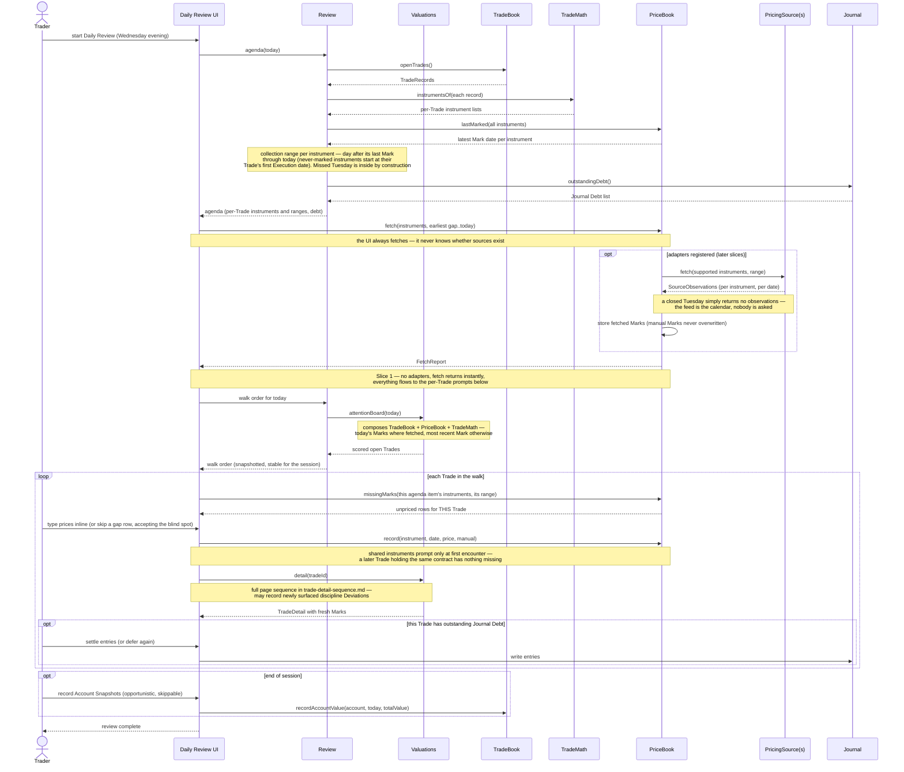
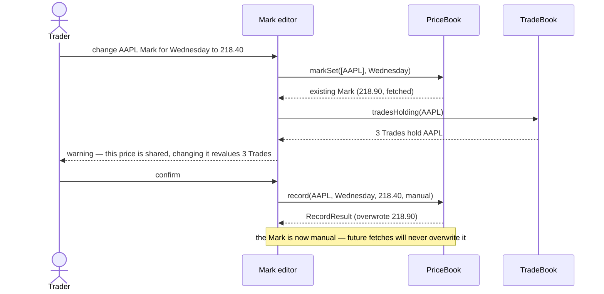

# PriceBook — initial interface design

The price-observation Book: Marks now, Daily Bars later, external providers behind the PricingSource seam. Knows nothing about Trades — callers tell it which instruments they care about; it answers about prices only.

## Interface

```typescript
interface PriceBook {
  record(instrument: InstrumentKey, date: ISODate, price: Money,
         origin: 'manual' | 'fetched'): Promise<RecordResult>
  markSet(instruments: InstrumentKey[], date: ISODate): Promise<MarkSet>
  series(instruments: InstrumentKey[], range?: DateRange): Promise<MarkSeries>
  missingMarks(instruments: InstrumentKey[], range: DateRange): Promise<{ instrument: InstrumentKey; date: ISODate }[]>
  lastMarked(instruments: InstrumentKey[]): Promise<Map<InstrumentKey, ISODate | undefined>>
                                              // per-instrument gap starts — instruments have different gaps,
                                              // and a never-marked instrument needs Marks from its Trade's
                                              // first Execution date (Review supplies that fallback)
  fetch(instruments: InstrumentKey[], range: DateRange): Promise<FetchReport>
}

interface RecordResult { overwrote?: Mark }   // UI composes the edit warning from this
                                              // + TradeBook.tradesHolding(instrument)

interface FetchReport {
  stored: Mark[]
  skippedManual: InstrumentKey[]              // manual Mark present — never overwritten
  unsupported: InstrumentKey[]                // no registered source supports these
  errors: { instrument: InstrumentKey; source: string; message: string }[]
}
```

## PricingSource (adapter seam — ADR 0008)

```typescript
interface PricingSource {
  id: string
  supports(instrument: InstrumentKey): boolean
  fetch(instruments: InstrumentKey[], range: DateRange): Promise<SourceObservation[]>
}

interface SourceObservation {                 // bar-shaped from day one
  instrument: InstrumentKey
  date: ISODate
  close: Money                                // becomes the Mark in v1
  ohlc?: { open: Money; high: Money; low: Money; close: Money }  // persisted from the Daily Bars slice on
  iv?: number
}
```

Adapters are injected in priority order; the first source whose `supports()` accepts an instrument handles it. Enabling sources and their API keys are Workspace settings. Manual entry is the absence of an adapter — `record(…, 'manual')` via the Daily Review UI.

## Decided semantics

- **One Mark per (instrument, date), manual sticky.** A Mark carries its origin. `fetch()` never overwrites a manual Mark (`skippedManual`); re-fetch freely replaces fetched Marks; a manual `record()` over any existing Mark replaces it and reports `overwrote` so the UI can warn about Trades that already consumed it.
- **No Trade knowledge.** `missingMarks` takes the instrument list as input — Review computes "which instruments do open Trades need" (TradeBook + `TradeMath.instrumentsOf`). The affected-Trades edit warning is composed by the UI from `TradeBook.tradesHolding(instrument)`.
- **`series()` defaults to full history** — replay, trailing high-water, and discipline checks want everything; the optional range prevents forced over-fetching later. Its latest date doubles as the valuation MarkSet (one fetch per Trade detail page).
- **InstrumentKey is a canonical string**: `"AAPL"`; OCC-style `"AAPL 2028-01-15 C 220"` for contracts. Sortable, export-readable, stable as an IndexedDB index key.
- **Dates are trading dates; gaps are normal.** Weekends/holidays simply have no Mark; consumers iterate the dates that exist.
- **Gap recovery is automatic, never trader-managed.** A missed review day must not silently corrupt replay (a Tuesday spike you should have exited on has to be visible Wednesday). Fetch and missingMarks take date ranges; the review collection step covers everything since the last Mark — with sources enabled the gap backfills silently (empty feed days resolve closed markets), and in manual mode the gap dates' rows simply appear in that review's queue. The gap is defined as "since the last date with Marks," so once today's Marks are recorded, older gaps become interior history and never nag again. Manual traders who skip gap rows accept the blind spot; intraday spikes await Daily Bars either way. Replay should render gaps as gaps, never as flat lines.
- **No trading calendar, ever.** A date needs Marks because the trader reviewed it, not because a calendar said the exchange was open — `missingMarks` never judges whether a date deserved a review, so holidays and surprise closures cost nothing to handle. With automated pricing the feed itself is the calendar (empty results = market closed); if review-streak analytics ever need trading days, derive them from dates where fetched Marks exist rather than maintaining a static table.
- **FetchReport is diagnostics, not the todo list.** A source can silently return fewer observations than asked, so after a `fetch()` the authoritative remainder comes from `missingMarks()`. The report's fields drive the Daily Review collection screen: `stored` pre-fills rows for an eyeball check, `skippedManual` shows as already done, `unsupported` and `errors` populate the manual-entry queue — errors with their reason surfaced (an expired API key should say so, not manifest as five contracts that mysteriously need typing every night). Secondary consumers: ad-hoc price refresh on the Trade detail page; "test this source" in Workspace settings.

## Storage notes (internal seam)

Records keyed `(instrument, date)` with an index on instrument — the lazy per-instrument loading guardrail from ADR 0011. Daily Bars arrive as an additive table in their slice; when a bar is stored and no Mark exists for that (instrument, date), the Mark defaults to the bar's close (still override-able — Mark stays the valuation decision, per ADR 0008).

## Daily collection sequence (with gap recovery)

The trader last reviewed Monday, missed Tuesday, and opens Daily Review on Wednesday evening. The collection range is computed, not asked about — Tuesday is inside it automatically.



Once Wednesday's Marks are recorded, Wednesday becomes `lastMarked` — Tuesday is interior history and never reappears in a queue. `FetchReport` explains what happened; `missingMarks` after the fetch is the authoritative remainder.

**The UI has exactly one collection path in every slice.** It always calls `fetch()`; with no adapters registered (Slice 1) the call is an instant no-op whose report routes everything to the per-trade prompts. Enabling a pricing source later changes UI behavior by zero lines — the sources-vs-manual branch lives inside PriceBook, not in the UI.

**Manual entry is per-trade, not batch.** The automatic fetch runs once (it involves no trader interaction), but manual prompts appear inside each Trade's review page — prices are typed in the context of the Trade they belong to, and the Mark dedup rule means shared instruments prompt only at first encounter.

**Fetch → rank → walk.** Review happens after market hours, so the fetch completes before attention ranking runs — the walk order reflects today's results. An instrument whose fetch failed or is unsupported ranks on its most recent Mark, accepting that the rare stale-ranked Trade may walk out of order (self-correcting per-trade as manual prices land, but the session order stays snapshotted — no mid-walk reshuffling). Slice 1 is the degenerate case: no adapters, so ranking runs entirely on the previous review's closes.

## Mark correction sequence

Editing a Mark that other Trades already consumed must warn **before** the overwrite (the shared-Mark requirement) — so the UI peeks first, then records only on confirmation.



## Requirements exported to other drill-downs

- **TradeBook**: `tradesHolding(instrument)` read operation (powers the Mark-edit warning).
- **Review**: owns "which instruments need Marks today" composition.
- **Workspace**: pricing-source enablement/keys; risk-free rate setting (IV display).
