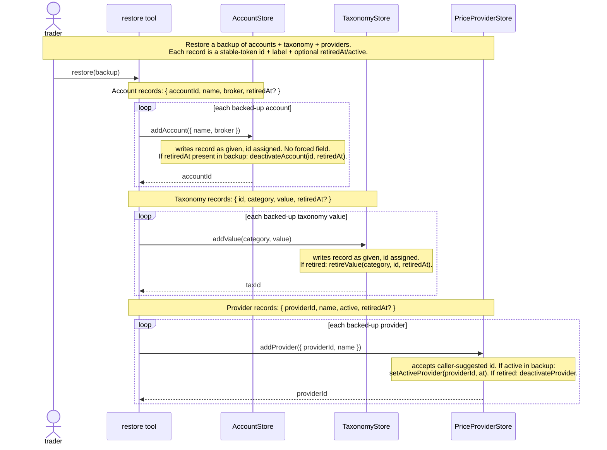
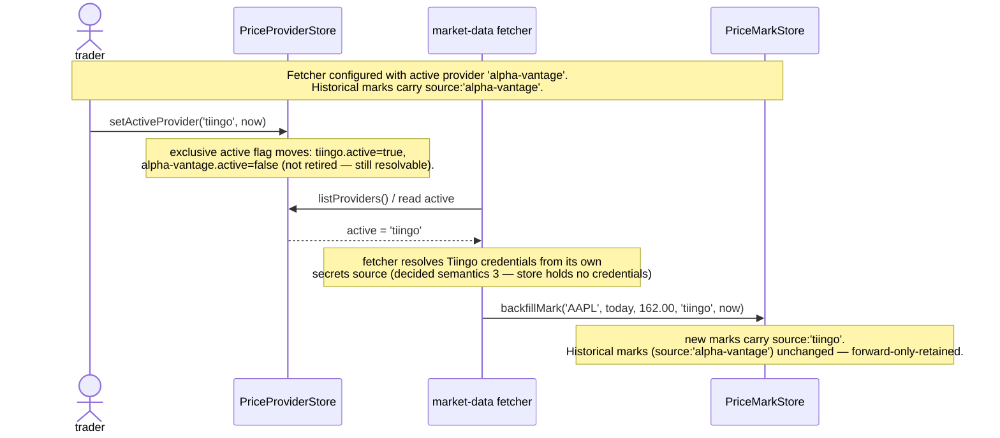

# The Reference Stores — initial interface design

Three thin reference stores designed together in one session because they share
one structural pattern: each is the **provider-of-record** for a slow-changing
collection of values that other stores reference by id. Each serves a join key
a prior drill-down already pinned:

- **AccountStore** serves `TradeRecord.accountId: AccountId` (TradingRecordStore).
- **TaxonomyStore** serves `TradeRecord.strategy: StrategyId` (TradingRecordStore)
  — and any future categorical dimension on a Trade or Entry.
- **PriceProviderStore** serves `PriceMark.currentMark.source: ProviderId`
  (PriceMarkStore) — the non-`'trader'` branch.

The three deliberately own **no derivation** and **no cross-store validation**:
they hold reference facts only, over an injected StorageBinding (rule 5). The
id they provide is referenced opaquely by the consuming store; the consuming
store does not call back to validate it (convention C6 — TradingRecordStore
semantic 16, ReflectionStore semantic 11). The reference store is
provider-of-record, not validator.

This doc names the shared pattern once, then gives each store its own interface
section. Total: **4 + 4 + 4 = 12 operations**, up from the overview's
`~3 / ~4 / ~3` estimate (the overview did not yet count the retirement op that
the forward-only-retained contract makes load-bearing — see *What changed at the
overview*).

---

## The shared pattern (read once)

Every decision in this section applies to all three stores. Each store's
section states only what is store-specific.

**Forward-only-retained.** Values added here can be retired/deactivated but
never deleted. A retired value stays **valid forever** as a reference on
historical records (a trade tagged `strategy:'breakout'` after `breakout` was
retired still resolves; a mark carrying `source:'alpha-vantage'` after that
provider was retired still carries it). This is the pattern CONTEXT.md names
for Taxonomy and that PriceMarkStore semantic 2 and ReflectionStore's retained
schema versions both cite. It is the load-bearing reason there is **no delete
op** in any of the three — retirement is the terminal state.

**No FK validation (convention C6).** None of the three validates that a
referencing store's id exists. The reference store is the registry, not the
enforcer. This mirrors TradingRecordStore semantic 16 (the store validates
structural invariants, not cross-entity ones) and ReflectionStore semantic 11,
and it is what keeps every read of these stores a single-store call.

**Ids are store-assigned.** `AccountId`, `TaxonomyValueId`, and `ProviderId`
are minted by the respective store on add; callers receive them and pass them
opaquely. One exception: `'trader'` is a **fixed sentinel** in PriceMarkStore
(a `ProviderId` value), never minted by PriceProviderStore.

**Timestamps are caller-provided.** The `at: Date` on each retirement op is the
retirement moment, passed by the caller. The store is a fact store, not a clock
(testability — no clock to stub; import fidelity — historical data carries
original timestamps). Same as every prior store (TradingRecordStore semantic 7,
ReflectionStore semantic 13).

**No import op — the one real difference from the four prior stores.** This is
the import test's result and an honest finding; see *Audit findings*.

**Plain request/response; StorageBinding is the persistence seam.** Every op
delegates to put/get/range-query over opaque fact records (overview rule 5);
two implementations, in-memory (unit tests) and real (prod); no per-backend
business rules; synchronous, no subscription semantics (rules 5–6).

**Design-it-twice skipped, with reason.** These are thin reference stores where
one shape is obvious: the forward-only-retained contract forces add / list / get
/ retire, plus the active-provider singleton in PriceProviderStore. There is no
radically different partition of the same behavior to compete. The one place a
genuine shape question lived — TaxonomyStore's category shape (one store
generic over category vs. one store per category) — was resolved inline during
the session in favor of one store generic over category (see TaxonomyStore
section, decided semantics 1). Per the drill-down skill, skipping design-it-twice
is allowed for thin modules where one shape is obvious, provided the skip is
named.

---

## AccountStore

Broker/account identity — the provider-of-record for `AccountId`, referenced by
`TradeRecord.accountId` and grouped/filtered on by Performance Reporting
(`listTrades({ accountId })`). CONTEXT.md: Account — "A trading account at a
specific broker. A single-user trader may have several Accounts. Each Trade is
assigned to exactly one Account."

Four operations:

```ts
/** Register a new Account. Returns its store-assigned id. The id is referenced
 *  by TradeRecord.accountId; this store does NOT validate that reference
 *  (convention C6) — it is provider-of-record, not validator. */
addAccount(input: AccountInput): AccountId

/** All accounts, active first then retired, newest-first within each. Full
 *  records; callers project. */
listAccounts(): Account[]

/** One account by id. */
getAccount(id: AccountId): Account

/** Deactivate an account — the terminal state (no delete op; forward-only-
 *  retained). A deactivated account stays VALID forever on historical trades
 *  (the Taxonomy pattern); it is simply excluded from the picker for new
 *  trades. Idempotent: deactivating an already-retired account is a no-op. */
deactivateAccount(id: AccountId, at: Date): void
```

### Types

```ts
type AccountId = string          // store-assigned; backing type string

/** The broker the account is held at (CONTEXT.md: "A broker may hold several
 *  Accounts" — so broker is an attribute of the account, not an entity here). */
type Broker = string

type AccountInput = {
  name:    string                // a trader-facing label, e.g. "IB Taxable"
  broker:  Broker                // e.g. "Interactive Brokers"
}

/** The broker/account identity. `retiredAt` is present once deactivated. */
type Account = {
  accountId: AccountId
  name:      string
  broker:    Broker
  retiredAt?: Date               // present iff deactivated; absent on active
}
```

### Decided semantics (store-specific)

1. **Four operations: `addAccount`, `listAccounts`, `getAccount`,
   `deactivateAccount`.** The forward-only-retained contract forces the set:
   one write (add), two reads (one, list), one terminal op (deactivate). No
   delete (retirement is terminal); no edit (an account's broker/name are
   fixed at creation — renaming is cosmetic and low-value, *veto if you want a
   `renameAccount` op*). *(Forward-only-retained; depth.)*

2. **`deactivateAccount` is the terminal op — no delete exists.** Forward-only-
   retained means a deactivated account stays valid on historical trades
   forever. Delete would break the invariant and orphan the reference. Same
   ruling, for the same reason, applies to TaxonomyStore's `retireValue` and
   PriceProviderStore's `deactivateProvider`. *(CONTEXT.md: Taxonomy forward-
   only-retained; PriceMarkStore semantic 2.)*

3. **`listAccounts` returns active + retired, active first.** Performance
   Reporting filters on `accountId` regardless of active/retired (a trade
   assigned to a since-retired account still resolves); the new-trade picker
   filters to active. Returning both lets each caller project. No generic
   `listAccounts({ active? })` filter — one optional boolean doesn't earn a
   filter type. *(Depth — the read surface is tiny; callers filter client-side.)*

---

## TaxonomyStore

The categorical value-sets a trader uses to tag Trades (and, in future, other
records). THE canonical instance of the forward-only-retained pattern CONTEXT.md
names: *"The set of allowed values for a categorical field (e.g. strategy, setup
type). Taxonomies are trader-customizable. Changing a taxonomy affects
Trades/Entries assigned values going forward; existing records keep their
assigned value even if it's later removed from the taxonomy."*

Today the only categorical dimension on a Trade is **strategy**
(`TradeRecord.strategy: StrategyId`). The store is generic over category so a
trader (or a later release) can add `setup`, `exit-reason`, etc. without a new
module.

Four operations:

```ts
/** Add a value to a category. Returns its store-assigned id. The id is
 *  referenced by TradeRecord.strategy (for the 'strategy' category); this store
 *  does NOT validate that reference (convention C6). */
addValue(category: TaxonomyCategory, value: string): TaxonomyValueId

/** Values in a category. activeOnly=true (default) returns only non-retired;
 *  false returns retired too (for historical resolution + display of legacy
 *  tags). Full records; callers project. */
listValues(category: TaxonomyCategory, activeOnly?: boolean): TaxonomyValue[]

/** Retire a value — the terminal state (no delete op; forward-only-retained).
 *  A retired value stays VALID forever on records that reference it; it is
 *  simply excluded from the active picker. Idempotent on already-retired. */
retireValue(category: TaxonomyCategory, id: TaxonomyValueId, at: Date): void

/** All categories that currently have at least one value (the trader-customizable
 *  dimension set). A new category comes into existence the first time a value
 *  is added under it — no separate registerCategory op (see semantics 2). */
listCategories(): TaxonomyCategory[]
```

### Types

```ts
/** The categorical dimension a value belongs to. A small, known set today
 *  ('strategy'); trader-extensible. Typed as a string alias — the store does
 *  not close the set. */
type TaxonomyCategory = string   // e.g. 'strategy', 'setup', 'exit-reason'

/** Distinct from StrategyId: this is the id of a value within TaxonomyStore's
 *  own registry. It happens to be what TradeRecord.strategy references for the
 *  'strategy' category. See semantics 4. */
type TaxonomyValueId = string    // store-assigned; backing type string

/** One value in a category. `retiredAt` is present once retired. */
type TaxonomyValue = {
  id:        TaxonomyValueId
  category:  TaxonomyCategory
  value:     string             // the human label, e.g. "breakout"
  retiredAt?: Date              // present iff retired; absent on active
}
```

### Decided semantics (store-specific)

1. **One store, generic over category (Option A).** `addValue(category, value)`,
   `listValues(category, …)`, `retireValue(category, id, …)`,
   `listCategories()`. Chosen over one-store-per-category (StrategyStore +
   SetupStore + …, each ~3 ops) because (a) every category shares the exact
   same forward-only-retained invariant — there is no per-category behavior
   that would earn a separate module; (b) a trader-customizable taxonomy where
   adding a category requires a code change + a new module + a new design doc
   fights the "trader-customizable" charter; (c) the overview row 5 estimated
   "~4 ops," which is the one-store-generic shape. Cost: `category` is a
   string param, and a typo'd category string is uncaught at the type level
   (mitigated by `listCategories()` enumerating the valid set). *(Depth; CONTEXT.md:
   "trader-customizable"; deletion test — N near-identical per-category stores
   are pass-throughs.)*

2. **A category comes into existence when its first value is added — no
   `registerCategory` op.** `addValue('setup', 'pullback')` creates the
   `'setup'` category implicitly; `listCategories()` then includes it. The
   category set is derived from the data, not a separately-registered
   registry. This keeps the store at 4 ops; a `registerCategory` op would be
   ceremony for a dimension with no per-category invariant. *(Depth; deletion
   test — `registerCategory` is a pass-through.)*

3. **`retireValue` is the terminal op — no delete exists.** Same ruling as
   AccountStore semantic 2 and PriceProviderStore semantic 4. Forward-only-
   retained is load-bearing here specifically: CONTEXT.md's "existing records
   keep their assigned value even if it's later removed from the taxonomy" is
   the *origin* of the pattern the other two stores cite. *(CONTEXT.md: Taxonomy.)*

4. **`TaxonomyValueId` IS the `StrategyId` TradeRecord references — same string,
   two names.** For the `'strategy'` category, the `TaxonomyValueId` returned by
   `addValue('strategy', 'breakout')` is what TradingRecordStore stores as
   `TradeRecord.strategy: StrategyId`. They are the same value; `StrategyId`
   (defined in trading-record-store.md) is a context-specific alias for "a
   taxonomy value id in the strategy category." This keeps the type alias in
   TradeRecord honest about *what kind of thing* it references, without a
   second id space. *(One id space, domain-honest aliases.)*

5. **`listValues` defaults `activeOnly=true`.** The new-trade picker wants
   active values; historical resolution and legacy-tag display want retired
   too. Defaulting active serves the common (picker) case; passing `false`
   serves the historical case. The retired values are retained specifically so
   `activeOnly=false` can resolve them. *(Forward-only-retained payoff.)*

---

## PriceProviderStore

Market-data **provider configuration**: which providers exist, which is active.
The registry `source: ProviderId` on a PriceMark references — exactly as
`strategy: StrategyId` on a Trade references TaxonomyStore, and as `accountId:
AccountId` references AccountStore. Born from a charter-drift catch in the
PriceMarkStore session: provider config did not belong in PriceMarkStore
(`source` is provenance on the mark, not configuration of the source), so it
earns its own store. This session applied the same charter-drift test to its
own scope and **excluded credentials** (see semantics 3).

CONTEXT.md (Price Mark) + PriceMarkStore decided semantics 2 establish the
contract: `'trader'` is a fixed sentinel for manual marks; configured provider
ids are minted here. Retired provider ids stay valid on historical marks
(forward-only-retained — PriceMarkStore semantic 2 cites it explicitly).

Four operations:

```ts
/** Register a new provider. 'trader' is a FIXED SENTINEL in PriceMarkStore and
 *  is NEVER minted here — attempting addProvider({ providerId:'trader' }) is
 *  rejected (reserved). Returns the provider id. */
addProvider(input: ProviderInput): ProviderId

/** All providers, active first then retired. Full records; callers project. */
listProviders(): Provider[]

/** Set the active provider — the singleton the roadmap fetcher reads. Exactly
 *  one provider is active at a time; setting a new active deactivates the
 *  previous "active" state (the active flag is exclusive). Retired providers
 *  stay valid on historical marks (forward-only-retained); the active flag is
 *  about which provider new automated marks come from, not about validity. */
setActiveProvider(id: ProviderId, at: Date): void

/** Deactivate (retire) a provider — the terminal state (no delete op; forward-
 *  only-retained). A retired provider's id stays VALID forever on historical
 *  PriceMarks; it just can't be set active. Idempotent on already-retired.
 *  Deactivating the currently-active provider also clears the active flag
 *  (there is then no active provider until one is set). */
deactivateProvider(id: ProviderId, at: Date): void
```

### Types

```ts
type ProviderId = string        // defined in price-mark-store.md; store-assigned here.
                                //   'trader' is reserved (a sentinel in PriceMarkStore,
                                //   never minted by this store).

type ProviderInput = {
  /** Caller-suggested id, e.g. 'alpha-vantage'. The store accepts or mints one.
   *  'trader' is reserved and rejected. */
  providerId?: ProviderId
  name: string                  // human-facing label, e.g. "Alpha Vantage"
}

/** Provider identity + state. NO credentials field (decided semantics 3). */
type Provider = {
  providerId: ProviderId
  name:       string
  active:     boolean           // true iff this is THE active provider (exclusive)
  retiredAt?: Date              // present iff deactivated; absent on active providers
}
```

### Decided semantics (store-specific)

1. **Four operations: `addProvider`, `listProviders`, `setActiveProvider`,
   `deactivateProvider`.** Same shape as AccountStore plus the active-provider
   singleton (`setActiveProvider`). No `configureProvider(id, credentials)` —
   credentials are out of scope (semantic 3). No delete (deactivation is
   terminal). *(Forward-only-retained; depth.)*

2. **`setActiveProvider` is a single-store multi-fact write (OQ 9 class).**
   Setting a new active provider deactivates the previous "active" flag and
   sets the new one — a read-modify-write within one store. Same atomicity
   class as TradingRecordStore's `recordFill` close path, PriceMarkStore's
   `upsertMark`, ReflectionStore's `completePlaceholder`. Whether atomicity
   comes from the StorageBinding (a transaction primitive) or the store's own
   batching is OQ 9, owned globally. *(OQ 9.)*

3. **Credentials are EXCLUDED — provider identity + active state only (charter-
   drift test applied to this store's own scope).** The overview row said
   "credentials," but credentials carry a different invariant class (secrets
   handling: encrypt-at-rest, redact-from-backup, rotate, audit) than the
   forward-only-retained reference values the store exists to hold. Including
   them would (a) drift the store's charter from reference-data into secrets-
   management — the same kind of drift that birthed this store out of
   PriceMarkStore; (b) complicate OQ 8 (backup/restore): a verbatim
   `importProvider` would restore an API key into a backup, a security smell,
   or the store would need redact-on-export logic the other reference stores
   don't carry; (c) put plaintext keys in the in-memory StorageBinding used by
   unit tests. Instead the fetcher — the sole credentials consumer — resolves
   credentials from its own secrets source (env var, secrets manager) keyed by
   the active provider id it reads here. Cost: adding a provider is two steps
   (record identity here, configure the key in the secrets source). If a later
   release wants the store to *point at* credentials without holding them, a
   non-secret `credentialsKey: string` field can be added without reshaping
   ops — YAGNI until the fetcher exists. *(Charter discipline — the test that
   birthed this store, applied to its own scope; OQ 8 stays clean.)*

4. **`deactivateProvider` is the terminal op — no delete exists.** Same ruling
   as AccountStore semantic 2 and TaxonomyStore semantic 3. Retired provider
   ids stay valid on historical marks (PriceMarkStore semantic 2 cites the
   forward-only-retained pattern). Deactivating the currently-active provider
   clears the active flag; there is then no active provider until one is set
   (the fetcher no-ops until `setActiveProvider` is called). *(PriceMarkStore
   semantic 2; forward-only-retained.)*

5. **`'trader'` is reserved — `addProvider({ providerId:'trader' })` is
   rejected.** `'trader'` is a fixed sentinel in PriceMarkStore (the manual-
   entry provenance value), not a configured provider. Allowing it here would
   create two paths minting the same id with different meanings. The store
   rejects it; provider ids are configured-provider ids only. *(PriceMarkStore
   semantic 2 — `'trader'` is a fixed sentinel, not a configured provider.)*

---

## Worked examples

### AccountStore — register, list, deactivate

```ts
const acctId = accounts.addAccount({ name:'IB Taxable', broker:'Interactive Brokers' })
// → 'acct_001'

accounts.listAccounts()
// → [{ accountId:'acct_001', name:'IB Taxable', broker:'Interactive Brokers' }]
//   (no retiredAt — active)

// Two years later, the trader closes this broker account:
accounts.deactivateAccount('acct_001', new Date('2026-03-01T00:00:00Z'))
// → account now: { …, retiredAt: 2026-03-01 }

// Performance Reporting still resolves trades tagged accountId:'acct_001' —
// the retired account is VALID as a reference, just excluded from the new-trade picker.
accounts.listAccounts()
// → [{ accountId:'acct_001', …, retiredAt: 2026-03-01 }]   (active-first, but only one)
```

### TaxonomyStore — strategy values, then a new category

```ts
// Today: the 'strategy' category.
const s1 = taxonomy.addValue('strategy', 'breakout')     // → 'tax_001'
const s2 = taxonomy.addValue('strategy', 'covered-call') // → 'tax_002'

taxonomy.listValues('strategy')
// → [ { id:'tax_001', category:'strategy', value:'breakout' },
//     { id:'tax_002', category:'strategy', value:'covered-call' } ]

taxonomy.listCategories()
// → ['strategy']

// Six months in: trader adds a 'setup' dimension (no module change, no code):
taxonomy.addValue('setup', 'pullback')                   // → 'tax_003'
taxonomy.listCategories()
// → ['strategy', 'setup']

// s1 ('breakout') is what TradingRecordStore stores as TradeRecord.strategy:
//   the TaxonomyValueId IS the StrategyId (decided semantics 4).

// Trader stops trading breakouts:
taxonomy.retireValue('strategy', s1, new Date('2026-06-01T00:00:00Z'))
// → { id:'tax_001', …, value:'breakout', retiredAt: 2026-06-01 }
// Old trades tagged strategy:'tax_001' STILL RESOLVE (forward-only-retained).
taxonomy.listValues('strategy')                // activeOnly defaults true
// → [ { id:'tax_002', …, value:'covered-call' } ]   (breakout excluded — retired)
taxonomy.listValues('strategy', false)         // include retired
// → [ { id:'tax_001', …, value:'breakout', retiredAt:… },
//     { id:'tax_002', …, value:'covered-call' } ]
```

### PriceProviderStore — register, activate, switch, retire

```ts
const p1 = providers.addProvider({ providerId:'alpha-vantage', name:'Alpha Vantage' })
// → 'alpha-vantage'
const p2 = providers.addProvider({ providerId:'tiingo', name:'Tiingo' })
// → 'tiingo'

// Set the active provider (the roadmap fetcher reads this):
providers.setActiveProvider('alpha-vantage', new Date('2026-01-01T00:00:00Z'))
// → alpha-vantage.active = true; tiingo.active = false.

// Switch (the singleton moves):
providers.setActiveProvider('tiingo', new Date('2026-04-01T00:00:00Z'))
// → tiingo.active = true; alpha-vantage.active = false.
//   New automated marks carry source:'tiingo'. Historical marks keep
//   source:'alpha-vantage' — forward-only-retained (PriceMarkStore semantic 2).

// Retire the old provider:
providers.deactivateProvider('alpha-vantage', new Date('2026-04-01T00:00:00Z'))
// → alpha-vantage: active=false, retiredAt=2026-04-01.
//   Historical marks carrying source:'alpha-vantage' STILL VALID.
//   'alpha-vantage' can no longer be set active.

// 'trader' is reserved:
providers.addProvider({ providerId:'trader', name:'Manual' })
// → REJECTED ('trader' is a fixed sentinel in PriceMarkStore, not a provider)
```

---

## Audit findings (sequence-diagram audit)

The audit applies the yield test per store. All three reference stores share
one candidate flow worth drawing — **cold-start restore** — because that is the
flow that exposed `importTrade`, `importMark`, `importEntry`/`importSchema` in
the four prior stores. Drawing it here produced the session's headline finding.

The other candidate flows were skipped with reason: **retire-then-reference**
(a trade tagged with a since-retired strategy value) is fully served by
forward-only-retained + C6 — no diagram needed, the invariant *is* the answer;
and **active-provider-while-retired** (deactivate the currently-active
provider) is a single-state mutation covered by decided semantics 4, no flow.

### Finding A — the import test: all three reference stores need NO import op

This is the headline finding and an honest reversal of the pattern established
by the four prior stores, every one of which grew an `importX` op during its
audit (TradingRecordStore 6→7, PriceMarkStore 4→5, ReflectionStore +`importEntry`
+`importSchema`).

**The import test (the `importMark`/`importEntry` cautionary tale):** *do the
live write ops build state through rules a verbatim restore must bypass?*

- **TradingRecordStore** needed `importTrade` because `commit`+`recordFill` build
  a Trade forward through the live timeline (replaying fills, transitioning
  status, snapshotting at close) — a historical Closed record is unreachable.
- **PriceMarkStore** needed `importMark` because `upsertMark` forces
  `source:'trader'` and pushes to `history`, and `backfillMark` no-ops on
  present — a provider-sourced mark with a write-trail restores as a
  sourceless, historyless trader mark.
- **ReflectionStore** needed `importEntry`/`importSchema` because
  `createEntry` pins the *current* schema version, `completePlaceholder`
  transitions state, and `saveSchema` rejects identical fields — a verbatim
  entry/schema can't be written through them.

**For the reference stores the answer is no, and the reason is the ids.** All
three reference ids (`AccountId: 'acct_001'`, `TaxonomyValueId: 'tax_001'`,
`ProviderId: 'alpha-vantage'`) are the kind of thing a backup carries as a
stable token. The live write ops for these stores do not force an irrecoverable
field the way the prior stores' ops do:

- `addAccount` / `addValue` / `addProvider` write the record as given (name,
  broker / value / name) and assign the id. Nothing is forced.
- `deactivateAccount` / `retireValue` / `deactivateProvider` set `retiredAt`.
  Nothing is overwritten or lost.
- `setActiveProvider` flips an exclusive `active` flag. Recoverable by
  re-setting.

A backup record `{ accountId, name, broker, retiredAt? }` is reproducible by
sequencing the live ops: `addAccount` then (if retired) `deactivateAccount`.
There is no field the live ops mutate irrecoverably, so a verbatim restore is
already expressible. The import ops the prior stores earned do not earn their
keep here.

**The honest caveat:** if the store-assigned id were opaque (a uuid the store
mints, unrecoverable from the backup), then a verbatim restore would need an
import op to preserve the *exact id* — because the referencing records
(`TradeRecord.accountId`, etc.) point at that id, and re-minting a new one
would break the reference. Two mitigations make this not-a-finding for this
session: (a) `addProvider` already accepts a caller-suggested id
(`ProviderInput.providerId?`), so a restore can pass the backup's id; (b) for
Account/Taxonomy, the id is referenced from records that are themselves
restored in the same fan-out, so id-stability-across-restore is a property the
**broader backup architecture (OQ 8)** guarantees across all stores at once,
not something each reference store must solve with its own import op. If OQ 8
later chooses a design where ids are NOT stable across restore, each reference
store will need an `importX` op at that point — flagged in Open items, not
designed now (YAGNI; the four prior stores' import ops exist precisely because
*their* live ops are lossy, not because of id concerns).

**Resolution:** no import ops added. The three reference stores are the first
stores in the partition that pass the import test cleanly. Recorded honestly as
a deviation from the established pattern, for the right reason.

### Sequence: cold-start restore (audit diagram A — no import op needed)



Contrast with TradingRecordStore/PriceMarkStore/ReflectionStore, where this same
diagram exposed a missing `importX` op. Here the live ops reproduce the backup
faithfully because none of them forces an irrecoverable field. The one fragility
— id stability across restore — is an OQ 8 concern, not a per-store import op
(see finding A's caveat).

---

## Sequence: provider switch rippling to new marks (the forward-only-retained payoff)



The provider switch is a single-store write (PriceProviderStore) that the
fetcher reads as reference data. The fetcher's mark writes go to a different
store (PriceMarkStore). No coordinator — the fetcher touches one fact store for
writes (the provider read is a reference lookup, not a join producing a derived
item — overview rule 8, "direct writes that need no coordinator"). This
confirms the charter-drift finding that split PriceProviderStore out of
PriceMarkStore: provider config and mark facts live in different stores, joined
only by the `ProviderId` token.

---

## Requirements fulfilled / exported

### Closed here

| Item | Resolution |
|---|---|
| **AccountStore interface (overview row 4)** | **Pinned: 4 ops** (`addAccount`, `listAccounts`, `getAccount`, `deactivateAccount`). Serves `TradeRecord.accountId`; forward-only-retained (deactivated accounts stay valid on history). |
| **TaxonomyStore interface (overview row 5)** | **Pinned: 4 ops** (`addValue`, `listValues`, `retireValue`, `listCategories`), one store generic over category (Option A). Serves `TradeRecord.strategy`; the canonical forward-only-retained instance. |
| **PriceProviderStore interface (overview `—` row)** | **Pinned: 4 ops** (`addProvider`, `listProviders`, `setActiveProvider`, `deactivateProvider`). Serves `PriceMark.source` (non-`'trader'`). Credentials excluded (charter-drift test applied to own scope). |
| **Import test (OQ 8, per store)** | **No import ops needed** (audit finding A). The live write ops reproduce any backup faithfully; id-stability-across-restore is an OQ 8 global concern. First stores in the partition to pass the import test cleanly. |

### Exported to downstream sessions (commitments)

- **→ PerformanceReportingCoordinator:** reads reference data for
  group/filter joins. `accounts.listAccounts()` (group by account, resolve
  names for display), `taxonomy.listValues('strategy', false)` (resolve
  strategy ids to labels, including retired values that historical trades
  carry), `providers.listProviders()` (resolve provider ids to names for
  source-quality display). These are read-side joins the coordinator performs;
  the reference stores are id-opaque. *(Overview who-calls-whom:
  PerformanceReporting → Account/Taxonomy read.)*
- **→ the roadmap market-data fetcher:** reads `providers.listProviders()` /
  the active provider to know which provider to fetch from. Resolves
  credentials from its own secrets source keyed by the active provider id
  (decided semantics 3). Writes marks via PriceMarkStore's `backfillMark`
  with the `ProviderId` it read here. *(Overview who-calls-whom: fetcher →
  PriceProviderStore read active.)*
- **→ TradingRecordStore (ripple, none required):** `AccountId` and
  `StrategyId` are already defined there as caller-provided references
  (semantic 8 lists only `TradeId`/`FillId` as store-assigned). No type
  changes. `TaxonomyValueId` IS `StrategyId` for the `'strategy'` category
  (TaxonomyStore semantic 4) — same value, domain-honest alias.
- **→ PriceMarkStore (ripple, none required):** `ProviderId` is already
  defined there; PriceProviderStore is the registry that mints configured
  provider ids. `'trader'` remains a fixed sentinel in PriceMarkStore, never
  minted by PriceProviderStore (PriceProviderStore semantic 5). No type changes.
- **→ Backup/restore (OQ 8):** the three reference stores' restore slices are
  served by their live ops (finding A) **provided OQ 8 guarantees id stability
  across restore**. If OQ 8 later chooses a design where store-assigned ids are
  not stable across restore, each reference store will need an `importX` op at
  that point — flagged, not designed now.
- **→ OQ 9 (multi-fact write atomicity):** `setActiveProvider` is a
  single-store multi-fact write (exclusive active flag). Same atomicity class
  as the prior stores' multi-fact writes; owned globally by OQ 9.

---

## Open items

| Item | Owned by |
|---|---|
| **OQ 8 — backup/export/import architecture.** The three reference stores pass the import test without import ops (finding A), *provided* OQ 8 guarantees id stability across restore (the referencing records point at these ids). If OQ 8 chooses a design where ids are re-minted on restore, each store needs an `importX` op to preserve exact ids. The broader architecture (storage-seam fan-out vs. coordinator) remains open globally. | overview / lifecycle (OQ 8) |
| **OQ 9 — multi-fact write atomicity.** `setActiveProvider` is a single-store multi-fact write (read prior active → clear it → set new). Same class as the prior stores' multi-fact writes. | overview / StorageBinding (OQ 9) |
| **`credentialsKey` pointer field (YAGNI until the fetcher exists).** Decided semantics 3 excludes credentials. If a later release wants the store to *point at* credentials without holding them (a non-secret key/name the fetcher resolves in its secrets source), a `credentialsKey?: string` field can be added to `Provider` without reshaping ops. Not added now. | API-release drill-down |
| **`StorageBinding` shape.** Each store assumes put/get/range-query over opaque records (overview rule 5). `listAccounts`/`listValues`/`listProviders` need range queries or in-memory filtering; exact primitive set deferred. | StorageBinding drill-down / implementation |
| **Id generation / format.** `AccountId`, `TaxonomyValueId`, `ProviderId` are store-assigned; formats (`acct_001`, `tax_001`, `'alpha-vantage'`) are implementation details. `addProvider` accepts a caller-suggested id; the others mint opaquely. | Implementation |
| **Account/Taxonomy edit (rename) ops.** No edit op exists (renaming an account label or a taxonomy value's display string is cosmetic). Add if the need becomes real. | later, if the need arises |
| **Additional taxonomy categories on records.** Today only `TradeRecord.strategy` references TaxonomyStore. When a second categorical dimension lands on a Trade or Entry (e.g. `setup`), that record's type gains a field referencing a `TaxonomyValueId` — a schema change on the consuming record, not a TaxonomyStore change (the store is already generic over category). | consuming-record drill-down, when the need arises |

---

## Alternatives considered

### TaxonomyStore category shape (the one genuine design-it-twice question)

- **Option A — one store, generic over category (adopted).** `addValue(category,
  value)`, `listValues(category, activeOnly?)`, `retireValue(category, id, at)`,
  `listCategories()`. Every category shares the exact forward-only-retained
  invariant; there is no per-category behavior to justify a separate module. A
  new category is data (the first `addValue('setup', …)` brings it into
  existence), not code. Matches the overview's "~4 ops" estimate and the
  "trader-customizable" charter. Cost: `category` is a string param; a typo'd
  category is uncaught at the type level (mitigated by `listCategories()`
  enumerating the valid set, and by Performance Reporting joining through
  `listValues`).

- **Option B — one store per category (rejected).** StrategyStore, SetupStore,
  ExitReasonStore, etc., each ~3 ops with concrete types (`StrategyId`) and no
  category param. Rejected because (a) adding a category requires a code change
  + new module + new design doc, fighting "trader-customizable"; (b) N×3 ops
  total as categories grow, where each store is a near-identical clone failing
  the deletion test; (c) the per-category invariant is identical, so the
  separation earns nothing structural. Note: `strategy` is already pinned as
  `StrategyId` on TradeRecord, so a StrategyStore would align with that — but
  TaxonomyStore semantic 4 reconciles it: `TaxonomyValueId` *is* `StrategyId`
  for the strategy category (same string, domain-honest alias), so Option A
  loses no type-level clarity at the referencing site.

### PriceProviderStore credentials scope (charter-drift test)

- **Option A — exclude credentials (adopted).** Provider identity + active state
  only. The fetcher resolves credentials from its own secrets source. Keeps
  the store pure reference data (one invariant: forward-only-retained), keeps
  backup/restore clean (no secret material in a verbatim restore), and keeps
  the in-memory test StorageBinding free of plaintext keys. Cost: adding a
  provider is two steps. Chosen because PriceProviderStore was *born* from a
  charter-drift catch (provider config didn't belong in PriceMarkStore);
  applying the same test to its own scope argues for keeping it tight.

- **Option B — include credentials (rejected).** `addProvider({ name, apiKey })`
  records everything; the fetcher reads both active id and key from one store.
  Rejected because it imports a second invariant class (secrets handling:
  encrypt-at-rest, redact-from-backup, rotate, audit) into a reference-data
  store, drifts the charter into secrets-management, and complicates OQ 8
  (`importProvider` would restore a key verbatim, or need redact-on-export
  logic no other reference store carries). The one-stop convenience does not
  outweigh the charter drift for a store whose reason for existing is charter
  discipline.

### Import ops (the import test — audit finding A)

- **No import ops (adopted).** The live write ops (`addX` + `deactivateX`/
  `retireX`/`setActiveProvider`) reproduce any backup faithfully because none
  forces an irrecoverable field. Contrast TradingRecordStore (`commit`+
  `recordFill` can't write a historical Closed record), PriceMarkStore
  (`upsertMark` forces `source:'trader'`), ReflectionStore (`createEntry` pins
  the current schema version). The reference stores' live ops are not lossy,
  so the import test does not fire.

- **Add `importAccount`/`importTaxonomy`/`importProvider` for symmetry
  (rejected).** Would mirror the four prior stores but earn nothing — there is
  no field the live ops mutate irrecoverably, so the import ops would be
  pass-throughs (deletion test). The only concern they'd address — exact id
  preservation across restore — is an OQ 8 global property, not a per-store op
  (and `addProvider` already accepts a caller-suggested id). Adding them would
  be cargo-culting the prior pattern without the reason that earned it. The
  honest move is to name the deviation and its reason (finding A).

### Module shape (design-it-twice — skipped, with reason)

All three stores are thin reference stores where one shape is obvious: the
forward-only-retained contract forces add / list / get / retire, plus the
active-provider singleton in PriceProviderStore. There is no radically different
partition of the same behavior to compete. The two sub-questions the overview
flagged — TaxonomyStore's category shape and PriceProviderStore's credentials
scope — were worked inline as design questions above, not as full
design-it-twice candidate sets, because each had exactly one live alternative
(option A vs B) rather than a space of radically different shapes. Per the
drill-down skill: skipping is allowed for thin modules where one shape is
obvious, provided the skip is named and the genuine questions are worked.
