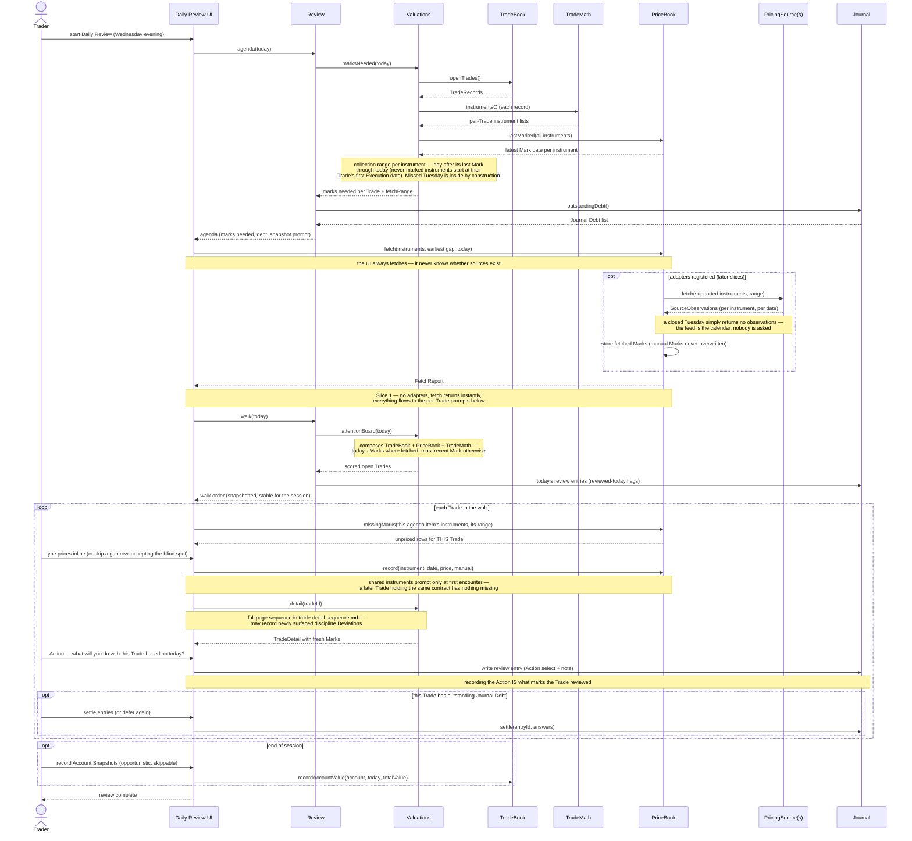

# Review — initial interface design

The behavioral-session coordinator. Daily Review's center of gravity is not price collection — it's the walk: fresh risk/reward per open Trade, surfaced Deviations, and a conscious decision at each checkpoint, recorded as an **Action** ("what are you going to do with this Trade, based on what happened today?"). This survives 100% automated pricing untouched; automation deletes the typing, never the deciding (ADR 0010 — every day in a trade is a fresh decision).

## Interface

```typescript
interface Review {
  agenda(asOf: ISODate): Promise<ReviewAgenda>   // pre-fetch: what this session must cover
  walk(asOf: ISODate): Promise<WalkItem[]>       // post-fetch: attention-ranked, with reviewed-today flags
}

interface ReviewAgenda {
  marksNeeded: { tradeId: TradeId; instruments: InstrumentKey[]; range: DateRange }[]  // via Valuations.marksNeeded
  fetchRange: DateRange                          // earliest gap .. asOf, for the one bulk fetch
  journalDebt: Entry[]                           // unsettled placeholders (Journal)
  accountsForSnapshot: AccountId[]               // the optional end-of-session prompt
}

interface WalkItem {
  tradeId: TradeId
  attentionScore: number                         // via Valuations.attentionBoard
  reviewedToday: boolean                         // a review-anchored entry with an Action exists for asOf
  outstandingDebt: number                        // this Trade's unsettled placeholders
}
```

Two operations. Everything else the session does goes straight to the owning module from the UI: `PriceBook.fetch/missingMarks/record`, `Valuations.detail`, `Journal.write/settle`, `TradeBook.recordAccountValue/acknowledgeDeviation`.

## The checkpoint

Reviewing a Trade **is** recording its Action — there is no separate "mark reviewed" state:

- The checkpoint writes an ordinary Journal entry anchored `{ kind: 'review', date, tradeId }`, using the seeded **Trade Review** Entry Type (`designatedFor: 'review'`). Its central prompt is the Action `select` (Hold / Exit Soon / Adjust / Watch Closely by default); a conviction `scale` and free-text note ride along.
- Because the Action list is just that prompt's options, it is **trader-configurable for free** — edit the Entry Type.
- `reviewedToday` derives from the entry's existence. Skipping a Trade is possible and visible (it stays unreviewed), never nagged into a modal — same philosophy as Journal Debt.
- Deviations surfaced by `Valuations.detail` during the walk are acknowledged (or journaled against) at this checkpoint (ADR 0012).

## Decided semantics

- **Review stores nothing.** Both operations are compositions: `agenda` = Valuations.marksNeeded + Journal.outstandingDebt + registries; `walk` = Valuations.attentionBoard joined with Journal's review entries for the date. "Last reviewed" derives from Marks and review entries; no session records exist. (If review-streak analytics ever want more, review-anchored entries already carry the history.)
- **The Trade↔Journal join lives here** — "which open Trades lack a review entry today" belongs to no other module (Valuations' charter is the Trade↔Marks join only).
- **Order of a session**: `agenda` → bulk fetch → `walk` (ranking sees today's fetched Marks — fetch → rank → walk) → per-Trade: fill missing Marks inline, `detail`, record Action, settle that Trade's debt → optional account values.

## Sequence: a Daily Review session (with gap recovery)

The trader last reviewed Monday, missed Tuesday, and opens Daily Review on Wednesday evening. The collection range is computed, not asked about — Tuesday is inside it automatically.



Once Wednesday's Marks are recorded, Wednesday becomes `lastMarked` — Tuesday is interior history and never reappears in a queue. `FetchReport` explains what happened; `missingMarks` after the fetch is the authoritative remainder.

**The UI has exactly one collection path in every slice.** It always calls `fetch()`; with no adapters registered (Slice 1) the call is an instant no-op whose report routes everything to the per-trade prompts. Enabling a pricing source later changes UI behavior by zero lines — the sources-vs-manual branch lives inside PriceBook, not in the UI.

**Manual entry is per-trade, not batch.** The automatic fetch runs once (it involves no trader interaction), but manual prompts appear inside each Trade's review page — prices are typed in the context of the Trade they belong to, and the Mark dedup rule means shared instruments prompt only at first encounter.

**Fetch → rank → walk.** Review happens after market hours, so the fetch completes before attention ranking runs — the walk order reflects today's results. An instrument whose fetch failed or is unsupported ranks on its most recent Mark, accepting that the rare stale-ranked Trade may walk out of order (self-correcting per-trade as manual prices land, but the session order stays snapshotted — no mid-walk reshuffling). Slice 1 is the degenerate case: no adapters, so ranking runs entirely on the previous review's closes.

## The queryable payoff

Actions accumulate into the exit-discipline dataset: "how long after my first *Exit Soon* do I actually exit?", "what does my *Hold* look like before losers vs winners?" — deviation-grade behavioral data, one tap per Trade per day.

## Open items

- Seeded Trade Review Entry Type's exact prompts (with the default Action list) — part of the Slice 1 seeding task.
- Review-streak / habit analytics — derivable from review entries; deferred with Analytics.
