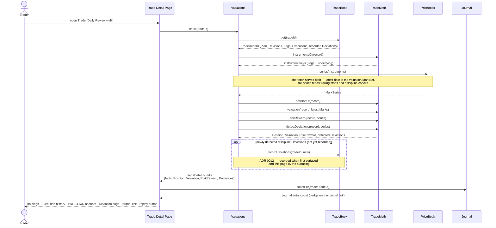
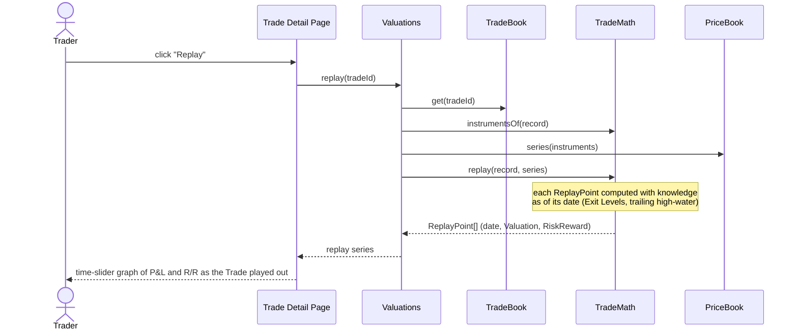
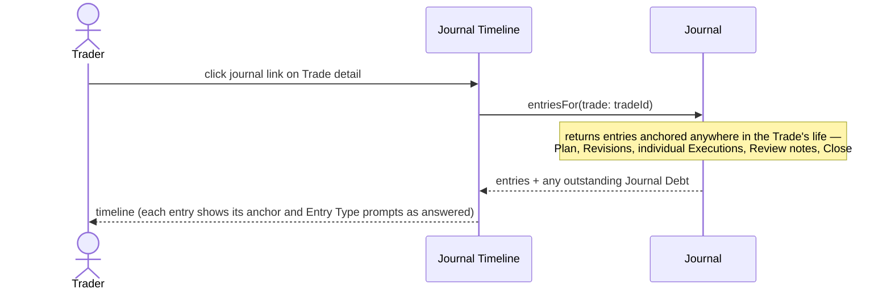

# Trade detail page — interaction sequences

The page a Daily Review walk lands on for each open Trade. Displays: current Position (holdings), Execution history, current Valuation with all P&L, all four Risk/Reward anchors, Deviation flags; links to the Trade's journal timeline; can trigger a replay graph.

## Page load

One coordinator call assembles everything computed; a single `TradeRecord` + `MarkSeries` snapshot feeds every number so the page is internally consistent (holdings, P&L, and R/R can never disagree about which Executions exist).

## Replay graph (on demand)

Same join, full history, no new seams.

## Journal timeline (on navigation)

## What this exercise surfaced (design rulings)

1. **New coordinator operation `Valuations.detail(tradeId)`** — the page-shaped bundle. Without it the UI would make 4–5 calls whose results could interleave with writes; with it, every number derives from one snapshot.
2. **The UI receives facts for display inside coordinator bundles** (Execution history, Plan fields) but never derives from them — the "UI sees finished items" rule refined, not broken.
3. **`detail()` may write** — recording newly surfaced discipline Deviations (ADR 0012 says surfacing is the recording trigger). Deliberate exception to read-only reads; the alternative (record on acknowledgment) loses the "what was I shown, when" guarantee.
4. **Journal anchors must be queryable by Trade** — `entriesFor(trade)` must return entries anchored to the Trade *or to anything inside it* (Executions, Revisions, Close). Execution-anchored entries therefore carry the tradeId in their anchor. This is a requirement on the Journal drill-down.
5. **One `PriceBook.series()` fetch serves both needs** — its latest date is the valuation MarkSet; its history feeds trailing stops, discipline checks, and replay. PriceBook needs no separate "latest" operation for this page.
