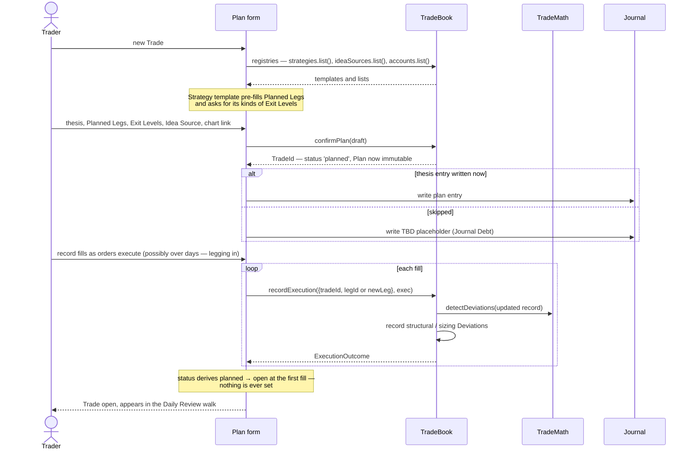
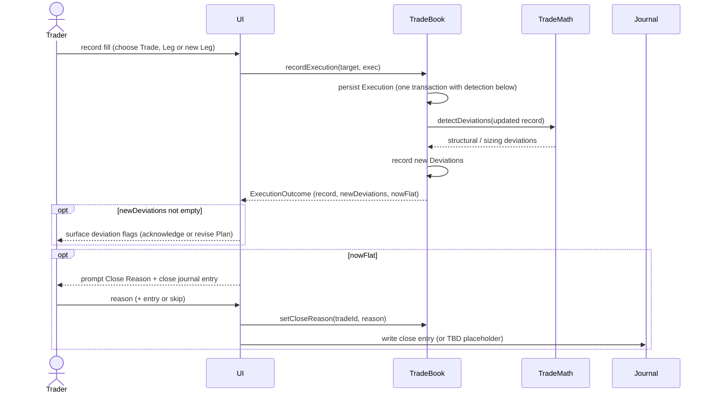
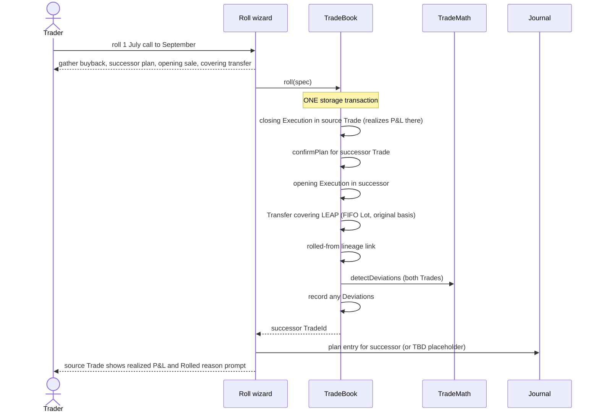
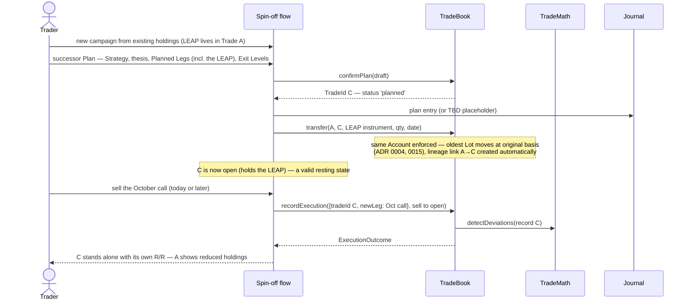

# TradeBook — initial interface design

The system of record for Trades. Stores facts, never does arithmetic on them (netting, status, P&L all live in TradeMath). Single implementation over an injected StorageBinding.

## Interface

```typescript
interface TradeBook {
  // lifecycle
  confirmPlan(draft: PlanDraft): Promise<TradeId>          // creates the Trade, status 'planned'
  revisePlan(tradeId: TradeId, revision: PlanRevisionDraft): Promise<void>
  recordExecution(target: ExecutionTarget, exec: ExecutionDraft): Promise<ExecutionOutcome>
  correctExecution(executionId: ExecutionId, patch: ExecutionPatch, note?: string): Promise<void>
  voidExecution(executionId: ExecutionId, note: string): Promise<void>
  setCloseReason(tradeId: TradeId, reason: CloseReason): Promise<void>

  // structural moves
  transfer(from: TradeId, to: TradeId, instrument: InstrumentKey, qty: Qty, date: ISODate): Promise<void>
  roll(spec: RollSpec): Promise<TradeId>                   // atomic; returns the successor Trade

  // deviations
  recordDeviations(tradeId: TradeId, detected: DetectedDeviation[]): Promise<void>
  acknowledgeDeviation(deviationId: DeviationId, note?: string): Promise<void>

  // reads
  get(tradeId: TradeId): Promise<TradeRecord>
  query(filter: TradeFilter): Promise<TradeRecord[]>
  tradesHolding(instrument: InstrumentKey): Promise<TradeSummary[]>

  // accounts & trader-managed lists
  recordAccountValue(accountId: AccountId, date: ISODate, totalValue: Money, note?: string): Promise<void>
  registries: {
    strategies: ListRegistry<StrategyTemplate>
    ideaSources: ListRegistry<IdeaSource>
    institutions: ListRegistry<Institution>
    accounts: ListRegistry<Account>
  }
}

interface ListRegistry<T> {                                // one generic shape, reused four times
  list(includeArchived?: boolean): Promise<T[]>
  save(item: T): Promise<void>                             // create or update
  archive(id: string): Promise<void>                       // never delete — Trades reference these
}

type ExecutionTarget =
  | { tradeId: TradeId; legId: LegId }                     // existing Leg
  | { tradeId: TradeId; newLeg: InstrumentKey }            // new Leg in existing Trade
  // deliberately absent: { newTrade } — plan-first is structural (ADR 0003)

interface ExecutionOutcome {
  record: TradeRecord                                      // updated facts
  newDeviations: DetectedDeviation[]                       // structural/sizing, already recorded
  nowFlat: boolean                                         // UI prompts for Close Reason + close journal entry
}

interface RollSpec {
  fromTradeId: TradeId
  closing: { legId: LegId; qty: Qty; price: Money; fees: Money }[]
  successorPlan: PlanDraft                                 // the new Trade's Plan (thesis may land as Journal Debt)
  opening: { instrument: InstrumentKey; side: Side; qty: Qty; price: Money; fees: Money }[]
  transfers: { instrument: InstrumentKey; qty: Qty }[]     // covering quantity moving to the successor
  date: ISODate
}
```

## Decided semantics

- **Plan-first is structural.** `recordExecution` cannot create a Trade — no target shape exists for it. A spontaneous entry is a 30-second `confirmPlan` first; non-blocking journaling (Journal Debt) keeps that cheap.
- **Corrections are edits with history.** Typos are data-entry errors, not trading history: `correctExecution` patches price/qty/date/fees and keeps prior values as an audit trail on the record; `voidExecution` removes with the same trail. Already-recorded Deviations stand (ADR 0012 — adherence history is immutable); a correction that invalidates one gets an annotation, not deletion. Plans are never correctable — their immutability is the product.
- **`roll()` is one storage transaction.** Closing Executions + successor `confirmPlan` + opening Executions + Transfers + the rolled-from link commit together or not at all — the signature monthly gesture can never half-happen. All touched records are TradeBook's own, so no cross-Book transaction is needed.
- **`transfer()` enforces same-Account (ADR 0013), consumes FIFO Lots (ADR 0015), carries original basis (ADR 0004), and auto-creates the lineage link.** A no-transfer full roll gets its link from `roll()`.
- **Detection runs inline on write.** `recordExecution` persists, calls `TradeMath.detectDeviations`, records structural/sizing Deviations, and returns them in `ExecutionOutcome` with `nowFlat` so the UI can prompt for Close Reason at the natural moment.
- **No status writes exist.** Status stays derived (ADR 0005); `setCloseReason` attaches the reason to an already-flat Trade or abandons a planned one.
- **Registries archive, never delete** — historical Trades reference Strategies, Idea Sources, and Accounts forever.
- **"Skip journaling" writes the TBD placeholder** (ruling to formalize in the Journal drill-down): skip and placeholder unify, making Journal Debt self-contained as "placeholder entries."

## Sequence: placing a new Trade (plan → confirm → executions)



## Sequence: recording an Execution



## Sequence: rolling a covered call (atomic)



## Sequence: spinning off Legs to a new Trade (composed, not atomic)

Moving holdings under a new Plan — the "sell an October call against a LEAP still sitting in Trade A" scenario. Deliberately **composed from primitives** rather than atomic: unlike a roll, every intermediate state is valid on its own (a planned Trade C, then an open Trade C holding a transferred LEAP awaiting its short call — which may genuinely be tomorrow's sale). Atomicity is reserved for roll(), whose intermediate states are torn.



## Requirements fulfilled / exported

- `tradesHolding` (exported by PriceBook's Mark-edit warning) — here.
- `recordAccountValue` (Review's end-of-session prompt) — here. Records an Account Snapshot (ADR 0013) — an observation, not a derivation; never prefilled with the prior value (a confirmed stale number fakes a flat equity line; an absent one is an honest gap).
- Journal drill-down inherits: placeholder-on-skip ruling; entry anchors carrying tradeId (from trade-detail sequences).

## Open items

- `TradeFilter` exact shape — settle during the Analytics drill-down (it's the main consumer).
- Assignment/Expiration as Execution kinds — schema allows them (TradeMath already models both); UI arrives in Slice 2.
