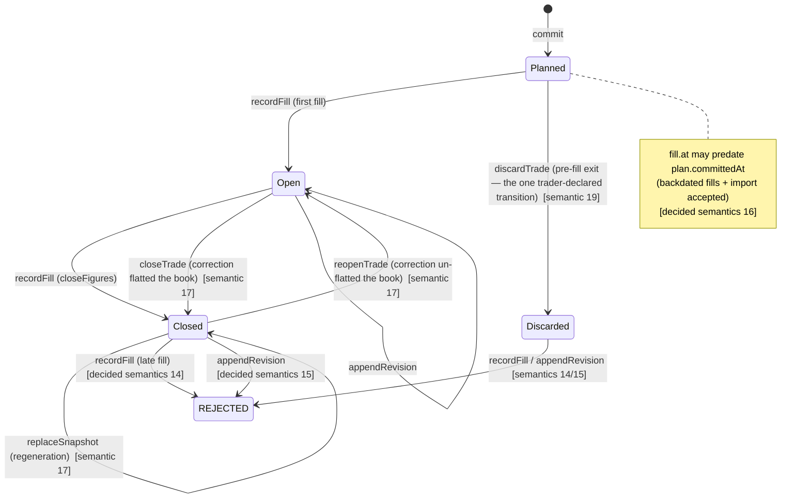

# TradingRecordStore — initial interface design

The trading record itself: Trade identity + lifecycle status (Planned/Open/
Closed/Discarded, stored authoritatively per ADR 0006) + optional `finalFigures` snapshot (per ADR
0007) + Plan (original levels, thesis, invalidation, entry emotion) + Plan
Revision (append-only dated deltas, ADR 0001) + Fill (instrument, side, qty,
price, time, instrument-type per leg, option contract facts when the leg is an
option — optionType/strike/expiry, ADR 0009). The deepest, most-touched
store.

It owns four invariants and the lifecycle transitions (the fourth — a Plan
declares ≥ 1 stop side — added by the PlanCommitCoordinator session). It deliberately owns
**no derivation**: no live P&L, no position size, no risk computation, no flat
detection — those are CalculationModule's (rules 1–2). It holds facts only, over
an injected StorageBinding (rule 5). Its `getTradeRecord()` returns exactly the
shape CalculationModule's `evaluate()` consumes (the data contract pinned in
[`calculation-module.md`](calculation-module.md)), plus three store-owned fields
calc ignores (`strategy`, `closedAt`, `fillId`).

Ten operations, over an injected StorageBinding — testable with an in-memory
binding, no mock, no real backend. Seven from the original session; three
guarded correction-transition ops (`reopenTrade`, `closeTrade`,
`replaceSnapshot`) added by the FillEntryCoordinator drill-down (OQs 12/13);
and `discardTrade`, the pre-fill exit, added by the PlanCommitCoordinator
drill-down (audit finding F1):

```ts
/** Create a Trade (status=Planned) with its committed Plan. Returns the new id.
 *  The plan-before-fill invariant starts here: no fill can be recorded against a
 *  tradeId that doesn't exist yet. Rejects a Plan declaring no stop side —
 *  the R-baseline precondition (semantic 18). */
commit(input: TradeInput): TradeId

/** Append a fill + transition status + (if closing) store the snapshot.
 *  The only FILL-DRIVEN status transition — there is no raw setStatus (decided
 *  semantics 2). The close decision (flat detection) is the caller's job
 *  (calc.isFlat); this store executes the transition and defensively asserts
 *  net-zero when closing. Returns the store-assigned fillId so callers need
 *  not read back and assume last-append (FillEntryCoordinator's reflection
 *  offer anchors on it). */
recordFill(tradeId: TradeId, fill: FillInput, closeFigures?: FigureSet): {
  statusAfter: Lifecycle
  fillId:      FillId
}

/** Append a dated Plan Revision (ADR 0001 — append-only, never overwrites).
 *  Single-store workflow; no coordinator (overview rule 8). */
appendRevision(tradeId: TradeId, revision: RevisionInput): void

/** Fix a data-entry error on a recorded fill. Invalidates finalFigures (nulls it
 *  — ADR 0007: "invalidated when underlying facts change"). Does NOT re-evaluate
 *  status; that's FillEntryCoordinator's call (OQ 12). */
correctFill(tradeId: TradeId, fillId: FillId, correction: FillInput): {
  invalidatedSnapshot: boolean
  statusPossiblyInvalid: boolean
}

/** Return the complete record for one Trade — the cohesive bundle. This is the
 *  shape calc.evaluate receives; exactly TradeRecord. */
getTradeRecord(tradeId: TradeId): TradeRecord

/** Filtered list. Collapses listOpenTrades + listTradeIds into one generic op.
 *  Returns full records; callers project. */
listTrades(filters?: TradeFilters): TradeRecord[]

/** Import a fully-formed historical Trade verbatim (ADR 0006/0007 derive-on-import).
 *  Unlike commit+recordFill (which build a Trade forward through the live timeline),
 *  this writes an entire record — arbitrary status, full fill + revision history,
 *  closedAt, finalFigures — in one call. Internally derives missing fields: if
 *  status is absent, derives it from fills once (ADR 0006); if a Closed trade's
 *  finalFigures is absent, the caller may pre-compute and pass it, or leave it null
 *  for lazy population on first read (ADR 0007). Keeps invariants enforced — an
 *  imported Closed trade with non-flat fills is rejected, and a stopless Plan
 *  is rejected (semantic 18). */
importTrade(record: TradeRecordInput): TradeId

/** Retire a committed-but-never-filled Trade — the pre-fill exit (added by
 *  the PlanCommitCoordinator session, audit finding F1). Asserts status
 *  'Planned' AND zero fills — the degenerate fill arithmetic (the guarded
 *  family's zero edge) and the system's one trader-declared transition; a
 *  never-entered trade has no fill arithmetic to compute. Sets
 *  status='Discarded' — terminal, snapshotless (no closedAt, no
 *  finalFigures). A status, not a delete: the forward-only grain holds — the
 *  Plan and any completed pre-entry reflection survive; only the owed
 *  placeholder voids (PlanCommitCoordinator.discardPlan's transaction).
 *  Exists only inside that workflow. */
discardTrade(tradeId: TradeId): { statusAfter: 'Discarded' }
```

---

## Interface

### Operations

```ts
commit(input: TradeInput): TradeId

recordFill(
  tradeId: TradeId,
  fill: FillInput,
  closeFigures?: FigureSet,
): { statusAfter: Lifecycle; fillId: FillId }

appendRevision(tradeId: TradeId, revision: RevisionInput): void

correctFill(
  tradeId: TradeId,
  fillId: FillId,
  correction: FillInput,
): { invalidatedSnapshot: boolean; statusPossiblyInvalid: boolean }

/** Re-open a Closed trade. Correction-driven sibling of recordFill's close
 *  branch (added by the FillEntryCoordinator session, OQ 12): asserts the
 *  current fills sum NON-zero (the guard — a flat trade cannot re-open),
 *  clears closedAt, nulls finalFigures (present iff Closed). The old snapshot
 *  is discarded — regenerable if the trade closes again. */
reopenTrade(tradeId: TradeId): { statusAfter: 'Open' }

/** Close a trade whose fills became flat via a CORRECTION, not a fill. Same
 *  guard class as recordFill's close branch: asserts the fills sum to zero,
 *  then sets status='Closed', closedAt, finalFigures atomically. Exists only
 *  inside FillEntryCoordinator.correctFill's branch map — there is no
 *  trader-facing declared close (CONTEXT: close rule). */
closeTrade(tradeId: TradeId, closedAt: Date, figures: FigureSet): { statusAfter: 'Closed' }

/** Write a REGENERATED snapshot onto an already-Closed trade (ADR 0007's
 *  regeneratable cache). Closed-only — throws otherwise: an Open trade's
 *  figures compute live on read, so there is nothing to store. Serves the
 *  post-correction regeneration path and the calc-bug-fix migration
 *  (FillEntryCoordinator.regenerateSnapshots). */
replaceSnapshot(tradeId: TradeId, figures: FigureSet): void

getTradeRecord(tradeId: TradeId): TradeRecord

listTrades(filters?: TradeFilters): TradeRecord[]

importTrade(record: TradeRecordInput): TradeId

discardTrade(tradeId: TradeId): { statusAfter: 'Discarded' }
```

### Input types

```ts
/** Identifiers (type aliases for readability; backing type is string).
 *  TradeId and FillId are store-assigned (generated by commit / recordFill). */
type TradeId      = string
type FillId       = string
type AccountId    = string
type StrategyId   = string
type InstrumentId = string
type Price        = number

type TradeInput = {
  accountId:  AccountId
  underlying: InstrumentId
  strategy:   StrategyId
  plan: {
    entry:         Price           // planned net entry price per unit (ADR 0010)
    stops:         Stops           // per risk direction, each side optional (ADR 0010)
    target:        Level           // ONE profit exit (ADR 0010)
    thesis:        string
    invalidation:  string
    entryEmotion:  string
    committedAt:   Date
  }
}

type FillInput = {
  instrument:     InstrumentId
  side:           'buy' | 'sell'
  quantity:       number                 // unsigned; sign derived from side
  price:          Price
  at:             Date                   // caller-provided (see decided semantics 7)
  instrumentType: InstrumentType         // per leg (ADR 0005)
  contract?:      OptionContract         // present iff an option leg (ADR 0009 payoff curve)
}

type RevisionInput = {
  at:      Date                                      // caller-provided
  stops?:  { downside?: Level, upside?: Level }      // per-side replace; absent side = unchanged (ADR 0010)
  target?: Level                                     // replaces the target
  reason:  string
}

type TradeFilters = {
  status?:     Lifecycle
  strategy?:   StrategyId
  accountId?:  AccountId
  underlying?: InstrumentId
  openedFrom?: Date
  openedTo?:   Date
  closedFrom?: Date
  closedTo?:   Date
}

/** A fully-formed Trade for import (ADR 0006/0007 derive-on-import). Like
 *  TradeRecord but without tradeId (the store assigns it) and with status
 *  optional (derived from fills once if absent). Used by importTrade only. */
type TradeRecordInput = {
  accountId:     AccountId
  underlying:    InstrumentId
  strategy:      StrategyId
  status?:       Lifecycle             // absent → derived from fills once (ADR 0006)
  closedAt?:     Date                  // present iff status === 'Closed'
  plan:          Plan
  revisions:     PlanRevision[]
  fills:         Fill[]                // each may carry a client-supplied fillId, or the store assigns one
  finalFigures?: FigureSet             // optional even for Closed → lazy-populate on read (ADR 0007)
}
```

### Output type — TradeRecord (the data contract, served)

```ts
/** The complete record for one Trade, as this store returns it and calc
 *  consumes it. Every field calc needs is present (calculation-module.md);
 *  three store-owned fields calc ignores are marked STORE-OWNED. */
type TradeRecord = {
  tradeId:       TradeId
  accountId:     AccountId
  underlying:    InstrumentId            // risk keyed off this; Price Marks by it
  strategy:      StrategyId              // STORE-OWNED — calc ignores; Reporting filters on it
  status:        Lifecycle               // stored authoritatively (ADR 0006)
  closedAt?:     Date                    // STORE-OWNED (OQ 11) — present iff Closed; snapshot-regen asOf
  plan:          Plan
  revisions:     PlanRevision[]          // append-only, dated (ADR 0001)
  fills:         Fill[]
  finalFigures?: FigureSet               // present iff status === 'Closed' (ADR 0007)
}

type Fill = {
  fillId:         FillId                 // STORE-OWNED — calc ignores; needed by correctFill + fill-level journal
  instrument:     InstrumentId
  side:           'buy' | 'sell'
  quantity:       number                 // unsigned; sign derived from side
  price:          Price
  at:             Date
  instrumentType: InstrumentType         // per leg — drives maximum risk (ADR 0005)
  contract?:      OptionContract         // present iff an option leg (ADR 0009 payoff curve)
}

// Plan, Stops, Level, PlanRevision, InstrumentType, OptionContract, Lifecycle, FigureSet, Dual,
// MaxRisk: UNCHANGED from calculation-module.md. The only contract change: three new
// store-owned fields (strategy, closedAt on TradeRecord; fillId on Fill), each
// marked STORE-OWNED and ignored by calc. One canonical TradeRecord type across
// both docs.
```

---

## Decided semantics

Each ruling cites the principle or ADR it derives from. Veto any during review.

1. **Eleven operations: `commit`, `recordFill`, `appendRevision`, `correctFill`,
   `getTradeRecord`, `listTrades`, `importTrade` + the guarded correction
   family `reopenTrade`, `closeTrade`, `replaceSnapshot` + `discardTrade`
   (the pre-fill exit).** The first seven are
   the lifecycle-verb shape (design-it-twice candidate A), plus `importTrade`
   added by the audit (semantic 13) to serve the ADR-mandated restore path, plus
   the three guarded ops added by the FillEntryCoordinator drill-down (semantic
   17, OQs 12/13), plus `discardTrade` added by the PlanCommitCoordinator
   drill-down (semantic 19, audit finding F1). The alternatives (fine-grained
   entity store with a raw
   `setStatus`; whole-document save) were rejected — see *Alternatives
   considered*. *(Overview rule 8; depth principle.)*

2. **Every status mutation is a fill-arithmetic-guarded op — no raw `setStatus`
   exists.** *(Reworded by the FillEntryCoordinator session; the original
   wording — "`recordFill` is the only op that changes lifecycle status" —
   held until OQ 12 forced the correction-driven siblings.)* The overview and
   calculation-module sketches spread the close path across `appendFill` +
   `setStatus` + `storeFinalFigures`. But `setStatus` is an invariant hole:
   nothing structurally prevents marking a non-flat trade Closed, and
   `storeFinalFigures` without a close is meaningless. A transition only ever
   fires *as a consequence of the fills' net position*, so every mutating op
   carries the matching guard: `recordFill`'s close branch and `closeTrade`
   assert net-zero; `reopenTrade` asserts net-nonzero; `discardTrade` asserts
   the degenerate edge — status Planned and zero fills — so the family stays
   fill-arithmetic-guarded end to end (the PlanCommit session, semantic 19).
   A guard failure throws
   rather than letting stored status drift from derived — the invariant ADR
   0006 names this store the owner of is enforced by the types of the
   interface, not by caller discipline. *(ADR 0006 — "TradingRecordStore owns
   the transition logic"; depth.)*

3. **The close *decision* is the caller's; the store executes.** `recordFill` takes
   an optional `closeFigures?: FigureSet`. The caller (FillEntryCoordinator) runs
   `calc.isFlat` on the simulated post-fill fills; if flat, it computes figures via
   `calc.evaluate` and passes `closeFigures` in. The store appends, transitions,
   snapshots. The store does *not* call calc (rule 1: stores hold facts; calc is a
   pure module with no storage access — and the store has no marks to give calc
   anyway). But it **defensively asserts**: if `closeFigures` was provided, the
   resulting fills must sum to net-zero; otherwise it throws. This catches a
   caller bug (passing closeFigures on a non-flat fill) at the store boundary
   rather than letting an inconsistent record persist. *(Rule 1; the cheap/rare
   split from ADR 0006/0007 — isFlat is cheap and runs per fill, evaluate is rare
   and runs only at close.)*

4. **`closedAt?: Date` resolves OQ 11 — on TradeRecord, not on finalFigures.**
   Worked scenario: a trade closes July 15 (fills flat, snapshot computed with
   marks as-of July 15). Six weeks later the trader fixes a fill typo ($156 →
   $155.50). The snapshot is stale and must regenerate. To regenerate,
   `calc.evaluate` needs `asOf = July 15` — but nothing on the record carries
   it. Reading it from `finalFigures` is circular (finalFigures is the thing being
   regenerated). `closedAt` is a *fact about the trade* (when it closed), stored
   at transition time parallel to how `status` is stored (ADR 0006). Regeneration
   uses `record.closedAt` as the `asOf`. It also serves Performance Reporting's
   date-range filter ("trades closed in Q3" = filter on `closedAt`). *(ADR 0006
   parallel — an event the app acts on is recorded, not derived; OQ 11 closed.)*

5. **`strategy: StrategyId` added to TradeRecord — store-owned, calc ignores.**
   Performance Reporting filters by strategy (overview walkthrough 4; CONTEXT.md:
   Strategy — "a named, reusable trading approach… used as a Trade tag for
   filtering and grouping"). But calc's `TradeRecord` (pinned in
   calculation-module.md) never carried it: single-trade math has no strategy
   dimension, so calc never needed it. The store needs it for filtering. Marked
   clearly `STORE-OWNED`; calc does not consume it. This is a ripple into calc's
   data contract — calculation-module.md is updated in this session to add the
   field with a "calc ignores" comment, keeping one canonical `TradeRecord` type.
   *(Rule 1 — strategy is a tag/fact, not a derivation; the store owns reference
   data.)*

6. **`fillId: FillId` added to Fill — store-owned, calc ignores.** Needed by two
   consumers: this store's `correctFill(tradeId, fillId, …)` and ReflectionStore's
   fill-level journal attachment ("reflection tied to a specific Fill",
   CONTEXT.md). Calc ignores it. Same ripple: calculation-module.md's `Fill` type
   gains the field. *(Identifier for correction + cross-store reference.)*

7. **Timestamps are caller-provided, not store-stamped.** `committedAt` (plan),
   `at` (fills, revisions) come from the caller. The store is a fact store, not a
   clock — storing what it's told. This makes import/restore natural (historical
   data carries original timestamps) and removes a clock dependency from unit
   tests. `closedAt` (decided semantics 4) is the exception — it's an
   event-occurrence time the store records at transition, and the caller passes it
   alongside `closeFigures`. *(Testability — no clock to stub; import fidelity.)*

8. **`TradeId` and `FillId` are store-assigned.** Generated on `commit` and
   `recordFill` respectively. Callers receive them in the return / via
   `getTradeRecord` and reference by ID. *(The store is the identity authority;
   callers never mint ids.)*

9. **`listTrades` collapses `listOpenTrades` + `listTradeIds` into one op.**
   `listOpenTrades()` becomes `listTrades({ status: 'Open' })`;
   `listTradeIds()` becomes `listTrades({}).map(t => t.tradeId)`. The overview's
   three read-ops fold into one filtered list that returns full records; callers
   project what they need. This is the depth move that takes the store from ~9 ops
   to 6 — one generic shape reused N times (collapse repeated CRUD, per the
   drill-down skill's depth guidance). *(Depth; deletion test — three near-identical
   reads were pass-throughs.)*

10. **`correctFill` invalidates the snapshot but does NOT re-evaluate status.**
    A corrected fill nulls `finalFigures` (ADR 0007: "invalidated when underlying
    facts change"). Whether the correction changes flat-ness (re-opening a closed
    trade) is OQ 12 — FillEntryCoordinator's call, not the store's. The store
    returns `statusPossiblyInvalid: boolean` as a *signal* (true if the correction
    could have changed net position, i.e. quantity/side/instrument changed), which
    the coordinator acts on. It does not itself run `calc.isFlat` (rule 1 — no calc
    in the store). It returns `invalidatedSnapshot: boolean` so the caller knows
    whether a snapshot regeneration is owed. *(ADR 0007; OQ 12 stays exported to
    FillEntryCoordinator; rule 1.)*

11. **`appendRevision` is append-only and single-store — no coordinator (rule 8).**
    Revisions are never overwritten; the op appends one dated revision (ADR 0001).
    The revision changes *current* risk (derived, downstream) but never *planned*
    risk (frozen at the initial plan). Because it touches only this store, it is a
    direct store call, not a coordinator — confirming the seam is drawn at a real
    boundary. *(ADR 0001; overview rule 8; CONTEXT.md: Plan Revision.)*

12. **StorageBinding is the persistence seam — zero business rules.** All seven
    ops delegate to put/get/delete/range-query over opaque fact records. Two
    implementations: in-memory (unit tests) and real (prod). No per-backend
    business rules — if this store had per-backend implementations, every
    invariant would be written N times. *(Overview rule 5.)*

13. **`importTrade` writes a fully-formed record verbatim (audit finding A,
    resolved).** The ADRs require an import path: ADR 0006 *"derive-on-import by
    evaluating each imported Trade's fills once"*; ADR 0007 *"populate the
    snapshot on import for closed Trades."* But `commit`+`recordFill` build a
    Trade *forward through the live timeline* — they can't write a historical
    Closed trade without replaying fills against import-time marks. `importTrade`
    writes the whole record in one call, deriving what's missing internally: if
    `status` is absent, it derives it from the fills once (ADR 0006); if a Closed
    trade's `finalFigures` is absent, the caller may pre-compute it or leave it
    null for lazy population on first read (ADR 0007). It keeps invariants
    enforced — an imported Closed trade whose fills don't sum to flat is rejected.
    Chosen over import-at-the-StorageBinding-seam (which would bypass the store's
    invariants) and over deferring to OQ 8 (which would leave the interface unable
    to serve a path the ADRs already require). *(ADR 0006/0007 derive-on-import;
    rule 5 — import still flows through the store, not around it.)*

14. **`recordFill` on a Closed trade rejects (audit finding B); on a Discarded
    trade rejects too (added by the PlanCommit session — terminal, and a
    discarded plan must not resurrect via a fill).** A late, forgotten
    fill that arrives after the trade closed is a real scenario, but re-opening
    via such a fill is the status-invalidating correction path — OQ 12, owned by
    FillEntryCoordinator — and the store has no reopen logic. Until that session
    designs reopen, the store throws rather than silently doing something
    undefined. *Veto if you want the store to re-open eagerly — but reopen is a
    coordinator-level decision per OQ 12.* *(Audit finding B; ADR 0006.)*

15. **`appendRevision` on a Closed trade rejects (audit finding C); on a
    Discarded trade rejects too (PlanCommit session — no position to protect,
    no going back).** A revision to
    a closed trade's stop/target is semantically void — no position to protect,
    no current-risk figure that consumes it. The store rejects it rather than
    accepting dead data. *Veto if you want silent accept (store-as-dumb-facts) —
    but rejecting catches a user error cheaply, and revisions to a closed trade
    have no downstream consumer.* *(Audit finding C; ADR 0001.)*

16. **The store does NOT validate `fill.at >= plan.committedAt` (audit finding D).**
    Plan-before-fill is an *existence* invariant (the trade must exist before a
    fill lands), not a temporal one. Backdated fills are legitimate (a trader
    enters a fill hours after execution), and import depends on accepting
    backdates. Clock-validation is fragile and would block legitimate use. The
    store accepts whatever `at` the caller provides. *Veto if you want temporal
    enforcement — but see import (semantic 13), which requires backdates.*
    *(Audit finding D; the store validates structural invariants, not temporal
    ones.)*

17. **The guarded correction family — `reopenTrade`, `closeTrade`,
    `replaceSnapshot` (added by the FillEntryCoordinator drill-down, OQs
    12/13).** A fill correction can change net position in either direction:
    un-flatting a Closed trade (→ should-be-Open) or flatting an Open one
    (→ should-be-Closed, with `closedAt = correction.at`). ADR 0006 requires
    stored status to agree with derived, so the store serves both transitions:
    `reopenTrade` asserts the fills sum non-zero and clears `closedAt` +
    `finalFigures`; `closeTrade` asserts net-zero and sets status + `closedAt`
    + `finalFigures` atomically; `replaceSnapshot` writes a regenerated
    snapshot onto an already-Closed trade (Closed-only — a live trade's
    figures compute on read). The guards are the same net-position arithmetic
    class semantic 3's close assertion already uses — not a new calc
    dependency (rule 1 holds: the store sums quantities, it never derives
    figures). From-status made explicit by the PlanCommit session once
    `Discarded` joined the lifecycle: `reopenTrade` guards from Closed,
    `closeTrade` from Open — a Discarded trade's fills are trivially
    net-zero, which must not satisfy `closeTrade`'s arithmetic alone.
    `recordFill` on a Closed trade still rejects (semantic 14): late
    fills resolve via an explicit `reopenTrade` then re-record. See
    [fill-entry-coordinator.md](fill-entry-coordinator.md) for the branch map
    that orchestrates these. *(ADR 0006/0007; OQs 12/13 closed.)*

18. **A Plan declares ≥ 1 stop side — the R-baseline precondition (added by
    the PlanCommitCoordinator session).** `commit` and `importTrade` reject a
    Plan whose `stops` declares no side. Every R-metric — `rMultiple`,
    expectancy, the R-distribution — divides by planned risk; a stopless plan
    has no baseline, and calc's `evaluate` over zero declared sides is an
    unwritten behavior this guard makes structurally unreachable. No
    legitimate backup contains one (commit blocks them, so none was ever
    committed) — the same import-fidelity reasoning as reject-non-flat-Closed
    (semantic 13). *(ADR 0005 — planned risk is the commitment baseline;
    calculation-module semantic 20.)*

19. **`discardTrade` — the pre-fill exit (added by the PlanCommitCoordinator
    session, audit finding F1).** Asserts `status = 'Planned'` and
    `fills = []`, sets `status = 'Discarded'`. Terminal and snapshotless: no
    `closedAt`, no `finalFigures` — nothing downstream ever consumes a
    Discarded trade (`recordFill` and `appendRevision` reject, semantics
    14/15; every existing status filter — Open for Daily Review, Closed for
    reporting — excludes it by construction; `listTrades({status:
    'Discarded'})` finds the retired ideas when wanted). The **one
    trader-declared transition** in the system: close is always
    fill-computable (no trader-declared close, CONTEXT), but a never-entered
    trade has no fill arithmetic to compute — its guard *is* the absence of
    fills. A status, not a delete: the forward-only grain holds (no delete op
    exists in any store), a trader may have journaled against a plan they
    were watching (convention C6 tolerates import *ordering*, not permanent
    orphaning), and the story survives — the Plan and any completed
    pre-entry reflection are retained; only the owed placeholder voids,
    inside [PlanCommitCoordinator.discardPlan](plan-commit-coordinator.md)'s
    transaction. Exists only inside that workflow — the mirror of
    `closeTrade`-inside-the-correction. *(PlanCommit audit finding F1; ADR
    0006's guarded family; CONTEXT: Journal Placeholder.)*

---

## Worked examples

### Plan-commit — AAPL, entry $150, stop $147, target $156

```ts
const tradeId = store.commit({
  accountId:  'ib-401',
  underlying: 'AAPL',
  strategy:   'breakout',
  plan: {
    entry: 150,
    stops:  { downside: { basis: 'underlying', at: 147 } },   // ADR 0010 — one side declared
    target: { basis: 'underlying', at: 156 },
    thesis:       'cup-and-handle breakout above $148 resistance',
    invalidation: 'handle fails, closes below $146',
    entryEmotion: 'confident — waited two weeks for this',
    committedAt:  new Date('2024-07-15T14:20:00Z'),
  },
})
// → 'tr_001' (store-assigned)
// Record state: status='Planned', fills=[], revisions=[], no finalFigures, no closedAt.

const record = store.getTradeRecord(tradeId)
// → { tradeId:'tr_001', accountId:'ib-401', underlying:'AAPL', strategy:'breakout',
//     status:'Planned', plan:{...}, revisions:[], fills:[], /* no closedAt, no finalFigures */ }
```

The plan-before-fill invariant is now active: `recordFill('tr_001', …)` works;
`recordFill('nonexistent', …)` throws. Calc can validate planned R:R from this
record (2.0 = (156−150)÷(150−147)); Performance Reporting can filter by
strategy='breakout'.

### Fill-entry — the three branches of `recordFill`

**Branch 1: first fill → Open.**

```ts
const r1 = store.recordFill('tr_001', {
  instrument: 'AAPL', side: 'buy', quantity: 100, price: 150,
  at: new Date('2024-07-15T15:00:00Z'), instrumentType: 'stock',
})
// → { statusAfter: 'Open', fillId: 'fill_001' }   // first fill ever → Planned→Open. No closeFigures passed.
```

**Branch 2: intermediate fill → status unchanged.** (e.g. scaling in)

```ts
const r2 = store.recordFill('tr_001', {
  instrument: 'AAPL', side: 'buy', quantity: 50, price: 151, at: …, instrumentType: 'stock',
})
// → { statusAfter: 'Open', fillId: 'fill_002' }   // not first, no closeFigures → unchanged. Position now +150.
```

**Branch 3: closing fill → Closed + snapshot.** The coordinator has already run
`calc.isFlat` on the simulated fills (+150 then −150 = 0) and computed figures:

```ts
// FillEntryCoordinator, before calling the store:
//   const fills = store.getTradeRecord('tr_001').fills          // +100, +50
//   const simFills = [...fills, {side:'sell', quantity:150, …}]  // simulate the close
//   if (calc.isFlat(simFills)) {                                  // true: +150 −150 = 0
//     const marks = priceMarks.buildMarksFromFills(simFills, closeTime)
//     const figures = calc.evaluate(record, marks, closeTime)
//     // pass both into the store:
//   }

const r3 = store.recordFill('tr_001',
  { instrument:'AAPL', side:'sell', quantity:150, price:156, at: closeTime, instrumentType:'stock' },
  closeFigures,   // ← present: signals "this fill closes the trade"
)
// → { statusAfter: 'Closed', fillId: 'fill_003' }
// Store internally: appends fill, asserts net-zero (150−150=0 ✓), sets status='Closed',
// sets closedAt=closeTime, sets finalFigures=closeFigures.
```

If the coordinator passed `closeFigures` but the fills did *not* sum to zero, the
store throws — the defensive net-zero assertion catches the bug at the boundary.

### Plan revision — direct store call, no coordinator (rule 8)

```ts
store.appendRevision('tr_001', {
  at: new Date('2024-07-16T14:00:00Z'),
  stops: { downside: { basis: 'underlying', at: 150 } },   // trailing the downside stop up $147 → $150
  reason: 'breakeven — locked in after day-1 close above $152',
})
// Record now: revisions=[{at, stops:{downside:{…, at:150}}, reason}]. No status change. No coordinator.
// Downstream effect: calc's current-risk uses the downside stop 150 (the latest revision);
// planned-risk still uses the original 147 (frozen, ADR 0001).
```

### Fill correction — invalidating the snapshot (ADR 0007)

Trade closed July 22 at $156. Six weeks later, trader realizes the closing fill
was $155.50, not $156 (a typo). `finalFigures` was computed against $156 and is
now stale.

```ts
const result = store.correctFill('tr_001', 'fill_003', {
  instrument:'AAPL', side:'sell', quantity:150, price:155.50,   // ← corrected price
  at: originalCloseTime, instrumentType:'stock',
})
// → { invalidatedSnapshot: true, statusPossiblyInvalid: false }
//   - finalFigures is now null (must be regenerated by FillEntryCoordinator).
//   - statusPossiblyInvalid: false because qty/side/instrument are unchanged
//     (only price changed → flat-ness unaffected → status stays Closed).
//   - If the correction had changed quantity (e.g. 150 → 100), net position
//     would be +50 (not flat) → statusPossiblyInvalid: true → coordinator must
//     re-run isFlat and may need to re-open the trade (OQ 12).
```

The regeneration, when the coordinator performs it, uses `record.closedAt` as the
`asOf` for `calc.evaluate` — the OQ 11 payoff.

### Reads — `listTrades` collapses three queries

```ts
// "Show me my open trades" (Daily Review)
store.listTrades({ status: 'Open' })
// → [TradeRecord, …] with full bundles; coordinator runs evaluate per trade.

// "All trades on this account in Q3" (Performance Reporting)
store.listTrades({ accountId:'ib-401', closedFrom: q3Start, closedTo: q3End })

// "Just the ids" (backup/export enumeration)
store.listTrades({}).map(t => t.tradeId)
```

---

## Sequence: plan-commit (start a Trade)

The store's half of the plan-commit workflow. (Coordinator internals pinned in
[plan-commit-coordinator.md](plan-commit-coordinator.md).)

```
trader → PlanCommitCoordinator.commitPlan(tradeInput)
  → figures = CalculationModule.evaluate(sketch, ∅, committedAt)  // the validation charter:
      └─ blocks (no stop side / misplaced side / non-profit target) → throw, nothing written
  → StorageBinding.transaction:                     // the cross-store commit (OQ 9)
      TradingRecordStore.commit(tradeInput)         // the store's write
      │  asserts ≥1 declared stop side (semantic 18)
      └─ assigns tradeId, persists Trade (status=Planned) + Plan
      ReflectionStore.createPlaceholder(level:'trade', type:'pre-entry',
                                        required:true, createdAt: committedAt)
← { tradeId, figures, warnings }
```

The plan-before-fill invariant is established: the Trade
exists with a Plan before any fill can land.

## Sequence: fill-entry (all three branches in one call)

```
trader → FillEntryCoordinator.recordFill(tradeId, fillInput)
  → existing = TradingRecordStore.getTradeRecord(tradeId)        // load current fills
  → simFills = [...existing.fills, fillInput]                    // simulate post-fill
  → branch on calc.isFlat(simFills):
      └─ false (not flat):
          → TradingRecordStore.recordFill(tradeId, fillInput)    // no closeFigures
          ← { statusAfter: <Open if first fill, else unchanged> }
      └─ true (flat — the closing fill):
          → marks = PriceMarkStore.buildMarksFromFills(simFills, now)
          → closeTime = fillInput.at
          → figures = calc.evaluate({ ...existing, fills: simFills }, marks, closeTime)
          → TradingRecordStore.recordFill(tradeId, fillInput, figures)   // ← closeFigures
              └─ store: append fill; assert net-zero ✓; setStatus('Closed');
              └─          set closedAt=closeTime; set finalFigures=figures (ADR 0007)
          ← { statusAfter: 'Closed' }
          → ReflectionStore.createPlaceholder(tradeId, 'post-close', required=true)
  → (always) ReflectionStore.offerPlaceholder(fillId, 'fill', required=false)
← { statusAfter, placeholdersOffered }
```

The cheap/rare split (ADR 0006/0007): `isFlat` runs on every fill (cheap, no
marks); `evaluate` runs only on the flat-detecting fill (rare, needs marks). The
store's `recordFill` absorbs the transition + snapshot in both branches — one
atomic call, no separate `setStatus` or `storeFinalFigures` for the coordinator
to sequence.

## Sequence: snapshot regeneration after a fill correction

```
trader → FillEntryCoordinator.correctFill(tradeId, fillId, correction)
  → TradingRecordStore.correctFill(tradeId, fillId, correction)
      └─ replaces fill by fillId; nulls finalFigures if it was present
      ← { invalidatedSnapshot, statusPossiblyInvalid }
  → branch:
      └─ statusPossiblyInvalid: true (qty/side/instrument changed):
          → re-run calc.isFlat on corrected fills
          → if no longer flat → reopenTrade(tradeId)   // asserts non-zero; clears closedAt, nulls finalFigures
      └─ statusPossiblyInvalid: false AND invalidatedSnapshot: true:
          → record = TradingRecordStore.getTradeRecord(tradeId)
          → marks = PriceMarkStore.buildMarksFromFills(record.fills, record.closedAt)  // ← OQ 11 payoff
          → figures = calc.evaluate(record, marks, record.closedAt)                    // asOf = original close
          → TradingRecordStore.replaceSnapshot(tradeId, figures)     // ← resolved: the write-back op
```

**Resolved by the FillEntryCoordinator drill-down:** the GAP this sequence
exposed (no op to write a regenerated snapshot onto an already-Closed trade)
is closed by `replaceSnapshot` (decided semantics 17), and the re-open path by
`reopenTrade`. The full branch map — including the close-by-correction edge
(a correction that flats an Open trade) — lives in
[fill-entry-coordinator.md](fill-entry-coordinator.md).

## Sequence: daily-review read path (the store's cheap query)

```
trader → DailyReviewCoordinator.runDailyReview(today)
  → TradingRecordStore.listTrades({ status: 'Open' })     // cheap indexed filter (ADR 0006)
  → for each open trade:
      → record = TradingRecordStore.getTradeRecord(tradeId)  // (or project from the list result)
      → marks = PriceMarkStore.buildMarksFromFills(record.fills, today)
      → figures = calc.evaluate(record, marks, today)        // live figures
      → [assemble into DailyReviewView]
```

The O(all-trades) recomputation that ADR 0006 rejected is avoided: `listTrades`
filters on stored status, not derived flat-ness. Closed trades are never touched
by this query.

## Sequence: import / restore (audit diagram A — cold start with historical data)

```mermaid
sequenceDiagram
    actor T as trader
    participant Imp as restore tool
    participant TRS as TradingRecordStore

    T->>Imp: restore(backup of 3 years of trades)
    Note over Imp,TRS: For each historical trade, write it verbatim:<br/>arbitrary status, closedAt, finalFigures,<br/>full fill + revision history
    loop each historical trade
        Imp->>TRS: importTrade(recordInput)
        Note over TRS: derive missing status from fills once (ADR 0006)<br/>accept pre-computed finalFigures or leave null<br/>reject Closed trade with non-flat fills
        TRS-->>Imp: tradeId (newly assigned)
    end
end
```

This flow exposed audit finding A: `commit`+`recordFill` build a Trade forward
through the live timeline and could not write a historical Closed trade without
replaying fills against import-time marks. `importTrade` (decided semantics 13)
writes the whole record verbatim in one call, deriving missing fields internally.

## Sequence: the lifecycle state machine (audit diagram B — edges the sketch left undefined)



Three edges were undefined in the initial sketch; all three are now decided
semantics (14, 15, 16). The correction-driven edges (`closeTrade`,
`reopenTrade`, `replaceSnapshot`) were added by the FillEntryCoordinator
session (OQ 12/13 — semantic 17); every transition remains
fill-arithmetic-guarded (semantic 2).

---

## Requirements fulfilled / exported

### Closed here (open questions resolved)

| OQ | Resolution |
|---|---|
| **4 — Legs / instrument-type: per-Fill vs derived leg view?** | **Per-Fill.** instrumentType is a first-class attribute of each Fill (ADR 0005; already typed in `calculation-module.md`). A "leg" is a conceptual grouping of fills by instrument — a *derivation* (calc's internal logic, or presentation), not a fact the store persists. No `getLegs` op; rule 1 settles it (stores hold facts, legs are derived). |
| **11 — Snapshot `asOf` / `closedAt` (exported from CalculationModule)** | **`closedAt?: Date` on TradeRecord**, present iff Closed, stored at transition time. Regeneration passes `record.closedAt` as `asOf` to `calc.evaluate`. Serves Performance Reporting's date-range filter too. |

### Audit findings (sequence-diagram audit) — applied in this session

| Finding | Category | Resolution |
|---|---|---|
| **A — No op writes a fully-formed historical record for import/restore.** ADRs 0006/0007 require derive-on-import, but `commit`+`recordFill` build forward through the live timeline. | Missing operation | **`importTrade` added** (decided semantics 13). Writes a record verbatim, derives missing status/snapshot internally, keeps invariants enforced. Chosen over StorageBinding-seam bypass (invariant hole) and deferral (leaves an ADR-required path unserved). |
| **B — `recordFill` on a Closed trade (a late fill) was undefined.** | Unwritten rule | **Rejects** (decided semantics 14). Re-open was OQ 12, owned by FillEntryCoordinator; designed since — `reopenTrade` (semantic 17), with the late-fill resolution path in [fill-entry-coordinator.md](fill-entry-coordinator.md). `recordFill` on Closed still rejects. |
| **C — `appendRevision` on a Closed trade was undefined.** | Unwritten rule | **Rejects** (decided semantics 15). A revision to a closed trade's levels is semantically void. |
| **D — Does the store validate `fill.at >= plan.committedAt`?** | Unwritten rule | **No** (decided semantics 16). Plan-before-fill is an existence invariant, not a temporal one. Backdated fills + import require accepting arbitrary `at`. |
| **(from drafting) — Snapshot write-back after regeneration.** `correctFill` nulls the snapshot; the regen sequence recomputes one, but no op writes it back onto an already-Closed trade. | Missing operation | **Fulfilled by the FillEntryCoordinator session:** `replaceSnapshot(tradeId, figures)` (decided semantics 17). Standalone rather than a widened `correctFill`, so the mark-correction path (OQ 14) can write back with no fill corrected. |

### Exported to downstream sessions (commitments)

- **→ CalculationModule (ripple, applied in this session):** three store-owned
  fields added to the canonical types, each marked "calc ignores":
  `strategy: StrategyId` and `closedAt?: Date` on `TradeRecord`;
  `fillId: FillId` on `Fill`. calc's `evaluate`/`isFlat` signatures and behavior
  are unchanged — these fields are inert to calc. One canonical `TradeRecord`
  type spans both docs.
- **→ FillEntryCoordinator:** owns the `recordFill` close path. Must
  simulate-and-decide: load the record, run `calc.isFlat` on simulated post-fill
  fills, and if flat, compute figures via `calc.evaluate` and pass `closeFigures`
  into `recordFill`. The store defensively asserts net-zero when `closeFigures` is
  present; the coordinator must ensure its simulation and the store's result
  agree. Owns OQ 12 (the status-invalidating correction path) — **resolved**
  by the guarded family above (`reopenTrade`/`closeTrade`/`replaceSnapshot`);
  see [fill-entry-coordinator.md](fill-entry-coordinator.md) for the branch map.
- **→ FillEntryCoordinator (requirement fulfilled):** the snapshot
  *regeneration* path — `replaceSnapshot` (decided semantics 17) writes a
  regenerated snapshot onto an already-Closed trade; `recordFill` returns
  `fillId` so the coordinator's fill-reflection offer need not read back and
  assume last-append.
- **→ ReflectionStore:** `Fill.fillId` is the join key for fill-level journal
  attachments ("reflection tied to a specific Fill", CONTEXT.md). The store
  assigns `fillId` on `recordFill`; ReflectionStore references it.
- **→ PerformanceReportingCoordinator:** filters via `listTrades(filters)` —
  `status`, `strategy`, `accountId`, `underlying`, and date ranges on
  opened/closed. Closed trades carry `finalFigures` (read the snapshot, no
  recomputation — ADR 0007); `closedAt` is the close-date filter key.
- **→ DailyReviewCoordinator:** `listTrades({ status: 'Open' })` is the cheap
  open-Trades query (ADR 0006). Returns full records; the coordinator runs
  `calc.evaluate` per trade for live figures.
- **→ Backup/restore (OQ 8):** this store now exposes `importTrade(record):
  TradeId` for the restore path — a fully-formed record written verbatim with
  derive-on-import for missing status/snapshot (ADRs 0006/0007). The broader
  backup/export/import architecture (storage-seam fan-out vs. lifecycle
  coordinator, OQ 8) is still open globally, but this store's *slice* of restore
  is served: a restore tool can call `importTrade` per historical trade. If OQ 8
  later decides restore fans out at the StorageBinding seam instead, `importTrade`
  remains as the API-level import path (useful for partial imports, CSV ingest,
  etc.) and the seam choice is orthogonal.

---

## Open items

| Item | Owned by |
|---|---|
| **Snapshot write-back after regeneration (audit finding) — RESOLVED.** `replaceSnapshot(tradeId, figures)` added (decided semantics 17); the branch map that orchestrates it lives in [fill-entry-coordinator.md](fill-entry-coordinator.md). | resolved (FillEntryCoordinator ✓) |
| **OQ 12 — status-invalidating correction — RESOLVED.** `reopenTrade` (un-flatting corrections) + `closeTrade` (flatting corrections) added (decided semantics 17). `recordFill` on Closed still rejects (semantic 14); late fills resolve via explicit `reopenTrade` then re-record. | resolved (FillEntryCoordinator ✓) |
| **StorageBinding shape.** This store assumes `put/get/delete/range-query` over opaque records (overview rule 5), but the StorageBinding interface itself is not yet pinned. The exact primitive set (does range-query support compound filters, or does the store filter in memory?) is deferred to a StorageBinding drill-down or to implementation. | StorageBinding drill-down / implementation |
| **Multi-fact write atomicity (OQ 9) — RESOLVED.** `commit` writes Trade+Plan together; `recordFill` (close branch) writes fill+status+closedAt+finalFigures together. These are single-store multi-fact writes, atomic via the **same `StorageBinding.transaction` primitive** the coordinators use cross-store (one mechanism system-wide; decided in the PlanCommitCoordinator session). The primitive's exact API is the StorageBinding shape question (row above). | resolved (OQ 9) — primitive shape: StorageBinding drill-down / implementation |
| **`TradeId`/`FillId` generation strategy.** Store-assigned (decided semantics 8), but the format (UUID, sequential, prefixed like `tr_001`) is an implementation detail. Deferred. | Implementation |

---

## Alternatives considered

### Module shape (design-it-twice)

- **Candidate A — Lifecycle-verb store** (adopted). Seven ops through the
  audit: `commit`, `recordFill`, `appendRevision`, `correctFill`,
  `getTradeRecord`, `listTrades`,
  `importTrade` (the last added by the audit, decided semantics 13). Each write
  op matches its natural edit shape (commit = whole plan, recordFill = one fill +
  transition + optional snapshot, appendRevision = one revision, correctFill =
  replace one fill, importTrade = whole verbatim record). The headline move:
  `recordFill` absorbs the entire transition path — append + status change +
  snapshot in one atomic call. No raw `setStatus` exists, so the lifecycle
  invariant (ADR 0006: the store owns transitions) is structurally unbreakable
  rather than caller-enforced. `listTrades` collapses three near-identical read
  ops into one generic filtered list. Deepest on the depth principle: seven ops
  hide transitions, three invariants, two append-only histories, a cache seam,
  and the ADR-mandated import path. Cost: the coordinator must simulate-and-decide
  (load the record, run `calc.isFlat` on the simulated post-fill fills, compute
  figures if flat, then pass `closeFigures` into the store) — a lightweight
  pure-computation dance, but work the coordinator does that the store "knows the
  answer to." Accepted because the alternative (the store calls calc) violates
  rule 1 and the store has no marks to feed calc anyway.

- **Candidate B — Fine-grained entity store** (rejected). ~11 ops with separate
  `appendFill`, `setStatus`, `storeFinalFigures`, `getFills`, `getRevisions`,
  `listOpenTrades`, `listTradeIds`, etc. Maximally flexible and matches the
  overview's naive sketch (which spread the close across three calls). Rejected
  on two grounds. First, `setStatus` is an invariant hole: nothing structurally
  prevents `setStatus('Closed')` on a Planned or non-flat trade — the invariant
  ADR 0006 says *this store* owns becomes caller-enforced convention, the weakest
  form. Second, it fails the deletion test: most ops are pass-throughs, and the
  read ops force consumers to reassemble the cohesive bundle (trade + plan +
  revisions + fills) from 3–4 gets, when consumers always want them together
  (calc, the R:R chart, P&L, close-rule all do). Shallow.

- **Candidate C — Whole-document store** (rejected). ~4 ops: `save(trade)`,
  `load(tradeId)`, `list(filters)`, `delete`. The caller constructs the complete
  trade and saves it; the store validates invariants by diffing against the prior
  version. Highest raw op-count depth, and the read path is ideal (one load
  returns the bundle). Rejected because the write path is mismatched to the edit
  shape: appending one fill or one revision means resubmitting the entire trade
  document — every append becomes a full-record round-trip, and the invariant-diff
  logic the store must run recreates the fine-grained semantics internally
  (complexity moves, doesn't vanish). Also the weakest at the transition boundary:
  the caller can construct a Closed trade with non-flat fills, and the store's
  diff-based validation is a weaker check than Candidate A's structural one
  (no setStatus to misuse).

### The close-decision location (within A)

- **Coordinator decides, store executes** (adopted). `recordFill` takes optional
  `closeFigures?`; the coordinator runs `calc.isFlat` on simulated fills and
  passes `closeFigures` iff flat. The store appends, transitions, snapshots, and
  defensively asserts net-zero when `closeFigures` is present. Chosen because it
  keeps calc out of the store (rule 1) — the store has no marks to feed
  `calc.evaluate` at close time anyway, so it *cannot* compute figures itself
  without a cross-store dependency on PriceMarkStore that would break the
  "stores never call each other" rule. The net-zero assertion is the safety net:
  a coordinator bug (passing closeFigures on a non-flat fill) is caught at the
  store boundary.

- **Store decides, by calling calc** (rejected). The store runs `calc.isFlat`
  itself on `recordFill` and, if flat, calls `calc.evaluate`. Rejected on rule 1
  (stores hold facts; calc is a pure module — and critically, the store has no
  marks: it would need PriceMarkStore to build the marks map, violating "stores
  never call each other" from the who-calls-whom matrix). The close path
  inherently spans TradingRecord + PriceMark + calc; that cross-store join is
  exactly what coordinators exist for (overview rule 8).

- **Store decides by flat-check only, no figures** (rejected). The store runs
  `calc.isFlat` and transitions status, but leaves `finalFigures` null for the
  coordinator to fill in via a separate op. Rejected because it splits the atomic
  close into two writes (status now, snapshot later) and recreates the
  fine-grained sequencing Candidate A was designed to avoid — plus the separate
  snapshot op is another invariant hole (store it before/without the status
  change?).
