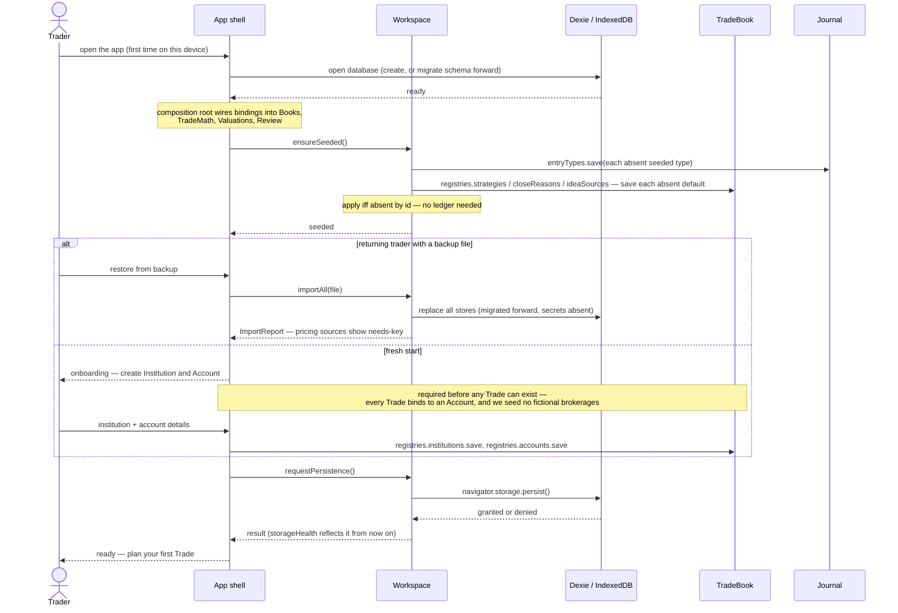

# Workspace — initial interface design

Everything about the app itself rather than the trading: backup/restore, storage durability, first-run seeding, settings. The only module allowed to touch the raw StorageBindings across all Books.

## Interface

```typescript
interface Workspace {
  exportAll(): Promise<Blob>                     // one versioned JSON file: every store + settings (minus secrets)
  importAll(file: Blob): Promise<ImportReport>   // full replace; migrates older export versions forward
  storageHealth(): Promise<StorageHealth>
  requestPersistence(): Promise<boolean>         // asks the browser for durable storage; UI picks the moment
  ensureSeeded(): Promise<void>                  // idempotent, runs at every startup
  settings: {
    get<K extends keyof Settings>(key: K): Promise<Settings[K]>
    set<K extends keyof Settings>(key: K, value: Settings[K]): Promise<void>
  }
}

interface StorageHealth {
  persisted: boolean                             // navigator.storage.persist() granted?
  usageBytes: number
  quotaBytes: number
  lastExportAt?: Timestamp                       // powers the backup nudge (policy renders in Review UI)
}

interface ImportReport {
  schemaVersion: number
  migrated: boolean                              // file was older and was upgraded on the way in
  counts: Record<string, number>                 // records restored per store
}

interface Settings {
  riskFreeRate: number                           // IV display (TradeMath callers read it from here)
  pricingSources: { id: string; enabled: boolean; apiKey?: string }[]
  backupNudgeDays: number                        // how stale lastExportAt may get before Review nudges
}
```

Six operations plus the typed settings pair.

## Decided semantics

- **Import is replace-only — it is a restore, not a merge.** Merging two databases is sync territory, rejected with the hosted options (ADR 0001/0011). The flow requires explicit confirmation and offers a safety export of current data first. Older export files migrate forward on the way in; the export schema version and the IndexedDB (Dexie) schema version share one lineage.
- **Export reads raw stores, not Book interfaces** — the file is a faithful dump independent of domain logic, so round-trips are exact and export can never fail on a domain rule. Data was valid when exported; migrations handle shape changes.
- **Secrets never leave.** `exportAll` excludes API keys — a backup file shared for debugging (or synced to a cloud drive) must not leak credentials. After a restore, pricing sources show as needs-key.
- **Seeding is additive, never destructive — apply iff absent.** `ensureSeeded` applies each seed item (default Entry Types with prompt content, Strategy templates, Close Reasons, the Trade Review type with its Action list) only when nothing with that id exists. Because registries archive and never delete, existence alone is the ledger: edited defaults are never overwritten, archived ones never resurrected, and new defaults shipped in a later app version are added to old databases. Seeding goes through the Book interfaces (never raw stores) so invariants hold.
- **`lastExportAt` is a fact here; the nudge is policy in the UI.** Same facts-vs-behavior split as everywhere else. A future auto-backup (File System Access API, user-granted directory) would slot behind `exportAll` without interface change.

## Sequence: initializing a new instance



## Open items

- Seed content itself (prompt text, default Strategy templates' Planned Legs and Exit Level kinds, default Action list) — the Slice 1 seeding task, tracked in journal.md/review.md.
- Export encryption (passphrase-protected backup) — deferred until someone actually wants it.
