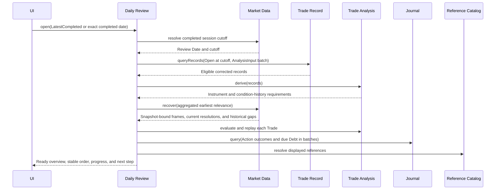
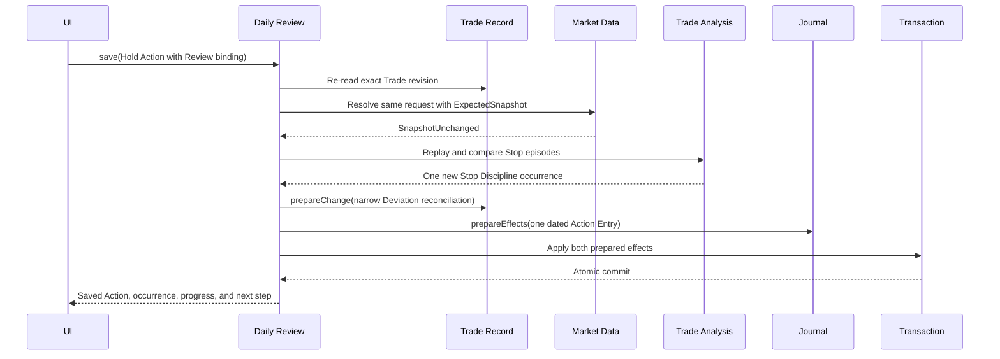
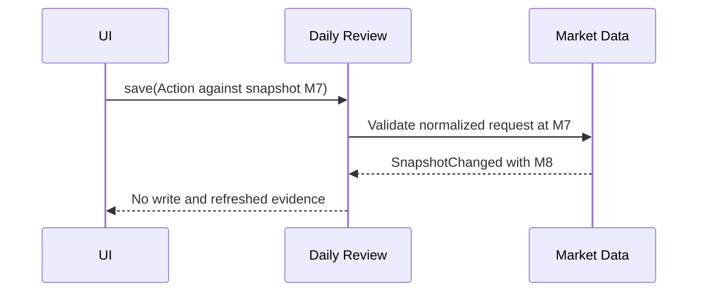
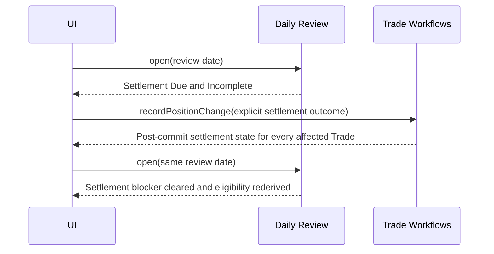

# Daily Review

## Contract

Daily Review coordinates the after-close ritual for one exact completed U.S. trading session. It derives eligibility and progress from corrected Trade facts, Market evidence, Journal outcomes, and reference data. It owns no Review Session, stage, completion flag, Action fact, Mark, trading fact, or report.

```text
interface DailyReview
  open(request: OpenDailyReviewRequest) -> OpenDailyReviewResult
  getTrade(request: GetDailyTradeReviewRequest) -> GetDailyTradeReviewResult
  getDebt(request: GetDailyReviewDebtRequest) -> GetDailyReviewDebtResult
  save(command: DailyReviewSaveCommand) -> DailyReviewSaveResult
```

Calling `open` again is refresh. There is no start, finish, progress-save, skip, trade execution, or subscription operation.

## Date, eligibility, and ordering

The request selects `LatestCompleted` or one `ExactCompleted` Review Date plus an as-of instant. Market Data resolves its session cutoff. Eligible Trades are those whose corrected effective facts place stored/verified Lifecycle State at `Open` at that cutoff—not those open today. A later correction may restate past eligibility and completion.

The task-family order is normative:

1. unresolved current-date Missing Marks;
2. due Journal Debt;
3. settlement facts still due;
4. the attention-ranked eligible Trade walk.

Acknowledged Unavailable evidence is resolved but disclosed. Historical gaps are separately visible and do not block the current Review.

Attention uses transparent bands: factual/management blocker, boundary reached, evidence limited, quantified pressure, then routine. It returns reasons and inputs, not a stored severity or discipline score. Within a Review view, order is stable. A fresh `open` may produce a new order.

For comparable Trades, pressure uses Monetary Ongoing Risk to Stop when it is a Value, otherwise evaluable Worst-Case Ongoing Risk; reward uses Incremental Reward to Target when it is a Value, otherwise evaluable Maximum Incremental Reward. Positive or Unbounded risk with zero/nonpositive reward ranks Highest; finite risk against Unbounded reward ranks Zero; missing inputs are Not Comparable. Boundary-reached status stays in its higher band even if risk distance has become zero. Within a band, comparable pressure sorts descending, then Last Activity descending, then stable Trade identity. Every reason and selected basis is returned.

## `open`

Open first resolves the date, then queries Trade Record's correction-aware `StateAtEconomicCutoff(Open)`, derives every returned Trade, aggregates each exact Instrument requirement using the earliest relevant condition date, and calls Market Data recovery in bounded batches. It then assembles one coherent authoritative read of Trade, evidence, Journal outcomes/Debt, and labels.

The only possible open-time write is provider observation recovery through Market Data. Opening never creates a Review, Action, placeholder, Debt, Deviation, or behavioral evidence.



Provider absence/failure yields a Ready view with Manual Mark tasks and safe diagnostics. Empty means no eligible Trades and no other required task; completed Reviews with eligible Trades remain Ready.

## `getTrade`

Returns one bound eligible Trade with factual summary, labels, exact Mark frame/Stale context, valuation/risk/payoff results, replay and Deviation comparison, due routes, and Action form state. If the overview binding is no longer coherent it returns `ReviewChanged`, never a hybrid.

For a new Action, Hold is preselected only in returned view state. The visible Save button creates the one-click unchanged-Hold path. Opening, selecting, or navigating away records nothing. Exit, Roll, and Adjust require nonblank Intent. Saving any Action records intent only and may offer navigation to a Trade Workflow; it never executes or infers a Position Change.

## `getDebt`

Pages global due Debt or loads one exact stored form. Due means Outstanding with due time at or before the Review cutoff. It is not restricted to Open Trades. Workflow-bound management Debt sorts before Journal-only Debt, then by oldest due time and stable identity. Missing Daily Trade Review Actions are absence-derived and never converted to Debt.

Journal-only Debt may be answered or declined where policy permits. Debt requiring a Trade Workflow returns the exact route and cannot be settled with prose alone.

## `save`

The command is either `SaveTradeAction` or `ResolveReviewDebt`.

Saving an Action requires the exact Review view, Trade/Fact revision, evidence snapshot, obligation key, and rendered form revision. The coordinator re-reads the Trade, re-resolves the normalized Market evidence, reruns derivation/replay, and compares recorded versus expected Stop-Discipline occurrences. It then atomically stages any narrow Deviation reconciliation and the dated Journal Action.

The Action always has Source Daily Review, a Trade Anchor, and Daily Review origin `(Trade, Review Date)`. Its moment time is the Review cutoff while authored time is the actual Save time. A retry or revision updates the same obligation/Entry identity under expected revision rather than creating a duplicate.

An accepted `DailyReviewSaveResult` returns the saved Action or Debt outcome, any reconciled Deviation occurrences, the revised progress/completion result, and the next step under the same post-commit facts. The caller continues the Review directly from this response without calling `open` or `getTrade` again.



If a Mark, acknowledgment, Daily Bar, Trade fact, or existing Action changed, Save returns `ReviewChanged` or `Conflict` and writes nothing.



A Daily Trade Review outcome is unique by Entry Type, Trade, and Review Date. A retry edits the same Entry identity under expected revision rather than duplicating it. Moment time is the Review cutoff; authored time is actual Save time.

Resolving Journal-only Debt creates an Entry and settles Debt together, or records an allowed explicit decline. A workflow-routed Debt returns `NeedsTradeWorkflow` with no write.

## Settlement Due

When an option reaches a factual settlement point without an explicit outcome, Review reports Settlement Due and remains incomplete. Only Trade Workflows may record Expiration, Assignment, Exercise, or cash settlement. The calendar never manufactures Expiration.

The Trade Workflow response is sufficient to present the committed settlement. Opening Daily Review afterward is a separate view request that resumes the ritual and rederives its broader task set; it is not a read-back required to complete the settlement command.



## Completion and resumption

Completion is derived each time:

- `Incomplete` while an eligible Trade lacks a saved Action, a required current Mark is Missing, due Debt remains, settlement/management is due, a deterministic Deviation awaits reconciliation, or integrity prevents a coherent result;
- `Complete` when every obligation is resolved with exact current Marks;
- `CompleteWithUnavailableMarks` when all obligations are resolved but at least one required Instrument has only an explicit unavailable acknowledgment. The result lists Instruments, Trades, and affected calculation families.

An older Mark cannot produce either completed state. Acknowledgment resolves evidence work but cannot make a calculation a Value.

There is no finish gesture. Closing and reopening finds saved Actions and Debt outcomes from facts. Voiding an Action, correcting eligibility, or changing settlement may make a previously complete date incomplete without erasing history.

## Default Action definition

The initial Daily Trade Review Action options are Hold, Exit, Roll, and Adjust. Hold must remain available while the one-click capability is installed. Hold has optional Intent; the other three require Intent. “Watch Closely” is not an Action. Missing Action is never inferred as Hold.

See [Journal](journal.md), [Market Data](market-data.md), and [Trade Workflows](trade-workflows.md).
