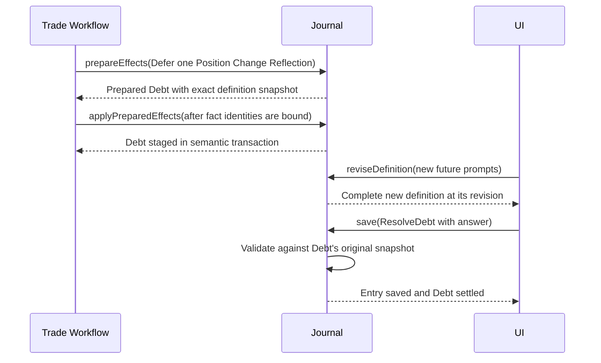
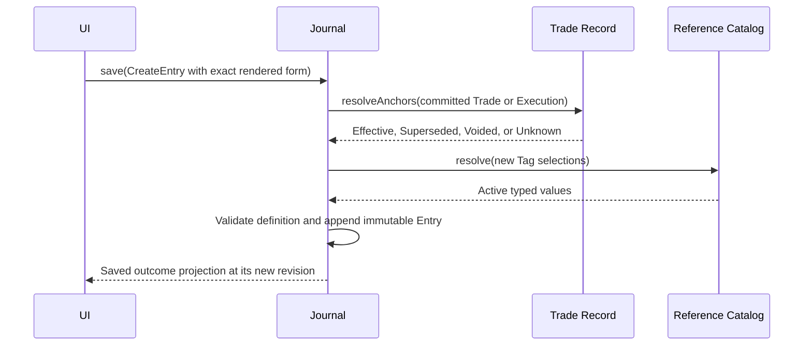
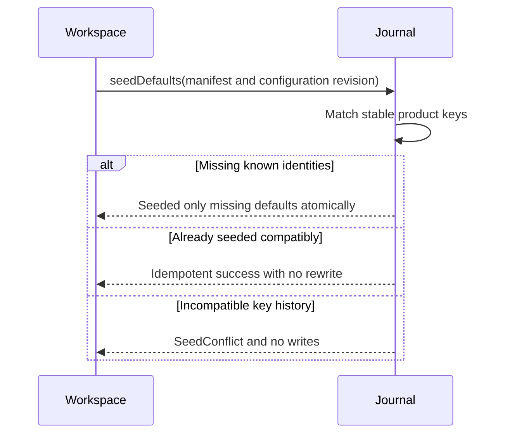
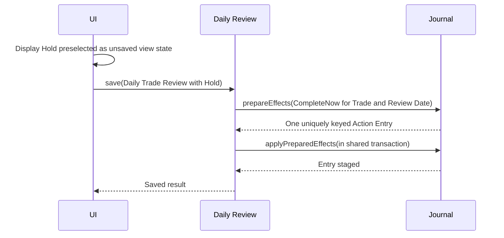

# Journal

## Contract

Journal owns saved reflective evidence and its runtime form definitions. It validates and stores immutable Journal Entry versions, Addenda, visible Voids, exactly one Anchor, automatic Source, optional originating-fact association, fixed Entry Type identities, versioned Prompt/option definitions, explicit declines, Journal Debt, and its backup/Restore section.

It captures only explicit Save. It never records drafts, keystrokes, form opens, navigation, or abandoned edits. It owns no trading facts and cannot settle a Debt whose answer must also create a Trade fact.

```text
interface Journal
  save(command: JournalSaveCommand) -> JournalSaveResult
  prepareEffects(request: JournalEffectRequest) -> PrepareJournalEffectsResult
  applyPreparedEffects(command: ApplyPreparedJournalEffects) -> JournalApplyResult
  query(query: JournalQuery) -> JournalPage
  getDefinitions(request: GetEntryDefinitions) -> EntryDefinitionSet
  reviseDefinition(command: ReviseEntryDefinition) -> ReviseEntryDefinitionResult
  seedDefaults(command: SeedJournalDefaults) -> SeedJournalDefaultsResult
  exportSnapshot(request: JournalExportRequest) -> JournalBackupSection
  prepareRestore(request: PrepareJournalRestore) -> PrepareJournalRestoreResult
  applyPreparedRestore(command: ApplyPreparedJournalRestore) -> JournalRestoreResult
```

## Fixed identities and versioned definitions

The seven fixed Entry Types are:

1. Plan Reflection
2. Position Change Reflection
3. Management Revision
4. Close Review
5. Daily Trade Review
6. Review Note
7. Trader Reflection

The initial Sources are Plan Confirmation, Position Change, Management Revision, Trade Close, Daily Review, Trade Detail, and Journal. Source is the product writing path, not a user answer.

There is no separate Market Event Entry Type; a voluntary market-level observation uses Trader Reflection. Execution, Assignment, Exercise, and Expiration moments use Position Change Reflection rather than new settlement-specific Entry Types.

Entry Type identity does not change when its label or form changes. An `EntryDefinition` is an immutable revision of ordered Prompts, options, requiredness, bounded conditional rules, Tag Select binding, and workflow semantic roles. Stable Prompt/Option identities survive rewording or reordering. Omission retires them prospectively. Historical Entries and Debt retain exact prompt, option, and label snapshots.

### Initial Entry Definitions

The initial definition for each fixed type is exact. “Optional” means `Unanswered` is a valid saved snapshot value; it never means declined.

**Plan Reflection**

1. “Why this trade, why now?” — required Text with workflow-critical Thesis role.
2. “What would invalidate the thesis?” — required Text with workflow-critical Invalidation role.
3. “Conviction” — optional 1–5 Scale.
4. “Primary emotion” — optional Single Select: Calm, Eager, Anxious, FOMO, Revenge, Relieved, Frustrated, Other.

Thesis and Invalidation are entered once during Plan confirmation and supply both frozen Plan facts and the saved Entry snapshot. Their roles may be reworded but cannot be retired or declined while Plan confirmation is installed.

**Position Change Reflection**

1. “Decision mode” — required Single Select: As Planned, Deliberate Adjustment, Reactive, Externally Imposed.
2. “Primary emotion” — required Single Select: Calm, Eager, Anxious, FOMO, Revenge, Relieved, Frustrated, Other.
3. “Decision confidence” — required 1–5 Scale.
4. “Note” — optional Text.

The required reflection outcome may instead be explicitly declined or deferred where the workflow policy permits; requiredness governs a completed form, not whether those alternate outcomes exist.

**Management Revision**

1. “What changed in the market or your thesis?” — required Text with workflow-critical Revision Rationale role.
2. “What is your revised thesis?” — conditionally optional Text with Revised Thesis role.
3. “What would invalidate your revised thesis?” — conditionally optional Text with Revised Invalidation role.
4. “Are you adapting to new information or rationalizing a change?” — optional Single Select: Adapting, Rationalizing, Honestly Unsure.
5. “Conviction now” — optional 1–5 Scale.

Prompts 2 and 3 are `AllOrNone`: both blank retains the original Thesis; answering either requires the other. The trader enters these semantic values once and the workflow freezes them with both the Management Revision fact and Entry snapshot.

**Close Review**

1. “Would you take this Trade again under similar conditions?” — required Single Select: Yes, as planned; Yes, with changes; No; Unsure.
2. “What worked, and what did not?” — optional Text.
3. “What is the key lesson?” — optional Text.

The answers neither create nor replace a Close Reason. The obligation may be completed, deferred as Debt, or explicitly declined without blocking factual closure.

**Daily Trade Review**

1. “Action” — required workflow-critical Single Select: Hold, Exit, Roll, Adjust.
2. “Why are you taking this action?” — Intent Text, optional for Hold and required for Exit, Roll, or Adjust through `RequireWhenOption`.
3. “Conviction now” — optional 1–5 Scale.
4. “Anything you considered doing and decided against?” — optional Text.
5. “Note” — optional Text.

Hold is preselected only in returned unsaved view state. Primary emotion is deliberately not in this initial repeated checkpoint, though runtime configuration may add it later.

**Review Note**

1. “What did you observe?” — required Text.
2. “What follow-up is needed?” — optional Text.

Saving is voluntary and creates no Debt merely because a review occurred. Follow-up is journal content only; it does not create a task, due date, completion state, or Trade fact.

**Trader Reflection**

1. “What's on your mind?” — required Text.
2. “Primary emotion” — optional Single Select: Calm, Eager, Anxious, FOMO, Revenge, Relieved, Frustrated, Other.
3. “Energy” — optional 1–5 Scale, where 1 is very low and 5 is very high.

Saving is voluntary and creates no Debt. Review Note and Trader Reflection may use Standalone, Trade, or Execution Anchors according to the context in which the trader creates them.

Supported Prompt kinds are Text, Single Select, Scale, Number, Date, and a zero-or-one Tag Select bound to exactly one Tag Type. One Entry Type definition may contain at most one IdeaSource-bound Prompt. General conditional logic is limited to `RequireWhenOption` and `AllOrNone`. Workflow-critical roles cannot be removed or repurposed while their capability is installed.

## Entry semantics

```text
JournalAnchor = Standalone | TradeAnchor(TradeId) | ExecutionAnchor(ExecutionId)

JournalOrigin =
  Plan | PositionChange | ManagementRevision | Deviation | DailyReview
  plus the exact originating fact identity

JournalEntryValue =
  exact EntryDefinitionSnapshot and complete response set
  exactly one Anchor
  automatic Source snapshot
  optional origin association
  moment time and first-authored time
  optional parent Entry for an Addendum
  optional settled Debt identity
```

Anchor answers where the writing belongs. Origin answers which fact or checkpoint caused it. They are independent. A Trade narrative includes Entries anchored to that Trade and to all of its current, superseded, or Voided fills, each once.

An Edit appends a version under the same Entry identity and uses its original definition snapshot. An Addendum is a new Entry with the parent's preserved Anchor, the current completed definition, its actual new Source/time, and an explicit parent link. A Void adds a visible reasoned version and never deletes earlier versions, Addenda, Anchor, or origin. Voiding the only Entry that settled Debt atomically reopens that same Debt.

For a directly authored Entry, Edit may correct an erroneous Anchor or moment time. A workflow-created Anchor cannot be reassigned. Entry Type, original definition snapshot, Source, originating-fact association, first-authored time, Debt-settlement identity, and Addendum parentage are immutable. An Addendum does not inherit the parent's workflow origin as if the later thought occurred during that original event. Editing Plan Reflection or Management Revision writing never writes backward into frozen Trade facts.

## Debt and obligation semantics

One `JournalObligationKey` has exactly one current outcome: completed Entry, explicit decline, one Outstanding Debt, or valid retirement. Position Change Reflection and Close Review use different keys. A Daily Trade Review key includes Trade and Review Date.

`Defer` creates Debt with its trigger-time definition snapshot, Anchor, origin, due semantics, and settlement route. It does not create an incomplete Entry. Later definition changes do not alter what is owed. Answering creates an Entry; declining creates a distinct `JournalDecline`. Retirement requires owning-workflow evidence such as a Voided origin, Abandoned Plan, flat exposure, or management completed elsewhere.

If correction leaves a Position Change with no effective real members, its Outstanding reflection Debt retires as Underlying Fact Voided. A completed reflection is never removed: it remains visible and is marked as associated with a Voided origin so ordinary event-based counts exclude it. If any effective member remains, the reflection outcome remains valid.

Daily Trade Review permits `CompleteNow` only. Its absence is derived and creates neither Debt nor an implicit Hold. Debt due at review time blocks Review completion, never factual trade recording.



## Mutation contracts

### `save`

Owns direct Journal-only Create Entry, Edit, Addendum, Void, and Journal-only Debt resolution. It validates exact definition revision, one committed Anchor, automatic Source, rules, stable selections, and expected revision. Voluntary direct creation is limited to Review Note and Trader Reflection; workflow-required Entry outcomes pass through prepared effects.

An accepted `JournalSaveResult` returns the complete effective Entry, decline, or Debt outcome projection at its new revision, including any Debt settlement/reopen transition. The caller can render the saved outcome without a Journal query.



Merely displaying or editing locally invokes nothing and records nothing.

### `prepareEffects` and `applyPreparedEffects`

The nonpersistent path accepts the complete set of workflow obligations and explicit Complete, Defer, Decline, or retirement dispositions. It snapshots definitions, validates semantic roles and Tag selections, and binds candidate Anchors/origins without reserving identities. Apply is allowed only inside a shared semantic transaction, maps candidates using Trade Record's exact durable mapping, rechecks uniqueness/revisions, and stages the complete batch or none. Its accepted result supplies the assigned identities and staged outcome projections so the owning coordinator can return them after commit without a Journal query.

Plan Reflection and Management Revision require completion now. Position Change Reflection and Close Review allow completion, deferral, or decline. Daily Trade Review requires completion. A workflow can revise an existing obligation only by its exact Entry revision; it cannot create duplicates.

### Definition and seed operations

`getDefinitions` returns latest definitions for fixed types or exact retained revisions. `reviseDefinition` atomically replaces the complete future form after expected-revision validation and returns that complete definition at its new revision. An identical normalized definition is unchanged and returns the existing complete definition.

`seedDefaults` is Workspace-only, idempotent, stable-keyed, and atomic. It creates the seven fixed types, initial definitions, and seven initial Sources when absent. It never resets trader revisions, matches mutable labels, rewrites history, or creates new Entry Types.



### Query

`query` supports Entries, Debt, and declines; exact identities; obligation keys; Anchors; Trade narrative scope; Entry Type, Source, origin, status, due-through, moment interval, and stable Prompt/Option/Tag filters; and Timeline, Analysis, or Full History projections. Filters use AND across dimensions and OR within a dimension. It is not a generic Boolean/full-text/reporting language.

Normal Timeline shows the effective version, a discreet Edited/Void indicator, and View history. Analysis returns stable semantic responses and outcome coverage without behavioral judgment.

### Backup and Restore

The Journal section contains fixed identities, Source history, every definition revision, every Entry/Edit/Addendum/Void, Debt/decline/settlement/reopen/retirement history, and all Anchor/origin/Prompt/Tag identities. It excludes unsaved form state and private indexes.

Preparation validates definition continuity, snapshots, Entry and Debt version chains, exactly one Anchor, Addendum acyclicity, obligation uniqueness, legal Debt transitions, and settlement links. Workspace batch-validates external Trade/Execution/Tag references. Apply preserves all stable identities and history in the atomic full replacement; there is no per-Entry import or merge.

## One-click Hold



Hold needs no Intent. Exit, Roll, Adjust, and any future change-intent Action require Intent. Selection alone is not evidence.

See [ADR 0005](../adr/0005-journal-entry-and-journal-debt-are-separate.md) and [Daily Review](daily-review.md).
