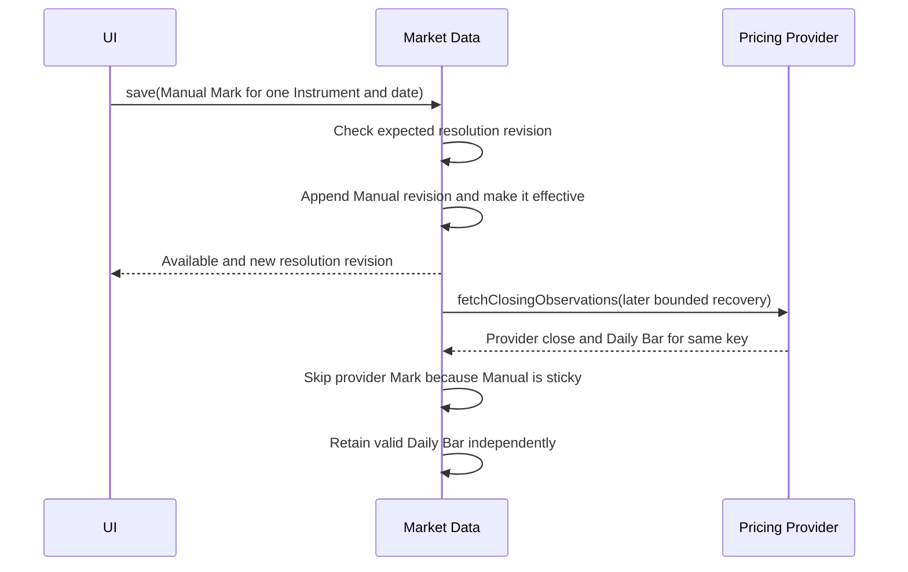
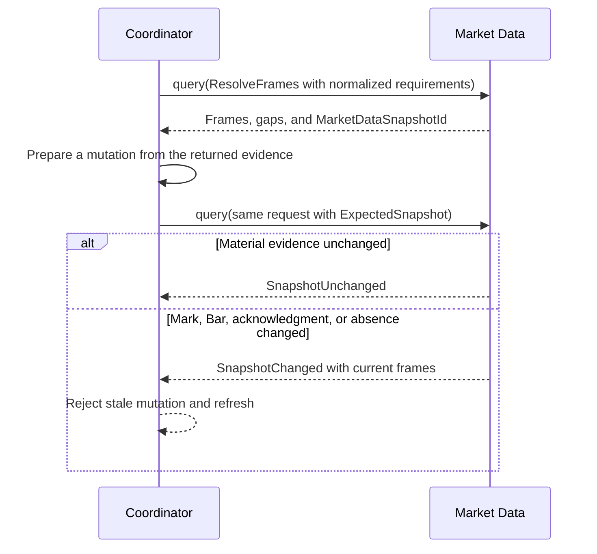
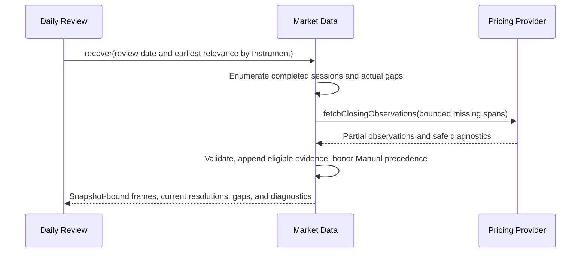

# Market Data

## Contract

Market Data owns observed closing evidence by exact Instrument and completed U.S. trading date: Marks, optional Daily Bars, explicit unavailable acknowledgments, source/revision history, Manual precedence, Expected Mark Date/Status, automatic provider recovery, and provider configuration. It knows no Trades, Positions, Stops, Targets, P&L, or report metrics.

```text
interface MarketData
  save(command: MarketDataSaveCommand) -> MarketDataSaveResult
  query(query: MarketDataQuery) -> MarketDataQueryResult
  recover(request: RecoverMarketData) -> MarketDataRecoveryResult
  getProviderConfiguration() -> ProviderConfigurationView
  configureProvider(command: ConfigureProvider) -> ConfigureProviderResult
  exportSnapshot(request: MarketDataExportRequest) -> MarketDataBackupSection
  prepareRestore(request: PrepareMarketDataRestore) -> PrepareMarketDataRestoreResult
  applyPreparedRestore(command: ApplyPreparedMarketDataRestore) -> MarketDataRestoreResult

interface PricingProvider
  fetchClosingObservations(request: ProviderFetchRequest) -> ProviderFetchResult
```

The Pricing Provider is an external request/response port. Streaming, webhooks, raw provider payloads, durable retrieval attempts, and provider-quality analytics are outside the contract.

## Observation model

```text
ObservationKey = exact InstrumentKey plus TradingDate
ObservationSource = Manual | Provider(ProviderId)

MarkResolution =
  Available(exact-date Mark and revision)
  or Missing(optional StaleMarkContext)
  or AcknowledgedUnavailable(acknowledgment and optional StaleMarkContext)

DailyBarResolution = Available(exact-date OHLC and revision) | Missing

Expected-Mark Status = Available | Missing | AcknowledgedUnavailable
```

A key may independently have Mark history, Daily Bar history, and acknowledgment history. They are not generic interchangeable observations. Mark supplies valuation. Daily Bar supplies range evidence. Acknowledgment explains why exact evidence cannot be supplied.

Resolution precedence is exhaustive:

1. An exact-date Mark is Available, even if an acknowledgment remains in history.
2. Without a Mark, an asserted acknowledgment is Acknowledged Unavailable.
3. Otherwise the Mark is Missing.
4. In the last two cases, the closest earlier Mark may appear only as Stale context.

Stale means older than the Expected Mark Date. It is disclosed context and never enters a calculation. Fill cost, a Bar close from another date, provider failure, zero, or a carried Mark never fills an exact-date slot.

During an active session, the latest completed regular session is the Expected Mark Date. Thus at noon Tuesday after a normal Monday session, Monday evidence is normal Available evidence, not Stale.

## Manual writes and precedence

`save` accepts exactly these intentions:

- record an initial Manual Mark;
- record a deliberate Manual valuation override;
- correct a believed-wrong Mark with a reason;
- assert unavailable for a key that has no exact Mark;
- visibly withdraw a mistaken acknowledgment.

Every write uses the current resolution revision and appends immutable history. A Manual Mark becomes effective. Once effective evidence is Manual, later provider closes neither replace it nor become hidden Mark revisions, although independently useful Daily Bars may still refresh. An acknowledgment cannot be saved when an exact Mark already exists. A later exact Mark supersedes acknowledgment only for effective status; acknowledgment history remains visible.

A deliberate valuation override and a correction of believed-wrong recorded evidence are distinct saved intentions. Only the correction automatically contributes Mark correction metadata/Correction Footprint; choosing a Manual valuation over a provider observation is not automatically treated as an error in history.

An accepted `MarketDataSaveResult` returns the complete effective resolution for every directly changed key, its new revision and saved-intention/audit classification, and the exact accepted command binding. The caller does not query the saved key merely to discover the observation it just recorded.

Observation time states when evidence was observed; save time and revision identity record durable provenance. Provider response/array/arrival order never overrides explicit precedence. An identical provider price creates no redundant Mark revision; a changed provider-sourced price appends a refresh revision with correction relevance.



## Query contract

`query` is a closed family:

- `ResolveFrames` returns point or completed-session-range frames for current, Daily Review, historical, or hypothetical Candidate Manual Mark evidence;
- `InspectObservations` returns immutable Mark/Bar/acknowledgment audit histories;
- `ReadSeries` returns completed-session series with explicit gaps.

A frame is bound to the normalized request, session-policy revision, selected evidence revisions, stale-context revisions, and material absences through an opaque `MarketDataSnapshotId` plus an evidence digest. `ExpectedSnapshot` provides the transaction-time check used by Daily Review. Changed evidence returns current frames; it never blesses stale reconciliation.

Ranges enumerate completed regular sessions and emit explicit gaps. They never interpolate, carry forward, connect across absence, or fabricate a candle from a close-only Mark. Candidate Manual Mark frames are visibly hypothetical and never count as committed evidence.



## Automatic recovery

`recover` receives a review date/as-of instant and per-Instrument earliest relevance bounds, not a trader-chosen range. Market Data enumerates completed sessions, finds actual gaps, compresses them into bounded provider requests, preserves Manual keys, and re-resolves effective status after a partial response. Its result contains the normalized snapshot-bound frames and `MarketDataSnapshotId`, current resolutions, gaps, and diagnostics whether or not evidence was added; the caller does not issue a second query to learn the recovery outcome.

Current-date Missing keys become Manual-resolution tasks. Historical gaps remain visible and nonblocking. Acknowledged keys remain eligible for later factual recovery. Unsupported Instruments, failures, and partial responses are transient diagnostics only; they create no Mark, acknowledgment, provider-performance fact, or Journal evidence.

On an otherwise empty key, a valid provider Daily Bar's close is also the closing observation that seeds the initial provider Mark. On an existing provider-sourced key, the close follows the normal provider-refresh rule. A Bar never overwrites an effective Manual Mark merely by being present.



Provider integration is optional. With none installed/configured, recovery returns Missing tasks and safe `NotConfigured` context; it does not report the domain as unavailable merely because a capability was never delivered.

## Daily Bar use

Trade Analysis—not Market Data—applies these evidence rules:

- long single-Instrument trailing conditions use same-date Bar high, otherwise exact Mark;
- short single-Instrument conditions use same-date Bar low, otherwise exact Mark;
- multi-Instrument structures use synchronized same-date exact Marks, never independently timed intraday extrema;
- missing evidence proves neither breach, recovery, nor new extreme.

Daily Bars never alter Mark-to-Market valuation and never become theoretical/future option values.

## Provider configuration

The initial model has zero or one enabled provider. Configuration is revisioned. `configureProvider` returns the complete resulting Disabled, Enabled with redacted credential status, or Needs Setup view at its new configuration revision; `getProviderConfiguration` reads that view later when independently needed. Credential input is protected and write-only. It is never returned, exported, copied into diagnostics, or preserved in raw responses. Historical provider provenance survives provider disablement/replacement.

## Backup and Restore

The Market Data backup section includes all Mark, Bar, and acknowledgment revision chains, effective heads, nonsecret provider settings, and session-policy compatibility metadata. It excludes credentials, raw payloads, diagnostics, request logs, and rebuildable coverage indexes.

Preparation validates identities, chains, finite prices, OHLC ordering, dates, source/classification, effective heads, and Manual precedence without provider calls. Apply is only a participant in Workspace's atomic replacement and rebuilds private coverage indexes. Restored configuration whose adapter/credential is unavailable becomes Needs Setup without relabeling historical evidence.

See [Daily Review](daily-review.md), [Trade Views and Reporting](trade-views-and-reporting.md), and [ADR 0007](../adr/0007-observed-valuation-and-expiration-payoff.md).
