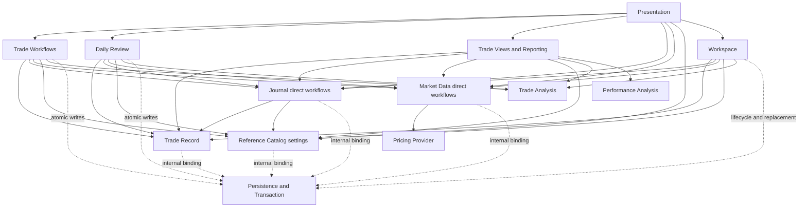
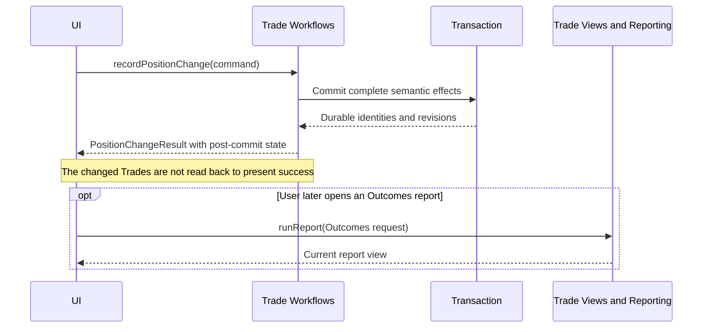

# Trade Journal V3 design overview

## Purpose

Trade Journal V3 is an after-close, local-first journal for one trader recording U.S.-listed securities and options in USD. The design concentrates domain complexity behind ten deep public interfaces, one external domain-data port for pricing, browser-host delivery capabilities, and one internal persistence/transaction seam. The UI receives finished read models and submits complete user-intent commands.

The design is implementation-stack-neutral except for its standards-based PWA delivery boundary. Interface means the complete caller contract: operations, values, invariants, ordering, result states, failure behavior, and performance expectations. It does not imply a class, network endpoint, package, process, or deployment tier.

## Load-bearing rules

1. **Fact modules own durable authority.** Trade Record, Journal, Market Data, and Reference Catalog preserve facts, stable identities, and visible history.
2. **Pure modules derive.** Trade Analysis interprets one Trade. Performance Analysis folds explicit per-Trade and Journal evidence across a population. Neither reads storage, chooses time, fetches data, or mutates facts.
3. **Coordinators join complete use cases.** Trade Workflows owns Trade mutations, Daily Review owns the ritual, Trade Views and Reporting owns cross-module reads, and Workspace owns lifecycle/backup/Restore.
4. **The UI never becomes a domain coordinator.** It does not write several stores in sequence, reproduce formulas, infer lifecycle, or join authoritative records into competing results.
5. **Every mutation is semantically atomic.** All required facts, audit versions, lifecycle/index changes, Lot Matches, Deviations, Journal outcomes, allocations, and lineage persist together or none persist.
6. **Request/response is sufficient.** There are no subscriptions, live queries, or domain-event contracts. A successful mutation returns a revision-bound, command-specific post-commit result for every directly changed subject and related effect; the initiating caller does not read that state back merely to present success.
7. **Corrections preserve one economic history and a visible audit trail.** Effective corrected facts apply at their original Economic Time. Prior saved versions remain inspectable and generate a Correction Footprint.
8. **Private acceleration is subordinate to facts.** Indexes, caches, and projections may exist for performance. Except for authoritative stored Lifecycle State, they are rebuildable and cannot change canonical results.
9. **Capability declarations are honest.** A release advertises only complete installed operation variants and report families. Uninstalled capability is absent, not a fabricated domain `Unavailable` result.
10. **UI and delivery behavior are separate contracts.** Domain interfaces do not prescribe components, routes, framework, persistence engine, PWA cache tooling, or hosting provider.
11. **Runtime Readiness gates every write.** Browser-neutral functional checks must establish a working authoritative-store transaction, capacity headroom, service-worker control, and a complete Offline Release Inventory before any authoritative mutation. The persistence/transaction seam rejects writes whenever the current session is not `Writable`. Host storage protection is reported and warned about but does not gate writes.

These rules implement [ADR 0001](../adr/0001-domain-facts-pure-analysis-and-coordinators.md), [ADR 0002](../adr/0002-semantic-command-atomicity.md), and the canonical [glossary](../glossary.md).

## Approved modules

| Interface | Kind | Operations | Responsibility hidden behind the interface |
|---|---|---:|---|
| [Trade Analysis](trade-analysis.md) | Pure analysis | 6 | Plan assessment, effective-fact replay, Positions, FIFO Lot Matches, fees/P&L, lifecycle agreement, Entry Quality, risk/reward, payoff, replay, deterministic Deviations, and correction impact for one Trade. |
| [Trade Workflows](trade-workflows.md) | Mutating coordinator | 6 | Complete Plan, Abandonment, Position Change, Management Revision, and correction workflows with atomic Trade and Journal effects. |
| [Trade Record](trade-record.md) | Authoritative fact module | 9 | Trade facts and history, stored/indexed Lifecycle State, active Lot-Match links, recorded Deviation occurrences, candidate changes, queries, Anchors, and owned backup section. |
| [Journal](journal.md) | Authoritative fact/configuration module | 10 | Immutable Entries and versions, Addenda, Voids, Anchors, Sources, originating facts, fixed Entry Types, runtime definitions, Debt/declines, seeding, and owned backup section. |
| [Market Data](market-data.md) | Authoritative observation module | 8 | Marks, Daily Bars, Manual precedence, acknowledgments, Expected Mark Date/Status, gaps, provider recovery/configuration, and owned backup section. |
| [Daily Review](daily-review.md) | Ritual coordinator | 4 | Exact-date open/resume, Mark recovery, due Debt, settlement routing, attention-ranked Trade walk, Action Save, reconciliation, and derived completion. |
| [Performance Analysis](performance-analysis.md) | Pure cross-Trade analysis | 4 | Outcomes, Current Exposure, Process Scorecard, and one categorical Journal Field report with fixed populations, dates, grouping, coverage, and sensitivity. |
| [Reference Catalog](reference-catalog.md) | Authoritative reference module | 7 | Institutions, Accounts, Strategies, Tag Types/Values, Close Reasons, Abandonment Reasons, stable identity/history, typed resolution, seeding, and owned backup section. |
| [Trade Views and Reporting](trade-views-and-reporting.md) | Read coordinator | 5 | Trade browsing, complete Trade Detail, corrected replay, all deterministic report families, and shared Mark-change impact. |
| [Workspace](workspace.md) | Lifecycle coordinator | 8 | Runtime Readiness, initialization, settings, durability, installed capabilities, full backup and backup verification, migration, validated atomic replace-only Restore, and integrity recovery. |
| Pricing Provider | External port | 1 | Fetch bounded closing observations and optional Daily Bars for Market Data without leaking provider-specific concepts. |
| Persistence/Transaction | Internal seam | Not UI-callable | Runtime write gating, durable fact binding, consistent read snapshots, optimistic revisions, transactions, migrations, lifecycle/search indexes, and rebuildable projections. |

Future Insights is outside the MVP and has no interface or dependency in this partition.

Browser-host capabilities for PWA installation, service-worker control, storage protection/capacity, backup file download, and reading a trader-selected backup file are delivery/platform seams governed by the Delivery and Workspace contracts. They are not public domain interfaces, data-provider integrations, or authority over journal facts. Workspace aggregates their readiness, protection, download, and file-read outcomes without exposing raw host APIs to the other domain modules.

## Dependency shape



Arrows indicate permitted calls or dependency on returned values. They do not prescribe process boundaries.

## Who may call whom

Legend: **R** = read/query, **M** = semantic mutation or prepared effect, **A** = pure analysis call, **L** = lifecycle/backup/Restore, **V** = narrow validation.

| Caller | Trade Record | Journal | Market Data | Reference Catalog | Trade Analysis | Performance Analysis | Pricing Provider | Persistence/Transaction |
|---|---|---|---|---|---|---|---|---|
| Presentation | — | R/M direct Journal-only | R/M direct observation/config | R/M reference settings | — | — | — | — |
| Trade Workflows | R/M | R/M | R for correction evidence | R/V | A | — | — | M |
| Daily Review | R/narrow M | R/M | R/M recovery | R | A | — | — | M |
| Trade Views and Reporting | R | R | R | R | A | A | — | read snapshot |
| Journal | V Anchor only | — | — | V Tag selection | — | — | — | internal binding |
| Market Data | — | — | — | — | — | — | fetch | internal binding |
| Workspace | L | L | L | L | A for verification | — | — | L/M |
| Trade Analysis | — | — | — | — | — | — | — | — |
| Performance Analysis | — | — | — | — | consumes supplied results only | — | — | — |

Additional prohibitions:

- Fact modules never call a coordinator.
- Trade Analysis never calls Performance Analysis, storage, another module, a clock, or a calendar.
- Performance Analysis never obtains raw Executions to repeat Trade Analysis arithmetic.
- Reference Catalog never calls Journal or Trade Record.
- Market Data never discovers affected Trades or interprets Stops, Targets, Positions, or P&L.
- Workspace Restore may coordinate all fact modules but cannot bypass their validation or use live per-record operations as an import mechanism.

## Internal Persistence/Transaction obligations

Persistence/Transaction is an implementation-internal seam, never a presentation or plugin API. Whatever mechanism is chosen later must provide these observable guarantees:

- one atomic commit/rollback boundary spanning every fact-module effect required by a semantic command;
- optimistic bindings that distinguish query snapshots, record revisions, fact versions, definition/catalog/observation revisions, and full Workspace content revisions;
- snapshot-consistent multi-module reads or equivalent bounded recheck/retry behavior that never returns a torn view;
- one coherent full-Workspace export snapshot and one atomic all-section replacement;
- isolated migration/Restore candidates or equivalent rollback that leaves prior data usable on failure;
- durable success across restart and recovery of interrupted, not-yet-committed work;
- authoritative current Lifecycle State membership updated with its facts, plus rebuildable secondary indexes/projections for bounded list, anchor, observation, Journal, and reference queries.

Prepared domain values do not expose a database handle, reserve identities, or become stored workflow sessions. Transaction propagation and physical composition remain implementation choices.

## Authority map

| Concern | Authoritative facts | Derived or verified result |
|---|---|---|
| Trade lifecycle | Stored Lifecycle State plus effective Trade facts | Expected Lifecycle State and agreement from Trade Analysis |
| Position and basis | Effective Executions and settlement facts | Instrument Positions, Open Lots, FIFO Lot Matches, fees, P&L |
| Lot matching | Effective facts plus recorded active Lot-Match links | Expected FIFO links and agreement |
| Deviation | Recorded occurrence/evidence plus effective facts and observations | Expected deterministic occurrences and agreement |
| Terminal explanation | Effective disposing facts | Terminal Disposition |
| Plan risk | Frozen confirmed Plan facts | Plan Baseline and 1R |
| Current risk/reward | Remaining Position, effective management, exact Marks | Ongoing risk/reward and overruns |
| Journal history | Saved Entry/Debt/decline versions and definition snapshots | Effective timeline and analytical projections |
| Market evidence | Mark, Daily Bar, and acknowledgment histories | Expected-Mark Status, Stale context, frame coverage |
| Reports | Trade, Journal, reference, and observation evidence | Ephemeral deterministic report |

## Shared value and result conventions

### Identity and history

Stable identity is distinct from a mutable label and from an immutable revision identity. Replace preserves the identity of the same real-world fact. Void preserves an addressable historical identity. A reconstructed event receives a new fact identity while Rebuild preserves the economic Trade identity.

Every time-ordered fact supplies Economic Time and a stable same-time Recorded Sequence. Save time records provenance and never replaces Economic Time as the order for FIFO, lifecycle, P&L, or replay.

### Calculation availability

Each independently meaningful calculation returns exactly one of:

```text
Value(value)
Unbounded(direction and explanation)
Unavailable(stable reason and structured details)
NotApplicable(stable reason and structured details)
```

One unavailable figure never suppresses valid figures. Partial sums are explicitly called covered subtotals. No module substitutes fill cost, zero, a stale observation, or silent omission.

### Expected domain failures

Expected invalid input, missing required choices, unknown/inactive references, stale revisions, changed evidence, incoherent candidate facts, unsupported Restore versions, and integrity disagreement are typed no-write results. Infrastructure failure rolls back all participants but is not classified as trader behavior.

Every authoritative mutating operation's result union includes exactly one cross-cutting `RuntimeNotWritable` branch carrying current Runtime Readiness, every failed check, any readable or integrity-blocked Workspace status, and safe actions. Operation-specific labels such as Rejected, `Recovery Only`, or `Unsupported` do not replace that branch. The persistence/transaction seam returns it before beginning a write whenever the session is not `Writable`. It is an operational safety result, not trader validation or Journal evidence. `Workspace.requestDurability` is exempt because it requests host protection without mutating authoritative Workspace data.

```text
RuntimeNotWritable {
  runtimeReadiness: RecoveryOnly | Unsupported
  failedChecks: one-or-more RuntimeReadinessFailure
  workspaceStatus: RecoveryOnly | IntegrityBlocked | None
  safeActions: ordered safe actions and explanations
}
```

### Snapshot binding

Cross-module reads carry the fact, observation, Journal, and reference revisions represented. A coordinator retries bounded work or returns an explicit changed-during-assembly result when it cannot produce one coherent response. A query snapshot is not interchangeable with a mutation revision.

### Mutation results

Every accepted domain-changing operation returns one command-specific mutation result bound to the exact committed revisions. It includes generated identities, the canonical post-commit representation of each directly created or changed subject, related outcomes produced by the command, and any derivation the command had to establish for its own acceptance. The result is returned only after all required effects are durable and is sufficient to render the successful command and continue within its owning workflow without reading back the directly changed state.

The result need not embed every list, report, or other projection indirectly affected by the mutation. It may identify those affected identities or scopes as advisory information. A caller may perform a normal read when the user later navigates to a different view, explicitly refreshes, or recovers from a conflict; no follow-up read is an unconditional consequence of a successful write.



## Main workflow walkthroughs

### Confirm a Plan

1. Trade Workflows resolves active Account, Strategy, and typed references.
2. Journal validates the exact Plan Reflection form and returns Thesis/Invalidation by stable semantic role.
3. Trade Analysis assesses the proposed Plan and requires one numeric Plan Baseline and positive 1R.
4. Trade Record prepares the candidate Trade and confirms expected `Planned` state.
5. One transaction writes the frozen Plan, stored lifecycle/index state, and completed Plan Reflection or writes nothing.

### Record a Position Change

1. The command groups all members of one decision or settlement occurrence and explicitly supplies Planned Leg intent and any allocation.
2. Trade Record constructs every affected candidate Trade without writing.
3. Trade Analysis derives Positions, Lot Matches, Deviations, Lifecycle State, terminal reason requirements, and management coverage.
4. Journal prepares one Position Change Reflection outcome and any Close Review or Management Debt effects.
5. One transaction commits the complete factual and Journal result. An Action or reflection never creates additional trading facts.

### Open and save Daily Review

1. Daily Review resolves one completed session and queries Trades that were Open at its cutoff under corrected facts.
2. It derives observation requirements, invokes automatic Market Data recovery, evaluates/replays Trades, loads due Debt and existing Action outcomes, and returns one stable attention order.
3. The page preselects Hold in unsaved view state. Opening or selecting records nothing.
4. Save verifies the exact facts and Market Data snapshot, reconciles deterministic Stop-Discipline occurrences when needed, and writes the one dated Action atomically.
5. Completion is rederived as Complete, Complete with Unavailable Marks, or Incomplete.

### Run a deterministic report

1. Trade Views and Reporting resolves a named Report Period where applicable and expands stable reference filters.
2. It exhausts the full snapshot-bound candidate population and asks Trade Analysis for one coherent datum per Trade plus requested current or historical evidence.
3. Performance Analysis applies the fixed metric population, date, grouping, denominator, coverage, and correction rules.
4. Reference identities are labeled for presentation and every result retains contributor navigation. No Report is stored.

### Restore a Workspace

1. Workspace verifies the backup envelope, section digests, version support, and required data capability footprint without mutating live data.
2. Each fact module prepares and validates its section. Trade Analysis verifies lifecycle, Lot Matches, and Deviations; Workspace closes cross-section reference and evidence checks.
3. The UI presents exact replacement impact, migrations, repairs, warnings, and a safety-backup choice.
4. Apply rechecks the artifact and current target bindings and replaces every authoritative section in one transaction.
5. On success, the result returns fresh Workspace status and landing state while invalidating every pre-Restore view. Other surfaces perform their normal reads only when next opened. Any failure leaves the prior Workspace unchanged.

## Incremental delivery contract

The interfaces describe the full target shape. The implementation plan must organize delivery as ordered, independently usable vertical slices. Each ordinary release may deliver a dependency-closed subset of operations or complete report families when its immutable Installed Capability Manifest says exactly what is supported, but every declared capability must be reachable through the production UI and operate through its required application/domain behavior and persistence/infrastructure. Layer-specific tasks belong inside the vertical slice that first uses them; a specifically approved layer-only planning checkpoint advertises no completed capability and is not an installed release boundary.

A delivered operation must honor all of its result, validation, audit, error, durability, and dependency rules. Later delivery adds capability without reshaping authoritative facts or redefining earlier semantics.

Standards-based PWA identity, the complete Offline Release Inventory, Runtime Readiness, and the persistence-level write gate are foundational. They must be included inside the first vertical deliverable that can mutate authoritative data and cannot be deferred as a later hardening or layer-only release.

The evaluation plan must explain how facts needed by later analytics are captured before the behavior occurs. If earlier releases did not capture required evidence, later reports disclose historical coverage loss rather than inventing a backfill.

## Performance design constraint

At the mature evaluation scale—25,000 Trades, up to 200 Open Trades, about 200,000 position-changing facts, and representative Marks and Journal history—the design must support:

- p95 cold startup at or below 2,500 ms to an interactive initial screen, with no network dependency;
- p95 warm open-list navigation at or below 1,500 ms to a complete interactive result, with no network dependency.

Open selection uses stored authoritative Lifecycle State and a bounded `AnalysisInput` batch. It must not replay all historical Trades or issue one storage query per Trade. An evaluated implementation may choose indexes and projections, but its plan must define invalidation, rebuilding, migration, correction, Restore, and benchmark evidence.
