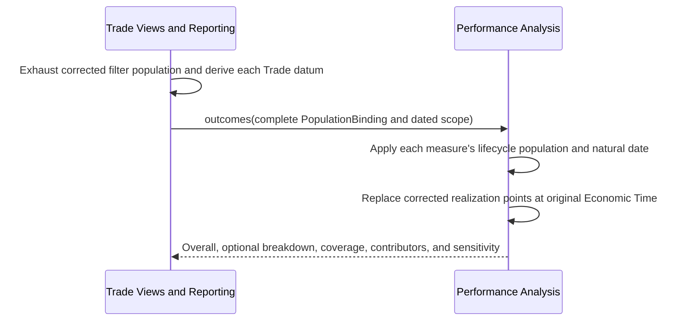
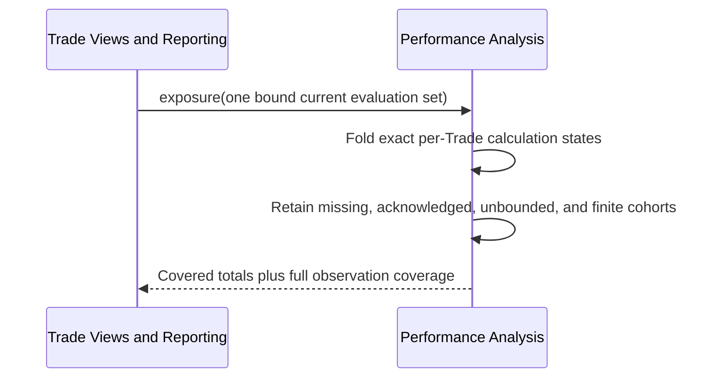
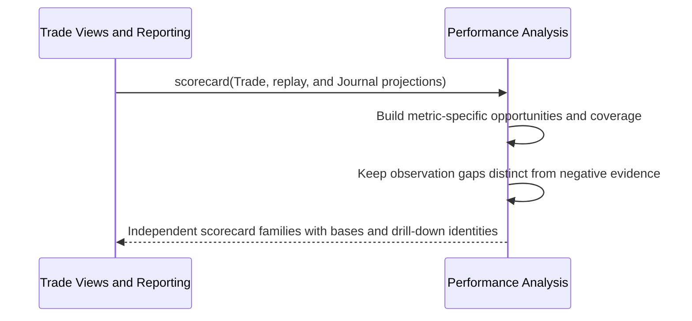
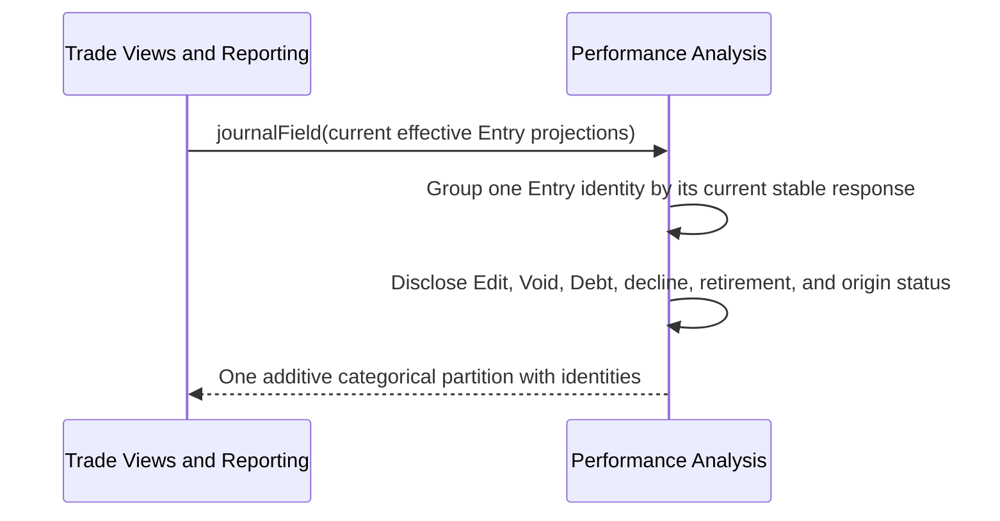

# Performance Analysis

## Contract

Performance Analysis is a pure, deterministic cross-Trade fold over explicitly supplied Trade Analysis and Journal projections. It owns four report families, their populations, natural dates, filters, denominators, grouping, coverage, and correction sensitivity. It reads no storage, selects no Marks, resolves no labels, mutates nothing, and never redoes per-Trade FIFO/P&L arithmetic from raw Executions.

```text
interface PerformanceAnalysis
  outcomes(input: OutcomeAnalysisInput) -> AnalysisResult<OutcomeReport>
  exposure(input: ExposureAnalysisInput) -> AnalysisResult<ExposureReport>
  scorecard(input: ScorecardAnalysisInput) -> AnalysisResult<ProcessScorecard>
  journalField(input: JournalFieldAnalysisInput) -> AnalysisResult<JournalFieldReport>
```

There is no generic formula catalogue, arbitrary metric, or self-loaded population.

## Scope and population rules

Supported filters are Lifecycle State, Account, Institution, Strategy, Underlying, Trade Tag, Plan IdeaSource, Option Disposition Timing, and Entry/Exit Scaling. Nonempty dimensions combine with AND; selected values within one dimension combine with OR. Stable identities, not labels, determine membership.

At most one Break Down By dimension is allowed:

- Strategy
- Underlying
- Tag
- Account
- Institution
- Idea Source
- Option Disposition Timing
- Entry/Exit Scaling

Overall remains visible. Tag and any multi-Underlying grouping are explicitly non-additive multi-membership. Applicable absent optional values form a report-only `Unspecified` group. Special classifications disclose inapplicable/unevaluable Trades rather than mislabeling them Unspecified. Nested/arbitrary grouping is absent.

Account, Institution, Strategy, and frozen Plan IdeaSource are exclusive dimensions. Option Disposition Timing applies only to Closed option Trades. Entry/Exit Scaling applies only to Closed Trades with sufficient decision grouping. Inapplicable or insufficient-evidence records appear in breakdown coverage while the ungrouped Overall retains its own full metric population.

The presentation Report Period presets resolve to All Time or inclusive dates before this pure call. The supported presets are All Time, Year to Date, Quarter to Date, Month to Date, This Week, and Last Week. Each metric applies the resolved period to its fixed natural date. Current Exposure has no Report Period.

Every input supplies a complete `PopulationBinding`: normalized filters, fact/Journal snapshot identities, matched count, and proof that all pages were exhausted. Current evaluation input additionally supplies one `EvaluationSetBinding` for a common valuation date, Expected Mark Date, Trade revisions, and Market evidence. Mixed snapshots or incomplete pages are invalid input.

## Common result contract

Each report is `InvalidInput`, `NotApplicable`, or `Available`. Available includes Overall, optional one-dimensional breakdown, population disclosure, exact contributor/exclusion identities, and observation coverage where relevant.

Every metric independently returns Value, Unbounded, Unavailable, or Not Applicable with its named population, contributing identities, exclusions, and numerator/denominator where relevant. Empty valid populations are Not Applicable, not fabricated zero.

Corrected effective history is the baseline. Outcomes, Exposure, and Scorecard disclose relevant Correction Footprints and may compare a correction-free sensitivity that excludes each affected Trade as a whole for that particular measure. Journal Field instead exposes effective Edit/Void history; it has neither a second breakdown nor correction-free sensitivity.

## `outcomes`

Headline measures include Closed Trade count, net realized P&L, incurred fees, Win/Breakeven/Loss counts, Win Rate, P&L distribution/mean/median, realized-R distribution/mean/median, Profit Factor, cumulative realized-dollar curve, and cumulative Closed-Trade-R curve.

Closed-Trade headlines use terminal close date. Open Trades never become zero-return observations. The cumulative dollar curve uses each effective Lot-Match realization increment's Economic Time and may include partial realization from a still-Open Trade. The Closed-Trade-R curve uses one point per planned Closed Trade with evaluable positive 1R.

Win/Breakeven/Loss uses exact unrounded net P&L. Profit Factor is gross positive divided by absolute gross negative. Losses with no gains produce zero; no losing Trades produces Unavailable, never infinity. Bounded curves begin at zero and do not silently prepend earlier balances.

Median is the middle exact sorted observation for odd counts and the arithmetic mean of the two middle observations for even counts. Realization curve ties order by Economic Time, Trade identity, within-Trade Fact Order, then Lot Match identity; Closed-R ties use terminal Economic Time then Trade identity. Input, label, storage, or correction-save order never changes a curve.



## `exposure`

Current Exposure includes Open Trade count; realized-to-date, remaining-open marked, and combined current P&L; aggregate Plan Risk; Monetary Ongoing Risk; Worst-Case Ongoing Risk; Incremental Reward; Stop/Target affected counts; Stop/Target Overrun; related Plan-R distributions; and an optional like-covered reward-to-risk ratio.

Only Trades whose stored and expected lifecycle agree on Open enter by default. A requested Lifecycle filter that excludes Open makes this current concept Not Applicable rather than a misleading zero portfolio. P&L components remain independent: realized-to-date may be complete while open marked exposure is unavailable. Aggregates retain finite covered subtotals and exact unavailable/unbounded contributors. A single Unbounded worst-case risk makes that aggregate Unbounded without hiding finite coverage.

Never average per-Trade ratios. The optional portfolio ratio exists only when finite reward and risk have the same exact contributing Trade set and positive risk. Each Trade contributes at most once to a breached/reached count and contributes its maximum simultaneous active-condition Overrun, preventing OR conditions from double counting one exposure.



Provider identity may appear as provenance but is never a grouping or ranking dimension.

## `scorecard`

The Process Scorecard is descriptive and has no composite grade. Its sections are:

- Plan outcomes: confirmed count and Entered, Still Planned, Abandoned partition;
- Entry Quality: Applicable, Below Plan, Met or Exceeded, Pending, Unavailable, and Not Applicable, plus rate and coverage;
- conformance: affected Trades and occurrences for the four fixed Deviation categories;
- management activity: eligible opportunities and Management Revision distribution including zeros;
- Stop and Target behavior: evaluable opportunities, episodes, and maximum observed Overrun per episode;
- reflection outcomes: Completed, Explicitly Declined, Due, Retired because underlying fact was Voided, and completed Entries whose origin is now Voided;
- Option Disposition Timing: fully before expiration, fully at expiration settlement, Mixed, quantities, mechanisms, and coverage;
- correction-process disclosure and optional family-specific sensitivity.

Natural dates are fixed: Plan confirmation for Plan outcomes, Entry Resolution Point for Entry Quality, each Deviation/Revision Economic Date for events, condition-observation dates for episodes, Journal moment/origin Economic Date for reflection, and terminal close date for disposition timing.

Plan outcomes cohort confirmed Plans by confirmation date but classify each as Entered, Still Planned, or Abandoned using current corrected state at the explicit analysis cutoff. Rerunning an old period may therefore show the cohort's later maturation; the report states the cutoff rather than pretending to recreate past knowledge.

Entered, Still Planned, and Abandoned partition the confirmed-Plan cohort and their fractions share that denominator. A Trade without a confirmed Plan is Not Applicable rather than Abandoned.

```text
Below-Plan Entry Rate = Below Plan / Evaluable Resolved Comparisons
Comparison Coverage = Evaluable Resolved Comparisons / Applicable Trades
```

Pending and Unavailable reduce coverage but do not enter the rate. Management/deviation opportunity populations include zero-event entered Trades whose exposure lifetime overlaps the period. A missing observation gap cannot prove compliant Stop/Target behavior. One continuous breach/reach is one episode and contributes at most one maximum Overrun observation for the period.

Corrections, Targets reached, and Management Revisions remain descriptive. No weighted adherence percentage or automated good/bad judgment is permitted.

Reflection outcomes cover only obligated Plan Reflection, Position Change Reflection, Management Revision, Close Review, and Daily Trade Review moments. They use the moment/origin Economic Date and current outcome at the analysis cutoff, so a late answer remains attributed to what it reflects. Voluntary Review Note and Trader Reflection Entries have no absent-entry denominator and do not enter completed/declined/due/retired rates. A completed Entry whose origin is later Voided is disclosed but excluded from normal real-event counts.



## `journalField`

Selects one exact Entry Type and stable categorical Prompt: Single Select, Scale, or Tag Select bound to its exact Tag Type. It reports applicable moments; Answered, optional Unspecified, Due, Declined, Retired, Voided Entry, and completed-on-Voided-origin counts; edited Entry disclosure; and mutually exclusive value groups with Entry and distinct related-Trade identities.

The Report Period uses the Journal moment/origin Economic Date, not edit time. One current effective Entry identity contributes once; prior versions remain audit evidence. Text, Number, and Date are Not Applicable rather than auto-bucketed. Due, declined, retired, and Voided are not Unspecified answers.

Trade filters exclude a Standalone Entry because it has no fabricated Trade dimensions. With no Trade filter, an applicable Standalone Entry may participate without a related Trade. A later Journal IdeaSource response never rewrites the Plan IdeaSource dimension or claims causation with P&L.



See [Trade Views and Reporting](trade-views-and-reporting.md), [Trade Analysis](trade-analysis.md), and [Journal](journal.md).
