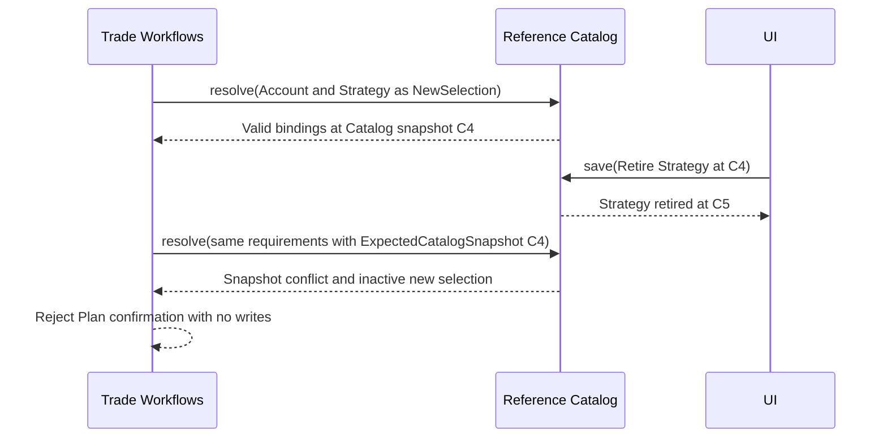
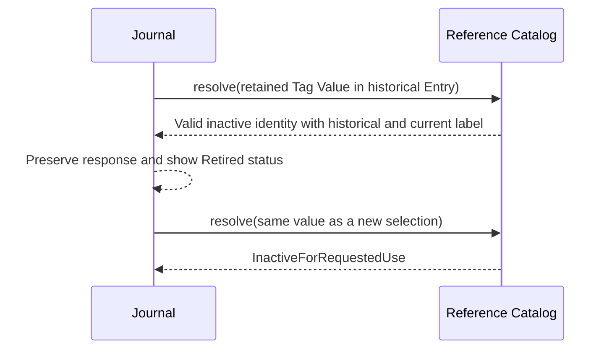
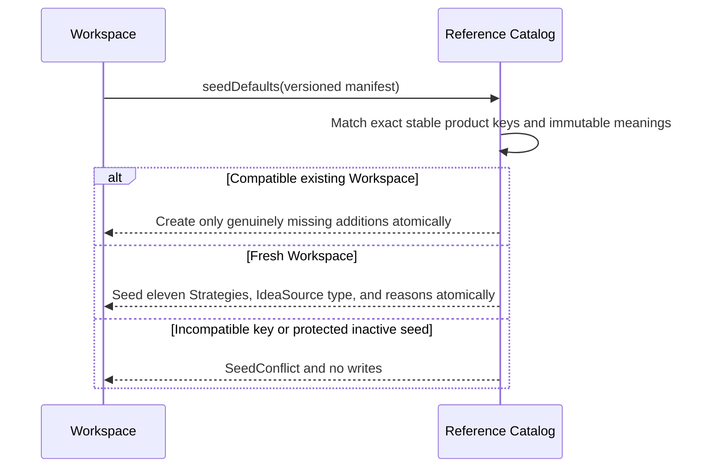

# Reference Catalog

## Contract

Reference Catalog owns stable identity, current selection availability, label/history, hierarchy, semantic roles, immutable Strategy shapes, default seed state, and backup/Restore for Institutions, Accounts, Strategies, Tag Types/Values, Close Reasons, and Abandonment Reasons.

It neither stores Trade selections nor calculates strategy conformance or reports. Inactive means unavailable for the applicable new selection, never deleted or historically invalid.

```text
interface ReferenceCatalog
  save(command: CatalogSaveCommand) -> CatalogSaveResult
  query(request: CatalogQuery) -> CatalogQueryResult
  resolve(request: ResolveCatalogReferences) -> CatalogResolutionSet
  seedDefaults(command: SeedCatalogDefaults) -> SeedCatalogResult
  exportSnapshot(request: CatalogExportRequest) -> CatalogBackupSection
  prepareRestore(request: PrepareCatalogRestore) -> PrepareCatalogRestoreResult
  applyPreparedRestore(command: ApplyPreparedCatalogRestore) -> CatalogRestoreResult
```

## Records and identity

- An Account has one immutable Institution parent. A Trade selects one Account and derives its Institution.
- A Tag Value has one immutable Tag Type parent.
- One fixed Tag Type has semantic role IdeaSource. Its Values are trader-defined in the current seed manifest.
- A Strategy has an immutable typed structural shape. Renaming does not change meaning; changing structure requires a new Strategy identity.
- Rolled is the unique workflow-semantic Close Reason role.
- Rename and availability changes append revisions. Reactivation is valid only if meaning is unchanged.

Presentation calls inactive Institutions, Accounts, and Tag Types Archived; inactive Strategies, Tag Values, and reasons are Retired. Historical/current labels are both available where needed.

The IdeaSource Tag Type may be renamed but cannot be archived or repurposed while that product role exists. Its current trader-created Values remain individually retireable. Current labels must be distinguishable in their selection namespace: Institution globally, Account within Institution, Strategy globally, Tag Type globally, Tag Value within Tag Type, and each reason taxonomy within itself. Exact normalization is an implementation choice; label text is never identity.

## `save`

Supports typed creation, rename, archive/retire, and reactivation with expected revisions. It appends one administrative decision and never edits earlier revisions. Accounts can be created/reactivated only under a selectable Institution. An Institution with selectable Accounts cannot be archived. Tag Type archive does not erase Values or invalidate an already-bound Journal definition.

An accepted `CatalogSaveResult` returns the generated or retained stable identity, complete current record, appended history head, and new Catalog snapshot. A caller never queries merely to obtain the record it just created or changed.

Seeded taxonomy values governed by `SeededValuesRemainSelectable` cannot be retired, although they may be renamed. Rolled additionally remains selectable while Roll is supported. Trader-created values remain retireable. Both seeded and trader-created Strategies may be retired.

## `query` and `resolve`

Query lists one typed family with Selectable-only or Include-inactive views, deterministic label/identity order, snapshot-bound pagination, or complete history for one identity. It is not a generic report grouping API.

Resolve validates bounded typed requirements under one catalog snapshot for:

- `NewSelection`: identity and required parent must be selectable;
- `NewTagValueSelectionUnderExistingBinding`: an already-bound inactive Tag Type may remain, but the selected Value must be active and belong to it;
- `RetainedReference`: active or inactive identity remains valid historically;
- `HistoricalSnapshot`: retained identity plus historically valid label;
- `DisplayOnly`: current or at-time label without granting selection eligibility.





## Strategy shapes and canonical seeds

Strategy shapes use a finite typed vocabulary: ordered long/short Stock/Call/Put roles with positive relative quantities and constraints for common Underlying, expiration order/equality, strike order, and share coverage. No shape embeds DTE, delta, price, Stop, Target, Plan quantity, or wing-width defaults.

The exact initial Strategy seeds are:

1. **Long Stock** — one long Stock role.
2. **Long Call** — one long Call role.
3. **Long Put** — one long Put role.
4. **Cash-Secured Put** — one short Put role.
5. **Covered Call** — long Stock and short Call on the same Underlying, with shares covering contract quantity through the multiplier.
6. **Vertical Call Debit Spread** — long lower-strike Call and short higher-strike Call, same Underlying and expiration, equal contract ratio.
7. **Vertical Call Credit Spread** — short lower-strike Call and long higher-strike Call, same Underlying and expiration, equal contract ratio.
8. **Vertical Put Debit Spread** — short lower-strike Put and long higher-strike Put, same Underlying and expiration, equal contract ratio.
9. **Vertical Put Credit Spread** — long lower-strike Put and short higher-strike Put, same Underlying and expiration, equal contract ratio.
10. **PMCC** — long later-expiration lower-strike Call and short nearer-expiration higher-strike Call on the same Underlying, equal contract ratio.
11. **Iron Condor** — long Put, short Put, short Call, and long Call in ascending strike order, with one Underlying, one expiration, and equal absolute contract quantities.

For Iron Condor, put/call wing widths may differ. Zero days to expiration is a per-Plan criterion, never Strategy identity.

Cash-Secured Put names trader intent; without cash/equity snapshots the product does not claim to prove cash coverage. There is no generic Custom seed; traders may create a typed shape when needed.

## Taxonomy seeds

Close Reasons are exactly:

1. Target Reached
2. Stop Triggered
3. Thesis Invalidated
4. Time-Based Exit
5. Rolled

Abandonment Reasons are exactly:

1. Entry Criteria Never Met
2. Thesis Invalidated Before Entry
3. Opportunity Missed
4. Chose Not to Enter
5. Plan Superseded

There is one IdeaSource Tag Type and no seeded IdeaSource Values. No Institution, Account, “Other” reason, generic Strategy, Never Filled, Expired, Assigned, or Exercised value is seeded. Settlement mechanisms and lifecycle outcomes are facts, not Close Reasons.

## `seedDefaults`

Workspace alone supplies a versioned manifest and expected catalog snapshot. Seeding matches stable product keys, creates missing supported defaults atomically, and is idempotent. An accepted result returns the resulting Catalog snapshot, exact additions, and the selectable-Account summary Workspace needs for onboarding without a follow-up query. Seeding never matches by mutable label, overwrites a trader rename, reactivates a legitimately retireable seed, changes a shape, or assigns default origin to ordinary UI-created data. Incompatible known keys return `SeedConflict` with no write.



## Backup and Restore

The Catalog section includes every identity, origin, label/availability revision, immutable parent/shape/role/policy, and seed-manifest state. It excludes picker rows, report groups, and private indexes.

Preparation validates typed identity spaces, histories, current-label distinguishability, immutable relationships/shapes, unique roles/default keys, policies, and every external Trade/Journal requirement. Retained inactive references and historical Journal labels are valid; missing/wrong-kind identities reject the full Restore. Apply preserves identities and histories only inside Workspace's atomic replace transaction. There is no per-reference import or ID remapping.

See [Workspace](workspace.md), [Trade Workflows](trade-workflows.md), and the [glossary](../glossary.md).
