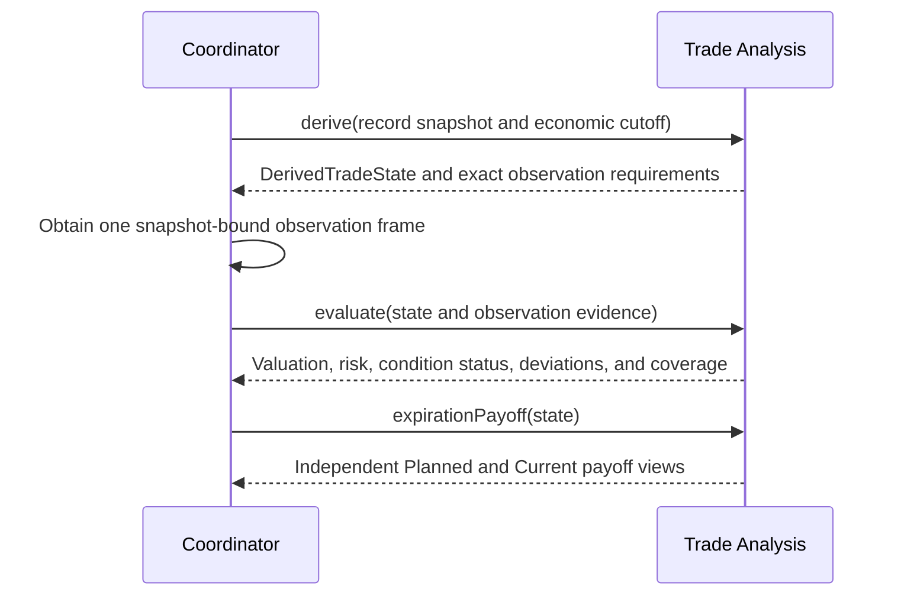

# Trade Analysis

## Contract

Trade Analysis is the pure, deterministic authority for interpreting one Trade's supplied economic facts. It replays effective facts, derives Positions and FIFO Lot Matches, allocates fees, evaluates the confirmed Plan and current management, produces valuation and payoff views, detects deterministic Deviations, derives Terminal Disposition and expected Lifecycle State, and explains the analytical effect of a candidate correction.

It owns no facts, clock, calendar, storage, Mark selection, provider access, reference labels, UI formatting, or cross-Trade aggregation. Every input is explicit and every output is inert. Trade Record remains authoritative for stored Lifecycle State, recorded Lot Matches, and recorded Deviation occurrences; analysis independently derives their expected values so coordinators can preserve agreement.

```text
interface TradeAnalysis
  assessPlan(input: PlanAssessmentInput) -> PlanAssessment
  derive(input: TradeDerivationInput) -> DerivationResult
  evaluate(input: TradeEvaluationInput) -> TradeEvaluation
  expirationPayoff(input: ExpirationPayoffInput) -> ExpirationPayoffViews
  replay(input: TradeReplayInput) -> TradeReplay
  assessChange(input: ChangeAssessmentInput) -> ChangeAssessment
```

There is no public formula toolkit. Callers cannot independently invoke lot matching, lifecycle derivation, fee allocation, or one risk formula and then assemble a potentially incoherent result.

## Shared values

```text
CalculationResult<T> =
  Value(T)
  or Unbounded(direction, explanation)
  or Unavailable(stableReason, structuredDetails)
  or NotApplicable(stableReason, structuredDetails)

FactOrder = EconomicTime then RecordedSequence

DerivedTradeState =
  TradeId and source FactRevision
  analysis cutoff
  effective ordered facts
  Instrument Positions and open Lots
  expected FIFO Lot Matches and allocated fees
  realized result and remaining opening fees
  expected Lifecycle State and agreement status
  Terminal Disposition when terminal
  Plan Baseline, 1R, Entry Resolution Point, and Entry Quality
  effective management conditions
  exact observation requirements
  deterministic fact-only Deviations
```

Each independently useful calculation has its own `CalculationResult`. A valid dollar result remains visible when its Plan-R conversion is unavailable. Partial sums are labeled covered subtotals; fill cost, zero, a carried value, or an unrelated observation is never substituted.

## Operation contracts

### `assessPlan`

Accepts proposed Plan facts and the immutable Strategy shape. It validates leg coherence, exact contracts or complete objective criteria, management coverage, and a calculable numeric Plan Baseline. Acceptance returns normalized Plan semantics, the positive dollar value of 1R, independently available Planned Expiration Payoff, and retained conformance-evidence requirements. Confirmation time—not the strategy label—freezes these values.

A Plan can be complete before any entry occurs. Rejection is typed and identifies every missing or incoherent field; it writes nothing.

The Plan Baseline evaluates intended entry against every original Stop and Target using the same independent-OR and nearest nonnegative monetary-boundary policy used by current headlines. It contains Original Planned Risk, Original Planned Reward, planned reward/risk ratio, and per-condition basis; Original Planned Risk must be positive and is exactly 1R. An underlying-price option Stop must also contain a frozen monetary loss boundary for measurement, without being mislabeled as a structure-value trigger.

### `derive`

Accepts one snapshot-consistent Trade Record and an explicit economic cutoff. It uses only effective corrected facts at their original Economic Time, ordered by Recorded Sequence for ties. It includes Execution, Assignment, Exercise, Expiration, and cash-settlement members; settlement is never synthesized as a zero-price Execution.

It derives Position, open Lots, FIFO Lot Matches, fee treatment, realized P&L, expected Lifecycle State, Terminal Disposition, Entry Resolution Point, actual-entry comparison, and fact-only Deviations. It reports disagreements with stored lifecycle, recorded lot links, or recorded deviations as structured integrity findings. It never silently repairs them.

Planned Leg fulfillment is independently `Unfilled`, `PartiallyFilled`, `FilledAsPlanned`, `FilledWithDeviation`, `NotEntered`, or `NotVerifiable`. Not Entered applies to an untouched leg when a partially executed Trade ends. A mismatch is deterministic only when retained selection evidence can reproduce it; absent evidence yields Not Verifiable rather than assumed conformance or Deviation.

The Entry window begins with the first Position Change that establishes exposure. It ends when every Planned Leg/quantity is entered or explicitly Not Entered, or immediately before the first exposure-reducing Position Change, whichever occurs first. Entry Quality aggregates opening Executions and allocated fees only inside that window.

For a Closed Trade, Entry/Exit Scaling counts decision-level Position Changes—not Legs, Executions, or broker partial fills—and classifies `SingleEntrySingleExit` or `Scaled`; insufficient historical grouping is Unavailable. Option Disposition Timing uses explicit quantity and mechanisms to classify `FullyDisposedPreExpiration`, `FullyHeldToExpirationSettlement`, or `Mixed`. An Execution on expiration day is still pre-settlement disposal. Open/non-option Trades are Not Applicable.

### `evaluate`

Accepts one `DerivedTradeState`, an exact observation frame, and any required historical condition evidence. It returns:

- dated Mark-to-Market Valuation with per-Instrument coverage;
- Ongoing Risk to each effective Stop, Worst-Case Ongoing Risk, Incremental Reward, and Plan-R conversions;
- per-condition Stop and Target status under independent OR semantics;
- Overrun when price or structure value has crossed a Stop without flattening the applicable Position;
- Mark-dependent Deviation occurrences and the observation binding used.

Current calculations use only remaining open exposure, effective Management Revisions, and eligible exact-date Marks. A stale observation is context, not valuation evidence. Underlying-price and structure-value conditions remain independently visible even when a headline nearest boundary is available.

Realized-to-date P&L, each remaining Instrument component, the remaining-open total, Current Marked Trade P&L, and incurred fees are independently returned. A total is Unavailable if any required component lacks exact evidence, while valid components and an explicitly labelled covered subtotal remain visible.

### `expirationPayoff`

Produces independent Planned and Current views over nonnegative Underlying price through positive infinity. Planned uses frozen confirmed Plan facts. Current uses realized-to-date net P&L as a constant offset plus remaining open Lots and unconsumed opening fees, with no hypothetical closing fee. Each available curve includes normalized piecewise-linear segments, all zero crossings/touches/ranges, signed extrema, and the complete attainment set for each extremum.

The operation performs no theoretical pricing. Co-expiring option structures of any Strategy are supported and Stock Legs may participate at that one expiration anchor. Current is Not Applicable when flat. Stock-only exposure without an option expiration anchor is Not Applicable. Multiple expirations are Unavailable rather than combined into a misleading one-date curve.

### `replay`

Accepts one corrected Trade snapshot and an ordered series of explicit Mark frames over a caller-specified relevant lifetime. It returns corrected Position, realized and marked results, lifecycle transitions, management, condition status, Deviations, Journal navigation keys, and explicit gaps at each point. It neither selects dates nor carries values through missing evidence.

Stop Discipline is derived as continuous episodes against the effective Stop revisions. An episode begins at the first exact observation demonstrating breach after activation or an observed unbreached state, and ends only with an exact unbreached observation or condition replacement/retirement. A preceding gap means “first observed,” never a fabricated crossing date. Stable episode fingerprints allow atomic create/retain/supersede/Void reconciliation without daily duplicates.

### `assessChange`

Accepts before and candidate records for every affected Trade plus the available observation frames. It validates the candidate as a whole and returns before/after derivations, changed calculations, lifecycle/lot/deviation reconciliation, relevant historical intervals, and a structured Correction Footprint. It reports when more evidence is required. It never writes.

## Normative analytical rules

- One Execution belongs to exactly one Trade, including during a Roll.
- FIFO Lot Matches link closing quantity to opening Lots without copying price or P&L onto the link.
- Fees are allocated lot-aware and exactly once: an opening fact's actual fee is proportional across its created Lot quantities; its unconsumed portion stays with the Open Lot and reduces marked P&L; a disposing fact's fee is proportional across its Lot Matches; realized P&L includes both attributable portions. No future closing fee is projected and separately displayed incurred-fee totals are never subtracted again.
- Assignment and Exercise preserve Settlement Price separately from adjusted basis or proceeds; option premium is not counted twice.
- For U.S. physical settlement, short-put assignment buys stock at strike with basis reduced by premium received; short-call assignment sells at strike with proceeds increased by premium received; long-call exercise buys at strike with basis increased by premium paid; long-put exercise sells at strike with proceeds reduced by premium paid. Applicable costs adjust the resulting basis/proceeds exactly once.
- Lifecycle State is expected as `Planned`, `Open`, `Closed`, or `Abandoned`. Terminal Disposition is derived separately and may contain mixed mechanisms.
- The frozen Plan Baseline defines 1R. There is no separate standing Accepted-Position risk/reward baseline.
- Entry Quality is one comparison resolved at the Entry Resolution Point, not a continuously rewritten score.
- The only Deviation categories are Planned-Leg Terms, Entry Size, Unplanned Exposure, and Stop Discipline. Planned-Leg Terms records all mismatched exact fields for one served leg in one occurrence. Entry Size records excess as it occurs or shortfall at Entry Resolution, with Not Entered as the untouched-leg zero form. Unplanned Exposure requires the explicit Planned-Leg intent `ExplicitlyUnplanned`; mismatched terms never imply it. Targets and Management Revisions are not Deviations.
- Stop Discipline is an occurrence/episode, not one duplicate fact per observed date.
- Calculation reason codes are stable; display prose is not a branching contract.

## Staged evaluation



This sequence is a data dependency, not a requirement that the operations cross a process boundary.

## Failures and integrity

Invalid Plan evidence, incoherent economic facts, unsupported Instruments, missing exact contracts, invalid quantities, duplicate ownership, and contradictory settlement allocations are typed rejections. Missing Marks, acknowledged unavailability, multiple expirations, no Plan Baseline, or no remaining Position are calculation states rather than infrastructure errors. A caller must not convert either class into a plausible number.

See [Trade Workflows](trade-workflows.md) for mutations, [Trade Views and Reporting](trade-views-and-reporting.md) for read assembly, and [ADR 0007](../adr/0007-observed-valuation-and-expiration-payoff.md) for the valuation/payoff boundary.
