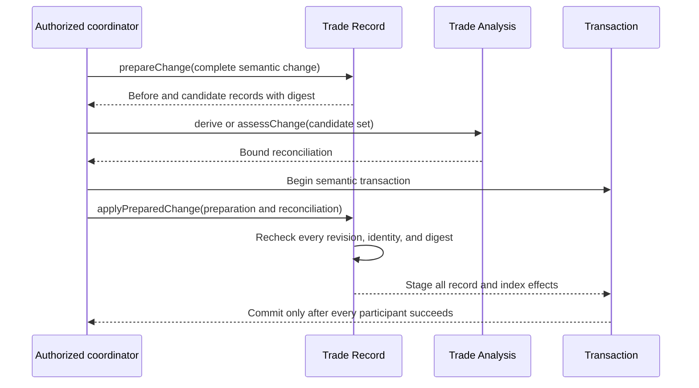
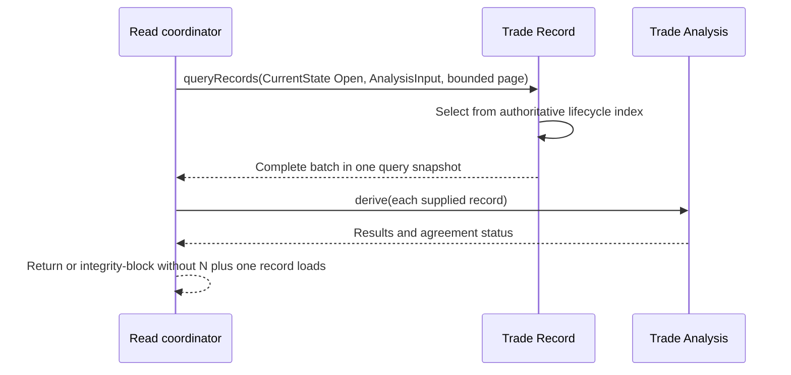
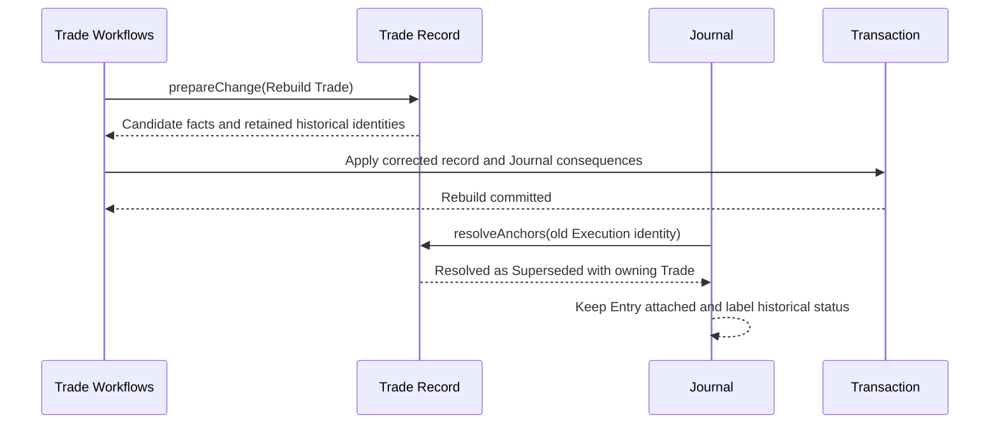

# Trade Record

## Contract

Trade Record owns the complete factual and audit history of economic Trades and the one stored/indexed derived-state exception: Lifecycle State. It assigns stable Trade and fact identities, preserves immutable versions and Voids, builds nonpersistent candidates for semantic workflows, commits candidates with bound analytical reconciliation, serves snapshot-consistent reads, resolves historical Anchors, and owns its backup/Restore section.

It exposes neither child-entity CRUD nor a whole-document save. It does not calculate Position, P&L, risk, payoff, Terminal Disposition, or reports. It persists only facts plus the agreed records that workflows keep synchronized with analysis: stored Lifecycle State, active Lot-Match links, and recorded Deviation occurrences.

```text
interface TradeRecord
  prepareChange(change: TradeRecordChange) -> PrepareTradeChangeResult
  applyPreparedChange(command: ApplyPreparedTradeChange) -> TradeRecordApplyResult
  getRecord(request: GetTradeRecord) -> GetTradeRecordResult
  queryRecords(query: TradeRecordQuery) -> TradeRecordPage
  history(request: TradeHistoryRequest) -> TradeHistoryResult
  resolveAnchors(request: ResolveTradeAnchors) -> TradeAnchorResolutionSet
  exportSnapshot(request: TradeRecordExportRequest) -> TradeRecordBackupSection
  prepareRestore(request: PrepareTradeRecordRestore) -> PrepareTradeRecordRestoreResult
  applyPreparedRestore(command: ApplyPreparedTradeRecordRestore) -> TradeRecordRestoreResult
```

## Identity and ordering

```text
TradeId = stable identity of one economic Trade
TradeFactId = stable identity of one real-world fact across Replace or Void
FactVersionId = immutable value or Void revision within that identity
FactRevision = opaque identity of one atomically committed Trade snapshot
FactOrder = EconomicTime then stable RecordedSequence

StoredLifecycle =
  Planned | Open | Closed | Abandoned
  plus effective-fact digest, causing fact/correction, and FactRevision binding
```

Save time is audit provenance and never replaces Economic Time. Replace appends a version under the same fact identity. Void appends an explicit Void version. Rebuild preserves the Trade identity, retains superseded fact identities for history and Anchors, and assigns new identities to newly reconstructed facts.

An existing fact keeps its Recorded Sequence even if correction changes its Economic Time. A newly reconstructed Rebuild fact receives a new sequence in the explicitly supplied reconstruction order. Collection order, lexical identity, and wall-clock arrival never break same-time ties.

Candidate references exist only inside a prepared command. They reserve no durable identities. A failed transaction leaves no visible placeholder.

## Record content

One `TradeRecordSnapshot` contains one Account reference, typed Trade tags, stored lifecycle, the confirmed Plan and Planned Legs, Position Changes and their exact members, fill Executions, explicit settlements, Management Revisions, Close/Abandonment facts, Roll and settlement lineage, active recorded Lot Matches, recorded Deviations, and version metadata.

A cross-Trade Position Change has one shared identity and origin with explicit participation links. Each Trade snapshot projects only its owned economic effects; independently editable duplicate copies are forbidden.

Available projections are:

- `Summary`: factual/indexed list fields and integrity binding;
- `AnalysisInput`: the complete effective projection required by Trade Analysis, returned batchably;
- `FullAudit`: all versions, superseded values, Voids, reasons, and associations.

Labels remain in Reference Catalog. Calculated values remain in analysis/read modules.

## Change protocol

`TradeRecordChange` is a closed union: Confirm Plan, Abandon Plan, Position Change, Management Revision, Correction (`ReplaceFact`, `VoidFact`, or `RebuildTrade`), and the narrowly authorized reconciliation of detected Deviations.

### `prepareChange`

Performs no write. It checks expected revisions, resolves complete cross-Trade participation and version chains, validates structural coherence, and returns before/candidate `AnalysisInput` records plus a canonical digest. Missing settlement allocation returns bounded `NeedsResolution`; it is never guessed.

### `applyPreparedChange`

May run only inside a coordinator-owned semantic transaction. It rechecks every base revision and digest, requires a valid `DerivedTradeReconciliation` for the exact candidate set, assigns durable identities, appends versions, and stages lifecycle/index, Lot Match, Deviation, and lineage effects together.

The caller supplies facts and Trade Analysis supplies expected state. There is no independent lifecycle setter. A Journal-participant failure rolls back the staged Trade effects.

An accepted `TradeRecordApplyResult` returns the durable-identity mapping and exact staged Trade projections/revisions that will become current if the surrounding transaction commits. The owning coordinator returns those bound projections after commit and never needs to call `getRecord` merely to obtain the facts it just changed.



The Deviation-reconciliation variant cannot change economic facts or Lifecycle State. It requires exact Trade and Market Data bindings and complete occurrence fingerprints. Daily Review uses it only to reconcile Mark-detected Stop Discipline.

## Read contracts

### `getRecord`

Returns one requested projection with its `FactRevision`, `NotFound`, or a structured integrity failure. Analysis never combines child reads from different revisions.

### `queryRecords`

Supports bounded filters for current or cutoff lifecycle, Trade, Account, Strategy, Underlying, exact Instrument, Plan IdeaSource, and typed Trade tags; fixed factual sorts; `Summary` or `AnalysisInput`; and opaque pagination.

Different nonempty dimensions combine with AND and selected values within one dimension combine with OR. There is no arbitrary Boolean or general date-range language. `CurrentState` uses the authoritative lifecycle index. `StateAtEconomicCutoff` is the exact completed-session query needed for corrected historical Daily Review eligibility.

Fixed sorts are Plan Time descending, Last Activity descending, or Terminal Time descending. Pagination/cursors are bound to the normalized query and snapshot and cannot be reused after either changes. `AnalysisInput` is returned as a complete bounded batch so Open lists and Review do not issue one child/Trade load per result.



### `history`

Returns complete requested version chains, effective/Voided status, correction reasons, FactRevision headers, owning/participating Trades, and cross-Trade lineage. It supports ordinary Edit → Save → View history without constructing a competing analytical history.

### `resolveAnchors`

Resolves Trade and fill-Execution Anchors in batches as `Effective`, `Superseded`, `Voided`, or `Unknown`, with owning Trade. A formerly valid Execution Anchor survives Replace, Void, and Rebuild; it is never silently redirected to a reconstructed fill.



## Backup and Restore

`exportSnapshot` emits every identity, sequence, fact version/Void, lifecycle record, Lot-Match/Deviation history, participation, and lineage bound to Workspace's common export snapshot. Private indexes/projections are excluded.

`prepareRestore` validates schema, identity uniqueness, version continuity, effective selection, ordering, membership, quantities, allocations, lineage, and internal Anchor reachability without writing. It supplies every restored Trade to Trade Analysis. Coherent facts with stale lifecycle/lot/deviation agreement are repairable; incoherent facts reject Restore.

Missing historical observation evidence reduces verification coverage and never authorizes deletion of a retained evidence-bound recorded Deviation. Each occurrence keeps the fact/Mark identities that supported it.

`applyPreparedRestore` is callable only within Workspace's atomic full replacement. It rechecks analysis/reference/authorization bindings, preserves stable identities and audit history, and rebuilds private indexes.

## Invariants and failures

- A Trade has exactly one Account; Institution is derived through that Account.
- One Position Change may participate in several Trades, but one fill Execution has exactly one owning Trade.
- Stored Lifecycle State and every affected current-state index change atomically with its justifying facts.
- Current/open reads use stored lifecycle; integrity checks independently derive expected lifecycle.
- No query or history read repairs facts as a side effect.
- Stale revisions, incomplete linked sets, missing allocation, invalid terminal-reason cardinality, or mismatched analysis binding produce typed no-write results.

See [ADR 0003](../adr/0003-authoritative-lifecycle-and-derived-disposition.md) and [ADR 0004](../adr/0004-corrected-economic-history-with-visible-audit.md).
