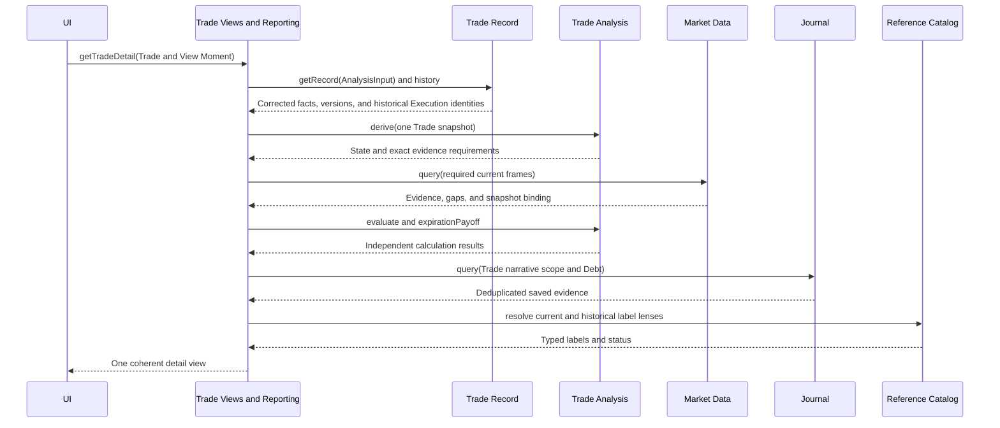
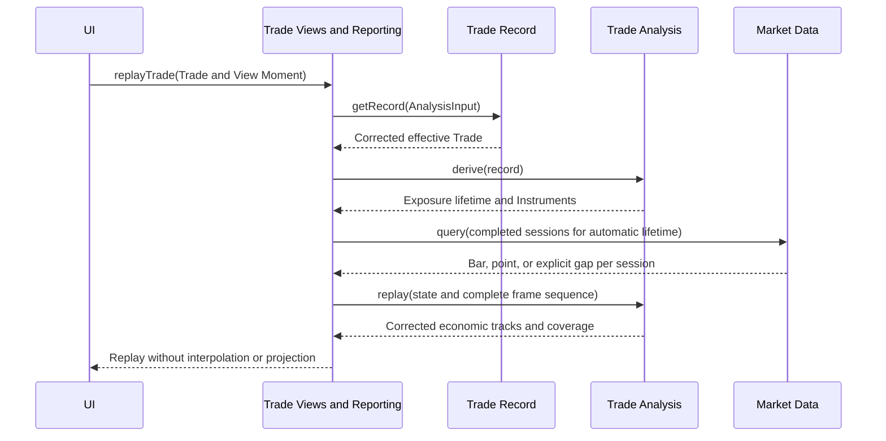
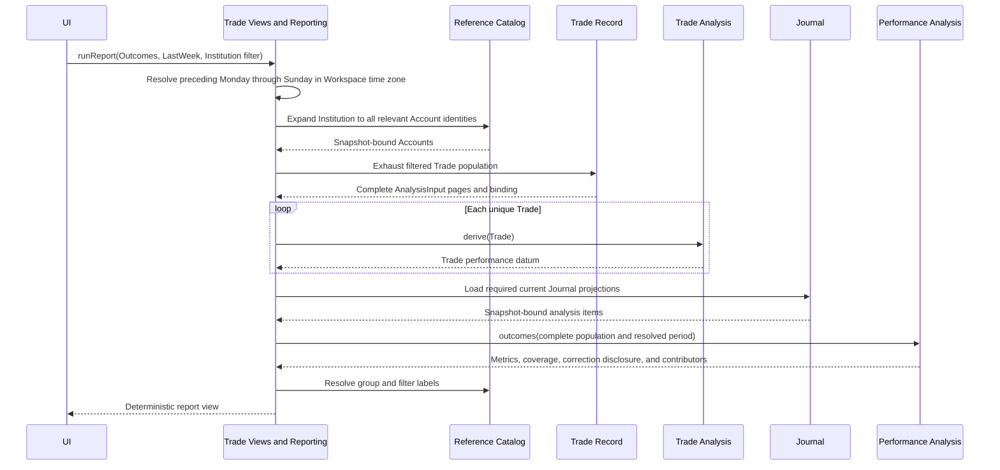
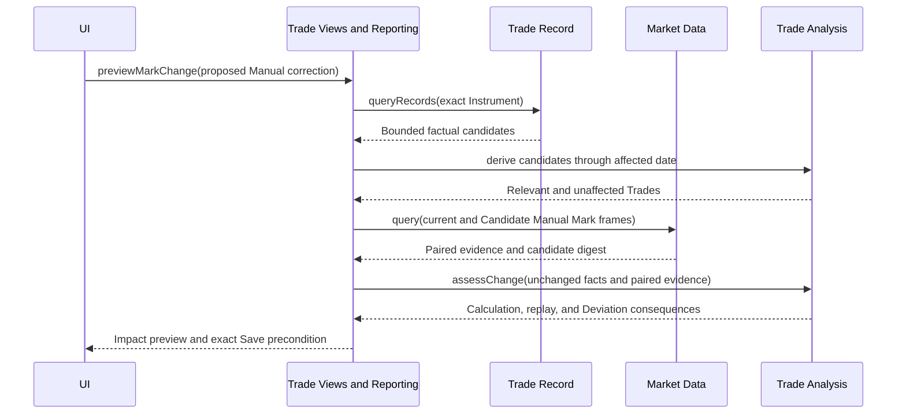

# Trade Views and Reporting

## Contract

Trade Views and Reporting is the normal read boundary for coherent UI-ready views that cross module ownership. It assembles current Trade browsing, complete Trade Detail, corrected-history replay, four deterministic report families, and shared-Mark change preview. It owns no facts, calculations, reports, sessions, or repairs.

```text
interface TradeViewsAndReporting
  browseTrades(request: TradeBrowseRequest) -> ReadViewResult<TradeBrowseView>
  getTradeDetail(request: TradeDetailRequest) -> ReadViewResult<TradeDetailView>
  replayTrade(request: TradeReplayViewRequest) -> ReadViewResult<TradeReplayView>
  runReport(request: ReportViewRequest) -> ReadViewResult<DeterministicReportView>
  previewMarkChange(request: MarkChangePreviewRequest) -> ReadViewResult<MarkChangeImpactView>
```

Results are `Ready`, `NotFound`, `Rejected`, `IntegrityBlocked`, or `ChangedDuringAssembly`. An individual Missing/Unavailable calculation remains inside a Ready view. Each result binds the represented Trade, Journal, Market Data, catalog, View Moment, and normalized request revisions. There is no durable View or Report entity.

## Labels and navigation

Current lists, headers, filters, and report groups use current labels and show inactive status. Economic/audit timelines use the label effective when selected/saved with the current label alongside when different. Journal Tag Select evidence uses its exact saved snapshot label. Renaming never changes analytical membership.

Every report/calculation exposes stable contributor navigation to the represented Trade, Execution, Journal item, or observation revision. Opening a destination performs that destination's normal current read and may disclose that the represented revision has changed.

## `browseTrades`

Supports current Lifecycle, Institution, Account, Strategy, Underlying, Trade Tag, Plan IdeaSource, and exact Trade filters, with fixed factual sorts and bounded pagination. Institution expands through all relevant Accounts under one catalog snapshot. Different dimensions use AND and values within one use OR.

Trade Record selects/indexes membership. Only the page is derived/evaluated. List items have a lifecycle-specific presentation:

- Planned: Plan Baseline and entry readiness;
- Open: Position, valuation, ongoing risk/reward, condition status, coverage, and settlement/management attention;
- Closed: final P&L/R availability, Terminal Disposition, and optional Close Reason;
- Abandoned: Abandonment Reason and Plan context.

All may show correction, Deviation, Debt, and integrity indicators. Calculation values never control cursor ordering.

## `getTradeDetail`

Returns effective Plan/management; Lifecycle and terminal explanation; Position, Lots, Lot Matches, Executions and settlement; fees/P&L; valuation and risk/reward; all Stop/Target results; independent Planned/Current Expiration Payoff; Entry Quality; Deviations and agreement; corrections/View history; lineage; deduplicated Journal narrative and Debt; and observation/source coverage.



The coordinator derives once and reuses state. Closed/Abandoned detail does not require current Marks. Reads never record a Deviation, settle Debt, or repair disagreement.

## `replayTrade`

Derives the relevant completed-session lifetime from current corrected facts. A never-exposed Planned/Abandoned Trade is Not Applicable. An Open Trade ends at current Expected Mark Date; a Closed Trade ends at its final applicable completed session. Corrections may move the automatically derived span.

Replay includes fact/management/correction markers, Bar candles, close-only Mark points, explicit gaps, calculated tracks, coverage, and audit navigation. It does not accept a user range, bridge a gap, project future values, or combine replay with Expiration Payoff.



## `runReport`

The four request families are Outcomes, Current Exposure, Process Scorecard, and one categorical Journal Field. The coordinator expands filters, exhausts the complete snapshot-bound candidate population, derives one coherent datum per Trade, loads current Journal projections when required, binds current Market evidence for Exposure, and delegates all population/date/formula/grouping meaning to Performance Analysis.

### Report Periods

The exact preset vocabulary is:

```text
AllTime | YearToDate | QuarterToDate | MonthToDate | ThisWeek | LastWeek
```

All Time is the default. To-date periods begin on their local calendar boundary and end on the View Moment's local Workspace date, inclusive. This Week is Monday through that date. Last Week is the preceding Monday through Sunday. These are calendar periods, not trading-session ranges. Holidays/weekends remain in the interval because metric natural dates can be non-session dates. There is no custom range or rolling-day preset. Current Exposure accepts no Report Period.

At most one Break Down By dimension is accepted and Overall remains visible. Exact resolved dates, coverage, Correction Footprints/sensitivity, contributors, and labels accompany the analysis result.



## `previewMarkChange`

Accepts one proposed Manual Mark command and expected resolution revision. It finds a bounded candidate population by exact Instrument, derives actual exposure/condition relevance, requests paired current/hypothetical frames from Market Data, and calls Trade Analysis for per-Trade calculation/replay/Deviation consequences and projected Correction Footprint. It writes nothing.



The UI saves through Market Data using the exact Save precondition. The successful `MarketDataSaveResult` supplies the committed observation resolution and revision without a follow-up read. An indirectly affected Trade or report view may perform its own normal read when the user actually opens it; Preview never rewrites evidence-bound Deviation history.

## Invariants

- Read assembly uses one coherent snapshot or explicitly returns changed-during-assembly.
- UI layout does not shape these interfaces.
- Audit history and corrected economic replay remain distinct.
- Gaps and partial coverage survive presentation.
- Report orchestration never duplicates Performance Analysis semantics.
- Future Insights, coaching, predictive claims, and saved reports are absent from the MVP.

See [Performance Analysis](performance-analysis.md), [UI contract](ui-contract.md), and [overview](overview.md).
