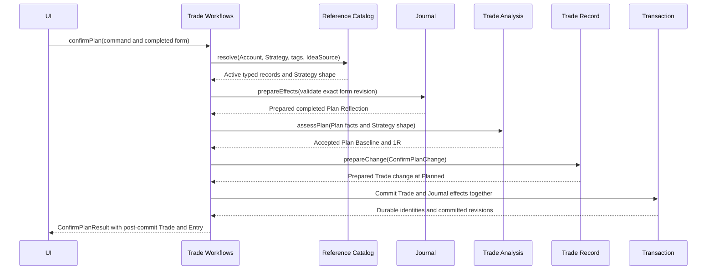
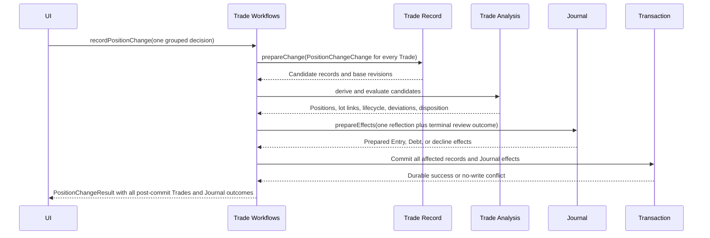
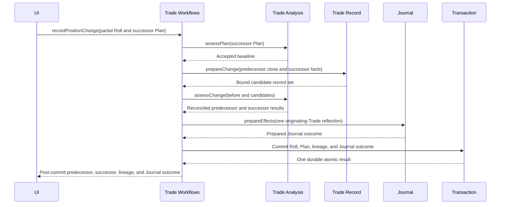
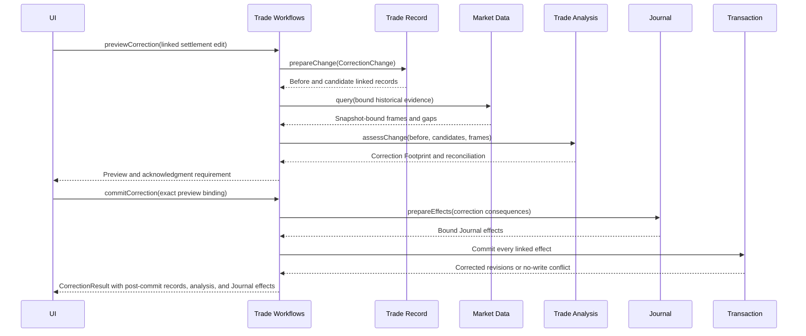

# Trade Workflows

## Contract

Trade Workflows is the only ordinary public interface for trader-initiated changes to Trade facts. It accepts complete semantic commands, resolves reference and Journal-definition context, obtains nonpersistent candidate records from Trade Record, delegates calculation to Trade Analysis, and commits all required Trade, lifecycle/index, Lot Match, Deviation, Journal, lineage, and allocation effects atomically.

Workspace Restore/integrity recovery and Daily Review's narrow reconciliation of a Mark-detected Deviation are the only other Trade Record mutation paths. The UI never writes child facts or sequences module writes itself.

```text
interface TradeWorkflows
  confirmPlan(command: ConfirmPlanCommand) -> ConfirmPlanResult
  abandonPlan(command: AbandonPlanCommand) -> AbandonPlanResult
  recordPositionChange(command: PositionChangeCommand) -> PositionChangeResult
  reviseManagement(command: ReviseManagementCommand) -> ReviseManagementResult
  previewCorrection(command: PreviewCorrectionCommand) -> CorrectionPreview
  commitCorrection(command: CommitCorrectionCommand) -> CorrectionResult
```

There is deliberately no `closeTrade`, lifecycle setter, separate `recordExecution`, or separate `roll` operation.

## Common command rules

Every mutation identifies expected Trade revisions and uses one explicit Economic Time. Journal forms identify the exact Entry Definition revision displayed to the trader and answer stable Prompt identities. Client-supplied labels are never authoritative.

```text
ReflectionDisposition =
  Complete(exact JournalForm)
  or Decline(optional reason)
  or Defer

TradeMutationSuccess =
  receipt:
    affected TradeIds and new FactRevisions
    created or revised fact identities
    Lifecycle State transitions
    Entry, Debt, decline, and retirement identities
    Deviation reconciliation and warnings
  postCommit:
    committed Trade projection for every affected Trade at its new FactRevision
    command-required derivation and evaluation bound to those exact facts and evidence
    created or revised Journal outcome projections
  affected identities and scopes for optional later reads of other views
```

Every operation-specific accepted result contains `TradeMutationSuccess`. It is sufficient to present the saved outcome and continue the Trade workflow without calling Trade Record or Trade Views and Reporting to read back the changed Trades. It does not duplicate unrelated lists or reports; the affected-scope metadata only supports optional later navigation or refresh.

`Defer` creates Journal Debt with the trigger-time prompt snapshot. It never creates a blank Journal Entry. Expected validation failures or stale bindings return typed no-write results. Infrastructure failure rolls back every participant.

## Operation contracts

### `confirmPlan`

Requires one Account, active Strategy, complete Plan facts, one completed Plan Reflection, and confirmation Economic Time. Trade Analysis must accept the Plan and produce a positive numeric Plan Baseline/1R. One atomic commit creates the Trade, freezes Planned Legs and original management, stores `Planned`, and saves the completed Entry whose Thesis and Invalidation answers also supply the authoritative Plan semantics.

The completed Entry uses Source Plan Confirmation and a Trade Anchor. Failure before commit creates neither a Trade nor Journal outcome.



### `abandonPlan`

Applies only to a confirmed Plan with no effective real position-changing fact. It requires one active Abandonment Reason. It sets stored Lifecycle State to `Abandoned`, retires applicable Plan-related Debt, and creates neither Close Reason nor Terminal Disposition. Previously entered false Executions must first be corrected or Voided visibly.

### `recordPositionChange`

Records one decision or settlement occurrence. The command may affect a bounded set of Trades and contain multiple Executions, Assignment, Exercise, Expiration, or cash settlement members. It must state ownership, Planned-Leg intent, allocation, and one Position Change Reflection disposition. The workflow derives and atomically stores all resulting Positions' agreement records, lifecycle transitions, Lot Matches, Deviations, lineage, Close Reason requirements, and Journal effects.

The presentation may preselect Defer for Position Change Reflection and terminal Close Review so factual capture remains low-friction, but the submitted command always carries the disposition explicitly. No abandoned form creates Debt.

A terminal change requires exactly one Close Reason only when trader agency is present. Closure never waits for Close Review; that reflection is completed, declined, or represented by Debt in the same transaction.

The single Position Change Reflection uses Source Position Change, a Trade Anchor to the originating Trade, and the exact Position Change origin. A terminal Close Review uses Source Trade Close, a Trade Anchor, and its distinct obligation key; it is never merged with the Position Change Reflection.



A Roll uses this same operation. It closes only the explicitly included predecessor quantity, confirms one successor Plan, assigns each new Execution exclusively to the successor, and writes typed predecessor/successor lineage. Unaffected predecessor holdings remain where they are.



Assignment and Exercise require explicit physical/cash outcome and Settlement Price. Physical delivery may establish, increase, reduce, close, or reverse Stock exposure. It is allocated first to an explicitly selected compatible existing Stock Trade; only residual exposure creates a successor Stock Trade. The UI may suggest one unambiguous destination, but the stored allocation remains explicit. Adjusted basis or proceeds remain distinct from Settlement Price and option premium is applied exactly once.

Confirming a physically settled short-option Plan accepts the contract's potential underlying obligation, so resulting assigned Stock exposure is planned settlement rather than automatically Unplanned exposure. A long-option Plan has advance Exercise authorization only when it explicitly records Exercise Intent; purchasing the option alone does not imply a desire to own or sell the Underlying. An unplanned automatic exercise is still recorded honestly with typed Exercise lineage and its resulting Stock allocation.

Residual settlement-created Stock receives explicit settlement-origin Plan context, not a fabricated second discretionary Plan confirmation or duplicate Plan Reflection.

Cash settlement creates no Stock successor. Physical settlement that leaves new Stock exposure must also leave complete effective management or atomically create workflow-routed Management Debt. That Debt is resolved only by a Management Revision establishing management or by a factual change removing the exposure; Journal prose alone cannot settle it.

When a Roll closes the predecessor, its required Close Reason is the workflow-role value Rolled. Typed lineage does not substitute for that explicit trader acknowledgment.

### `reviseManagement`

Requires the changed conditions, rationale, Economic Time, expected revision, and completed Management Revision form. It stores the effective values and one immutable Entry atomically, resolves related Management Debt when management becomes complete, and never changes the Plan Baseline. A revision is not a Deviation.

The Entry uses Source Management Revision and a Trade Anchor. The required Revision Rationale and optional paired revised-Thesis values are entered once and frozen into both the authoritative Revision semantics and its Journal snapshot. A later Journal Edit does not rewrite the Management Revision fact.

### `previewCorrection`

Accepts one typed `Replace`, `Void`, or `Rebuild` edit and expected revisions for every linked Trade. It builds candidates, invokes Trade Analysis, and returns a Correction Footprint: affected Trades/facts, lifecycle and disposition changes, Lot Match/fee/P&L changes, observation/report/review intervals, Journal/Debt consequences, and whether explicit Review Impact acknowledgment is required. It writes nothing.

A change with no material Position, allocation, P&L, lifecycle, disposition, or analytics consequence may proceed from the ordinary Edit → Save gesture using the same preview binding. Quantity, Instrument, Trade allocation, settlement, Void, Rebuild, lifecycle, and comparably material effects require the visible impact acknowledgment before commit.

### `commitCorrection`

Requires the exact preview binding and any required acknowledgment. It rechecks facts, observations, definitions, and references. It then atomically commits one corrected economic history, all reconciliation, and visible audit metadata or returns a no-write conflict.

Replace keeps the same fact identity and adds an immutable version. Void keeps the identity visible but removes that version's economic effect. Rebuild preserves the Trade identity while reconstructed facts receive new identities. Journal Entries anchored to a corrected or Voided fact remain navigable.



## Invariants

- A mutating workflow writes all required related effects or none.
- Facts are ordered by Economic Time, not save time.
- One Position Change has exactly one Position Change Reflection outcome, anchored to its originating Trade even when several Trades are affected.
- A confirmed Plan that has any effective real Position Change is not eligible for Abandonment.
- Assignment, Exercise, and Expiration are explicit settlement facts and are never inferred from the calendar.
- Factual recording is never blocked merely because reflection is deferred.
- Neither Daily Review Action nor Journal content executes a trade.
- Every accepted result contains the directly changed post-commit state needed by the Trade workflow; affected-scope metadata never mandates another read. There are no subscriptions or domain events.

See [Trade Record](trade-record.md), [Journal](journal.md), and [ADR 0002](../adr/0002-semantic-command-atomicity.md).
