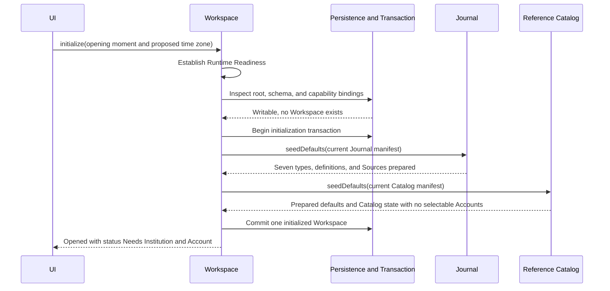
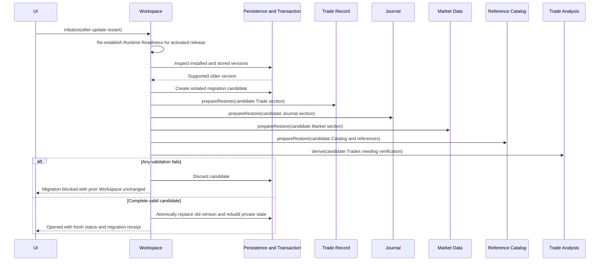
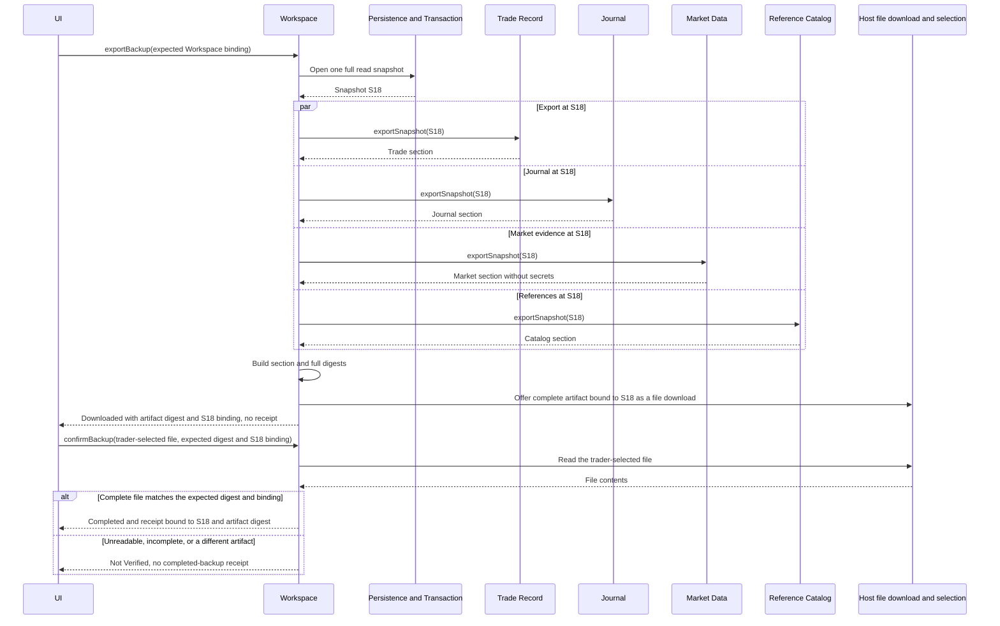
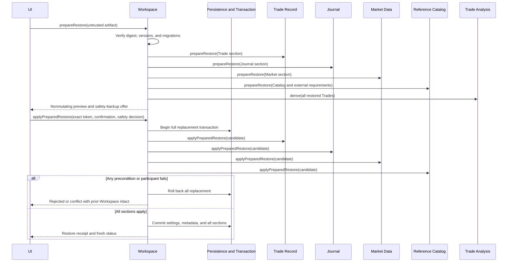

# Workspace

## Contract

Workspace is the lifecycle coordinator for one trader's device-local journal. It initializes/opens the journal only under current Runtime Readiness, applies supported migrations and controlled defaults, exposes installed capabilities and local-data protection, owns the Workspace time zone, creates full backups, and coordinates validated atomic replace-only Restore.

It is not an application user/account, sync service, generic settings store, raw persistence API, or record importer.

```text
interface Workspace
  initialize(request: InitializeWorkspace) -> WorkspaceInitializationResult
  getStatus(request: GetWorkspaceStatus) -> WorkspaceStatusResult
  saveSettings(command: SaveWorkspaceSettings) -> SaveWorkspaceSettingsResult
  requestDurability(request: RequestWorkspaceDurability) -> WorkspaceDurabilityResult
  exportBackup(request: ExportWorkspaceBackup) -> ExportWorkspaceBackupResult
  confirmBackup(request: ConfirmWorkspaceBackup) -> ConfirmWorkspaceBackupResult
  prepareRestore(request: PrepareWorkspaceRestore) -> PrepareWorkspaceRestoreResult
  applyPreparedRestore(command: ApplyPreparedWorkspaceRestore) -> WorkspaceRestoreResult
```

There is no login, user creation, sync, merge, per-section Restore, raw store, capability toggle, or delete operation.

## Status and capabilities

Status contains one full-content `WorkspaceSnapshotBinding`, time-zone setting/revision, immutable Installed Capability Manifest, onboarding state, current Runtime Readiness with per-check evidence, local-data-protection state, schema versions, and latest migration/seed/private-rebuild receipt.

The Installed Capability Manifest identifies complete supported public operations/variants, report/scorecard families, backup schema ranges, provider adapters, and dependency closure. It describes installed code, is not trader data, cannot be toggled, and is not restored. Undelivered behavior is absent; it is never represented as a domain-level Unavailable calculation.

Onboarding is Ready for Trade Planning or Needs Institution and Account. No fictional brokerage records are seeded.

The only Workspace-wide setting is a rules-based time-zone identity. Market session dates stay exchange-defined. Provider settings belong to Market Data, references to Reference Catalog, and forms to Journal.

`getStatus(current observation instant)` returns Ready only with `Writable` Runtime Readiness, Initialization Required only when a writable store was opened successfully and proved that no Workspace exists, Recovery Only with readable status and safe backup actions, Unsupported with failed-check reasons when no existing root needs protection, or Integrity Blocked with the underlying readiness evidence and safe actions whenever a known or possible existing root cannot be read or validated. A failed or ambiguous store read is never treated as an empty store. It does not mutate or repair.

`saveSettings(complete settings, expected settings revision)` returns Saved with the complete resulting settings/status and new settings/Workspace binding, Unchanged with the current settings/status, Conflict with current settings, or typed Rejected. No successful Save requires `getStatus`. Changing time zone changes how future View Moments, Daily Review selection, and named Report Period boundaries resolve; it never rewrites stored instants, Economic Dates, U.S. Trading Dates, Journal history, or an earlier calculation. The UI explains this effect before Save.

## Initialization and update migration

Fresh initialization requires `Writable` Runtime Readiness, then creates Workspace metadata and atomically seeds Journal and Catalog defaults. It derives onboarding from the resulting Catalog state bound through that same operation, including real Account availability. A failed readiness gate creates no Workspace, defaults, or imported facts.

`initialize(opening instant, optional first-run time zone)` first re-establishes Runtime Readiness. `WorkspaceInitializationResult` returns Opened with writable status/receipt, Time Zone Selection Required, Migration Blocked with unchanged-data evidence, Integrity Blocked with recovery actions when readiness passed but stored contents fail integrity validation, or the cross-cutting `RuntimeNotWritable` branch. For this operation, `RuntimeNotWritable` carries either `Recovery Only` with readable status/backup actions or `Unsupported` with all failed readiness checks and safe retry actions. A known or possible existing root that cannot be read additionally carries Integrity Blocked Workspace status and can never fall through to fresh initialization. The successful receipt identifies the readiness evidence, fresh/existing status, schema transitions, migrations, seed versions/additions, private rebuilds, and incomplete-transaction recovery.



A supported older version migrates through an isolated candidate using the same module validation and analytical verification as Restore. New defaults join the candidate without overwriting customization. Failure discards the candidate and leaves the prior data intact/recoverable; it never exposes partial readiness. Unknown newer or lossily migratable data is rejected.



Normal startup runs the readiness gate on every launch, then uses authoritative lifecycle/index invariants and bounded integrity receipts. It does not rederive every historical Trade unless migration, Restore, a private rebuild, or detected disagreement requires it. The readiness diagnostic transaction is isolated from authoritative facts and leaves no journal history.

## Local durability

`requestDurability` represents one explicit user gesture asking the host/platform for stronger local persistence. `WorkspaceDurabilityResult` is exactly one of:

- `Improved { currentProtection: Protected }`;
- `AlreadyProtected { currentProtection: Protected }`; or
- `NotImproved { currentProtection: BestEffort(reason) | Unavailable(reason) }`.

Protection is advisory and does not affect Runtime Readiness: with `Best Effort` or `Unavailable`, the Workspace remains `Writable` when every readiness check passes, and the UI keeps the not-protected warning visible. A denied or unsupported request neither fabricates success nor deletes or exports data. The operation never promises protection against device loss and does not replace backup.

## Full backup

A backup is one portable, self-contained, versioned snapshot containing Workspace settings/metadata and the Trade Record, Journal, Market Data, and Reference Catalog authoritative sections. It contains every identity, fact/audit revision, form definition, nonsecret configuration, and seed state required for round-trip equivalence.

`exportBackup(requested time, optional expected Workspace binding)` builds one artifact from one full read snapshot and hands it to the host as an ordinary file download. `ExportWorkspaceBackupResult` is Downloaded, Conflict with the current binding, or Not Completed with the failed stage, reason, and unchanged-Workspace evidence. Downloaded carries the source `WorkspaceSnapshotBinding`, full artifact digest, Workspace Backup Manifest digest, and suggested file name. It is not a completed backup: the application cannot observe whether or where the host saved the file, so Downloaded produces no `CompletedBackupReceipt`.

`confirmBackup(trader-selected file, expected source binding and full artifact digest from a Downloaded result)` reads the file the trader selects through the host's ordinary file selection and verifies that it is a complete, digest-valid artifact whose full artifact digest and source binding equal the expected values. `ConfirmWorkspaceBackupResult` is Completed with a `CompletedBackupReceipt`, or Not Verified with the reason: unreadable, incomplete or corrupt, or a different artifact. It writes nothing. The expected values come from the Downloaded result held in view state; no pending verification is stored, so a trader who leaves before verifying exports again. Verification is optional for keeping a copy, but an unverified download is never presented as a completed backup.

`CompletedBackupReceipt` binds the exact source `WorkspaceSnapshotBinding`, full artifact digest, Workspace Backup Manifest digest, read-back verification evidence, and completion time. It is result evidence rather than an authoritative Workspace mutation, so export and verification remain possible in `Recovery Only`.

It excludes credentials, unsaved forms, raw provider payloads, transient diagnostics, reports, replay projections, cursors, and safely rebuildable indexes/caches/projections. The Workspace Backup Manifest records versions, capability footprint, counts, exclusions, section digests, and a full digest.



A concurrent later mutation is outside the artifact rather than torn across sections. Export remains possible for readable internally bound data in `Recovery Only` or when current analytical agreement needs diagnosis; Restore applies the stricter validity bar. A failed read returns Not Completed; neither it, an unverified download, nor a failed verification issues a `CompletedBackupReceipt` or is ever presented as a completed backup.

## Restore

### `prepareRestore`

Treats the artifact as untrusted. It verifies envelope/digests, complete sections, version/capability support, and explicit migrations without changing live data. Each domain module validates its own graph. Trade Analysis rederives lifecycle, Lot Matches, and Deviations. Workspace closes cross-section Account/Strategy/Tag/Anchor/origin/Mark-evidence references.

Coherent facts with stale derived-agreement/private records may be repaired in the candidate and disclosed. Incoherent facts, broken history, missing identities, unsupported semantics, or impossible migration reject the entire candidate. No provider call occurs.

The preview shows source versions/time, exact record/history counts, migrations, repairs/rebuilds, provider Needs Setup outcomes, target replacement impact, warnings, and a safety-backup offer. Its token binds both artifact digest and exact live target Workspace; it is nondurable and invalidated by any relevant change.

### `applyPreparedRestore`

Requires `Writable` Runtime Readiness, sufficient resulting capacity/headroom, explicit Replace Entire Workspace authorization, and, when user data exists, either a `CompletedBackupReceipt` bound to the exact live target Workspace or an explicit decline after warning. A failed export, an unverified download, a failed verification, or a receipt for an older Workspace binding does not satisfy the safety-backup choice. It rechecks the Restore artifact, installed release/capabilities/seeds, live target, and any completed-backup receipt, then applies every prepared section and Workspace setting in one transaction. Outside `Writable`, it returns `RuntimeNotWritable` without changing the current Workspace.



Stable identities/history survive exactly. Private state is rebuilt. Provider credentials are absent by design; restored active configuration becomes Needs Setup until explicitly reauthorized. Runtime Readiness is re-established after the atomic replacement and before further mutation. `WorkspaceRestoreResult` returns fresh Workspace status and landing state under the new binding, so no `getStatus` follows success. Every pre-Restore view/form is invalidated and discarded; another surface performs its normal read only if and when the user opens it. Restore never merges and is idempotent only in the sense that reapplying the same artifact again performs another disclosed full replacement, not duplication.

## Device-local meaning

There is one trader and one Workspace data root with no application login, hosted journal-data backend, or automatic cross-device synchronization. Browser profiles and different browsers have independent origin storage; opening the hosted application elsewhere neither discovers nor transfers this Workspace. Restoring the same artifact to two installations produces independent copies. The delivery contract must make first successful writable installation/load sufficient for later offline startup and all manual workflows.

See [Delivery contract](delivery-contract.md), [ADR 0006](../adr/0006-device-local-workspace-and-replace-only-restore.md), and [Acceptance contract](../acceptance/acceptance-contract.md).
