# Trade Journal V3 specification consolidation — session handoff

Generated: 2026-08-26; last updated: 2026-09-11

## Purpose of the next session

Continue the specification-only consolidation of three competing Trade Journal designs into one canonical, technology-neutral product specification and Ousterhout-style deep-interface design. The consequential semantics, top-level partition, and all ten MVP interface drill-downs plus sequence audits are settled. Extract and coherence-check the canonical artifacts for user review at the exact checkpoint recorded below. Do not create an implementation plan.

## Primary goal

The repository is a baseline for evaluating model/harness combinations. The user wants:

1. One consolidated specification/design containing the strongest parts of the Claude, GLM, and Ox Alpha specifications.
2. A canonical domain glossary and selective architecture built around deep interfaces.
3. A separate behavioral UI contract informed by the Claude Design screenshots.
4. A technology-neutral delivery contract and acceptance contract.
5. A standardized evaluation-planning protocol.
6. Eventually, a prompt that points an evaluated model/harness at the approved specification and an interactively approved plan, after which the user issues /goal to implement the complete application.

Every evaluated model/harness will have a story-implementor agent, code-review agent, and acceptance-tester agent. Before /goal, the user will interactively review the evaluated pair's technology choices, plan, and task breakdown. The approved plan is then frozen. Planning quality is intentionally part of the evaluation. A future automated verifier/scorer is out of scope.

## Non-negotiable guardrails

- Work only in specifications, design documents, screenshots, and repository metadata.
- Do not read application code. The Claude worktree contains a partial implementation, but it must not inform the consolidation.
- Do not create an implementation plan or task breakdown for the application. Those are outputs of each evaluated model/harness's interactive planning cycle.
- Do not prescribe frameworks, databases, storage libraries, or other implementation technologies in the canonical specification.
- Preserve user-owned worktree changes. Do not clean, reset, or overwrite unrelated files.
- Do not commit anything without explicit user approval. Push only if asked.
- Continue autonomously from settled decisions. If a genuinely consequential unresolved conflict appears, ask only that one question with a recommended answer and honest tradeoffs.
- Canonical ubiquitous-language terms override screenshot labels and old plan prose.
- If a branch specification conflicts with a later, sharper decision in this handoff, use the decision in this handoff.

An earlier exploration accidentally exposed a few source/test filenames and a tiny UI diff before the user imposed the no-code boundary. That was disclosed to the user. No implementation observation was used in the design analysis. Do not repeat that inspection.

## Workspace and relevant sources

Repository:

- /home/ckolbegger/src/trade-journal-v3
- Current branch: main
- Current main HEAD, reverified 2026-08-30: 08d5771daf894fa709dc0ff99b42cf80e5230d6d
- Current main has user-owned untracked .codex/ and AGENTS.md. Preserve them.

Relevant registered worktrees:

- Claude: /home/ckolbegger/src/trade-journal-v3/worktrees/claude
  - HEAD: 98f0b1452c93a4275f2434b82c0d80b37287ef82
- GLM: /home/ckolbegger/src/trade-journal-v3/worktrees/glm
  - HEAD: d51e86df61d4f0998d94bf4ded2821310906175f
- Ox Alpha: /home/ckolbegger/src/trade-journal-v3/worktrees/ox-alpha
  - HEAD: 1ae4ae46f5a5ba8a2742ef2837f7cd6bca8c0532

Use only these worktrees for source-design comparison, even though other evaluation worktrees now exist.

Specification paths already audited:

- Each branch's CONTEXT.md
- Each branch's docs/adr/
- Each branch's docs/design/
- Each branch's docs/plan/
- Claude/Ox screenshots under docs/design/prototype/

Ox Alpha is a direct descendant of Claude and largely duplicates Claude's specification. Its committed documentation delta over Claude was limited to:

- docs/design/overview.md
- docs/plan/ui-conformance-migration.md

Treat those Ox refinements as a contribution without counting duplicated Claude material twice.

Earlier status evidence found Claude clean, GLM ahead of origin with an untracked AGENTS.md symlink, and Ox Alpha containing unrelated dirty source/UI and untracked artifacts. Reverify registration/status if needed, but do not open the code or touch those changes.

## Work completed

### Process and scope

- The three specification sets were inventoried and audited.
- All three CONTEXT.md glossaries were read and compared.
- Claude's 16 ADRs and its design documents were read.
- GLM's 11 ADRs and detailed module/interface documents were read.
- The Ox-specific documentation delta was read.
- All 24 Claude Design screenshots were visually inspected.
- The user approved selective architecture: canonical interfaces, operation semantics, shared types, invariants, dependency rules, and delivery guarantees are normative; implementations behind those interfaces remain free.
- The user chose plain request/response. Calls may be asynchronous, but there are no subscriptions, live queries, or change-event contracts. Consumers explicitly re-query.
- The design partition stops at the domain seam. The UI is a consumer governed by a separate behavioral contract.
- The user initially chose full intended product scope rather than a narrow release-only architecture. Later, specific capabilities were explicitly deferred; those deferrals are listed below.

### Evaluation workflow

- The canonical specification will not contain a stack or implementation plan.
- Each evaluated model/harness selects a stack and produces a plan/task breakdown during an interactive evaluation setup.
- Stack profiles may map canonical requirements to technology-specific tests, commands, and evidence, but may not revise canonical semantics, interfaces, or delivery guarantees.
- The user approves and freezes that plan before issuing /goal.
- Planning quality is part of the evaluation.
- A technology-neutral canonical acceptance contract will be checked into main.
- A future verifier may automate those criteria but is out of scope.

Official OpenAI /goal documentation previously consulted:

- https://learn.chatgpt.com/use-cases/follow-goals

Relevant takeaway: /goal is appropriate for long-running work with a clear, verifiable stopping condition and should be pointed at the approved docs/plan and concrete evidence of completion.

## Settled product and delivery decisions

### Technology and delivery boundary

- Delivery-contract-only: specify observable guarantees, not framework or storage machinery.
- Installable, local-first browser application for phone and laptop.
- The required product serves one trader in one device-local Workspace. It has no application login/account, server-hosted journal-data backend, or automatic cross-device data synchronization.
- Brokerage Accounts are trading-domain records inside the Workspace, not application identities, and do not imply authentication or hosted user accounts.
- Responsive layout is based on viewport width, not device identity.
- A narrow browser window on a desktop must switch to the same narrow layout used on a phone, live and without reload or loss of route/workflow state.
- Narrow view uses bottom navigation; wide view uses a left sidebar.
- Exact breakpoint is an implementation choice.
- After first successful online load/install, the application must reopen and support manual workflows with no network, including after the browser/application has been stopped.
- Hosted application remains the update source.
- While online, a device may detect and download an update in the background.
- The old version continues safely; the user is notified that an update is available.
- Activation occurs only on a safe reload/restart and never interrupts an active workflow.
- Offline devices retain the last successfully installed version until connectivity returns.
- Phone and laptop update independently.
- Code update behavior does not imply data synchronization.
- Local-data migrations must be versioned, atomic, and lossless. Failed update or migration must not corrupt the journal.
- Workspace portability uses one versioned, self-contained full backup. The backup contains all durable facts, saved history, Marks, registries, taxonomies, Journal definitions, and settings needed to reproduce the Workspace, while excluding secrets and safely rebuildable private projections or caches.
- **Restore** is replace-only, not a merge or selective import. It validates the complete backup before mutation, rejects invalid or unsupported input without changing current data, migrates supported older versions forward, and replaces the Workspace atomically.
- When the current Workspace contains data, Restore states plainly that the data will be replaced, requires explicit confirmation, and offers a safety export first. Merge and partial-import workflows are outside the required scope.
- Backup file representation is an implementation choice; the semantic contract does not require JSON, a database file, or another specific encoding.
- Service workers, frameworks, and migration implementation are planning choices, not canonical requirements.

The user explicitly confirmed both the local-data/application-identity boundary and the full-backup/replace-only Restore contract.

### U.S. market scope

- Canonical scope is U.S.-listed securities and options denominated in USD.
- International instruments, foreign currencies, and jurisdiction-specific settlement/basis behavior are out of scope.
- The application is an after-close journal, not an intraday monitor.
- No streaming prices, live quote contract, or arbitrary intraday valuation replay.
- Execution timestamps remain exact.
- Marks and historical valuation operate by U.S. trading date.

### UI contract

Claude Design screenshots are visual inspiration and the basis for the UI layout contract, but they are not authoritative for arithmetic, lifecycle, terminology, or domain behavior.

Canonical visual language observed:

- Warm cream page background.
- White rounded content cards.
- Black pill-shaped primary actions.
- Small-caps section labels.
- Colored semantic badges.
- Option chips.
- Right-aligned/tabular numeric presentation.
- Mobile/narrow layout is single-column with bottom navigation.
- Wide layout uses a left sidebar and centered content.
- The prototype reference presents contextual forms as bottom sheets on narrow viewports and right drawers on wide viewports over a dimmed background, but those containers are non-normative visual references.
- Contextual-form outcomes are normative: the trader retains the surrounding context and any entered-but-unsaved values, every supported viewport exposes equivalent fields and actions, Save/Cancel and validation semantics are consistent, and resizing never discards entered state. Inline expansion, dedicated route, modal, sheet, drawer, and transitions remain implementation choices.
- Every data-bearing view distinguishes **Loading**, **Ready**, **Empty**, and **Error**. Loading never masquerades as Empty; Empty means the request succeeded with no matching records and provides an appropriate explanation or next action; Error preserves safe recoverable context and identifies retry or correction rather than displaying false empty data.
- There is no generic Domain-condition UI layer. Journal Debt, Deviation, and Partially Entered appear where relevant under their own domain semantics rather than becoming mutually exclusive page states.

Exact labels must use the canonical glossary. Screenshot terms may be shortened only through an explicit mapping to canonical terms. Screenshot arithmetic and known prototype state inconsistencies must not leak into acceptance.

## Scale and performance contract

Target workload:

- 25,000 Trades: five years at roughly 5,000 Trades per year.
- Prolific day-trader workload: roughly 20–30 Trades per day.
- Between 20 and 200 simultaneously open Trades; benchmark 200.
- A typical same-day-expiration Iron Condor has four opening Executions and four closing or settlement facts.
- Benchmark on roughly 200,000 Execution/settlement facts, plus realistic Marks and Journal Entries.

Latency targets in a common local evaluation environment with no network dependency:

- Cold startup p95 at or below 2,500 ms to an interactive initial screen.
- Warm navigation p95 at or below 1,500 ms to a complete, interactive open-Trade list.

Correctness must survive corrections, voids, imports/restores, and projection/cache rebuilds.

Canonical results must be semantically equivalent to deriving from authoritative facts. Implementations may privately persist indexes, statuses, snapshots, projections, or caches for performance, but those are not independent sources of truth. Each evaluated plan must justify indexing/materialization, invalidation, rebuild, and benchmark strategy. This is intentionally an open planning challenge.

## Settled ubiquitous language and domain decisions

### Trade, Plan, Planned Leg, Execution, Position

- Trade: the positions and lifecycle governed by one confirmed Plan.
- Plan: the forward-looking decision artifact confirmed before deliberate entry.
- Plan confirmation freezes the Original Planned Legs and original management baseline.
- The freeze point is Plan confirmation, never the first Execution.
- Planned Leg: one intended role in the strategy.
- Execution: an actual fill fact with exact instrument, action, quantity, price, time, and fees.
- There is no persisted or canonical Actual Leg entity.
- Position and Instrument Position are derived by replaying position-changing facts.
- An Actual Leg may appear informally as a derived UI row, but it is not a source-of-truth entity or interface construct.

Canonical relationship:

Planned Legs plus Position Changes and their Executions/settlement facts produce derived Instrument Positions.

Every Execution either:

- Explicitly references the Planned Leg it was intended to fulfill, even if its instrument details differ; or
- Is explicitly Unplanned because it served no Planned Leg.

The association records trader intent. Matching terms and fulfillment are independent:

- A planned Sep 18 short put fulfilled by a Sep 11 short-put Execution is fulfilled with an expiration deviation.
- A genuinely extra hedge is Unplanned.
- Multiple partial fills may fulfill one Planned Leg.

Suggested derived Planned Leg outcomes:

- Unfilled
- Partially Filled
- Filled as Planned
- Filled with Deviation
- Not Entered, when a partially executed Trade ends without fulfilling that leg

The user approved Not Entered for untouched legs in a partially executed Plan. This is a structural deviation and may create Journal Debt for the reason.

### Deviation taxonomy

A Deviation is a deterministic record that actual behavior departed from an explicit trader commitment. It is descriptive rather than a judgment and uses exactly four fixed types:

- **Planned-Leg Terms** — a Position Change is assigned to an intended Planned Leg, but one or more exact instrument terms differ. One Deviation records all mismatched fields rather than creating one count per field.
- **Entry Size** — entered exposure exceeds planned quantity when it happens, or the Entry Resolution Point closes with less than planned quantity. A wholly untouched Planned Leg uses Not Entered as the zero-entry form.
- **Unplanned Exposure** — when recording the Position Change, the trader explicitly states that the relevant Execution serves no Planned Leg. The application never infers this merely from mismatched terms; it derives the Deviation and its quantity from that explicit intent association and the Execution facts.
- **Stop Discipline** — the currently effective Stop is breached while exposure remains open, deduplicated by continuous breach episode.

Target Reached and Target Overrun are separately measured conditions, not Deviations. Management Revisions are also separately measured facts rather than automatic Deviations. A later Management Revision never erases a Deviation that already occurred; future Stop Discipline evaluation uses the revised effective Stop. Recorded Deviations remain immutable and journal-linkable, subject to the already-settled visible correction/void history rules.

### Complete Plan versus partial entry

- A confirmed Plan must be complete even when the eventual Position is not yet fully entered.
- Every Planned Leg must contain either an exact contract or complete structured selection criteria.
- Bare TBD legs are not allowed.
- Selection criteria must be objectively evaluable. Examples include expiration policy, target delta/range, and spread width.
- Plan confirmation requires one single numeric Plan Baseline and 1R. Exact contracts may still be governed by selection criteria, and an acceptable entry range may be recorded separately, but neither may replace that baseline. An underlying-only option Stop carries an effective monetary stop-loss boundary for risk measurement without becoming a structure-value Stop.
- Required observations/provenance must be retained so conformance can be reproduced.
- If evidence is unavailable, the result is Not Verifiable, never silently conforming or deviating.
- A Trade may temporarily have only some Planned Legs fulfilled while retaining a fully completed confirmed Plan.

### Strategy label versus current Position

- Strategy labels the intended completed structure in the confirmed Plan.
- Current Position is derived from actual position-changing facts.
- Current holdings never automatically relabel the Trade's Strategy.
- Example: a successor Trade may be an Iron Condor with a newly executed put spread and deferred call-spread Planned Legs governed by explicit selection criteria.

### Required built-in Iron Condor

The consolidated specification must seed a required Iron Condor Strategy:

1. Buy lower-strike put.
2. Sell higher-strike put.
3. Sell lower-strike call.
4. Buy higher-strike call.

For the standard structure:

long-put strike < short-put strike < short-call strike < long-call strike

The Legs share one underlying and one expiration and use equal absolute quantity; put-wing and call-wing widths may differ. A ratio structure requires a different trader-added Strategy rather than silently changing Iron Condor semantics. Each contract is a Planned Leg; actual fills are Executions. The Strategy supplies only this shape. Each Plan supplies its own exact contracts or complete objective criteria for expiration/DTE, strikes or deltas, wing widths, and quantity.

The complete default Strategy seed list is:

1. Long Stock
2. Long Call
3. Long Put
4. Cash-Secured Put
5. Covered Call
6. Vertical Call Debit Spread
7. Vertical Call Credit Spread
8. Vertical Put Debit Spread
9. Vertical Put Credit Spread
10. PMCC
11. Iron Condor

These are defaults rather than a closed catalog. A trader may add or retire Strategies, while historical Trades retain the Strategy they declared. There is no generic Custom seed.

### Trade lifecycle

- **Trade Lifecycle State** is stored authoritatively and indexed as **Planned / Open / Closed / Abandoned** so list queries do not replay every historical Trade.
- Lifecycle State is never trader-entered and has no general-purpose setter. Only the domain command recording the lifecycle-causing facts may transition it, atomically with those facts and every required Journal effect.
- First effective exposure transitions Planned to Open; disposition of all real exposure transitions Open to Closed; explicit pre-entry Abandonment transitions Planned to Abandoned. Corrections and Voids update Lifecycle State atomically whenever their effective-fact consequences require it.
- Stored Lifecycle State must agree with effective Executions, settlement facts, and explicit Abandonment. Restore, migration, and integrity recovery derive or verify it from those facts rather than trusting an imported or inconsistent status blindly.
- A confirmed Plan with zero valid actual Executions may be Abandoned.
- Abandoned is terminal.
- Abandonment retains the Plan and completed Journal history.
- It retires outstanding Plan Journal Debt.
- Every Abandoned Trade has exactly one **Abandonment Reason**, a trader-declared value from the typed AbandonmentReason taxonomy explaining why the never-entered Plan was abandoned. An Abandoned Trade has no Close Reason.
- The initial AbandonmentReason seeds are **Entry Criteria Never Met**, **Thesis Invalidated Before Entry**, **Opportunity Missed**, **Chose Not to Enter**, and **Plan Superseded**. They are protected defaults in a trader-managed taxonomy, not a closed enumeration: all five Workspace-seeded values remain selectable, while traders may add and retire their own precise values. Referenced historical values retain stable identities and labels. No vague Other value is seeded.
- **Never Filled** is not an AbandonmentReason seed because it conflates materially different trader behaviors. A Plan recorded in error uses correction/Void semantics rather than a behavioral Abandonment Reason.
- Abandoned items are excluded from outcome analytics by default but remain explicitly queryable.
- Once any valid actual Execution exists, the Trade can never be Abandoned.
- It must reach a terminal outcome through closing or settlement.
- A Trade becomes structurally Closed when no Position remains.
- **Terminal Disposition** is a derived result explaining how exposure ended—for example through Executions, Expiration, Assignment, Exercise, or a mixture. It is calculated from the complete effective position-changing facts, never entered by the trader, and never an independently persisted source of truth. A presentation may label it **Closed via**.
- A Closed Trade has exactly one **Close Reason** when the terminal Position Change contains trader agency, meaning at least one closing Execution or a Roll. Close Reason is a trader-declared value from the typed CloseReason taxonomy explaining the closing decision; it is a Trade fact, not a Journal answer.
- A Trade that becomes Closed solely through Expiration, Assignment, or Exercise has no Close Reason. Its explicit settlement facts and derived Terminal Disposition fully explain the no-agency terminal outcome without fabricating trader intent.
- When the terminal Position Change combines trader-directed and no-agency mechanisms, the presence of any closing Execution or Roll requires exactly one Close Reason.
- A Closed Trade has no Abandonment Reason. Planned and Open Trades have neither terminal-reason field.
- Close Reason, Terminal Disposition, and Close Review are independent: Close Reason records why, Terminal Disposition derives how exposure ended, and Close Review records retrospective learning. Abandoned Trades have no Terminal Disposition because no exposure existed to dispose of.
- **Rolled** is a valid CloseReason value even though Roll is also preserved by typed lineage. Roll is a trader decision, so a Roll that closes the predecessor Trade requires the trader to acknowledge Rolled explicitly as that Trade's Close Reason; the application does not treat lineage alone as the acknowledgment.
- **Expired**, **Assigned**, and **Exercised** are not CloseReason values. Under the accepted product semantics, those terminal events provide no trader agency at the point of settlement and remain visible through their explicit Position Change facts and derived Terminal Disposition.
- The initial CloseReason seeds are **Target Reached**, **Stop Triggered**, **Thesis Invalidated**, **Time-Based Exit**, and **Rolled**. They are protected defaults in a trader-managed taxonomy, not a closed enumeration: all five Workspace-seeded values remain selectable, while traders may add and retire their own precise values. Referenced historical values retain stable identity and labels. Rolled may be renamed but is additionally protected by its workflow role while Roll is supported. No vague Other value is seeded.
- Expiration must not be inferred solely from the calendar.

Voiding a data-entry-only Execution restores abandonment eligibility when the Trade has no other effective real-world position-changing facts. A real Execution later reversed by another market transaction remains a real fact: the resulting flat Trade is Closed and can never be Abandoned.

### Management revisions and risk vocabulary

- Original Planned Legs, original stop, and original target remain frozen after Plan confirmation.
- Later stop/target changes are immutable Management Revisions.
- A Management Revision records effective time, new values, and rationale.
- Current effective stop/target come from the latest applicable revision.
- Original values remain available for 1R and planned-versus-realized analysis.
- Silent overwrites are forbidden.

Canonical full terms:

- Original Planned Risk: entry to original stop; frozen; defines 1R.
- Ongoing Risk to Stop: review-date Marks to currently effective stop, including revisions and giveback.
- Worst-Case Ongoing Risk: review-date Marks to structural worst case.
- Incremental Reward to Target: review-date Marks to effective target.
- Maximum Incremental Reward: review-date Marks to structural maximum.
- Original Planned Reward: entry to original target for planned-versus-realized comparison.

Show dollar values and R multiples together.

Permitted short UI labels, explicitly mapped to the full terms:

- Original risk
- Risk to stop
- Worst case
- Reward to target
- Max reward
- Original reward

Full terms must remain available in help, tooltips, and accessibility text.

## Rolls, partial rolls, and typed lineage

- A Roll creates a new linked successor Trade with a newly confirmed Plan.
- The trader must reassess stops and targets; the new Plan records that decision.
- A Roll does not mutate or overwrite the predecessor's Plan.
- For a partial roll, do not transfer untouched holdings out of the predecessor.
- Example: an original Iron Condor closes its put spread but retains its call spread. It remains open, classified by its original Iron Condor Plan, with only a call-spread Position remaining.
- The successor receives only its own new Executions and points back to the predecessor.
- If the trader intends eventually to add/roll the call spread, the successor may itself have an Iron Condor Plan with complete call-spread selection criteria and only the put legs initially fulfilled.
- The successor Plan does not govern exposure still owned by the predecessor.
- No holding is valued by two Trades.

Typed successor/link reasons currently include:

- Roll
- Assignment
- Exercise

Trade linkage facts are normative. Lineage/campaign analytics are explicitly deferred and excluded from current acceptance. Individual Trade analytics are sufficient for the current build. Do not introduce a lineage aggregation interface or UI yet.

## Position Change and settlement model

### Position Change

Position Change is a lightweight factual grouping that earned its place through behavioral-analysis needs.

- It represents one deliberate decision or one settlement occurrence.
- It may span more than one Trade.
- It may contain one or more Executions, Assignments, Exercises, or Expirations.
- Every underlying Execution still belongs to exactly one Trade and, when applicable, one Planned Leg.
- A four-leg order may create four Executions but one Position Change.
- Legging in through two separate decisions creates two Position Changes.
- Multiple partial fills from one decision may share one Position Change.
- A Roll may group predecessor-closing and successor-opening Executions into one cross-Trade Position Change.
- An Assignment may group option disposal and underlying-share effects into one cross-Trade Position Change.
- One required Position Change Reflection/Journal obligation is created per Position Change; explicit decline is allowed.
- For a cross-Trade Roll or Assignment, that single reflection is anchored to the **originating Trade**: the predecessor Trade for a Roll and the option Trade being settled for an Assignment.
- The reflection retains an automatic association to the exact Position Change. Typed lineage may surface that relationship from the successor Trade, but the application never creates or implies a duplicate reflection there.

Ordinary Expiration is included. For an Iron Condor whose legs settle together, multiple Expiration facts may share one Position Change and one reflection.

Expiration is explicit:

- Passing the contract expiration date creates Settlement Due attention.
- The application never assumes Expiration from date alone because Assignment or Exercise may occur.
- The trader records the actual disposition.

### Assignment and Exercise

Assignment and Exercise are not fabricated zero-price Executions. They are distinct settlement facts that dispose of option quantity and may establish, reduce, close, or reverse underlying exposure.

At the lineage level they behave like Roll transitions, but their typed reasons remain distinct because their decision semantics differ.

Assignment:

- Confirming a physically settled short-option Plan accepts the contract's underlying-share obligation at the strike.
- That confirms the settlement transaction, not necessarily the later management of resulting stock.
- A resulting Stock Plan/Trade is planned rather than unplanned.
- It links to the source with reason Assignment.
- Its settlement direction, quantity, and strike derive from the contract.
- Updated stock stops/targets are required management work and may be represented as Management Debt until established.

Exercise:

- Advance authorization exists only when the long-option Plan explicitly records Exercise Intent.
- Merely purchasing a long option does not imply intent to own or sell the underlying.
- An unplanned automatic exercise still creates the linked stock outcome from settlement terms and management work remains due.

Underlying allocation:

- Assignment/Exercise does not always create a new Stock Trade.
- Apply the share transaction to an explicitly identified existing Stock Position when it offsets or changes that position.
- Create a linked successor Stock Trade only for residual quantity that establishes genuinely new exposure.
- The UI may suggest the single unambiguous destination, but the stored allocation is explicit.
- This handles covered calls and existing long/short stock without creating artificial offsetting Trades.

Cash-settled options:

- They create cash settlement rather than stock and therefore no successor Stock Trade.

U.S. physically settled basis treatment:

- Store Settlement Price separately from Adjusted Basis or adjusted proceeds.
- Short put assigned: buy at strike; stock basis is strike minus premium received, adjusted for applicable costs.
- Short call assigned: sell at strike; sale proceeds are strike plus premium received, adjusted for costs.
- Long call exercised: buy at strike; stock basis is strike plus premium paid, adjusted for costs.
- Long put exercised: sell at strike; sale proceeds are strike minus premium paid, adjusted for costs.
- Use the adjusted basis/proceeds for P&L so the option premium is not separately double-counted.

Primary sources used:

- IRS Publication 550: https://www.irs.gov/publications/p550
- Schwab cost-basis guide: https://www.schwab.com/learn/story/form-1099-b-cost-basis-and-options-trading
- Interactive Brokers reporting guide: https://www.interactivebrokers.com/download/reportingguide.pdf
- Options Industry Council exercise/assignment overview: https://www.optionseducation.org/optionsoverview/exercising-options
- Options Industry Council equity versus index settlement: https://www.optionseducation.org/advancedconcepts/equity-vs-index-options

## Marks and after-close valuation

- One effective Mark per instrument per U.S. trading date is sufficient.
- No arbitrary intraday valuation replay.
- Mark revision history retains value, observation time, source, and prior values.
- A Mark revision's source is either Manual or the identity of the provider that supplied it. This source field is the complete required provider provenance; the product does not track provider performance.
- Manual Marks are authoritative and sticky for the instrument/date.
- Provider-sourced values remain visible through Mark revision history but cannot overwrite a Manual Mark.
- Provider-sourced Marks may be refreshed while preserving every revision.
- Never use fill cost as a fallback Mark; that fabricates zero P&L.
- Every current valuation has an **Expected Mark Date**, normally the latest completed regular U.S. trading session. While today's trading session is still in progress, yesterday's closing Mark is therefore the normal expected basis. A Daily Review or historical replay explicitly evaluating date D expects D once that session is complete. The product must determine the correct expected date; how it obtains session knowledge is an implementation choice.
- **Expected-Mark Status** is **Available**, **Missing**, or **Acknowledged Unavailable**. It describes whether the expected observation is resolved; an Unavailable Mark Acknowledgment remains an acknowledgment rather than a Mark. Available is the normal case.
- When the expected Mark is absent, an older Mark may be shown as dated context and is **Stale** relative to the Expected Mark Date. A Mark is never Stale merely because its date precedes today's calendar date, and an older fallback never becomes the expected-date observation.
- Expected-Mark Status and Mark recency are independent of the existing Calculation Result contract: Value, Unbounded, Unavailable with reason, or Not Applicable with reason.
- If no Mark exists, valuation is Unavailable and identifies missing instruments.
- Daily Review requires every needed review-date instrument to be resolved by either an actual review-date Mark or an explicit Unavailable Mark Acknowledgment; it never silently accepts a stale value as current.
- Daily Bar close may be a default only when no Mark exists and may never overwrite a Manual Mark.
- Market-data retrieval is plain request/response, focused on closing observations and missing-date recovery. Do not canonically name a provider.
- Starting Daily Review automatically computes a recovery scope for each currently needed instrument from its last covered date through the review date; the trader never selects or manages a recovery date range.
- When a market-data source is enabled, the Review collection request attempts to fill absent dates in that scope. Retrieved observations may fill gaps but never overwrite a Manual Mark.
- Manual resolution is required only for the current review date. Older unfilled dates remain visible, retryable, non-blocking coverage gaps and are not placed in the required manual Review queue.
- Charts render historical gaps as gaps rather than interpolated flat prices, and affected historical calculations disclose reduced coverage.
- A later provider observation may fill a date with an Unavailable Mark Acknowledgment because the acknowledgment is not a Mark; the acknowledgment remains visible in history.
- Fetch results may surface current operational diagnostics such as unsupported instruments or retrieval errors, but those diagnostics are not durable journal facts or analytics inputs.
- A Missing Mark remains unresolved and blocks Daily Review completion.
- An Unavailable Mark Acknowledgment records the instrument, trading date, reason, and acknowledgment time when the trader states that no honest review-date observation can be obtained. It contains no price, is not a Mark, and never participates in valuation.
- A provider error or unsupported instrument does not automatically resolve a Missing Mark. The trader must supply an honest Manual Mark or explicitly acknowledge genuine unavailability.
- An acknowledgment never makes a stale prior Mark current. The stale Mark may remain visible as context, while every calculation requiring the absent review-date Mark remains Unavailable and identifies the affected instrument.

## Daily Review

Daily Review is a guided after-close ritual, not a saved Review Session entity.

The ritual:

1. Determine and collect required review-date Marks.
2. Surface and settle due Journal Debt.
3. Record any explicit settlement outcome still due, then walk every Trade that was Open at the review-date cutoff in attention-ranked order.
4. Show fresh risk/reward and Deviations.
5. Record one dated Action Journal Entry per eligible Trade.

Completion for a trading date is derived from facts rather than a persisted session record. Current agreed requirements:

- Every Trade whose corrected effective facts make it Open at the completed-session cutoff has a review-date Action.
- Due Journal Debt is answered, explicitly declined, or validly retired.
- Every required review-date instrument has either an actual review-date Mark or an explicit Unavailable Mark Acknowledgment; unresolved Missing Marks block completion.
- Management Debt blocks completion until the trader either establishes management or closes the exposure.
- Settlement Due and pending deterministic Stop-Discipline reconciliation block completion until their owning factual or Save workflow succeeds.
- A review may remain unfinished and resume later.

The derived completion outcome is **Complete** when all required review-date Marks exist, **Complete with Unavailable Marks** when every absent Mark has been explicitly acknowledged and all other obligations are satisfied, and **Incomplete** otherwise. Complete with Unavailable Marks lists the affected instruments and calculations; it does not supply substitute values.

An Action is intent only:

- Recording Hold, Exit, Roll, or Adjust never creates an Execution, Management Revision, settlement event, or status change.
- Journal writing never triggers trading facts.
- The UI may offer the corresponding workflow, but only factual domain operations change the Trade.

**Hold must be explicit and frictionless.** The absence of a Position-changing fact proves only that exposure remained unchanged; it does not prove that the trader reviewed the Trade and chose Hold. A review-date Daily Trade Review Entry with Action Hold records that decision. No Entry means **Not Reviewed / No Recorded Action**, never an inferred Hold.

When an open Trade's Daily Trade Review page opens, Action is preselected to Hold. Selecting or changing an Action edits only the unsaved review; it does not write an Entry. Save is the sole commit operation and atomically writes the dated Daily Trade Review Entry, including the selected Action and any optional answers. Therefore, when there is nothing else to record, Hold requires exactly one click or tap after the page opens: the trader presses Save with Hold still selected. Closing or leaving the page without Save creates no Entry and leaves the Trade **Not Reviewed / No Recorded Action**. Unanswered optional prompts do not block Save and are not silently converted into explicit declines.

The default Action option list is **Hold, Exit, Roll, and Adjust**. Hold means keep the Position unchanged for now; Exit means intend to dispose of the remaining Position; Roll means intend to close exposure and establish linked successor exposure; Adjust means intend another exposure or management change that is neither a Roll nor a full Exit. Watch Closely is not a separate Action because it describes attention rather than a management path; the trader may record it in the Note. These are editable Workspace defaults with stable Option identities, not a closed taxonomy. Claude/Ox seed Hold, Exit Soon, Adjust, and Watch Closely; the clearer Exit label, explicit Roll, and removal of Watch Closely from the Action taxonomy are user-approved canonical refinements.

## Journal design

### Canonical terminology

- Journal Entry remains the canonical entity term because the user considers it more natural for people and agents reading the specification.
- Reflection is useful in Entry Type names and descriptive prose, but does not replace Journal Entry.
- Journal is the chronological collection/workspace.

### History and anchoring

- Journal Entries are immutable.
- Ordinary corrections use versioned Edit; a distinct later clarification may be recorded as an Addendum carrying the same Anchor as its parent.
- Erroneous Entries may be Voided but remain visible with reason and audit history.
- Normal views may present the effective corrected history without hiding the original.
- Every Entry has exactly one Anchor.
- Multi-anchor journaling was explicitly rejected as complexity without enough value.
- Anchor answers only **what scope the Entry is about**. It does not encode the workflow, screen, or lifecycle reason that caused the Entry to be written.
- The user rejected the proposed eight-variant Anchor union as over-modeling. The exact accepted union has only three scopes: **Standalone**, **Trade**, and **Execution**.
- **Trade** means the whole Trade: its confirmed Plan, all position-changing facts, Management Revisions, Deviations, and all positions held within that Trade. Plan, Position Change, Management Revision, Deviation, and Daily Review are therefore not separate Anchor variants.
- **Execution** means one specific fill fact, consistent with the settled domain term. It supports writing directly about an erroneous scale-in, scale-out, or legging fill rather than attaching that observation only to the Trade as a whole. There is no Instrument Position Anchor.
- Every Execution belongs to exactly one Trade. A Trade's journal view includes Entries anchored directly to that Trade and Entries anchored to any of its Executions; each Entry appears once.
- Correcting or Voiding an Execution never orphans its Journal Entries. The stable Execution identity and its correction/Void history remain visible, and normal analytics apply the already-settled corrected-versus-Voided-fact rules.
- A workflow-created Entry or Journal Debt retains an automatic association to the exact originating Plan, Position Change, Management Revision, or Deviation. This association supports debt, audit, and analytics but is not another Anchor and is not selected by the trader.
- A reflection for a Position Change spanning two Trades is anchored once to the originating Trade. The successor may expose the relationship through typed lineage without duplicating the Entry.
- A distinct later Addendum keeps the same Anchor as its parent and carries a separate parent-Entry relationship; Journal Entry is not another Anchor variant.
- This simplification applies to Journal anchoring only. Plan, Position Change, Management Revision, Deviation, Execution, and Instrument Position remain distinct trading-domain concepts because calculations, correction, and analytics depend on those distinctions.

### Journal Entry Source

- Every Journal Entry records one required **Source** identifying the logical surface or workflow from which the trader initiated it, such as Daily Review, Trade Detail, or the general Journal composer.
- Source is recorded automatically. It is metadata, not a prompt answered by the trader and not part of the Anchor.
- Source values use stable identities and historical labels so later UI renaming does not rewrite history.
- The accepted initial Source vocabulary is **Plan Confirmation**, **Position Change**, **Management Revision**, **Trade Close**, **Daily Review**, **Trade Detail**, and **Journal**.
- Journal Debt is an obligation rather than a Source; settling it records the actual surface used. Addendum status, parentage, and Edit/Correction history likewise retain their existing meanings instead of becoming Source values.
- A new stable Source identity may be added only when the product adds a genuinely new journal-writing path. Existing Entries retain their historical Source identities and labels.

### Prompt history

- Every Journal Entry snapshots by value the exact prompt wording, option labels, and answers presented at creation.
- Stable Prompt and Option identifiers support longitudinal analytics.
- Historical entries and exports remain self-contained even after prompt configuration changes.
- Reusing an identifier for a semantically different option is forbidden; changed meaning requires a new identifier.

### Typed tag fields and Idea Source

- A **Tag Type** defines a reusable trader-managed taxonomy, and each **Tag Value** has one stable identity within that type plus a human label. A typed tag is not owned exclusively by the Journal: an explicit field on a primary domain entity or a configured Journal field may reference a value from the same taxonomy.
- The owning field supplies the reference's meaning, cardinality, and lifecycle. The Tag Type supplies the allowed value space; it does not turn primary entities or Journal Entries into undifferentiated tag bags.
- **IdeaSource** is one shared Tag Type. Values such as **War Room** and **Mad Money** are separate values within that same taxonomy and may be referenced in different contexts.
- A confirmed Plan references zero or one IdeaSource value. In that field, the value means the original source of the Trade idea and is frozen with the Plan; later information never rewrites it.
- Each individual Journal Entry independently references zero or one IdeaSource value. The selector appears only when that Entry's Entry Type is configured with an IdeaSource-bound Tag Select field; an Entry Type without that field exposes no selector and its Entries carry no IdeaSource reference. In the configured field, the value identifies the source relevant to the thought, thesis change, or decision recorded by that Entry. It neither replaces nor supplements the Plan field for original-source Trade grouping.
- A Trade may therefore accumulate several IdeaSource values over time through separate Journal Entries even though its Plan and every individual Entry each remain single-valued. For example, a Plan may reference War Room while a later exit-related Entry references Mad Money.
- Journal configuration supports a **Tag Select** field whose definition binds it to exactly one Tag Type. An Entry Type may contain no more than one IdeaSource-bound field, and validation permits no more than one selected IdeaSource value across an individual Entry. There is no universal Idea Source control outside the Entry Type definition. The selected stable identity and historical label are preserved with the immutable Entry; retiring a Tag Value removes it from future selection without invalidating historical references.

### Journal Debt

- Journal Debt is a separate outstanding obligation, not a mutable placeholder Journal Entry.
- It retains the trigger, single Anchor, due time/date, and snapshotted prompts.
- Settling it atomically creates an immutable Journal Entry and retires the Debt.
- Valid retirement records a reason without fabricating an Entry.
- Journal Debt never blocks factual capture.
- Due Debt blocks Daily Review completion until answered, explicitly declined, or validly retired.
- Explicitly declining a required prompt resolves the Debt but remains distinguishable from an answered response in history and analytics.
- Structural Plan fields cannot be declined.

### Entry Types and runtime prompt configuration

Entry Type identities are fixed and seeded when a new Workspace is initialized. Users cannot create, delete, or repurpose Entry Types in the current scope.

Current fixed set:

- Plan Reflection
- Position Change Reflection
- Management Revision
- Close Review
- Daily Trade Review
- Review Note
- Trader Reflection

Market Event does not need a dedicated type; it fits under Trader Reflection. Execution, Assignment, Exercise, and Expiration use Position Change Reflection.

Prompt sets are runtime-configurable and this is required now, not merely future-compatible:

- The trader may add, reorder, revise, or retire prompts and answer options without redeploying code.
- Tag Select is an available prompt field kind; its definition declares the required Tag Type rather than duplicating that taxonomy as prompt-local options.
- Workflow-critical prompts, such as Daily Trade Review Action, cannot be removed or lose their semantic role.
- Existing Journal Entries and Journal Debt preserve their original snapshots.
- Changes affect only subsequently created Entries/Debt.
- Creating entirely new Entry Types remains deferred.

Accepted default Plan Reflection:

- Why this trade, why now? — required text with the workflow-critical Thesis semantic role.
- What would invalidate the thesis? — required text with the workflow-critical Invalidation semantic role.
- Conviction — optional 1–5 scale.
- Primary emotion — optional selection: Calm / Eager / Anxious / FOMO / Revenge / Relieved / Frustrated / Other.

The trader supplies these in the Plan-confirmation flow, not in a second form. Confirmation atomically freezes Thesis and Invalidation as original Plan intent and persists the completed Plan Reflection snapshot. The Journal interface resolves the former representation question by validating one submitted form, returning its stable semantic-role values, and atomically copying those values into the Plan facts and immutable Entry snapshot. Later Journal revisions never mutate the frozen Plan. Thesis and Invalidation may be reworded for future Plans but their semantic roles cannot be retired or declined; Conviction and Primary emotion remain runtime-configurable behavioral defaults.

Accepted default Position Change Reflection proposal:

- Decision mode: As Planned / Deliberate Adjustment / Reactive / Externally Imposed
- Primary emotion: Calm / Eager / Anxious / FOMO / Revenge / Relieved / Frustrated / Other
- Decision confidence: 1–5
- Optional note

Because prompts are runtime-configurable, the trader can extend this without a deployment.

Accepted default Management Revision:

- What changed in the market or your thesis? — required text with the workflow-critical Revision Rationale semantic role.
- What is your revised thesis? — conditional text; blank means the original Thesis remains in force.
- What would invalidate your revised thesis? — conditional text paired with revised Thesis.
- Are you adapting to new information or rationalizing a change? — optional selection: Adapting / Rationalizing / Honestly Unsure.
- Conviction now — optional 1–5 scale.

The two revised-Thesis fields are an all-or-nothing pair: both blank means no Thesis change, while either answer requires the other. Level- or structure-only revisions therefore do not force a fictional new Thesis. Revision Rationale is always required. The trader supplies each value once in the same Management Revision flow; original revision-time values are frozen with the authoritative Revision and its Entry snapshot, and later Journal revisions never rewrite the authoritative Revision. The conditional pair's semantic roles cannot be removed while thesis-changing Management Revisions are supported, although their displayed wording may be revised for future Entries.

Accepted default Daily Trade Review:

- Action — required workflow-critical selection: Hold / Exit / Roll / Adjust.
- Intent — “Why are you taking this action?”; optional for Hold and required for Exit, Roll, or Adjust.
- Conviction now — optional 1–5 scale.
- Anything you considered doing and decided against? — optional text.
- Note — optional text.

Action remains required. Intent is optional for Hold and required for Exit, Roll, or Adjust, preserving the one-click unchanged-Hold path while capturing why the trader intends a change. The page opens with Hold preselected, but neither opening the page nor selecting or changing an Action persists anything. Save is the sole commit operation and writes the dated Daily Trade Review Entry atomically with its answers. Pressing Save with unchanged Hold and blank Intent is the one-click fast path after the page opens; Save rejects a change Action with blank Intent. Leaving without Save writes no Entry and leaves the Trade Not Reviewed / with No Recorded Action. Primary emotion is not seeded at this repeated checkpoint because Position Change Reflection captures it at material changes and Trader Reflection covers broader state; runtime prompt configuration may still add it.

Accepted default Close Review:

- Would you take this Trade again under similar conditions? — required selection: Yes, as planned / Yes, with changes / No / Unsure.
- What worked, and what did not? — optional text.
- What is the key lesson? — optional text.

Close Review never blocks a factual terminal outcome. It may be completed later through Journal Debt or explicitly declined. When answered rather than declined, only the retake selection is required. Its prompts never create or substitute for a Close Reason when the agency rule requires one. Yes, with changes deliberately covers changes to entry, structure, management, or size rather than narrowing the answer to the source's Yes, but smaller.

Accepted default Review Note:

- What did you observe? — required text.
- What follow-up is needed? — optional text.

Creating a Review Note is voluntary, but its Observation is required once the trader chooses to save one. The optional Follow-up records the useful next step itself rather than a shallow Yes / No flag. It is journal content only and creates no task, due date, completion state, trading fact, or Journal Debt merely because a review occurred. A Review Note may use a Standalone, Trade, or Execution Anchor when created in that context.

Accepted default Trader Reflection:

- What's on your mind? — required text.
- Primary emotion — optional selection: Calm / Eager / Anxious / FOMO / Revenge / Relieved / Frustrated / Other.
- Energy — optional 1–5 scale, where 1 is very low and 5 is very high.

Creating a Trader Reflection is voluntary and creates no Journal Debt, but its narrative core is required once the trader chooses to save one. Primary emotion and Energy provide optional structured context without forcing false behavioral precision. A Trader Reflection may use a Standalone, Trade, or Execution Anchor when created in that context.

The seeded prompt concepts and requiredness rules for all seven fixed Entry Types are settled. Runtime prompt configuration may revise future defaults subject to the already-settled workflow-critical-role and historical-snapshot rules.

## Accounts and Institutions

- An **Institution** is one trader-managed brokerage or custodian identity.
- An **Account** is one specific trading account held at exactly one Institution.
- Every Trade references exactly one Account.
- A Trade's Institution is always derived through its Account. Institution is never independently selected or redundantly stored on the Trade.
- Account and Institution use stable identities. They may be renamed or archived for future selection without breaking historical Trades or changing their grouping identity.
- Analytics may filter or group Trades directly by Account and, through the Account relationship, by Institution.
- **Account Snapshots are out of scope.** The product does not record dated Total Liquidation Value observations, maintain a cash ledger, or derive an account-balance/equity curve.
- Removing Account Snapshots does not remove trade-derived reporting. Cumulative Net Realized P&L remains available for any selected Account and across all Accounts, with Account breakdown and the deduplicated overall result. Current Marked Trade P&L remains separately aggregable by Account and across all Accounts.
- Trade-derived P&L includes only Trades recorded in the journal. It does not claim to reconcile brokerage cash, deposits, withdrawals, untracked holdings, or unrecorded trades.

## Strongest source-design contributions

### Claude

Strongest contribution is broad product coverage and coherent facts/derivations:

- Trade/Plan/Planned Leg/Execution concepts.
- Institutions, Accounts, account snapshots, Idea Sources.
- Generic Journal anchors, immutable entries/addenda, debt, stable prompt/option identity.
- Marks plus Daily Bars, manual precedence, provider adapter, gap recovery.
- Pure TradeMath for lots, P&L, risk/reward, replay, deviations, attention, and volatility context.
- Guided Daily Review.
- Workspace export/replace import and durability.
- Rolls, lineage, corrections, voids, and deviations.
- Broad UI/screenshot contract.

Weaknesses:

- Some cross-module atomicity is left to UI orchestration.
- Analytics interface is not fully drilled.
- Some interfaces are broad.
- CONTEXT.md still contains percentage-of-max-profit Exit Level language even though later slice amendments replace it with Position price. Canonical docs must resolve this in favor of the later, sharper wording.

### GLM

Strongest contribution is rigorous interface semantics:

- Explicit transactions and all-or-nothing workflows.
- Strong correction/restore fidelity.
- Worked examples and sequence audits.
- Pure calculation interface with batch evaluation.
- Dollar and ratio outputs.
- Payoff curves/breakevens.
- Rich individual Trade performance analytics/reporting.
- Mark provenance/history.
- Detailed store/coordinator contracts.

Weaknesses:

- Narrower product scope.
- No Planned Legs, so pre-fill multi-leg validation is weak.
- Position sizing sums heterogeneous legs.
- InstrumentType spread is conceptually questionable.
- Stored statuses/snapshots create a repair surface.
- Daily Review is comparatively read-only and behavioral observation is optional.
- Its performance worked example contains an arithmetic error: gains $1,200 and losses $450 imply profit factor about 2.6667, not 8.0.

### Ox Alpha

Unique useful refinements:

- Valuation totals operation with open P&L, realized-to-date, counts, and as-of semantics.
- Simplified home-page ideas.

Rejected/refined behavior:

- Its missing-Mark fill-cost fallback reports unmarked positions at zero open P&L. Canonical behavior explicitly rejects this as fabricated certainty.
- Its all-width bottom navigation conflicts with the approved responsive wide sidebar/narrow bottom-nav contract.

## Approved architecture partition

The required design-it-twice step is complete at the partition level. The user explicitly approved **Candidate C — domain fact modules, pure analysis, and use-case coordinators** as the canonical top-level partition. The comparison considered the entire settled roadmap rather than only the first delivery slice. The following constraints shaped every candidate:

- The product exposes plain request/response operations, not subscriptions or domain events.
- The UI is a consumer of finished use-case results; it must not reconstruct domain joins or coordinate semantic atomicity.
- Durable fact modules retain authoritative records and their visible audit history. Trade Lifecycle State is the one explicitly stored, indexed derived-state exception under the strict agreement rules above.
- Deterministic calculation remains pure. It never fetches Marks or reads storage implicitly.
- One semantic mutating request persists every required Trade, Journal, lifecycle-index, and obligation effect or none of them.
- Private indexes and projections are permitted for the stated scale and latency targets, but—apart from authoritative Trade Lifecycle State—they are replaceable and rebuild from facts.
- The complete target interface shapes must permit incremental delivery. An undelivered capability is absent from that release's declared capability set rather than represented by a fake domain result.

### Full-roadmap responsibility inventory

Every candidate must give one clear owner to each of these responsibilities:

| Responsibility | Required scope |
|---|---|
| Trade facts | Trade, confirmed Plan and Planned Legs, stored Lifecycle State, Position Changes, Executions, Assignment, Exercise, Expiration, Management Revisions, recorded Deviations, Close/Abandonment facts, Roll and settlement lineage, corrections, Voids, and factual audit history |
| Journal facts and configuration | Immutable Journal Entries, Addenda, Edits, Voids, Anchors, Sources and origin associations, fixed Entry Type identities, runtime prompts/options, historical snapshots, Journal Debt, decline, settlement, and retirement |
| Market observations | Provider and Manual Marks, Daily Bar closing observations where supplied, revision/provenance history, manual precedence, Expected Mark Date/Status, Unavailable Mark Acknowledgments, missing-date recovery, and operational retrieval diagnostics |
| Reference records | Institutions and Accounts, Strategies, typed Tag Types and Values including IdeaSource, CloseReason and AbandonmentReason values, stable identities, label history, and add/rename/archive/retire rules |
| Per-Trade derivation | Instrument Positions, lot matching, fee allocation, realized and marked P&L, Plan fulfillment, expected lifecycle for integrity checking, Terminal Disposition, Plan Baseline/1R, ongoing risk/reward and overruns, payoff curves/zeros/extrema, and Deviation detection |
| Cross-Trade analysis | Metric populations, report periods, filters, grouping, coverage, cumulative curves, correction footprints and sensitivity, outcome metrics, current exposure, and the process scorecard |
| Semantic mutations | Plan confirmation, Position Change and settlement capture, Roll, Management Revision, correction/Void, close/abandon, and every required Journal/Journal-Debt/lifecycle effect |
| Daily Review | Mark-recovery scope, due obligations, attention-ranked open Trades, review-date Action Entries, resumption, and fact-derived completion without a Review Session entity |
| Finished inquiry models | Trade Detail, position/correction replay, Journal timeline, current valuation and attention, dashboards, and analytics reports ready for UI presentation |
| Workspace lifecycle | Initialization and default seeding, settings, versioned backup, replace-only Restore, migration, validation, durability, and recovery |
| External and internal seams | Provider-specific market-data adapters and one hidden persistence/transaction boundary supporting indexes and all-or-nothing multi-module writes |

### Candidate A — entity repositories plus application services

This partition gives Trade, Plan, Planned Leg, Position Change, Execution, settlement fact, Management Revision, Deviation, Journal Entry, Entry Type, Journal Debt, Mark, Account, Institution, Strategy, and Taxonomy their own repositories, then adds calculation services, report services, and workflow services. It would expose roughly eighteen to twenty-two domain interfaces before provider and persistence seams.

Advantages:

- Each stored entity has a mechanically obvious home.
- Individual repositories look small and are easy to replace in isolation.
- Simple record-level CRUD tests are direct.

Costs:

- The interfaces are shallow: most merely expose persistence while callers must understand relationships and ordering.
- One Position Change, Roll, correction, or Plan confirmation crosses many repositories, so the real domain module becomes an ever-growing service layer.
- Atomicity, audit effects, anchor validation, lifecycle transitions, and query batching are easy to scatter or accidentally leave to the UI.
- Tests for ordinary behavior require large mock assemblies, and deleting any one repository mostly moves its trivial operations elsewhere rather than deleting meaningful complexity.

Conclusion: not recommended. It partitions by storage nouns instead of hiding the complexity of complete domain operations.

### Candidate B — coarse capability monoliths

This partition uses a **Record Vault** for every durable Trade, Journal, market, reference, and configuration fact; one **Analysis Engine** for all per-Trade and cross-Trade derivation; one **Application Facade** for every workflow and query; and **Workspace**, plus provider and persistence seams. It exposes only four primary modules.

Advantages:

- Cross-record transactions are straightforward because most facts share one owner.
- The UI sees very few interfaces.
- Early end-to-end slices have little wiring.

Costs:

- Interface count is low only because unrelated reasons to change are hidden inside god modules. Prompt configuration, option settlement, Account maintenance, Mark recovery, and taxonomy retirement all collide in Record Vault.
- Analysis Engine combines date-sensitive per-Trade valuation with cross-Trade population, filtering, grouping, and coverage rules; it becomes difficult to understand or test with small literal inputs.
- Application Facade accumulates every command and read model, making ownership and dependency direction ambiguous.
- Removing any one primary module destroys most of the product rather than demonstrating a focused abstraction.
- Parallel or incremental capability work creates broad contention and encourages private shortcuts across unrelated records.

Conclusion: not recommended. It minimizes the visible module count but not cognitive complexity.

### Candidate C — domain fact modules, pure analysis, and use-case coordinators — approved

This is the approved partition. It uses ten public domain/application interfaces plus one external port and one internal seam. The operation-family estimates are deliberately approximate; exact request/response types belong in the later drill-downs.

| Module | Kind and approximate interface weight | Responsibility hidden behind the interface |
|---|---|---|
| **Trade Record** | Authoritative fact module, 9 operations | Owns the complete factual Trade record and history: Plan, Planned Legs, Position Changes, Executions and settlement facts, Management Revisions, recorded Deviations, lineage, terminal reasons, corrections/Voids, and stored/indexed Lifecycle State. Its prepared-change protocol, factual reads/history, Anchor resolution, and backup/Restore operations are defined below. It never owns Journal content or derives Terminal Disposition as another stored field. |
| **Journal** | Authoritative fact/configuration module, 10 operations | Owns immutable Entries and history, Anchor/Source/origin metadata, fixed Entry Types with versioned Prompt configuration and by-value snapshots, separate Journal Debt, settlement, decline, and retirement. Its direct Save, workflow prepare/apply, cohesive query, definition, controlled default seeding, and backup/Restore operations are defined below. |
| **Market Data** | Authoritative observation module, 8 operations | Owns Marks, Manual precedence, Daily Bars, revision/source history, Unavailable Mark Acknowledgments, Expected Mark Date/Status, recovery coverage, fetch diagnostics, provider configuration, and backup/Restore. Its query family and Pricing Provider port are defined below. |
| **Reference Catalog** | Authoritative reference module, 7 operations | Owns typed, trader-managed named references: immutable Institution/Account relationships, shape-only Strategies, Tag Types/Values, CloseReason values, and AbandonmentReason values. It centralizes stable identity, label and availability history, intent-specific validation, controlled default seeding, and exact backup/Restore without turning entities into an untyped tag bag. Its interface and sequence audit are defined below. |
| **Trade Analysis** | Pure module, 6 operations | Assesses a Plan, derives one snapshot-bound mark-independent Trade state, evaluates it against explicit Marks, constructs Expiration Payoff, replays supplied Mark frames, and assesses bounded linked corrections. It owns Positions, Lot Matches, fee/P&L math, Plan fulfillment and Entry Quality, risk/reward, Terminal Disposition, expected lifecycle verification, attention inputs, and deterministic Deviation detection without performing I/O or silently choosing Marks. |
| **Performance Analysis** | Pure module, 4 operations | Folds supplied per-Trade, current-evaluation, condition-history, dimension, and Journal evidence into complete Outcomes, current Exposure, Process Scorecard, and categorical Journal Field reports. It owns metric populations, fixed natural dates, filters, one-dimensional breakdowns, coverage, curves, and relevant-correction sensitivity without storage, clocks, Mark selection, label resolution, or behavioral interpretation. Its interface and sequence audit are defined below. |
| **Trade Workflows** | Mutating coordinator, 6 operations | Confirms Plans, Abandons eligible Plans, records the full Position Change family, revises management, and previews/commits Replace, Void, or Rebuild corrections. It validates through Trade Analysis, Journal, and Reference Catalog and commits Trade Record, Journal Debt/Entries, derived-record reconciliation, and Lifecycle State/index effects through one transaction. |
| **Daily Review** | Ritual coordinator, 4 operations | Opens or resumes one fact-derived review, loads one Trade or due Debt item on demand, saves dated Actions or Journal-only Debt resolutions, and returns attention order and completion. It creates no Review Session record and never turns Action intent into trading facts. |
| **Trade Views and Reporting** | Read coordinator, 5 operations | Joins Trade Record, Journal, Market Data, Reference Catalog, Trade Analysis, and Performance Analysis into coherent Trade browsing, complete Trade Detail, corrected-history replay, deterministic analytics reports, and proposed Mark-change impact. It is the normal UI read boundary, preventing the UI from rebuilding domain joins. It writes nothing and does not generate coaching, discover patterns, or interpret trader behavior. Its initial interface and audit are complete below. |
| **Workspace** | Lifecycle coordinator, 7 operations | Owns local Workspace initialization, default seeding, settings, durability status/request, capability declaration, backup, validated replace-only Restore, supported migration, and integrity recovery. It coordinates domain validation without exposing persistence representation. Its initial interface and audit are complete below. |
| **Pricing Provider** | External port | Defines only the closing-observation and gap-recovery capability Market Data needs. Provider adapters implement it; provider-specific concepts do not enter canonical domain interfaces. |
| **Persistence/Transaction** | Internal seam, not UI-callable | Binds durable fact modules to storage, lifecycle and other indexes, atomic multi-module writes, migrations, and rebuildable projections. It is an implementation seam rather than a domain repository API. |

Reference Catalog is the one deliberate consolidation within Candidate C. Accounts, Strategies, and typed taxonomies are not interchangeable records, but they share the hard part that callers should not reimplement: stable identity, historical labels, active/retired selection, validation of historical references, and controlled default seeding. Its public requests remain typed by record kind. Entry Type configuration stays in Journal, and pricing-provider configuration stays in Market Data, because their stronger invariants live there.

**Future Insights is outside the MVP.** The name **Insights** is reserved for later data-dependent coaching, pattern discovery, and interpretive analysis after the trader has accumulated enough representative data to identify useful use cases. It is not one of Candidate C's ten MVP public modules, has no MVP interface drill-down or implementation dependency, and cannot mutate Trade, Journal, Market Data, reference, or deterministic analysis facts. A later Insights capability may consume stable Trade Views and Reporting results and underlying analytical evidence, but its exact questions, contract, and presentation must be designed from collected data rather than guessed now. Any future automated or externally processed interpretation remains optional, advisory, and subject to the product's privacy and consent rules.

### Candidate comparison

| Criterion | A — entity repositories | B — coarse monoliths | C — domain modules + pure analysis + coordinators |
|---|---|---|---|
| Interface depth | Low; persistence dominates each surface | Superficially deep, but breadth hides unrelated complexity | High; each surface hides a coherent set of rules and workflows |
| Locality of change | Poor for real workflows; many repositories move together | Poor for independent domains; most changes hit a god module | Strong; facts, observation policy, journal semantics, pure math, and orchestration change in their own homes |
| Semantic atomicity | Possible but coordinator-heavy and easy to bypass | Easy inside Record Vault | Explicit in Trade Workflows and Daily Review over one internal transaction seam |
| Dependency direction | Many lateral service/repository dependencies | Few but ambiguous internal dependencies | Acyclic layers: pure modules and fact modules below coordinators; UI above finished interfaces |
| Stored Lifecycle performance | Repository/index can support it, but transition ownership is fragmented | Easy, but buried among unrelated state | Trade Record owns the indexed state; Trade Workflows own guarded transitions; Trade Analysis independently verifies it |
| Test surface | Many mocks for one behavior | Large fixtures and broad regression scope | Literal-object tests for pure analysis; in-memory fact modules for workflow tests; provider contracts at one port |
| Deletion test | Removing a repository mostly relocates CRUD | Removing a module erases most of the application | Removing a module removes one meaningful capability and exposes the complexity it was hiding |
| Incremental delivery | Entity storage can arrive incrementally, but useful slices cross many seams | Easy first slice, increasing contention later | Stable target boundaries; complete workflow/report families can be added without changing authoritative facts |

### Recommended dependency rules for Candidate C

1. UI calls **Trade Workflows** for Trade-changing commands, **Daily Review** for the review ritual, **Trade Views and Reporting** for finished read models, and the focused **Journal**, **Market Data**, **Reference Catalog**, and **Workspace** interfaces for their direct user workflows. UI never calls Trade Record, either pure analysis module, provider adapters, or Persistence directly.
2. **Trade Workflows** may call Trade Record, Journal, Reference Catalog, and Trade Analysis inside the shared transaction boundary. No fact module calls Trade Workflows.
3. **Daily Review** may read Trade Record, Journal, Market Data, and Reference Catalog and call Trade Analysis; its save operations and narrowly scoped reconciliation of deterministic Mark-detected Deviations use the same transaction boundary. It does not depend on Trade Views and Reporting or another coordinator.
4. **Trade Views and Reporting** is read-only over fact modules and calls both pure analysis modules. Performance Analysis may consume Trade Analysis results; the reverse dependency is forbidden. Future Insights may depend on this deterministic read/reporting boundary, but no MVP module depends on future Insights.
5. **Trade Analysis** and **Performance Analysis** accept all inputs explicitly and depend only on shared domain value types. They never read storage, fetch prices, inspect the current clock, or mutate facts.
6. **Journal** may validate a configured Tag Select through Reference Catalog and an Anchor through a narrow read-only Trade/Execution identity lookup. It never mutates Trade Record. Reference Catalog remains lower-level and has no Journal dependency.
7. **Market Data** alone calls the Pricing Provider port. Manual observations and Unavailable acknowledgments remain domain commands, not fake provider results.
8. **Workspace** coordinates export/restore and integrity verification through domain-owned validation and the internal Persistence seam. Restore may rederive and verify Lifecycle State and rebuild private projections before atomic replacement.
9. Fact modules share no public database or query language. Cross-module atomicity is supplied by the hidden Persistence/Transaction seam, not by UI call ordering.

Source lineage is explicit rather than treated as a vote. Claude supplies the Book/pure-math/coordinator split, the rule that UI receives finished items, and the hidden storage seam. GLM supplies all-or-nothing semantic workflows, stored/indexed Lifecycle State, explicit coordinator boundaries, and strong local persistence ownership. Ox Alpha substantially repeats Claude's architecture and adds no independent partition rule. Candidate C changes all three where the canonical model now demands it: one Trade Workflow covers the unified Position Change family; Journal owns runtime schemas and Journal Debt; Market Data owns context-aware Mark status and recovery; shared typed reference lifecycles justify Reference Catalog; and Trade Views and Reporting centralizes deterministic read joins without storing a second authoritative result model. The later name/scope split between this MVP coordinator and future Insights is the user's canonical amendment rather than a source-derived decision.

**Decision:** Candidate C is the canonical top-level partition. It has more interfaces than the coarse model, but each interface earns its place by hiding a separate body of settled complexity. It has far fewer and deeper surfaces than entity repositories, gives stored Lifecycle State one accountable owner, keeps calculations independently testable, and prevents the UI from becoming the transaction or reporting layer.

This approval fixes module responsibilities and dependency direction, not implementation technology, classes, endpoints, storage representation, deployment order, or exact method signatures. Those remain for the later interface drill-down and evaluated implementation planning.

## Exact continuation point

The consequential domain and analytics interview is complete. Atomicity, lifecycle/disposition, correction, Lot Match, fee, valuation/payoff, mixed-expiration semantics, stored Lifecycle State, and the Candidate C partition have all been resolved. Do not repeat them.

The planned-versus-ongoing risk/reward model is now settled.

The source conflict:

- GLM freezes planned risk/reward from the confirmed Plan and treats planned risk as the commitment baseline.
- Claude and Ox Alpha calculate original risk/reward from actual entry basis and return it as unavailable before the first Execution.

Canonical synthesis adopted by the user:

1. **Plan Baseline** derives from confirmed Planned Legs, intended entry, original stop, and original target; it is frozen and defines 1R.
2. **Ongoing Risk/Reward** derives on valuation dates from current Marks, the remaining open Position, and currently effective exit levels. It recalculates automatically as Marks, the open Position, or Management Revisions change.
3. Actual-entry quality is an analytical comparison between the frozen Plan Baseline and actual Executions, including lot-aware fees. It is not a third standing risk/reward view.

Worked example: plan to buy 100 shares at $50 with stop $47 and target $56 gives planned risk $300, reward $600, and 2:1 R:R. An actual fill at $52 accepts $500 risk and $400 reward, or 0.8:1. The Plan Baseline remains 2:1; analytics may compare the actual entry terms with it, while ongoing figures use current Marks and the remaining open Position.

The analytics contract must make it possible to determine how often Trades are entered with actual entry risk/reward below their Plan Baseline. Partial and scaled entries use the settled derived Entry Resolution Point defined in the analytics section below.

Plan confirmation requires one numeric Plan Baseline and 1R. This remains true when exact Planned Leg contracts are selected later from complete structured criteria; an acceptable entry range may supplement, but never replace, the single baseline reference point.

For an option Position, the trader may use only an underlying-price Stop, only a structure-value Stop, or both in the same Trade. Regardless of Stop quote basis, monetary Ongoing Risk to Stop remains a core mark-to-market figure calculated from current Marks over the remaining open Position; it is never Unavailable merely because the Stop is underlying-quoted. An underlying-price Stop also remains an independently evaluable management trigger.

For an underlying-only option Stop, the effective Stop includes a monetary stop-loss boundary for risk measurement without becoming a structure-value Stop. Ongoing Risk to Stop is the distance from the remaining Position's current marked P&L to that effective monetary boundary, so unrealized gains are included as giveback. Example: a -$500 stop-loss boundary and current marked P&L of +$200 produce $700 of Ongoing Risk to Stop; at -$300 marked P&L the result is $200. This calculation uses current Marks and no future option-price projection.

When current marked P&L is above the effective stop-loss boundary, Ongoing Risk to Stop is their positive distance. At the boundary it is zero. Beyond the boundary, Ongoing Risk to Stop remains zero and a separate nonnegative Stop Overrun reports how far current marked P&L has passed the boundary, in dollars and Plan R multiples. A Stop-breach Deviation is visible. Worst-Case Ongoing Risk continues from current Marks to the structural worst case because the Position remains open. A Stop breach never creates an Execution, changes trading facts, or closes the Trade.

When both an underlying-price Stop and a structure-value Stop exist, they are independent OR conditions: crossing either one counts as a Stop breach. Each condition is evaluated and reported separately; if both are crossed, both are shown. A breach changes attention and Deviation results only. It never creates an Execution, changes the Position, or closes the Trade.

Each active Stop retains its own Ongoing Risk to Stop or Stop Overrun detail. The headline Ongoing Risk to Stop is the smallest nonnegative current-Mark distance to any unbreached active Stop boundary because either Stop is sufficient under the OR rule. If any active Stop is already breached, the headline is zero and every breached Stop and its Overrun remain visible. "Nearest" means nearest monetary boundary, not a prediction of which market trigger will occur first.

Option Targets mirror Stops. A Trade may use only an underlying-price Target, only a structure-value Target, or both. An underlying-only Target carries an effective monetary profit boundary for Incremental Reward to Target without becoming a structure-value Target. Incremental Reward to Target is calculated from current Marks over the remaining open Position to that boundary. When both Target types exist, they are independent OR conditions: reaching either counts as a Target hit, each result remains visible, and reaching one never creates an Execution, changes the Position, or closes the Trade.

Each active Target retains its own Incremental Reward to Target or Target Overrun detail. The headline Incremental Reward to Target is the smallest nonnegative current-Mark distance to any unreached active Target boundary because either Target is sufficient under the OR rule. If any active Target is already reached, the headline is zero and every reached Target and its Overrun remain visible. "Nearest" means nearest monetary boundary, not a prediction of which market trigger will occur first.

Targets retain the Stop symmetry at and beyond their boundaries: at a Target boundary Incremental Reward to Target is zero; beyond it, the figure remains zero and a separate nonnegative Target Overrun reports the excess in dollars and Plan R multiples. A Target hit never changes trading facts or closes the Trade.

The standing planned-versus-ongoing risk/reward block is complete.

Expiration Payoff exposes two explicitly labeled, independently available curves for co-expiring structures:

1. **Planned Expiration Payoff** is frozen from the confirmed Planned Legs and intended entry basis. It represents the fully entered Trade as planned.
2. **Current Expiration Payoff** derives from the actual remaining open Lots, their actual basis, and lot-aware fees. It represents current exposure rather than the Strategy label or unfilled Planned Legs.

A partially entered Iron Condor therefore retains the planned four-leg curve while its Current curve shows only the Legs actually open. Corrections recalculate affected Current results; they do not rewrite the confirmed Planned curve. Each curve independently returns its own explicit availability result, including the existing multiple-expiration reason.

After a partial close, **Current Expiration Payoff** is the sum of:

1. realized-to-date net P&L from completed Lot Matches, including the opening- and disposal-fee portions allocated to those matches; and
2. the expiration payoff of the remaining open Lots, including their unconsumed opening-fee portions.

Realized-to-date P&L therefore shifts the Current curve by a constant amount. The total Current curve, realized-to-date component, and remaining-open-Position component remain separately visible so the trader can distinguish already locked-in results from price-dependent exposure. The curve does not assume a hypothetical future closing fee.

Each available Planned or Current curve returns a structured **Payoff Zero Set**, not merely a list of numeric breakeven prices. Its members are:

- **Crossing**: one underlying price at which payoff is zero and changes sign;
- **Touch**: one underlying price at which payoff is zero without changing sign; or
- **Zero Range**: a bounded interval or unbounded ray throughout which payoff is zero.

Members are ordered by underlying price. Duplicate roots at the same price are collapsed, and a point contained in a Zero Range is represented only by that range. An empty set means the available curve never equals zero. Planned and Current curves have independent Payoff Zero Sets; the Current set derives from the total Current curve after its realized-to-date offset.

Each available curve exposes two authoritative signed extrema over the underlying-price domain from zero through positive infinity:

- **Payoff Maximum** is either a bounded signed dollar value with its complete **Attainment Set**, or **Unbounded Above**.
- **Payoff Minimum** is either a bounded signed dollar value with its complete **Attainment Set**, or **Unbounded Below**.

An Attainment Set identifies every underlying-price point, bounded range, or unbounded ray at which the bounded extremum occurs; overlapping or adjacent members are normalized. Familiar maximum-profit and maximum-loss labels may be derived for presentation, but they do not replace the signed extrema. Thus, if realized-to-date gains shift the entire Current curve above zero, a positive Payoff Minimum remains visible rather than being obscured as a zero maximum loss.

Each Planned and Current view independently returns exactly one view-level result:

- **Available** contains one internally complete Expiration Payoff Analysis: the curve, its basis/components, Payoff Zero Set, Payoff Maximum, and Payoff Minimum.
- **Unavailable(reason)** means the view applies but a curve cannot be computed honestly from the available facts and permitted method.
- **Not Applicable(reason)** means the view itself does not apply.

No derived member is returned as an empty or partial substitute for a non-Available view. An empty Payoff Zero Set remains meaningful only inside an Available analysis and means that curve never equals zero. Unbounded Above or Unbounded Below remains an extremum inside an Available analysis, not a view-level failure. One view's status never suppresses the other view.

While any Lot remains open, Current Expiration Payoff includes realized-to-date net P&L as its constant offset. Once the Trade has no remaining open Position, the Current view returns **Not Applicable — No Remaining Open Position**. Final realized Trade P&L remains visible as the actual completed outcome, and the independently evaluated Planned curve remains available historically when its own inputs support one. The product does not misrepresent final realized P&L as an expiration-dependent constant curve or retain the last pre-close curve as if its exposure still existed.

A Planned or Current view with only stock Legs returns **Not Applicable — No Option-Expiration Anchor**. At least one option Leg must supply the expiration anchor; stock Legs may participate in the analysis alongside option Legs sharing that expiration. The product does not invent a trader-selected horizon or label a date-free stock payoff line as Expiration Payoff.

The remaining Expiration Payoff status matrix is:

- Planned returns **Not Applicable — No Confirmed Plan** when the Trade has no confirmed Plan.
- Planned returns **Unavailable — Exact Planned Contracts Unresolved** when a confirmed option Plan still has selection criteria rather than the exact contracts required for a curve.
- Either otherwise-applicable view returns **Unavailable — Multiple Expirations / No Single Payoff Curve** when its option Legs span more than one expiration.
- A view with at least one option Leg, one shared expiration, and complete exact terms returns **Available**; stock Legs may participate at that anchor.

Missing Marks never affect Expiration Payoff. Planned and Current remain independent, so an unplanned option Trade may have an Available Current view and a Not Applicable Planned view, while actual Executions may make Current Available when unresolved contract selection leaves Planned Unavailable.

For actual-entry-quality analytics, each Trade has at most one derived **Entry Resolution Point**, not a standing third risk/reward view or a historical acceptance-check series. Its initial entry window begins with the first Position Change that establishes exposure and ends at the earlier of:

1. the point when every planned Leg and planned quantity has been entered or explicitly marked Not Entered; or
2. immediately before the first Position Change that reduces exposure.

All opening Executions and their allocated fees for that Trade within the window are aggregated, including multiple fills, multi-Leg decisions, and staged scale-ins. The resulting actual entry risk/reward is compared with the frozen Plan Baseline. Later management additions do not rewrite initial entry quality. An open Trade whose entry window has not resolved is **Pending** and is disclosed separately rather than counted in the below-plan frequency denominator.

Within the active filters:

- **Below-Plan Entry Rate** = Below Plan Trades / Evaluable Resolved Comparisons.
- **Applicable** means a confirmed Plan and an actual entry make the comparison relevant.
- **Comparison Coverage** = Evaluable Resolved Comparisons / Applicable Trades.

The result always discloses Below Plan, Met or Exceeded Plan, Pending, Unavailable grouped by reason, and Not Applicable counts, together with the rate numerator/denominator and coverage numerator/denominator. Pending and Unavailable Trades reduce coverage but never enter the rate as if they met plan. Not Applicable Trades remain visible but do not affect coverage.

Analytics use metric-specific default populations and always label the eligible population and active lifecycle filters:

- Entry-quality and process-discipline measures use Trades with actual entry across Open and Closed states; Pending entries remain visible through coverage.
- Realized-performance and outcome measures use Closed Trades.
- Live-exposure and ongoing-risk measures use Open Trades.
- Planning-conversion measures classify confirmed Plans across Planned, Abandoned, Open, and Closed outcomes.
- Abandonment measures use Abandoned Plans separately from entered Trades.

Planned and Abandoned Trades are never treated as zero-return or losing Trades. A user may override lifecycle filters, but a metric with no eligible records returns an explicit Not Applicable result rather than silently changing its meaning.

Each Closed option Trade belongs to exactly one disposition-timing cohort, derived from explicit facts for its disposed option quantities:

- **Fully Disposed Pre-Expiration**: every option quantity was disposed before scheduled settlement, including by sale, buyback, Roll closure, early Assignment, or early Exercise.
- **Fully Held to Expiration Settlement**: every option quantity was disposed by an explicit Expiration, Assignment, Exercise, or cash-settlement fact effective at its scheduled expiration.
- **Mixed**: the Trade contains quantities in both categories.

The result also exposes the quantity share and actual mechanisms in each category. An Execution on expiration day remains Pre-Expiration because it disposed of the Position before settlement. Classification never infers Expiration from the calendar. Stock effects created by Assignment or Exercise remain in their linked Stock Trades and do not alter the option Trade's cohort.

The Closed-Trade headline outcome set contains:

- Trade count;
- net realized P&L after all allocated fees, with total fees separately visible;
- Win, Breakeven, and Loss counts plus Win Rate, classified from the unrounded net result;
- mean and median net realized P&L;
- the realized-R distribution plus mean and median realized R, where realized R is net realized P&L divided by the frozen Plan 1R;
- Profit Factor, defined as gross gains divided by the absolute value of gross losses; and
- cumulative net realized P&L and cumulative realized-R curves.

Unplanned Trades remain in dollar results but are outside R-based results with coverage disclosed. No losing Trades makes Profit Factor Unavailable with an explicit reason rather than infinite. Every aggregate and curve retains drill-down to contributing Trades and uses the approved explicit-result and coverage semantics. Sharpe-like ratios, streak metrics, and drawdown are not required without a separately justified contract.

The cumulative curves deliberately use different time axes:

- **Cumulative Net Realized P&L** advances at every effective Execution or settlement fact that completes a Lot Match. Each increment is that match's net realized dollars including allocated fees, so partial realizations appear when they actually occurred.
- **Cumulative Closed-Trade R** advances once per planned Trade at terminal close using that Trade's final net realized P&L divided by frozen Plan 1R. This preserves one observation per Trade for R distribution and expectancy.

Unplanned Trades contribute to the dollar curve but not the R curve, with R coverage disclosed. Corrections recompute affected points at the corrected fact's original effective time rather than producing artificial P&L on the correction date; the Correction Footprint identifies every affected point.

The Open-Trade headline set contains:

- Open Trade count;
- Current Marked Trade P&L, separated into realized-to-date and remaining-open-Position marked components;
- Aggregate Plan Risk, summing frozen Plan 1R dollars;
- Aggregate Monetary Ongoing Risk to Stop;
- Aggregate Worst-Case Ongoing Risk;
- Aggregate Incremental Reward to Target;
- Stop-breached and Target-reached counts; and
- Stop and Target Overrun dollar totals, with per-Trade Plan-R distributions available through drill-down.

Every aggregate exposes its own contributing count, excluded count and reasons, and missing/stale-Mark coverage. Valid figures remain visible when other figures are unavailable. If any applicable Trade has unbounded Worst-Case Ongoing Risk, the portfolio result is Unbounded while still exposing the finite subtotal and unbounded-Trade count. Required portfolio aggregates are dollars; the product never averages individual Trade R:R ratios. A presentation may derive a ratio from like-covered total reward and risk, with the shared coverage visible, but it never substitutes for the dollar figures.

Process analytics use a transparent scorecard rather than a composite discipline score. It contains:

- Plan outcomes: Entered, still Planned, and Abandoned counts and rates;
- Entry quality: Below-Plan Entry Rate and Comparison Coverage;
- Plan conformance: Trades with any Deviation, total Deviations, and breakdown by the final Deviation taxonomy;
- Management activity: total, mean, and median Management Revisions per entered Trade;
- Stop/Target behavior: breach/reach incidence and Overrun distributions, without treating Target reached as inherently good or bad;
- Reflection outcomes: Completed, Explicitly Declined, Due, and Retired because the underlying fact was Voided;
- disposition-timing cohorts; and
- correction disclosure: affected-Trade share, Correction Footprints, and correction-free sensitivity.

Every measure exposes its own denominator, coverage, and contributing-Trade drill-down. Revisions, Reflections, and Corrections remain descriptive facts rather than automatic judgments. The product does not combine unlike populations and meanings into an opaque weighted score.

These scorecard families may be built and deployed incrementally. The canonical specification defines the complete target, while an interim release declares which analytics capabilities it actually supports. Each delivered family must be internally complete within its declared scope, including result reasons, denominators, coverage, drill-down, and correction behavior. A capability not yet shipped is absent from that release's declared capability set; it is not misreported as a domain-level Unavailable calculation. Facts needed by later analytics must be captured before the relevant behavior occurs, or later results must disclose the resulting historical coverage gap rather than fabricate a backfill. Adding a family must not rewrite authoritative facts or change previously settled metric meanings. Exact release ordering remains an evaluated implementation-planning decision.

Analytics exposes one optional **Report Period**, defaulting to **All Time** and offering ordinary presets. The trader does not select a date role. Each metric applies the Report Period to its fixed natural date:

- Plan outcomes use Plan confirmation;
- entry-quality results use the Entry Resolution Point;
- Closed-Trade outcomes and cumulative Closed-Trade R use terminal close;
- cumulative Net Realized P&L uses each Lot-Match realization's effective date; and
- Deviations, Management Revisions, and Position Change Reflections use their own effective dates.

Open-Trade exposure is always the current after-close snapshot and is not constrained by the Report Period. Historical exposure belongs to per-Trade replay rather than the aggregate analytics page. This single control replaces the rejected user-selectable date-role ranges.

Shared non-date filters use simple set logic. Different dimensions combine with AND; selected values within one dimension combine with OR; no selection in a dimension means that dimension imposes no restriction. The product provides no general-purpose Boolean query builder. Filters narrow the candidate records before each metric applies its already-defined eligible population, and the active filter scope remains visible with the result.

Analytics supports one optional **Break Down By** dimension at a time. The ungrouped overall result remains visible. Every group independently applies the same metric contract with its own denominator and coverage, missing values appear in an explicit Unspecified group, and each group retains contributing-Trade drill-down. Nested or compound grouping is not required; adding it later requires a concrete analytical question and an explicit extension of this contract.

For any supported multi-valued grouping dimension such as Tag, a Trade appears in every group whose value it carries, while the overall result counts that Trade only once. Those group results are explicitly labeled non-additive and must never be summed to reproduce the overall result. A Trade with no values belongs to Unspecified; the product does not invent a primary Tag merely to force exclusive groups. This rule does not apply to single-valued typed fields such as the Plan's IdeaSource reference.

The declared Break Down By set is **Strategy, Underlying, Tag, Account, Institution, Idea Source, Option Disposition Timing, and Entry/Exit Scaling**. Account, Institution, and Idea Source are retained capabilities. Trade-outcome grouping by Idea Source reads only the Plan's original IdeaSource reference, producing mutually exclusive groups plus Unspecified; later Journal references do not retroactively regroup the Trade. Journal-field analytics may separately partition Entries by an IdeaSource-bound Tag Select field while preserving the Prompt identity and Entry Type that give the answer its meaning. The product does not offer group-by-any-field; lifecycle, conformance, and reflection status remain purpose-built scorecard breakdowns rather than generic grouping dimensions.

The user explicitly requires **Option Disposition Timing** as a grouping, not merely as a scorecard breakdown. It applies to Closed option Trades and reuses the already-settled mutually exclusive cohorts: Fully Disposed Pre-Expiration, Fully Held to Expiration Settlement, and Mixed. An Execution on expiration day remains Pre-Expiration; settlement is never inferred from the calendar. Non-option and non-Closed Trades are Not Applicable to this grouping rather than Unspecified.

The user also explicitly requires **Entry/Exit Scaling**, but rejected distinguishing multiple scaling patterns. It therefore has exactly two mutually exclusive values for Closed Trades:

- **Single Entry / Single Exit**; and
- **Scaled**.

Classification counts distinct decision-level Position Changes, not Executions, Legs, or broker partial fills. One multi-Leg order or several partial fills from one decision therefore remains one entry or exit. A Trade is Scaled when multiple distinct Position Changes build exposure, reduce or dispose of exposure on the path to flat, or both; the result does not distinguish which side was scaled. Open Trades are Not Applicable because their exit pattern is incomplete. Historical records lacking sufficient decision grouping are Unavailable with coverage disclosed, never assumed to be Single Entry / Single Exit.

Opening Cash-Flow Type is not retained as a required grouping. Strategy is an adequate practical proxy for the current analytical need even though it is not mathematically identical to cash-flow direction. The Execution record preserves the actual opening cash flows, so a derived Credit/Debit grouping can be added later without losing historical coverage if a concrete cross-Strategy question earns it.

The required product stops at **coaching-ready evidence**. It requires no LLM-generated judgment, automated behavioral assessment, coaching, score, provider integration, or external data transmission. Plans, Deviations, Position Changes, Journal answers and versions, explicit declines, timestamps, Management Revisions, corrections, and outcome links remain queryable and exportable so an optional future capability can analyze them. Any future automated coaching must be deliberately enabled by the trader, any external data transmission requires the trader's explicit consent, and every result remains advisory. It may never mutate authoritative facts or replace, feed, or silently alter the deterministic process scorecard.

The user accepted the distinction between **Missing** and **Unavailable** rather than either fabricating a price or leaving the Review permanently impossible to complete:

- **Missing Mark** means the required review-date value has not yet been supplied or resolved. It continues to block Daily Review completion.
- An **Unavailable Mark Acknowledgment** is an explicit trader record for one instrument and trading date stating that no honest review-date observation can be obtained. It records a reason and acknowledgment time, but no price.
- The acknowledgment is not a Mark, cannot participate in valuation, and cannot make a stale prior Mark current. A prior Mark may remain visible as Stale context, while every calculation requiring the absent review-date Mark remains Unavailable with the affected instrument identified.
- A provider error or unsupported symbol does not automatically create an acknowledgment. The trader must either supply an honest Manual Mark or explicitly acknowledge that the observation is genuinely unavailable.
- Daily Review has three derived outcomes: **Complete** when all required review-date Marks exist; **Complete with Unavailable Marks** when every otherwise-missing Mark has an explicit acknowledgment and all other Review obligations are satisfied; and **Incomplete** otherwise. The degraded completion outcome lists the affected instruments and calculations.

Claude supplies the fetch/manual-entry Review flow and explicit source-error handling; GLM supplies honest missing-Mark/null results and a set of Marks still due. Neither source defines a terminal unavailable resolution. The explicit acknowledgment and degraded completion outcome are the user-approved canonical synthesis. Ox Alpha adds no independent rule.

The user accepted a hybrid scope for automatic historical gap recovery. Claude automatically requests every date since each instrument's last Mark and exposes older unfilled dates in the manual Review queue. GLM's Daily Review asks only for the as-of date, while a later automated fetcher may backfill historical gaps. The canonical synthesis is:

- Daily Review asks the trader to resolve only the current review date. Older missing dates never block today's Review and are not forced into the manual Review queue.
- When a market-data source is enabled, the product automatically requests missing observations between each currently needed instrument's last covered date and the review date. The trader never selects or manages a recovery date range.
- Retrieved observations fill absent dates but never overwrite a Manual Mark. A later observation may fill a date that previously had an Unavailable Mark Acknowledgment because the acknowledgment is not a Mark; the acknowledgment remains visible in history.
- Gaps that automation cannot fill remain visible, retryable coverage gaps. Charts show gaps rather than flat interpolation, and affected historical calculations disclose reduced coverage.
- Manual-only traders may leave old dates as explicit gaps; they are required to resolve only the current review date honestly.

This preserves Claude's automatic recovery and GLM's low-friction current-date Review while avoiding unreliable after-the-fact manual reconstruction.

The user explicitly rejected a richer provider-provenance contract because the product measures trader performance, not provider performance. Carrying the source on each effective Mark and retained Mark revision is sufficient:

- Source is either Manual or the identity of the provider that supplied the value.
- Every retained revision keeps its value, observation time, and source, so a source switch or Manual override does not relabel history.
- Provider errors and unsupported instruments may appear in the current fetch result so the trader understands an unfilled gap, but the product does not preserve a history of retrieval attempts or analyze provider quality.
- There is no separate Provider Observation entity, durable Retrieval Outcome history, provider-quality scorecard, or canonical raw-payload archive. Provider credentials remain configuration rather than journal data.

Claude contributes the provider adapter and current fetch diagnostics. GLM contributes a provider source on each Mark revision. The deliberately minimal provenance boundary is the user's canonical decision; Ox Alpha adds no independent rule.

The user adopted a final Deviation taxonomy that reserves Deviation for a deterministic departure from an explicit trader commitment and keeps the fixed taxonomy small:

- **Planned-Leg Terms** — a Position Change is assigned to an intended Planned Leg, but one or more exact instrument terms differ. One Deviation carries the mismatched fields rather than inflating counts with one Deviation per field.
- **Entry Size** — entered exposure exceeds planned quantity when it happens, or the Entry Resolution Point closes with less than the planned quantity. A wholly untouched Planned Leg uses the already-approved Not Entered outcome as the zero-entry form.
- **Unplanned Exposure** — when recording the Position Change, the trader explicitly states that the relevant Execution serves no Planned Leg. The system never infers this merely from mismatched terms. It derives the Unplanned Exposure Deviation and its quantity from that explicit intent association plus the recorded Execution facts. This is distinct from a term mismatch, where the trader assigns the Execution to the Planned Leg it was intended to fulfill.
- **Stop Discipline** — the currently effective Stop is breached while the exposure remains open, deduplicated by continuous breach episode. A later Management Revision never erases a Deviation that already occurred; future Stop evaluation uses the revised effective Stop.

Target Reached and Target Overrun remain separately tracked conditions, not Deviations: reaching a profit objective is not inherently misconduct, and the already-approved scorecard can show what the trader subsequently did without assigning an automatic judgment. Management Revisions likewise remain separately measured facts rather than Deviations merely because intent changed.

Claude contributes structural, sizing, and stop/target discipline detection, but its Execution/actual-Leg framing is translated to the canonical Planned-Leg association and decision-level Position Change model. GLM contributes current-effective-level evaluation and revision-frequency analytics, not a Deviation taxonomy. Excluding Target Reached and Management Revision from automatic Deviation judgment is the user-approved canonical refinement. Ox Alpha adds no independent rule.

The user adopted the exact default Strategy seed list with two explicit changes to the prior recommendation: replace Bull Put Spread with four direction-and-option-type-specific Vertical Spread Strategies, and generalize 0-DTE Iron Condor to Iron Condor:

1. Long Stock
2. Long Call
3. Long Put
4. Cash-Secured Put
5. Covered Call
6. Vertical Call Debit Spread
7. Vertical Call Credit Spread
8. Vertical Put Debit Spread
9. Vertical Put Credit Spread
10. PMCC
11. Iron Condor

These are defaults, not a closed catalog: a trader may add or retire Strategies, while historical Trades retain the Strategy they declared. Do not seed a generic Custom Strategy or a broader encyclopedia of structures whose Plan templates and selector semantics have not been specified. Claude/Ox contribute Long Stock, Long Call, Long Put, Cash-Secured Put, Covered Call, PMCC, and the narrower Bull Put Spread seed. GLM contributes a trader-customizable Strategy taxonomy and examples but no exact seed list. The four explicit Vertical Spread identities and the general Iron Condor identity are the user's canonical replacements; Ox Alpha adds no independent rule.

The user adopted **shape only** for the Iron Condor Strategy:

- The template requires four Planned Leg roles in strike order: long put, short put, short call, long call.
- All four Legs share one underlying and one expiration and use equal absolute quantity; put-wing and call-wing widths may differ. A ratio structure belongs under a different trader-added Strategy rather than silently changing Iron Condor semantics.
- Each Plan supplies either exact contracts or complete objective criteria for the shared expiration, both short strikes, and both long wings. Criteria may use an exact expiration, a DTE rule, target delta or delta range, distance from the underlying, or explicit wing width, but the seed does not hard-code any one selection style.
- A 0-DTE Iron Condor is therefore an Iron Condor Plan whose shared expiration is constrained to the trading date on which entry begins, not a separate Strategy identity.
- Actual Executions are associated with the four Planned Legs. Conformance is evaluated against the frozen exact contracts or selectors; missing selection evidence yields Not Verifiable rather than assumed conformance or Deviation.

This preserves one analytically useful Iron Condor population while still making exact selection discipline reproducible. Claude contributes the four-leg template and structured TBD-style choices, refined by the already-settled ban on bare TBD. GLM contributes strategy-independent payoff calculation but no contract selector. Ox Alpha inherits Claude's material and adds no independent rule. Generalizing 0-DTE into a Plan criterion and fixing equal absolute quantities are user-approved canonical refinements.

Concrete example: choosing Iron Condor creates long-put, short-put, short-call, and long-call Planned Leg roles. For one Plan, the trader might specify expiration today, short strikes near a chosen delta, $5 put and call wings, and two contracts. Another Iron Condor Plan might use 30 DTE, exact strikes, unequal wing widths, and one contract. Both remain Iron Condors because the Strategy defines their shared four-leg structure; their trading parameters belong to their separate frozen Plans.

The Daily Trade Review Action vocabulary is settled. A new Workspace seeds **Hold, Exit, Roll, and Adjust**. Watch Closely is recorded in the Note rather than treated as a management path. These remain runtime-configurable defaults with stable Option identities and snapshotted history. Saving a Daily Trade Review records the selected Action as intent and completes that Trade's Action requirement; selecting or changing an Action before Save does neither. A saved Action never creates an Execution, Roll, Management Revision, settlement fact, or status change.

Hold has additional settled fast-path semantics. A Position remaining unchanged is a derived trading fact, while a saved Hold is an explicit behavioral fact that proves the Trade was reviewed. No Daily Trade Review Entry means Not Reviewed / No Recorded Action, never inferred Hold. The Daily Trade Review page opens with Hold preselected. Selecting or changing an Action does not persist anything; Save is the sole commit operation. Once the page is open, the unchanged Hold fast path requires exactly one click or tap on Save, with no additional confirmation or required prompt. Save writes the dated Entry and completes that Trade's Action requirement atomically with any optional answers already entered. Leaving without Save writes nothing, and unanswered optional prompts remain unanswered rather than being fabricated as explicit declines.

The seeded Plan Reflection prompt set is settled:

- **Why this trade, why now?** — required text with the workflow-critical Thesis semantic role.
- **What would invalidate the thesis?** — required text with the workflow-critical Invalidation semantic role.
- **Conviction** — optional 1–5 scale.
- **Primary emotion** — optional selection using the already-approved default vocabulary: Calm / Eager / Anxious / FOMO / Revenge / Relieved / Frustrated / Other.

The trader supplies these in the same Plan-confirmation flow, not in a second form. Thesis and Invalidation are captured once from the trader and frozen as original Plan intent while the completed Plan Reflection preserves the confirmation-time journal snapshot. The Journal interface validates one submitted form, returns those values by stable semantic role, and the workflow copies them atomically into both meanings. Later Journal revisions never mutate the frozen Plan. Because Thesis and Invalidation are essential to the meaning of a confirmed Plan, their semantic roles cannot be retired or declined even though their displayed wording may be revised. Conviction and Primary emotion are behavioral defaults that may be revised or retired for future Entries.

Claude/Ox seed why this trade/why now, invalidation, conviction, and emotional state. GLM independently uses thesis, invalidation, entry emotion, and conviction for its pre-entry schema, although its deferred-placeholder timing is rejected in favor of the already-settled completed confirmation-time Entry. Making only Thesis and Invalidation workflow-critical, reusing the canonical emotion vocabulary, and preventing duplicate trader entry are user-approved canonical refinements.

The seeded Management Revision prompt set is settled. The initial recommendation contained required Revision Rationale plus optional adapting-versus-rationalizing self-assessment and current Conviction. The user explicitly added **“What would invalidate your new thesis?”**

That addition exposes one missing subject and one applicability boundary. A Management Revision may change only a stop, target, or structure while retaining the original Thesis; such a revision should not force the trader to invent a new Thesis. Conversely, when the Thesis really changes, recording only its invalidation without recording the revised Thesis would leave the invalidation ambiguous.

The adopted set is:

- **What changed in the market or your thesis?** — required text with the workflow-critical Revision Rationale semantic role.
- **What is your revised thesis?** — optional text; blank means the original Thesis remains in force.
- **What would invalidate your revised thesis?** — the user-requested text prompt, required whenever a revised Thesis is supplied and otherwise left blank.
- **Are you adapting to new information or rationalizing a change?** — optional selection: Adapting / Rationalizing / Honestly Unsure.
- **Conviction now** — optional 1–5 scale.

The two revised-Thesis fields form a linked pair: both blank means no Thesis change; a revised Thesis without its Invalidation is incomplete, and an Invalidation without the revised Thesis it qualifies is also incomplete. This avoids a separate “Did the thesis change?” switch and keeps level-only revisions concise. The Rationale answers why the Management Revision occurred; the revised Thesis states the trader's new belief; its Invalidation states what would falsify that belief. They are not duplicate questions.

The revised levels, structure, and effective time are authoritative Management Revision facts, not Journal answers. They and the required Rationale are entered in one revision flow. The trader supplies each answer once; original revision-time values are frozen with the Management Revision while the Entry preserves its prompt-and-answer snapshot. Later Journal revisions never rewrite the authoritative Management Revision. The self-assessment and Conviction prompts remain optional because forcing a trader to claim Adapting or Rationalizing would create false precision.

Claude/Ox seed Rationale, adapting-versus-rationalizing, and Conviction. GLM requires every Plan Revision to carry a reason but supplies no behavioral prompt taxonomy. Neither source adds revised-Thesis or revised-Invalidation capture; the invalidation prompt is the user's explicit addition, and the linked revised-Thesis field and pairwise completeness rule are user-approved canonical refinements.

The seeded Close Review prompt set is settled:

- **Would you take this Trade again under similar conditions?** — required selection: Yes, as planned / Yes, with changes / No / Unsure.
- **What worked, and what did not?** — optional text.
- **What is the key lesson?** — optional text.

The required selection gives the trader a low-friction, structured retrospective judgment. **Yes, with changes** is broader than the source's Yes, but smaller because the change might instead concern entry timing, structure, management, or size; the optional text prompts preserve the detail. Unsure prevents forced certainty. None of these answers creates or substitutes for the single-valued Close Reason Trade fact when the terminal Position Change contains trader agency. The separate CloseReason taxonomy and its agency-based cardinality are settled under Trade lifecycle.

A Trade becoming flat or otherwise reaching a factual terminal outcome is never blocked by Close Review. The review may be completed later through Journal Debt or explicitly declined under the settled Journal rules. When answered rather than declined, only the retake selection is required; forcing prose tends to produce boilerplate rather than useful reflection.

Claude/Ox seed What worked / what did not, Would you take this trade again? with Yes / Yes, but smaller / No, and Lesson. GLM requires a post-close reflection obligation but supplies no default schema. Broader retake choices, the Unsure option, selective requiredness, and the explicit non-substitution for Close Reason are user-approved canonical refinements.

The seeded **Daily Trade Review** prompt set was settled before the user's new Intent requirement:

- **Action** — required workflow-critical selection: Hold / Exit / Roll / Adjust.
- **Intent** — **Why are you taking this action?**; optional for Hold and required for Exit, Roll, or Adjust.
- **Conviction now** — optional 1–5 scale.
- **Anything you considered doing and decided against?** — optional text.
- **Note** — optional text.

The user subsequently required Intent to explain why the trader is taking the Action and accepted conditional requiredness: Intent is optional for Hold and required for Exit, Roll, or Adjust. Action remains required, and Hold remains preselected when the page opens. Save succeeds with unchanged Hold and blank Intent, preserving the one-click path; Save rejects a change Action with blank Intent. Selecting or changing an Action does not persist the review. Save is the sole commit operation and writes the dated Daily Trade Review Entry atomically with its answers. Leaving without Save writes no Entry and does not satisfy the review requirement. The Considered prompt preserves otherwise-unobservable restraint, while Note carries free-form context such as Watch Closely. Primary emotion is not added to this repeated daily checkpoint by default because material Position Changes already capture it and Trader Reflection covers broader state; the trader may still add it through runtime prompt configuration.

Claude/Ox seed Action, Conviction, Considered, and Note. GLM's Daily Review assembles observations but supplies no exact prompt schema or Action taxonomy. Intent is the user's addition. Conditional Intent requiredness, preselected Hold, explicit Save, the one-click unchanged-Hold path, and omission of a redundant default emotion prompt are user-approved canonical refinements.

The seeded **Review Note** prompt set is settled:

- **What did you observe?** — required text.
- **What follow-up is needed?** — optional text.

Creating a Review Note is voluntary, but **What did you observe?** is required once the trader chooses to save one; this prevents empty notes without creating Journal Debt merely because a review occurred. **What follow-up is needed?** is optional, and blank means no follow-up was recorded. The answer is journal content only: it does not create a task, due date, completion state, or trading fact. A Review Note may use a Standalone, Trade, or Execution Anchor when created in that context.

Claude/Ox seed Observation text and a Follow-up needed? Yes / No selection, with Review Note as a voluntarily chosen Entry Type. GLM contributes an optional observation during Daily Review but no distinct Review Note schema. Replacing the shallow Boolean with optional follow-up text and declining to create task-management semantics are user-approved canonical refinements.

The seeded **Trader Reflection** prompt set is settled:

- **What's on your mind?** — required text.
- **Primary emotion** — optional selection using Calm / Eager / Anxious / FOMO / Revenge / Relieved / Frustrated / Other.
- **Energy** — optional 1–5 scale, where 1 is very low and 5 is very high.

Creating a Trader Reflection is voluntary and creates no Journal Debt, but the narrative prompt is required once the trader chooses to save one. Primary emotion and Energy remain optional so the trader is not forced to manufacture behavioral precision. The shared emotion vocabulary keeps voluntary reflections comparable with Plan and Position Change Reflections. A Trader Reflection may use a Standalone, Trade, or Execution Anchor when created in that context.

Claude/Ox seed What's on your mind?, Current emotional state using Calm / Eager / Anxious / FOMO / Revenge, and Energy 1–5, with Trader Reflection as a voluntarily chosen Entry Type. GLM supports spontaneous market-level observations but supplies no distinct Trader Reflection schema. Reusing the expanded canonical emotion vocabulary, clarifying the Energy scale, and making only the narrative core required are user-approved canonical refinements.

The user rejected the proposed eight-variant Journal Anchor union as unnecessarily complicated. From the Journal's perspective, Plan, Position Change, Management Revision, and Deviation are all Trade-level subjects rather than separate Anchor kinds. The exact accepted Anchor union is:

- **Standalone** — the Entry is not about one Trade or one specific fill.
- **Trade** — the Entry is about the complete Trade, including its Plan and every position held within it.
- **Execution** — the Entry is about one specific fill inside a Trade, such as an erroneous scale-in, scale-out, or legging fill.

This collapses anchoring only. Plan, Position Change, Management Revision, Deviation, Execution, and Instrument Position remain distinct trading-domain facts. Execution retains its settled meaning of one actual fill; it is not redefined to mean a derived holding. Two partial fills of the same contract are therefore two possible Execution Anchors, while the enclosing Trade remains available when the Entry concerns the overall position or decision. Daily Review and Trade Detail are not Anchors; they are **Journal Entry Sources**, automatically recorded to explain where the Entry was initiated. Other permitted journal-writing surfaces likewise supply their own stable Source identity. An Addendum retains its parent's Anchor and carries a separate parent-Entry relationship rather than introducing a Journal Entry Anchor.

Every Execution belongs to exactly one Trade. A Trade journal view includes Entries anchored directly to that Trade and Entries anchored to any of its Executions, with each Entry shown once. Correcting or Voiding a fill does not orphan an Execution-anchored Entry: the stable Execution identity and its correction or Void history remain available alongside the Entry.

Workflow-created Entries retain an automatic association to the exact Plan, Position Change, Management Revision, or Deviation that prompted them for debt, audit, and analytics purposes. That system association is not another Anchor and is not selected by the trader.

The user accepted the canonical cross-Trade rule: keep **one Position Change Reflection per decision-level Position Change**, anchor that single Entry to the originating Trade, and associate the exact Position Change automatically. For a Roll, the originating Trade is the predecessor being closed; for an Assignment, it is the option Trade being settled. Typed lineage may make the relationship visible from the successor without fabricating a duplicate reflection there. A separate observation about a particular erroneous fill remains a voluntary Entry anchored to that Execution.

Claude and GLM both use Execution/Fill for transaction facts rather than holdings. Claude contributes contextual entry points and Trade journal views; GLM contributes the separation between attachment and observation type. Ox Alpha contributes the rule that corrections and Voids retain Entry association with the stable Execution identity, while otherwise inheriting Claude's terminology. The three-scope simplification, fill-level Execution choice, required Source metadata, originating-Trade reflection rule, and Daily Review Intent field come directly from the user.

The user accepted the complete initial **Journal Entry Source** vocabulary: **Plan Confirmation**, **Position Change**, **Management Revision**, **Trade Close**, **Daily Review**, **Trade Detail**, and **Journal**. This is the smallest set that distinguishes every currently known capture context. Journal Debt is not a Source because it is an obligation that may be settled from several surfaces; the Entry records the surface actually used while its originating-fact association preserves why it was owed. Addendum and Edit/Correction likewise remain parent/history relationships rather than Sources. New stable Source identities may be added only when the product adds a genuinely new journal-writing path; old Entries retain their historical Source identities and labels.

The user accepted the Daily Trade Review **Intent — “Why are you taking this action?”** rule: Intent is **optional for Hold and required for Exit, Roll, or Adjust**. Hold opens preselected, and Save succeeds with blank Intent, preserving the one-click unchanged-Hold path. If the trader selects a change Action, Save requires a nonblank Intent. This rule concerns validation on Save; selecting an Action still persists nothing.

The user accepted the Account/Institution relationship. An **Institution** is a brokerage or custodian; an **Account** is one specific trading account held at exactly one Institution; and every Trade references exactly one Account. A Trade's Institution is always derived through its Account and is never independently selected or stored on the Trade. Institutions and Accounts use stable identities and may be archived for future selection without breaking historical Trades. Account and Institution are therefore retained analytics dimensions rather than conditional placeholders.

Claude/Ox model Institution and Account as separate trader-managed identities, with Account referencing Institution. GLM independently requires exactly one Account per Trade but stores the broker as an Account attribute rather than a separate identity. The user's accepted synthesis keeps Institution separate because the product supports Institution grouping across multiple Accounts and must preserve that grouping through label changes. Storing both Account and Institution on each Trade is rejected as redundant and divergence-prone; embedding only free-text Institution in Account is rejected because it weakens stable cross-Account grouping and rename history.

The user decided to drop **Account Snapshots**. The application does not record dated Total Liquidation Value observations, maintain a cash ledger, or provide an account-balance/equity curve. Account Snapshots would not have been a clean trader-performance measure because deposits, withdrawals, untracked holdings, and unrecorded trades affect account value but would not be attributable without turning the journal into brokerage-accounting software.

Dropping Account Snapshots does not affect the settled trade-derived analytics. Cumulative Net Realized P&L remains available for one selected Account and across all Accounts; Account breakdown retains the deduplicated overall result; each Lot-Match realization advances the curve using net realized dollars including allocated fees; and corrections restate affected points at their original effective dates. Current Marked Trade P&L, including realized-to-date and remaining-open-Position components, remains a separate current aggregate by Account or across all Accounts. The cumulative historical curve is realized P&L; the current specification does not promise a historical portfolio-wide daily curve including unrealized P&L. All of these measures cover recorded Trades rather than external brokerage activity.

Claude/Ox propose optional dated Account Snapshots and explicitly reject a cash ledger. GLM has no Account Snapshot capability; its “equity curve” is cumulative trading performance rather than observed account value. The user's canonical choice follows the simpler GLM scope while retaining the independently settled, account-scoped and all-account trade P&L capabilities from the canonical analytics model.

The user accepted **IdeaSource** as one shared typed-tag taxonomy that may be referenced by explicit fields on both primary domain entities and Journal Entries. A confirmed Plan references zero or one IdeaSource value as the original source of the Trade idea. Each individual Journal Entry independently references zero or one IdeaSource value as the source relevant to the thought, thesis change, or decision recorded there, but exposes the selector only when its Entry Type definition contains an IdeaSource-bound Tag Select field. There is no universal Idea Source control. The same taxonomy therefore contains separate values such as War Room and Mad Money: the Plan can retain War Room while a later exit-related Entry records Mad Money without rewriting the Plan. Multiple Entries may carry different IdeaSource values across the Trade's history, but neither a Plan nor one Entry may carry several.

The field or owning record supplies semantic role and lifecycle; the Tag Type supplies reusable values. Plan-outcome analytics group by the frozen Plan reference only, while Journal-field analytics partition the relevant Entries by their own source reference and preserve the defining Prompt and Entry Type. Missing values appear as Unspecified within the applicable analysis. IdeaSource values use stable identities and cannot be deleted or repurposed while historical references remain. The current IdeaSource seed creates the protected Tag Type but no Tag Values, so War Room and Mad Money remain trader-added and retireable. Any future Workspace-seeded IdeaSource Values remain selectable, while later trader-added Values may still be retired.

Claude/Ox contribute one trader-managed Idea Source on the Plan and separate free-form Trade tags, but no typed Journal selector. GLM contributes a generic stable taxonomy-value registry and domain-specific references, but no IdeaSource fact. Reusing one IdeaSource taxonomy across an explicit Plan field and a configured typed Journal field, while enforcing zero-or-one cardinality independently on each record and omitting a universal selector, is the user's canonical synthesis.

Candidate C is approved, and all ten MVP public modules now have initial interface designs plus sequence audits: six-operation **Trade Analysis**, six-operation **Trade Workflows**, nine-operation **Trade Record**, ten-operation **Journal**, eight-operation **Market Data**, four-operation **Daily Review**, four-operation **Performance Analysis**, seven-operation **Reference Catalog**, five-operation **Trade Views and Reporting**, and seven-operation **Workspace**. The user approved a value-set-level policy under which selected typed taxonomies keep every Workspace-seeded Value selectable while trader-added Values remain retireable. The current protected sets are Close Reasons, Abandonment Reasons, and any future Workspace-seeded IdeaSource Values; the eleven seeded Strategies remain retireable, and Rolled remains independently workflow-protected. Future Insights is outside the MVP.

## Remaining specification work — canonical artifact extraction next

The next session should not restart the interview or module audits. The module partition, every MVP initial interface, and every currently known consequential user decision are settled. Items 1–14 below are a retained settled-decision ledger; only artifact tasks 15–21 remain. Complete those autonomously and ask only if a genuinely new contradiction cannot be resolved from this handoff:

1. Complete planned and ongoing risk/reward semantics:
   - Plan Baseline defines 1R and remains frozen; there is no separate standing Accepted-Position Risk/Reward view (settled).
   - Plan confirmation requires one numeric Plan Baseline and 1R, even when exact contracts use structured selection criteria; an underlying-only option Stop carries a monetary stop-loss boundary for risk measurement without becoming a structure-value Stop (settled).
   - Ongoing Risk/Reward uses current Marks, the remaining open Position, and currently effective stop/target levels, recalculating after relevant Position Changes and Management Revisions (settled).
   - Each figure independently returns Value, Unbounded, Unavailable with an explicit reason, or Not Applicable with an explicit reason; one unavailable figure never suppresses valid figures (settled).
   - An option Stop may use an underlying price, a structure value, or both; Ongoing Risk to Stop remains a current-Mark calculation for every form and is never Unavailable merely because the Stop is underlying-quoted (settled).
   - For an underlying-only option Stop, Ongoing Risk to Stop is current marked P&L minus the effective monetary stop-loss boundary, including giveback and without future option-price projection (settled).
   - After the effective monetary stop-loss boundary is reached, Ongoing Risk to Stop is zero; beyond it, a separate Stop Overrun reports the excess in dollars and Plan R multiples while Worst-Case Ongoing Risk continues normally (settled).
   - Paired underlying-price and structure-value Stops are independent OR conditions; each breach is reported separately and neither changes trading facts (settled).
   - Headline Ongoing Risk to Stop uses the nearest monetary boundary across active Stops under the OR rule, while per-Stop detail and every breach remain visible (settled).
   - Option Targets mirror Stops: underlying price, structure value, or both; paired Targets use independent OR semantics, remain individually visible, and never change trading facts merely by being reached (settled).
   - Headline Incremental Reward to Target uses the nearest monetary boundary across active Targets under the OR rule, while per-Target detail remains visible; at or beyond a Target, headline reward is zero and Target Overrun reports the excess (settled).
2. Complete Expiration Payoff and breakeven details for co-expiring Positions:
   - Expose both a frozen Planned curve and a Current curve derived from actual remaining open Lots, with independent availability (settled).
   - Current Expiration Payoff includes realized-to-date net P&L as a constant offset while separately exposing realized and remaining-open-Position components (settled).
   - Each available curve returns a Payoff Zero Set of Crossing points, Touch points, and Zero Ranges; duplicate roots are collapsed (settled).
   - Each available curve exposes signed Payoff Maximum and Payoff Minimum results, including complete Attainment Sets for bounded extrema or explicit Unbounded Above/Below outcomes (settled).
   - Each Planned and Current view independently returns one complete Available analysis, Unavailable(reason), or Not Applicable(reason); there are no partial or empty substitutes (settled).
   - A flat Current view is Not Applicable because there is no remaining open Position; final realized P&L remains separately visible (settled).
   - Stock-only views are Not Applicable because no option-expiration anchor exists; stock Legs may participate when co-expiring option Legs supply the anchor (settled).
   - Planned No Confirmed Plan is Not Applicable; unresolved exact planned contracts and multiple option expirations are explicitly Unavailable; one shared expiration with complete terms is Available; Missing Marks are irrelevant (settled).
   - The Expiration Payoff and breakeven block is complete.
3. Individual-Trade and cross-Trade analytics:
   - Required headline metrics and filters.
   - Entry Resolution Point aggregates the initial entry window once per Trade; partial unresolved entries are Pending and later management adds do not rewrite the comparison (settled).
   - Below-Plan Entry Rate uses only evaluable resolved comparisons and must disclose Applicable, Pending, Unavailable, Not Applicable, and coverage counts (settled).
   - Metrics declare metric-specific lifecycle populations; Planned and Abandoned never count as zero-return Trades, and incompatible filters yield Not Applicable (settled).
   - Option disposition timing uses mutually exclusive Fully Pre-Expiration, Fully At-Expiration Settlement, and Mixed cohorts with quantity/mechanism detail (settled).
   - Closed-Trade headline outcome metrics include dollar, R-normalized, win/loss, fee, Profit Factor, distribution, and cumulative-curve results with explicit coverage (settled).
   - Cumulative dollar P&L advances per Lot-Match realization; cumulative R advances once per planned Trade at terminal close (settled).
   - Open-Trade headlines cover marked P&L components, additive dollar risk/reward figures, Stop/Target states and overruns, and independent coverage; ratios are never averaged across Trades (settled).
   - Process analytics use a transparent scorecard with no composite discipline score; scorecard families may ship incrementally under explicit capability and historical-coverage rules (settled).
   - One optional Report Period uses metric-owned natural dates; Open-Trade exposure remains a current snapshot outside the period filter (settled).
   - Shared non-date filters use AND across dimensions, OR within a dimension, unrestricted empty selections, and no Boolean query builder (settled).
   - Analytics supports one optional Break Down By dimension with an overall result, independently covered groups, Unspecified, drill-down, and no nested grouping (settled).
   - Multi-valued grouping uses multi-membership, a deduplicated overall result, explicit non-additivity, and Unspecified for no value (settled).
   - Option Disposition Timing is a required grouping and reuses the settled Fully Pre-Expiration, Fully At-Expiration Settlement, and Mixed cohorts (settled).
   - Entry/Exit Scaling is a required binary grouping: Single Entry / Single Exit versus Scaled, derived at the Position Change level without distinguishing scaling patterns (settled).
   - The declared grouping set is Strategy, Underlying, Tag, Account, Institution, Idea Source, Option Disposition Timing, and Entry/Exit Scaling, without group-by-any-field; Opening Cash-Flow Type was removed as unnecessary and remains derivable later. Trade-outcome Idea Source grouping uses only the Plan's original single-valued reference; Journal-field source analytics remain separate (settled).
   - Correction Footprint disclosure and correction-free sensitivity reruns already settled below.
   - Preserve coaching-ready evidence, but require no LLM or automated behavioral assessment; any future capability is optional, consent-gated where data leaves the product, advisory, and unable to mutate facts or the deterministic scorecard (settled).
4. Legitimately unavailable after-close Marks use explicit acknowledgments and permit a derived Complete with Unavailable Marks outcome; unresolved Missing Marks still block completion (settled).
5. Automatic provider gap recovery with no trader-managed range, current-date-only manual resolution, and visible non-blocking historical gaps is settled. Provider provenance is limited to the source carried by each Mark revision; provider-performance tracking is out of scope (settled).
6. The final fixed Deviation taxonomy is Planned-Leg Terms, Entry Size, Unplanned Exposure, and Stop Discipline. Unplanned intent is entered; the Deviation and quantity are derived. Target outcomes and Management Revisions remain separate descriptive facts, and later revisions never erase prior Deviations (settled).
7. The exact eleven-item default Strategy seed list and the shape-only Iron Condor boundary are settled. Iron Condor requires four ordered roles, one underlying and expiration, and equal absolute quantities; each Plan owns expiration/DTE, strikes or delta rules, wing widths, and quantity. 0-DTE is a Plan criterion rather than a Strategy identity (settled).
8. All seven fixed Entry Type seed concepts and requiredness rules are settled; Daily Trade Review Intent is optional for Hold and required for Exit, Roll, or Adjust.
9. The exact Anchor union is Standalone / Trade / Execution, where Execution means one specific fill; workflow-created Entries retain automatic originating-fact associations; a cross-Trade Position Change has one reflection anchored to the originating Trade without a successor duplicate; and the initial automatic Journal Entry Source vocabulary is Plan Confirmation, Position Change, Management Revision, Trade Close, Daily Review, Trade Detail, and Journal (settled).
10. Account/Institution/account-snapshot and Idea Source scope:
    - Every Trade references exactly one Account, every Account belongs to exactly one Institution, and Institution is derived rather than redundantly stored on Trade (settled).
    - Account Snapshots, cash-ledger/accounting features, and an observed account-balance curve are out of scope; cumulative trade-derived P&L remains available by Account and across all Accounts (settled).
    - One shared IdeaSource typed-tag taxonomy may be referenced by the Plan and Journal Entries. The Plan and each individual Entry independently allow zero or one value; later Entry values never rewrite the Plan (settled).
    - Idea Source appears on a Journal Entry only through its Entry Type's configured IdeaSource-bound Tag Select field; there is no universal selector (settled).
11. Close Reason is required exactly once when the terminal Position Change contains trader agency and is absent for Expiration-, Assignment-, or Exercise-only closure; a mixed terminal change requires it whenever any closing Execution or Roll is present. Close Reason remains distinct from Terminal Disposition and Close Review; Rolled requires explicit acknowledgment; Abandoned Trades instead require a separate single-valued Abandonment Reason. The CloseReason seeds are Target Reached, Stop Triggered, Thesis Invalidated, Time-Based Exit, and Rolled. The AbandonmentReason seeds are Entry Criteria Never Met, Thesis Invalidated Before Entry, Opportunity Missed, Chose Not to Enter, and Plan Superseded. Neither taxonomy seeds Other (settled).
12. Workspace boundary:
    - One trader with device-local data, no application login or server-hosted journal-data backend, and no automatic cross-device data synchronization; Brokerage Accounts remain unrelated domain records (settled).
    - One versioned, self-contained full-Workspace backup; replace-only atomic Restore with validation, supported-version migration, explicit confirmation, and an offered safety export; secrets and rebuildable private projections/caches are excluded; representation remains an implementation choice (settled).
13. UI contract details:
    - Bottom-sheet/right-drawer containers are reference presentation, not normative; context preservation, equivalent fields/actions, consistent Save/Cancel/validation, and resize-safe entered state are normative (settled).
    - Loading / Ready / Empty / Error are the view-state contract (settled).
    - Expected Mark Date plus Available / Missing / Acknowledged Unavailable Expected-Mark Status, context-relative Stale fallback, independence from Calculation Result, and no generic Domain-condition UI layer (settled).
    - Responsive breakpoint remains implementation choice.
14. Trade Lifecycle State is stored authoritatively under the strict agreement, atomic-transition, and restore-verification rules above (settled). Three deep-module partitions were generated and compared, and Candidate C was explicitly approved as the canonical top-level partition (settled). Its deterministic MVP read coordinator is named Trade Views and Reporting; data-dependent coaching, pattern discovery, and interpretive Insights are deferred beyond MVP (settled).
15. Draft the overview and who-calls-whom matrix.
16. Drill down each approved interface and run sequence-diagram audits.
17. Draft the technology-neutral acceptance contract.
18. Draft the standardized evaluation-planning protocol and final /goal kickoff prompt.
19. Create a traceability/provenance matrix showing which source contributed each canonical decision. Keep it separate from the build prompt so evaluated models are not distracted by branch history.
20. Coherence audit all terminology, numeric examples, lifecycle paths, offline/update behavior, and performance requirements.
21. Present staged artifact set and obtain explicit approval before committing to main.

## Planned canonical artifact set

No consolidated files have been written yet. The likely set is:

- CONTEXT.md — canonical glossary only; no implementation details.
- docs/adr/ — only hard-to-reverse, surprising tradeoff decisions.
- docs/design/overview.md — module partition, dependency rules, who-calls-whom matrix, main workflows.
- docs/design/<module>.md — one deep-interface contract per approved module.
- docs/design/ui-contract.md — behavioral/responsive/visual contract.
- docs/design/delivery-contract.md — installability, offline restart, update, durability, performance.
- docs/acceptance/acceptance-contract.md — technology-neutral scenarios and evidence.
- docs/evaluation/planning-protocol.md — standardized interactive planning and plan-freeze protocol.
- docs/evaluation/traceability.md — branch contribution and conflict-resolution record.
- A concise final evaluation kickoff prompt referencing the approved docs and frozen per-run plan.

Do not create slice tickets, an application implementation plan, or stack-specific tasks in this consolidation.

## Current working-plan status

- Clarify benchmark goals, normative scope, and evaluation criteria: complete.
- Audit the three branches' specification artifacts only: complete.
- Build a traceable comparison: complete in this handoff; canonical artifact extraction remains pending.
- Resolve consequential design conflicts: complete; Candidate C is approved.
- Handoff updated and consistency-checked through the completed Reference Catalog audit and the MVP Trade Views and Reporting / future Insights scope split on 2026-09-11: complete.
- Draft and coherence-check canonical artifacts: next; all ten MVP interface drill-downs and sequence audits are complete.
- User approval and commit to main: pending.

## Suggested skills for the next agent

Invoke these explicitly as applicable:

1. interface-drill-down — complete Trade Views and Reporting, then Workspace; do not drill down future Insights for the MVP.
2. sequence-diagram-interface-audit — audit every drafted interface before it is approved or extracted.
3. domain-modeling — use only if a remaining interface exposes a real terminology ambiguity not already settled here.
4. deep-interface-design — keep the overview partition, dependency matrix, and completed module contracts synchronized.
5. ubiquitous-language — produce the final canonical glossary after the interfaces are complete.
6. openai-docs — only if the final /goal or OpenAI product behavior needs re-verification.

Do not invoke implementation, TDD, code-review, or writing-plans skills for the application itself. The user expressly prohibited implementation planning during consolidation.

No subagents were used in the current session. Do not delegate unless the user or applicable instructions explicitly authorize it.

## Handoff success condition

A fresh agent should be able to:

1. Read this document and the repository AGENTS instructions.
2. Avoid all application code.
3. All ten MVP public module interfaces and sequence audits are complete, including the approved `ReportPeriodPreset` set and the Workspace-to-Journal seeding ripple. Resume with canonical artifact extraction without repeating the completed analysis.
4. Keep Future Insights outside MVP scope.
5. Produce the canonical design/acceptance/planning artifacts for user approval.
6. Commit only after explicit approval.

## Resumption addendum — 2026-08-26

Decisions made after resuming the interview:

- Every domain-changing request has command-level semantic atomicity. All authoritative facts and required Journal obligations created by the request persist together or none persist. Derived consequences need not be stored, but they must reflect the complete new fact set in the successful result. Navigation, filtering, and re-querying are not domain-changing requests.
- Trade Lifecycle State and Terminal Disposition are separate. Lifecycle State describes whether the Trade is Planned, Open, Closed, or Abandoned. Terminal Disposition is a derived-only result calculated from the mechanisms that disposed of held quantity, so a Closed Trade may preserve more than one mechanism. It is never trader-entered or an independently persisted authoritative field; a UI may present it as **Closed via**.

Analytical-sufficiency invariant to carry into the canonical design:

> **Terminal Disposition preserves detail without duplicating facts.** It is derived from the complete set of effective position-disposing facts and retains every contributing mechanism; mixed outcomes must not be collapsed to only the final event. Any internal cache or projection is replaceable and rebuildable from those facts.
>
> Confirmed Strategy, Planned Leg outcomes, instrument terms, Execution timestamps, settlement dates, disposition mechanisms, and corrected outcome facts remain queryable. Analytics may derive cohorts from those facts without introducing new source-of-truth classifications.

The retained facts support the subsequently settled Option Disposition Timing cohorts: Fully Disposed Pre-Expiration, Fully Held to Expiration Settlement, and Mixed.

Correction, void, replacement, and abandonment-restoration semantics were subsequently resolved later in this addendum. This historical sentence no longer identifies the resume point; use **Exact continuation point** above.

The user approved moving the calculation block earlier. After establishing correction semantics, discuss position and cost-basis replay, valuation, planned and ongoing risk/reward, expiration payoff and breakevens, then analytics before module partitioning. Drill down the pure calculation interface first after the partition is approved.

For every remaining design question, identify its source lineage so the user can evaluate the contribution. Distinguish:

- A contribution unique to Claude.
- A contribution unique to GLM.
- An Ox Alpha refinement of Claude, without counting duplicated Claude material twice.
- A new canonical synthesis or recommendation from the current consolidation.
- A conflict among sources, including what each source says.

When multiple sources contribute, state what came from each. Do not attribute a new inference or synthesis to a branch that did not specify it.

The user adopted the non-destructive correction invariant together with the **simple surface, audited core** interaction rule:

- Authoritative facts are never edited in place or hard-deleted. Void means the recorded event never happened; Replace means the event happened but its recorded details were wrong. Original facts remain visible, while only effective facts participate in derived results.
- The ordinary UI presents correction of factual inputs as **Edit**: open the effective values, change them, and save once. A single domain request preserves the original, applies the correction atomically, recalculates affected results, and returns the updated view. Audit terminology and history remain behind a secondary **View history** action.
- Material changes such as quantity, instrument, Trade allocation, or another field that changes Position or P&L may require a concise impact confirmation.
- When one Execution in a multi-fill Position Change is wrong, the user edits only the incorrect field or fields. This includes price, strike, expiration, and quantity. The other Executions and the Position Change grouping remain unchanged. Internally the corrected Execution supersedes the original, and all affected conformance, Position, basis, P&L, lifecycle, disposition, and analytics results are recalculated atomically.
- Confirmed Plans continue to use Management Revisions. Journal Entries use versioned Edit or explicit Void; a genuinely new later thought may be recorded as a new Journal Entry. Nonexistent market events use explicit Void.
- This rule synthesizes Claude's immutable-history and correction concepts with GLM's atomic coordinator semantics. Ox Alpha adds no unique correction behavior beyond Claude here.

The user explicitly replaced Claude/Ox Alpha's mandatory-Addendum rule with versioned Journal Entry editing:

- The user selects **Edit**, changes the current answers or prose, and saves normally.
- Each save creates an immutable new version under the same Journal Entry identity. The latest version appears in normal views with a discreet **Edited** indicator; **View history** exposes prior versions, edit times, and changed fields.
- Every version retains the prompt wording, option labels, and answers applicable to the Entry. Editing Journal content never mutates the confirmed Plan, original stop or target, Executions, or other factual records.
- The retained version sequence is intentionally available as coaching-ready evidence. A future optional capability may compare thesis, invalidation, conviction, or other answer changes with contemporaneous Marks, P&L, Management Revisions, and actions to surface possible thesis drift or post-loss rationalization.
- This is a user-driven canonical refinement. The required product preserves the analytical evidence but includes no required LLM provider, automated judgment, coaching, or scoring method.
- Revision capture is automatic but transparent: retain saved versions only, never drafts, keystrokes, or abandoned edits. Show the latest version with an **Edited** indicator and make history inspectable. Revision history remains user-owned local journal data and participates in export/restore. Sending it to an external LLM requires explicit user consent.
- The later analytics discussion resolved that automated behavioral assessment is deferred. Any future capability is optional and advisory, requires explicit trader consent before external transmission, and cannot mutate authoritative facts or the deterministic process scorecard.

The user decided that voiding a data-entry-only Execution restores Abandonment eligibility when the Trade has no other effective real-world position-changing facts. The mistaken record remains in correction history but does not count toward lifecycle derivation. A real Execution later reversed by another market transaction remains a real fact: the resulting flat Trade is Closed and is never eligible for Abandonment. This combines Claude's Plan/Execution and void history with GLM's restoration fidelity; the false-record-versus-real-reversal distinction is a canonical synthesis.

The user decided that when voiding a false underlying event leaves a Position Change with no effective real facts, any unanswered Position Change Reflection Debt retires automatically with the reason that its underlying event was voided. A completed Reflection is never deleted: it remains visible and queryable, marked as associated with a Voided originating fact so normal event-based analytics do not treat it as reflection on a real event. If other effective facts remain in the Position Change, its Reflection and Debt remain valid. This synthesizes Claude's Debt retirement, association, and visible-Void concepts with GLM's atomic correction semantics.

The user decided that a settlement correction may be saved only when the complete resulting history is coherent. Editing Assignment, Exercise, Expiration, or cash-settlement facts must atomically update affected option disposal, underlying allocation, linked Stock Trade, adjusted basis, P&L, Management Debt, and lifecycle results. The UI uses **Edit -> Review impact -> Save**. If later facts conflict with the proposed correction, the application explains the conflict and guides a coordinated correction; it never silently rewrites later events or persists an inconsistent intermediate history. This combines Claude's linked-history and basis-aware settlement behavior with GLM's atomic correction and restoration fidelity; the guided impact workflow is a canonical synthesis.

The user adopted **Rebuild Trade Record** as the worst-case correction mechanism. When real market activity occurred but the recorded Trade is too inconsistent for targeted correction, the user may re-enter the complete Plan, Planned Legs, Executions, settlement facts, and allocations, review all derived consequences, and atomically make the reconstructed record effective. The original version remains in correction history but no longer participates in Position or analytics. The reconstruction preserves the same economic Trade identity, Journal history, and single analytics population; it does not fabricate a second Trade. **Void** remains reserved for a record of something that never happened. This combines Claude's correction history, facts-derived results, and replace-style recovery with GLM's atomic validation and restoration; the whole-Trade escape hatch came from the user and the same-identity treatment is a canonical synthesis.

The user adopted explicit **Lot Matches** with FIFO as the only MVP matching policy. Each Lot Match links one position-increasing opening fact to one position-reducing closing or settlement fact for a matched quantity and records the matching method (`FIFO` in the MVP). A closing fact may match multiple opening facts, and an opening fact may be consumed by multiple partial closes. Lot Matches do not duplicate price, basis, or P&L; those remain derived from the linked authoritative facts. FIFO matches are created automatically. When a source fact is corrected, affected matches are regenerated atomically and prior match history is retained. Assignment, Exercise, and Expiration consume option Lots through the same contract; Assignment or Exercise that creates underlying exposure originates a new underlying Lot. Future specific-lot selection uses the same Lot Match contract with a different matching method, so the policy and UI can change without changing the core storage contract. Claude contributes FIFO Lots; GLM contributes explicit and atomic contract discipline; Ox Alpha duplicates Claude's FIFO material; the persisted match representation came from the user and the canonical synthesis.

The user adopted **lot-aware fee attribution**, superseding Claude and Ox Alpha's all-fees-immediately-realized rule. Each Execution retains its actual total fee as an authoritative fact. An opening Execution's fee is allocated proportionally across the Lots and quantities it creates. A position-reducing Execution or settlement fee is allocated proportionally across its Lot Matches. Net realized P&L for a Lot Match includes exactly the opening and disposing fee portions attributable to its matched quantity. The unconsumed portion of an opening fee remains with the open Lot and reduces unrealized P&L; the model never projects a future closing fee. Total incurred fees remain separately queryable and visible for transparency and analytics, but are not subtracted a second time from net total P&L. This treatment applies symmetrically to long and short positions and across legs. Claude supplied the explicit alternative and worked examples; GLM did not include fees in its calculation contract; Ox Alpha duplicated Claude; lot-aware attribution is the canonical synthesis enabled by explicit Lot Matches.

The user rejected a reconstructable **two-clock valuation** model and adopted one corrected economic history with an explicit **Correction Footprint**:

- Calculations and replay use the currently effective corrected facts for their economic dates. The product does not offer a general query that reconstructs the complete state the application knew at an earlier recording time.
- Correction versions still retain ordinary save timestamps and prior values for provenance, visible history, and behavioral signals. Those audit timestamps do not create bitemporal valuation semantics or claim to prove what the trader believed.
- A replay or analysis returns a Correction Footprint. Its structured notices identify the Trade and corrected fact, fact kind, economic date affected, correction save time, affected calculation domains, and—when the effect persists beyond one point—the affected replay interval. A single-Trade replay may present the footprint as correction-date markers with drill-down.
- Cross-Trade analysis includes corrected Trades by default, discloses how many included Trades have relevant corrections, and lets the user rerun using only Trades without relevant corrections. The rerun is labeled a sensitivity check, not a more accurate result, and reports included/excluded counts and the change in requested measures.
- Relevance is analysis-dependent: a correction counts when it changes an authoritative fact consumed by that analysis. Execution, fee, Mark, Assignment, Exercise, Expiration, Void, and Rebuild corrections can qualify. Management Revisions, Journal Entry edits, tags, display-label edits, and an intentional Manual Mark overriding a provider observation are not automatically factual corrections.

Claude contributes fresh recalculation from corrected facts plus retained correction history; GLM contributes correction-triggered regeneration and explicit calculation results; Ox Alpha duplicates Claude. The Correction Footprint, correction-free sensitivity rerun, explicit rejection of two-clock valuation, and caution that the journal's former contents do not prove the trader's belief are user-driven canonical decisions.

The user adopted a strict separation between **dated valuation** and **expiration payoff**, and categorically excluded theoretical option-pricing models:

- **Mark-to-Market Valuation** answers what the Position was worth on an actual current or historical U.S. trading date. It uses effective Marks for every held instrument and drives current/historical P&L and reflective replay. Marks do not project a Position's value at an unobserved future underlying price.
- **Expiration Payoff** uses GLM's strategy-independent payoff-curve algorithm: sum every Leg's signed settlement/intrinsic P&L into a piecewise-linear function of underlying price at expiration. Its extrema and zero crossings derive structural maximum loss, maximum reward, and expiration breakevens without a strategy catalog or directional-bias input.
- The two calculations are complementary, never substitutes. An expiration payoff must never be presented as current option value because it omits pre-expiration time value; a Mark must never be used as a hypothetical future payoff.
- The product does not compute Black-Scholes or another theoretical future option value, does not require volatility/rate/dividend assumptions for payoff analysis, and does not answer "what will this option be worth tomorrow if the underlying reaches X?"
- A one-dimensional payoff curve is directly well-defined when all still-open option Legs share an expiration; stock Legs may participate at that anchor date. The subsequently settled co-expiring MVP boundary returns Unavailable for a mixed-expiration Position rather than fabricating one curve.

GLM contributes the canonical universal payoff-curve algorithm and its explicit separation from daily mark-dependent valuation. Claude contributes reflective Mark-based replay and the rejection of predictive modeling, but its intrinsic treatment across mixed expirations is not adopted. Ox Alpha duplicates Claude. The strict responsibility split and categorical exclusion of theoretical pricing are the canonical synthesis approved by the user.

The user adopted the **co-expiring MVP boundary** for Expiration Payoff:

- GLM's complete one-dimensional payoff-curve algorithm applies whenever every still-open option Leg shares one expiration; stock Legs may participate at that expiration. It supports arbitrary co-expiring structures rather than only named Strategies.
- When still-open option Legs have multiple expirations, the calculation returns an explicit `multiple expirations / no single payoff curve` result. It must not report a fabricated single expiration breakeven, maximum profit, or maximum loss for the whole structure.
- Mixed-expiration Trades still receive complete Mark-to-Market Valuation and retain all Leg expirations. The result contract must leave room for a later deterministic payoff surface with one settlement-price dimension per expiration, without changing authoritative facts.
- The MVP does not build that payoff surface, does not cash-settle physically settled options merely to simplify a hypothetical, and does not collapse distinct expiration prices onto one axis.

GLM contributes the payoff-curve mechanism and explicitly identifies mixed-expiration anchoring as unresolved. Claude and Ox Alpha contribute the rejected approach of treating intrinsic limits across different expirations as one curve. Honest unavailability plus a future deterministic-surface extension is the canonical synthesis approved by the user.

The user adopted a **frozen Plan Baseline plus dynamic Ongoing Risk/Reward**, with no third standing accepted-position view:

- Plan Baseline derives from confirmed Planned Legs, intended entry, original stop, and original target. It freezes at Plan confirmation and defines the Trade's stable 1R denominator.
- Plan confirmation requires one single numeric Plan Baseline and 1R. Structured contract-selection criteria and acceptable entry ranges may supplement the Plan but cannot replace that baseline. An underlying-only option Stop carries an effective monetary stop-loss boundary for risk measurement without becoming a structure-value Stop.
- Ongoing Risk/Reward is the valuation-date view derived from current Marks, the remaining open Position, and currently effective exit levels. It recalculates automatically as Marks, the open Position, or Management Revisions change.
- There is no separate first-class Accepted-Position Risk/Reward measure or historical acceptance-check series.
- Actual-entry quality remains derivable by comparing the frozen Plan Baseline with actual Executions and lot-aware fees at the subsequently settled Entry Resolution Point. Analytics must make it possible to determine how often Trades are entered with actual entry risk/reward below plan.

GLM contributes the frozen planned commitment baseline and a distinct live current view. Claude and Ox Alpha contribute mark-to-market ongoing calculations over the open Position, but their separate actual-entry-basis `original` measure is not retained as a standing canonical view. The simplified planned-versus-ongoing model, with entry quality derived only for analytics, is the user's canonical clarification. Requiring a numeric Plan Baseline and 1R at confirmation is the user-approved consequence of making that baseline authoritative from Plan confirmation rather than first Execution.

The user adopted **independent, explicitly reasoned availability for every calculated figure**:

- Each risk/reward or related calculation result independently returns a numeric Value, Unbounded, Unavailable with an explicit reason, or Not Applicable with an explicit reason.
- Unbounded is a valid mathematical outcome, not missing data. Unavailable means a desired calculation cannot be produced honestly from the available facts and permitted methods. Not Applicable means the concept does not apply, such as ongoing risk for a flat Trade.
- Missing Marks identify the affected instruments. Unsupported requests identify the semantic reason, such as a required theoretical option-price projection or the absence of one expiration for a payoff curve.
- A missing or unsupported figure never suppresses other valid figures. The application never substitutes zero, fill cost, stale data without its existing stale label, or silent omission for an unavailable result.
- A confirmed Plan Baseline is expected to be available because Plan confirmation enforces sufficient inputs; imported or restored data that violates that invariant is invalid rather than silently downgraded.

GLM contributes field-level missing values and explicit bounded/unbounded results. Claude and Ox Alpha contribute undefined/unlimited distinctions and the broader missing-Mark context. Structured reasons, independent per-figure results, and the explicit Not Applicable state are the canonical synthesis approved by the user.

The user decided that an option Trade may use an underlying-price Stop, a structure-value Stop, or both. The user then corrected the consolidation explicitly: monetary Ongoing Risk to Stop is a core current-Mark calculation over the remaining open Position and is not Unavailable merely because the Stop is underlying-quoted. The underlying-price Stop is also an independently evaluable management trigger. For an underlying-only option Stop, the effective Stop carries a monetary stop-loss boundary; Ongoing Risk to Stop is the distance from current marked P&L to that boundary, including giveback, and requires no future option-price projection. At the boundary Ongoing Risk to Stop is zero; beyond it, the figure remains zero while a separate nonnegative Stop Overrun reports the excess in dollars and Plan R multiples. A Stop-breach Deviation is visible, Worst-Case Ongoing Risk continues from current Marks, and no trading fact or lifecycle state changes merely because a Stop was breached. When both Stop types exist, they are independent OR conditions: either can be breached, each result remains visible, and both are reported when both are crossed. Each Stop retains its own risk/overrun detail; the headline Ongoing Risk to Stop uses the smallest nonnegative current-Mark distance to an unbreached active Stop boundary, or zero when any active Stop is breached. This is monetary nearness, not a market-path prediction. Claude and Ox Alpha contribute both underlying- and structure-value Exit Levels, discipline Deviations, and the mark-to-market ongoing-risk principle; GLM contributes explicit stop-hit detection and honestly signed level readings. The zero-plus-overrun presentation, paired-Stop OR rule, and nearest-boundary headline are canonical syntheses approved by the user. The earlier consolidation sentence declaring underlying-only Ongoing Risk unavailable was incorrect and has been removed.

The user decided that option Targets use the same forms and semantics as Stops: underlying price, structure value, or both, with paired Targets acting as independent OR conditions. An underlying-only Target carries a monetary profit boundary for current-Mark Incremental Reward to Target without becoming a structure-value Target. Every Target result remains visible, and reaching a Target never fabricates an Execution or closes the Trade. Each Target retains its own reward/overrun detail; the headline Incremental Reward to Target uses the smallest nonnegative current-Mark distance to an unreached active Target boundary, or zero when any active Target is reached. At and beyond the boundary, Target behavior mirrors Stop behavior: headline reward remains zero and a separate nonnegative Target Overrun reports the excess in dollars and Plan R multiples. This is monetary nearness, not a market-path prediction. This symmetry is a user-approved canonical extension of the source Exit-Level models.

The user adopted two **Expiration Payoff** views for co-expiring structures:

- Planned Expiration Payoff is frozen from confirmed Planned Legs and intended entry basis and depicts the fully entered Trade as planned.
- Current Expiration Payoff derives from actual remaining open Lots, their actual basis, and lot-aware fees and depicts current exposure.
- A partial or deviating entry can therefore show different Planned and Current curves without relabeling Strategy or inventing Actual Legs.
- Each curve has independent availability. Multiple expirations or insufficient exact planned contract terms affect only the curve whose inputs violate the payoff boundary.
- Corrections regenerate the affected Current curve and its Correction Footprint; the confirmed Planned curve remains frozen.

GLM contributes the strategy-independent payoff-curve mechanism. Claude and Ox Alpha contribute the durable Plan-versus-actual Position distinction and actual-Lot basis. Exposing both curves is the canonical synthesis approved by the user.

The user decided that, after a partial close, Current Expiration Payoff includes realized-to-date net P&L as a constant offset to the remaining-open-Position expiration payoff. The total Current curve and both components remain separately visible. Realized-to-date net P&L includes the opening- and disposal-fee portions allocated to completed Lot Matches; the remaining component includes unconsumed opening-fee portions and assumes no hypothetical future closing fee. Consequently, the Current curve's headline break-even results must be derived from the offset total curve rather than from the remaining Position alone. Claude and Ox Alpha contribute realized-versus-unrealized separation, Lot Matches, and lot-aware fee allocation; GLM contributes the strategy-independent payoff curve. Combining them into a decomposable Current Trade curve is the user-approved canonical synthesis.

The user adopted a structured **Payoff Zero Set** for every available Planned and Current Expiration Payoff curve. A Crossing is an isolated zero where payoff changes sign; a Touch is an isolated zero without a sign change; and a Zero Range is a bounded interval or unbounded ray on which payoff remains zero. Members are ordered by underlying price, duplicate roots are collapsed, and points contained in a Zero Range are absorbed by that range. An empty set honestly means the available curve never equals zero. The Current set derives from the total curve including realized-to-date P&L. GLM contributes zero-crossing derivation from a universal piecewise-linear payoff curve. Distinguishing Touches and Zero Ranges, deduplicating the mathematical zero set, and applying it independently to Planned and Current curves are the user-approved canonical refinement; Claude and Ox Alpha add no distinct payoff-root treatment.

The user adopted signed **Payoff Maximum** and **Payoff Minimum** results for each available curve over the underlying-price domain from zero through positive infinity. A bounded extremum includes its signed dollar value and complete Attainment Set of every price point, bounded range, or unbounded ray on which it occurs; overlapping or adjacent members are normalized. Otherwise the result is explicitly Unbounded Above or Unbounded Below. These signed extrema are authoritative, while familiar maximum-profit and maximum-loss labels may be derived for presentation. This preserves a positive minimum when realized gains shift the whole Current curve above zero and a negative maximum when the whole curve remains below zero. GLM contributes structural extrema and bounded/unbounded outcomes. Signed names, complete Attainment Sets, and their application to both independently available curves are the user-approved canonical refinement; Claude and Ox Alpha add no distinct extrema treatment.

The user adopted one complete view-level result contract for each independently evaluated Planned and Current Expiration Payoff view. Available contains the curve, its basis/components, Payoff Zero Set, Payoff Maximum, and Payoff Minimum as one internally complete analysis. Unavailable(reason) means the view applies but no honest curve can be computed; Not Applicable(reason) means the view does not apply. No empty or partial analysis substitutes for either status, and an empty Payoff Zero Set is reserved for an Available curve that never equals zero. Unbounded extrema remain valid members of an Available analysis. GLM contributes explicit calculation outcomes; Claude and Ox Alpha contribute missing-data honesty. Bundling mathematically dependent curve results while preserving independence between Planned and Current views is the user-approved canonical synthesis.

The user decided that Current Expiration Payoff is **Not Applicable — No Remaining Open Position** once the last open quantity is disposed. While any Lot remains, the Current curve continues to include realized-to-date net P&L as an offset; after the Position becomes flat, final realized Trade P&L remains separately visible as the actual outcome rather than becoming a constant expiration curve. A historically supported Planned curve remains independently available. Claude and Ox Alpha contribute the distinction between open Position exposure and realized results; GLM's payoff curve operates over held Legs. The precise flat-Trade transition is the user-approved canonical synthesis.

The user decided that a stock-only Planned or Current view is **Not Applicable — No Option-Expiration Anchor**. At least one option Leg must supply the anchor date; stock Legs may participate alongside option Legs sharing that expiration. The MVP does not add an arbitrary analysis horizon or call a date-free stock payoff line Expiration Payoff. GLM contributes inclusion of stock Legs in a payoff sum, while the previously approved co-expiring boundary supplies the anchor through option Legs. Requiring an actual option-expiration anchor is the user-approved canonical clarification; Claude and Ox Alpha add no distinct stock-only payoff rule.

The user adopted the remaining Expiration Payoff status matrix. Planned is Not Applicable when no confirmed Plan exists and Unavailable when exact planned option contracts remain unresolved. Either otherwise-applicable view is Unavailable when its option Legs span multiple expirations and Available when at least one option Leg supplies one shared expiration and all exact terms are complete; stock Legs may participate at that anchor. Missing Marks never affect Expiration Payoff. Planned and Current statuses remain independent. GLM contributes the single-expiration payoff boundary and explicit missing-result behavior; Claude and Ox Alpha contribute the durable Plan-versus-actual separation and later exact-contract selection. The non-overlapping Not Applicable, Unavailable, and Available classifications are the user-approved canonical synthesis.

The user adopted one derived **Entry Resolution Point** per Trade for actual-entry-quality analytics. The initial entry window begins with the first Position Change that establishes exposure and ends when all planned Legs and quantities are entered or marked Not Entered, or immediately before the first exposure reduction if that occurs earlier. All Trade-specific opening Executions and allocated fees within that window are aggregated, including multiple fills, multi-Leg decisions, and staged scale-ins. Later management additions do not rewrite the initial result. An unresolved open entry is Pending and is disclosed separately rather than counted in the below-plan rate. This remains a single derived Trade-level comparison against the frozen Plan Baseline, not a standing Accepted-Position view or event-by-event historical series. GLM contributes the frozen baseline; Claude and Ox Alpha contribute actual basis and fee treatment; the canonical Position Change model contributes decision grouping. The resolution rule is the user-approved canonical synthesis.

The user adopted a coverage-aware **Below-Plan Entry Rate**. Within active filters, the rate divides Below Plan Trades only by Evaluable Resolved Comparisons. Applicable means a confirmed Plan and an actual entry make comparison relevant; Comparison Coverage divides Evaluable Resolved Comparisons by Applicable Trades. Every result exposes Below Plan, Met or Exceeded Plan, Pending, Unavailable by reason, and Not Applicable counts plus both numerators and denominators. Pending and Unavailable reduce coverage without being treated as successful comparisons; Not Applicable remains visible but is outside coverage. The analytical goal comes directly from the user. The explicit status vocabulary comes from the prior canonical calculation-result synthesis, but none of Claude, GLM, or Ox Alpha supplies this exact denominator-and-coverage rule; it is a user-approved canonical refinement.

The user adopted metric-specific analytics populations. Entry-quality and process metrics use actual-entry Trades across Open and Closed states with Pending represented through coverage; realized-outcome metrics use Closed Trades; live-exposure metrics use Open Trades; planning-conversion metrics classify confirmed Plans across Planned, Abandoned, Open, and Closed outcomes; and abandonment metrics keep Abandoned Plans separate from entered Trades. Every metric labels its eligible population and active lifecycle filters. Planned and Abandoned Trades never become zero-return or losing Trades, and incompatible filters produce Not Applicable rather than silently redefining a metric. Claude and GLM contribute lifecycle-aware analytic concepts, while Ox Alpha adds no independent decision. The exact population contract is the user-approved canonical synthesis.

The user adopted three mutually exclusive option disposition-timing cohorts. Fully Disposed Pre-Expiration means every option quantity was disposed before scheduled settlement, including by Execution, Roll closure, early Assignment, or early Exercise. Fully Held to Expiration Settlement means every option quantity was disposed by an explicit settlement fact effective at scheduled expiration. Mixed means both occurred within the Trade. Results also expose quantity shares and mechanisms. An Execution on expiration day is still Pre-Expiration; no Expiration is inferred from the calendar; linked Stock Trades remain separate. Claude contributes explicit settlement facts and lineage; GLM contributes terminal-outcome analysis. Separating disposal timing from mechanism and retaining a Mixed cohort is the user-approved canonical synthesis.

The user adopted the Closed-Trade headline outcome set: Trade count; net realized P&L with total fees separately visible; Win/Breakeven/Loss counts and Win Rate from the unrounded net result; mean and median net P&L; realized-R distribution with mean and median R; Profit Factor; and cumulative net P&L and realized-R curves. Realized R divides final net realized P&L by frozen Plan 1R. Unplanned Trades remain in dollar metrics but are excluded from R metrics with coverage disclosed. No losing Trades makes Profit Factor Unavailable by reason, not infinite. Aggregates retain contributing-Trade drill-down. GLM contributes R distribution, expectancy, Win Rate, Profit Factor, realized totals, and cumulative R; Claude contributes average P&L, fees, grouping, drill-down, and cumulative P&L. Median and coverage semantics are the user-approved canonical refinements; broader ratios, streaks, and drawdown remain outside the required set.

The user adopted distinct cumulative-curve time axes. Cumulative Net Realized P&L advances at every effective Execution or settlement fact that completes a Lot Match, including allocated fees, so partial realizations appear at their actual effective times. Cumulative Closed-Trade R advances once per planned Trade at terminal close using its final net P&L divided by frozen Plan 1R, preserving one R observation per Trade. Unplanned Trades affect only the dollar curve, with R coverage disclosed. Corrections restate affected points at the original effective time and expose a Correction Footprint rather than creating performance on the correction date. Claude contributes realization from Executions; GLM contributes a final-R curve ordered by Closed Trades. Their separation into honestly named dollar-realization and completed-Trade-R series is the user-approved canonical synthesis.

The user adopted the Open-Trade headline exposure set: count; Current Marked Trade P&L with realized-to-date and remaining-open-Position components; Aggregate Plan Risk; Aggregate Monetary Ongoing Risk to Stop; Aggregate Worst-Case Ongoing Risk; Aggregate Incremental Reward to Target; Stop-breached and Target-reached counts; and Stop/Target Overrun dollar totals with per-Trade Plan-R distributions available through drill-down. Every aggregate has independent result and Mark coverage, including stale and missing counts. Any unbounded constituent makes aggregate Worst-Case Ongoing Risk Unbounded while preserving the finite subtotal and count. Required cross-Trade aggregates are dollar sums, never averages of individual R:R ratios; only a clearly covered ratio of like totals may be derived for presentation. GLM contributes core aggregate exposure totals and missing-Mark counts. Claude contributes marked P&L, ongoing/maximum risk, and discipline attention. The P&L decomposition, breach/overrun summary, independent coverage, and unbounded-portfolio rule are the user-approved canonical synthesis; Ox Alpha adds no independent decision.

The user adopted a transparent deterministic process scorecard covering Plan outcomes, below-plan entry and coverage, Deviation incidence and taxonomy, Management Revision frequency, Stop/Target condition and Overrun distributions, Reflection outcomes, disposition timing, and Correction Footprints/sensitivity. Each measure retains its own denominator, coverage, and drill-down; there is no composite discipline score. Claude contributes Deviation/adherence and behavioral-capture analytics; GLM contributes revision-frequency analysis; the remaining measures follow from the settled canonical model. The user explicitly confirmed that scorecard families may be built and deployed incrementally. Each interim release declares supported capabilities; every shipped family is complete within scope; unshipped is not conflated with domain Unavailable; missing historical fact capture becomes visible coverage loss; later additions do not rewrite facts or settled meanings. Neither source specifies this delivery rule; it is a user-approved canonical clarification. Exact sequencing remains outside this specification and belongs to later evaluated planning.

The user adopted one optional **Report Period**, defaulting to All Time and using ordinary presets, with no exposed date-role selector. Each metric owns its natural date: Plan confirmation for Plan outcomes, Entry Resolution Point for entry quality, terminal close for Closed-Trade outcomes and cumulative Closed-Trade R, Lot-Match realization effective date for cumulative Net Realized P&L, and each fact's effective date for Deviations, Management Revisions, and Position Change Reflections. Open-Trade exposure always reports the current after-close snapshot and ignores the Report Period; historical exposure remains in per-Trade replay. Claude and GLM contribute date-scoped reporting concepts. The single-control model and fixed metric-date mapping are the user-approved canonical simplification; Ox Alpha adds no independent decision.

The user adopted simple shared non-date filter composition: AND across different dimensions, OR among selected values within one dimension, and no restriction from an empty dimension. The product has no general-purpose Boolean query builder. Filters narrow the candidate records before each metric applies its fixed eligible population, and results disclose their active filter scope. Claude explicitly contributes optional AND-combined Trade filters; GLM contributes a shared filter vocabulary applied before outcome or exposure calculation. Multi-select OR behavior and omission of an arbitrary query builder are the user-approved canonical simplification; Ox Alpha adds no independent decision.

The user adopted single-dimension grouping. Analytics may apply one optional Break Down By dimension while retaining the ungrouped overall result. Every group independently applies the metric's fixed contract and exposes its own denominator, coverage, and contributing-Trade drill-down; records lacking the grouped value appear under Unspecified. Nested or compound grouping is not required and needs a later explicit extension justified by a concrete analytical question. Claude contributes grouping by one declared dimension. GLM explicitly contributes single-dimension grouping and defers compound grouping. The always-visible overall result, Unspecified group, and per-group coverage contract are the user-approved canonical refinements; Ox Alpha adds no independent decision.

The user adopted multi-membership for multi-valued grouping dimensions such as Tag. A Trade appears once in every applicable value group but only once in the overall result. The groups are explicitly non-additive and may not be summed to reconstruct the overall result; no value maps to Unspecified, and the product does not require an artificial primary Tag. Claude explicitly contributes one-group-per-Tag membership. GLM defines only single-valued grouping dimensions and contributes no multi-valued rule. Deduplicating the overall result and disclosing non-additivity are the user-approved canonical safeguards; Ox Alpha adds no independent decision.

The user explicitly added **Option Disposition Timing** and **Entry/Exit Scaling** to the required Break Down By dimensions. Option Disposition Timing reuses the previously approved Closed-option cohorts: Fully Disposed Pre-Expiration, Fully Held to Expiration Settlement, and Mixed, with non-option and non-Closed Trades Not Applicable. This user requirement overrides the earlier proposal to leave disposition timing only as a purpose-built scorecard breakdown. Entry/Exit Scaling is intentionally binary: Single Entry / Single Exit versus Scaled. Scaled covers multiple decision-level Position Changes while building exposure, disposing of it, or both, without distinguishing separate scaling patterns; multiple Legs or partial fills within one decision still count once. Open Trades are Not Applicable, and insufficient historical decision grouping produces Unavailable with coverage. Claude contributes explicit scaling-in and scaling-out workflows at the Execution level; GLM recognizes intermediate scaling fills but provides no grouping. The user explicitly rejected the proposed four-way taxonomy and approved the simpler binary canonical classification at the Position Change boundary; Ox Alpha adds no independent decision.

The user adopted the declared Break Down By set: Strategy, Underlying, Tag, Account, Institution, Idea Source, Option Disposition Timing, and Entry/Exit Scaling. Account, Institution, and Idea Source are retained domain capabilities. Trade-outcome grouping by Idea Source reads the Plan's original zero-or-one reference only; Journal Entry source references support separate field-level analysis and never retroactively regroup the Trade. Unsupported capabilities do not produce inert grouping controls. There is no group-by-any-field. Claude contributes Strategy, Underlying, Tag, Account, Institution, Idea Source, and proposed a derived credit/debit dimension. GLM independently contributes Strategy, Underlying, and Account. The user adds Option Disposition Timing and binary Entry/Exit Scaling, but explicitly removes Opening Cash-Flow Type as unnecessary because Strategy is an adequate current proxy and the Execution facts permit lossless later derivation. The final combined set, Idea Source ownership boundary, and exclusion of arbitrary field grouping are the user-approved canonical synthesis. Ox Alpha adds no independent decision.

The user adopted a coaching-ready-evidence boundary. The required product retains queryable and exportable Plans, Deviations, Position Changes, versioned Journal answers, explicit declines, timestamps, Management Revisions, corrections, and outcome links, but requires no LLM or other automated behavioral assessment, coaching, score, provider integration, or external transmission. Any future automated coaching is deliberately enabled, remains advisory, requires explicit trader consent before sending data externally, and may never mutate authoritative facts or replace, feed, or silently alter the deterministic process scorecard. Claude's capture-now/future-analysis direction contributes the evidence-retention concept. GLM contributes no automated coaching capability, and Ox Alpha adds no independent decision. Deferring assessment and imposing the activation, consent, advisory-only, and no-mutation constraints are the user-approved canonical boundary.

The user adopted an explicit unavailable-Mark resolution for Daily Review. A Missing Mark remains unresolved and blocks completion. When no honest review-date observation can be obtained, the trader may create an Unavailable Mark Acknowledgment containing the instrument, trading date, reason, and acknowledgment time but no price. It is not a Mark, never participates in valuation, never makes a stale prior Mark current, and leaves affected calculations Unavailable with their missing instruments identified. A provider error or unsupported instrument does not resolve the requirement automatically. Daily Review derives Complete when all required Marks exist, Complete with Unavailable Marks when every absent Mark has an acknowledgment and all other obligations are satisfied, and Incomplete otherwise; the degraded outcome lists affected instruments and calculations. Claude contributes the fetch/manual-entry Review and explicit source diagnostics. GLM contributes missing-Mark omission/null semantics and Marks-due reporting. Neither defines terminal resolution, so the acknowledgment and degraded completion outcome are the user-approved canonical synthesis; Ox Alpha adds no independent rule.

The user adopted hybrid historical Mark gap recovery. Starting Daily Review automatically computes each currently needed instrument's recovery scope from its last covered date through the review date and attempts provider backfill without exposing a date-range control. Retrieved observations fill absent dates but never overwrite Manual Marks. Only the current review date requires manual resolution; older unfilled dates remain visible, retryable, non-blocking coverage gaps, stay out of the required manual queue, render as gaps in charts, and reduce disclosed historical-calculation coverage. A later provider observation may fill a date previously covered only by an Unavailable Mark Acknowledgment, while the acknowledgment remains historical evidence. Claude contributes automatic range recovery and gap-aware rendering. GLM contributes current-date-only Daily Review and a separate automated backfill path. Combining automatic recovery with current-date-only manual obligation is the user-approved canonical synthesis; Ox Alpha adds no independent rule.

The user explicitly rejected normalized Provider Observation and durable Retrieval Outcome records as complexity without value to the primary use case. The product measures trader performance, not provider performance. Each effective Mark and retained Mark revision therefore carries only the already-required value, observation time, and source, where source is Manual or the provider identity. Historical revisions retain their original sources through provider switches and Manual overrides. Current fetch diagnostics may explain unsupported instruments or retrieval errors, but retrieval-attempt history, provider-quality analytics, raw response archives, and a separate Provider Observation entity are out of scope; credentials remain configuration rather than journal data. Claude contributes provider adapters and current diagnostics. GLM contributes per-revision provider identity. The minimal source-only provenance contract is the user's canonical simplification; Ox Alpha adds no independent rule.

The user adopted exactly four fixed Deviation types: Planned-Leg Terms, Entry Size, Unplanned Exposure, and Stop Discipline. Planned-Leg Terms combines every mismatched field for one intended-leg departure rather than inflating counts. Entry Size covers immediate excess and resolved shortfall, with Not Entered as the zero-entry form. Unplanned Exposure is never inferred from mismatched terms: while recording the Position Change, the trader explicitly states that an Execution serves no Planned Leg, and the application derives the Deviation and quantity from that intent plus the Execution facts. Stop Discipline uses the currently effective Stop and deduplicates continuous breach episodes. Target Reached/Overrun and Management Revisions remain separately measured descriptive facts, not automatic Deviations. A later revision cannot erase a recorded Deviation; future Stop evaluation uses the revised effective Stop. Claude contributes structural, sizing, and discipline detection. GLM contributes current-effective-level and revision-frequency semantics. Translation to decision-level Position Changes, the explicit-intent/derived-result split, and the narrow final taxonomy are the user-approved canonical synthesis; Ox Alpha adds no independent rule.

The user adopted eleven default Strategy seeds: Long Stock, Long Call, Long Put, Cash-Secured Put, Covered Call, Vertical Call Debit Spread, Vertical Call Credit Spread, Vertical Put Debit Spread, Vertical Put Credit Spread, PMCC, and Iron Condor. This explicitly replaces Claude/Ox's Bull Put Spread seed with four unambiguous Vertical Spread identities and replaces the previously required 0-DTE Iron Condor identity with general Iron Condor. Consequently, 0-DTE is a candidate Plan-level expiration criterion rather than a separate Strategy label. The seed list is not a closed catalog: traders may add or retire Strategies, historical Trades retain their declared identities, and no generic Custom Strategy is seeded. Claude/Ox contribute the six retained defaults outside the Vertical/Iron-Condor replacements and the narrower Bull Put Spread seed that the user superseded; GLM contributes customizable taxonomy but no fixed catalog. The exact list and replacements are the user's canonical decision.

The user adopted **shape only** as the Iron Condor Strategy boundary. The Strategy requires four Planned Leg roles in strike order—long put, short put, short call, and long call—with one shared underlying, one shared expiration, and equal absolute quantities; put-wing and call-wing widths may differ, while a ratio structure requires a different trader-added Strategy. Each Plan freezes its own exact contracts or complete objective criteria for expiration/DTE, strikes or deltas, wing widths, and quantity. Thus 0-DTE is a Plan criterion, not a separate Strategy identity. Executions associate with the Planned Legs, and absent evidence for a frozen selector produces Not Verifiable rather than assumed conformance or Deviation. Claude contributes the four-leg template and structured-selection direction; GLM contributes strategy-independent payoff calculation but no selector; Ox Alpha inherits Claude's material and adds no independent rule. The exact Strategy-versus-Plan boundary is the user's canonical decision.

The user decided that Hold is an explicit Daily Trade Review decision, not an inference from an unchanged Position. The absence of a Position Change establishes only that exposure did not change; without a saved review-date Entry, the Trade is Not Reviewed / has No Recorded Action. The Daily Trade Review page opens with Hold preselected, but neither opening the page nor selecting or changing an Action persists anything. Save is the sole commit operation. When no changes or optional answers are needed, the trader presses Save once with Hold still selected; that atomically writes the dated Entry and completes the Trade's Action requirement. Leaving without Save writes nothing. Optional answers already entered are included in the same write; unanswered optional prompts remain unanswered and are not silently treated as explicit declines. Claude contributes the distinction between an affirmative “nothing to note” and an absent Entry; Ox Alpha inherits that material, while GLM contributes no Action taxonomy. The preselected Hold, explicit Save boundary, and one-click unchanged-Hold path are the user's canonical decision and supersede the earlier action-triggered persistence rule.

The user adopted **Hold, Exit, Roll, and Adjust** as the default Daily Trade Review Action options. Exit replaces Claude/Ox's time-vague Exit Soon; Roll receives a distinct option because it creates typed successor lineage; Adjust covers other non-Hold management intent. Watch Closely is removed from the Action taxonomy because it expresses attention rather than a management path and may instead be recorded in the Note. The options are editable Workspace defaults with stable identities and historical snapshots, not a closed global taxonomy. Claude/Ox contribute Hold, Exit Soon, Adjust, and Watch Closely; GLM contributes no Action taxonomy. The exact four defaults and removal of Watch Closely are the user's canonical decision.

The user adopted the default **Plan Reflection** prompt set: required “Why this trade, why now?” with the workflow-critical Thesis role; required “What would invalidate the thesis?” with the workflow-critical Invalidation role; optional Conviction on a 1–5 scale; and optional Primary emotion using Calm, Eager, Anxious, FOMO, Revenge, Relieved, Frustrated, and Other. The trader enters these in the Plan-confirmation flow rather than a duplicate form. Confirmation atomically freezes Thesis and Invalidation as original Plan intent and persists the completed Plan Reflection snapshot; later Journal revisions never mutate the frozen Plan. The two essential roles may be reworded for future Plans but cannot be retired or declined, while the behavioral prompts remain runtime-configurable. Claude/Ox contribute the four seed concepts. GLM independently uses the same concepts but defers its pre-entry Entry through a placeholder; that timing remains rejected in favor of completed confirmation-time capture. Requiredness, shared emotion vocabulary, and single-entry capture are the user's canonical refinements.

The user adopted the default **Management Revision** prompt set: required Revision Rationale (“What changed in the market or your thesis?”); the linked conditional pair “What is your revised thesis?” and “What would invalidate your revised thesis?”; optional Adapting / Rationalizing / Honestly Unsure self-assessment; and optional Conviction now on a 1–5 scale. Both conditional fields blank means the original Thesis remains in force; supplying either requires the other, so level- or structure-only revisions do not fabricate a new Thesis. The trader supplies each value once in the same revision flow, and original revision-time values remain frozen despite later Journal revisions. Claude/Ox contribute Rationale, self-assessment, and Conviction. GLM contributes a required revision reason but no behavioral taxonomy. The invalidation prompt is the user's addition; pairing it with explicit revised-Thesis capture and enforcing pairwise completeness are user-approved canonical refinements.

The user adopted the default **Close Review** prompt set: required “Would you take this Trade again under similar conditions?” with Yes, as planned / Yes, with changes / No / Unsure; optional “What worked, and what did not?”; and optional “What is the key lesson?” Close Review never blocks a factual terminal outcome and may be completed later through Journal Debt or explicitly declined. Its prompts do not create or substitute for the single-valued Close Reason Trade fact when the terminal Position Change contains trader agency. Claude/Ox contribute the three seed concepts and narrower Yes / Yes, but smaller / No choices. GLM contributes a required post-close reflection obligation but no schema. The broader choices, Unsure option, selective requiredness, and separation from Close Reason are user-approved canonical refinements.

The user adopted the default **Daily Trade Review** prompt set: required Action with Hold / Exit / Roll / Adjust; Intent (“Why are you taking this action?”) optional for Hold and required for Exit, Roll, or Adjust; optional Conviction now on a 1–5 scale; optional “Anything you considered doing and decided against?”; and optional Note. Hold is preselected when the page opens, but draft selections and answers do not persist; Save is the sole commit operation. Save with unchanged Hold and blank Intent preserves the one-click path, while Save rejects a change Action with blank Intent. Leaving without Save records nothing and leaves the Trade Not Reviewed / with No Recorded Action. Primary emotion is not seeded at this repeated checkpoint because Position Change Reflection and Trader Reflection already cover the relevant emotional contexts, though runtime configuration may add it. Claude/Ox contribute Action, Conviction, Considered, and Note. GLM contributes optional daily observations but no exact Action or prompt schema. Intent and its conditional requiredness are the user's additions; explicit Save, preselected Hold, and omission of a redundant default emotion prompt remain user-approved canonical decisions.

The user adopted the default **Review Note** prompt set: required “What did you observe?” and optional “What follow-up is needed?” Creating a Review Note is voluntary, so the required Observation prevents an empty saved note without creating Journal Debt merely because a review occurred. Follow-up is journal content only and creates no task, due date, completion state, or trading fact. A Review Note may use a Standalone, Trade, or Execution Anchor when created in that context. Claude/Ox contribute Observation plus a Follow-up needed? Yes / No selection. GLM contributes optional observations but no distinct Review Note schema. Replacing the shallow Boolean with useful follow-up text and excluding task-management semantics are the user's canonical decisions.

The user adopted the default **Trader Reflection** prompt set: required “What's on your mind?”; optional Primary emotion using Calm / Eager / Anxious / FOMO / Revenge / Relieved / Frustrated / Other; and optional Energy on a 1–5 scale from very low to very high. Creating the Entry is voluntary and creates no Journal Debt, but its narrative core is required once the trader chooses to save one. A Trader Reflection may use a Standalone, Trade, or Execution Anchor when created in that context. Claude/Ox contribute the three seed concepts and a narrower emotion list. GLM contributes spontaneous market-level observations but no distinct Trader Reflection schema. Requiredness, the shared expanded emotion vocabulary, and labeled Energy direction are the user's canonical decisions.

The user rejected the proposed eight-variant Journal Anchor union as too complicated. From the Journal's perspective, Plan, Position Change, Management Revision, and Deviation collapse into the Trade scope even though they remain distinct trading-domain facts. The exact accepted Anchor union is **Standalone / Trade / Execution**. Execution retains its settled meaning of one specific fill, allowing an Entry about an erroneous scale-in, scale-out, or legging fill; there is no Instrument Position Anchor. Every Execution belongs to exactly one Trade, and a Trade's journal includes both its directly anchored Entries and those anchored to its Executions without duplication. Corrections and Voids preserve the stable Execution association. Every Journal Entry also gains an automatically recorded Source identifying the logical creation surface; Source is metadata, not an Anchor or trader prompt. The accepted initial vocabulary is **Plan Confirmation / Position Change / Management Revision / Trade Close / Daily Review / Trade Detail / Journal**. Journal Debt, Addendum, and Edit/Correction remain obligation, parent, and history relationships rather than Source values. Workflow-created Entries also retain an automatic association to the exact originating fact without adding an Anchor. For a cross-Trade Roll or Assignment, one Position Change Reflection is anchored to the originating Trade and associated with the exact Position Change; typed lineage may expose it from the successor without creating a duplicate Entry. The Source vocabulary, anchor simplification, fill-level choice, cross-Trade rule, and conditional Daily Review Intent requirement are all settled within this journal-model cluster.

The user adopted the Account/Institution relationship: every Trade references exactly one Account; every Account belongs to exactly one Institution; and the Trade's Institution is always derived from its Account rather than independently selected or stored. Account and Institution use stable identities and may be renamed or archived without breaking historical Trades or their grouping identities. Claude/Ox contribute separate Institution and Account registries. GLM contributes one Account per Trade but treats broker as an Account attribute. The separate Institution identity is the user's canonical choice because it supports stable grouping across multiple Accounts while redundant Trade-level Institution storage could diverge.

The user dropped Account Snapshots after confirming that they are unnecessary for trade-derived P&L. The application does not record Total Liquidation Value observations, maintain a cash ledger, or provide an account-balance/equity curve. It still derives cumulative Net Realized P&L for a selected Account and across all Accounts, provides Account breakdown with a deduplicated overall result, and separately aggregates current marked P&L. These measures cover recorded Trades, not deposits, withdrawals, untracked holdings, or other brokerage activity. Claude/Ox contribute the rejected optional Snapshot proposal. GLM omits Account Snapshots. The exclusion and explicit preservation of account-scoped trade P&L are the user's canonical decision.

The user adopted **IdeaSource** as one shared typed-tag taxonomy rather than a Journal-owned concept or an untyped Trade label. A confirmed Plan references zero or one IdeaSource value, where the field means the original source of the Trade idea and freezes with the Plan. Each individual Journal Entry independently references zero or one value from the same taxonomy, where the Entry context identifies the source relevant to that recorded thought, thesis change, or decision. A Plan referencing War Room may therefore coexist with a later exit-related Entry referencing Mad Money; the later reference never rewrites the original source, while separate Entries may accumulate different sources over the Trade's life. The owning field supplies meaning and lifecycle, and the taxonomy supplies reusable stable values. Trade-outcome grouping uses only the Plan reference; Journal-field analytics analyze Entry references separately. The user subsequently decided that an Idea Source selector appears only when the Entry Type is configured with an IdeaSource-bound Tag Select field; there is no universal selector, and an unconfigured Entry carries no IdeaSource. An Entry Type may define at most one such field so the per-Entry zero-or-one invariant cannot be bypassed. Claude/Ox contribute the Plan-level Idea Source and separate free-form Trade tags. GLM contributes generic stable taxonomy values and domain-specific references but no IdeaSource fact. The shared taxonomy, cross-entity reuse, configured Tag Select field kind, independent zero-or-one cardinalities, and absence of a universal control are the user's canonical synthesis.

The user adopted **Close Reason** as a single-valued Trade fact backed by a typed CloseReason taxonomy and distinct from both Terminal Disposition and the Close Review Journal Entry. Close Reason captures the trader's acknowledged decision or rationale for why a Closed Trade ended. It is required exactly once when the terminal Position Change contains trader agency—a closing Execution or Roll—and is absent when the Trade becomes Closed solely through Expiration, Assignment, or Exercise. A terminal Position Change mixing trader-directed and no-agency mechanisms requires one Close Reason whenever any closing Execution or Roll is present. Terminal Disposition remains derived from the effective position-disposing facts and answers how exposure ended, including mixed mechanisms. It is never entered or independently persisted as an authoritative field; a UI may label the derived result **Closed via**. Close Review remains a deferrable or explicitly declinable retrospective and cannot create or substitute for Close Reason. Claude/Ox explicitly contribute a trader-managed Close Reason registry separate from the close Journal Entry. GLM contributes terminal lifecycle and a required post-close reflection but no Close Reason fact. The typed-taxonomy form, agency-based cardinality, and exact three-way semantic boundary are the user's canonical synthesis.

The user decided that an Abandoned Trade has its own required, single-valued **Abandonment Reason** from a typed AbandonmentReason taxonomy rather than reusing CloseReason. This follows the settled lifecycle boundary: Abandoned means no effective Execution ever established exposure, so nothing was closed. Closed Trades carry no Abandonment Reason; Abandoned Trades carry exactly one Abandonment Reason and no Close Reason; Planned and Open Trades carry neither. Claude/Ox use one Close Reason registry for both flat Trades and never-entered Plans, including Never Filled. GLM distinguishes the never-filled terminal state but records no reason taxonomy. Separating the two typed taxonomies and making their fields lifecycle-exclusive is the user's canonical decision.

The user adopted the initial **AbandonmentReason** seeds **Entry Criteria Never Met / Thesis Invalidated Before Entry / Opportunity Missed / Chose Not to Enter / Plan Superseded**. They are protected defaults in a trader-managed typed taxonomy rather than a closed enumeration: all five Workspace-seeded values remain selectable, while a trader may add and retire precise trader-created values. Historical references retain stable identities and labels, and no vague Other value is seeded. Claude/Ox contribute only Never Filled, which conflates a setup that never appeared, a missed opportunity, and an intentional pass. GLM distinguishes a setup that never came from a record discarded as a typo but supplies no AbandonmentReason taxonomy or seeds. The canonical set separates those behavioral cases, distinguishes thesis failure and replacement by another Plan, and routes a Plan recorded in error through correction/Void semantics instead of behavioral classification.

The user confirmed that Terminal Disposition exists to summarize how exposure was disposed, especially for Assignment, Exercise, Expiration, and mixed mechanisms, but must not become another captured field. It is derived on demand from the effective Position Change facts; those facts remain the source of truth for display and analytics, including the separate early-versus-expiration grouping. Removing the named result would not lose data but would force each consumer to reconstruct the same semantics, so the canonical model retains the reusable derivation. Any performance projection is private, replaceable, and rebuildable. The user-facing label may be **Closed via**. This clarification adds no new trader input or persistence obligation.

The user rejected a blanket rule excluding every disposition-shaped term from CloseReason. **Rolled** remains a valid Close Reason because Roll is a trader decision that must be explicitly acknowledged when it closes the predecessor Trade, even though typed Roll lineage independently proves that the mechanism occurred. By contrast, **Expired**, **Assigned**, and **Exercised** are excluded from CloseReason because, under the accepted product semantics, the trader has no agency in those settlement outcomes; their explicit Position Change facts and derived Terminal Disposition carry the mechanism. Claude/Ox seed Rolled as a Close Reason and also mix no-agency mechanisms into close semantics. GLM has no CloseReason taxonomy. Keeping Rolled while excluding Expired, Assigned, and Exercised is the user's agency-based canonical boundary.

The user resolved that cardinality question in favor of agency-based capture. A Trade closed solely by Expiration, Assignment, or Exercise has no Close Reason; the application does not invent or request one. A terminal Position Change containing at least one closing Execution or Roll requires exactly one Close Reason, even when no-agency settlement mechanisms also participate. This revises the earlier unconditional exactly-one rule while preserving full explanation through the effective Position Change facts and derived Terminal Disposition. Neither source defines this conditional rule; it is the user's canonical refinement.

The user adopted the initial **CloseReason** seeds **Target Reached / Stop Triggered / Thesis Invalidated / Time-Based Exit / Rolled**. They are protected defaults in a trader-managed typed taxonomy rather than a closed enumeration: all five Workspace-seeded values remain selectable, while a trader may add and retire precise trader-created values. Historical references retain stable identities and labels, and no vague Other value is seeded. Rolled may be renamed but is additionally protected by its workflow role while Roll is supported. Claude/Ox contribute Hit Target, Hit Stop, Thesis Invalidated, Timed Out, Never Filled, and later Rolled. The canonical set uses clearer Target Reached and Stop Triggered wording, replaces Timed Out with Time-Based Exit, moves the never-entered case into AbandonmentReason, and excludes Expired, Assigned, and Exercised under the user's agency rule. GLM supplies no CloseReason seeds.

The user explicitly confirmed the required product as a **single-trader, device-local Workspace** with no application login/account, server-hosted journal-data backend, or automatic cross-device data synchronization. Brokerage Accounts remain ordinary trading-domain records and are not application identities. Hosted code distribution and independent device updates remain allowed but do not imply journal-data synchronization. Claude/Ox explicitly contribute the one-trader, local-data, no-server, no-account, and no-sync boundary. GLM independently contributes a local-device product with no server or application account. Keeping identity, hosted data, and synchronization conflict resolution outside the required scope is the user-approved canonical boundary; deliberate export/restore portability remains a separate decision.

The user adopted a **versioned, self-contained full-Workspace backup with replace-only Restore** as the deliberate portability and recovery mechanism. A backup contains all durable data and configuration needed to reproduce the Workspace, including saved audit history, while excluding secrets and safely rebuildable private projections or caches. Restore validates the complete backup before mutation, rejects invalid or unsupported input without changing current data, migrates supported older versions forward, and replaces all Workspace data atomically. When data already exists, the flow clearly names the replacement, requires explicit confirmation, and offers a safety export first. Merge and selective import are out of scope, and the file representation remains an implementation choice. Claude/Ox contribute the versioned full backup, replace-only atomic restore, migration, confirmation, safety-export, and secrets-exclusion semantics. GLM independently requires backup/restore in the first usable release and a full backup, but leaves portable representation and transfer experience unresolved. The technology-neutral semantic contract and exclusion of merge/partial-import complexity are the user's canonical decision.

The user decided that **bottom sheets on narrow screens and right-hand drawers on wide screens are reference presentation rather than normative product requirements**. The specification instead requires the interaction outcomes: preserve the trader's surrounding context and entered-but-unsaved values, expose equivalent fields and actions at every supported width, keep Save/Cancel and validation semantics consistent, and retain entered state across live viewport changes. Implementations may use inline expansion, a dedicated route, modal, sheet, drawer, or another container. The already-settled bottom-navigation/left-sidebar behavior remains normative because it defines the responsive navigation contract rather than a replaceable form component. Claude/Ox's prototype images contribute the sheet/drawer reference, while their later UI conformance design deliberately uses inline forms and treats overlay machinery as a separate architecture choice. GLM prescribes no UI container. The behavior-versus-container boundary is the user's canonical decision.

The user accepted **Loading / Ready / Empty / Error** as the view-state contract. The user rejected the proposed Data-quality layer as incomplete because it omitted the normal condition and incorrectly implied that yesterday's Mark is Stale during today's active trading session, when the prior close is the expected valuation basis. The user also questioned the need for a generic Domain-condition UI layer because those concepts already have their own domain semantics. This feedback exposed two category errors in the rejected proposal: Mark recency is not Calculation Result availability, and independently presented domain information is not a page-state enumeration. Existing source-of-truth decisions remain in force: Journal Debt is persisted, Deviations are recorded deterministic occurrences, and partial Plan fulfillment is derived.

The user adopted the replacement **context-aware Mark contract**. Every current valuation has an Expected Mark Date, normally the latest completed regular U.S. trading session; during today's active session, yesterday's closing Mark is therefore normal. A Daily Review or historical replay explicitly evaluating D expects D once that session is complete. Expected-Mark Status is Available, Missing, or Acknowledged Unavailable and describes resolution of the expected observation; the acknowledgment is not itself a Mark. An older observation is Stale only when it predates the Expected Mark Date and is shown as contextual fallback. Calculation Result remains independently Value, Unbounded, Unavailable(reason), or Not Applicable(reason). There is no generic Domain-condition UI layer: Journal Debt, Deviation, and Partially Entered render where relevant using their own semantics. Claude/Ox contribute the prior-Mark fallback but label it Stale too broadly. GLM contributes caller-supplied as-of dates and honest missing observations but no session-relative fallback classification. The normal prior-close case and the exact separation are the user's canonical correction.

The user adopted **stored, indexed, authoritative Trade Lifecycle State** because an open-Trade list must not recompute lifecycle across an ever-growing history. Planned / Open / Closed / Abandoned is queried directly and may change only inside the domain command recording the corresponding lifecycle facts; there is no trader-facing or general-purpose setter. Every transition is atomic with the effective Executions, settlements, Abandonment, corrections or Voids, and required Journal effects. Stored state must agree with those facts; Restore, migration, and integrity recovery derive or verify it rather than trusting imported or inconsistent status blindly. GLM contributes authoritative stored status, indexed queries, guarded transitions, and derive-on-import safety. Claude/Ox contribute the contradiction concern. The strict agreement and recovery rules combine both while adopting GLM's normal-operation authority and performance.

The user explicitly approved **Candidate C — domain fact modules, pure analysis, and use-case coordinators** as the canonical top-level partition after reviewing three genuinely different alternatives. The approved MVP public modules are Trade Record, Journal, Market Data, Reference Catalog, Trade Analysis, Performance Analysis, Trade Workflows, Daily Review, Trade Views and Reporting, and Workspace, with an external Pricing Provider port and an internal Persistence/Transaction seam. Claude contributes the Book/pure-math/coordinator separation, UI consumption of finished items, and hidden storage. GLM contributes all-or-nothing workflow coordinators, authoritative stored Lifecycle State, and strong persistence ownership. Ox Alpha substantially repeats Claude and is not counted as an independent architecture vote. Candidate C is the canonical synthesis that deepens these seams around the now-settled Position Change, Journal Debt, context-aware Mark, typed-reference, analytics, and correction models.

The user later clarified the overloaded **Insights** name and moved genuine Insights outside the MVP. **Trade Views and Reporting** retains the deterministic read coordination required for Trade Detail, history and replay, current exposure, Mark-correction impact, dashboards, and analytics reports. **Future Insights** now means optional coaching, pattern discovery, and interpretive analysis informed by data collected after the MVP is in use. It receives no MVP drill-down, creates no MVP dependency, and does not alter the count of ten approved MVP public modules. This amendment preserves the deep read boundary so the UI does not inherit cross-module joins while avoiding premature design of data-dependent interpretation.

## Current resumption directive — canonical artifact extraction next

This directive overrides every earlier sentence describing where to resume:

1. Trade Lifecycle State, the Candidate C partition, and all ten MVP initial interfaces plus sequence audits are settled. `ReportPeriodPreset` is `AllTime / YearToDate / QuarterToDate / MonthToDate / ThisWeek / LastWeek`, with Monday-based local-calendar week semantics. Workspace uses seven operations, and Journal now has the audit-required Workspace-only `seedDefaults` operation. Resume with extraction and coherence review of the planned canonical artifact set.
2. Continue identifying Claude, GLM, Ox Alpha, and canonical/user contributions for every question. Ox Alpha's inherited Claude content is not a separate vote.
3. Continue the remaining artifact work autonomously. Ask the user only if a genuinely consequential unresolved conflict cannot be settled from the approved model, and record any such decision immediately.
4. Stay specification-only: do not read application code, create an implementation plan, choose a technology stack, delegate to subagents, or commit without explicit approval.
5. Carry forward the adopted six-operation Trade Analysis, six-operation Trade Workflows, nine-operation Trade Record, ten-operation Journal, eight-operation Market Data, four-operation Daily Review, four-operation Performance Analysis, seven-operation Reference Catalog, five-operation Trade Views and Reporting, and seven-operation Workspace interfaces plus the one-operation Pricing Provider port.
6. No MVP interface drill-down remains. Future Insights is outside the MVP and must not be designed as a dependency.

## Trade Analysis — initial interface design

This section stages the first Candidate C module contract in the handoff. It remains specification-only and technology-neutral; the algebraic notation is illustrative typed pseudocode, not a language or implementation choice. Extraction into the eventual canonical design files remains pending final artifact review.

### Charter

**Trade Analysis** is the pure, deterministic authority for interpreting one Trade's supplied economic facts. It replays effective position-changing facts, derives Positions and FIFO Lot Matches, allocates fees, assesses the Plan and entry, computes dated Mark-to-Market Valuation and ongoing risk/reward, constructs Expiration Payoff, detects deterministic Deviations, derives Terminal Disposition and expected Lifecycle State, produces reflective replay, and explains calculation effects of proposed corrections.

It owns no durable facts, clock, market calendar, Mark selection, provider access, settings, UI formatting, cross-Trade performance aggregation, or transaction. Every input is explicit. Every output is inert data. Trade Record remains authoritative for stored Lifecycle State, recorded Lot Matches, recorded Deviations, and audit versions; Trade Analysis independently derives what those records should be so workflows and Restore can maintain their agreement.

### Imported requirement ledger

The interface must satisfy all of these already-settled commitments without exporting their algorithm to callers:

- Use only currently effective corrected facts at their original economic times; never offer a second recording-time valuation history.
- Replay every Position Change member, including Executions, Assignment, Exercise, Expiration, and cash settlement, in stable economic order.
- Derive Instrument Positions, open Lots, FIFO Lot Matches, fee allocation, realized P&L, remaining opening fees, and marked P&L without duplicating price or P&L onto Lot Matches.
- Preserve adjusted-basis/proceeds settlement treatment and explicit cross-Trade settlement allocations without double-counting option premium.
- Derive the expected Planned/Open/Closed/Abandoned state for agreement checking while normal open-Trade queries use Trade Record's stored index.
- Keep Terminal Disposition derived and independent from Close Reason and Close Review.
- Preserve the frozen Plan Baseline and 1R while deriving one Entry Resolution Point and actual-entry comparison.
- Base current figures only on the remaining open Position, currently effective Management Revisions, and explicit eligible Marks.
- Return Value, Unbounded, Unavailable(reason), or Not Applicable(reason) independently for each calculation; never substitute zero, fill cost, or a stale observation.
- Evaluate underlying-price and structure-value Stops/Targets independently under their OR rules while retaining per-condition detail, headline nearest-boundary results, and overruns.
- Keep Mark-to-Market Valuation separate from strategy-independent Expiration Payoff and perform no theoretical option pricing.
- Produce independently available Planned and Current Expiration Payoff views with complete curves, zero sets, signed extrema, and attainment sets.
- Detect the fixed Deviation taxonomy, including continuous Stop Discipline episodes, without treating Targets or Management Revisions as Deviations.
- Return structured Correction Footprints and replay gaps, preserving relevant correction dates and affected economic intervals.
- Supply Performance Analysis with one coherent per-Trade outcome datum rather than requiring it to rederive Trade arithmetic.

### Module-shape alternatives considered

#### Shape A — one universal analysis bundle

`analyze(record, optional marks, optional series, optional proposed change)` would return every possible result in one call.

Its attraction is a single operation and one universal result. Its cost is a large optional-input state matrix: Plan confirmation, lifecycle repair, current valuation, replay, and correction preview would all pay for or suppress unrelated work. Callers could not know from the signature which evidence a requested result actually required. This was rejected as superficially deep but easy to misuse.

#### Shape B — a formula toolkit

Separate operations would expose `matchLots`, `derivePosition`, `allocateFees`, `value`, `riskReward`, `payoff`, `entryQuality`, `lifecycle`, `disposition`, and `detectDeviations`.

Its attraction is direct unit-level access and minimal computation per call. Its cost is that every coordinator must know the correct ordering and must carry the same effective-fact, fee, availability, and correction rules between calls. Two callers could assemble internally inconsistent answers from different snapshots. This was rejected as a collection of shallow helpers rather than a deep module.

#### Shape C — staged fact derivation with complete analytical views — adopted

One mark-independent `derive` operation establishes a coherent state bound to a Trade fact revision and economic cutoff. Focused high-level operations then evaluate that state against an explicit Mark frame, construct payoff, or operate over a timeline. Plan confirmation and proposed corrections receive dedicated whole-use-case assessments because neither naturally starts from an already valid Trade state.

This shape costs one explicit intermediate type, `DerivedTradeState`, and normally two calls for a current marked view. That intermediate is the useful seam: it prevents repeated fact replay, exposes Mark requirements before Market Data is queried, binds every downstream result to one fact revision, and remains private to coordinators rather than becoming a stored or UI-facing source of truth.

### Interface

```text
interface TradeAnalysis
  assessPlan(input: PlanAssessmentInput) -> PlanAssessment
  derive(input: TradeDerivationInput) -> DerivationResult
  evaluate(input: TradeEvaluationInput) -> TradeEvaluation
  expirationPayoff(input: ExpirationPayoffInput) -> ExpirationPayoffViews
  replay(input: TradeReplayInput) -> TradeReplay
  assessChange(input: ChangeAssessmentInput) -> ChangeAssessment
```

Callers' eyes:

```text
planAssessment = tradeAnalysis.assessPlan(draftPlan plus supplied Strategy shape)
state = tradeAnalysis.derive(recordSnapshot plus explicit economic cutoff)
view = tradeAnalysis.evaluate(state plus exact-date Mark frame and required condition history)
payoff = tradeAnalysis.expirationPayoff(state)
history = tradeAnalysis.replay(recordSnapshot plus ordered Mark frames)
impact = tradeAnalysis.assessChange(before/candidate record set plus available observation frames)
```

No operation reads a repository, fetches a price, chooses today's date, or writes a derived result.

### Shared value and fact types

The following are semantic values rather than storage schemas:

```text
Money = decimal amount in USD
Price = decimal USD quote in the Instrument's ordinary market unit
Quantity = nonnegative decimal magnitude with direction carried separately
TradingDate = one U.S. market trading date
EconomicTime = effective time of a real-world fact
RecordedSequence = stable tie-breaker assigned when facts share an EconomicTime
FactOrder = EconomicTime then RecordedSequence
FactRevision = opaque identity of one atomic Trade Record snapshot
PlanIssue or IntegrityIssue = stable code, affected field/fact identities,
  plain explanation, and whether a coherent repair is possible

Instrument =
  Stock(instrumentId, underlyingId, unitMultiplier)
  Option(instrumentId, underlyingId, Call or Put, strike, expiration, contractMultiplier,
         physical or cash settlement)

CalculationResult<T> =
  Value(value: T)
  Unbounded(direction and explanation)
  Unavailable(reason code plus structured details)
  NotApplicable(reason code plus structured details)

MoneyWithPlanR =
  dollars: Money
  planR: CalculationResult<decimal>
```

`MoneyWithPlanR` preserves a valid dollar result when a Trade lacks a valid Plan Baseline; only its R conversion is then Unavailable or Not Applicable. The four-state result wraps each independently meaningful figure rather than one giant Trade result.

Required structured reason codes include missing expected-date Marks with instrument identities, acknowledged-unavailable Marks, insufficient facts, unresolved exact planned contracts, multiple expirations, unsupported theoretical projection, no confirmed Plan, no Plan Baseline, no remaining open Position, no option-expiration anchor, and not-verifiable plan evidence. Display wording may evolve, but callers never branch on free-form prose.

#### Plan and management inputs

```text
PlannedLeg =
  stable PlannedLegId
  intended role and signed quantity
  exact Instrument or complete objective selection criteria
  retained conformance observations required by those criteria

Trigger =
  UnderlyingPrice(instrumentId, AtOrBelow or AtOrAbove, price)
  StructureValue(defined position scope, AtOrBelow or AtOrAbove, quoted value)

MonetaryBoundary =
  signed P&L boundary plus the frozen quantity/scaling basis required to
  re-express that boundary over the remaining open Lots

ExitCondition =
  stable condition identity
  Stop or Target
  Trigger
  MonetaryBoundary

PlanFacts =
  Plan identity, intended entry basis, Planned Legs, original Stop conditions,
  original Target conditions, and optional IdeaSource reference

ConfirmedPlanFacts =
  PlanFacts plus confirmation time and the frozen original fact revision

ManagementRevisionFacts =
  revision identity, EconomicTime, affected condition identities or replacements,
  revised values, and rationale
```

Every active Stop and Target has one trigger and one monetary boundary. The trigger answers whether the market condition occurred; the monetary boundary supports current risk/reward without projecting a future option value. A condition captured as a total dollar boundary without enough frozen scaling information to adjust over the remaining open Position is invalid. This makes explicit the user's settled rule that ongoing measures change automatically after scaling or other Position Changes.

Original conditions remain frozen in `ConfirmedPlanFacts`. Management Revisions replace or add effective conditions prospectively; they never rewrite the originals or erase an earlier Deviation. Plan Baseline applies the same OR and nearest-monetary-boundary policy at intended entry that ongoing headlines apply at the valuation date, producing one positive Original Planned Risk/1R and one Original Planned Reward.

#### Position-changing and correction inputs

```text
PlannedLegIntent = PlannedLeg(PlannedLegId) or ExplicitlyUnplanned

ExecutionFact =
  Execution identity, owning Trade, Position Change identity, PlannedLegIntent,
  exact Instrument, Buy or Sell, quantity, price, total actual fee, FactOrder

SettlementFact =
  Assignment, Exercise, Expiration, or CashSettlement identity
  owning Trade and Position Change identity
  disposed option Instrument and quantity
  Settlement Price, fee, FactOrder, and explicit underlying/cash allocation
  when applicable, linked Trade and adjusted basis or adjusted proceeds

PositionChangingFact = ExecutionFact or SettlementFact

PositionChangeFacts =
  stable Position Change identity, decision or settlement occurrence,
  originating Trade, member PositionChangingFacts, and cross-Trade links

VersionedFact<T> =
  stable fact identity, immutable saved versions, effective version identity,
  superseded/Voided status, correction reasons, and save times

TradeAnalysisRecord =
  Trade identity, FactRevision, stored Lifecycle State, optional ConfirmedPlanFacts,
  optional Abandonment fact, versioned Position Changes, versioned Management Revisions,
  currently recorded Lot Match links, recorded Deviations, terminal reason references,
  lineage/allocation facts, and correction metadata
```

An effective-fact projection uses the effective non-Voided version regardless of when that correction was saved, then orders facts by `FactOrder`. Save time remains available only for history and Correction Footprint. The Trade Record contract must assign a deterministic `RecordedSequence`; Trade Analysis never guesses FIFO ordering from equal timestamps or collection order.

Cross-Trade Position Changes appear in each affected `TradeAnalysisRecord` with the shared Position Change identity and only that Trade's owned economic effects. Explicit allocation and lineage facts supply every basis input Trade Analysis needs. It never searches other Trades implicitly and never performs lineage/campaign aggregation.

#### Derived structural types

```text
OpenLot =
  source opening fact identity, Instrument, signed remaining quantity,
  original economic basis, allocated opening fee, and unconsumed opening-fee portion

LotMatch =
  opening fact identity, disposing Execution/settlement fact identity,
  matched quantity, and matching method

InstrumentPosition =
  Instrument, signed net quantity, and its ordered OpenLots

PlannedLegFulfillment =
  Unfilled
  PartiallyFilled
  FilledAsPlanned
  FilledWithDeviation(details)
  NotEntered
  NotVerifiable(reason)

LifecycleAssessment =
  expected Planned, Open, Closed, or Abandoned
  agreement or mismatch with the stored authoritative state
  identities of the lifecycle-causing effective facts

TerminalReasonRequirement =
  NotTerminal
  RequiresCloseReason because the terminal Position Change contains trader agency
  RequiresNoCloseReason because closure contains only no-agency settlement
  RequiresAbandonmentReason for eligible explicit pre-entry Abandonment

ManagementCoverage =
  Complete
  DebtRequired for open exposure lacking required effective Stops or Targets

TerminalDisposition =
  NotApplicable unless the Trade is structurally Closed
  or, for a Closed Trade, the complete quantities and mechanisms disposed through closing Executions,
  Expiration, Assignment, Exercise, cash settlement, or a mixture

DeviationCandidate =
  deterministic fingerprint, one of the four fixed Deviation types,
  effective occurrence or episode time, supporting fact/condition identities,
  quantity and mismatch detail when applicable, and evidence coverage

MarkRequirement =
  Instrument plus one or more roles: held-Instrument valuation,
  underlying Stop/Target trigger, or structure-value trigger

ConditionEvidenceRequirement =
  activation TradingDate
  exact Instrument scope
  SingleInstrumentLong, SingleInstrumentShort, or MultiInstrument mode
  whether Daily Bar range evidence is useful

ObservationRequirementSet =
  point MarkRequirement set
  ordered ConditionEvidenceRequirement set for active time-dependent conditions

CorrectionNotice =
  corrected fact identity and kind, original economic date, correction save time,
  affected calculation domains, optional affected replay interval, and evidence links

CorrectionFootprint = ordered CorrectionNotices plus affected Trade identity

PlanAnalysisState =
  NoConfirmedPlan
  or Assessed(PlanAssessment)
```

Lot Matches intentionally carry links, quantity, and policy only. Price, basis, fees, and P&L remain derived from their linked facts. A recorded active match may have its own stable/audit identity in Trade Record, but that identity does not turn its calculated economics into authoritative duplicated fields.

### Operation contracts and result types

#### 1. `assessPlan`

```text
PlanAssessmentInput =
  proposed PlanFacts
  supplied typed Strategy shape from Reference Catalog

PlanAssessment =
  confirmability: Confirmable or Invalid(PlanIssue list)
  normalized Plan facts
  baseline: CalculationResult<PlanBaseline>
  plannedPayoff: PayoffViewResult
  conformanceEvidenceRequirements

PlanBaseline =
  Original Planned Risk
  Original Planned Reward
  planned risk/reward ratio
  oneR equal to Original Planned Risk
  per-Stop and per-Target boundary detail used by the headlines
```

`assessPlan` performs only deterministic shape, quantity, exact-term/criteria, management-boundary, and arithmetic assessment. Reference Catalog remains authoritative for whether referenced Strategy and taxonomy identities are active. A Plan is confirmable only when its single numeric Plan Baseline and positive 1R are `Value`; imported or restored records that violate this invariant are invalid rather than downgraded to an unavailable baseline.

#### 2. `derive`

```text
TradeDerivationInput =
  record: one TradeAnalysisRecord snapshot
  effectiveThrough: explicit EconomicTime cutoff

DerivationResult =
  Valid(state: DerivedTradeState)
  InvalidFacts(IntegrityIssue list)

DerivedTradeState =
  binding: Trade identity plus FactRevision plus effectiveThrough
  effectiveFactIdentities and stable replay order
  Instrument Positions and open Lots
  expected FIFO Lot Matches and agreement with recorded active matches
  realized-to-date net P&L, incurred fees, and remaining opening-fee allocations
  PlanAnalysisState and Planned Leg fulfillment outcomes
  effective Management conditions
  EntryQuality
  expected Lifecycle State and agreement with stored Lifecycle State
  TerminalDisposition
  TerminalReasonRequirement and agreement with recorded Close/Abandonment Reason
  ManagementCoverage and any resulting management requirement
  mark-independent Deviation candidates and agreement with recorded Deviations
  current ObservationRequirementSet and all historically referenced Instruments
  mark-independent attention signals including Settlement Due
  CorrectionFootprint
  TradePerformanceDatum
  repairable derived-record mismatches and nonfatal evidence gaps
```

`InvalidFacts` is reserved for an incoherent economic history, such as impossible quantities, broken settlement allocation, contradictory effective versions, or invalid ordering. A valid history whose stored Lifecycle State, active FIFO matches, or recorded deterministic Deviations disagree with rederivation remains analyzable and reports a **repairable derived-record mismatch**. Trade Workflows or Restore may atomically repair those records; ordinary reads must surface an integrity failure rather than silently trusting either side.

`TradePerformanceDatum` contains only the one-Trade derived inputs Performance Analysis needs: Trade identity; stored/expected Lifecycle agreement; Plan-confirmation, first-entry, exposure-lifetime, Entry-Resolution, and terminal times where applicable; final or realized-to-date P&L and fees; positive Plan 1R availability; corrected Lot-Match `RealizationIncrement`s with economic ordering and disposing-fact identity; Entry Quality; Plan fulfillment; disposition-timing and Entry/Exit Scaling classifications; dated Management Revision and Deviation observations; and analysis-domain Correction Footprints. This is a derived projection, never a stored final-report snapshot. Account, Institution, Strategy, Underlying, Tag, and Idea Source dimensions remain supplied by their owning fact/reference modules rather than copied into calculation results. Reflection outcomes remain supplied by Journal through Trade Views and Reporting because Trade Analysis never receives Journal content.

`EntryQuality` is one of Not Applicable, Pending with progress, Unavailable(reason), or Resolved at one Entry Resolution Point with actual entry risk/reward, fees, and Below Plan or Met/Exceeded Plan comparison. It never becomes a third standing current risk/reward view.

The entry window begins with the first Position Change that establishes exposure and ends when every Planned Leg/quantity is entered or marked Not Entered, or immediately before the first Position Change that reduces exposure, whichever comes first. It aggregates every opening Execution and allocated fee in that window. Later management additions never rewrite it.

For a Closed Trade, Entry/Exit Scaling counts distinct decision-level Position Changes, not Legs, Executions, or broker partial fills, and returns only Single Entry / Single Exit or Scaled. Option Disposition Timing derives the mutually exclusive Fully Disposed Pre-Expiration, Fully Held to Expiration Settlement, or Mixed result solely from explicit disposal facts; an Execution on expiration day remains pre-settlement disposal. Open and non-option Trades receive the already-settled Not Applicable results.

#### 3. `evaluate`

```text
MarkResolution =
  Available(exact expected-date effective Mark, Mark revision identity,
            and correction metadata relevant to this observation)
  Missing(optional older Stale context)
  AcknowledgedUnavailable(reason and optional older Stale context)

MarkFrame =
  Expected Mark Date
  opaque Market Data evidence binding
  one MarkResolution per supplied Instrument
  optional exact-date DailyBarResolution per requested Instrument

TradeEvaluationInput =
  one valid DerivedTradeState
  one MarkFrame whose date matches the requested valuation date
  ascending prior condition-evidence MarkFrames required by active
  time-dependent conditions

TradeEvaluation =
  binding to Trade fact revision, cutoff, Mark date, and every Market Data evidence binding
  valuation: ValuationAnalysis
  ongoingRiskReward: OngoingRiskReward
  Stops and Targets: per-condition analyses plus headline results
  current attention signals
  Mark coverage and structured missing-instrument reasons
  CorrectionFootprint relevant to the returned figures
```

`ValuationAnalysis` returns realized-to-date net P&L independently, per-Instrument remaining-Position marked results, the remaining-open-Position marked component, Current Marked Trade P&L, and total incurred fees. An unavailable Instrument result does not suppress available per-Instrument or realized results, but a value labeled as the total remaining or total Trade result is Unavailable whenever a required held-Instrument Mark is unresolved. Partial sums are labeled as covered subtotals, never totals.

`OngoingRiskReward` contains independent results for Monetary Ongoing Risk to Stop, Worst-Case Ongoing Risk, Incremental Reward to Target, Maximum Incremental Reward, and any useful covered subtotal. Every finite dollar result carries its independently available Plan-R conversion. Cross-Trade ratio aggregation is absent.

Each Stop or Target analysis separates:

- trigger status from the exact relevant underlying or structure Mark;
- monetary distance from current marked P&L to its effective boundary;
- nonnegative monetary overrun beyond that boundary; and
- the Mark and condition identities supporting each result.

For each family, all active conditions remain visible. The headline is the smallest nonnegative distance among unbreached/unreached conditions. If any trigger is breached or reached, the headline is zero. A trigger and its monetary boundary can therefore report distinct supporting details without inventing a theoretical option value. No condition result creates an Execution, Position Change, lifecycle transition, or Trade closure.

The evaluator consumes only `Available` exact expected-date Marks for valuation. `Missing`, `AcknowledgedUnavailable`, and older Stale context produce structured Unavailable results wherever required. It neither chooses the Expected Mark Date nor upgrades stale context into a Mark. For an active time-dependent condition, it may also consume the supplied prior frames and exact Daily Bar evidence under the Market Data contract: high/low only for a single-Instrument scope, same-date effective Marks for a multi-Instrument scope, and exact Marks as the close-only fallback. A gap proves no crossing, recovery, or new extreme.

#### 4. `expirationPayoff`

```text
ExpirationPayoffInput = one valid DerivedTradeState

ExpirationPayoffViews =
  planned: PayoffViewResult
  current: PayoffViewResult

PayoffViewResult =
  Available(ExpirationPayoffAnalysis)
  Unavailable(reason and details)
  NotApplicable(reason and details)

ExpirationPayoffAnalysis =
  expiration anchor
  normalized piecewise-linear curve over underlying price from zero to positive infinity
  basis/components
  PayoffZeroSet
  signed PayoffMaximum
  signed PayoffMinimum

PayoffZero =
  Crossing(price)
  Touch(price)
  ZeroRange(bounded interval or unbounded ray)

PayoffExtremum =
  Bounded(signed Money and complete normalized AttainmentSet)
  UnboundedAbove
  UnboundedBelow
```

Planned and Current are calculated independently. Planned uses frozen Planned Legs and intended entry. Current uses realized-to-date net P&L as a constant offset plus remaining open Lots and unconsumed opening fees, with no hypothetical closing fee. The Current zero set and extrema use the total offset curve. Missing Marks are irrelevant.

The operation implements the settled status matrix exactly: no confirmed Plan and no remaining open Position are Not Applicable to their respective views; stock-only is Not Applicable for no option-expiration anchor; unresolved exact planned contracts and multiple option expirations are Unavailable where applicable; one exact shared option expiration is Available and may include stock Legs. No strategy formula, directional-bias flag, Black-Scholes input, or future-price projection appears in the interface.

#### 5. `replay`

```text
TradeReplayInput =
  one TradeAnalysisRecord snapshot
  ascending distinct MarkFrames, optionally enriched with exact Daily Bars,
  chosen and resolved by Market Data

TradeReplay =
  binding to Trade FactRevision and every Market Data snapshot
  one ReplayPoint per supplied Expected Mark Date
  condition episodes and time-dependent Deviation candidates
  TradeConditionPerformanceDatum with opportunity spans, first-observed episodes,
    per-date Overruns, and exact gap/status coverage
  Mark and calculation coverage
  CorrectionFootprint with affected replay intervals

ReplayPoint =
  date
  Derived Trade state effective at that date
  TradeEvaluation for that date or independent unavailable members
```

Replay applies the currently effective corrected fact versions at their original economic dates and applies Management Revisions only from their effective times. It does not reconstruct what the application had recorded at an earlier save time. It does not generate dates, fetch Marks, interpolate gaps, or carry a prior value forward. A missing frame member renders only the dependent results unavailable and creates an explicit chart gap.

Stop Discipline episodes are derived from exact available observations and effective Stop revisions. A missing date proves neither breach nor recovery. An episode begins at the first available observation demonstrating breach after activation or an observed unbreached state, and ends only at an available unbreached observation or replacement/retirement of that condition. If a gap precedes the first observed breach, the episode is labeled **first observed** rather than assigned a fabricated crossing date. Stable episode fingerprints let Trade Workflows reconcile derived occurrences with recorded Deviations without duplicate creation.

#### 6. `assessChange`

```text
ChangeAssessmentInput =
  before: bounded keyed set of linked TradeAnalysisRecord snapshots
  candidate: bounded keyed set after one proposed domain change
  beforeObservationEvidence: zero or more ordered enriched MarkFrames per affected Trade
  candidateObservationEvidence: zero or more ordered enriched MarkFrames per affected Trade

ChangeAssessment =
  Rejected(IntegrityIssue and conflict list)
  Coherent(ChangeImpact)

ChangeImpact =
  base FactRevision binding for every affected Trade
  per-Trade before/after DerivedTradeState
  affected calculation domains and changed result summaries
  Lifecycle transitions and terminal-reason consequences
  Lot Match and deterministic-Deviation reconciliation
  affected economic dates and replay intervals
  projected CorrectionFootprint
  linked allocation/basis consistency result
```

The operation accepts a bounded set of linked Trades because Assignment, Exercise, Roll, and settlement corrections can change more than one Trade atomically. Before and candidate keys normally match, but a settlement correction may introduce a prospective linked Stock Trade or Void a data-entry-only linked Trade; both histories remain explicit, and Rebuild Trade Record always preserves the original economic Trade identity. This does not authorize campaign analytics or implicit graph traversal: Trade Workflows identifies and supplies the exact affected records. Empty observation-evidence sets still produce structural, lifecycle, matching, and affected-domain impact; they simply cannot claim numeric historical valuation or condition deltas without the required observations. Separate before/candidate evidence also lets the same operation assess a Mark or Daily Bar correction even when the Trade facts are unchanged.

`assessChange` never saves. A later Save is valid only while every base `FactRevision` still matches. Trade Workflows revalidates or repeats the assessment inside the transaction, then atomically writes the new fact versions, expected active Lot Matches, deterministic Deviation reconciliation, stored Lifecycle transitions/index changes, and required Journal effects. A conflict never yields a partially effective history.

### Decided interface semantics

1. **Purity is observable.** Equal explicit inputs produce equal outputs. There is no ambient clock, market calendar, repository, provider, configuration, random value, or write callback.
2. **Derivation precedes valuation.** `derive` establishes the effective factual state and observation requirements. `evaluate` may accept only a valid state bound to one FactRevision and cutoff. This prevents figures based on a different Execution history from appearing together.
3. **Economic order is explicit.** Effective facts sort by EconomicTime and stable RecordedSequence. Array order, save time, identifier lexical order, and correction time are never FIFO tie-breakers.
4. **Lifecycle has two roles.** Trade Record's stored/indexed state is authoritative for normal operation. Trade Analysis independently returns the expected state and agreement evidence for guarded commands, corrections, Restore, and integrity recovery. It never offers a general lifecycle setter.
5. **Invalid facts differ from derived mismatch.** Contradictory economic facts block analysis and mutation. A coherent fact history paired with an incorrect stored Lifecycle State, active Lot Match set, or deterministic Deviation set is repairable only through an atomic workflow and is never silently accepted on an ordinary read.
6. **Plan freeze comes from frozen facts.** Plan Baseline may be privately projected for speed, but its authority remains the immutable confirmed Planned Legs, intended entry, original Stops, and original Targets. Later Executions and Management Revisions cannot change it.
7. **One current Position means one fee treatment.** FIFO matching and proportional opening/disposal fee allocation are shared by realized P&L, remaining basis, Mark-to-Market Valuation, Current Expiration Payoff, Entry Quality, and corrections. No operation is allowed to use a second shortcut calculation.
8. **Marks are selected before calculation.** Market Data owns Expected Mark Date, manual precedence, and effective observation selection. Trade Analysis consumes exact-date resolutions and treats stale context only as explanatory metadata.
9. **Ongoing means remaining exposure.** Current valuation, risk, reward, structural extremes, and management-boundary scaling use the remaining open Lots at the supplied cutoff. A partial close or scale change automatically changes them without rewriting the Plan Baseline.
10. **Trigger status and monetary distance are separate.** An underlying trigger can be evaluated from an underlying Mark while its option Position P&L requires option Marks. One available result never fabricates the other. Headline OR semantics compose only the available per-condition results and disclose exclusions.
11. **Payoff is mark-free and expiration-specific.** Expiration Payoff cannot consume a MarkFrame or theoretical-pricing assumption. Mark-to-Market Valuation cannot consume a hypothetical underlying price.
12. **Replay is corrected economic history.** A correction changes results at the original economic time and adds a Correction Footprint. It does not add performance on the save date and does not create a recording-time alternate history.
13. **Detection is not persistence.** Trade Analysis returns expected Deviation occurrences and stable fingerprints. Trade Workflows decides, inside the same transaction as the triggering facts, which recorded occurrences are created, retained, superseded, or Voided.
14. **A missing observation is not a state transition.** A Mark gap proves neither Stop recovery nor a new crossing and is carried as coverage. Stop episodes use first-observed language when the exact crossing date is unknowable.
15. **Linked-change analysis is bounded and caller-supplied.** `assessChange` may compare several explicitly supplied affected Trades, but it never traverses lineage or produces campaign results.
16. **Performance Analysis receives derived evidence, not Trade math responsibilities.** Trade Analysis supplies one coherent per-Trade datum. Trade Views and Reporting adds dimensions and Journal outcomes before Performance Analysis folds the requested population.
17. **Private acceleration cannot change the contract.** A caller may memoize by FactRevision, cutoff, and Market Data snapshot identity. Any stored projection other than Lifecycle State remains discardable and must reproduce these pure results after rebuild.

### Sequence-diagram interface audit

The diagrams below are staged here because the canonical module files do not yet exist. During artifact extraction, each diagram moves to the module that owns the workflow, with a pointer back to Trade Analysis. Every named operation on an undrilled module is an exported interface requirement, not an implementation prescription.

#### Sequence: Plan confirmation — owned by Trade Workflows

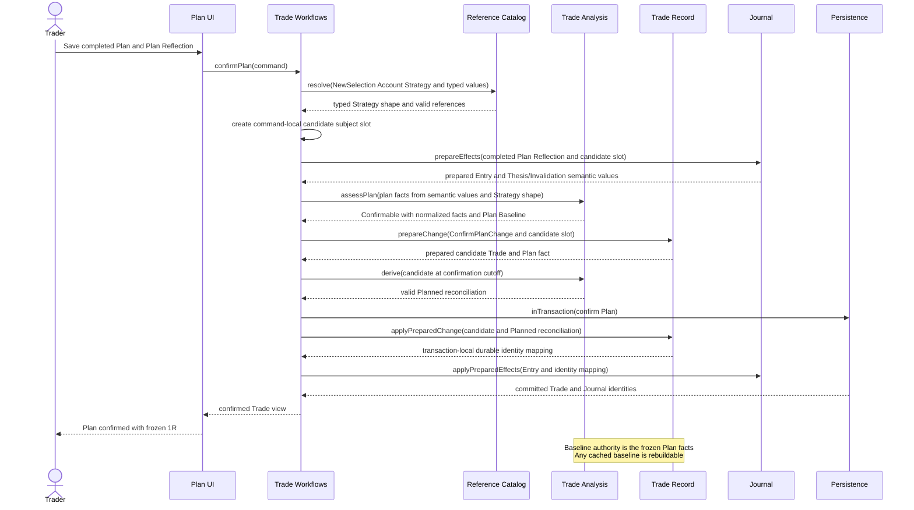
```mermaid
sequenceDiagram
    actor T as Trader
    participant UI as Plan UI
    participant TW as Trade Workflows
    participant RC as Reference Catalog
    participant TA as Trade Analysis
    participant TR as Trade Record
    participant J as Journal
    participant P as Persistence

    T->>UI: Save completed Plan and Plan Reflection
    UI->>TW: confirmPlan(command)
    TW->>RC: resolve(NewSelection Account Strategy and typed values)
    RC-->>TW: typed Strategy shape and valid references
    TW->>TW: create command-local candidate subject slot
    TW->>J: prepareEffects(completed Plan Reflection and candidate slot)
    J-->>TW: prepared Entry and Thesis/Invalidation semantic values
    TW->>TA: assessPlan(plan facts from semantic values and Strategy shape)
    TA-->>TW: Confirmable with normalized facts and Plan Baseline
    TW->>TR: prepareChange(ConfirmPlanChange and candidate slot)
    TR-->>TW: prepared candidate Trade and Plan fact
    TW->>TA: derive(candidate at confirmation cutoff)
    TA-->>TW: valid Planned reconciliation
    TW->>P: inTransaction(confirm Plan)
    TW->>TR: applyPreparedChange(candidate and Planned reconciliation)
    TR-->>TW: transaction-local durable identity mapping
    TW->>J: applyPreparedEffects(Entry and identity mapping)
    P-->>TW: committed Trade and Journal identities
    TW-->>UI: confirmed Trade view
    UI-->>T: Plan confirmed with frozen 1R
    Note over TA,TR: Baseline authority is the frozen Plan facts<br/>Any cached baseline is rebuildable
```

**Audit result:** this exposed no new product decision. It confirmed that `assessPlan` must accept the Strategy shape as explicit data because Trade Analysis cannot query Reference Catalog, and that Plan confirmation must re-run assessment on the exact facts saved rather than trust client-calculated numbers.

#### Sequence: Daily Review assembly and Stop episode detection — owned by Daily Review

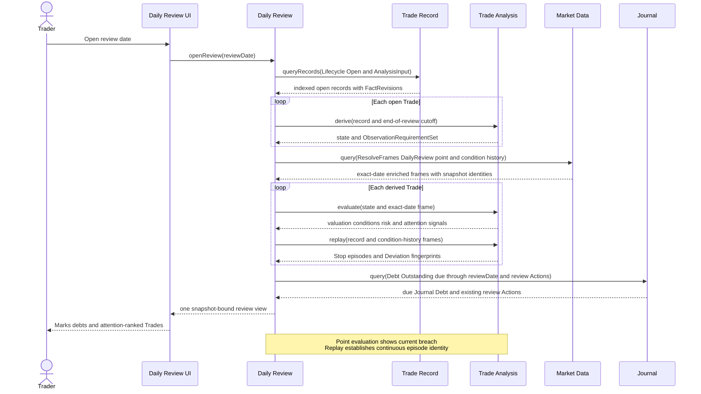
```mermaid
sequenceDiagram
    actor T as Trader
    participant UI as Daily Review UI
    participant DR as Daily Review
    participant TR as Trade Record
    participant TA as Trade Analysis
    participant MD as Market Data
    participant J as Journal

    T->>UI: Open review date
    UI->>DR: openReview(reviewDate)
    DR->>TR: queryRecords(Lifecycle Open and AnalysisInput)
    TR-->>DR: indexed open records with FactRevisions
    loop Each open Trade
        DR->>TA: derive(record and end-of-review cutoff)
        TA-->>DR: state and ObservationRequirementSet
    end
    DR->>MD: query(ResolveFrames DailyReview point and condition history)
    MD-->>DR: exact-date enriched frames with snapshot identities
    loop Each derived Trade
        DR->>TA: evaluate(state and exact-date frame)
        TA-->>DR: valuation conditions risk and attention signals
        DR->>TA: replay(record and condition-history frames)
        TA-->>DR: Stop episodes and Deviation fingerprints
    end
    DR->>J: query(Debt Outstanding due through reviewDate and review Actions)
    J-->>DR: due Journal Debt and existing review Actions
    DR-->>UI: one snapshot-bound review view
    UI-->>T: Marks debts and attention-ranked Trades
    Note over DR,TA: Point evaluation shows current breach<br/>Replay establishes continuous episode identity
```

**Audit findings applied:**

- `derive` must return point-Mark and time-dependent condition-evidence requirements before Market Data is called. A valuation-only interface could not support honest collection or trailing boundaries.
- Point evaluation alone cannot deduplicate continuous Stop Discipline episodes. `replay` therefore returns condition episodes and stable Deviation fingerprints from supplied history.
- Daily Review must return one coherent snapshot-bound view. If a FactRevision changes during assembly, the coordinator re-reads that Trade or returns the internally consistent earlier snapshot; it never combines old Positions with new Marks or vice versa.
- No Trade Analysis batch operation is required. Daily Review may map the pure calls across the indexed records, while cross-Trade arithmetic remains Performance Analysis's responsibility.

#### Sequence: linked Assignment correction that may reopen a Trade — owned by Trade Workflows

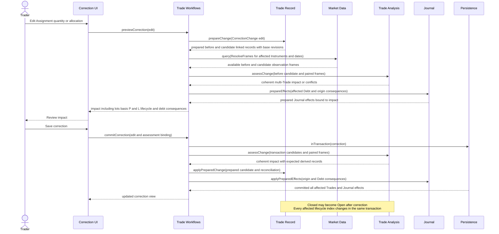
```mermaid
sequenceDiagram
    actor T as Trader
    participant UI as Correction UI
    participant TW as Trade Workflows
    participant TR as Trade Record
    participant MD as Market Data
    participant TA as Trade Analysis
    participant J as Journal
    participant P as Persistence

    T->>UI: Edit Assignment quantity or allocation
    UI->>TW: previewCorrection(edit)
    TW->>TR: prepareChange(CorrectionChange edit)
    TR-->>TW: prepared before and candidate linked records with base revisions
    TW->>MD: query(ResolveFrames for affected Instruments and dates)
    MD-->>TW: available before and candidate observation frames
    TW->>TA: assessChange(before candidate and paired frames)
    TA-->>TW: coherent multi-Trade impact or conflicts
    TW->>J: prepareEffects(affected Debt and origin consequences)
    J-->>TW: prepared Journal effects bound to impact
    TW-->>UI: impact including lots basis P and L lifecycle and debt consequences
    UI-->>T: Review impact
    T->>UI: Save correction
    UI->>TW: commitCorrection(edit and assessment binding)
    TW->>P: inTransaction(correction)
    TW->>TA: assessChange(transaction candidates and paired frames)
    TA-->>TW: coherent impact with expected derived records
    TW->>TR: applyPreparedChange(prepared candidate and reconciliation)
    TW->>J: applyPreparedEffects(origin and Debt consequences)
    P-->>TW: committed all affected Trades and Journal effects
    TW-->>UI: updated correction view
    Note over TR,TA: Closed may become Open after correction<br/>Every affected lifecycle index changes in the same transaction
```

**Audit findings applied:**

- A single-Trade `compare` operation is insufficient. `assessChange` now accepts the exact bounded set of linked before/candidate records and validates allocation/basis coherence across them.
- Preview must carry every base FactRevision. Save rechecks those bindings so a preview cannot authorize a correction against changed facts.
- The later Trade Record drill-down fulfills candidate construction with `prepareChange(CorrectionChange)` and the deep write with `applyPreparedChange`; Trade Workflows never hand-edits raw record objects.
- Market Data fulfills impact evidence through `query(ResolveFrames)` with explicit current or candidate evidence and gaps; no correction-specific storage operation is required.
- `ChangeImpact` must return expected active Lot Matches, Deviation reconciliation, and Lifecycle transitions as well as display deltas. Otherwise the workflow could show a correct preview yet persist an inconsistent derived core.

#### Sequence: corrected historical replay with a Mark gap — owned by Trade Views and Reporting

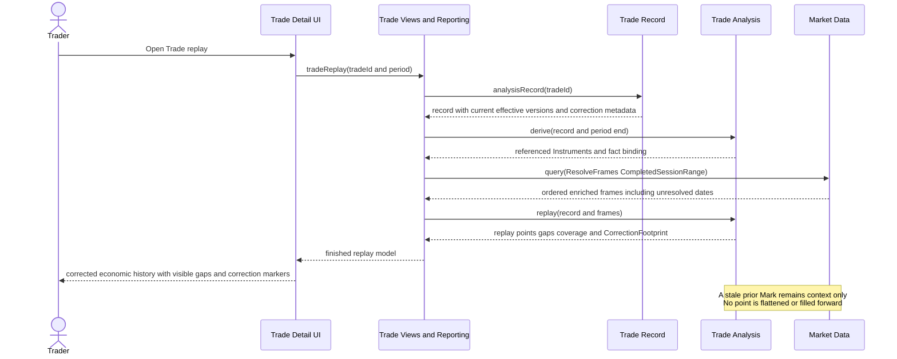
```mermaid
sequenceDiagram
    actor T as Trader
    participant UI as Trade Detail UI
    participant I as Trade Views and Reporting
    participant TR as Trade Record
    participant TA as Trade Analysis
    participant MD as Market Data

    T->>UI: Open Trade replay
    UI->>I: tradeReplay(tradeId and period)
    I->>TR: analysisRecord(tradeId)
    TR-->>I: record with current effective versions and correction metadata
    I->>TA: derive(record and period end)
    TA-->>I: referenced Instruments and fact binding
    I->>MD: query(ResolveFrames CompletedSessionRange)
    MD-->>I: ordered enriched frames including unresolved dates
    I->>TA: replay(record and frames)
    TA-->>I: replay points gaps coverage and CorrectionFootprint
    I-->>UI: finished replay model
    UI-->>T: corrected economic history with visible gaps and correction markers
    Note over TA,MD: A stale prior Mark remains context only<br/>No point is flattened or filled forward
```

**Audit result:** this confirmed that replay must bind both the Trade FactRevision and the Market Data snapshot identities. It also confirmed that Correction Footprint is part of the replay result rather than a separate UI join. No additional Trade Analysis operation was needed.

#### Sequence: Restore integrity and derived-record repair — owned by Workspace

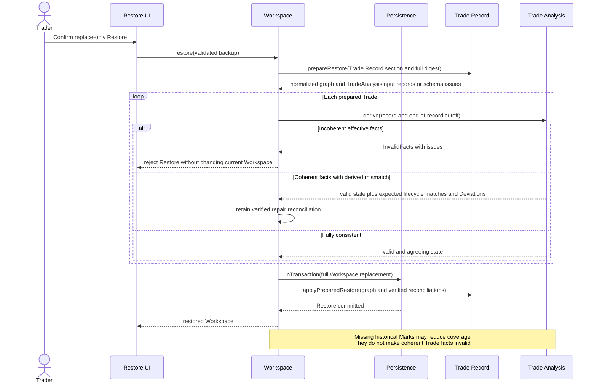
```mermaid
sequenceDiagram
    actor T as Trader
    participant UI as Restore UI
    participant W as Workspace
    participant P as Persistence
    participant TR as Trade Record
    participant TA as Trade Analysis

    T->>UI: Confirm replace-only Restore
    UI->>W: restore(validated backup)
    W->>TR: prepareRestore(Trade Record section and full digest)
    TR-->>W: normalized graph and TradeAnalysisInput records or schema issues
    loop Each prepared Trade
        W->>TA: derive(record and end-of-record cutoff)
        alt Incoherent effective facts
            TA-->>W: InvalidFacts with issues
            W-->>UI: reject Restore without changing current Workspace
        else Coherent facts with derived mismatch
            TA-->>W: valid state plus expected lifecycle matches and Deviations
            W->>W: retain verified repair reconciliation
        else Fully consistent
            TA-->>W: valid and agreeing state
        end
    end
    W->>P: inTransaction(full Workspace replacement)
    W->>TR: applyPreparedRestore(graph and verified reconciliations)
    P-->>W: Restore committed
    W-->>UI: restored Workspace
    Note over W,TA: Missing historical Marks may reduce coverage<br/>They do not make coherent Trade facts invalid
```

**Audit findings applied:**

- `derive` must distinguish incoherent authoritative facts from repairable disagreement in stored Lifecycle State, active Lot Matches, or deterministic Deviations.
- Restore may rebuild the latter before atomic replacement but must reject the former without mutating current data.
- Mark history is not required to validate structural position, matching, or Lifecycle State. Missing Marks affect valuation coverage, not factual coherence.

### Requirements fulfilled and exported

Closed within Trade Analysis:

- One stable six-operation pure interface covers Plan assessment, fact derivation, current evaluation, Expiration Payoff, replay, and correction impact without exposing formula-level helpers.
- `DerivedTradeState` is the single coherent seam between effective-fact replay and every downstream marked or payoff calculation.
- Stored Lifecycle State remains fast and authoritative while independent expected-state derivation supports guarded transitions and recovery.
- Mark selection, stale classification, and provider behavior remain wholly outside the module.
- Current condition triggers, monetary boundaries, risk/reward, payoff, and P&L have non-overlapping responsibilities and explicit results.
- Cross-Trade settlement correction is supported without introducing lineage analytics.

Exported requirements:

- **Trade Record** fulfills this export through its later-defined snapshot-bound `TradeAnalysisInputRecord`, stable `RecordedSequence`, version/effective-selection metadata, indexed lifecycle query, `prepareChange`, and transaction-scoped `applyPreparedChange` operations.
- **Market Data** fulfills this export through its defined `query(ResolveFrames)`: snapshot-bound exact-date `MarkFrame`s, optional Daily Bar evidence, ordered historical frames including explicit gaps, condition-history frames, and current/candidate impact frames. It owns Expected Mark Date and never asks Trade Analysis to select an observation.
- **Trade Workflows** must call `assessPlan` on the exact Plan saved, call `assessChange` for linked corrections, recheck FactRevision bindings inside the transaction, and persist every required fact/Journal/derived-record effect together.
- **Daily Review** must use derive-then-resolve-then-evaluate, use replay evidence for Stop episode reconciliation, combine Journal obligations itself, and return one internally coherent finished view.
- **Trade Views and Reporting** must resolve records and Mark frames, call Trade Analysis, add Journal/reference context, and expose Correction Footprint and coverage without rederiving figures.
- **Performance Analysis** receives `TradePerformanceDatum` plus dimensions, Journal-derived outcomes, current `TradeEvaluation`, and replay-derived condition evidence as required by each operation. It does not receive raw Executions in order to redo FIFO, fee, entry-quality, or condition-episode math.
- **Workspace** must distinguish invalid facts from rebuildable derived mismatches during Restore and integrity recovery.

### Downstream resolutions

- Cross-Trade report populations, coverage folds, filters, grouping, and correction-free sensitivity belong to Performance Analysis; Trade Views and Reporting supplies explicit inputs and presents the returned deterministic reports.
- The future multi-expiration deterministic payoff surface remains an explicitly deferred extension. It adds a new payoff operation or result variant only when specified and never changes authoritative Trade facts.

### Source lineage for this interface

- Claude contributes a pure TradeMath seam, explicit fact/Mark inputs, FIFO position replay, Mark-based reflective replay, derived Deviations, and the principle that the UI receives finished results. Its separate small operations and mixed-expiration intrinsic treatment are not adopted.
- GLM contributes a small headline calculation surface, literal-data testability, explicit bounded/unbounded results, stored Lifecycle ownership outside calculation, universal payoff construction, and all-or-nothing workflow consumers. Its cached closed `FigureSet`, null-as-result vocabulary, and single universal result are not adopted as authoritative contracts.
- Ox Alpha substantially repeats Claude's interface and supplies no independent calculation partition rule.
- The canonical interface adds the approved Position Change/settlement model, persisted-but-verifiable Lot Matches and Lifecycle State, lot-aware fee attribution, frozen Plan Baseline, context-aware exact-date Marks, four-state per-figure results, paired Stop/Target OR semantics, two complete payoff views, Entry Resolution Point, Correction Footprint, bounded linked-change assessment, and explicit separation from Performance Analysis.

## Trade Workflows — initial interface design

This section stages the Candidate C command-side coordinator. It uses typed pseudocode only and makes no implementation-technology choice.

### Charter

**Trade Workflows** is the only ordinary public interface for trader-initiated changes to authoritative Trade facts. It accepts complete user-intent commands, obtains typed reference and Journal-definition context, constructs candidate records through Trade Record, delegates every deterministic calculation to Trade Analysis, and commits all required Trade, stored Lifecycle/index, Lot Match, Deviation, Journal Entry, Journal Debt, and lineage effects through one Persistence transaction. The separately bounded exceptions are Workspace Restore/integrity recovery and Daily Review's reconciliation of deterministic Mark-detected Deviations; neither exposes general Trade mutation to the UI.

It stores no facts, derives no figures, selects no Marks, edits no Journal content after creation, and exposes no raw lifecycle setter. It does not own Daily Trade Review Actions, direct standalone journaling, Mark entry, reference-data maintenance, Workspace Restore, or read-model assembly. A domain rejection leaves every module unchanged.

### Imported requirement ledger

- Confirming a Plan freezes the Plan and atomically writes a completed Plan Reflection. Thesis and Invalidation are entered once and become both authoritative Plan semantics and snapshotted Entry answers.
- Abandonment applies only to a confirmed Plan with no effective real position-changing fact, requires one AbandonmentReason, retires applicable Plan debt, and creates neither Close Reason nor Terminal Disposition.
- One Position Change groups one decision or settlement occurrence, may span Trades, and may contain Executions, Assignment, Exercise, Expiration, or cash settlement.
- A Roll is one Position Change plus a newly confirmed successor Plan, owned Executions, and typed lineage. Untouched predecessor holdings never transfer implicitly.
- Assignment/Exercise allocations are explicit, preserve Settlement Price separately from adjusted basis/proceeds, and may update an existing Stock Trade or create only residual new exposure.
- Every Position Change creates exactly one Position Change Reflection outcome anchored to the originating Trade: completed now, explicitly declined, or deferred as Journal Debt.
- A terminal Position Change requires exactly one Close Reason only when it contains trader agency. Close Review never blocks closure and may be completed, declined, or deferred.
- Management Revision freezes the new effective values/rationale and a completed Management Revision Entry in one flow, resolves Management Debt when management becomes complete, and never changes Plan Baseline.
- Replace, Void, and Rebuild preserve visible history, use Review Impact for material changes, and atomically reconcile every derived consequence. Journal Entries anchored to corrected facts remain attached.
- A settlement correction may affect several linked Trades and may reopen or close them; no inconsistent intermediate history may persist.
- Factual capture cannot be blocked merely because the trader is not ready to reflect, but the required Entry/Debt/decline effect must still be durably paired with the fact.
- Every operation is plain request/response. The UI never sequences lower-level writes to simulate atomicity.

### Module-shape alternatives considered

#### Shape A — one generic command bus

`execute(command: TradeCommand)` would accept a large tagged union covering every mutation.

This minimizes operation count and makes transaction middleware uniform. It also makes unrelated validation paths and results share one ever-growing surface, obscures which commands may create Trades or require Journal content, and encourages a generic command-handler implementation rather than a deep domain interface. Rejected.

#### Shape B — one operation per factual event

Operations such as `recordExecution`, `recordAssignment`, `recordExercise`, `recordExpiration`, `recordRoll`, `setCloseReason`, `recordDeviation`, `replaceExecution`, `voidSettlement`, and `rebuildTrade` would be separate.

This makes individual events discoverable but dismantles the approved Position Change boundary. Multi-leg decisions, mixed terminal mechanisms, cross-Trade settlement, reflection cardinality, and lifecycle transitions would have to be recomposed by callers. It recreates entity-repository orchestration at the command layer. Rejected.

#### Shape C — six complete semantic workflows — adopted

The interface exposes Plan confirmation, Abandonment, Position Change, Management Revision, correction preview, and correction commit. Execution/settlement variants are typed members of one Position Change command; Roll is its cross-Trade specialization. Replace, Void, and Rebuild are typed correction edits sharing one impact-and-commit protocol.

This costs richer command/result types and a two-request path when material correction impact requires review. It preserves the user's domain boundaries, keeps the ordinary correction UI at one Save click when no separate acknowledgment is needed, and gives every atomic invariant one accountable entry point.

### Interface

```text
interface TradeWorkflows
  confirmPlan(command: ConfirmPlanCommand) -> ConfirmPlanResult
  abandonPlan(command: AbandonPlanCommand) -> AbandonPlanResult
  recordPositionChange(command: PositionChangeCommand) -> PositionChangeResult
  reviseManagement(command: ReviseManagementCommand) -> ReviseManagementResult
  previewCorrection(command: PreviewCorrectionCommand) -> CorrectionPreview
  commitCorrection(command: CommitCorrectionCommand) -> CorrectionResult
```

Callers' eyes:

```text
confirmed = tradeWorkflows.confirmPlan(plan plus one completed Plan Reflection)
changed = tradeWorkflows.recordPositionChange(one decision and its reflection disposition)
revised = tradeWorkflows.reviseManagement(new levels plus one captured rationale)
preview = tradeWorkflows.previewCorrection(Replace, Void, or Rebuild edit)
saved = tradeWorkflows.commitCorrection(edit plus exact preview binding)
```

There is deliberately no `closeTrade`, `setLifecycle`, `recordExecution` outside a Position Change, or separate `roll` operation.

### Shared command types

```text
ExpectedRecord = Trade identity plus expected FactRevision

JournalForm =
  fixed Entry Type identity
  exact Entry Definition revision shown to the trader
  answers keyed by stable Prompt identity

ReflectionDisposition =
  Complete(JournalForm)
  Decline(optional reason)
  Defer

MutationIssue =
  stable code, affected command field/fact/reference identities,
  plain explanation, and any required corrective input

MutationReceipt =
  affected Trade identities and new FactRevisions
  created or revised fact identities
  Lifecycle transitions
  created Journal Entry, Journal Debt, decline, and retirement identities
  newly recorded or reconciled Deviation identities
  warnings and a refresh scope for finished read models
```

`JournalForm` identifies the stored form revision the trader actually answered, not an instruction to load the latest prompts during Save. Journal resolves and validates that immutable definition revision, then snapshots its prompts/options with the answers. Client-supplied labels are never authoritative. Workflow-critical semantic roles must still be present. This preserves entered-but-unsaved values when configuration changes elsewhere and avoids silently applying new wording to old answers.

`Complete`, `Decline`, and `Defer` are explicit outcomes even when the UI supplies a default. `Defer` creates Journal Debt with the trigger, originating-fact association, Anchor, due semantics, and prompt snapshot current to the event. No blank placeholder Entry is created.

### Operation contracts

#### 1. `confirmPlan`

```text
ConfirmPlanCommand =
  Account identity
  Strategy identity and proposed PlanFacts
  one completed Plan Reflection JournalForm
  explicit confirmation EconomicTime

ConfirmPlanResult =
  Accepted(Trade identity, Planned Lifecycle State, Plan Baseline,
           Plan Reflection Entry identity, warnings)
  Rejected(MutationIssue list)
```

The workflow resolves active Account, Strategy, and typed-tag references through Reference Catalog, asks Journal to validate/materialize the exact Plan Reflection form, and passes the Strategy shape plus Plan facts to `TradeAnalysis.assessPlan`. Thesis and Invalidation are extracted by stable semantic role from the one submitted form and copied identically into the frozen Plan facts and immutable Entry snapshot; the trader never types them twice.

Only a Confirmable Plan with a `Value` Plan Baseline and positive 1R proceeds. One transaction creates the Trade with stored Lifecycle State Planned, freezes the normalized Plan, and writes the completed Plan Reflection with Source Plan Confirmation and Trade Anchor. Failure at any point creates neither record.

#### 2. `abandonPlan`

```text
AbandonPlanCommand =
  ExpectedRecord
  active AbandonmentReason identity
  abandonment EconomicTime

AbandonPlanResult = Accepted(MutationReceipt) or Rejected(MutationIssue list)
```

Trade Record supplies a candidate carrying the Abandonment fact. Trade Analysis must derive expected state Abandoned and confirm that no effective real Execution or settlement ever established exposure. Voided data-entry-only events do not block eligibility; a real Execution later offset by a real transaction does. The transaction writes the Abandonment fact and Lifecycle/index transition, retains the Plan and completed Journal history, and retires outstanding Plan-related Debt with an explicit reason. It creates no Close Reason, Terminal Disposition, or Close Review.

#### 3. `recordPositionChange`

```text
PositionChangeMember =
  Execution draft with PlannedLegIntent
  Assignment draft with explicit allocation
  Exercise draft with explicit allocation
  Expiration draft
  CashSettlement draft

RollIntent =
  predecessor Trade identity
  successor PlanFacts and completed Plan Reflection JournalForm
  typed Roll lineage

PositionChangeCommand =
  originating Trade identity
  ExpectedRecords for every existing affected Trade
  one decision or settlement occurrence context and EconomicTime
  one or more PositionChangeMembers
  optional RollIntent
  Position Change ReflectionDisposition, defaulting to Defer at the UI
  when terminal agency applies, CloseReason identity
  when terminal, Close Review ReflectionDisposition, defaulting to Defer at the UI

PositionChangeResult =
  Accepted(MutationReceipt plus created Position Change and member identities)
  NeedsInput(required allocation, CloseReason, successor Plan, or Journal fields)
  Rejected(MutationIssue list)
```

The workflow resolves known references, validates a Roll successor through `TradeAnalysis.assessPlan`, and asks Trade Record to construct the complete nonpersistent candidate record set. `TradeAnalysis.derive` evaluates every candidate Trade and supplies expected Positions, FIFO matches, Deviation occurrences, Lifecycle States, Terminal Disposition, terminal-reason requirements, and Management Coverage. Only after those requirements are known does Journal prepare every applicable Reflection Entry, Debt, or decline effect against the exact submitted definition revisions.

`NeedsInput` writes nothing. It is required when the resulting facts reveal an input the caller could not honestly know in advance, such as ambiguous underlying allocation or whether a terminal mixed Position Change requires a Close Reason. When the command is complete, one transaction writes the shared Position Change and every member, creates the Roll successor and its completed Plan Reflection when applicable, writes/reconciles derived records and lifecycle indexes, and records exactly one Position Change Reflection outcome anchored to the originating Trade.

If the change makes a Trade Closed, a Close Reason is required exactly when Trade Analysis reports terminal trader agency. A completed, declined, or deferred Close Review is also recorded without blocking the terminal fact. If Assignment or Exercise creates unmanaged Stock exposure, the same transaction creates Management Debt. If the Position becomes managed or flat, obsolete Management Debt is retired with its factual reason.

For a Roll, untouched holdings remain with the predecessor. The successor receives only its own Plan and new Executions, and one typed lineage link joins the records. The Roll's Position Change Reflection is anchored to the predecessor; the successor's separately required completed Plan Reflection records its newly confirmed intent. No duplicate Position Change Reflection is created.

For Assignment or Exercise, the Position Change Reflection is anchored to the option Trade. Applying shares to an existing Stock Trade or creating a residual linked Stock Trade never creates a second reflection for the same settlement occurrence. Settlement-created Stock exposure carries its explicit settlement-origin Plan facts and Management Debt rather than fabricating a second discretionary Plan-confirmation moment.

#### 4. `reviseManagement`

```text
ReviseManagementCommand =
  ExpectedRecord
  Management Revision effective time
  revised Stop, Target, or structure facts
  one completed Management Revision JournalForm

ReviseManagementResult = Accepted(MutationReceipt) or Rejected(MutationIssue list)
```

Journal validates the form's required Revision Rationale role and conditional Revised Thesis/Revised Invalidation pair. The workflow copies those semantic answers once into the authoritative Management Revision while preserving the entire answer/prompt snapshot in the Entry. Trade Analysis derives the candidate effective management and confirms that every MonetaryBoundary remains evaluable over the remaining Position.

One transaction appends the immutable Management Revision, writes the completed Journal Entry with Source Management Revision and Trade Anchor, and retires Management Debt only when the resulting Management Coverage is complete or the Trade is flat. Original Plan facts and Plan Baseline never change. Editing the Journal Entry later never changes the authoritative Revision.

#### 5. `previewCorrection`

```text
CorrectionEdit =
  ReplaceFact(stable fact identity, corrected fields, correction reason)
  VoidFact(stable fact identity, reason that the recorded event never happened)
  RebuildTrade(complete replacement economic record under the same Trade identity, reason)

PreviewCorrectionCommand =
  CorrectionEdit
  ExpectedRecords initially believed affected

CorrectionPreview =
  Ready(opaque PreviewBinding, ChangeImpact, confirmation requirement,
        additional required user input)
  Rejected(MutationIssue list)

PreviewBinding =
  digest of the exact edit
  base FactRevision for every affected existing Trade
  identities of prospective or Voided linked Trades
  Market Data snapshot identities used for numeric impact
```

Trade Record expands the edit into the exact bounded candidate change set, including linked settlement/lineage effects. Market Data supplies available before/candidate impact frames, and Trade Analysis performs `assessChange`. Preview identifies conflicts, Lifecycle/reason changes, Position and basis changes, regenerated Lot Matches/Deviations, Journal-Debt effects, and Correction Footprint before anything is written.

A price/prose-like correction with no material Position, allocation, P&L, lifecycle, disposition, or analytics consequence may require no separate visual acknowledgment; the UI may immediately invoke `commitCorrection` from the same Save gesture. Quantity, Instrument, Trade allocation, settlement, Void, Rebuild, lifecycle, and similarly material effects require visible impact acknowledgment. This preserves ordinary Edit → Save while enforcing Edit → Review impact → Save where the user already required it.

#### 6. `commitCorrection`

```text
CommitCorrectionCommand =
  exact CorrectionEdit
  PreviewBinding
  every required missing input
  explicit impact acknowledgment when Preview required it

CorrectionResult = Accepted(MutationReceipt plus CorrectionFootprint)
                   or Rejected(MutationIssue list)
```

The workflow rejects a changed edit, stale FactRevision, stale impact Mark snapshot where numeric impact was material, missing requirement, or unacknowledged material impact. Inside one transaction it reconstructs/revalidates the candidate, calls `TradeAnalysis.assessChange`, and commits the correction versions plus all expected Lot Match, Deviation, Lifecycle/index, terminal-reason, lineage/allocation, Management Debt, and Journal-origin consequences.

Replace means the event occurred but recorded details were wrong. Void means the event never occurred. Rebuild makes one complete reconstructed record effective under the same economic Trade identity and retains the superseded version. None creates a second analytics Trade. Stable fact identities preserve Journal Anchors where the fact remains; a Void leaves the identity/history visible and marks completed associated Entries as originating from a Voided fact rather than deleting them.

### Decided interface semantics

1. **Six semantic commands, no generic dispatcher.** Each operation names a complete user intent and returns only outcomes meaningful to that workflow.
2. **Position Change is the write grain.** Executions, Assignment, Exercise, Expiration, and cash settlement cannot be independently committed through this public interface. Multiple fills from one decision remain one Position Change; separate decisions remain separate.
3. **Candidate first, transaction second.** Reference, Journal-form, and pure Trade-analysis validation occurs before mutation. The exact candidate is revalidated against base revisions inside the transaction before any write becomes effective.
4. **One request owns all required effects.** A mutating command either commits every authoritative fact, stored Lifecycle/index transition, active Lot Match, deterministic Deviation reconciliation, Journal Entry/Debt/decline, lineage/allocation, and debt-retirement effect or commits none.
5. **Reflection content is not a prerequisite to factual truth.** Position Change and Close Review obligations accept Defer or explicit Decline. Defer creates real Journal Debt in the same transaction. Plan confirmation and Management Revision instead require their completed Entries because their semantic answers supply authoritative Plan/Revision meaning.
6. **Close is a consequence, not a command.** No trader sets Closed. Trade Analysis derives flatness and terminal agency from the candidate facts; Trade Workflows requires the correct Close Reason/Close Review effects and asks Trade Record to commit the resulting stored state.
7. **Abandonment is explicit and guarded.** The trader selects an AbandonmentReason, but eligibility derives from effective real-world facts. Abandonment is never a substitute for closing exposure or correcting a false record.
8. **Roll is a Position Change specialization.** Its predecessor and successor effects, successor Plan confirmation, lineage, reflections, Lot Matches, and lifecycle changes are atomic. A separate `roll` operation would duplicate the same invariant.
9. **Settlement allocation is explicit.** The workflow may suggest an unambiguous destination in presentation, but the command records the chosen existing Stock Trade and/or residual successor allocation. Trade Workflows never lets Trade Analysis or Trade Record guess allocation from current holdings.
10. **Journal meaning is captured once.** Semantic-role values in Plan and Management Revision forms are submitted once, then written identically to authoritative facts and the immutable Journal snapshot. Later Journal edits cannot feed back into those facts.
11. **Anchor and Source are automatic.** Workflow-created Entries/Debt carry their settled Trade or Execution Anchor, exact originating-fact association, and Source. The trader never selects those metadata to make a command valid.
12. **Correction preview is evidence, not authority.** Only `commitCorrection` mutates. PreviewBinding prevents a reviewed impact from authorizing a different edit or changed base record.
13. **Materiality changes interaction, not correctness.** Every correction uses the same assessed atomic core. Material changes add an explicit impact acknowledgment; non-material corrections may make both requests behind one visible Save.
14. **Rebuild preserves identity and population.** Rebuild supersedes the effective economic record under the same Trade identity. It is not export/import, cloning, or a way to erase Journal history.
15. **No saved workflow session.** Partially completed forms and previews are view state. Only accepted commands, immutable audit versions, Entries, Debt, and explicit declines are durable.
16. **Times come from domain input.** Commands supply economic/effective times. The coordinator has no hidden clock; processing/save times are supplied by the transaction/audit boundary only where provenance requires them and never replace economic time.
17. **Expected domain rejections are typed.** Missing required input, stale revisions, invalid references, incoherent candidate facts, and ineligible transitions return structured Rejected/NeedsInput outcomes with no writes. Infrastructure failure also rolls back but is not misclassified as trader behavior.
18. **Direct module workflows stay direct.** Ordinary Journal Entry creation/editing, Mark management, reference maintenance, Daily Review Actions, and Workspace operations do not pass through Trade Workflows merely to centralize calls.

### Sequence-diagram interface audit

The earlier Plan-confirmation and linked-correction diagrams under Trade Analysis are owned by this module and become part of its eventual canonical file. The additional diagrams below exercise the workflows those two did not cover.

#### Sequence: multi-leg Position Change that closes with trader agency

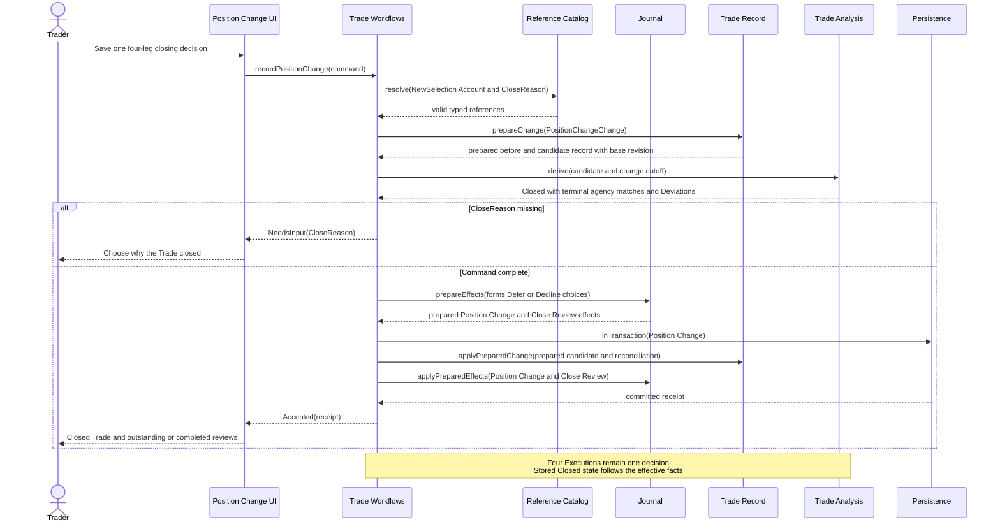
```mermaid
sequenceDiagram
    actor T as Trader
    participant UI as Position Change UI
    participant TW as Trade Workflows
    participant RC as Reference Catalog
    participant J as Journal
    participant TR as Trade Record
    participant TA as Trade Analysis
    participant P as Persistence

    T->>UI: Save one four-leg closing decision
    UI->>TW: recordPositionChange(command)
    TW->>RC: resolve(NewSelection Account and CloseReason)
    RC-->>TW: valid typed references
    TW->>TR: prepareChange(PositionChangeChange)
    TR-->>TW: prepared before and candidate record with base revision
    TW->>TA: derive(candidate and change cutoff)
    TA-->>TW: Closed with terminal agency matches and Deviations
    alt CloseReason missing
        TW-->>UI: NeedsInput(CloseReason)
        UI-->>T: Choose why the Trade closed
    else Command complete
        TW->>J: prepareEffects(forms Defer or Decline choices)
        J-->>TW: prepared Position Change and Close Review effects
        TW->>P: inTransaction(Position Change)
        TW->>TR: applyPreparedChange(prepared candidate and reconciliation)
        TW->>J: applyPreparedEffects(Position Change and Close Review)
        P-->>TW: committed receipt
        TW-->>UI: Accepted(receipt)
        UI-->>T: Closed Trade and outstanding or completed reviews
    end
    Note over TW,TA: Four Executions remain one decision<br/>Stored Closed state follows the effective facts
```

**Audit findings applied:**

- Terminal reason cardinality cannot be trusted from form intent. The complete candidate must be derived before the workflow can accept or reject a CloseReason.
- `recordPositionChange` therefore needs `NeedsInput` as a no-write outcome rather than a separate lifecycle or close operation.
- The later Journal drill-down fulfills this need with `prepareEffects` and `applyPreparedEffects`, fixing prompt snapshots before the transaction and applying them without re-reading a different definition.
- The later Trade Record drill-down fulfills these needs with `prepareChange(PositionChangeChange)` and `applyPreparedChange`, which rechecks every base revision and accepts the complete derived reconciliation without public entity writes.

#### Sequence: partial Roll with successor Plan

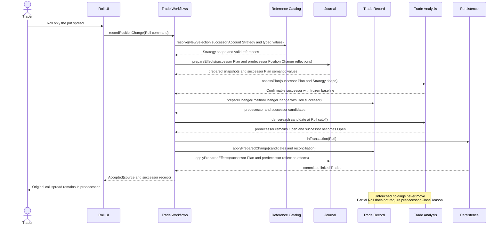
```mermaid
sequenceDiagram
    actor T as Trader
    participant UI as Roll UI
    participant TW as Trade Workflows
    participant RC as Reference Catalog
    participant J as Journal
    participant TR as Trade Record
    participant TA as Trade Analysis
    participant P as Persistence

    T->>UI: Roll only the put spread
    UI->>TW: recordPositionChange(Roll command)
    TW->>RC: resolve(NewSelection successor Account Strategy and typed values)
    RC-->>TW: Strategy shape and valid references
    TW->>J: prepareEffects(successor Plan and predecessor Position Change reflections)
    J-->>TW: prepared snapshots and successor Plan semantic values
    TW->>TA: assessPlan(successor Plan and Strategy shape)
    TA-->>TW: Confirmable successor with frozen baseline
    TW->>TR: prepareChange(PositionChangeChange with Roll successor)
    TR-->>TW: predecessor and successor candidates
    TW->>TA: derive(each candidate at Roll cutoff)
    TA-->>TW: predecessor remains Open and successor becomes Open
    TW->>P: inTransaction(Roll)
    TW->>TR: applyPreparedChange(candidates and reconciliation)
    TW->>J: applyPreparedEffects(successor Plan and predecessor reflection effects)
    P-->>TW: committed linked Trades
    TW-->>UI: Accepted(source and successor receipt)
    UI-->>T: Original call spread remains in predecessor
    Note over TR,TA: Untouched holdings never move<br/>Partial Roll does not require predecessor CloseReason
```

**Audit findings applied:**

- A Roll needs two distinct journal moments: one Position Change Reflection anchored once to the predecessor and one completed Plan Reflection for the successor. Combining them would lose either execution behavior or new-plan intent.
- A partial Roll that leaves predecessor exposure Open cannot accept a Close Reason merely because its mechanism is Roll. `Rolled` becomes required only when the Roll actually closes that predecessor.
- Successor Plan assessment must occur before candidate Trade creation, but all records become durable together.

#### Sequence: Assignment allocated partly to an existing Stock Trade

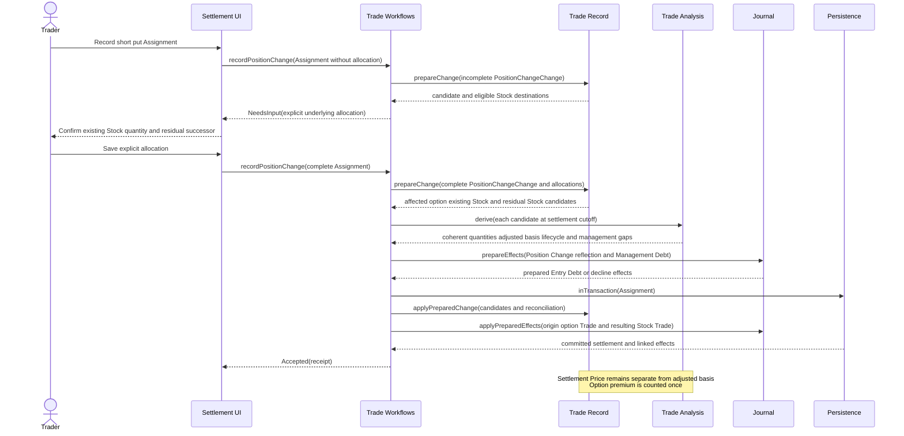
```mermaid
sequenceDiagram
    actor T as Trader
    participant UI as Settlement UI
    participant TW as Trade Workflows
    participant TR as Trade Record
    participant TA as Trade Analysis
    participant J as Journal
    participant P as Persistence

    T->>UI: Record short put Assignment
    UI->>TW: recordPositionChange(Assignment without allocation)
    TW->>TR: prepareChange(incomplete PositionChangeChange)
    TR-->>TW: candidate and eligible Stock destinations
    TW-->>UI: NeedsInput(explicit underlying allocation)
    UI-->>T: Confirm existing Stock quantity and residual successor
    T->>UI: Save explicit allocation
    UI->>TW: recordPositionChange(complete Assignment)
    TW->>TR: prepareChange(complete PositionChangeChange and allocations)
    TR-->>TW: affected option existing Stock and residual Stock candidates
    TW->>TA: derive(each candidate at settlement cutoff)
    TA-->>TW: coherent quantities adjusted basis lifecycle and management gaps
    TW->>J: prepareEffects(Position Change reflection and Management Debt)
    J-->>TW: prepared Entry Debt or decline effects
    TW->>P: inTransaction(Assignment)
    TW->>TR: applyPreparedChange(candidates and reconciliation)
    TW->>J: applyPreparedEffects(origin option Trade and resulting Stock Trade)
    P-->>TW: committed settlement and linked effects
    TW-->>UI: Accepted(receipt)
    Note over TR,TA: Settlement Price remains separate from adjusted basis<br/>Option premium is counted once
```

**Audit findings applied:**

- An unambiguous suggested allocation is presentation only. The durable command still carries explicit allocation, and ambiguity returns `NeedsInput` without writing.
- One Position Change may affect an option Trade, an existing Stock Trade, and a residual new Stock Trade. The transaction and receipt therefore bind a set of records, not a single `tradeId`.
- Settlement-created Stock exposure does not invoke `confirmPlan` recursively or create another Position Change Reflection. Its settlement-origin Plan facts and Management Debt are effects of the same command.

#### Sequence: Management Revision entered once and stored in two meanings

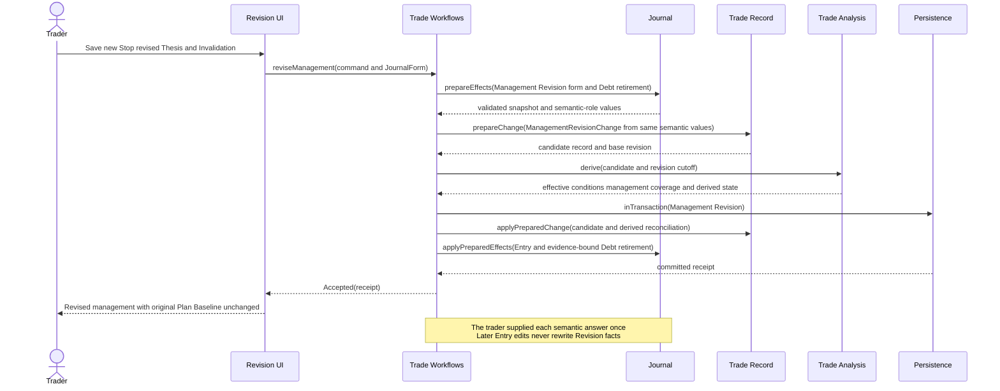
```mermaid
sequenceDiagram
    actor T as Trader
    participant UI as Revision UI
    participant TW as Trade Workflows
    participant J as Journal
    participant TR as Trade Record
    participant TA as Trade Analysis
    participant P as Persistence

    T->>UI: Save new Stop revised Thesis and Invalidation
    UI->>TW: reviseManagement(command and JournalForm)
    TW->>J: prepareEffects(Management Revision form and Debt retirement)
    J-->>TW: validated snapshot and semantic-role values
    TW->>TR: prepareChange(ManagementRevisionChange from same semantic values)
    TR-->>TW: candidate record and base revision
    TW->>TA: derive(candidate and revision cutoff)
    TA-->>TW: effective conditions management coverage and derived state
    TW->>P: inTransaction(Management Revision)
    TW->>TR: applyPreparedChange(candidate and derived reconciliation)
    TW->>J: applyPreparedEffects(Entry and evidence-bound Debt retirement)
    P-->>TW: committed receipt
    TW-->>UI: Accepted(receipt)
    UI-->>T: Revised management with original Plan Baseline unchanged
    Note over TW,J: The trader supplied each semantic answer once<br/>Later Entry edits never rewrite Revision facts
```

**Audit findings applied:**

- Journal's prepared Entry must return typed values by stable semantic role, not require Trade Workflows to inspect prompt labels.
- The Journal snapshot and authoritative Revision intentionally contain the same user-supplied Rationale/Thesis values for different purposes. This is controlled duplication at one atomic boundary, not duplicate data entry.
- Management Debt retirement depends on Trade Analysis's resulting Management Coverage, not merely on the presence of a Revision record.

#### Sequence: Abandonment after false Executions were Voided

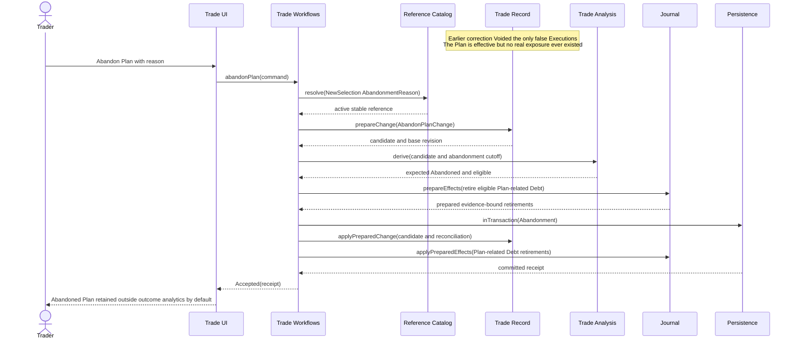
```mermaid
sequenceDiagram
    actor T as Trader
    participant UI as Trade UI
    participant TW as Trade Workflows
    participant RC as Reference Catalog
    participant TR as Trade Record
    participant TA as Trade Analysis
    participant J as Journal
    participant P as Persistence

    Note over TR: Earlier correction Voided the only false Executions<br/>The Plan is effective but no real exposure ever existed
    T->>UI: Abandon Plan with reason
    UI->>TW: abandonPlan(command)
    TW->>RC: resolve(NewSelection AbandonmentReason)
    RC-->>TW: active stable reference
    TW->>TR: prepareChange(AbandonPlanChange)
    TR-->>TW: candidate and base revision
    TW->>TA: derive(candidate and abandonment cutoff)
    TA-->>TW: expected Abandoned and eligible
    TW->>J: prepareEffects(retire eligible Plan-related Debt)
    J-->>TW: prepared evidence-bound retirements
    TW->>P: inTransaction(Abandonment)
    TW->>TR: applyPreparedChange(candidate and reconciliation)
    TW->>J: applyPreparedEffects(Plan-related Debt retirements)
    P-->>TW: committed receipt
    TW-->>UI: Accepted(receipt)
    UI-->>T: Abandoned Plan retained outside outcome analytics by default
```

**Audit result:** no new operation was required. The diagram confirmed that Void restores eligibility but does not itself choose Abandonment, and that Abandonment has no Close Review or Terminal Disposition effects.

### Requirements fulfilled and exported

Closed within Trade Workflows:

- The command surface follows the user's Plan, Position Change, Management Revision, and correction meanings rather than underlying persistence entities.
- Every lifecycle change is caused by a guarded semantic command and written atomically with its effective facts.
- Plan and Management Revision semantic answers are captured once while remaining independently auditable in Journal history.
- Position Change and Close Review reflection choices preserve low-friction factual capture without torn obligations.
- Roll and settlement use the same Position Change boundary while retaining their distinct lineage, allocation, agency, and journaling semantics.
- Replace, Void, and Rebuild share one reviewable correction protocol and never change analytics population identity.

Exported requirements:

- **Trade Record** fulfills this export through the later-defined `prepareChange` and `applyPreparedChange` operations, including snapshot-bound candidate construction, stable multi-Trade revision guards, eligible settlement destinations, candidate identities, and exact derived reconciliation.
- **Journal** fulfills this export through its later-defined `prepareEffects` and `applyPreparedEffects` operations, exact definition snapshots, `SemanticValueSet`, obligation keys, candidate Anchor/origin slots, and Entry/Debt/decline/retirement effects.
- **Reference Catalog** must resolve stable typed references and distinguish active choices from retained historical references without returning free-form labels as identity.
- **Persistence/Transaction** must stage writes across Trade Record and Journal, mint identities inside the transaction, roll back every participant on failure, and make the committed receipt visible only after durability.
- **Daily Review** owns current Stop-episode reconciliation and its Journal effects directly over the same transaction seam; it does not call Trade Workflows as another coordinator.
- **Trade Views and Reporting** re-queries finished views after accepted receipts. Mutation receipts provide identities and consequences, not duplicated Trade Detail calculations.

### Downstream resolutions and remaining artifact work

- Workspace now exports the technology-neutral transaction, snapshot, and recovery-evidence requirements to Persistence; no public database handle enters these interfaces.
- UI contract extraction must show how `NeedsInput`, correction impact, and the one-click non-material Save path appear without prescribing a form container.

### Source lineage for this interface

- GLM contributes dedicated Plan/Fill coordinators, validate-before-write, request/response transactions, lifecycle correction paths, and a clear distinction between fact stores and orchestration. Its separate PlanCommit/FillEntry split, placeholders, cached close snapshots, Discarded state, and UI-coordinated reflection writes are superseded.
- Claude contributes atomic Roll composition, correction-aware Trade history, inline Deviation detection, Plan-first structure, and high-level result bundles. Its derived-only lifecycle, separate Execution operation, multi-call UI atomicity, generic Transfer, and Journal placeholder model are superseded.
- Ox Alpha materially repeats Claude and adds no independent workflow boundary.
- The canonical six-command interface comes from Candidate C plus the user's unified Position Change, completed Plan Reflection, Journal Debt, settlement allocation, agency-based Close Reason, AbandonmentReason, Management Revision, audited correction, and stored Lifecycle decisions.

## Trade Record — initial interface design

This section stages Candidate C's authoritative Trade-fact module. It is specification-only and technology-neutral. The typed pseudocode names domain requests and results, not classes, endpoints, tables, serialization, or an implementation transaction API.

### Charter

**Trade Record** owns the complete factual history of economic Trades and the one stored/indexed derived-state exception: Trade Lifecycle State. It assigns stable Trade and fact identities, preserves immutable versions and Voids, constructs coherent nonpersistent candidates for semantic workflows, commits candidate facts together with Trade Analysis's bound reconciliation, serves snapshot-consistent factual reads, resolves historical Trade and fill-Execution Anchors, and contributes its self-contained section to full-Workspace backup and replace-only Restore.

It does not expose child-entity CRUD, a whole-document save, a lifecycle setter, calculation helpers, Journal content, reference labels, Marks, report metrics, or a public database/query language. It never calculates Position, P&L, risk/reward, payoff, Terminal Disposition, or analytics. Trade Analysis derives those meanings from the factual record. Trade Record persists only the facts and the specifically settled agreement records—stored Lifecycle State, active Lot-Match links, and recorded Deviation occurrences—that semantic workflows must keep synchronized with those derivations.

### Imported requirement ledger

The interface must hide all of the following complexity from its callers:

- A Trade has one stable economic identity and exactly one Account reference; its Institution is derived outside this module from that Account.
- A confirmed Plan and Planned Legs are frozen facts except through visible correction. The Plan's zero-or-one IdeaSource reference and typed Trade tags remain stable identities, not copied labels.
- One decision-level Position Change may contain several fills or settlement members and may affect a bounded set of Trades. Executions remain specific fills with their own stable identities.
- Assignment, Exercise, Expiration, cash settlement, Roll lineage, and allocation are explicit facts. Settlement never masquerades as a zero-price Execution.
- Management Revisions, Close Reason, Abandonment, and their economic/effective times remain factual. Terminal Disposition is derived and is not stored as another field.
- Lifecycle State is stored and indexed for normal queries, may change only with the facts that justify it, and must match Trade Analysis's expected state at every successful commit.
- FIFO Lot Matches retain stable links and allocation policy, not duplicated prices, basis, fees, or P&L. Recorded Deviations retain occurrence identity and evidence but not duplicated analytical figures.
- Facts are append-versioned. Replace, Void, and Rebuild never overwrite or hard-delete history. Corrected analysis uses the effective economic facts at their corrected economic times, while the saved correction trail remains visible.
- Rebuild preserves the economic Trade identity and single analytics population. Historical Journal Anchors to superseded or Voided fills remain resolvable and are never silently remapped.
- A mutating semantic request may write several Trade records and Journal effects. Every base revision and candidate must be bound, rechecked, and committed atomically or nothing changes.
- Open-Trade queries use the authoritative lifecycle index rather than deriving every Trade. At the mature target of roughly 25,000 Trades, 20–200 Open Trades, and roughly 200,000 Executions, one query must return a bounded batch without an N+1 record load.
- Current facts alone are sufficient to calculate cumulative realized P&L per Account or across Accounts. Account Snapshots are neither stored here nor required.
- Backup carries every durable Trade fact, identity, ordering value, version, Void, lineage link, and audit association needed to reproduce the Workspace. It excludes safely rebuildable private indexes and projections.

### Module-shape alternatives considered

#### Shape A — child-entity repositories

Expose separate create/update/list operations for Trade, Plan, Planned Leg, Position Change, Execution, settlement, Management Revision, Deviation, Lot Match, and Lifecycle State.

Rejected because its apparent simplicity moves every real invariant to callers. A Position Change, Assignment, Roll, or correction could become partially visible; a caller could update an Execution without rebuilding matches or lifecycle; and direct child writes would bypass the very atomicity Candidate C exists to protect.

#### Shape B — load and save a whole Trade document

Expose `loadTrade`, let a coordinator edit the returned aggregate, then call `saveTrade(expectedRevision, replacementDocument)`.

Rejected because callers would need to understand effective-version selection, cross-Trade settlement links, identity preservation, ordering, derived-record reconciliation, and legal diffs. A whole-document replacement also makes a one-field correction look like permission to rewrite unrelated history and cannot naturally bind one Position Change spanning several Trades.

#### Shape C — prepared semantic change plus cohesive reads — adopted

Trade Record accepts one typed semantic change, constructs the exact before/candidate record set without writing, and returns an inert preparation bound to every base revision. After Trade Analysis derives the candidate and the owning coordinator prepares other module effects, one deep commit operation rechecks and atomically applies the facts plus the exact derived reconciliation. Focused read, history, Anchor, and backup/Restore operations complete the interface.

This shape costs richer preparation types, but it centralizes identity, versioning, correction, linkage, and indexed-lifecycle rules without absorbing workflow-specific Journal or reference behavior. It supports all six Trade Workflows operations and the two deliberately narrow non-workflow mutations—Daily Review's deterministic Deviation reconciliation and Workspace Restore/integrity recovery—without exposing raw storage.

### Interface

```text
interface TradeRecord
  prepareChange(change: TradeRecordChange) -> PrepareTradeChangeResult
  applyPreparedChange(command: ApplyPreparedTradeChange) -> TradeRecordApplyResult
  getRecord(request: GetTradeRecord) -> GetTradeRecordResult
  queryRecords(query: TradeRecordQuery) -> TradeRecordPage
  history(request: TradeHistoryRequest) -> TradeHistoryResult
  resolveAnchors(request: ResolveTradeAnchors) -> TradeAnchorResolutionSet
  exportSnapshot(request: TradeRecordExportRequest) -> TradeRecordBackupSection
  prepareRestore(request: PrepareTradeRecordRestore) -> PrepareTradeRecordRestoreResult
  applyPreparedRestore(command: ApplyPreparedTradeRecordRestore) -> TradeRecordRestoreResult
```

Callers' eyes:

```text
prepared = tradeRecord.prepareChange(one complete semantic fact change)
staged = tradeRecord.applyPreparedChange(prepared plus bound derivations)
open = tradeRecord.queryRecords(Lifecycle Open plus AnalysisInput projection)
record = tradeRecord.getRecord(Trade identity plus required detail)
audit = tradeRecord.history(Trade or fact identity)
anchors = tradeRecord.resolveAnchors(Trade and fill-Execution identities)
backupSection = tradeRecord.exportSnapshot(one Workspace export snapshot)
restore = tradeRecord.prepareRestore(one migrated Trade Record section)
applied = tradeRecord.applyPreparedRestore(restore plus verified derivations)
```

There is deliberately no `saveTrade`, `updateExecution`, `deleteFact`, `setLifecycle`, `closeTrade`, `recordPnl`, `importOneTrade`, or caller-supplied query expression.

### Identity, order, and version types

```text
TradeId = stable identity of one economic Trade
TradeFactId = stable identity of one Plan, Position Change, Execution,
              settlement, Management Revision, Abandonment, Close Reason,
              lineage edge, Lot Match, or Deviation occurrence
FactVersionId = identity of one immutable version within a TradeFactId chain
FactRevision = opaque identity of one atomically committed Trade-record snapshot

CandidateTradeRef = preparation-local reference to a not-yet-durable Trade
CandidateFactRef = preparation-local reference to a not-yet-durable fact
PreparedSubjectRef = Existing(TradeId or TradeFactId)
                     or Candidate(CandidateTradeRef or CandidateFactRef)

FactOrder = EconomicTime plus RecordedSequence
RecordedSequence = stable tie-break assigned by Trade Record

FactVersion<T> =
  TradeFactId
  FactVersionId
  Value(T) or Void
  FactOrder when the fact has economic order
  saved-at audit time and change origin
  optional correction reason
  predecessor FactVersionId when replaced or Voided

FactVersionChain<T> = one stable TradeFactId plus every FactVersion<T>

StoredLifecycle =
  Planned | Open | Closed | Abandoned
  binding to the exact effective-fact digest that justified the state
  FactRevision at which the bound state became authoritative
  causing fact or correction identity
```

A `TradeFactId` identifies the real-world fact across correction. Replacing the details of the same fill appends a version under the same Execution identity. A Void appends an explicit Void version; it does not delete the identity. A newly reconstructed event in Rebuild receives a new fact identity, while the superseded historical identity remains addressable. `RecordedSequence` stays with an existing fact identity even if a correction changes its EconomicTime; a new reconstructed fact receives a new sequence in the explicitly supplied reconstruction order.

Candidate references are inert names, not prematurely allocated durable identities and not saved workflow sessions. Journal may prepare an Entry or Debt against a candidate fill Anchor by carrying the same `CandidateFactRef`. Only `applyPreparedChange`, inside the shared transaction, maps candidate references to durable identities and returns that mapping. Failure leaves no reserved or partially visible records.

`FactRevision` binds the complete Trade-record view used by analysis. It is distinct from `FactVersionId`: one multi-Trade Position Change can append several fact versions and yield a new FactRevision for every affected Trade in one atomic commit.

### Factual record and projection types

```text
TradeRecordSnapshot =
  TradeId and FactRevision
  one Account identity
  typed Trade-tag identities
  StoredLifecycle
  versioned confirmed Plan and Planned Legs when present
  relevant Position Changes and their typed members
  specific fill Executions and explicit settlement facts
  Management Revisions and effective Stop/Target conditions
  Abandonment and Close Reason facts when present
  Roll and settlement lineage/allocation links
  active recorded Lot-Match links
  recorded Deviation occurrences and their evidence bindings
  correction/Version headers needed by Trade Analysis

TradeAnalysisInputRecord =
  exact effective factual projection of TradeRecordSnapshot
  required version/effective-selection metadata
  FactRevision, StoredLifecycle, and effective-through boundary

TradeAuditRecord =
  TradeRecordSnapshot including full version-chain values and Void history

TradeSummary =
  TradeId, FactRevision, Account, Strategy, Underlying set,
  Plan IdeaSource, Trade tags, StoredLifecycle,
  Plan-confirmation, first/last Position Change, and lifecycle-transition times,
  count summaries, and integrity binding

TradeRecordDetail = Summary | AnalysisInput | FullAudit
```

`AnalysisInput` returns the complete batchable input required by `TradeAnalysis.derive`; it is not a cached calculation result. `Summary` contains factual/indexed fields only. `FullAudit` exists for history and correction experiences, not as the default list projection. Labels for Accounts, Strategies, tags, instruments, and reasons come from Reference Catalog or instrument presentation, never from duplicated authoritative labels in Trade Record.

A Position Change that affects several Trades has one stable Position Change identity and one origin Trade, with explicit participation links to every affected record. Trade snapshots project the relevant portion of that shared fact rather than duplicating independently editable copies. Every fill Execution still has one stable identity and belongs to its exact Position Change member.

### Change and reconciliation types

```text
TradeRecordChange =
  ConfirmPlanChange(
    Account, Strategy, typed Trade tags, confirmed Plan facts,
    confirmation EconomicTime)
  AbandonPlanChange(
    expected Trade record, AbandonmentReason, abandonment EconomicTime)
  PositionChangeChange(
    origin and expected affected records, typed Position Change members,
    explicit settlement allocations, optional Roll successor Plan and lineage,
    optional terminal CloseReason facts)
  ManagementRevisionChange(
    expected Trade record, revised conditions, rationale/thesis facts,
    revision EconomicTime)
  CorrectionChange(
    ReplaceFact or VoidFact or RebuildTrade, correction reason)
  ReconcileDetectedDeviationsChange(
    exact existing Trade revisions, analysis/evidence binding,
    expected occurrence fingerprints)

PrepareTradeChangeResult =
  Prepared(PreparedTradeChange)
  NeedsResolution(RecordResolutionRequest list)
  Rejected(TradeRecordIssue list)

RecordResolutionRequest =
  stable reason and affected subject
  missing factual choice
  bounded eligible choices with stable identities when applicable

PreparedTradeChange =
  canonical TradeRecordChange
  every existing TradeId plus base FactRevision
  every before TradeAnalysisInputRecord
  every candidate TradeAnalysisInputRecord keyed by PreparedSubjectRef
  candidate Trade/fact reference set
  exact version actions, affected links, and change scope
  canonical preparation digest

DerivedTradeReconciliation =
  preparation digest and candidate-analysis binding
  expected Lifecycle State for every candidate Trade
  exact active FIFO Lot-Match links or no-change proof
  Deviation occurrence create, retain, supersede, or Void actions
  terminal-reason cardinality and management-coverage evidence
  ValidFacts proof or structured InvalidFacts result

ApplyPreparedTradeChange =
  PreparedTradeChange
  one DerivedTradeReconciliation covering the complete candidate set

TradeRecordApplyEffects =
  Candidate reference to durable identity mapping
  affected TradeIds and new FactRevisions
  appended FactVersionIds and effective/Voided identities
  Lifecycle transitions and index effects
  active Lot-Match and recorded Deviation reconciliation effects
  refresh scope for read coordinators

TradeRecordApplyResult =
  AppliedToTransaction(TradeRecordApplyEffects)
  Conflict(current FactRevision by changed Trade)
  Rejected(TradeRecordIssue list)
```

`DerivedTradeReconciliation` carries no P&L, risk, payoff, Terminal Disposition, or other duplicated display calculation. Its terminal-reason and management-coverage evidence lets Trade Record reject a candidate whose factual Close Reason or coverage-sensitive effects contradict the exact analysis; Journal remains the owner of the resulting Entry or Debt.

The `ReconcileDetectedDeviationsChange` variant is not a general Deviation setter. It is accepted only for existing records and must be bound to the exact Trade revisions, Market Data evidence bindings where observations were used, `TradeAnalysis.replay` occurrence fingerprints, and complete create/retain/supersede decisions. It cannot change economic facts or Lifecycle State. This is the narrow path Daily Review uses when a Mark-detected Stop-Discipline episode creates or reconciles a durable occurrence without a new Trade fact. Target episodes remain derived attention evidence and never become Deviations merely because a Target was reached.

### Operation contracts

#### 1. `prepareChange`

`prepareChange` performs no durable write. It validates the structural shape of the requested facts, resolves current version chains and cross-Trade links, checks every supplied expected revision, identifies the complete bounded record set, and constructs the canonical candidate projections that Trade Analysis must assess.

For a Plan it creates candidate Trade/fact references but no durable identity. For a Position Change it keeps all submitted fills in one decision, expands explicit Roll or settlement participation, and refuses to guess an allocation. When an Assignment or Exercise could feed several eligible Stock Trades, it returns `NeedsResolution` with those stable destination identities and writes nothing. For Management Revision and Abandonment it produces one bounded candidate. For correction it expands every directly affected allocation or lineage record and makes Replace, Void, or same-identity Rebuild history explicit.

The operation is intentionally fact-focused. It may detect that an allocation or reconstruction choice is absent, but it does not decide whether Journal forms are complete or calculate whether a resulting Closed Trade needs a Close Reason. The owning coordinator supplies the candidates to Trade Analysis, gathers those semantic requirements, and resubmits a complete change when needed.

#### 2. `applyPreparedChange`

`applyPreparedChange` may be invoked only within the shared semantic transaction owned by Trade Workflows or the narrowly authorized Daily Review/Workspace path. Transaction propagation remains an implementation choice and no database handle appears in the domain interface. Its successful result means Trade Record's effects are staged in that transaction; only the coordinator may report a committed mutation after every participant succeeds durably.

Before staging any write, Trade Record rechecks every base FactRevision, reconstructs the canonical candidate from the submitted change, verifies its preparation digest, and requires one valid Trade Analysis reconciliation bound to that exact candidate set. It then appends all fact versions, maps candidate identities, records the expected active Lot Matches and Deviation actions, writes every expected Stored Lifecycle State, and updates all lifecycle/linkage/query indexes as one participant in the larger transaction. Any stale record, incomplete candidate set, invalid fact result, mismatched lifecycle, missing reason, unsupported derived-record action, or binding mismatch rejects the entire operation.

This operation never accepts a caller-selected lifecycle value independent of analysis. The caller supplies facts; Trade Analysis supplies expected state; Trade Record verifies the agreement and stores it. A Closed-to-Open correction changes the effective fact history, stored state, and both lifecycle index memberships together. If a later Journal participant fails, the shared transaction rolls back these staged effects as well.

#### 3. `getRecord`

```text
GetTradeRecord = TradeId plus TradeRecordDetail

GetTradeRecordResult =
  Found(Summary or TradeAnalysisInputRecord or TradeAuditRecord)
  NotFound(TradeId)
  IntegrityFailure(stable issue details and affected identities)
```

The result is internally snapshot-consistent and always carries its FactRevision. An `AnalysisInput` result contains one complete effective factual projection; callers never combine child reads from different revisions. `FullAudit` includes original, replacement, superseded, and Void values, but does not offer an as-of-save-time analytical view. Normal analysis uses the corrected effective economic history, while history presentation shows when and why it changed.

#### 4. `queryRecords`

```text
LifecycleFilter =
  CurrentState(Lifecycle State set)
  or StateAtEconomicCutoff(Lifecycle State set, completed-session cutoff)

TradeRecordQuery =
  optional LifecycleFilter
  optional TradeId set
  optional Account identity set
  optional Strategy identity set
  optional Underlying identity set
  optional exact referenced Instrument identity set
  optional Plan IdeaSource value set
  optional typed Trade-tag value set
  projection: Summary or AnalysisInput
  fixed sort: PlanTimeDescending | LastActivityDescending | TerminalTimeDescending
  bounded page size and optional opaque cursor

TradeRecordPage =
  query-snapshot identity
  ordered Summary or AnalysisInput records
  optional next cursor
```

Different nonempty dimensions combine with AND; selected values within one dimension combine with OR; an empty dimension imposes no restriction. There is no arbitrary Boolean builder and no general date-range language. `CurrentState` serves current lists from the stored authoritative lifecycle index. `StateAtEconomicCutoff` is the one exact-date lifecycle query needed for historical Daily Review eligibility: it evaluates the corrected effective facts at one completed-session cutoff through an indexed lifecycle interval projection maintained with those facts. It is not a saved Review membership snapshot, and it cannot be used to request an arbitrary date range. A later correction may therefore restate which Trades were Open at an earlier cutoff.

Metric periods, lifecycle-eligible populations, Option Disposition Timing, Entry/Exit Scaling, and final grouping semantics belong to Performance Analysis. Trade Views and Reporting assembles the required inputs. For an Institution filter, that coordinator resolves its Accounts through Reference Catalog and supplies Account identities here. The exact Instrument dimension selects records whose effective economic facts reference any supplied contract or stock identity; Trade Views and Reporting may then use Trade Analysis at a specific date to determine actual exposure. It exists so a shared option-Mark correction can find a bounded candidate population without scanning every Trade or conflating an exact contract with its Underlying.

Current lifecycle filtering reads the stored authoritative index before record materialization. Historical cutoff filtering reads its correction-aware interval projection and may reverify the selected effective records before returning them; it never substitutes today's lifecycle membership for membership at the requested cutoff. The `AnalysisInput` projection returns a complete bounded batch in the same query snapshot so an Open list or Daily Review does not issue one load per Trade. Pagination and the fixed sort produce a stable continuation; a cursor cannot be reused with a changed query. Private indexes for Account, Strategy, Underlying, exact Instrument, tags, IdeaSource, holdings, and historical lifecycle intervals may accelerate the operation, but all except the current authoritative lifecycle membership are rebuildable and cannot alter results. Current lifecycle state and every affected projection are maintained atomically with the facts that justify them.

#### 5. `history`

```text
TradeHistoryRequest = TradeId or TradeFactId

TradeHistoryResult =
  Found(
    owning and participating Trade identities,
    ordered FactRevision headers,
    complete requested FactVersion chains,
    effective/Voided status and correction reasons,
    cross-Trade Position Change and lineage associations)
  NotFound(requested identity)
```

The operation supports ordinary **View history** without reconstructing a second Trade or requiring Void/recreate. It returns durable factual provenance only. Correction Footprint, replayed Positions, and before/after P&L are derived by Trade Analysis and Trade Views and Reporting from these versions plus explicit Marks.

#### 6. `resolveAnchors`

```text
ResolveTradeAnchors = set of TradeAnchor(TradeId) or ExecutionAnchor(ExecutionId)

TradeAnchorResolution =
  Resolved(
    exact anchor identity,
    anchor kind Trade or fill Execution,
    owning TradeId,
    Effective | Superseded | Voided status,
    current Trade FactRevision)
  Unknown(anchor identity)

TradeAnchorResolutionSet = one result per requested anchor
```

This is the only narrow Trade Record read Journal needs for Anchor validation. An Execution Anchor always means one specific fill, not a Position Change, leg, or abstract Position. A Replace of the same real fill preserves the Execution identity. A Void or Rebuild never makes an old valid Anchor unknown: the resolution reports its historical status and owning Trade, allowing Journal to label the Entry honestly. The module never changes a Journal Anchor or silently points it at a reconstructed fill.

Standalone Entries need no lookup. Workflow-created Entries that refer to not-yet-durable facts use candidate Anchor references during preparation and receive the durable mapping inside the same transaction; `resolveAnchors` is for already committed identities.

#### 7. `exportSnapshot`

```text
TradeRecordExportRequest = opaque Workspace export-snapshot binding

TradeRecordBackupSection =
  supported Trade Record schema version
  section digest and Workspace export-snapshot binding
  every stable identity and RecordedSequence
  every fact value/version/Void and correction reason
  stored Lifecycle records
  recorded Lot-Match and Deviation histories
  Position Change participation, Roll, settlement, and allocation lineage
```

The export is internally consistent with the Workspace-level read snapshot supplied through the hidden Persistence seam. It contains no provider secret and excludes private search/index/projection structures that can be rebuilt. The section is not a supported ad hoc reporting format and cannot be restored independently as a merge.

#### 8. `prepareRestore`

```text
PrepareTradeRecordRestore =
  migrated TradeRecordBackupSection
  exact full-Workspace backup digest and restore version

PrepareTradeRecordRestoreResult =
  Prepared(PreparedTradeRecordRestore)
  Rejected(RestoreIssue list)

PreparedTradeRecordRestore =
  exact section and full-backup digest binding
  normalized complete Trade fact/version graph
  every TradeAnalysisInputRecord requiring derivation
  external Account, Strategy, taxonomy, and reason references to validate
  imported-versus-expected derived-record comparison inputs
```

Preparation writes nothing. It validates schema support, identity uniqueness, version-chain continuity, effective selection, RecordedSequence uniqueness, Position Change membership, quantities, settlement allocation structure, lineage integrity, and internal Anchor identity reachability. It returns exact records for Trade Analysis rather than trusting imported lifecycle or cached figures. Cross-module reference existence and full-backup consistency are coordinated by Workspace.

Incoherent authoritative facts make Restore invalid. Coherent facts whose imported Lifecycle, active Lot Matches, deterministic Deviations, or private projections disagree with derivation are repairable before replacement. Missing historical Marks reduce what can be reverified and never authorize deletion of a recorded evidence-backed Deviation; every retained occurrence keeps its source fact/Mark identities and coverage is explicit.

#### 9. `applyPreparedRestore`

```text
ApplyPreparedTradeRecordRestore =
  PreparedTradeRecordRestore
  valid derived reconciliation for every restored Trade
  successful cross-module reference-validation binding
  exact Workspace replacement authorization and backup digest

TradeRecordRestoreResult =
  Applied(Trade count, fact/version counts, rebuilt index counts)
  Conflict(current Workspace replacement binding)
  Rejected(RestoreIssue list)
```

The operation is callable only as one participant in Workspace's full replace-only Restore transaction. It rechecks every preparation, analysis, reference, authorization, and backup binding; preserves imported stable identities and visible audit history; substitutes verified expected lifecycle/match/deviation agreement records where repair is permitted; rebuilds private indexes; and stages the complete replacement Trade Record. It offers no per-Trade import, merge, append, or selective overwrite. Current Workspace data remains untouched unless every module's prepared section commits durably.

### Decided interface semantics

1. **One preparation protocol, not raw CRUD.** All ordinary fact mutation is expressed as a typed `TradeRecordChange`; no caller can independently save a child entity or lifecycle field.
2. **Preparation is nonpersistent view state.** A prepared candidate carries values and bindings but creates no record, reserves no durable identity, and can be discarded without cleanup.
3. **Stable fact identity is distinct from immutable versions.** Replace preserves identity for the same event; Void preserves an addressable historical identity; a genuinely reconstructed event receives a new identity.
4. **Economic order is explicit.** Corrected effective facts order by EconomicTime and stable RecordedSequence. Collection order, correction save time, and storage row order never decide FIFO.
5. **Multi-Trade changes are first class.** One Position Change may bind an option Trade, an existing Stock Trade, and a new successor without duplicating or partially committing the shared fact.
6. **Lifecycle is authoritative but never freely set.** Queries trust the stored/indexed state. Commits and Restore require exact agreement with Trade Analysis and change the facts, state, and index atomically.
7. **Recorded derivations are narrow.** Lot Matches store links/policy, Deviations store occurrences/evidence, and Lifecycle stores the agreed state. Calculated dollars, R multiples, Position quantities, payoff, and Terminal Disposition are never copied into authority.
8. **Analysis bindings prevent torn meaning.** A derived reconciliation applies only to the exact prepared candidate digest and complete base-revision set from which it was calculated.
9. **Expected conflicts are typed and write nothing.** Stale revisions, unknown facts, incomplete allocations, incoherent histories, and restore incompatibilities are domain results rather than partial success.
10. **Historical Anchors survive correction.** Trade and specific fill-Execution identities remain resolvable when superseded or Voided; Rebuild never rewrites Journal history or creates a second economic Trade.
11. **Queries are bounded and factual.** The module supports fixed filters and projections needed to select candidates efficiently. It does not own report periods, metric populations, derived grouping, labels, or a general query language.
12. **Snapshot consistency is visible.** Every analysis input carries its FactRevision, every page carries a query snapshot/cursor, and callers never infer that independently loaded children belong together.
13. **Private acceleration is replaceable.** All indexes and summaries except authoritative Lifecycle State can be discarded and reconstructed from facts without changing results.
14. **Restore is whole-Workspace replacement only.** Trade Record validates and applies its owned section, but Workspace owns migration, confirmation, safety export, cross-module validation, and atomic replacement.
15. **No Account Snapshot is needed.** Account identity on each Trade plus execution/settlement facts supports per-Account and cross-Account cumulative P&L through downstream analysis.
16. **No hidden clock or labels.** Economic times are facts, save times come from the audit/transaction boundary, and reference display labels remain outside Trade Record.

### Sequence-diagram interface audit

The following diagrams stress the interface at its concurrency, identity, query-scale, derived-record, and Restore boundaries. Diagrams centered on an owning coordinator will ultimately live with that coordinator; they are staged here because this audit is testing the Trade Record calls within those flows.

#### Sequence: indexed Open-Trade read at mature scale

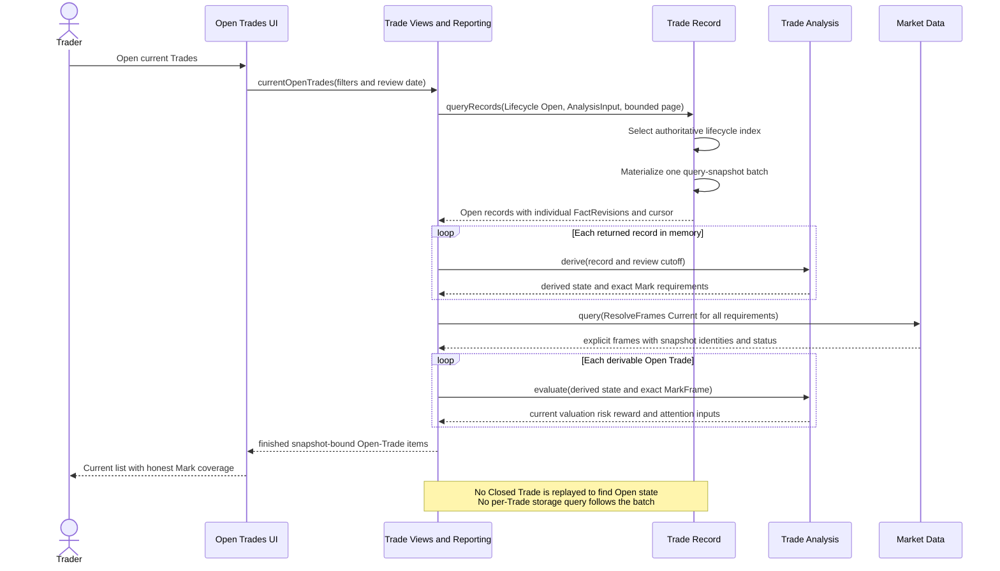
```mermaid
sequenceDiagram
    actor T as Trader
    participant UI as Open Trades UI
    participant I as Trade Views and Reporting
    participant TR as Trade Record
    participant TA as Trade Analysis
    participant MD as Market Data

    T->>UI: Open current Trades
    UI->>I: currentOpenTrades(filters and review date)
    I->>TR: queryRecords(Lifecycle Open, AnalysisInput, bounded page)
    TR->>TR: Select authoritative lifecycle index
    TR->>TR: Materialize one query-snapshot batch
    TR-->>I: Open records with individual FactRevisions and cursor
    loop Each returned record in memory
        I->>TA: derive(record and review cutoff)
        TA-->>I: derived state and exact Mark requirements
    end
    I->>MD: query(ResolveFrames Current for all requirements)
    MD-->>I: explicit frames with snapshot identities and status
    loop Each derivable Open Trade
        I->>TA: evaluate(derived state and exact MarkFrame)
        TA-->>I: current valuation risk reward and attention inputs
    end
    I-->>UI: finished snapshot-bound Open-Trade items
    UI-->>T: Current list with honest Mark coverage
    Note over TR,I: No Closed Trade is replayed to find Open state<br/>No per-Trade storage query follows the batch
```

**Audit findings applied:**

- `queryRecords` needs a real `AnalysisInput` batch projection, not only IDs followed by `getRecord` calls. This prevents an N+1 read path for the normal 20–200 Open-Trade set.
- Lifecycle selection occurs before record materialization and uses the stored authoritative index; Trade Analysis verifies individual records when the finished view is built but is not the list-selection mechanism.
- A page carries one query-snapshot identity while each record retains its own FactRevision. Trade Views and Reporting can refresh a changed Trade without pretending the Market Data snapshot and Trade facts were committed together.
- Observation requirements come from `derive`, so Trade Record does not broaden into instrument-price lookup and Trade Views and Reporting does not guess which contracts or history windows must be supplied.

#### Sequence: terminal Position Change staged with Journal effects

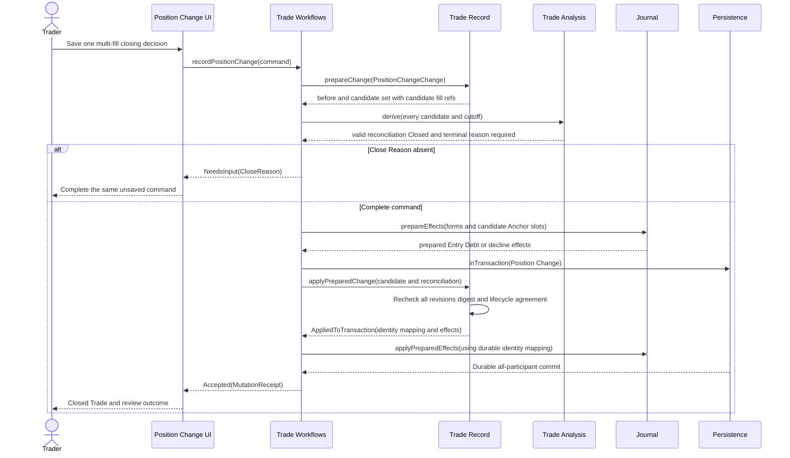
```mermaid
sequenceDiagram
    actor T as Trader
    participant UI as Position Change UI
    participant TW as Trade Workflows
    participant TR as Trade Record
    participant TA as Trade Analysis
    participant J as Journal
    participant P as Persistence

    T->>UI: Save one multi-fill closing decision
    UI->>TW: recordPositionChange(command)
    TW->>TR: prepareChange(PositionChangeChange)
    TR-->>TW: before and candidate set with candidate fill refs
    TW->>TA: derive(every candidate and cutoff)
    TA-->>TW: valid reconciliation Closed and terminal reason required
    alt Close Reason absent
        TW-->>UI: NeedsInput(CloseReason)
        UI-->>T: Complete the same unsaved command
    else Complete command
        TW->>J: prepareEffects(forms and candidate Anchor slots)
        J-->>TW: prepared Entry Debt or decline effects
        TW->>P: inTransaction(Position Change)
        TW->>TR: applyPreparedChange(candidate and reconciliation)
        TR->>TR: Recheck all revisions digest and lifecycle agreement
        TR-->>TW: AppliedToTransaction(identity mapping and effects)
        TW->>J: applyPreparedEffects(using durable identity mapping)
        P-->>TW: Durable all-participant commit
        TW-->>UI: Accepted(MutationReceipt)
        UI-->>T: Closed Trade and review outcome
    end
```

**Audit findings applied:**

- The Trade Record operation is `applyPreparedChange`, not `commitPreparedChange`: its result is staged until Journal and every other participant succeed. Only Trade Workflows returns a post-durability committed receipt.
- New Trade, Position Change, and Execution identities cannot be allocated durably during preparation. Candidate references let Journal validate exact future Anchors, then the transaction-local mapping resolves them without an orphan window.
- Analysis must cover the complete candidate set and preparation digest. A reconciliation for one Trade cannot authorize a shared Position Change that also mutates another.
- `NeedsInput` remains outside the transaction and leaves no prepared object or reserved identity that needs cleanup.

#### Sequence: stale linked correction conflicts as one unit

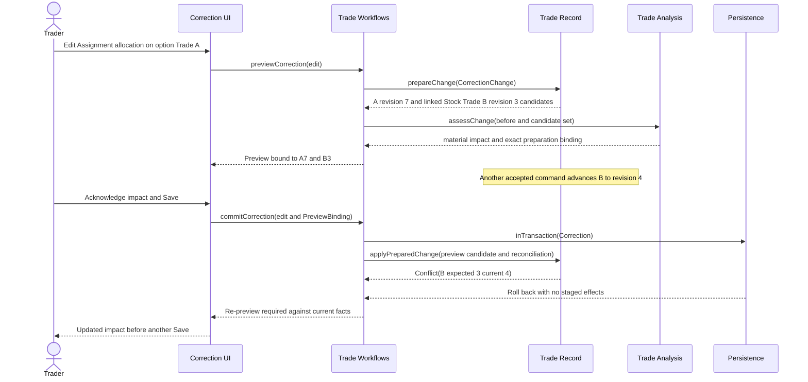
```mermaid
sequenceDiagram
    actor T as Trader
    participant UI as Correction UI
    participant TW as Trade Workflows
    participant TR as Trade Record
    participant TA as Trade Analysis
    participant P as Persistence

    T->>UI: Edit Assignment allocation on option Trade A
    UI->>TW: previewCorrection(edit)
    TW->>TR: prepareChange(CorrectionChange)
    TR-->>TW: A revision 7 and linked Stock Trade B revision 3 candidates
    TW->>TA: assessChange(before and candidate set)
    TA-->>TW: material impact and exact preparation binding
    TW-->>UI: Preview bound to A7 and B3
    Note over TR: Another accepted command advances B to revision 4
    T->>UI: Acknowledge impact and Save
    UI->>TW: commitCorrection(edit and PreviewBinding)
    TW->>P: inTransaction(Correction)
    TW->>TR: applyPreparedChange(preview candidate and reconciliation)
    TR-->>TW: Conflict(B expected 3 current 4)
    P-->>TW: Roll back with no staged effects
    TW-->>UI: Re-preview required against current facts
    UI-->>T: Updated impact before another Save
```

**Audit findings applied:**

- A base binding covers every affected existing Trade, not merely the directly edited fact. Cross-Trade settlement and Roll links cannot be protected by one `tradeId` revision.
- A query-snapshot identity is not an optimistic-concurrency token. Mutation uses the exact per-Trade FactRevisions carried by `PreparedTradeChange`.
- The store reports the complete conflict set it can observe before returning, so the trader is not forced through avoidable one-record-at-a-time retries.

#### Sequence: Rebuild preserves historical Execution Anchors

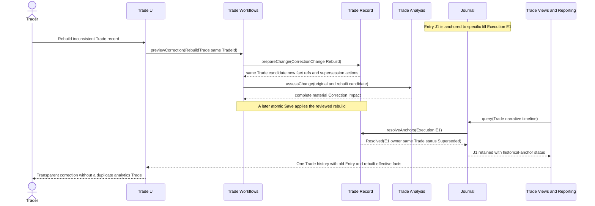
```mermaid
sequenceDiagram
    actor T as Trader
    participant UI as Trade UI
    participant TW as Trade Workflows
    participant TR as Trade Record
    participant TA as Trade Analysis
    participant J as Journal
    participant I as Trade Views and Reporting

    Note over J: Entry J1 is anchored to specific fill Execution E1
    T->>UI: Rebuild inconsistent Trade record
    UI->>TW: previewCorrection(RebuildTrade same TradeId)
    TW->>TR: prepareChange(CorrectionChange Rebuild)
    TR-->>TW: same Trade candidate new fact refs and supersession actions
    TW->>TA: assessChange(original and rebuilt candidate)
    TA-->>TW: complete material Correction Impact
    Note over TW,TR: A later atomic Save applies the reviewed rebuild
    I->>J: query(Trade narrative timeline)
    J->>TR: resolveAnchors(Execution E1)
    TR-->>J: Resolved(E1 owner same Trade status Superseded)
    J-->>I: J1 retained with historical-anchor status
    I-->>UI: One Trade history with old Entry and rebuilt effective facts
    UI-->>T: Transparent correction without a duplicate analytics Trade
```

**Audit findings applied:**

- Rebuild retains the same `TradeId` but does not pretend reconstructed fills are the same real-world events. New effective fills receive new identities; old fill identities remain in version/history indexes as Superseded unless an explicit Void established that they never occurred.
- `resolveAnchors` must distinguish Effective, Superseded, Voided, and truly Unknown. Returning only existence would hide important context; returning Unknown for superseded facts would orphan truthful Journal history.
- Trade Record never rewrites Journal. Trade Views and Reporting joins the immutable Entry with current Anchor resolution and correction history for honest presentation.

#### Sequence: Daily Review reconciles a Mark-detected Deviation

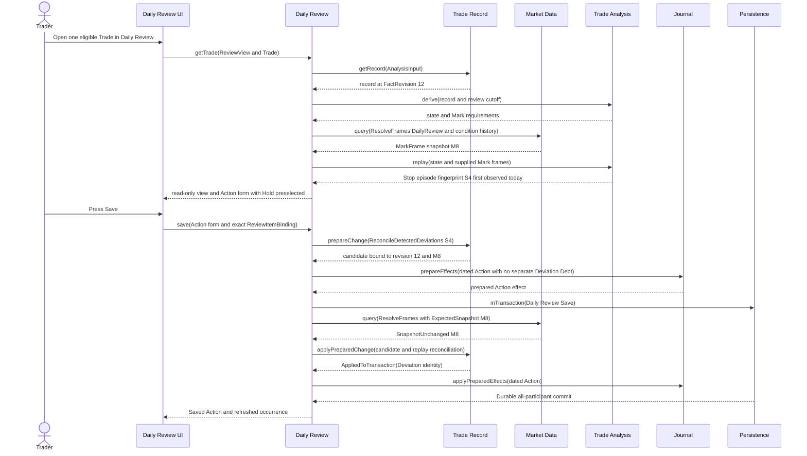
```mermaid
sequenceDiagram
    actor T as Trader
    participant UI as Daily Review UI
    participant DR as Daily Review
    participant TR as Trade Record
    participant MD as Market Data
    participant TA as Trade Analysis
    participant J as Journal
    participant P as Persistence

    T->>UI: Open one eligible Trade in Daily Review
    UI->>DR: getTrade(ReviewView and Trade)
    DR->>TR: getRecord(AnalysisInput)
    TR-->>DR: record at FactRevision 12
    DR->>TA: derive(record and review cutoff)
    TA-->>DR: state and Mark requirements
    DR->>MD: query(ResolveFrames DailyReview and condition history)
    MD-->>DR: MarkFrame snapshot M8
    DR->>TA: replay(state and supplied Mark frames)
    TA-->>DR: Stop episode fingerprint S4 first observed today
    DR-->>UI: read-only view and Action form with Hold preselected
    T->>UI: Press Save
    UI->>DR: save(Action form and exact ReviewItemBinding)
    DR->>TR: prepareChange(ReconcileDetectedDeviations S4)
    TR-->>DR: candidate bound to revision 12 and M8
    DR->>J: prepareEffects(dated Action with no separate Deviation Debt)
    J-->>DR: prepared Action effect
    DR->>P: inTransaction(Daily Review Save)
    DR->>MD: query(ResolveFrames with ExpectedSnapshot M8)
    MD-->>DR: SnapshotUnchanged M8
    DR->>TR: applyPreparedChange(candidate and replay reconciliation)
    TR-->>DR: AppliedToTransaction(Deviation identity)
    DR->>J: applyPreparedEffects(dated Action)
    P-->>DR: Durable all-participant commit
    DR-->>UI: Saved Action and refreshed occurrence
```

**Audit findings applied:**

- Trade Record binds Mark-derived evidence but does not validate Market Data by reading it. Daily Review rechecks the exact observation snapshot through `MarketData.query(ResolveFrames with ExpectedSnapshot)` inside the same transaction; a changed precedence result causes a no-write retry.
- The reconciliation variant can append or reconcile Deviation occurrence versions only. It cannot change Executions, management facts, lifecycle, or arbitrary Deviation content.
- Stable Trade Analysis episode fingerprints make repeated Review loads idempotent. The store returns create/retain/supersede actions rather than allowing duplicate append calls.
- A deviation-only write advances the Trade's FactRevision but does not change the effective-economic-fact digest to which its unchanged Lifecycle State is bound.
- Loading the Trade remains read-only. The trader's explicit Action Save is the persistence boundary, and the required dated Action is the behavioral capture for that review; deterministic Deviation reconciliation does not invent an additional explanation Entry or Journal Debt.

#### Sequence: full-Workspace Restore validates before replacement

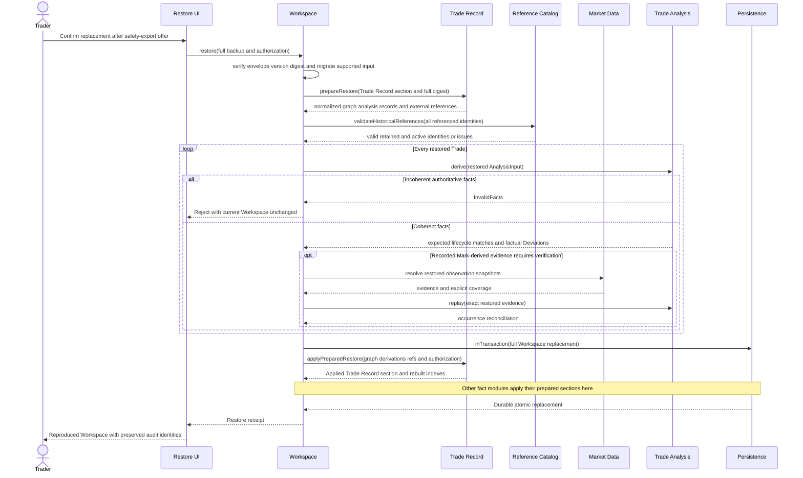
```mermaid
sequenceDiagram
    actor T as Trader
    participant UI as Restore UI
    participant W as Workspace
    participant TR as Trade Record
    participant RC as Reference Catalog
    participant MD as Market Data
    participant TA as Trade Analysis
    participant P as Persistence

    T->>UI: Confirm replacement after safety-export offer
    UI->>W: restore(full backup and authorization)
    W->>W: verify envelope version digest and migrate supported input
    W->>TR: prepareRestore(Trade Record section and full digest)
    TR-->>W: normalized graph analysis records and external references
    W->>RC: validateHistoricalReferences(all referenced identities)
    RC-->>W: valid retained and active identities or issues
    loop Every restored Trade
        W->>TA: derive(restored AnalysisInput)
        alt Incoherent authoritative facts
            TA-->>W: InvalidFacts
            W-->>UI: Reject with current Workspace unchanged
        else Coherent facts
            TA-->>W: expected lifecycle matches and factual Deviations
            opt Recorded Mark-derived evidence requires verification
                W->>MD: resolve restored observation snapshots
                MD-->>W: evidence and explicit coverage
                W->>TA: replay(exact restored evidence)
                TA-->>W: occurrence reconciliation
            end
        end
    end
    W->>P: inTransaction(full Workspace replacement)
    W->>TR: applyPreparedRestore(graph derivations refs and authorization)
    TR-->>W: Applied Trade Record section and rebuilt indexes
    Note over W,P: Other fact modules apply their prepared sections here
    P-->>W: Durable atomic replacement
    W-->>UI: Restore receipt
    UI-->>T: Reproduced Workspace with preserved audit identities
```

**Audit findings applied:**

- `prepareRestore` must expose both analysis-ready records and external-reference identities. Trade Record cannot validate Account, Strategy, taxonomy, or reason existence without creating a forbidden dependency on Reference Catalog.
- Restore cannot be implemented by calling live commands once per historical fact. That would change identities, ordering, definition history, and atomic replacement semantics.
- Valid facts plus a mismatched imported lifecycle/index/match record are repairable; incoherent economic facts reject the entire Restore. Missing Mark coverage cannot be mistaken for incoherent trading history.
- `applyPreparedRestore` requires the full-backup digest and Workspace replacement authorization, preventing a validated Trade section from being combined with different Journal, Market Data, or Reference sections.

### Requirements fulfilled and exported

Closed within Trade Record:

- One nine-operation interface now hides candidate construction, cross-Trade identity/version rules, correction history, stored/indexed Lifecycle State, bounded factual queries, historical Anchor resolution, and the Trade-owned portion of backup/Restore.
- All six Trade Workflows commands use one preparation/apply protocol rather than operation-specific repositories or raw aggregate saves.
- Specific fill-Execution Anchors survive Replace, Void, and Rebuild without silent remapping or loss of Journal history.
- Open-Trade selection is indexed, batchable, snapshot-bound, and independent of all-history lifecycle recomputation.
- Account-linked facts preserve per-Account and cross-Account cumulative P&L capability without Account Snapshots.
- Restore preserves stable identities and history, rederives agreement records, and remains full-Workspace replace-only.

Exported requirements:

- **Trade Workflows** supplies one complete typed `TradeRecordChange`, sends every returned candidate to Trade Analysis, carries `CandidateFactRef` into prepared Journal effects, and reports success only after the shared transaction is durable.
- **Trade Analysis** accepts preparation-local subject references as identities within a candidate set and returns one reconciliation bound to the preparation digest and every candidate. It remains unaware of storage or durable-ID allocation.
- **Journal** fulfills this export through command-local candidate Anchor/origin slots, `applyPreparedEffects` with the transaction-local durable mapping, and Trade-narrative queries joined to batch `resolveAnchors` results.
- **Daily Review** rechecks the exact Market Data observation snapshot before applying Mark-detected Deviation reconciliation and commits the corresponding Journal effect in the same transaction.
- **Trade Views and Reporting** uses `queryRecords` and `getRecord` for snapshot-bound facts, `history` for audit inputs, and `resolveAnchors` indirectly through Journal. It performs labels and derived grouping outside Trade Record.
- **Reference Catalog** supports batch validation of retained historical identities during Restore and resolution of Institution to Account filters without a reverse dependency from Trade Record.
- **Workspace** owns the full backup envelope, migration, safety export, replacement confirmation, cross-section digest, validation orchestration, and final atomic replacement.
- **Persistence/Transaction** supplies consistent read snapshots, query cursors, transaction-local candidate identity mapping, all-participant rollback, durable receipts, and rebuilding of private indexes without exposing these mechanisms publicly.

### Downstream resolutions

- Market Data fulfills observation-snapshot identity and transaction-time validation through request-relative `MarketDataSnapshotId` and `query(ResolveFrames with ExpectedSnapshot)`.
- Reference Catalog defines active-versus-historical reference validation and batch resolution without returning labels as authority.
- Workspace exports technology-neutral shared transaction and read-snapshot requirements to the internal Persistence seam; no public database handle enters these contracts.
- Trade Views and Reporting owns final list/detail/history models and may choose paging presentation without changing Trade Record's fixed query semantics.

### Source lineage for this interface

- Claude contributes a cohesive TradeBook that stores facts rather than arithmetic, correction history that retains Execution Anchors, high-level query/roll operations, and a hidden storage binding. Its derived lifecycle, direct fill/correction/transfer writes, bundled account/taxonomy ownership, and lack of full cross-module atomicity are superseded.
- GLM contributes whole-Trade factual ownership, stable fill identity, authoritative stored/indexed Lifecycle State, a cheap Open query, guarded transitions, explicit import validation, and no raw status setter. Its separate fill operations, cached final figures, Discarded state, per-Trade verbatim import, and coordinator-managed status repair are superseded.
- Ox Alpha materially repeats Claude's TradeBook shape and adds no independent Trade Record boundary.
- The prepared-change protocol, candidate identity mapping, multi-Trade revision binding, historical Anchor statuses, deviation-only reconciliation restriction, and full-Workspace prepared Restore are canonical synthesis required by Candidate C and the user's settled Position Change, correction, journaling, lifecycle, Account Snapshot, and Restore decisions.

## Journal — initial interface design

This section stages Candidate C's authoritative Journal fact/configuration module. It uses technology-neutral typed pseudocode and distinguishes a user-visible Save from the prepare/apply protocol required when Journal effects participate in a larger semantic transaction.

### Charter

**Journal** owns saved trader writing and the durable obligations to produce it. It owns immutable Journal Entry versions, effective Edit/Void history, Addenda, exactly one Anchor per Entry, automatic Source and originating-fact associations, the seven fixed Entry Type identities, versioned runtime Entry Definitions, self-contained prompt/option snapshots, Journal Debt, explicit declines, valid retirement, and the Journal-owned portion of backup/Restore.

It does not own Trade lifecycle, Position Changes, Marks, reference taxonomies, analytics formulas, workflow sessions, drafts, keystrokes, or unsaved form state. It may validate a committed Trade/fill Anchor through Trade Record and a Tag Select through Reference Catalog, but never mutates either module. An Entry can describe an intended trading action; saving it never performs that action.

### Imported requirement ledger

The interface must hide all of the following complexity:

- Every saved Entry has exactly one `Standalone`, `Trade`, or specific fill-`Execution` Anchor. Trade means the complete Trade; Plan, Position Change, Management Revision, Deviation, Daily Review, and Addendum are not Anchor variants.
- Every Entry records one automatic Source. The initial stable vocabulary is Plan Confirmation, Position Change, Management Revision, Trade Close, Daily Review, Trade Detail, and Journal.
- Workflow-created Entries, Debts, and declines retain their exact originating Plan, Position Change, Management Revision, or Deviation association without turning that association into another Anchor.
- One cross-Trade Position Change Reflection is anchored to the originating Trade. Typed lineage may expose it from a successor; Journal never duplicates it.
- A completed Entry is never overwritten. Ordinary Edit appends an immutable version under the same Entry identity; Addendum creates a new Entry with the parent's Anchor; Void remains visible with a required reason.
- Only saved versions are captured. Unsaved edits, abandoned drafts, field-focus events, and keystrokes do not exist as Journal data.
- Each Entry version snapshots by value the exact Prompt wording, answer-option identities and labels, validation meaning, selected typed-tag identity/label, and answers applicable to it.
- Entry Type identities are fixed to the seven settled types. The trader may add, reorder, revise, or retire future Prompts and Options, but may not create, delete, or repurpose Entry Types.
- Workflow-critical semantic roles and cross-field rules remain valid through configuration. Plan Thesis/Invalidation, Management Revision Rationale and thesis pair, and Daily Review Action/Intent cannot silently disappear or change meaning.
- Tag Select binds one Prompt to exactly one Reference Catalog Tag Type. At most one IdeaSource-bound Prompt may exist in an Entry Definition, so each Entry carries zero or one IdeaSource while separate Entries may carry different values.
- Journal Debt is an obligation record, not a blank or mutable Entry. It snapshots the prompts at creation, retains trigger/Anchor/origin/due information, and does not change when the current Entry Definition later changes.
- Settling Debt by answering atomically creates an Entry and retires the Debt. Explicit decline is durable and analytically distinct. Valid retirement records why the obligation ceased without fabricating an Entry.
- Journal Debt never blocks factual capture. Due Debt blocks Daily Review completion until answered, explicitly declined, or validly retired.
- Plan confirmation and Management Revision require completed forms because their semantic answers also supply authoritative Trade facts. Position Change and Close Review allow Complete, Defer, or Decline. Daily Trade Review Save requires a completed dated Entry.
- A Daily Trade Review opens with Hold selected, but selection writes nothing. The sole Save creates or edits the one dated Action Entry; unchanged Hold with blank Intent is valid, while Exit, Roll, or Adjust requires Intent.
- A settled Debt records the actual Source from which it was answered. Journal Debt itself, Addendum, and Edit/Void are not Source values.
- Direct voluntary Review Note and Trader Reflection creation is Journal-only. Workflow-created Entries/Debts/declines must apply atomically with the facts that caused them.
- Historical Entries anchored to a corrected, superseded, or Voided Execution remain attached to that stable identity and surface its current historical status.

### Module-shape alternatives considered

#### Shape A — one operation per record transition

Expose separate calls for create Entry, edit Entry, add Addendum, Void Entry, create Debt, settle Debt, decline Debt, retire Debt, list Entries, list Debt, save Prompt, save Option, reorder Prompts, and retrieve each definition revision.

Rejected because the interface would mirror stored nouns and leave callers to assemble obligation uniqueness, exact snapshots, debt settlement, semantic roles, and cross-module atomicity. Fine-grained Prompt operations could also publish an invalid half-edited definition between calls.

#### Shape B — make Debt an incomplete Journal Entry

Use one Entry state machine such as Pending → Complete/Void and derive “what is owed” by filtering incomplete Entries. This is the main source-design alternative.

Rejected because the user explicitly separated Journal Debt from Journal Entry. A Debt contains no authored reflection and may end by decline or valid retirement, while an Entry is saved trader writing. Treating both as one entity would fabricate blank Entries, blur authored versus owed analytics, and make a retired obligation look like Voided writing.

#### Shape C — one Journal validation kernel with direct and transactional paths — adopted

Expose one direct `save` operation for Journal-only user Saves, and one `prepareEffects` / `applyPreparedEffects` pair for effects that must join a Trade Workflows or Daily Review transaction. Both paths use exactly the same form, definition-snapshot, Anchor, tag, history, Debt, and obligation rules. One cohesive query spans Entries, Debt, and declines; Entry Definition, backup, and Restore operations complete the interface.

This costs an explicit distinction between direct and prepared mutation, but that distinction reflects real semantics: a voluntary note has no other atomic participant, while a Position Change Reflection must never tear from its originating fact. It avoids both a generic cross-domain command bus and a long list of shallow Journal repositories.

### Interface

```text
interface Journal
  save(command: JournalSaveCommand) -> JournalSaveResult
  prepareEffects(request: JournalEffectRequest) -> PrepareJournalEffectsResult
  applyPreparedEffects(command: ApplyPreparedJournalEffects) -> JournalApplyResult
  query(query: JournalQuery) -> JournalPage
  getDefinitions(request: GetEntryDefinitions) -> EntryDefinitionSet
  reviseDefinition(command: ReviseEntryDefinition) -> ReviseEntryDefinitionResult
  seedDefaults(command: SeedJournalDefaults) -> SeedJournalDefaultsResult
  exportSnapshot(request: JournalExportRequest) -> JournalBackupSection
  prepareRestore(request: PrepareJournalRestore) -> PrepareJournalRestoreResult
  applyPreparedRestore(command: ApplyPreparedJournalRestore) -> JournalRestoreResult
```

Callers' eyes:

```text
saved = journal.save(one explicit Journal-only Save)
prepared = journal.prepareEffects(required workflow outcomes)
staged = journal.applyPreparedEffects(prepared plus durable candidate mappings)
timeline = journal.query(Entries Debt and declines for a scope)
forms = journal.getDefinitions(latest fixed Entry Types or exact revisions)
revised = journal.reviseDefinition(one complete future form definition)
seeded = journal.seedDefaults(the supported Workspace Journal manifest)
backupSection = journal.exportSnapshot(one Workspace export snapshot)
restore = journal.prepareRestore(one migrated Journal section)
applied = journal.applyPreparedRestore(restore plus cross-module validation)
```

There is deliberately no `saveDraft`, `recordKeystroke`, `createPlaceholder`, `updateEntryInPlace`, `deleteEntry`, `setDebtStatus`, `addPrompt`, `movePrompt`, `setSource`, one-record import, or general schema/query language.

### Identity and fixed vocabulary

```text
JournalEntryId = stable identity across Edit and Void versions
JournalEntryVersionId = identity of one immutable saved Entry version
EntryRevision = optimistic revision of one JournalEntryId chain
JournalDebtId = stable identity of one deferred obligation
DebtRevision = optimistic revision of one JournalDebtId history
JournalDeclineId = stable identity of one explicit declined obligation
EntryTypeId = one of the seven fixed seeded identities
EntryDefinitionRevisionId = identity of one immutable form definition
PromptId = stable semantic identity of one Prompt within an Entry Type
OptionId = stable semantic identity of one option within a Prompt
JournalSourceId = stable identity of one product writing path
JournalObligationKey = stable uniqueness key for one required reflection moment
CandidateAnchorSlot = command-local correlation identity that is never durable
CandidateJournalRef = preparation-local identity for a future Entry Debt or decline
```

The fixed `EntryTypeId` set is:

```text
PlanReflection
PositionChangeReflection
ManagementRevision
CloseReview
DailyTradeReview
ReviewNote
TraderReflection
```

The initial `JournalSourceId` set is:

```text
PlanConfirmation
PositionChange
ManagementRevision
TradeClose
DailyReview
TradeDetail
Journal
```

Entry Type identity is not its current label or Prompt list. Source identity is not a trader-selected answer. A later product writing path may add a new Source identity, but neither a label change nor Debt settlement invents a new Source. Every saved Entry snapshots the historical Source label used for its presentation.

### Entry Definition and answer types

```text
EntryDefinition =
  fixed EntryTypeId and product label
  EntryDefinitionRevisionId
  ordered active PromptDefinition list
  bounded DefinitionRule list
  saved-at audit time

PromptDefinition =
  PromptId
  wording and optional help text
  PromptKind
  Optional or Required
  optional workflow SemanticRole

PromptKind =
  Text
  SingleSelect(ordered OptionDefinition list)
  Scale(minimum, maximum, endpoint labels)
  Number(optional bounded constraints)
  Date
  TagSelect(exact TagTypeId, cardinality exactly zero-or-one)

OptionDefinition =
  OptionId, label, and optional workflow option role

DefinitionRule =
  RequireWhenOption(selected PromptId and OptionId set, required PromptId)
  AllOrNone(PromptId set)

EntryDefinitionSnapshot =
  EntryTypeId, historical type label, and EntryDefinitionRevisionId
  every presented Prompt in order with exact wording, kind, rules, and SemanticRole
  every presented option with exact OptionId, label, and option role
  Tag Type identity and historical label for every TagSelect

JournalForm =
  exact EntryDefinitionRevisionId shown to the trader
  responses keyed by PromptId

PromptResponse =
  Unanswered
  TextValue | SelectedOption(OptionId and historical label)
  ScaleValue | NumberValue | DateValue
  SelectedTagValue(TagTypeId, TagValueId, and historical value label)

SemanticValueSet = validated workflow-critical values keyed by SemanticRole
```

`Unanswered` on an optional Prompt is explicit snapshot state, not an implicit decline. Requiredness and conditional rules are evaluated against the exact definition revision shown. Client-supplied Prompt wording or labels are never authoritative; Journal resolves the retained revision, validates stable identities, and creates the by-value snapshot itself.

The only general conditional rules are the two shapes already required by the settled defaults: an answer selected in one Prompt may require another, and a small Prompt set may be all blank or all answered. The interface does not expose an arbitrary expression language. Daily Review Action therefore requires Intent for the stable Exit/Roll/Adjust options and for future active options classified as change intent, while the stable Hold role retains the blank-Intent fast path. Management Revision's revised-Thesis and revised-Invalidation Prompts remain an all-or-none pair.

Workflow-critical Prompt and option roles are stable identities, not labels. A definition revision may reword them but cannot remove, duplicate, repurpose, or make them incompatible with their workflow. A semantically different custom option receives a new `OptionId`; rename preserves identity. The required Hold option cannot be retired while the one-click Daily Review contract is supported.

A Tag Select stores exactly one Tag Type binding in the definition. Journal asks Reference Catalog to validate a new selection and snapshots the selected identity and historical label. An unchanged retired historical value remains renderable and editable in its original Entry; it is not offered as a different new selection. Definition validation forbids more than one IdeaSource-bound Prompt in the same Entry Type.

### Entry, Addendum, Edit, and Void types

```text
JournalAnchor =
  Standalone
  TradeAnchor(TradeId)
  ExecutionAnchor(ExecutionId)

PreparedJournalAnchor =
  committed JournalAnchor
  or CandidateAnchorSlot(command-local semantic subject reference)

JournalSourceSnapshot = JournalSourceId plus historical label

JournalOrigin =
  PlanOrigin(Plan fact identity)
  PositionChangeOrigin(Position Change fact identity)
  ManagementRevisionOrigin(Management Revision fact identity)
  DeviationOrigin(Deviation occurrence identity)
  DailyReviewOrigin(Trade identity and ReviewDate)

PreparedJournalOrigin = committed JournalOrigin or candidate-fact equivalent

JournalEntryValue =
  EntryDefinitionSnapshot and complete PromptResponse set
  exactly one JournalAnchor
  JournalSourceSnapshot
  optional JournalOrigin
  moment time the Entry is about
  first-authored audit time
  optional parent JournalEntryId for Addendum
  optional settled JournalDebtId

JournalEntryVersion =
  JournalEntryId, JournalEntryVersionId, and EntryRevision
  Effective(JournalEntryValue) or Void(required reason)
  version saved-at audit time
  predecessor version and changed-field summary

JournalEntryRecord = one JournalEntryId plus its complete immutable version chain
```

An Edit appends an `Effective` version under the same Entry identity. It uses the Entry's original `EntryDefinitionSnapshot`; it does not migrate the Entry onto today's Prompts. Responses and, for a directly authored Entry, a mistaken Anchor or moment time may be corrected. Entry Type, original definition snapshot, Source, originating-fact association, first-authored time, Debt settlement identity, and Addendum parentage cannot be rewritten. A workflow-created Anchor likewise cannot be reassigned by Journal Edit.

An Addendum is a new Entry. It must copy the parent's preserved Anchor, even when the parent is now Voided, records the parent relationship separately, uses the exact current definition the trader actually completes, and records the actual new Source and time. It does not inherit the parent's workflow origin as though the later thought occurred in the original workflow.

A Void appends a visible Void version with reason. It never deletes the Entry, its earlier versions, Addenda, Anchor, or origin association. If that Entry was the sole settlement of Journal Debt, the same Journal-only save atomically reopens the original Debt against its original prompt snapshot; a Voided answer cannot continue to satisfy an obligation that it declares never occurred.

### Journal Debt, decline, and obligation types

```text
JournalMoment =
  PlanReflectionMoment
  PositionChangeReflectionMoment
  ManagementRevisionMoment
  CloseReviewMoment
  DailyTradeReviewMoment
  ManagementCoverageMoment

JournalObligation =
  JournalObligationKey
  JournalMoment and fixed EntryTypeId
  PreparedJournalAnchor and optional PreparedJournalOrigin
  exact moment time and due time/date
  allowed disposition policy
  settlement route JournalOnly or RequiredTradeWorkflow

ObligationDisposition =
  CompleteNow(
    JournalForm and automatic JournalSourceId,
    optional existing JournalEntryId plus expected EntryRevision for revision)
  Defer
  Decline(optional reason and automatic JournalSourceId)

JournalDebt =
  JournalDebtId, DebtRevision, and JournalObligationKey
  moment, EntryTypeId, and by-value EntryDefinitionSnapshot
  committed Anchor and optional origin
  trigger time, due time/date, and settlement route
  Outstanding
  or Settled(JournalEntryId, settlement time)
  or Declined(JournalDeclineId, settlement time)
  or Retired(DebtRetirement reason and time)
  complete immutable status history

JournalDecline =
  JournalDeclineId and JournalObligationKey
  EntryTypeId and by-value EntryDefinitionSnapshot
  committed Anchor and optional origin
  automatic JournalSourceSnapshot
  optional reason and declined-at audit time

DebtRetirement =
  stable reason code and explanation
  exact originating-fact or derived-coverage evidence
```

One `JournalObligationKey` may have exactly one current outcome: a completed Entry, an explicit decline, one Outstanding Debt, or valid retirement. Position Change Reflection and Close Review use distinct keys even when one terminal Position Change originates both. A Daily Trade Review key includes Trade identity and Review Date, preventing a retry from creating two Action Entries for the same checkpoint. Its allowed policy is CompleteNow-only: Daily Review derives absence without creating Debt, and neither decline nor retirement substitutes for the explicit Action while the Trade remains eligible at that cutoff.

Debt is created only by `Defer` or by a workflow-detected missing management obligation. It snapshots the exact Entry Definition during preparation and keeps it for its entire life. A later definition revision does not alter the questions owed. Settling by answer creates an Entry from that stored snapshot and records the actual settlement Source; settling by decline creates a `JournalDecline`, not a blank Entry. Valid retirement is restricted to owning workflows with evidence such as an originating fact becoming Voided, a Plan becoming Abandoned, a Trade becoming flat, or management coverage being satisfied elsewhere. A deterministic Stop-Discipline Deviation creates no separate explanation Debt: the required dated Daily Trade Review Action is the behavioral checkpoint, and any additional Review Note or Trader Reflection remains voluntary.

`RequiredTradeWorkflow` prevents a Debt whose answer must also create authoritative Trade facts—such as missing management for settlement-created exposure—from being “settled” by Journal prose alone. Journal returns the required route; the corresponding Trade Workflow prepares the completed Entry and Debt transition in the same transaction as the Management Revision.

### Direct and prepared mutation types

```text
JournalSaveCommand =
  CreateEntry(
    JournalForm, committed JournalAnchor, automatic Source,
    moment time)
  EditEntry(
    JournalEntryId, expected EntryRevision, corrected responses,
    optional corrected direct Anchor or moment time)
  Addendum(
    parent JournalEntryId, JournalForm, automatic Source, moment time)
  VoidEntry(
    JournalEntryId, expected EntryRevision, required reason)
  ResolveDebt(
    JournalDebtId, expected DebtRevision,
    Answer(JournalForm and automatic Source)
    or Decline(optional reason and automatic Source))

JournalSaveResult =
  Saved(JournalMutationReceipt)
  NeedsWorkflow(required route and Debt identity)
  Conflict(current EntryRevision or DebtRevision)
  Rejected(JournalIssue list)

JournalEffectRequest =
  complete bounded set of JournalObligation plus ObligationDisposition pairs
  zero or more RetireDebt requests with expected DebtRevision and evidence
  exact committed/candidate Anchor and origin bindings

PrepareJournalEffectsResult =
  Prepared(PreparedJournalEffects)
  Conflict(current obligation Entry or Debt identities)
  Rejected(JournalIssue list)

PreparedJournalEffects =
  canonical effect request and preparation digest
  exact Entry Definition revisions and by-value snapshots
  validated SemanticValueSet per completed form
  committed and candidate Anchor/origin references
  Reference Catalog validation bindings for Tag Select responses
  expected Entry/Debt revisions and obligation-key decisions
  CandidateJournalRef set for future Entries Debts and declines

ApplyPreparedJournalEffects =
  PreparedJournalEffects
  exact candidate Anchor/origin slot to durable Trade Record identity mapping

JournalApplyEffects =
  CandidateJournalRef to durable identity mapping
  created Entry Debt and decline identities
  settled reopened or retired Debt identities and revisions
  affected obligation keys and timeline refresh scope

JournalApplyResult =
  AppliedToTransaction(JournalApplyEffects)
  Conflict(current obligation Entry or Debt identities)
  Rejected(JournalIssue list)

JournalMutationReceipt =
  durable Entry Debt decline and version identities
  effective status and any reopened Debt
  timeline and Daily Review refresh scope
```

Prepared effects are inert values, not stored sessions. They reserve no durable identity. Candidate Anchors and origins become durable only through the exact mapping returned by Trade Record in the same transaction. `SemanticValueSet` is how Plan Confirmation and Management Revision reuse one submitted answer in two authoritative meanings without Trade Workflows parsing labels or asking the trader twice.

A command-local candidate slot may be created before either fact module prepares its record. This lets Journal validate a Plan Reflection and return Thesis/Invalidation before Trade Record constructs the Plan that contains those same values. Trade Workflows correlates that slot with Trade Record's later candidate reference, and `applyPreparedEffects` accepts only the exact durable mapping produced by `applyPreparedChange`. The slot is neither a durable identity nor a stored session.

### Operation contracts

#### 1. `save`

`save` is the sole Journal mutation invoked by a user-visible direct Save. It performs the same preparation and validation as the prepared path, then atomically appends its Journal-only effects. Merely opening a form, choosing an Action, changing an answer, leaving the page, or abandoning an Edit never calls this operation and records nothing.

`CreateEntry` supports voluntary Review Note and Trader Reflection entries from Trade Detail or Journal. Workflow-required Plan Reflection, Position Change Reflection, Management Revision, Close Review, and Daily Trade Review outcomes are created through prepared effects or Debt settlement so their origin, policy, and uniqueness cannot be bypassed by the general composer. It validates the exact definition revision shown, one committed Anchor, automatic Source, required/conditional rules, stable options, and typed Tag selections. `EditEntry` appends a version after checking `EntryRevision`; `Addendum` enforces the parent's effective Anchor; `VoidEntry` requires a reason and performs any deterministic Debt reopening; `ResolveDebt` uses the Debt's stored definition snapshot rather than the latest definition.

Anchor validation accepts Effective, Superseded, or Voided committed identities because historical writing must remain attachable and renderable, but rejects truly Unknown identities. A new Tag selection must satisfy Reference Catalog's active-value rules; an unchanged retained historical selection remains valid. Expected conflicts and validation errors write nothing.

#### 2. `prepareEffects`

`prepareEffects` is the nonpersistent workflow path. It accepts the complete set of Journal outcomes required by one semantic command, validates each moment's allowed disposition, prevents duplicate outcomes by `JournalObligationKey`, resolves exact Entry Definitions, snapshots prompts/options, validates forms and Tag Selects, and returns workflow-critical answers by `SemanticRole`.

Complete, Defer, and Decline are distinct even if presentation supplies defaults. Plan Reflection and Management Revision reject Defer/Decline; Position Change Reflection and Close Review permit all three; Daily Trade Review requires Complete. A Defer creates a prepared Debt, never a blank Entry. An immediate Decline creates a prepared decline record, never a Debt that is instantly closed. Retirement requires an existing Outstanding Debt, an expected revision, an allowed reason, and origin/coverage evidence.

The request may contain two or more obligations—for example Position Change Reflection plus Close Review, or predecessor reflection plus successor Plan Reflection—and preparation succeeds only as a complete bounded set. `CompleteNow` may carry the exact existing Entry revision when a workflow is revising its already-completed obligation, such as resaving the one Daily Trade Review for a Trade/date; otherwise an existing outcome conflicts rather than creating a duplicate. Preparation writes nothing and creates no retry cleanup burden.

#### 3. `applyPreparedEffects`

`applyPreparedEffects` is callable only inside the shared transaction owned by Trade Workflows, Daily Review, or Workspace recovery. It rechecks every Entry/Debt revision, obligation uniqueness key, exact immutable definition revision, candidate mapping, and reference validation binding. It then maps candidate Anchors/origins, appends all Entry/Debt/decline/retirement versions, and returns transaction-local effects. Its success is not externally “committed” until every participant durably succeeds.

The operation is all-or-nothing for its batch. It cannot apply the Position Change Reflection while omitting a required Close Review outcome, write a Plan Entry without the new Trade Anchor, or retire Debt while the originating Trade mutation fails.

#### 4. `query`

```text
JournalQuery =
  item kinds Entry | Debt | Decline
  optional exact Entry Debt or decline identity sets
  optional exact JournalObligationKey set
  optional exact Anchor set
  optional TradeNarrativeScope(TradeId plus resolved current-and-historical ExecutionId set)
  optional EntryTypeId SourceId or originating-fact sets
  optional effective Entry status or Debt status sets
  optional due-through date/time
  optional moment-time interval
  optional stable Prompt Option or TagValue identity filters
  projection Timeline | Analysis | FullHistory
  fixed chronological sort and bounded page/cursor

JournalPage =
  query-snapshot identity
  total matched item count within the query snapshot
  ordered deduplicated JournalItem list
  optional next cursor

JournalItem =
  latest visible Entry state with Edited/Void indicator and preserved content context
  Journal Debt with status history summary
  explicit JournalDecline
  or requested FullHistory version chains

JournalAnalysisDatum =
  Entry Debt decline retirement or obligation identity and current outcome
  EntryType Source Anchor and origin identities
  optional one related Trade identity supplied from the resolved origin or narrative scope
  moment and origin Economic Time plus authored and version times
  exact EntryDefinitionSnapshot and every Prompt kind represented
  stable Prompt/SemanticRole responses including Option and TagValue identities
  obligation outcome NotObligated Complete Deferred Declined or Retired with reason
  current effective Edited or Voided status and retained version evidence
  originating fact status Effective Superseded or Voided
  correction/version evidence without any behavioral judgment or duplicated versions
```

Different nonempty filter dimensions combine with AND and selected identities within one dimension combine with OR. There is no arbitrary Boolean expression, full-text interpretation, or “group by any field.” Stable Prompt/Option/Tag identities support the approved field-level partition analytics; Performance Analysis owns populations, categorical partitions, coverage, and deterministic result semantics.

`TradeNarrativeScope` is supplied by Trade Views and Reporting or Daily Review from one Trade Record audit/history snapshot and contains the Trade plus its exact current and historical Execution identities. Including superseded and Voided fills keeps their Entries in the Trade narrative. Journal returns Entries directly anchored to that Trade and Entries anchored to those fills once each. Journal does not traverse Trade lineage, infer current Execution ownership, or call Trade Record once per Entry.

Outstanding due Debt is `query(item Debt, status Outstanding, dueThrough review time)`, not absence-based derivation. Daily Review uses the obligation-key filter to resolve all dated Action outcomes in a bounded batch and the matched count to represent a due queue without loading every full Debt item. FullHistory returns saved Entry versions, Edit times/changed fields, Void reason, and Debt status transitions. Normal Timeline returns the effective version with a discreet Edited indicator and keeps View history available.

#### 5. `getDefinitions`

```text
GetEntryDefinitions =
  LatestForAllFixedTypes
  LatestFor(EntryTypeId set)
  ExactRevisions(EntryDefinitionRevisionId set)

EntryDefinitionSet = ordered retained EntryDefinition values
```

The operation serves form rendering, workflow preparation, historical audit, and Restore without separate Prompt/Option repositories. Exact revisions remain resolvable. New forms use the latest revision; an already rendered unsaved form and a Debt use the exact revision they carry.

#### 6. `reviseDefinition`

```text
ReviseEntryDefinition =
  fixed EntryTypeId
  expected latest EntryDefinitionRevisionId
  complete ordered future PromptDefinition list and DefinitionRules

ReviseEntryDefinitionResult =
  Revised(new EntryDefinitionRevisionId)
  Unchanged(existing revision)
  Conflict(current latest revision)
  Rejected(DefinitionIssue list)
```

One call replaces the complete future form definition and appends an immutable revision; it never mutates an old revision or historical Entry/Debt snapshot. The operation validates stable Prompt/Option identity reuse, field-kind shape, bounded conditional rules, required workflow semantic roles, Hold/Intent semantics, Management thesis pairing, Tag Type existence, and the one-IdeaSource-field limit. It cannot create, delete, retire, or repurpose an Entry Type. An identical normalized definition is a no-op.

Adding, reordering, rewording, or retiring a Prompt/Option is therefore one atomic form edit. Omission from the new active definition retires it prospectively; retained definition history and by-value record snapshots preserve the old identity/label forever.

#### 7. `seedDefaults`

```text
SeedJournalDefaults =
  supported JournalSeedManifest version
  expected empty or current JournalConfigurationRevision
  recordedAt

JournalConfigurationRevision =
  optimistic revision of fixed Journal identities and current definitions

JournalSeedManifest =
  seven fixed Entry Type default keys and labels
  one exact initial EntryDefinition for each fixed Entry Type
  seven fixed Source keys and labels

SeedJournalDefaultsResult =
  Seeded(created identities and definition revisions,
    already-present keys, new JournalConfigurationRevision)
  or SeedConflict(stable default key and incompatible state list)
```

The seven Entry Types are Plan Reflection, Position Change Reflection, Management Revision, Close Review, Daily Trade Review, Review Note, and Trader Reflection. The seven initial Sources are Plan Confirmation, Position Change, Management Revision, Trade Close, Daily Review, Trade Detail, and Journal. Their initial Entry Definitions are the exact prompt, option, requiredness, conditional-rule, and semantic-role definitions settled above.

Seeding matches stable product keys, never mutable display text. It creates a missing fixed identity or its first definition, but never replaces a trader-revised current definition, migrates historical Entries, or rewrites a Source snapshot. A later supported manifest may add a genuinely new Source only with a new product writing path. A release that changes a workflow-critical definition invariant must use an explicit supported migration that preserves the trader's compatible customization; ordinary seeding cannot smuggle that change into an existing definition.

`seedDefaults` is callable only by Workspace during fresh initialization or a supported migration. One call is idempotent and atomic. A known key bound to the wrong identity, role, or incompatible definition history returns `SeedConflict` and writes nothing. This operation is not a trader-facing way to create Entry Types, reset forms, or rename Sources.

#### 8. `exportSnapshot`

```text
JournalExportRequest = opaque Workspace export-snapshot binding

JournalBackupSection =
  supported Journal schema version and section/full-snapshot binding
  fixed Entry Type and Source identities with historical labels
  every Entry Definition revision
  every Journal Entry identity version Edit Addendum and Void
  every Journal Debt decline settlement reopening and retirement history
  every Anchor origin obligation key prompt option and selected Tag reference
```

The export is snapshot-consistent with the full Workspace and contains all saved audit history. It excludes unsaved UI state and private indexes. Entry snapshots are self-contained, while referenced Trade/Execution and Tag identities are preserved for cross-module validation.

#### 9. `prepareRestore`

```text
PrepareJournalRestore = migrated JournalBackupSection plus full-backup digest

PrepareJournalRestoreResult =
  Prepared(PreparedJournalRestore)
  Rejected(JournalRestoreIssue list)

PreparedJournalRestore =
  exact section/full-digest binding
  normalized definitions Entries Debt declines and version histories
  Trade/Execution Anchor and origin references to validate
  Tag Type/Value references to validate
  private-index rebuild inputs
```

Preparation writes nothing. It validates fixed Entry Type identity, Source identity/history, definition-revision continuity, snapshot equality with referenced revisions, stable Prompt/Option semantics, Entry and Debt version chains, exactly one Anchor, Addendum parent existence and acyclicity, obligation-key uniqueness, legal Debt transitions, and settlement links. It returns all external identities in bounded batches for Workspace to validate through Trade Record and Reference Catalog.

#### 10. `applyPreparedRestore`

```text
ApplyPreparedJournalRestore =
  PreparedJournalRestore
  successful Trade Anchor origin and Tag reference-validation bindings
  exact Workspace replacement authorization and full-backup digest

JournalRestoreResult =
  Applied(Entry version Debt decline definition and index counts)
  Conflict(current Workspace replacement binding)
  Rejected(JournalRestoreIssue list)
```

The operation is callable only inside Workspace's full replace-only Restore transaction. It rechecks every binding, preserves stable identities and saved history exactly, rebuilds private timeline/debt/anchor/prompt indexes, and stages the complete Journal replacement. It offers no per-Entry import, partial merge, or independent restoration of Entries without their Definitions and Debt.

### Decided interface semantics

1. **Journal Entry and Journal Debt remain different entities.** An Entry is saved trader writing; Debt is an outstanding obligation that may end without writing. No placeholder Entry exists.
2. **One validation kernel serves two honest paths.** `save` is one-call and Journal-only; `prepareEffects` / `applyPreparedEffects` serves cross-module atomic workflows without weakening any rule.
3. **User Save is the only direct persistence gesture.** Selecting Action, typing, abandoning an edit, or viewing a form records nothing.
4. **Saved versions are immutable.** Edit appends under one Entry identity, Addendum creates a related Entry, and Void remains visible. No content is overwritten or hard-deleted.
5. **History is transparent but quiet.** Normal views show the latest effective version and Edited/Void status; View history exposes every prior value, changed-field summary, and save time.
6. **Definition history and record snapshots both matter.** Immutable definition revisions configure future forms; every Entry/Debt also embeds the exact presented definition by value so history and export remain self-contained.
7. **Outstanding Debt answers its original questions.** Definition changes never rewrite an owed form. This intentionally supersedes the source proposal to pin the latest schema only when a placeholder is completed.
8. **One obligation has one outcome.** A stable key prevents duplicate Entry/Debt/decline creation on workflow retry and distinguishes the Position Change Reflection from a terminal Close Review.
9. **Decline is not blank content.** It is a durable outcome with its own identity and optional reason. Optional unanswered Prompts remain simply Unanswered.
10. **Retirement requires evidence.** Only an owning workflow may retire Debt for a valid origin/coverage reason; Journal offers no public set-status shortcut.
11. **Workflow-bound Debt cannot be settled with prose alone.** When authoritative Trade facts must also change, Journal directs the caller to the required Trade Workflow.
12. **Anchors stay simple and stable.** Every Entry/Debt/decline has Standalone, Trade, or specific fill Execution scope. Candidate Anchors exist only in prepared effects and become durable atomically.
13. **Source and origin answer different questions.** Source is where writing was initiated; origin is the exact fact/review moment that required it. Neither is a user prompt or an Anchor.
14. **Entry Type configuration is forward-only.** Seven identities stay fixed. One whole-definition revision changes future Prompts/Options while old definitions and snapshots remain resolvable.
15. **Typed tags remain typed.** A Tag Select binds one Tag Type and stores one selected stable value plus historical label. IdeaSource remains independently zero-or-one per Entry.
16. **Trade meaning never flows backward from an edit.** Editing Plan Reflection or Management Revision prose does not rewrite frozen Plan/Revision facts; the retained difference is coaching-ready evidence, not automatic factual correction.
17. **No automatic behavioral judgment.** Query exposes stable answer and revision evidence. It does not score rationalization, thesis drift, or emotion, and never sends data externally.
18. **Default seeding is controlled initialization, not form editing.** Workspace may atomically create missing fixed Entry Type, first-definition, and Source identities by stable product key. Repeating a manifest preserves every trader revision, while incompatible reuse blocks without writing.
19. **Restore is full and replace-only.** Journal owns its section validation/apply, while Workspace owns migration, safety export, cross-module checks, confirmation, and durability.

### Sequence-diagram interface audit

#### Sequence: direct Entry Save with exact definition, Anchor, and Tag Select

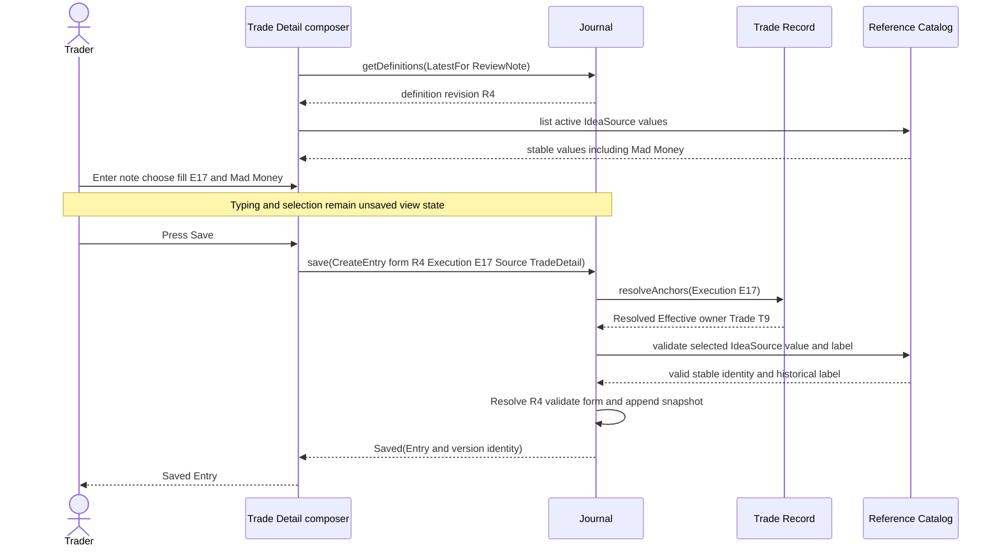
```mermaid
sequenceDiagram
    actor T as Trader
    participant UI as Trade Detail composer
    participant J as Journal
    participant TR as Trade Record
    participant RC as Reference Catalog

    UI->>J: getDefinitions(LatestFor ReviewNote)
    J-->>UI: definition revision R4
    UI->>RC: list active IdeaSource values
    RC-->>UI: stable values including Mad Money
    T->>UI: Enter note choose fill E17 and Mad Money
    Note over T,J: Typing and selection remain unsaved view state
    T->>UI: Press Save
    UI->>J: save(CreateEntry form R4 Execution E17 Source TradeDetail)
    J->>TR: resolveAnchors(Execution E17)
    TR-->>J: Resolved Effective owner Trade T9
    J->>RC: validate selected IdeaSource value and label
    RC-->>J: valid stable identity and historical label
    J->>J: Resolve R4 validate form and append snapshot
    J-->>UI: Saved(Entry and version identity)
    UI-->>T: Saved Entry
```

**Audit findings applied:**

- The direct path earns one `save` operation. A coordinator would add no semantic value because only Journal mutates; the two lower-module calls are validation reads.
- The command carries the exact Entry Definition revision shown, not “latest.” If configuration advanced while the form was open, R4 remains retained and the saved Entry truthfully snapshots R4.
- Source comes from the Trade Detail integration, not from a user-selectable form control. Journal resolves labels and stable identities rather than trusting client display strings.
- A historical Superseded or Voided Execution is still a resolvable Anchor; only Unknown is invalid. The status is available for presentation but does not block truthful historical writing.

#### Sequence: Plan confirmation captures semantic answers once

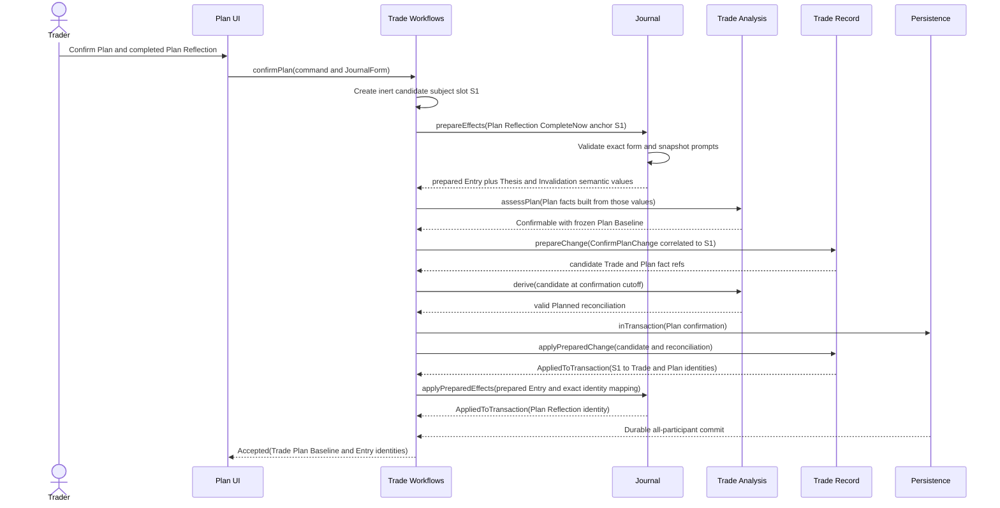
```mermaid
sequenceDiagram
    actor T as Trader
    participant UI as Plan UI
    participant TW as Trade Workflows
    participant J as Journal
    participant TA as Trade Analysis
    participant TR as Trade Record
    participant P as Persistence

    T->>UI: Confirm Plan and completed Plan Reflection
    UI->>TW: confirmPlan(command and JournalForm)
    TW->>TW: Create inert candidate subject slot S1
    TW->>J: prepareEffects(Plan Reflection CompleteNow anchor S1)
    J->>J: Validate exact form and snapshot prompts
    J-->>TW: prepared Entry plus Thesis and Invalidation semantic values
    TW->>TA: assessPlan(Plan facts built from those values)
    TA-->>TW: Confirmable with frozen Plan Baseline
    TW->>TR: prepareChange(ConfirmPlanChange correlated to S1)
    TR-->>TW: candidate Trade and Plan fact refs
    TW->>TA: derive(candidate at confirmation cutoff)
    TA-->>TW: valid Planned reconciliation
    TW->>P: inTransaction(Plan confirmation)
    TW->>TR: applyPreparedChange(candidate and reconciliation)
    TR-->>TW: AppliedToTransaction(S1 to Trade and Plan identities)
    TW->>J: applyPreparedEffects(prepared Entry and exact identity mapping)
    J-->>TW: AppliedToTransaction(Plan Reflection identity)
    P-->>TW: Durable all-participant commit
    TW-->>UI: Accepted(Trade Plan Baseline and Entry identities)
```

**Audit findings applied:**

- Journal must be able to prepare against a command-local candidate slot before a durable Trade exists. Requiring a committed Anchor at preparation would force duplicate Thesis fields or a partially created Trade.
- The slot is correlated with Trade Record's candidate but is never stored. Only the transaction-local durable mapping may satisfy it.
- `SemanticValueSet` is part of the preparation result. Trade Workflows never parses Prompt labels, and the trader enters Thesis/Invalidation once.
- Journal's successful apply remains transaction-local. If the Trade write or durability step fails, neither the Entry nor its candidate identity survives.

#### Sequence: Entry Definition changes while Debt is outstanding

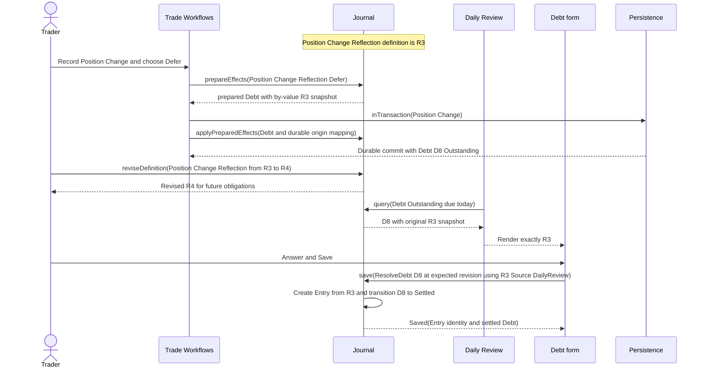
```mermaid
sequenceDiagram
    actor T as Trader
    participant TW as Trade Workflows
    participant J as Journal
    participant DR as Daily Review
    participant UI as Debt form
    participant P as Persistence

    Note over J: Position Change Reflection definition is R3
    T->>TW: Record Position Change and choose Defer
    TW->>J: prepareEffects(Position Change Reflection Defer)
    J-->>TW: prepared Debt with by-value R3 snapshot
    TW->>P: inTransaction(Position Change)
    TW->>J: applyPreparedEffects(Debt and durable origin mapping)
    P-->>TW: Durable commit with Debt D8 Outstanding
    T->>J: reviseDefinition(Position Change Reflection from R3 to R4)
    J-->>T: Revised R4 for future obligations
    DR->>J: query(Debt Outstanding due today)
    J-->>DR: D8 with original R3 snapshot
    DR-->>UI: Render exactly R3
    T->>UI: Answer and Save
    UI->>J: save(ResolveDebt D8 at expected revision using R3 Source DailyReview)
    J->>J: Create Entry from R3 and transition D8 to Settled
    J-->>UI: Saved(Entry identity and settled Debt)
```

**Audit findings applied:**

- Debt snapshots its prompts when the obligation is created, not when it is eventually answered. This is a deliberate canonical departure from GLM's placeholder proposal and preserves what was asked at the causal moment.
- `reviseDefinition` changes only future Entries/Debts. It never migrates D8 and does not make R3 unresolvable.
- Settling is one Journal-only atomic Save: either the immutable Entry and Debt transition both persist or neither does.
- The settlement Entry records Source Daily Review because that is where the writing occurred; its Position Change origin still explains why it was owed.

#### Sequence: one-click Hold and one dated Action Entry

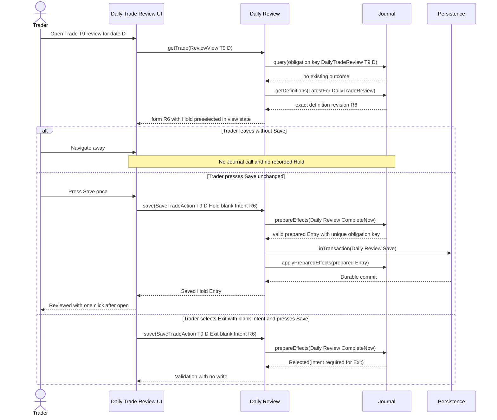
```mermaid
sequenceDiagram
    actor T as Trader
    participant UI as Daily Trade Review UI
    participant DR as Daily Review
    participant J as Journal
    participant P as Persistence

    T->>UI: Open Trade T9 review for date D
    UI->>DR: getTrade(ReviewView T9 D)
    DR->>J: query(obligation key DailyTradeReview T9 D)
    J-->>DR: no existing outcome
    DR->>J: getDefinitions(LatestFor DailyTradeReview)
    J-->>DR: exact definition revision R6
    DR-->>UI: form R6 with Hold preselected in view state
    alt Trader leaves without Save
        T->>UI: Navigate away
        Note over UI,J: No Journal call and no recorded Hold
    else Trader presses Save unchanged
        T->>UI: Press Save once
        UI->>DR: save(SaveTradeAction T9 D Hold blank Intent R6)
        DR->>J: prepareEffects(Daily Review CompleteNow)
        J-->>DR: valid prepared Entry with unique obligation key
        DR->>P: inTransaction(Daily Review Save)
        DR->>J: applyPreparedEffects(prepared Entry)
        P-->>DR: Durable commit
        DR-->>UI: Saved Hold Entry
        UI-->>T: Reviewed with one click after open
    else Trader selects Exit with blank Intent and presses Save
        UI->>DR: save(SaveTradeAction T9 D Exit blank Intent R6)
        DR->>J: prepareEffects(Daily Review CompleteNow)
        J-->>DR: Rejected(Intent required for Exit)
        DR-->>UI: Validation with no write
    end
```

**Audit findings applied:**

- Preselection is UI state and does not call Journal. The one-click promise counts the trader's Save after the page opens, not an automatic record.
- `JournalObligationKey(DailyTradeReview, T9, D)` enforces exactly one current Action outcome. A later Save supplies the existing Entry revision and appends an Edit version rather than creating a duplicate.
- Daily Review uses prepared effects because the same Save may also reconcile Mark-detected Deviations; the simple Hold case still remains one visible Save.
- Conditional Intent validation belongs to the exact definition/semantic option roles, while Journal never turns Exit/Roll/Adjust intent into a Trade fact.

#### Sequence: Edit and Addendum preserve different meanings

```mermaid
sequenceDiagram
    actor T as Trader
    participant UI as Journal UI
    participant J as Journal
    participant TR as Trade Record

    Note over J: Plan Reflection E3 uses definition R2 and Trade Anchor T9
    Note over TR: Confirmed Plan retains original Thesis copied at confirmation
    T->>UI: Correct a typo in E3
    UI->>J: save(EditEntry E3 expected revision 1 corrected response)
    J->>J: Append immutable version 2 using original R2 snapshot
    J-->>UI: Saved(E3 revision 2 Edited)
    UI->>TR: getRecord(T9 Summary)
    TR-->>UI: same confirmed Plan facts and FactRevision
    T->>UI: Add a genuinely later clarification
    UI->>J: save(Addendum parent E3 current form Source Journal)
    J->>J: Copy preserved Trade Anchor and append new Entry E4
    J-->>UI: Saved(E4 parent E3)
```

**Audit findings applied:**

- Edit reuses the original Entry snapshot and identity; it does not silently add newly configured Prompts or rewrite the first-authored time.
- Journal performs no reverse write into Trade Record. A corrected Plan Reflection can differ from frozen Plan Thesis, and that visible difference remains coaching-ready evidence.
- Addendum is a distinct later act: new Entry identity, current form snapshot, actual new Source/time, same Anchor, and explicit parent. It does not inherit the original workflow origin.

#### Sequence: Voiding a Debt-settlement Entry reopens the Debt

```mermaid
sequenceDiagram
    actor T as Trader
    participant UI as Journal UI
    participant J as Journal

    Note over J: Entry E7 is the sole answer that settled Debt D8
    T->>UI: Void E7 because the writing never occurred
    UI->>J: save(VoidEntry E7 expected revision and reason)
    J->>J: Validate E7 and D8 relationship
    J->>J: Append visible Void version for E7
    J->>J: Append D8 transition Settled to Outstanding
    J-->>UI: Saved(Void E7 and reopened Debt D8)
    UI->>J: query(Debt Outstanding due through today)
    J-->>UI: D8 with original definition snapshot and status history
    UI-->>T: Reflection is owed again
```

**Audit findings applied:**

- A Void asserts the saved Entry never happened. Leaving its sole Debt settlement effective would contradict that assertion, so both Journal records change atomically in one `save`.
- Reopening preserves the same Debt identity, original trigger, due semantics, and original prompt snapshot. It does not create a fresh obligation under today's form.
- Journal does not guess that a changed Trade origin makes the Debt obsolete. If the origin is now Voided, Abandoned, flat, or otherwise retired, the owning workflow supplies a separate evidence-bound retirement in its transaction.

#### Sequence: Trade narrative retains a Voided fill's Entry

```mermaid
sequenceDiagram
    actor T as Trader
    participant UI as Trade Detail UI
    participant I as Trade Views and Reporting
    participant TR as Trade Record
    participant J as Journal

    T->>UI: Open Trade T9 journal timeline
    UI->>I: tradeJournal(T9)
    I->>TR: history(T9)
    TR-->>I: current and historical Execution identities including Voided E17
    I->>J: query(TradeNarrativeScope T9 and resolved Execution set)
    J-->>I: Trade-anchored and fill-anchored items deduplicated
    I->>TR: resolveAnchors(all returned Trade and Execution Anchors)
    TR-->>I: Effective Superseded and Voided statuses
    I-->>UI: finished timeline with E17 Entry and Voided-origin context
    UI-->>T: Entry remains visible once under Trade T9
```

**Audit findings applied:**

- Trade narrative scope must include historical as well as currently effective Execution identities. Otherwise a correct Void would make truthful fill-level writing disappear from the Trade page.
- Trade Views and Reporting performs one Trade Record history read, one Journal query, and one batch Anchor resolution. Journal does not issue an N+1 Trade lookup or duplicate entries that match both an origin and an Anchor.
- Anchor status is joined for presentation; it never rewrites the Entry's immutable Anchor.

#### Sequence: Journal defaults do not overwrite trader configuration

```mermaid
sequenceDiagram
    actor T as Trader
    participant W as Workspace
    participant J as Journal

    W->>J: seedDefaults(manifest version 1)
    J-->>W: Fixed identities and initial definitions created atomically
    T->>J: reviseDefinition(Daily Trade Review from D1 to D2)
    J-->>T: Revised current definition with D1 retained
    W->>J: seedDefaults(manifest version 2 with one new Source)
    J-->>W: New Source created and trader definition D2 preserved
    W->>J: seedDefaults(repeated manifest version 2)
    J-->>W: Unchanged with already-present keys
```

**Audit findings applied:**

- Initializing seven definitions through repeated ordinary definition-revision calls would expose a half-seeded Workspace and cannot create protected Source identities. One atomic Workspace-only operation is required.
- Stable default keys, not labels or Prompt wording, decide identity. A later manifest may add a new Source for a real writing path but cannot reset a customized current definition.
- Workflow-critical definition changes are explicit supported migrations, not hidden seed behavior.

#### Sequence: full-Workspace Restore validates Journal references

```mermaid
sequenceDiagram
    actor T as Trader
    participant UI as Restore UI
    participant W as Workspace
    participant J as Journal
    participant TR as Trade Record
    participant RC as Reference Catalog
    participant P as Persistence

    T->>UI: Confirm replace-only Restore
    UI->>W: restore(full backup and authorization)
    W->>J: prepareRestore(Journal section and full digest)
    J-->>W: normalized graph plus Anchor origin and Tag references
    W->>TR: resolve and validate every Trade fill and origin identity
    TR-->>W: effective and historical identities or Unknown issues
    W->>RC: validate historical Tag Type and Value references
    RC-->>W: retained identities and labels or issues
    alt Any unknown reference or invalid Journal history
        W-->>UI: Reject with current Workspace unchanged
    else Every module section valid
        W->>P: inTransaction(full Workspace replacement)
        W->>J: applyPreparedRestore(graph validations authorization and digest)
        J-->>W: Applied Journal section and rebuilt indexes
        Note over W,P: Other prepared domain sections apply here
        P-->>W: Durable atomic replacement
        W-->>UI: Restore receipt
    end
```

**Audit findings applied:**

- Self-contained snapshots make an Entry renderable, but Restore still validates that referenced stable Definition, Trade/Execution, origin, and Tag identities have not been corrupted.
- Historical Superseded and Voided Trade facts are valid references; truly Unknown identities reject Restore. Retirement does not invalidate historical Tag references.
- Live per-record create/import operations cannot reproduce exact Entry/Debt identities, version chains, obligation uniqueness, or all-Workspace atomicity. Prepared replace-only Restore remains necessary.

### Requirements fulfilled and exported

Closed within Journal:

- One ten-operation interface covers direct Journal Saves, workflow-prepared effects, one cohesive indexed read, seven fixed Entry Types with runtime form revisions, controlled default seeding, immutable history, separate Debt/decline semantics, and full backup/Restore.
- The exact Standalone/Trade/specific-fill Anchor union, automatic Source, separate origin association, and one-originating-Trade rule are represented without anchor proliferation.
- Complete, Defer, Decline, settlement, reopening, and valid retirement are mutually coherent obligation outcomes; no blank placeholder Entry is created.
- Plan and Management semantic values are captured once, returned by stable role, and atomically copied without later Journal edits mutating Trade facts.
- Definition changes are forward-only while Entries and Debt remain self-contained and answer the exact forms that applied to them.
- Daily Review's explicit one-click Hold Save, conditional Intent, one Entry per Trade/date, and no-save/no-record behavior are enforceable.
- Versioned Edit, Addendum, and Void remain transparent, preserve analytical evidence, and capture no unsaved behavior.
- Typed Tag Select enables stable field-level partition analytics while IdeaSource remains zero-or-one per Entry.

Exported requirements:

- **Trade Workflows** creates command-local candidate Anchor/origin slots when Journal semantic values are needed before Trade Record preparation, correlates them to the exact Trade Record candidates, and passes only the transaction-local durable mapping to `applyPreparedEffects`.
- **Trade Record** keeps historical Trade/fill/origin identities resolvable and returns complete historical Execution identity sets for a Trade narrative without Journal-owned denormalized ownership.
- **Daily Review** queries due Debt globally, uses the stored Debt snapshot for settlement, prepares one dated Action obligation per Trade/date, routes workflow-bound Debt correctly, and joins any Deviation effects in the same transaction.
- **Reference Catalog** lists active Tag values for new selection, validates new versus retained historical references, and returns stable identity plus historical label bindings for Journal snapshots and Restore.
- **Trade Views and Reporting** supplies snapshot-bound Trade narrative scopes, batch-resolves Anchor status, joins Entries/Debt/declines into finished timelines, and never infers Hold from missing Entries.
- **Performance Analysis** consumes one current `JournalAnalysisDatum` per Entry or obligation, keyed by stable Entry Type, Prompt, option, semantic role, Tag Value, Source, origin, and outcome. It owns denominators, categorical partitions, coverage, and edit/Void disclosure without treating prior versions as extra observations or behavioral judgments.
- **Workspace** seeds all seven default Entry Definitions and Sources, includes every Journal revision in backup, batch-validates cross-module references, and applies the section only in full replace-only Restore.
- **Persistence/Transaction** supplies transaction-local candidate mappings, per-record optimistic revisions, obligation-key uniqueness, snapshot/cursor reads, all-participant rollback, and rebuildable Journal indexes without leaking storage operations.

### Downstream resolutions

- Reference Catalog now pins the active-versus-retained validation result used by Tag Select and Restore.
- Trade Views and Reporting now owns the final timeline item presentation, including Edited/Void, historical Anchor status, Addendum nesting, origin context, and Debt calls to action.
- Workspace now owns controlled Journal default seeding, technology-neutral transaction/export-snapshot propagation, and full Restore coordination. No database handle or serialization format enters this interface.

### Source lineage for this interface

- Claude contributes the Journal term, one chronological writing module, by-value Prompt/Option snapshots, stable option identities, Addenda, contextual Trade/fill writing, and a whole-definition form edit. Its placeholder-as-Debt model, mandatory Addendum-only correction, broad multi-variant Anchor union, mutable Entry Type/designation registry, and lack of workflow atomicity are superseded.
- GLM contributes explicit stored “what is owed” queries, immutable retained definition revisions, runtime content validation, stable Entry/definition identities, direct single-module writing, and indexed timeline/debt reads. Its placeholder Entry state machine, schema-at-completion rule, Trade/Fill/Market attachment model and links, no completed-entry correction, five fixed Entry Types, and per-record import operations are superseded.
- Ox Alpha materially repeats Claude's Journal and adds no independent interface boundary.
- Separate Journal Debt, explicit decline/retirement, seven fixed Entry Type identities, runtime Prompt/Option revisions, versioned Edit, the three-scope Anchor, automatic Source and origin association, candidate-slot atomicity, IdeaSource Tag Select, one-click Hold Save, workflow-bound Debt routing, and full prepared Restore are canonical synthesis driven by the user's approved model.

## Market Data — initial interface design

This section stages Candidate C's authoritative market-observation module and its one external provider port. It is specification-only and technology-neutral. Its requests describe domain intent and evidence; they do not prescribe an API protocol, database, scheduler, market-calendar implementation, or provider.

### Charter

**Market Data** owns the shared observation for each Instrument and U.S. trading date: the effective Mark and its immutable revision history, optional Daily Bar history, Unavailable Mark Acknowledgments, Manual precedence, context-aware Expected Mark Date and Status, explicit historical gaps, automatic provider recovery policy, current retrieval diagnostics, provider configuration, and its portion of backup/Restore.

It knows nothing about Trades, Plans, Positions, Stops, Targets, P&L, Journal obligations, or analytics populations. Callers supply Instrument requirements and relevant starting dates; Market Data chooses the applicable completed trading sessions and resolves observation evidence. Trade Analysis alone interprets that evidence economically. Market Data alone may call the Pricing Provider port.

### Imported requirement ledger

The interface must hide all of the following complexity:

- One effective Mark is shared by every Trade using the same Instrument and U.S. trading date. No Trade-specific price copy is authoritative.
- Every Mark revision retains price, observation time, save time, source, predecessor, and enough change meaning to distinguish an intentional Manual valuation override from a correction.
- Source is exactly `Manual` or the opaque identity of the provider that supplied the revision. Historical provider identities remain valid provenance after configuration changes.
- A Manual Mark is authoritative and sticky. Provider recovery may never replace it or append skipped provider prices as shadow observations.
- A changed provider value may refresh a provider-sourced Mark, with the prior effective revision retained. An identical normalized value is a no-op.
- Fill cost is never a fallback Mark. Missing evidence stays visibly missing.
- Every valuation context resolves an Expected Mark Date. For a current view this is normally the latest completed regular U.S. session, so yesterday's close during today's session is normal rather than Stale.
- Expected-Mark Status is exactly Available, Missing, or Acknowledged Unavailable. An older Mark is only Stale context relative to a later Expected Mark Date and never becomes calculation evidence for that date.
- An Unavailable Mark Acknowledgment records Instrument, trading date, reason, acknowledgment time, and history but no price. It cannot be synthesized from provider failure and never participates in valuation.
- If an exact Mark later arrives for an acknowledged date, Available wins while the acknowledgment remains visible historical evidence.
- Daily Bars retain provider-supplied OHLC evidence. A bar close may seed a provider-sourced Mark only when no Mark exists; it never overwrites any existing Mark. An explicit provider closing observation may refresh an existing provider-sourced Mark under the normal revision rule.
- Single-Instrument trailing conditions may use Daily Bar highs for long exposure and lows for short exposure. Close-only dates still contribute their exact Marks. Multi-Instrument structures use same-date effective Marks and never combine different Instruments' intraday extremes.
- Starting Daily Review computes recovery automatically from supplied Instrument relevance through the review date. The trader never selects or maintains a recovery date range.
- Provider recovery retries missing actual observations, including dates with acknowledgments. Only the current review date enters the required Manual resolution queue; older gaps remain visible, retryable, and non-blocking.
- Historical series enumerate expected completed sessions and return explicit gaps. They never interpolate, carry forward, or connect through a missing session as if a price existed.
- Provider errors, unsupported Instruments, and partial responses are current request diagnostics only. They are not durable Retrieval Outcomes, Provider Observations, Journal facts, or provider-performance inputs.
- Provider integration is optional. A release without it exposes Manual collection honestly rather than returning a domain-level Unavailable result for an unimplemented capability.
- A Mark correction can affect many Trades and historical calculations. Market Data exposes before/candidate evidence and correction metadata but never discovers affected Trades or calculates impact itself.
- Full backup retains all observation identities, revisions, provenance, acknowledgment history, and nonsecret configuration. It excludes provider credentials, raw responses, transient diagnostics, and safely rebuildable coverage indexes.

### Module-shape alternatives considered

#### Shape A — separate Mark, Bar, Acknowledgment, and provider repositories

Expose CRUD-like operations for each stored record and let Daily Review decide precedence, stale fallback, gap dates, provider routing, and which values enter calculation frames.

Rejected because callers would repeatedly implement the hardest rules and could easily treat an acknowledgment or stale fallback as a Mark, let a bar overwrite a Manual valuation, or commit a Mark-derived Deviation against changed evidence. The interfaces would describe storage nouns while hiding no useful complexity.

#### Shape B — generic dated-observation log

Store arbitrary typed observations and expose one append plus a general query language. Callers interpret tags such as close, Manual, unavailable, and OHLC.

Rejected because genericity erases the domain invariants. Manual precedence, exactly one effective Mark, acknowledgment semantics, completed-session selection, bar defaulting, correction classification, and gap recovery would become conventions outside the module. It would also invite raw provider payload retention and arbitrary intraday replay that the product explicitly excludes.

#### Shape C — context-aware observation book with one provider port — adopted

Expose one explicit trader `save`, one fixed-family `query`, automatic `recover`, focused provider configuration, and the standard backup/Restore protocol. The query resolves current, review, replay, correction-preview, history, and chart evidence through the same precedence and session policy. Recovery alone crosses the Pricing Provider port.

This shape makes Market Data deeper than a price repository without making it Trade-aware. It centralizes every rule that determines whether an observation is honest calculation evidence, while callers retain ownership of Instrument selection, economic interpretation, affected-Trade discovery, Review completion, and presentation.

### Interfaces

```text
interface MarketData
  save(command: MarketDataSaveCommand) -> MarketDataSaveResult
  query(query: MarketDataQuery) -> MarketDataQueryResult
  recover(request: RecoverMarketData) -> MarketDataRecoveryResult
  getProviderConfiguration() -> ProviderConfigurationView
  configureProvider(command: ConfigureProvider) -> ConfigureProviderResult
  exportSnapshot(request: MarketDataExportRequest) -> MarketDataBackupSection
  prepareRestore(request: PrepareMarketDataRestore) -> PrepareMarketDataRestoreResult
  applyPreparedRestore(command: ApplyPreparedMarketDataRestore) -> MarketDataRestoreResult

interface PricingProvider
  fetchClosingObservations(request: ProviderFetchRequest) -> ProviderFetchResult
```

Callers' eyes:

```text
saved = marketData.save(one Manual Mark or acknowledgment decision)
frames = marketData.query(ResolveFrames for point history or correction evidence)
history = marketData.query(InspectObservations for audit presentation)
series = marketData.query(ReadSeries for a chart with explicit gaps)
recovery = marketData.recover(review-date Instrument requirements)
provider = marketData.getProviderConfiguration()
configured = marketData.configureProvider(one explicit settings Save)
backupSection = marketData.exportSnapshot(one Workspace export snapshot)
restore = marketData.prepareRestore(one migrated Market Data section)
applied = marketData.applyPreparedRestore(restore plus Workspace authorization)
```

There is deliberately no `getLatestPrice`, `useFillAsMark`, `setStale`, `setReviewComplete`, `createProviderObservation`, `recordFetchAttempt`, `deleteMark`, `importOneMark`, subscription, streaming quote, arbitrary observation type, or general query language.

### Observation identity and history

```text
InstrumentKey = stable identity of one stock or exact option contract
TradingDate = date of one completed regular U.S. trading session
ObservationKey = InstrumentKey plus TradingDate

MarkRevisionId = identity of one immutable Mark revision
DailyBarRevisionId = identity of one immutable Daily Bar revision
AcknowledgmentId = stable identity of the acknowledgment chain for one key
AcknowledgmentRevisionId = identity of one immutable acknowledgment revision
ResolutionRevision = opaque optimistic revision of the Mark/Acknowledgment
                     resolution state for one ObservationKey
ExpectedResolutionRevision = Absent or one exact ResolutionRevision
MarketDataSnapshotId = opaque request-relative identity of selected evidence

ObservationEvidenceBinding =
  MarketDataSnapshotId and normalized requirement digest
  exact selected Mark, Daily Bar, and acknowledgment revision identities
  explicit fingerprints for material absent members

ObservationSource = Manual | Provider(ProviderId)

MarkRevision =
  MarkRevisionId and ObservationKey
  nonnegative finite Price
  observation time and save time
  ObservationSource
  Initial | ManualOverride | Correction(reason) | ProviderRefresh
  optional predecessor MarkRevisionId

MarkRecord =
  ObservationKey
  effective MarkRevisionId
  complete ordered MarkRevision history

DailyBarRevision =
  DailyBarRevisionId and ObservationKey
  open high low close
  observation time and save time
  Provider(ProviderId) source
  optional predecessor DailyBarRevisionId

DailyBarRecord =
  ObservationKey
  effective DailyBarRevisionId
  complete ordered DailyBarRevision history

AcknowledgmentRevision =
  Asserted(reason, acknowledgment time, save time)
  or Withdrawn(reason, save time)
  plus AcknowledgmentRevisionId and optional predecessor

UnavailableAcknowledgment =
  AcknowledgmentId and ObservationKey
  effective Asserted or Withdrawn state
  complete ordered AcknowledgmentRevision history
```

One `ObservationKey` may have a Mark, Daily Bar, acknowledgment history, all three, or none. These facts are not competing versions of one generic record. Mark precedence answers valuation, the Daily Bar supplies range evidence, and the acknowledgment explains an unresolved exact Mark.

A Manual write against an existing provider Mark appends a Manual revision. It must state whether the trader is making a deliberate valuation override or correcting a value believed to have been recorded incorrectly. Only the latter automatically contributes Mark correction metadata. A provider refresh that changes a previously effective provider price is correction-relevant by construction; an identical value creates no revision. Once the effective Mark is Manual, later provider prices are neither made effective nor stored as hidden Mark revisions. Their corresponding Daily Bars may still be stored because range evidence is independent.

The module assigns save time and revision identity at the durable boundary. `observation time` describes when the price or range was observed and may differ. Array order, provider response order, and wall-clock arrival order never select the effective value outside these rules.

### Resolved evidence types

The following types complete the provisional `MarkFrame` contract in Trade Analysis:

```text
StaleMarkContext =
  closest earlier effective Mark value
  earlier TradingDate and MarkRevisionId
  source and observation time

MarkResolution =
  Available(
    exact-date effective Mark value,
    MarkRevisionId, source, observation time,
    optional MarkCorrectionMetadata)
  or Missing(optional StaleMarkContext)
  or AcknowledgedUnavailable(
    AcknowledgmentId and effective reason,
    optional StaleMarkContext)

DailyBarResolution =
  Available(exact-date OHLC, DailyBarRevisionId, source, observation time)
  or Missing

MarkFrame =
  Expected Mark Date
  ObservationEvidenceBinding
  one MarkResolution per requested Instrument
  zero or one DailyBarResolution per Instrument when range evidence was requested

MarkCorrectionMetadata =
  corrected ObservationKey and effective revision
  correction save time and reason or ProviderRefresh classification
  first affected Expected Mark Date
```

Resolution precedence is exact and exhaustive:

1. If an exact-date Mark exists, status is `Available`, even when an older acknowledgment remains in history.
2. Otherwise, if the acknowledgment's effective state is Asserted, status is `AcknowledgedUnavailable`.
3. Otherwise status is `Missing`.
4. In the latter two cases, the closest earlier effective Mark may be returned only as `StaleMarkContext`.

No older value, fill price, Daily Bar from a different date, acknowledgment, provider error, or absent-feature sentinel can enter the exact-date value slot. Daily Bar availability is separate from Expected-Mark Status: missing OHLC may reduce range-evidence coverage while an exact Mark still makes valuation Available.

### Valuation contexts, frame requests, and snapshot binding

```text
ValuationContext =
  Current(as-of instant in Workspace time zone)
  or DailyReview(review local date, as-of instant)
  or Historical(historical local date, as-of instant)

FrameWindow =
  Point(ValuationContext)
  or CompletedSessionRange(start local date, end local date, as-of instant)

FrameGroup =
  caller correlation key
  required Instrument set
  optional Daily Bar Instrument set
  optional time-dependent-condition activation date

ResolveFramesRequest =
  FrameWindow
  bounded possibly-empty FrameGroup set
  CurrentEvidence
  or CandidateManualMark(proposal and ExpectedResolutionRevision)
  optional ExpectedSnapshot(MarketDataSnapshotId)

ResolveFramesResult =
  Resolved(resolved completed-session window and cutoffs,
           ordered frames by group, coverage, MarketDataSnapshotId)
  or SnapshotUnchanged(MarketDataSnapshotId)
  or SnapshotChanged(resolved completed-session window and cutoffs,
                     current frames, coverage, current MarketDataSnapshotId)
  or Rejected(MarketDataIssue list)
```

For `Current`, Market Data chooses the latest completed regular U.S. session as of the supplied instant. At noon Tuesday after a normal Monday session, Monday is the Expected Mark Date and a Monday Mark is Available, not Stale. `DailyReview` and `Historical` resolve the explicitly intended completed session; a future, still-open, or non-session date is a request issue rather than a Missing Mark. A range enumerates completed regular sessions only, then emits a frame for every such date, including frames whose Instrument members are Missing. A zero-group point request performs only this session resolution and returns its exact cutoff; Daily Review uses that narrow capability before it knows which Trades and Instruments are eligible. It creates no observation and no saved calendar snapshot.

`FrameGroup` is a caller correlation device, not Trade knowledge. It lets a coordinator request different Instrument sets for several Trades in one bounded read and return each set as a coherent frame. The optional activation date tells Market Data how far back evidence is requested; it does not reveal what Stop or Target will do with it.

An `ObservationEvidenceBinding` makes the opaque snapshot usable as durable evidence without creating a stored Snapshot entity. Its `MarketDataSnapshotId` binds the normalized frame request, session-policy revision, every selected Mark and Daily Bar revision, every selected acknowledgment revision, every stale-context revision, and every material absence. It is therefore changed by a new exact Mark, a Manual override, an acknowledgment transition, a relevant bar refresh, or a newly filled gap. It is request-relative and cannot be reused for a different Instrument/window request. When a Deviation is recorded, Trade Record preserves the returned binding by value with the occurrence; Market Data does not store a second Snapshot record.

With `ExpectedSnapshot`, `query` acts as the transaction-time evidence check needed by Daily Review. `SnapshotUnchanged` is valid only within the same read/transaction boundary that protects the subsequent multi-module commit. `SnapshotChanged` supplies current evidence so the coordinator can recompute; it never approves a stale Deviation reconciliation. A hypothetical candidate snapshot is explicitly labeled and can be used for preview analysis but never as committed-observation proof.

### Query contracts

```text
MarketDataQuery =
  ResolveFrames(ResolveFramesRequest)
  or InspectObservations(ObservationKey set, bounded page and optional cursor)
  or ReadSeries(Instrument set, bounded local-date interval,
                include Marks, Bars, or both)

MarketDataQueryResult =
  ResolveFramesResult
  or ObservationHistoryPage
  or ObservationSeries

ObservationHistoryPage =
  query-snapshot identity
  each requested key's Mark, Daily Bar, and acknowledgment revision chains
  effective-resolution summary and optional next cursor

ObservationSeries =
  query-snapshot identity and session-policy revision
  ordered completed-session dates
  for every requested Instrument/date:
    exact effective Mark resolution
    requested Daily Bar resolution
    explicit Gap when required evidence is absent
  aggregate coverage counts and optional next cursor
```

`ResolveFrames` is the calculation-evidence read used for current views, Daily Review, replay, condition history, correction impact, and snapshot validation. `CandidateManualMark` applies one proposed Manual revision in memory and returns candidate frames under exactly the same precedence rules; it writes nothing. Trade Views and Reporting supplies the bounded affected Trade frame groups and can compare the returned current and candidate evidence through `TradeAnalysis.assessChange`.

`InspectObservations` is the audit/editor read. It returns immutable histories rather than reconstructing what a calculation displayed at an earlier save time. `ReadSeries` is the chart/evidence read. It shows session-aware gaps explicitly, does not interpolate or fill forward, and does not retain provider diagnostics as history. A candlestick consumer uses exact Daily Bars, renders a close-only Mark as a point rather than a fabricated candle, and leaves dates with neither as gaps.

### Trader Save contract

```text
MarketDataSaveCommand =
  RecordManualMark(
    ObservationKey, Price, observation time,
    InitialObservation | ValuationOverride | Correction(reason),
    ExpectedResolutionRevision)
  or AcknowledgeUnavailable(
    ObservationKey, reason, acknowledgment time,
    ExpectedResolutionRevision)
  or WithdrawAcknowledgment(
    ObservationKey, correction reason,
    ExpectedResolutionRevision)

MarketDataSaveResult =
  Saved(
    durable receipt, ObservationKey, new ResolutionRevision,
    appended revision identities, effective MarkResolution,
    effective-evidence change summary)
  or Conflict(current ResolutionRevision and effective summary)
  or Rejected(MarketDataIssue list)
```

`RecordManualMark` is both initial Manual entry and the correction/override path. A replacement requires explicit change meaning and the current `ResolutionRevision`; the module never guesses whether a deliberate valuation difference is a factual correction. It appends history and makes the new Manual Mark effective. It cannot be called with a provider source.

`AcknowledgeUnavailable` is accepted only as an explicit trader act for a date with no exact Mark. It does not ingest an error object or copy a provider message as the trader's reason. Reasserting or revising it appends an acknowledgment revision. `WithdrawAcknowledgment` corrects a mistaken acknowledgment visibly and returns the unresolved status to Missing when no Mark exists. Neither operation deletes history.

Saving a Mark for an acknowledged date leaves acknowledgment history intact and changes the effective status to Available. Saving an acknowledgment for a date that already has a Mark is rejected because it cannot describe the effective resolution. Every conflict and validation failure writes nothing.

### Automatic recovery and the Pricing Provider port

```text
RecoverMarketData =
  review local date and as-of instant
  one or more RecoveryRequirements

RecoveryRequirement =
  InstrumentKey
  earliest economically relevant local date

MarketDataRecoveryResult =
  provider configuration revision and review Expected Mark Date
  derived attempted session spans by Instrument
  created or refreshed Mark and Daily Bar revision identities
  skipped Manual Mark keys
  current-date MarkResolution for every required Instrument
  current-date ManualResolutionRequired keys
  historical CoverageGap keys
  transient RecoveryDiagnostic list

RecoveryDiagnostic =
  NotConfigured
  or Unsupported(InstrumentKey)
  or RetrievalFailure(InstrumentKey or attempted span, safe explanation)
  or PartialResponse(InstrumentKey or attempted span)

ProviderFetchRequest =
  configured provider binding
  bounded Instrument/session-span set computed by Market Data

ProviderClosingObservation =
  InstrumentKey and TradingDate
  close and observation time
  ProviderId
  optional open high low close Daily Bar

ProviderFetchResult =
  returned ProviderClosingObservation set
  unsupported Instrument set
  safe current-request error set
```

`recover` accepts relevance bounds, not a trader-selected date range. For each Instrument it enumerates completed sessions between the earliest relevant date or the actual-observation coverage frontier and the review Expected Mark Date, then compresses currently missing observation dates into a bounded provider request. A date covered only by an acknowledgment remains missing as an actual observation and remains eligible for later recovery. A later isolated Mark does not erase an earlier interior gap.

Provider results are partial by default. Each valid close creates an initial provider Mark, refreshes a provider-sourced Mark when its value changed, or is skipped when the effective Mark is Manual. An optional valid Daily Bar is stored independently with revision history. Its mere presence never overwrites a Mark. On an otherwise empty key, the bar's close is also the returned closing observation that seeds the provider Mark; on an existing provider-sourced key, the explicit close follows the provider-refresh rule rather than a separate bar-default rule. Returned observations for an acknowledged date make its status Available without deleting the acknowledgment.

After applying the response, Market Data re-resolves actual status from its facts. Only Missing keys at the current review Expected Mark Date enter `ManualResolutionRequired`. Earlier missing sessions remain `CoverageGap`s and never block today's Review. Unsupported, failed, omitted, or malformed provider results remain Missing and cannot create acknowledgments.

The port is one plain request/response capability. It does not expose streaming prices, provider-specific payloads, retry jobs, webhooks, quality scoring, or durable attempts. Market Data may enforce bounded batches and retry policy internally, but only the final current call's safe diagnostics leave the module. No credential, raw response, or provider error text becomes a Mark or Journal fact.

### Provider configuration

```text
ProviderConfigurationView =
  configuration revision
  Disabled
  or Enabled(ProviderId, display label, credential status,
             bounded nonsecret settings)
  or NeedsSetup(ProviderId, display label, bounded nonsecret settings)

ConfigureProvider =
  Disable(expected configuration revision)
  or EnableOrReplace(
    ProviderId, bounded nonsecret settings,
    protected write-only credential input,
    expected configuration revision)

ConfigureProviderResult =
  Saved(new configuration revision and redacted ProviderConfigurationView)
  or Conflict(current configuration revision and redacted view)
  or Rejected(ConfigurationIssue list)
```

The initial contract has zero or one active provider. That is sufficient for optional automatic recovery and avoids routing/priority semantics with no approved use case. A later multi-provider extension may remain behind Market Data without changing Mark source identity or caller frame requests.

Credentials are write-only, never returned by `getProviderConfiguration`, never copied into diagnostics, and never exported. Provider-specific setup representation belongs to the adapter boundary rather than canonical domain types. Disabling or replacing the active provider never relabels historical Mark or Bar revisions. A configured provider that does not support an Instrument reports that fact only in the current recovery result.

### Daily Bar use is evidence-specific

Market Data returns observations; it never decides what constitutes a trailing high-water mark. Trade Analysis applies these exact rules to the supplied frame history:

- For a long single-Instrument scope, each date contributes the Daily Bar high when available, otherwise its exact Mark.
- For a short single-Instrument scope, each date contributes the Daily Bar low when available, otherwise its exact Mark.
- For a multi-Instrument structure, each date contributes the same-date effective Marks for the required Instruments. It never combines separate intraday highs or lows into a structure value that may never have existed.
- Missing required evidence creates a visible gap and cannot prove a breach, recovery, or new extreme.
- Daily Bars are historical observation evidence only. They never become future projections or theoretical option values.

This finding extends the provisional Trade Analysis input without adding a new operation: `evaluate` receives the exact point `MarkFrame` plus the ordered prior condition-evidence frames required by time-dependent active conditions, while `replay` and `assessChange` receive the same enriched frames. Trade Analysis ignores Daily Bars for Mark-to-Market P&L and consumes them only for the approved single-Instrument range-dependent condition rule.

### Backup and Restore

```text
MarketDataExportRequest = opaque Workspace export-snapshot binding

MarketDataBackupSection =
  supported Market Data schema version
  section digest and Workspace export-snapshot binding
  every Mark revision chain and effective head
  every Daily Bar revision chain and effective head
  every acknowledgment revision chain and effective state
  nonsecret provider selection/settings and configuration revision
  session-policy compatibility metadata needed for validation

PrepareMarketDataRestore =
  migrated MarketDataBackupSection
  exact full-Workspace backup digest and restore version

PrepareMarketDataRestoreResult =
  Prepared(PreparedMarketDataRestore)
  or Rejected(RestoreIssue list)

PreparedMarketDataRestore =
  exact section and full-backup digest binding
  normalized observation/version graph
  resolvable historical observation-revision identity set
  effective precedence and snapshot-rebuild proof
  redacted provider configuration outcome

ApplyPreparedMarketDataRestore =
  PreparedMarketDataRestore
  Workspace replacement authorization
  expected current Workspace revision

MarketDataRestoreResult =
  AppliedToTransaction(restored identities and rebuilt coverage indexes)
  or Conflict(current Workspace revision)
  or Rejected(RestoreIssue list)
```

`exportSnapshot` includes durable observation and configuration history at the Workspace's common read snapshot. It excludes credentials, raw provider payloads, fetch diagnostics, request logs, and coverage/query indexes. Provider identities on historical revisions are self-retaining provenance and need not match the currently selected adapter.

`prepareRestore` validates schema support, identity and predecessor-chain integrity, unique Observation keys, finite values, OHLC ordering, dates, sources, correction classifications, effective heads, Manual precedence, and that acknowledgments contain no price. It exposes the retained revision-identity set so Workspace can validate Trade Record's copied Deviation evidence bindings, then recomputes effective resolutions and coverage indexes rather than trusting imported projections. Historical unknown provider identities remain valid. Because credentials are excluded, an exported enabled selection restores as `NeedsSetup` until the trader supplies the credential; Restore never calls the provider.

`applyPreparedRestore` is callable only by Workspace inside full replace-only Restore. Live per-key save or provider recovery cannot reproduce imported identities, predecessor chains, or one-Workspace atomicity and therefore are not import mechanisms.

### Decided interface semantics

1. **One shared key has one effective Mark.** The `(InstrumentKey, TradingDate)` key is global to the Workspace and never includes Trade, Account, Strategy, or provider.
2. **Manual precedence is structural.** Only `save(RecordManualMark)` can create a Manual head. Provider recovery cannot replace it, and skipped provider prices are not retained as a shadow feed.
3. **Revision history is not bitemporal calculation.** Current calculations use the effective corrected observation at its trading date. Earlier revisions remain audit evidence and Correction Footprint input, not an as-known-at query mode.
4. **Override and correction are different meanings.** A deliberate Manual valuation override is preserved but is not automatically a factual correction. An explicit correction and a changed provider refresh carry correction metadata.
5. **Expected date is contextual.** Current means latest completed regular session. A prior-close Mark during today's live session is normal Available evidence; Stale exists only relative to an unfilled later Expected Mark Date.
6. **Status and calculation result are independent.** Expected-Mark Status describes evidence resolution. Trade Analysis separately returns Value, Unbounded, Unavailable, or Not Applicable for each calculation.
7. **Acknowledgment resolves Review, not valuation.** It can support `Complete with Unavailable Marks` but supplies no number, never makes stale evidence current, and remains eligible for provider recovery.
8. **Bar and Mark are separate facts.** OHLC may improve single-Instrument condition evidence while a different Manual Mark remains the authoritative valuation. Multi-Instrument extremes are never synthesized from asynchronous component ranges.
9. **Gaps remain first-class.** Completed-session series include explicit absence. No operation interpolates, carries forward, or treats a provider's silence as an acknowledgment.
10. **Recovery scope is hidden policy.** Callers provide Instruments and earliest relevance. Market Data owns session enumeration, coverage frontiers, gap batching, provider application, and current diagnostics.
11. **Market Data has no Trade back-reference.** It cannot count affected Trades, determine holdings, calculate P&L, create Deviations, or decide Daily Review completion. Coordinators compose those outcomes.
12. **Snapshot identity includes absence.** A newly supplied formerly Missing observation invalidates a prior evidence token just as a changed revision does.
13. **Candidate evidence is inert.** A proposed Manual change can be analyzed before Save, but only a committed snapshot can authorize a Mark-derived fact write.
14. **Provider provenance is deliberately minimal.** Source identity on Mark and Bar revisions plus transient current diagnostics is sufficient. There is no durable provider-performance domain.
15. **Optional capability stays honest.** Manual mode is complete without a provider. An undelivered adapter is absent capability, not a fabricated Unavailable observation.
16. **Restore is full replacement.** Market Data validates its section, while Workspace owns migration, safety export, cross-module checking, authorization, and the final all-module transaction.
17. **Observation change never rewrites Trade facts.** A committed Mark or Bar revision becomes the evidence used by current calculation immediately. Any recorded Stop-Discipline occurrence remains bound to the evidence that created it until Daily Review atomically reconciles a new expected occurrence set; current reads disclose the pending reconciliation and use corrected observation evidence rather than treating the old occurrence as current truth.

### Sequence-diagram interface audit

The following sequences test expected-date semantics, recovery, precedence, evidence races, corrections, Daily Bars, and Restore. Coordinator-owned diagrams will move to those module documents during extraction, with a pointer back to this contract.

#### Sequence: prior close is normal during the active session

```mermaid
sequenceDiagram
    actor T as Trader
    participant UI as Open Trades UI
    participant I as Trade Views and Reporting
    participant MD as Market Data
    participant TA as Trade Analysis

    T->>UI: Open current valuation Tuesday at noon
    UI->>I: currentTrade(T9 as of Tuesday noon)
    I->>MD: query(ResolveFrames Current)
    MD->>MD: Resolve latest completed regular session as Monday
    MD->>MD: Select exact Monday effective Marks
    MD-->>I: Monday MarkFrame with Available status
    I->>TA: evaluate(state and Monday frame)
    TA-->>I: Current marked results
    I-->>UI: Values labeled as of Monday close
    UI-->>T: Normal current valuation with no Stale warning
    Note over MD,TA: Tuesday is not expected before its session completes<br/>Age from today's calendar date does not define Stale
```

**Audit findings applied:**

- Expected Mark Date must be returned with every frame; a caller-supplied “today” date alone is insufficient.
- Session-relative selection belongs to Market Data, while the `as-of` instant remains explicit so tests and replay have no ambient clock.
- Presentation may show “as of Monday close,” but the domain status remains Available rather than a fourth “Normal prior close” state.

#### Sequence: Daily Review automatically recovers gaps

```mermaid
sequenceDiagram
    actor T as Trader
    participant UI as Daily Review UI
    participant DR as Daily Review
    participant TR as Trade Record
    participant TA as Trade Analysis
    participant MD as Market Data
    participant PP as Pricing Provider

    T->>UI: Start review for Friday after close
    UI->>DR: openReview(Friday)
    DR->>TR: queryRecords(Open with AnalysisInput)
    TR-->>DR: Open Trade records
    loop Each Open Trade
        DR->>TA: derive(record through Friday close)
        TA-->>DR: Instruments and earliest condition evidence dates
    end
    DR->>MD: recover(Friday and aggregated relevance requirements)
    MD->>MD: Enumerate missing completed sessions from coverage frontiers
    MD->>PP: fetchClosingObservations(computed bounded spans)
    PP-->>MD: partial closes bars unsupported and errors
    MD->>MD: Apply provider revisions except Manual heads
    MD->>MD: Re-resolve exact Friday status and older gaps
    MD-->>DR: Friday ManualResolutionRequired plus nonblocking historical gaps
    DR-->>UI: Current Mark tasks and separate coverage disclosure
    UI-->>T: Resolve only Friday missing values
    Note over MD,PP: No trader-managed range<br/>Provider silence and errors remain Missing
```

**Audit findings applied:**

- Daily Review supplies earliest economic relevance because Market Data cannot infer when a Trade began or a condition activated.
- Market Data—not the UI—computes gap spans and rechecks stored facts after a partial response. Provider diagnostics are explanatory, not the authoritative to-do list.
- Acknowledged dates remain eligible for automated recovery, while only the exact current review date can create a Manual blocking task.

#### Sequence: Manual Mark remains sticky while Bars continue to refresh

```mermaid
sequenceDiagram
    actor T as Trader
    participant UI as Mark Editor
    participant MD as Market Data
    participant PP as Pricing Provider

    Note over MD: Monday provider Mark is 101 and Bar is stored
    T->>UI: Set deliberate Manual Mark to 100
    UI->>MD: save(RecordManualMark ValuationOverride expected revision)
    MD->>MD: Append Manual Mark revision and preserve provider revision
    MD-->>UI: Saved with Manual effective source
    UI-->>T: Manual value is authoritative
    UI->>MD: recover(next Review requirements)
    MD->>PP: fetchClosingObservations(including Monday gap retry if needed)
    PP-->>MD: corrected Monday close 102 and revised Bar
    MD->>MD: Skip Monday Mark because head is Manual
    MD->>MD: Append valid revised Daily Bar
    MD-->>UI: skipped Manual key and updated Bar evidence
    Note over MD: Provider 102 is not stored as a shadow Mark<br/>Mark remains 100 while range evidence may change
```

**Audit findings applied:**

- “Manual sticky” applies to the Mark, not to independent Daily Bar history. Treating it as a lock on every observation would discard useful high/low evidence.
- A skipped provider price is not added to Mark history because that would recreate the rejected Provider Observation archive.
- The explicit `ValuationOverride` classification prevents a deliberate trader judgment from automatically inflating correction analytics.

#### Sequence: acknowledgment is superseded by later evidence, not erased

```mermaid
sequenceDiagram
    actor T as Trader
    participant UI as Review UI
    participant MD as Market Data
    participant PP as Pricing Provider

    T->>UI: Acknowledge unavailable option Mark for Wednesday
    UI->>MD: save(AcknowledgeUnavailable with reason)
    MD-->>UI: AcknowledgedUnavailable and new revision
    UI-->>T: Review may finish with unavailable calculations
    Note over MD: Older Tuesday Mark is Stale context only
    UI->>MD: recover(later review requirements)
    MD->>PP: fetchClosingObservations(including Wednesday)
    PP-->>MD: Wednesday closing observation
    MD->>MD: Create exact Wednesday provider Mark
    MD-->>UI: Wednesday Available with acknowledgment retained in history
    Note over MD: Mark precedence changes current status<br/>No acknowledgment deletion or retroactive fake valuation
```

**Audit findings applied:**

- An acknowledgment needs its own stable history rather than being encoded as a special Mark value.
- Observation coverage and Review-resolution coverage are different: the acknowledgment resolves the ritual but not the missing provider observation.
- Exact Mark precedence makes later recovery additive and auditable without requiring an acknowledgment-clearing workflow.

#### Sequence: Mark-derived Deviation detects an evidence race

```mermaid
sequenceDiagram
    actor T as Trader
    participant UI as Daily Review UI
    participant DR as Daily Review
    participant MD as Market Data
    participant TA as Trade Analysis
    participant TR as Trade Record
    participant J as Journal
    participant P as Persistence

    T->>UI: Review Trade T9
    UI->>DR: getTrade(ReviewView T9 and date)
    DR->>MD: query(ResolveFrames for T9 condition history)
    MD-->>DR: frames bound to snapshot M8
    DR->>TA: replay(record and frames)
    TA-->>DR: Stop episode fingerprint S4
    DR->>TR: prepareChange(ReconcileDetectedDeviations S4 and M8)
    TR-->>DR: prepared candidate
    DR->>J: prepareEffects(Deviation obligation)
    J-->>DR: prepared Journal effect
    Note over MD: Trader corrects one relevant Mark before Save
    DR->>P: inTransaction(Review Save)
    DR->>MD: query(ResolveFrames with ExpectedSnapshot M8)
    MD-->>DR: SnapshotChanged with M9 frames
    DR->>P: Roll back without applying candidate or Journal effect
    DR->>TA: replay(record and M9 frames)
    TA-->>DR: recomputed occurrence result
    DR-->>UI: Refreshed review evidence before another Save
```

**Audit findings applied:**

- Snapshot comparison belongs to the existing `query(ResolveFrames)` contract; a separate `requireObservationSnapshot` operation is unnecessary.
- The snapshot must bind absences and Daily Bar revisions as well as Marks, because filling a gap or revising a high can change an episode.
- The internal transaction seam must hold the successful unchanged check through commit. An opaque token checked outside that boundary would not prevent a race.

#### Export sketch: shared Mark correction preview and Save

This earlier cross-module sketch establishes what Market Data exports. The finalized owning sequence and downstream audit findings appear under Trade Views and Reporting.

```mermaid
sequenceDiagram
    actor T as Trader
    participant UI as Mark Editor
    participant I as Trade Views and Reporting
    participant TR as Trade Record
    participant TA as Trade Analysis
    participant MD as Market Data

    T->>UI: Edit Wednesday option Mark as a correction
    UI->>I: previewMarkChange(Instrument date price and reason)
    I->>TR: queryRecords(referenced Instrument with AnalysisInput)
    TR-->>I: bounded candidate Trade records
    loop Each candidate record
        I->>TA: derive(record through Wednesday)
        TA-->>I: actual holding and frame requirements
    end
    I->>MD: query(ResolveFrames CurrentEvidence for affected groups)
    MD-->>I: before frames and ResolutionRevision
    I->>MD: query(ResolveFrames CandidateManualMark for same groups)
    MD-->>I: candidate frames and proposal digest
    I->>TA: assessChange(same Trade facts and paired evidence)
    TA-->>I: affected calculations and replay intervals
    I-->>UI: Shared impact and explicit correction confirmation
    T->>UI: Save correction
    UI->>MD: save(RecordManualMark Correction expected revision)
    MD-->>UI: Saved effective revision and correction metadata
```

**Audit findings applied:**

- Market Data cannot report affected Trades without violating its charter. Trade Views and Reporting owns the join, Trade Record supplies factual candidates, and Trade Analysis determines which were actually exposed on the date.
- Trade Record's fixed query needs an exact referenced-Instrument filter in addition to Underlying so option-contract Mark changes do not require scanning every Trade.
- Candidate evidence uses the same precedence logic as committed evidence but is never accepted as a transaction proof. Save still checks the current `ResolutionRevision`.

#### Sequence: Daily Bars improve only honest trailing evidence

```mermaid
sequenceDiagram
    actor T as Trader
    participant UI as Trade Detail UI
    participant I as Trade Views and Reporting
    participant MD as Market Data
    participant TA as Trade Analysis

    T->>UI: Open trailing-stop replay
    UI->>I: tradeReplay(T9)
    I->>MD: query(ResolveFrames with Daily Bar evidence)
    MD-->>I: ordered Marks Bars and explicit gaps
    alt Single long Instrument scope
        I->>TA: replay(record and enriched frames)
        TA->>TA: Use Bar highs and close-only Marks by date
        TA-->>I: high-water boundary episodes and coverage
    else Multi-Instrument structure scope
        I->>TA: replay(record and enriched frames)
        TA->>TA: Use same-date effective Marks only
        TA-->>I: structure boundary episodes and coverage
    end
    I-->>UI: Replay with source explanation and gaps
    UI-->>T: Observed history without fabricated composite extremes
```

**Audit findings applied:**

- The earlier point-only `evaluate` input was incomplete for time-dependent conditions. It now also accepts the ordered prior condition-evidence frames declared by `derive`.
- `MarkFrame` can carry optional Daily Bar evidence without changing valuation semantics or adding a seventh Trade Analysis operation.
- Multi-Instrument structures use synchronized effective Marks, not independently timed Bar highs/lows. Missing dates remain unknown rather than proving a crossing or recovery.

#### Sequence: full-Workspace Restore excludes secrets and provider calls

```mermaid
sequenceDiagram
    actor T as Trader
    participant UI as Restore UI
    participant W as Workspace
    participant MD as Market Data
    participant P as Persistence

    T->>UI: Confirm replace-only Restore
    UI->>W: restore(full backup and authorization)
    W->>MD: prepareRestore(Market Data section and full digest)
    MD->>MD: Validate histories precedence bars and acknowledgments
    MD->>MD: Rebuild resolution and coverage proof
    MD-->>W: Prepared section with provider NeedsSetup
    Note over MD: No credential exists in backup<br/>No provider is called during validation
    alt Invalid observation graph
        W-->>UI: Reject with current Workspace unchanged
    else Every module section valid
        W->>P: inTransaction(full Workspace replacement)
        W->>MD: applyPreparedRestore(section authorization and digest)
        MD-->>W: Applied observations and rebuilt indexes
        Note over W,P: Other prepared domain sections apply here
        P-->>W: Durable atomic replacement
        W-->>UI: Restored with provider setup required
    end
```

**Audit findings applied:**

- Provider credentials and transient diagnostics cannot be smuggled into a supposedly self-contained observation section. Nonsecret selection survives, while readiness honestly becomes `NeedsSetup`.
- Unknown historical provider identities do not invalidate Marks or Bars. They are retained source labels, not live configuration foreign keys.
- Restore validates and replaces complete histories; replaying live `save` or `recover` calls would change identities and may contact an external system, so it is forbidden.

### Requirements fulfilled and exported

Closed within Market Data:

- One eight-operation interface owns exact-date selection, Manual precedence, immutable Mark/Bar/Acknowledgment history, explicit gaps, automatic recovery, provider configuration, and full backup/Restore.
- Expected Mark Date correctly treats the prior completed close during a live session as normal Available evidence and reserves Stale for an older fallback relative to an unfilled expected date.
- Acknowledged Unavailable is a trader assertion distinct from Missing, Mark, provider error, and calculation Unavailable; later actual evidence can supersede its status without deleting history.
- Provider refresh and Daily Bar defaulting coexist with sticky Manual Marks without a shadow Provider Observation archive.
- Point, history, replay, correction-preview, candlestick, and condition evidence all pass through one bounded query family and one request-relative snapshot contract.
- Automatic gap recovery has no trader-managed range, retries acknowledged and historical missing observations, and restricts the Manual queue to the current review date.
- Daily Bars support honest single-Instrument intraday extremes while multi-Instrument structures stay on synchronized effective Marks.
- Provider integration remains optional, source provenance remains minimal, and current diagnostics remain nondurable.

Exported requirements:

- **Trade Analysis** extends `MarkFrame` with optional Daily Bar resolution, declares point and time-dependent condition-history requirements from `derive`, accepts those ordered frames in `evaluate`, `replay`, and `assessChange`, and never uses Bars for Mark-to-Market valuation.
- **Trade Record** adds an optional exact referenced-Instrument dimension to its fixed `queryRecords` filters so Trade Views and Reporting can bound affected-Trade discovery for a shared Mark correction.
- **Daily Review** supplies each required Instrument's earliest economic relevance, invokes automatic `recover`, asks the trader to resolve only current-date Missing values, distinguishes Complete from Complete with Unavailable Marks, reconciles any evidence-change effects on Stop-Discipline occurrences, and validates the exact frame snapshot inside its Mark-derived write transaction.
- **Trade Views and Reporting** owns affected-Trade Mark-correction preview, current/replay frame grouping, candlestick presentation, correction-footprint joins, and chart coverage. It never reimplements precedence or session rules.
- **Performance Analysis** consumes correction metadata and disclosed observation coverage supplied through per-Trade analyses. It does not group or score provider performance.
- **Workspace** owns the outer backup envelope, supplies installed provider-capability availability during Restore, coordinates migration, safety export, and replacement confirmation, cross-validates Trade Record's copied Deviation evidence against retained Market Data revision identities, and performs full atomic Restore. Market Data remains the owner of provider configuration. Workspace prompts for excluded credentials after Restore rather than weakening backup safety.
- **Persistence/Transaction** supplies snapshot-consistent Market Data reads, optimistic resolution/configuration revisions, transaction-held snapshot comparison, all-module rollback, and rebuildable coverage indexes without exposing database handles.

### Downstream resolutions

- Trade Views and Reporting defines the finished Mark editor impact view, chart overlays, and how much observation audit detail appears by default versus on demand.
- Workspace exports technology-neutral shared snapshot/transaction requirements. Provider credentials remain excluded from backup and under Market Data's configuration boundary. These mechanisms cannot change the domain results above.

### Source lineage for this interface

- Claude contributes the cohesive PriceBook, Manual-sticky precedence, provider refresh, automatic gap recovery, transient fetch diagnostics, Trade ignorance, additive Daily Bars, bar-close defaulting, candlesticks, and single-Instrument high/low versus multi-Instrument close rule. Its “dates that exist” calendar shortcut, older-gap Manual queue, broad direct UI composition, and operation-specific price reads are superseded.
- GLM contributes the Workspace-shared `(Instrument, date)` key, immutable current/prior Mark value symmetry, explicit observation/save provenance, scalar calculation feed, missing-as-absence, stable provider identity after switching, literal-data testability, and Restore integrity. Its provider write-if-absent rule, provider-quality analytics, separate provider store, sparse line that connects through gaps, and per-record import are superseded.
- Ox Alpha materially repeats Claude's PriceBook and Daily Bar direction and adds no independent Market Data boundary.
- Context-aware Expected Mark Date/Status, Unavailable Acknowledgments, current-date-only Manual resolution, retryable acknowledged gaps, minimal provider provenance, explicit override-versus-correction meaning, request-relative snapshot validation, one owned provider configuration, and full prepared Restore are canonical synthesis driven by the user's decisions and Candidate C.

## Daily Review — initial interface design

This section stages Candidate C's after-close ritual coordinator. It remains specification-only and technology-neutral. The interface returns complete request/response views and accepts explicit Saves; it does not prescribe routes, components, background jobs, storage, or a transport protocol.

### Charter

**Daily Review** guides the trader through one completed U.S. trading session: resolve current-date Market Data, address due Journal Debt, record any due settlement facts through the owning Trade Workflow, review every Trade that was Open at that session's cutoff, and save exactly one current dated Action outcome per eligible Trade. It derives progress and completion from authoritative facts each time. It never creates a Review Session, stores a stage or checklist, infers Hold from absence, or converts Exit/Roll/Adjust intent into an Execution, Position Change, or Management Revision.

Daily Review owns four public operations:

- open or resume one completed-session review and return its ordered overview;
- load one eligible Trade's complete review view;
- page or load one due Journal Debt item;
- save either one dated Action or one Journal-only Debt resolution.

The module hides date resolution, historical eligibility, bounded joins, automatic recovery, per-Trade analysis, attention policy, obligation lookup, resumption, and the narrow cross-module transaction for Action plus Mark-detected Deviation reconciliation. It owns none of the underlying Trade, Journal, Market Data, reference, or analytical facts.

### Imported requirement ledger

| Requirement | Source contribution | Canonical treatment |
|---|---|---|
| Guided after-close walk | Claude and Ox Alpha define an agenda and behavioral Trade walk | Retained, with one complete coordinator response rather than UI-owned joins |
| No saved Review entity | Claude and Ox Alpha keep Review stateless | Retained normatively; progress and completion are fact-derived |
| One wide read-only review call | GLM assembles a present-tense review without writes | Its bounded join discipline is retained, but read-only orchestration is insufficient for Action/Deviation atomicity |
| Automatic Mark recovery | Claude and Ox Alpha fetch gaps; GLM exposes date-specific Marks due | Canonical Market Data recovery is invoked automatically with no trader date range |
| Review-date Action | Claude seeds Action/Conviction/Considered/Note | Replaced by the approved runtime-configured Daily Trade Review definition, stable Action/Intent roles, explicit Save, and one-click Hold path |
| Open-Trade eligibility | Sources use current open membership or do not specify historical correction behavior | Canonical eligibility is Open at the review cutoff under corrected effective facts |
| Journal obligations | GLM assembles optional observation; sources use placeholders or omit exact debt behavior | Canonical Review queries stored Journal Debt globally and never creates a placeholder Entry |
| Attention order | Claude and Ox Alpha propose a risk/reward score | Canonical Review owns transparent bands and pressure components, never an opaque discipline score |
| Settlement | Sources surface expiring contracts incompletely | Canonical Review surfaces Settlement Due; Trade Workflows records the explicit outcome |
| Completion | Sources provide walk state but no complete canonical terminal contract | Canonical completion includes Marks, Action outcomes, due Debt, settlement, management coverage, and pending deterministic reconciliation |
| Save atomicity | GLM contributes all-or-nothing semantic workflows | Canonical Action Save commits its Journal effect and any exact-evidence Deviation reconciliation together |

Claude's two-operation agenda/walk interface is behaviorally close but leaves the UI to call Market Data and Journal and treats action existence as review completion without the settled debt, settlement, and unavailable-Mark rules. GLM's one-operation coordinator is a useful wide-read example, but it is deliberately read-only, uses today's Open membership for historical dates, makes observation optional, and leaves writes to UI sequencing. Ox Alpha's files are byte-identical to Claude's relevant Review design and are lineage evidence rather than an independent alternative.

### Module-shape alternatives considered

#### Shape A — one wide read-only assembler

Expose one runDailyReview request and let the UI save Marks, Debt answers, Actions, and Deviations through lower modules.

This is superficially small and resembles GLM. It is rejected because the UI would own the ritual's dependency ordering and would have to coordinate the one Action Save with a newly detected Deviation. A crash or conflict could persist one without the other, and automatic recovery, resumption, and completion would be duplicated across presentation surfaces.

#### Shape B — a persisted Review Session state machine

Create one durable Review record with stages, an item queue, checked-off Trades, and a finish command.

This makes navigation easy to resume, but it duplicates facts already owned by Market Data, Journal, and Trade Record. Corrections would make saved membership and completion stale, finish would become a second source of truth, and an abandoned browser flow would look like trader evidence. The user explicitly approved a fact-derived ritual rather than a saved Review Session.

#### Shape C — four-operation fact-derived ritual — adopted

Expose **open**, **getTrade**, **getDebt**, and **save**. Open performs the expensive bounded assembly once and returns a non-durable view binding and stable order. Detail operations keep the overview reasonably small at the mature expected 20–200 Open Trades. Save is a tagged union so one visible Save boundary can own either the cross-module Action workflow or a Journal-only Debt resolution without proliferating orchestration methods.

This is the smallest interface that preserves plain request/response behavior, honest resumption, exact evidence binding, one-click Hold, and semantic atomicity. There is no complete, setStage, markReviewed, skip, refresh, subscription, or Review Session CRUD operation. Calling open again is refresh.

### Interface

~~~text
interface DailyReview
  open(request: OpenDailyReviewRequest) -> OpenDailyReviewResult
  getTrade(request: GetDailyTradeReviewRequest) -> GetDailyTradeReviewResult
  getDebt(request: GetDailyReviewDebtRequest) -> GetDailyReviewDebtResult
  save(command: DailyReviewSaveCommand) -> DailyReviewSaveResult
~~~

Callers' eyes:

~~~text
overview = dailyReview.open(latest completed session or one exact completed date)
trade = dailyReview.getTrade(overview view identity plus one eligible Trade)
debt = dailyReview.getDebt(overview view identity plus page or Debt identity)
saved = dailyReview.save(Action form or Journal-only Debt answer or decline)
~~~

There is deliberately no startSession, finishSession, saveProgress, setAction, executeAction, recordSettlement, saveMark, createDeviation, or generic query language. Marks remain direct Market Data Saves, trading facts remain Trade Workflows commands, and merely selecting an Action remains view state.

### Review date, view identity, and eligibility

~~~text
ReviewDate = one completed regular U.S. trading-session local date
ReviewCutoff = exact close instant for that completed session

ReviewDateSelection =
  LatestCompleted
  or ExactCompleted(ReviewDate)

OpenDailyReviewRequest =
  ReviewDateSelection
  explicit as-of instant
  bounded initial Debt page size

ReviewViewId =
  opaque identity of one returned overview and its ordered item bindings

ReviewItemBinding =
  ReviewViewId, ReviewDate, and ReviewCutoff
  TradeId and exact FactRevision
  normalized Market Data frame request and MarketDataSnapshotId
  derived-state and replay occurrence digests
  Action obligation key and Absent or Existing(EntryId and EntryRevision) outcome
  exact Daily Trade Review EntryDefinitionRevisionId

EligibleTrade =
  a Trade whose corrected effective facts produce Lifecycle Open
  at ReviewCutoff
~~~

ReviewViewId is an optimistic read binding, not a durable identity, authorization token, or hidden Review Session. It may encode or refer to one short-lived response snapshot as an implementation choice, but it cannot be backed by authoritative Review progress. Order is stable within the returned view. Reopening after a restart simply derives a new view from the same facts.

LatestCompleted is the default current ritual. ExactCompleted is the narrow resumption and historical-review form; it accepts one date, not a range. Market Data resolves and validates the session and cutoff. A future date, still-open session, or non-session date is rejected rather than silently shifted. Once a Review date is shown, the client retains that exact date in its route or view state so a later reopen does not accidentally change it to a newer session.

Eligibility is historical when necessary. A Trade that was Open at Friday's cutoff remains in Friday's Review even if it closed Monday before the trader resumes. A Trade that opened Monday does not enter Friday's Review. No membership snapshot is stored. If a correction later removes Friday's exposure, that Trade ceases to be required for Friday; its already-authored Friday Action remains visible Journal history. If a correction adds Friday exposure, Friday becomes Incomplete until that newly eligible Trade has an Action. This restatement is honest correction behavior, not mutation of past writing.

### Overview and progress types

~~~text
OpenDailyReviewResult =
  Ready(DailyReviewOverview)
  or Empty(DailyReviewOverview with zero eligible Trades,
           no other required work, and Complete outcome)
  or Rejected(DailyReviewIssue list)

DailyReviewOverview =
  ReviewViewId, ReviewDate, ReviewCutoff, and assembled-at instant
  MarkRecoverySummary
  CurrentMarkResolutionSummary
  HistoricalCoverageGapSummary
  DueDebtQueueSummary and first JournalDebtSummary page
  SettlementTask list
  ordered TradeReviewSummary list
  ReviewProgress
  ReviewCompletion
  NextRequiredStep

MarkRecoverySummary =
  provider configuration revision
  deduplicated RecoveryRequirement list
  attempted session spans
  created or refreshed observation identities
  skipped Manual keys
  transient safe diagnostics

CurrentMarkResolutionSummary =
  Available Instrument count
  AcknowledgedUnavailable Instrument list
  MissingMarkTask list
  affected Trade identities and unavailable calculation families

MissingMarkTask =
  InstrumentKey, ReviewDate, affected TradeId set
  Manual Mark or Acknowledge Unavailable route
  optional safe current recovery diagnostic

HistoricalCoverageGapSummary =
  nonblocking gap count and bounded representative keys
  affected history and condition-evidence coverage
  Market Data inspection or retry route

DueDebtQueueSummary =
  total due matched count
  count by JournalOnly and RequiredTradeWorkflow route
  optional next cursor

JournalDebtSummary =
  JournalDebtId and DebtRevision
  EntryTypeId and historical label
  JournalMoment, due time, settlement route, and current status
  Anchor and optional origin summary

SettlementTask =
  TradeId
  exact contract and quantity requiring explicit outcome
  settlement due evidence and effective date
  Trade Workflows route

TradeReviewSummary =
  TradeId, FactRevision, and resolved reference labels
  ActionStatus
  expected-Mark and calculation coverage
  headline TradeEvaluation results
  Stop and Target condition summaries
  due Debt, Settlement Due, and Management Debt indicators
  pending Stop-Discipline reconciliation indicator
  AttentionRank

ActionStatus =
  MissingRequiredAction(JournalObligationKey)
  or SavedAction(EntryId, EntryRevision, stable Action option role)

ReviewProgress =
  eligible Trade count
  required and saved Action counts
  current Available, AcknowledgedUnavailable, and Missing Instrument counts
  due outstanding Debt count
  Settlement Due count
  Management Debt count
  pending deterministic reconciliation count

ReviewCompletion =
  Incomplete(ordered ReviewBlocker list)
  or Complete
  or CompleteWithUnavailableMarks(
       acknowledged Instrument list,
       affected Trade identities and calculation families)

ReviewBlocker =
  MissingCurrentMark(InstrumentKey)
  or MissingTradeAction(TradeId and obligation key)
  or DueJournalDebt(JournalDebtId with JournalOnly route)
  or RequiredTradeWorkflowDebt(JournalDebtId and exact route)
  or SettlementDue(TradeId and contract)
  or PendingDeviationReconciliation(TradeId)
  or IntegrityFailure(affected identity and stable issue)

NextRequiredStep =
  ResolveCurrentMark(InstrumentKey)
  or ResolveDueDebt(JournalDebtId)
  or RecordSettlement(TradeId)
  or ReviewTrade(TradeId)
  or Done

DailyReviewIssue =
  InvalidOrUnfinishedReviewDate
  or ExpiredOrMismatchedReviewView
  or IncoherentTradeRecord(TradeId and stable detail)
  or UnresolvableReference(stable identity and detail)
  or DependencyFailure(module and safe retry detail)
~~~

The overview is a finished ritual read model, not a cross-Trade performance report. It may show each Trade's headline figures and the count of affected Trades for a shared missing Instrument, but it does not calculate portfolio exposure, cumulative P&L, win rate, or grouped analytics. Those are Performance Analysis and Trade Views and Reporting responsibilities.

Provider absence or failure is not an open error. It returns Ready with Missing Mark tasks and safe diagnostics. Rejected is reserved for an invalid Review date/request or an integrity failure that prevents an internally coherent view. An overview with no eligible Trades may still be Ready when global Debt or another factual task remains; Empty means there are no eligible Trades and no other required tasks. A completed Review that has eligible Trades remains Ready so their saved summaries do not masquerade as empty data.

### Operation contract: open

#### Current Mark aggregation and presentation

Daily Review resolves its date first with Market Data's zero-group point query, then queries Trade Record with StateAtEconomicCutoff(Open, ReviewCutoff). It calls TradeAnalysis.derive for every returned record before asking for observations. For each Instrument appearing in the resulting point, Stop, Target, or condition-history requirements, it creates exactly one RecoveryRequirement. Repeated requirements use the earliest economically relevant activation date across every eligible Trade. The aggregation never uses the latest date, because that could hide evidence needed by an older active condition.

Daily Review calls MarketData.recover once per bounded aggregate scope. Market Data computes actual completed-session spans, honors Manual precedence, and returns exact current resolutions plus older gaps. Daily Review then builds grouped point/history frame requests, calls evaluate and replay, and associates shared Instrument evidence back to every affected Trade.

Automatic recovery completes before the authoritative overview read. Daily Review then assembles Trade Record, Market Data, Journal, and Reference Catalog results under one snapshot-consistent read boundary. If the authoritative re-read introduces a newly required Instrument, the coordinator performs the additional bounded recovery and restarts assembly. If another input revision changes during assembly, it likewise retries the affected bounded work or returns a coherent newer view; it never combines old Positions, new Marks, and stale Action status in one ReviewViewId.

Presentation order is normative at the task-family level:

1. unresolved current-date Missing Marks;
2. due Journal Debt;
3. explicit settlement facts that remain due;
4. the attention-ranked eligible Trade walk.

Acknowledged Unavailable instruments are resolved, remain clearly disclosed, and do not stay in the Manual task list. Historical gaps are visible in a separate nonblocking coverage summary and never interrupt today's task order. Within a shared current Mark task, the trader supplies or acknowledges the Instrument once; every affected Trade refreshes from that one Market Data fact.

Opening a Review may persist provider observations through MarketData.recover. That is automatic factual recovery, not a Review record or trader-behavior event. Open and getTrade never persist an Action, Deviation, Trade fact, Journal Debt, or UI state.

### Operation contract: getDebt

~~~text
GetDailyReviewDebtRequest =
  ReviewViewId and ReviewDate
  Page(bounded page size and optional cursor)
  or Item(JournalDebtId)

GetDailyReviewDebtResult =
  DebtPage(JournalDebtSummary list, DueDebtQueueSummary)
  or DebtItem(DailyReviewDebtView)
  or NotDue(JournalDebtId and current status)
  or ReviewChanged(stable reason and reopen instruction)
  or Rejected(DailyReviewIssue list)

DailyReviewDebtView =
  JournalDebtId and DebtRevision
  JournalMoment, trigger time, due time, Anchor, and optional origin
  exact stored EntryDefinitionSnapshot and an initially blank unsaved form
  allowed answer or decline actions
  JournalOnly form route
  or RequiredTradeWorkflow route
~~~

A Debt is due in Review D when it is Outstanding and its due time is at or before D's ReviewCutoff. The query is global; it is not limited to the currently Open Trades. A closed Trade's unresolved Position Change Reflection or a management obligation created by settlement remains due.

The queue places RequiredTradeWorkflow management-coverage obligations first, then any other workflow-bound Debt, then JournalOnly Debt. Within each group it uses oldest due time followed by stable JournalDebtId. This is presentation order, not a severity score. Open returns a bounded first page and total matched count; getDebt pages the queue or loads one self-contained stored form, so accumulated Debt cannot make every overview unbounded.

Missing Daily Trade Review Actions are not converted into Journal Debt. They are fact-derived absent obligation outcomes keyed by (DailyTradeReview, TradeId, ReviewDate). Opening or leaving a Review therefore creates no placeholders.

### Attention policy

~~~text
AttentionBand =
  FactualOrManagementBlocker
  or BoundaryReached
  or EvidenceLimited
  or QuantifiedPressure
  or Routine

AttentionRank =
  AttentionBand
  ordered transparent AttentionReason list
  AttentionPressure
  LastActivity time
  stable TradeId tie-break

AttentionReason =
  SettlementDue
  or ManagementDebt
  or StopBreached or StopOverrun
  or TargetReached or TargetOverrun
  or MissingExpectedMark
  or AcknowledgedUnavailableEvidence
  or UnavailableRisk or UnavailableReward
  or QuantifiedRiskRewardPressure

AttentionPressure =
  Comparable(
    chosen monetary risk result and basis,
    chosen incremental reward result and basis,
    risk divided by reward)
  or Highest(reason)
  or Zero(reason)
  or NotComparable(explicit reasons)
~~~

Daily Review ranks with categorical bands first. Settlement Due and Management Debt occupy the first band because Review cannot complete until the factual or management obligation is resolved. A reached/breached Stop or Target occupies the second band; this means “look now,” not “good,” “bad,” or “deviation.” Missing or acknowledged-unavailable evidence occupies the third. Remaining comparable Trades are ordered by quantified pressure, and ordinary noncomparable Trades remain visible in Routine with their explicit reasons.

Pressure is not stored and is not a composite discipline score. Its risk numerator uses headline Monetary Ongoing Risk to Stop when that is a Value; otherwise it uses Worst-Case Ongoing Risk when evaluable. Its reward denominator uses headline Incremental Reward to Target when that is a Value; otherwise it uses Maximum Incremental Reward when evaluable. A positive or unbounded risk with zero or negative remaining reward is Highest; finite risk against unbounded reward is Zero; missing required inputs are NotComparable. Boundary status still controls the higher band even when a breached Stop makes remaining Risk to Stop zero.

Within the same band, comparable pressure sorts descending, then LastActivity descending, then stable TradeId. Every component and reason is returned. All known Deviations remain visible in the Trade review, but Deviation count does not become an arbitrary bonus added to the pressure ratio. Order is fixed for one ReviewViewId; a later Mark or fact change appears in refreshed detail but does not silently reshuffle the open walk. Calling open again creates a fresh order.

### Operation contract: getTrade

~~~text
GetDailyTradeReviewRequest =
  ReviewViewId, ReviewDate, and TradeId

GetDailyTradeReviewResult =
  Ready(DailyTradeReviewView)
  or NotEligible(TradeId and corrected cutoff explanation)
  or ReviewChanged(stable reason and reopen instruction)
  or Rejected(DailyReviewIssue list)

DailyTradeReviewView =
  ReviewItemBinding
  Trade factual summary at ReviewCutoff
  resolved Account, Institution, Strategy, and typed-tag labels
  exact Mark frame, stale context, and observation coverage
  complete TradeEvaluation
  relevant TradeReplayResult and recorded-versus-expected Deviation comparison
  due Debt summaries and Settlement Due or Management Debt routes
  ActionFormState
  optional TradeManagementOffer

ActionFormState =
  NewAction(
    exact current DailyTradeReview EntryDefinition,
    Hold selected only in returned view state,
    JournalObligationKey)
  or ExistingAction(
    EntryId, EntryRevision,
    original EntryDefinitionSnapshot and current responses)

TradeManagementOffer =
  route to the Trade management surface
  selected active Action role when one has been saved
~~~

GetTrade recomputes one coherent detail from the bound Trade record, Market evidence, Journal outcome, and displayed references under one read snapshot. A change that invalidates the overview binding returns ReviewChanged rather than a hybrid view. It never stores the Hold default, never creates the obligation, and never reconciles a Deviation. If the trader navigates away, no Journal or behavioral fact records that the page was opened or an option was selected.

For a new Action, Hold is selected in the returned form state. Pressing the sole Save button without changing it is the required one-click unchanged-Hold path. Exit, Roll, and Adjust require nonblank Intent under the stable Journal semantic rules. A saved Action is intent and context only. Even after Exit, Roll, or Adjust is saved, the returned management offer merely navigates to the relevant Trade Workflow surface; it does not fabricate fills, infer a Roll, or revise management.

### Operation contract: save

~~~text
DailyReviewSaveCommand =
  SaveTradeAction(
    ReviewViewId, ReviewDate, TradeId,
    exact ReviewItemBinding,
    JournalForm)
  or ResolveReviewDebt(
    ReviewViewId, ReviewDate,
    JournalDebtId and expected DebtRevision,
    Answer(JournalForm)
    or Decline(optional reason))

DailyReviewSaveResult =
  Saved(
    DailyReviewMutationReceipt,
    refreshed ReviewProgress,
    ReviewCompletion,
    NextRequiredStep,
    optional TradeManagementOffer)
  or NeedsTradeWorkflow(
    JournalDebtId, exact required route, and no-write explanation)
  or ReviewChanged(
    stable changed-evidence reason,
    refreshed Trade or Debt view,
    no-write confirmation)
  or Conflict(current EntryRevision or DebtRevision)
  or Rejected(DailyReviewIssue list)

DailyReviewMutationReceipt =
  ReviewDate and affected Trade or Debt identity
  saved Action Entry identity and revision when applicable
  created, retained, superseded, or Voided Deviation occurrence identities
  settled or declined Debt identity when applicable
  committed FactRevision and MarketDataSnapshotId bindings when applicable
~~~

SaveTradeAction always uses Source DailyReview, a Trade Anchor, DailyReviewOrigin(TradeId, ReviewDate), and the obligation key (DailyTradeReview, TradeId, ReviewDate). Its moment time is ReviewCutoff while its authored audit time is the actual Save time, so a late completion remains honest. Journal validates the exact definition revision and stable Action/Intent roles. An existing Action is edited under its existing identity and expected revision rather than duplicated. The Action definition may include an IdeaSource Tag Select; it is present only when configured and remains zero-or-one for that Entry.

An eligible Daily Trade Review obligation is CompleteNow-only: it cannot be satisfied by absence, inferred Hold, decline, retirement, or creation of Journal Debt. If corrected facts make the Trade ineligible at that cutoff, there is no longer an obligation to settle; any Entry already authored remains history.

Before writing, Daily Review re-reads the exact Trade, queries the same normalized Market Data request, and requires both the FactRevision and MarketDataSnapshotId to match the submitted binding. It then derives and evaluates at the same cutoff, replays those exact frames, and compares the expected Stop-Discipline occurrence set with Trade Record. It prepares a narrow ReconcileDetectedDeviationsChange only when create, retain, supersede, or Void work is required, then prepares the dated Journal Action. The shared transaction rechecks the evidence once more so a change during preparation still cannot race the commit.

The shared transaction:

1. rechecks the bound FactRevision and Journal obligation outcome;
2. asks Market Data to validate the exact normalized frame request with ExpectedSnapshot;
3. applies the prepared Trade Record Deviation reconciliation when needed;
4. applies the prepared Journal Action effect;
5. commits all participants or none.

If a Manual Mark, provider observation, acknowledgment, Trade correction, or Action edit invalidates what the trader reviewed, the operation returns ReviewChanged or Conflict and writes nothing. It never silently saves a decision against new evidence. A retained Entry Definition revision that was actually shown remains valid even if a newer revision now exists; forward-only configuration does not discard an in-progress form. A simple Hold with no new occurrence still uses one visible Save and creates only the dated Action Entry.

A newly detected Stop-Discipline Deviation does not create a DeviationExplanationMoment, Journal Debt, or an eighth Entry Type. The Daily Trade Review Action is the required behavioral checkpoint for that Trade/date. The trader may add a voluntary Review Note or Trader Reflection if more explanation is useful. This keeps deterministic evidence separate from compulsory prose and preserves the approved one-click Hold path.

ResolveReviewDebt accepts only an outstanding due Debt at the expected revision. For a JournalOnly route, Daily Review calls Journal's atomic ResolveDebt using the Debt's stored definition snapshot and automatic Source DailyReview, then rederives progress. Answer creates the Entry and settles the Debt together; Decline creates the explicit decline outcome when the obligation policy permits it. For RequiredTradeWorkflow, Daily Review writes nothing and returns NeedsTradeWorkflow. Only the owning Trade Workflow may add the required management or factual change and retire or settle that Debt atomically. Leaving a Debt untouched is already an honest defer and needs no Save command.

### Completion and resumption semantics

Completion is always derived from the current corrected facts for the exact Review date. It is Incomplete while any eligible Trade lacks its current Action outcome, any required current Instrument is Missing, any due Debt remains Outstanding, settlement is due, management coverage is due, a deterministic Stop-Discipline occurrence awaits reconciliation, or integrity prevents a coherent result.

When every blocker is gone:

- return Complete if every required review-date Instrument has an exact Mark;
- return Complete with Unavailable Marks if at least one required Instrument is resolved only by an Unavailable Mark Acknowledgment.

The degraded outcome identifies each acknowledged Instrument, affected Trade, and calculation family. An older stale Mark never changes either completion result. Acknowledgment resolves the evidence obligation but cannot make a calculation Value.

There is no finish gesture and no completed flag to go stale. If the trader has saved Actions for three of five eligible Trades, closes the application, and later opens exact date D, the Journal obligation-key query finds those three and NextRequiredStep selects one of the remaining two after any higher-priority blocker. If an existing Action is later Voided, the obligation becomes unsatisfied and D becomes Incomplete again. Corrections and settlements may likewise restate the result.

### Decided interface semantics

1. **Review is a ritual, not a record.** Date, progress, order, and completion are returned views over authoritative facts; no Review Session, stage, or finish flag is stored.
2. **Four operations are sufficient.** One overview, two bounded detail reads, and one tagged Save hide the full workflow without a generic command bus.
3. **Review date is exact and completed.** Latest is the default, exact date enables honest resumption, and no trader-facing date range exists.
4. **Eligibility means Open at the cutoff.** Today's lifecycle membership cannot substitute for historical membership, and corrections may restate it.
5. **Automatic recovery is the only open-time write.** Provider observations may be recovered through Market Data; opening never stores behavior, Trade facts, Deviations, or placeholders.
6. **Current Missing comes first.** It blocks completion and stays in the Manual queue; acknowledged unavailability resolves the obligation with disclosed calculation loss; historical gaps remain visible and nonblocking.
7. **Debt is global and stored.** Review uses the Debt's original definition snapshot and exact route. Missing Actions remain absence-derived and do not become Debt.
8. **Settlement remains factual.** Settlement Due blocks Review, but only Trade Workflows records Expiration, Assignment, Exercise, or other Position Changes.
9. **Attention is transparent.** Bands, reasons, risk, reward, pressure, and tie-breaks are returned; no opaque or composite discipline score is stored.
10. **Hold is preselected only in view state.** Selecting any Action writes nothing. The trader presses Save, and unchanged Hold requires that one click after the page opens.
11. **Action remains intent.** Exit, Roll, and Adjust require Intent and may offer navigation, but Review never executes or infers trading facts.
12. **One Trade/date has one Action identity.** Obligation-key uniqueness plus revision-aware Edit prevents duplicates while preserving history.
13. **Action and Deviation reconcile atomically.** The exact fact and Market evidence reviewed must still hold; otherwise nothing is written.
14. **No separate Deviation explanation obligation exists.** The dated Action provides required behavioral capture and optional entries provide additional reflection.
15. **Completion is revocable by corrected truth.** Voids, corrections, late settlement facts, or new exact evidence may restate a past Review without erasing its history.
16. **No cross-Trade analytics leak in.** Daily Review orders individual Trade attention and reports ritual progress; Performance Analysis owns portfolio and population arithmetic.
17. **Plain request/response is complete.** Callers refresh by calling open or a detail read again; no subscriptions or domain events are required.

### Sequence-diagram interface audit

#### Sequence: busy start after a missed review

~~~mermaid
sequenceDiagram
    actor T as Trader
    participant UI as Daily Review UI
    participant DR as Daily Review
    participant MD as Market Data
    participant TR as Trade Record
    participant TA as Trade Analysis
    participant J as Journal
    participant RC as Reference Catalog

    T->>UI: Open latest completed Review
    UI->>DR: open(LatestCompleted and as-of instant)
    DR->>MD: query(zero-group Current point)
    MD-->>DR: ReviewDate D and exact cutoff
    DR->>TR: queryRecords(Open at cutoff D with AnalysisInput)
    TR-->>DR: bounded eligible records
    loop Each eligible Trade
        DR->>TA: derive(record and cutoff D)
        TA-->>DR: requirements and mark-independent state
    end
    DR->>MD: recover(deduplicated Instruments with earliest relevance)
    MD-->>DR: current resolutions gaps and diagnostics
    DR->>MD: query(grouped point and condition frames)
    MD-->>DR: snapshot-bound frames
    DR->>TA: evaluate and replay each Trade
    TA-->>DR: evaluations episodes and attention inputs
    DR->>J: query(due Debt and all dated Action keys)
    J-->>DR: first Debt page count and existing Actions
    DR->>RC: batch resolve displayed reference labels
    RC-->>DR: label snapshots and statuses
    DR-->>UI: ordered overview progress and next required step
~~~

**Audit findings applied:**

- Daily Review resolves the session before asking Trade Record for historical Open membership; neither module guesses the other's time semantics.
- Derivation precedes recovery, so Instrument scope and earliest relevance come from actual eligible facts rather than every Instrument ever seen.
- Duplicate Instruments are recovered once and then correlated back to every Trade.
- Debt and Action outcomes are queried in bounded batches. The coordinator may page lower-module reads internally while returning the complete expected 20–200 Trade walk.
- Provider failures return Missing tasks and diagnostics rather than aborting the overview.

#### Sequence: one-click Hold also reconciles a new Stop occurrence

~~~mermaid
sequenceDiagram
    actor T as Trader
    participant UI as Daily Review UI
    participant DR as Daily Review
    participant TR as Trade Record
    participant MD as Market Data
    participant TA as Trade Analysis
    participant J as Journal
    participant P as Persistence

    T->>UI: Open Trade T9
    UI->>DR: getTrade(view V4 date D Trade T9)
    DR->>TR: getRecord(T9 AnalysisInput)
    TR-->>DR: FactRevision 12
    DR->>MD: query(exact point and condition frames)
    MD-->>DR: snapshot M8
    DR->>TA: derive evaluate and replay
    TA-->>DR: Stop fingerprint S4 is expected
    DR-->>UI: Hold preselected and S4 pending reconciliation
    T->>UI: Press Save once
    UI->>DR: save(SaveTradeAction with binding M8 revision 12)
    DR->>TR: prepareChange(reconcile S4)
    TR-->>DR: prepared Deviation actions
    DR->>J: prepareEffects(one dated Hold Action)
    J-->>DR: prepared Journal effect
    DR->>P: begin semantic transaction
    DR->>MD: query(ExpectedSnapshot M8)
    MD-->>DR: SnapshotUnchanged
    DR->>TR: applyPreparedChange
    DR->>J: applyPreparedEffects
    P-->>DR: durable commit
    DR-->>UI: Saved with refreshed progress
~~~

**Audit findings applied:**

- GetTrade is read-only even when replay exposes a new deterministic occurrence.
- The trader's sole visible Save is the boundary for both required behavior and deterministic reconciliation.
- Journal creates only the Action Entry. No explanation Debt or placeholder is required.
- The transaction verifies the exact evidence before either participant becomes durable.

#### Sequence: evidence changes between viewing and Save

~~~mermaid
sequenceDiagram
    actor T as Trader
    participant UI as Daily Review UI
    participant DR as Daily Review
    participant TR as Trade Record
    participant MD as Market Data
    participant TA as Trade Analysis
    participant J as Journal
    participant P as Persistence

    DR-->>UI: Trade view bound to FactRevision 12 and snapshot M8
    T->>UI: Choose Exit and enter Intent
    UI->>DR: save(Action bound to M8)
    DR->>TR: re-read FactRevision 12
    DR->>MD: query(current normalized frame request)
    MD-->>DR: Resolved frames still bound to M8
    DR->>TA: recompute expected reconciliation from M8 frames
    DR->>J: prepare dated Action
    Note over MD: A Manual correction now creates snapshot M9
    DR->>P: begin semantic transaction
    DR->>MD: query(ExpectedSnapshot M8)
    MD-->>DR: SnapshotChanged with M9 frames
    DR-->>P: roll back with no participant write
    DR->>TA: evaluate refreshed M9 evidence
    DR-->>UI: ReviewChanged with refreshed Trade view
    UI-->>T: Review new evidence before saving again
~~~

**Audit findings applied:**

- An optimistic UI binding alone is not enough; Market Data validates the normalized evidence request within the transaction boundary.
- Daily Review never transfers an old Action silently onto materially new evidence.
- ReviewChanged is not a partial success. Neither Journal nor Trade Record writes.

#### Sequence: restart resumes from facts without a session

~~~mermaid
sequenceDiagram
    actor T as Trader
    participant UI as Daily Review UI
    participant DR as Daily Review
    participant MD as Market Data
    participant TR as Trade Record
    participant J as Journal
    participant TA as Trade Analysis

    Note over J: Three of five dated Actions already exist
    T->>UI: Reopen exact Review date D after restart
    UI->>DR: open(ExactCompleted D)
    DR->>MD: query(validate zero-group date D)
    MD-->>DR: exact cutoff
    DR->>TR: queryRecords(Open at cutoff D)
    TR-->>DR: five corrected eligible records
    DR->>J: query(five DailyTradeReview obligation keys)
    J-->>DR: three saved and two absent
    DR->>TA: derive and evaluate bounded records
    TA-->>DR: current corrected review evidence
    DR-->>UI: Incomplete and next missing Trade
~~~

**Audit findings applied:**

- No saved queue, stage, checked flag, or completion row is needed to resume.
- Exact date is carried by navigation or view state and validated again; latest-date default does not overwrite it.
- Voided Actions and corrected eligibility naturally change the result because Review reads current authoritative histories.

#### Sequence: Debt answer versus workflow-bound Debt

~~~mermaid
sequenceDiagram
    actor T as Trader
    participant UI as Daily Review UI
    participant DR as Daily Review
    participant J as Journal
    participant TW as Trade Workflows
    participant TR as Trade Record

    T->>UI: Open due Debt D8
    UI->>DR: getDebt(Item D8)
    DR->>J: query(D8 at due cutoff)
    J-->>DR: stored form and JournalOnly route
    T->>UI: Answer and press Save
    UI->>DR: save(ResolveReviewDebt D8)
    DR->>J: save(ResolveDebt with Source DailyReview)
    J-->>DR: Entry and settled Debt atomically saved
    DR-->>UI: refreshed progress
    T->>UI: Open management Debt D9
    UI->>DR: save(ResolveReviewDebt D9)
    DR-->>UI: NeedsTradeWorkflow with no write
    UI->>TW: reviseManagement(command including D9 resolution)
    TW->>TR: prepare and atomically apply Trade facts
    TW->>J: settle or retire D9 in same workflow
    TW-->>UI: committed management receipt
~~~

**Audit findings applied:**

- Journal-only prose stays a one-call Save through Daily Review.
- A management obligation cannot be falsely completed by prose. The route crosses to Trade Workflows before any mutation.
- Valid retirement is a workflow result with evidence, never a Daily Review status toggle.

#### Sequence: Settlement Due blocks until the factual outcome exists

~~~mermaid
sequenceDiagram
    actor T as Trader
    participant UI as Daily Review UI
    participant DR as Daily Review
    participant TA as Trade Analysis
    participant TW as Trade Workflows
    participant TR as Trade Record
    participant J as Journal

    DR->>TA: evaluate expired open option position at cutoff D
    TA-->>DR: Settlement Due with exact contract and quantity
    DR-->>UI: blocking Settlement task for Trade T4
    T->>UI: Record Expiration outcome
    UI->>TW: recordPositionChange(Expiration allocation)
    TW->>TR: prepare corrected factual transition
    TW->>TA: derive resulting state and settlement effects
    TW->>J: prepare required reflection or Debt
    TW->>TR: apply facts in shared transaction
    TW->>J: apply Journal effects in shared transaction
    TW-->>UI: committed Position Change
    UI->>DR: open(ExactCompleted D)
    DR-->>UI: settlement blocker removed and eligibility restated
~~~

**Audit findings applied:**

- Calendar passage never fabricates Expiration, Assignment, or Exercise.
- Daily Review identifies and routes the factual gap but does not own settlement mutation.
- A settlement may close the source Trade, create or add to a successor Stock Trade, create Management Debt, and restate D's eligibility. Reopening derives all of those consequences.

#### Sequence: correction changes historical eligibility

~~~mermaid
sequenceDiagram
    actor T as Trader
    participant UI as Trade Detail UI
    participant TW as Trade Workflows
    participant TR as Trade Record
    participant DR as Daily Review
    participant J as Journal

    T->>UI: Correct a fill effective before cutoff D
    UI->>TW: commitCorrection(reviewed correction)
    TW->>TR: apply corrected fact and lifecycle projections
    TR-->>TW: committed new FactRevision
    TW-->>UI: correction receipt
    UI->>DR: open(ExactCompleted D)
    DR->>TR: queryRecords(Open at cutoff D)
    TR-->>DR: corrected eligible set includes T7
    DR->>J: query(Action key for T7 date D)
    J-->>DR: absent
    DR-->>UI: D is Incomplete with T7 required
~~~

**Audit findings applied:**

- Historical eligibility must be correction-aware; current Open membership cannot answer this workflow.
- No Review membership record is patched after the correction.
- If an old Action ceases to be required, it remains authentic Journal history rather than being deleted.

#### Sequence: no Open Trades but global Debt remains

~~~mermaid
sequenceDiagram
    actor T as Trader
    participant UI as Daily Review UI
    participant DR as Daily Review
    participant MD as Market Data
    participant TR as Trade Record
    participant J as Journal

    T->>UI: Open Review date D
    UI->>DR: open(ExactCompleted D)
    DR->>MD: query(resolve date D)
    MD-->>DR: exact cutoff
    DR->>TR: queryRecords(Open at cutoff D)
    TR-->>DR: no eligible Trades
    DR->>J: query(global outstanding Debt due through cutoff)
    J-->>DR: one due Close Review Debt
    DR-->>UI: Ready and Incomplete with Debt first
~~~

**Audit findings applied:**

- Empty Trade membership is not automatically an Empty or Complete Review.
- Debt lookup is global and independent of the eligible Trade set.
- No Instrument recovery is attempted when derivation produces no observation requirements.

### Requirements fulfilled and exported

Closed within Daily Review:

- One four-operation interface owns exact-date start/resume, bounded overview and detail reads, Action Save, Journal-only Debt resolution, and derived completion without a Review Session.
- Eligibility is Open at the review cutoff under corrected effective facts, including honest resumption after later closes and correction-driven restatement.
- Repeated Instrument needs aggregate to the earliest relevance date, automatic recovery runs without a trader range, current Missing tasks precede other work, and older gaps remain visible but nonblocking.
- Due Debt policy, global queue scope, route ordering, pagination, answer/decline behavior, and workflow-bound handling are explicit.
- Attention ranking exposes categorical reasons and risk/reward pressure without a composite discipline score.
- Hold is preselected only in view state; one explicit Save creates the dated Action, while active Actions require Intent and remain non-executing.
- Exact Mark evidence, deterministic Stop-Discipline reconciliation, Journal uniqueness, and all-or-nothing Save semantics share one coherent transaction.
- Complete, Complete with Unavailable Marks, and Incomplete cover every settled Mark, Action, Debt, settlement, management, reconciliation, and integrity condition.
- A deterministic Deviation creates no separate explanation Debt or Entry Type. The required Action plus voluntary reflection preserves the fixed seven-type model.

Fulfilled imports from earlier modules:

- **Trade Analysis:** Daily Review aggregates ObservationRequirementSets, follows derive-then-resolve-then-evaluate, supplies ordered history to replay, and owns transparent attention policy.
- **Trade Workflows:** Review owns only exact-evidence Deviation reconciliation; every settlement, Exit, Roll, Adjust, and management fact remains routed to Trade Workflows.
- **Trade Record:** Review uses StateAtEconomicCutoff, snapshot-bound AnalysisInput records, and the narrow prepared reconciliation path.
- **Journal:** Debt is due through ReviewCutoff; RequiredTradeWorkflow Debt precedes Journal-only Debt; dated Actions use exact obligation keys; no Deviation explanation obligation exists.
- **Market Data:** repeated relevance uses the minimum date, current Manual tasks precede nonblocking historical gaps, and completion returns the exact three outcomes above.

Exported requirements:

- **Reference Catalog** batch-resolves Account, Institution, Strategy, Tag, and other displayed stable references with active or retired historical labels; Daily Review does not reimplement reference lifecycles.
- **Persistence/Transaction** must support snapshot-consistent multi-module overview/detail reads, the transaction-held Market Data snapshot validation used before Trade Record and Journal effects commit, and all-participant rollback. No public database handle appears.
- **Workspace** has no Review Session, completion flag, or queue to back up or restore. Journal Actions, Debt, Trade facts, Market Data, and their histories already carry all durable Review meaning.
- **UI contract** presents the returned task-family order, one Save button, Hold default view state, explicit changed-evidence retry, Complete with Unavailable Marks disclosure, and navigation offers without treating them as executed actions.
- **Performance Analysis and Trade Views and Reporting** may consume the underlying dated Actions, Deviations, facts, and analyses, but neither treats ReviewViewId, rank, progress, or completion as a durable performance fact.

### Downstream resolutions

No Daily Review domain decision remains open. Reference Catalog defines the required batch label and historical-reference results, while Workspace now exports the technology-neutral snapshot and transaction requirements to Persistence. Shared transport-neutral value shapes cannot introduce a Review Session, a finish command, a separate Deviation explanation obligation, or UI-owned Action/Deviation atomicity.

Performance Analysis fulfills the pure cross-Trade requirements exported by Daily Review, Reference Catalog fulfills its reference-resolution export, and Trade Views and Reporting consumes the finished evidence. Future Insights remains outside the MVP.

### Source lineage for this interface

- Claude's `worktrees/claude/docs/design/review.md` and `worktrees/claude/docs/plan/slice-08-attention-ranking.md` contribute the guided after-close agenda and walk, automatic Mark attention, no Review Session entity, attention ranking, and explicit behavioral Action capture. Their UI-owned PriceBook/Journal calls, stale-value treatment, Account Snapshot step, old Action vocabulary, and current-action-only completion are superseded.
- GLM's `worktrees/glm/docs/design/daily-review-coordinator.md` contributes one bounded coordinator read, stable request/response orchestration, stored fact queries, and the broader all-or-nothing workflow discipline. Its read-only save boundary, current-membership historical behavior, optional observation, UI-directed store writes, and MVP omission of option settlement are superseded.
- Ox Alpha's corresponding Review and attention documents were verified byte-identical to Claude's relevant files and add no independent interface boundary.
- The exact four-operation shape, cutoff eligibility, fact-derived resumption, current-task order, global Debt policy, transparent attention bands, explicit settlement blocker, one-click Hold Save, Action/Deviation transaction, no separate Deviation explanation Debt, and three completion outcomes are the canonical synthesis of the approved domain model and the user's decisions.

## Performance Analysis — initial interface design

This section stages Candidate C's pure cross-Trade analysis module. It is specification-only and technology-neutral. The typed pseudocode describes deterministic request and result shapes, not classes, endpoints, storage tables, serialization, or a chart library.

### Charter

**Performance Analysis** owns the deterministic folds that answer four stable questions: how completed Trades performed, what the currently Open book exposes, what the recorded process evidence says, and how one configured categorical Journal field partitions its applicable Journal moments. It owns metric-specific populations, the fixed natural date of each measure, non-date filter semantics, one optional Break Down By dimension, coverage and denominators, cumulative curves, relevant-correction disclosure and correction-free sensitivity, and contributing-record drill-down.

It is pure. Equal explicit inputs produce equal outputs. It reads no storage, selects no Mark, resolves no reference label, consults no clock or market calendar, mutates no fact, and stores no report. Trade Analysis remains the sole owner of per-Trade Position, Lot Match, P&L, fee, risk/reward, payoff, lifecycle-verification, disposition, and condition arithmetic. Journal remains the sole owner of Entry/Debt/decline state and version history. Trade Views and Reporting assembles coherent inputs, resolves labels, and presents finished results without reimplementing these folds.

Performance Analysis does not infer provider quality, causal explanations, coaching, discipline grades, or a composite behavioral score. Future Insights remains outside the MVP and may consume these deterministic results later without changing them.

### Imported requirement ledger

- Closed-Trade outcomes require count, net realized P&L and fees, Win/Breakeven/Loss and Win Rate, mean and median P&L, realized-R distribution with mean and median, Profit Factor, and the two separately timed cumulative curves.
- Open-Trade exposure requires count, Current Marked Trade P&L with its two components, Aggregate Plan Risk, Aggregate Monetary Ongoing Risk to Stop, Aggregate Worst-Case Ongoing Risk, Aggregate Incremental Reward to Target, Stop/Target incidence, and non-double-counted Overrun totals with per-Trade Plan-R distributions.
- The process scorecard requires Plan outcomes, below-plan entry and coverage, the four-type Deviation taxonomy, Management Revision frequency, Stop/Target episodes and Overruns, Reflection outcomes, disposition timing, and correction disclosure without a composite score.
- Report Period applies to a fixed natural date per measure. Current exposure is the current after-close snapshot and ignores Report Period. The trader never selects a date role.
- Filters combine different dimensions with AND and selected identities within a dimension with OR. There is no Boolean query builder.
- Break Down By permits exactly one of Strategy, Underlying, Tag, Account, Institution, Idea Source, Option Disposition Timing, or Entry/Exit Scaling. Overall remains visible. Tag is multi-membership and non-additive. Missing applicable values become Unspecified; Not Applicable and Unavailable classifications never masquerade as Unspecified.
- Corrected effective history is the default. A correction-free sensitivity excludes whole Trades with corrections relevant to the requested measure. It never reconstructs superseded facts or claims to be more accurate.
- Trade Analysis exports `TradePerformanceDatum`, current `TradeEvaluation`, `TradeReplay` condition/coverage evidence, and Correction Footprints. Performance Analysis must not receive raw Executions in order to redo FIFO, fee allocation, Entry Resolution, or condition detection.
- Journal exports current `JournalAnalysisDatum` values keyed by stable Entry Type, Prompt, option, semantic role, Tag Value, Source, origin, and obligation outcome. Performance Analysis owns denominators and field partitions but not Entry-version selection.
- Market Data provenance is coverage evidence only. Provider-performance grouping and scoring are out of scope.
- Daily Review contributes dated Action Entries and underlying facts, not ReviewViewId, attention rank, progress, or completion as performance facts.
- Rebuild retains one Trade identity and one analytics population. Superseded or Voided facts and edited Entries remain audit evidence, not extra observations.

### Module-shape alternatives considered

Because this pure module fixes the data contract consumed by every report, the high-stakes design-it-twice rule applies.

#### Shape A — one universal `analyze` operation

```text
analyze(PerformanceDataset, AnalysisSpec) -> Outcome or Exposure or Scorecard or JournalField report
```

This minimizes operation count and centralizes shared semantics. It is rejected because the request and result become a wide discriminated union whose valid evidence depends on a mode flag. A current-exposure caller would carry irrelevant Journal and historical-event inputs, while a Journal-field caller could accidentally receive Trade-outcome controls. The single name hides four genuinely different questions and makes invalid combinations easier rather than harder.

#### Shape B — four question-family operations over shared conventions — adopted

```text
outcomes(OutcomeAnalysisInput) -> AnalysisResult<OutcomeReport>
exposure(ExposureAnalysisInput) -> AnalysisResult<ExposureReport>
scorecard(ScorecardAnalysisInput) -> AnalysisResult<ProcessScorecard>
journalField(JournalFieldAnalysisInput) -> AnalysisResult<JournalFieldReport>
```

Each operation hides a complete family of formulas and returns a finished deterministic report. Shared scope, filter, grouping, metric-result, coverage, and correction types prevent semantic drift. The cost is four operations rather than one, but each corresponds to a distinct user question with materially different evidence and period rules. Adding a metric extends one report type rather than adding another operation.

#### Shape C — a generic metric catalogue

```text
run(population, metricIds, dimensions, aggregators) -> GenericMetricTable
```

This appears flexible and could power arbitrary dashboards. It is rejected because it exposes formula selection, permits meaningless metric/population combinations, weakens typed results into a string-keyed table, and recreates the rejected group-by-any-field and composite-query complexity. It would make the caller responsible for domain meaning that this module exists to hide.

**Decision:** Shape B is canonical. The interface has four operations. Outcomes, Exposure, Scorecard, and Journal Field are report families, not extension points for arbitrary formulas.

### Interface

```text
PerformanceAnalysis =
  outcomes(input: OutcomeAnalysisInput)
    -> AnalysisResult<OutcomeReport>

  exposure(input: ExposureAnalysisInput)
    -> AnalysisResult<ExposureReport>

  scorecard(input: ScorecardAnalysisInput)
    -> AnalysisResult<ProcessScorecard>

  journalField(input: JournalFieldAnalysisInput)
    -> AnalysisResult<JournalFieldReport>
```

Caller-facing usage remains direct:

```text
closed = performance.outcomes(outcomeInput)
openBook = performance.exposure(exposureInput)
process = performance.scorecard(scorecardInput)
ideaSources = performance.journalField(
  field EntryType PositionChangeReflection and Prompt IdeaSource)
```

There is no operation per metric, no method that accepts an arbitrary formula, and no operation that loads its own population.

### Common request types

```text
NonDateAnalysisScope =
  filters: PerformanceFilters
  optional breakDownBy: BreakDownDimension
  correctionSensitivity: None or CompareExcludingRelevantCorrections

DatedAnalysisScope =
  NonDateAnalysisScope
  reportPeriod: AllTime or InclusiveEconomicDates(start, end)
  analysisCutoff: explicit current analysis time

CurrentAnalysisScope =
  NonDateAnalysisScope
  valuationDate
  ExpectedMarkDate
  EvaluationSetBinding

PerformanceFilters =
  optional LifecycleState set
  optional AccountId set
  optional InstitutionId set
  optional StrategyId set
  optional UnderlyingId set
  optional TradeTagValueId set
  optional PlanIdeaSourceTagValueId set
  optional OptionDispositionTiming set
  optional EntryExitScaling set

BreakDownDimension =
  Strategy
  or Underlying
  or Tag
  or Account
  or Institution
  or IdeaSource
  or OptionDispositionTiming
  or EntryExitScaling
```

`InclusiveEconomicDates` is the resolved boundary passed to the pure module. It does not authorize a custom date-range UI. The product exposes All Time and ordinary Report Period presets; Trade Views and Reporting later defines their presentation and supplies the exact resolved dates. Performance Analysis owns which natural date each measure compares with that interval.

`EvaluationSetBinding` identifies the one coherent valuation lens and the complete set of Trade FactRevision and Market Data evidence bindings represented by the input. Every included `TradeEvaluation` must match the declared valuation date, Expected Mark Date, Trade revision, and its listed evidence binding. A mixed-date or mixed-revision aggregate is invalid input, never a partially labeled report.

Different nonempty filter dimensions combine with AND. Selected values within one dimension combine with OR. A multi-valued Trade matches a Tag or Underlying filter when any selected value intersects its values. Empty sets are normalized to no restriction. Filters use stable identities only; historical label resolution is outside this module.

### Input projections

```text
PerformanceDimensions =
  exactly one AccountId
  exactly one InstitutionId derived through that Account
  optional StrategyId
  one or more UnderlyingIds represented by the Trade
  TradeTagValueId set
  optional frozen Plan IdeaSource TagValueId

PerformanceTrade =
  trade: TradePerformanceDatum from Trade Analysis
  dimensions: PerformanceDimensions

CurrentPerformanceTrade =
  base: PerformanceTrade
  evaluation: TradeEvaluation bound to CurrentAnalysisScope

ProcessPerformanceTrade =
  base: PerformanceTrade
  optional conditionHistory: TradeConditionPerformanceDatum derived from TradeReplay
    when the Trade had an applicable Stop or Target opportunity

OutcomeAnalysisInput =
  scope: DatedAnalysisScope
  populationBinding: complete PopulationBinding for scope.filters
  trades: unique PerformanceTrade list

ExposureAnalysisInput =
  scope: CurrentAnalysisScope
  populationBinding: complete PopulationBinding for scope.filters and Open candidates
  trades: unique CurrentPerformanceTrade list

ScorecardAnalysisInput =
  scope: DatedAnalysisScope
  populationBinding: complete PopulationBinding for scope.filters
  trades: unique ProcessPerformanceTrade list
  journal: unique current JournalAnalysisDatum list

JournalFieldAnalysisInput =
  scope: JournalFieldScope
  populationBinding: complete PopulationBinding for scope.filters and field
  field: JournalFieldSelector
  journal: unique current JournalAnalysisDatum list
  relatedTrades: unique PerformanceTrade list

JournalFieldScope =
  filters: PerformanceFilters
  reportPeriod: AllTime or InclusiveEconomicDates(start, end)
  analysisCutoff: explicit current analysis time

PopulationBinding =
  Trade Record and when applicable Journal read-snapshot identities represented
  exact normalized PerformanceFilters already applied
  complete matched item count and page-completion proof
  population kind AllTrades OpenCandidates or JournalFieldCandidates
```

The lists are the complete filter-matched populations named by `PopulationBinding`, not precomputed metrics or an arbitrary page. Performance Analysis defines the shared filter meaning and verifies that every supplied item satisfies the normalized filter and binding. Trade Views and Reporting and the fact modules may execute that selection with private indexes and bounded pages, but must exhaust the snapshot before the pure call. They must not preapply metric-specific lifecycle populations, Report Period natural dates, correction relevance, group membership, or coverage judgments. This preserves scalable selection without duplicating analytical meaning.

`TradePerformanceDatum` carries one corrected effective Trade observation: identity, authoritative and expected Lifecycle State agreement, Plan confirmation time, first-entry/lifetime bounds, optional Entry Resolution Point time, optional terminal close time, final or realized-to-date net P&L, total incurred fees, positive Plan 1R when applicable, corrected Lot-Match realization increments, Entry Quality, Plan fulfillment, Option Disposition Timing, Entry/Exit Scaling, dated Management Revisions and Deviations, and its Correction Footprint. These are outputs of Trade Analysis, not calculations repeated here.

```text
RealizationIncrement =
  TradeId and LotMatchId
  disposing PositionChangeId or settlement fact identity
  EconomicTime and stable within-Trade FactOrder
  net realized Money including allocated opening and disposal fees

TradeConditionPerformanceDatum =
  TradeId and replay binding
  active Stop and Target opportunity spans
  first-observed breach or reach episodes
  per-episode observed dollar and Plan-R Overruns by date
  exact, Stale-context, Missing, and Acknowledged-Unavailable coverage
  CorrectionFootprint relevant to condition history
```

`TradeConditionPerformanceDatum` is a projection of `TradeReplay`, not another stored record. A missing date remains a gap and proves neither a new episode nor recovery.

Omitting `conditionHistory` is valid only when the Trade had no applicable Stop or Target opportunity in the requested scope. Omitting it for an applicable entered Trade is incomplete input, not evidence that no condition was crossed.

`JournalAnalysisDatum` must identify the current effective Entry, Debt, decline, or retirement outcome; its Entry Type and exact definition snapshot; stable Prompt and response identities; moment and origin effective time; Source; optional related Trade; Entry revision/edit/Void evidence; and whether its originating fact is Effective, Superseded, or Voided. Performance Analysis never selects an Entry version or guesses a Trade relationship from an Anchor.

### Common result types

```text
AnalysisResult<T> =
  InvalidInput(AnalysisIssue list)
  or NotApplicable(reason, scope echo, PopulationDisclosure)
  or Available(ReportEnvelope<T>)

ReportEnvelope<T> =
  exact scope echo
  overall: T
  optional breakdown: BreakDown<T>
  CorrectionDisclosure for Outcomes, Exposure, and Scorecard
  optional CorrectionFreeSensitivity<T>

AnalyticMetric<T> =
  Value(T, MetricBasis)
  or Unbounded(finite subtotal, unbounded contributors, MetricBasis)
  or Unavailable(reason, MetricBasis)
  or NotApplicable(reason, MetricBasis)

MetricBasis =
  named eligible population
  sorted unique eligible TradeId and or JournalAnalysisItemId sets as applicable
  sorted unique contributing TradeId and or JournalAnalysisItemId sets as applicable
  exclusions grouped by explicit reason and the same identity kinds
  optional numerator and denominator identities
  optional ObservationCoverage

PopulationDisclosure =
  candidate count
  filter-matched count
  eligible count
  included count
  exclusions by reason

JournalAnalysisItemId =
  JournalEntryId or JournalDebtId including its retirement outcome or JournalDeclineId

ObservationCoverage =
  required observation count by Available, Missing, or AcknowledgedUnavailable
  TradeId sets with complete exact coverage, Stale context, Missing evidence,
    or AcknowledgedUnavailable evidence

BreakDown<T> =
  requested dimension
  ExclusiveWithinApplicablePopulation or MultiMembershipNonAdditive
  applicability and ungroupable TradeIds by reason
  ordered BreakDownGroup<T> list

BreakDownGroup<T> =
  stable GroupKey or Unspecified
  member TradeId set
  Available(T) or NotApplicable(reason and MetricBasis)

CorrectionDisclosure =
  corrected effective history is the baseline
  per requested measure or scorecard family:
    relevant corrected TradeIds and CorrectionFootprints
    affected-Trade numerator, eligible-population denominator, and share

CorrectionFreeSensitivity<T> =
  per requested measure or scorecard family:
    relevant corrected TradeIds excluded as whole Trades for that measure
    included and excluded counts
    same typed result over that measure's remaining population
    typed change from the corrected-history baseline
  corresponding breakdown results under the same per-measure rule
```

`InvalidInput` is reserved for incoherent requests such as a reversed resolved period, duplicate Trade or Journal identities, an incomplete or mismatched `PopulationBinding`, a supplied item that contradicts the normalized filter, a Trade dimension that contradicts another input for the same Trade, an unknown related-Trade reference, or an evaluation that does not match `EvaluationSetBinding`. A valid complete empty or incompatible metric population is Not Applicable, not invalid.

Every identifier list used for drill-down is unique and deterministically ordered. Implementations may internally share or compress repeated sets, but the public meaning is the exact contributing population, not an opaque database query or mutable cursor.

`analysisCutoff` is not a bitemporal facts query. Inputs still represent the one current corrected history. It makes current due-state and inclusive preset resolution explicit without consulting an ambient clock. The Journal Field operation deliberately has neither Break Down By nor correction-free sensitivity because its selected field is already the one partition and Journal edits are version evidence rather than factual Correction Footprints.

Account, Institution, Strategy, and frozen Plan Idea Source are exclusive dimensions; an applicable missing optional value becomes Unspecified. Tag is multi-membership and always non-additive. Underlying is exclusive when a Trade has one represented Underlying and uses the same disclosed multi-membership rule if a valid Trade projection contains several. Option Disposition Timing applies only to Closed option Trades. Entry/Exit Scaling applies only to Closed Trades with sufficient decision grouping. Non-option, non-Closed, or insufficient-evidence records appear in the breakdown applicability disclosure rather than Unspecified. The ungrouped overall always retains its own full metric population, so even an exclusive special-purpose breakdown is additive only within its stated applicable population.

Performance Analysis orders fixed enum groups in their declared domain order, stable reference keys by the canonical order of the shared identity value type, and Unspecified last. Trade Views and Reporting may sort presentation labels for display, but label changes never alter membership or metric values.

### Operation contracts

#### 1. `outcomes`

```text
OutcomeReport =
  closedTradeCount: AnalyticMetric<Count>
  netRealizedPnl: AnalyticMetric<Money>
  totalIncurredFees: AnalyticMetric<Money>
  resultCounts: AnalyticMetric<Win Breakeven Loss counts>
  winRate: AnalyticMetric<Fraction>
  netPnlDistribution: AnalyticMetric<TradeId and Money observations>
  meanNetPnl and medianNetPnl: independent AnalyticMetric<Money>
  realizedRDistribution: AnalyticMetric<TradeId and R observations>
  meanRealizedR and medianRealizedR: independent AnalyticMetric<R>
  profitFactor: AnalyticMetric<nonnegative ratio>
  cumulativeNetRealizedPnl: AnalyticMetric<RealizationCurve>
  cumulativeClosedTradeR: AnalyticMetric<ClosedTradeRCurve>

RealizationCurvePoint =
  EconomicTime
  TradeId, LotMatchId, and disposing fact identity
  net realized Money increment
  cumulative net realized Money

ClosedTradeRCurvePoint =
  terminal EconomicTime and TradeId
  final realized R increment
  cumulative realized R
```

`outcomes` applies non-date filters first, then evaluates each measure's own population and natural date. Closed-Trade headline measures include only Trades whose effective Lifecycle State is Closed and whose terminal close date is inside the Report Period. Entered, still-Open Trades never become zero-return observations in Win Rate, P&L distribution, Profit Factor, or realized-R results.

The cumulative dollar curve is deliberately broader than the Closed-Trade headline cohort. It includes every corrected effective Lot-Match realization increment from filter-matched Open or Closed Trades whose realization date is in the Report Period. This preserves cumulative realized P&L across all recorded Trades and includes a partial realization even while other quantity remains open. Planned and Abandoned records contribute no invented zero. A lifecycle filter may narrow this population explicitly.

The cumulative Closed-Trade R curve remains one point per planned Closed Trade, selected by terminal close date. It never includes an unplanned Trade or one without an evaluable positive Plan 1R. Its independent coverage names every excluded Trade and reason.

Within a bounded Report Period, each curve starts at zero and reports activity selected by that period. It does not silently prepend an earlier balance. Therefore the period's cumulative dollar-curve ending value need not equal the Closed-Trade net-P&L headline: the former selects individual realization events by their own dates and may include realized amounts from Open Trades, while the latter selects whole final Trade outcomes by terminal-close date. Both expose their basis and contributors.

Outcome calculations use exact unrounded Money and R values. Win is net realized P&L greater than zero, Breakeven is exactly zero, and Loss is less than zero. Presentation rounding never changes classification. The median is the middle sorted observation for an odd count and the arithmetic mean of the two middle observations for an even count.

Profit Factor is gross positive net realized P&L divided by the absolute value of gross negative net realized P&L. Breakeven Trades affect the population disclosure but neither sum. A scope with losses and no gains has a valid Profit Factor of zero. A scope with no losses returns Unavailable — No Losing Trades; it never returns infinity. The arithmetic is authoritative even though GLM's worked example labels $1,200 divided by $450 as 8.0; the correct value is approximately 2.6667.

Realization points order by EconomicTime, then TradeId, then within-Trade FactOrder, then LotMatchId. Closed-Trade R points order by terminal EconomicTime and then TradeId. Input array order, label order, correction save time, and storage order never affect either curve. Corrections replace affected points at their original EconomicTime under corrected effective history.

#### 2. `exposure`

```text
ExposureReport =
  openTradeCount: AnalyticMetric<Count>

  currentMarkedTradePnl:
    realizedToDate: AnalyticMetric<Money>
    remainingOpenPositionMarked: AnalyticMetric<Money>
    combinedCurrent: AnalyticMetric<Money>

  aggregatePlanRisk: AnalyticMetric<Money>
  aggregateMonetaryOngoingRiskToStop: AnalyticMetric<Money>
  aggregateWorstCaseOngoingRisk: AnalyticMetric<Money>
  aggregateIncrementalRewardToTarget: AnalyticMetric<Money>

  stopBreachedTrades and targetReachedTrades: AnalyticMetric<Count>
  aggregateStopOverrun and aggregateTargetOverrun: AnalyticMetric<Money>
  stopOverrunPlanRDistribution and targetOverrunPlanRDistribution:
    AnalyticMetric<TradeId and R observations>

  optional likeCoveredRewardToRiskRatio: AnalyticMetric<nonnegative ratio>

CoveredMoneyFold =
  finite covered subtotal
  Bounded or Unbounded with exact unbounded TradeIds
  unavailable and NotApplicable TradeIds by reason
  ObservationCoverage
```

Only filter-matched Trades whose stored and expected Lifecycle State agree on Open enter the default exposure population. A Lifecycle filter that excludes Open produces Not Applicable rather than an empty zero portfolio. Every included evaluation must share the `CurrentAnalysisScope` lens. Exposure is current after-close analysis and has no Report Period field.

The three P&L members are independent. Realized-to-date can remain complete when one or more open Instruments lack Marks. The remaining-open component sums only complete per-Trade totals as a clearly labeled covered subtotal; it never calls a partial sum the portfolio total. Combined Current Marked Trade P&L is complete only when every applicable remaining-open component is available, while still retaining the realized component and covered subtotal when it is not.

Each risk or reward aggregate folds the corresponding per-Trade headline result already produced by Trade Analysis. Value contributors sum in dollars. Not Applicable and Unavailable contributors remain separate. An Unbounded constituent makes Aggregate Worst-Case Ongoing Risk Unbounded, with its exact Trade IDs and the finite covered subtotal preserved even if other Trades are Unavailable. No operation averages per-Trade risk/reward ratios.

`likeCoveredRewardToRiskRatio` is present only when the available Aggregate Incremental Reward to Target and Aggregate Monetary Ongoing Risk to Stop use the exact same contributing Trade set, neither side is unbounded, and the risk denominator is positive. Otherwise it is Unavailable with the mismatched cohorts or denominator reason. It is supplementary and never replaces the dollar aggregates.

Stop-breached and Target-reached counts are per Trade, not per condition. A Trade with two breached Stops still contributes one breached-Trade count. Individual condition results remain available through contributing-Trade drill-down.

For portfolio Overrun totals, each Trade contributes the maximum dollar Overrun among its simultaneously active breached Stop conditions and separately the maximum among its reached Target conditions. Alternative OR conditions describe the same Trade exposure, so summing every condition would double-count one economic overrun. The per-Trade maximum measures distance beyond the most protective crossed boundary while retaining every condition in drill-down. A Trade with no crossed condition contributes no Overrun observation rather than a fabricated zero. Plan-R distributions convert those same per-Trade maxima only when positive Plan 1R is available.

Stale context never supplies a valuation. It appears only in `ObservationCoverage` beside the Missing or Acknowledged-Unavailable expected observation. Provider identity may be retained in contributing evidence for provenance display, but no result groups, ranks, or compares providers.

#### 3. `scorecard`

```text
ProcessScorecard =
  planOutcomes: PlanOutcomeMeasures
  entryQuality: EntryQualityMeasures
  conformance: DeviationMeasures
  managementActivity: ManagementRevisionMeasures
  stopBehavior: ConditionBehaviorMeasures
  targetBehavior: ConditionBehaviorMeasures
  reflectionOutcomes: ReflectionOutcomeMeasures
  optionDispositionTiming: DispositionTimingMeasures
  corrections: CorrectionProcessMeasures

PlanOutcomeMeasures =
  confirmed Plan count
  Entered, StillPlanned, and Abandoned counts
  each outcome's Fraction of confirmed Plans

EntryQualityMeasures =
  Applicable, BelowPlan, MetOrExceeded, Pending,
    Unavailable by reason, and NotApplicable counts
  BelowPlanEntryRate with numerator and denominator
  ComparisonCoverage with numerator and denominator

DeviationMeasures =
  eligible entered-Trade opportunity count
  Trades with one or more in-period Deviation and incidence Fraction
  total in-period Deviation occurrences
  per fixed Deviation type affected-Trade and occurrence counts

ManagementRevisionMeasures =
  eligible entered-Trade opportunity count
  total in-period Management Revisions
  per-Trade count distribution including zero-opportunity observations
  mean and median Revisions per eligible entered Trade

ConditionBehaviorMeasures =
  applicable Trade-condition opportunities and evaluable coverage
  Trades with one or more first-observed episode and incidence Fraction
  episode count
  maximum observed Overrun per episode in Money
  corresponding Plan-R distribution with independent coverage

ReflectionOutcomeMeasures =
  applicable Journal obligation count
  Completed, ExplicitlyDeclined, Due, and RetiredUnderlyingFactVoided counts
  coverage and Entry or Debt identities for each outcome
  completed Entries whose origin is now Voided, disclosed outside normal event counts

DispositionTimingMeasures =
  Closed option Trade count
  FullyDisposedPreExpiration, FullyHeldToExpirationSettlement, and Mixed counts
  disposed quantity shares and actual mechanisms by cohort
  Unavailable classification coverage

CorrectionProcessMeasures =
  relevant affected-Trade count and share per scorecard family
  structured CorrectionFootprints
  optional correction-free sensitivity per family
```

Plan outcomes select confirmed Plans by Plan confirmation date. Entered includes current Open and Closed Trades with actual entry. Still Planned and Abandoned retain their settled meanings. The three counts partition confirmed Plans and their rates share that exact denominator. A Trade with no confirmed Plan is Not Applicable, not Abandoned.

The outcome classification is the current corrected Lifecycle result at `analysisCutoff`, not a snapshot frozen at the end of the Report Period. A Plan confirmed inside an earlier period may therefore move from Still Planned to Entered or Abandoned when that same period is rerun later. The confirmation-date cohort stays fixed while its eventual conversion outcome matures; the report discloses its analysis cutoff and does not claim to reproduce what the application knew at the earlier period end.

Entry Quality selects by Entry Resolution Point date. Its rate and coverage use the already-settled formulas exactly:

```text
Below-Plan Entry Rate = Below Plan / Evaluable Resolved Comparisons
Comparison Coverage = Evaluable Resolved Comparisons / Applicable Trades
```

Pending and Unavailable reduce Comparison Coverage but never enter the rate denominator. Not Applicable is disclosed outside that coverage denominator. One Trade contributes at most one Entry Quality observation, and later management adds never rewrite it.

Deviation and Management Revision events use their own Economic Dates. Their denominator is the set of filter-matched entered Trades whose actual-exposure lifetime overlaps the Report Period, including zero-event Trades. For All Time, every filter-matched entered Trade is an opportunity. This avoids dividing event counts only by Trades that produced an event and avoids diluting a bounded period with Trades that were not active during it. Incidence uses distinct affected Trades; total occurrences counts the immutable effective occurrences. The four Deviation types remain Planned-Leg Terms, Entry Size, Unplanned Exposure, and Stop Discipline.

Stop and Target behavior use condition-opportunity evidence rather than assuming that no detected event means compliance. A Trade-condition opportunity is evaluable when an episode is positively observed or when exact expected-date coverage is complete enough to establish no episode over the opportunity span. A gap may leave a negative result Unavailable, while an observed breach or reach remains a known positive despite other gaps. Incidence divides affected evaluable Trade opportunities by all evaluable Trade opportunities and separately discloses applicable coverage.

One continuous breach or reach episode contributes one episode. The Overrun distribution takes the maximum observed Overrun within the portion of that episode overlapping the Report Period, rather than one observation per day. This prevents a long episode from receiving more weight merely because it lasted longer. Gaps are never interpolated, and an episode that began before the period may contribute an in-period Overrun without being counted as a newly first-observed in-period episode; the two measures expose their own bases.

Reflection outcomes select each applicable obligation by its Journal moment or originating-fact Economic Date, not the later authored, edited, declined, or retirement timestamp. A late answer therefore remains attributed to the moment being reflected upon. `Due` means an outstanding obligation whose due time is on or before the explicit analysis cutoff. The current outcome for one `JournalObligationKey` counts once. A completed Entry tied to a later-Voided originating fact remains audit-visible but does not count as reflection on a real event; it is disclosed separately. An outstanding Debt retired because its origin was Voided counts in `RetiredUnderlyingFactVoided`.

Reflection outcomes are shown overall and by the fixed obligated Entry Type so unlike policies remain visible: Plan Reflection, Position Change Reflection, Management Revision, Close Review, and Daily Trade Review. A completed Daily Trade Review Action counts as its required moment but ReviewViewId and attention order do not. Voluntary Review Note and Trader Reflection Entries have no absent-entry obligation and therefore do not enter completion, decline, Due, or retirement denominators; their configured categorical responses remain available to `journalField`.

The disposition section selects Closed option Trades by terminal close date. It uses Trade Analysis's explicit classification, quantity shares, and mechanisms; it never infers settlement from an expiration calendar. Non-option Trades are Not Applicable. Missing historical decision grouping makes Entry/Exit Scaling Unavailable, not Single Entry / Single Exit.

Each scorecard family has its own `MetricBasis`, denominator, period date, coverage, correction relevance, and contributing Trade or Journal identities. The report presents no overall grade, weighted score, adherence percentage across unlike measures, or automated good/bad judgment. Target reached, Management Revision, and correction remain descriptive.

#### 4. `journalField`

```text
JournalFieldSelector =
  exact EntryTypeId
  stable PromptId
  expected categorical kind:
    SingleSelect
    or Scale
    or TagSelect(exact TagTypeId)

JournalFieldReport =
  exact field selector and definition revisions represented
  applicable Journal-moment count
  Answered, UnspecifiedOptional, Due, ExplicitlyDeclined,
    Retired, VoidedEntry, and VoidedOriginCompleted counts
  edited Entry count and EntryId set
  ordered JournalFieldGroup list

JournalFieldGroup =
  OptionId, Scale value, TagValueId, or Unspecified
  EntryId set
  distinct related TradeId set
  occurrence count
  applicable-population Fraction
```

The operation provides one categorical partition at a time. It uses the exact Entry Type and stable Prompt identity so identically worded prompts in different Entry Types or differently purposed prompts never collapse. A Tag Select must match the exact Tag Type bound by the historical prompt snapshot. SingleSelect groups by stable Option identity, Scale by exact configured value, and TagSelect by stable Tag Value identity. Text, Number, and Date prompts return Not Applicable — No Defined Categorical Partition; Performance Analysis never invents text classification or numeric/date buckets.

The Report Period applies to the Journal moment or origin Economic Date, not an Edit save date. Each current effective Entry identity appears once using its current effective response. Prior versions remain visible through the edited-entry disclosure but do not become extra observations. A Voided Entry is excluded from the response distribution and disclosed. An optional presented field left unanswered belongs to Unspecified. Due, decline, and retirement remain distinct outcomes rather than Unspecified answers.

When any Trade-based filter is active, a Journal moment must have one resolved related Trade satisfying that filter to match. A Standalone Entry has no fabricated Account, Strategy, Underlying, lifecycle, or Plan Idea Source and is filter-excluded rather than Unspecified. With no Trade-based filter, an applicable Standalone Entry remains part of the Journal-field population and contributes no related Trade identity.

Every value group contains Entry identities and distinct related Trade identities for transparent drill-down. This operation does not automatically attach final P&L, claim that a Journal response caused an outcome, or turn a moment-level field into the Trade's standing grouping value. In particular, a later Journal IdeaSource value never changes the Plan Idea Source used by Trade-outcome grouping. Questions such as performance after a particular thesis-changing source require an explicit temporal attribution contract and belong to a later deterministic extension or future Insights, not an implicit MVP join.

`journalField` has no additional Break Down By because its selected field is already the one partition dimension. Adding another would create the rejected nested-grouping model. Its value groups are mutually exclusive and additive because every supported field has zero-or-one response cardinality for one Entry. The `Unspecified` group is a report construct and is never persisted as a Tag or Option.

### Decided interface semantics

1. **Purity is observable.** No operation reads storage, selects observations, resolves labels, reads a clock, mutates facts, or retains a report. Equal complete inputs return equal results.
2. **Four operations follow four stable questions.** Metrics are fields inside a family result. Adding a formula to an existing family does not add an operation, and callers cannot submit arbitrary formulas.
3. **Inputs are derived evidence, not raw trading facts.** Trade Analysis owns per-Trade arithmetic and episode detection. Performance Analysis folds its outputs and rejects a request that asks it to redo FIFO, fee allocation, Mark precedence, or Entry Resolution.
4. **One current corrected history is the baseline.** Correction save time never creates performance. For each requested measure, sensitivity excludes only the whole Trades whose corrections are relevant to that measure and never rebuilds superseded history.
5. **Period semantics are metric-specific and fixed.** The caller supplies All Time or resolved inclusive dates and an analysis cutoff, never a selectable date role. Current exposure has no period.
6. **Filters precede populations.** AND applies across dimensions and OR within one dimension. Indexed selection may occur before the pure call only under a complete matching `PopulationBinding`. Filters do not redefine a metric's eligible lifecycle population; an incompatible scope returns Not Applicable.
7. **Metric populations remain independent.** A Trade may legitimately contribute to the realization curve, be Pending for Entry Quality, be excluded from R results, and remain Open for exposure. No report-wide denominator is silently reused.
8. **Every ratio names its arithmetic.** A Fraction carries numerator, denominator, and contributing identities. Pending, Unavailable, Not Applicable, and Missing never enter a denominator as zero or success.
9. **Available values survive partial coverage.** Covered subtotals remain visible and labeled. An unavailable constituent never suppresses unrelated valid measures, and a subtotal never masquerades as a complete total.
10. **Unbounded and incomplete are orthogonal.** Aggregate Worst-Case Ongoing Risk may be Unbounded while also disclosing unavailable Trades and a finite covered subtotal.
11. **Grouping is one-dimensional.** Overall remains deduplicated. Tag and any genuinely multi-valued Underlying membership are non-additive; exclusive dimensions are additive over their applicable population.
12. **Unspecified is not an error bucket.** It means an applicable record lacks a value. Not Applicable and Unavailable records remain in separately named coverage and never enter Unspecified.
13. **Historical labels are not analytical identity.** Results carry stable Account, Institution, Strategy, Tag, IdeaSource, Option, and Prompt identities. Trade Views and Reporting joins the appropriate current or historical label later.
14. **Money and R use exact values.** All folds, sign classifications, means, medians, ratios, and curve points use unrounded inputs. R results require a positive frozen Plan 1R.
15. **Overruns are not double-counted across OR conditions.** Portfolio totals and per-Trade R distributions use one maximum observed Overrun per Trade at the current lens. Historical distributions use one maximum observed Overrun per continuous episode within the period.
16. **No-event claims require evidence.** An observed breach or reach is a known positive despite other gaps. Claiming no episode requires sufficient exact observation coverage; otherwise the negative case is Unavailable.
17. **Journal identity is the observation unit for field partitions.** One current effective Entry counts once. Edits are disclosed, Voids are excluded and disclosed, and Debt/decline/retirement never become blank responses.
18. **Plan and Journal Idea Source remain separate.** Outcome grouping reads the frozen Plan reference. `journalField` analyzes the exact configured Entry field and never retroactively changes the Trade group.
19. **Reports are derived, rebuildable, and absent when unshipped.** Incremental delivery declares supported families externally. An unshipped family is not returned as Unavailable and no report belongs in Workspace backup.
20. **No interpretation leaks into deterministic analysis.** Revisions, Deviations, Targets, Reflections, and Corrections are described with their own counts and evidence. The module produces no discipline grade, provider score, coaching narrative, or causal claim.

### Sequence-diagram interface audit

The diagrams exercise the variants most likely to expose a bad seam: different natural dates in one outcome screen, partial and unbounded current exposure, an event scorecard with observation gaps, and a Journal field whose Entry was edited. Every cross-module arrow names an operation already defined in this handoff; the future Trade Views and Reporting public operation remains intentionally unnamed until its own drill-down.

#### Sequence: corrected outcome report with an Open-Trade realization

```mermaid
sequenceDiagram
    participant V as Trade Views and Reporting
    participant TR as Trade Record
    participant TA as Trade Analysis
    participant PA as Performance Analysis

    V->>TR: queryRecords(AnalysisInput candidate scope)
    TR-->>V: Snapshot-bound Planned Open Closed and Abandoned records
    loop Each candidate Trade
        V->>TA: derive(record and analysis cutoff)
        TA-->>V: TradePerformanceDatum and CorrectionFootprint
    end
    Note over V,PA: Closed headlines select terminal dates<br/>The dollar curve selects Lot Match realization dates
    V->>PA: outcomes(DatedAnalysisScope and PerformanceTrades with CompareExcludingRelevantCorrections)
    PA-->>V: Available OutcomeReport with independent bases and sensitivity
    Note over V,PA: A partial realization from an Open Trade enters the dollar curve<br/>It never enters Win Rate or final Trade outcomes
```

**Audit result:** drawing the population load exposed that a Closed-only query would lose realized P&L already locked in by a still-Open Trade. `outcomes` therefore accepts the full candidate lifecycle population and owns separate Closed-outcome, Lot-Match-realization, and closed-Trade-R populations. It also exposed that the two curves cannot share a time axis or be required to reconcile with the headline total.

#### Sequence: current exposure with one missing Mark and one unbounded risk

```mermaid
sequenceDiagram
    participant V as Trade Views and Reporting
    participant TR as Trade Record
    participant TA as Trade Analysis
    participant MD as Market Data
    participant PA as Performance Analysis

    V->>TR: queryRecords(CurrentState Open with AnalysisInput projection)
    TR-->>V: Open records under one query snapshot
    loop Each Open Trade
        V->>TA: derive(record and valuation cutoff)
        TA-->>V: DerivedTradeState and observation requirements
    end
    V->>MD: query(ResolveFrames for all requirements at Expected Mark Date)
    MD-->>V: Frames with one Market Data evidence binding set
    loop Each Open Trade
        V->>TA: evaluate(derived state and matching frames)
        TA-->>V: TradeEvaluation with figures and Mark coverage
    end
    V->>PA: exposure(CurrentAnalysisScope and CurrentPerformanceTrades)
    PA-->>V: Available ExposureReport with covered subtotals and Unbounded risk
    Note over V,PA: Missing evidence remains coverage<br/>Unbounded keeps its Trade IDs and finite subtotal
```

**Audit result:** the diagram exposed two unwritten requirements. First, the aggregate needs one explicit `EvaluationSetBinding`; otherwise values from different expected dates or Trade revisions could be silently summed. Second, two crossed OR Stops on one Trade cannot both enter a portfolio Overrun total. The interface now requires coherent bindings and one per-Trade maximum while retaining all condition details for drill-down.

#### Sequence: process scorecard with a historical observation gap

```mermaid
sequenceDiagram
    participant V as Trade Views and Reporting
    participant TR as Trade Record
    participant MD as Market Data
    participant TA as Trade Analysis
    participant J as Journal
    participant PA as Performance Analysis

    V->>TR: queryRecords(AnalysisInput candidate scope)
    TR-->>V: Corrected effective Trade histories
    V->>MD: query(ResolveFrames for bounded condition-history requirements)
    MD-->>V: Ordered frames including explicit gaps
    loop Each entered Trade
        V->>TA: derive(record and analysis cutoff)
        TA-->>V: TradePerformanceDatum
        V->>TA: replay(record and ordered frames)
        TA-->>V: Condition episodes and coverage
    end
    V->>J: query(Analysis projection for relevant obligation moments)
    J-->>V: Current JournalAnalysisDatum values and outcomes
    V->>PA: scorecard(DatedAnalysisScope and all evidence)
    PA-->>V: Available ProcessScorecard with per-family denominators
    Note over V,PA: An observed breach is known<br/>A no-breach claim across a gap is Unavailable
```

**Audit result:** an event count alone had no honest denominator. The interface now defines entered-Trade lifetime overlap as the opportunity cohort for Deviation and Management rates, condition-opportunity coverage for breach/reach incidence, and one explicit analysis cutoff for Due Journal Debt. It also prevents a missing Mark from being treated as evidence of compliance.

#### Sequence: categorical Journal field after an Edit

```mermaid
sequenceDiagram
    participant V as Trade Views and Reporting
    participant J as Journal
    participant TR as Trade Record
    participant PA as Performance Analysis

    V->>J: query(Analysis projection for Entry Type and Prompt)
    J-->>V: Current Entries Debt declines retirements and version evidence
    V->>TR: resolveAnchors(referenced Trade and Execution identities)
    TR-->>V: Effective Superseded Voided or Unknown statuses
    V->>PA: journalField(JournalFieldScope and exact categorical selector)
    PA-->>V: Available JournalFieldReport with one observation per Entry
    Note over V,PA: The effective edited answer counts once<br/>Prior values remain history and a Voided origin is disclosed
```

**Audit result:** selecting only by wording would merge unrelated prompts, and folding every Entry version would count one reflection repeatedly. `JournalFieldSelector` therefore uses exact Entry Type and stable Prompt identity, while the input supplies one current Entry observation plus edit/Void evidence. The report deliberately returns field cohorts and drill-down identities, not an implicit claim that a moment-level answer caused final Trade performance.

### Audit findings applied

1. **Broader outcome input:** cumulative Net Realized P&L includes qualifying realization increments from Open as well as Closed Trades. Closed-only outcome metrics remain closed-only.
2. **Independent temporal bases:** Closed outcomes, realization increments, R points, and process events each carry their own `MetricBasis`; a bounded-period curve starts at zero and need not equal another metric's total.
3. **Explicit current binding:** Exposure rejects evaluations from mixed valuation dates, Expected Mark Dates, Trade revisions, or undeclared Market Data evidence.
4. **No OR-condition double count:** current Overrun folds use one maximum per Trade, while historical Overrun distributions use one maximum per episode within the selected period.
5. **Opportunity denominators:** event rates include zero-event eligible Trades whose exposure lifetime overlaps the period. Condition rates distinguish observed positives from unevaluable negatives across gaps.
6. **Explicit cutoff:** dated requests include `analysisCutoff` so Due outcomes never depend on an ambient clock.
7. **Journal version deduplication:** a categorical field fold uses stable Entry Type and Prompt identities and one current effective Entry per Entry identity. Edits and Voids remain disclosures.
8. **Bounded selection without semantic drift:** fact modules may use their indexes, but the input must prove that every page under the exact normalized filters and read snapshot was exhausted. A convenient first page is not an analysis population.

No fifth operation was exposed. Period resolution, fact/Mark/Journal assembly, reference-label resolution, and presentation belong to Trade Views and Reporting; persistence and cache choices remain internal seams.

### Requirements fulfilled and exported

Closed within Performance Analysis:

- One four-operation pure interface owns the complete Outcomes, current Exposure, Process Scorecard, and categorical Journal Field report families.
- Metric-specific populations, fixed natural dates, complete snapshot-bound filter selection, result states, denominator/coverage disclosure, and contributing-record drill-down are explicit.
- Closed outcomes never absorb Open Trades as zero results, while the cumulative dollar curve still includes realized Lot Matches from Open Trades.
- The two cumulative curves have explicit and different event units, date axes, ordering, R coverage, and correction behavior.
- Current exposure preserves valid subtotals, independent Mark coverage, Unbounded contributors, and one non-double-counted Overrun contribution per Trade.
- The process scorecard has exact opportunity denominators, episode units, gap behavior, Journal outcome attribution, and no composite score.
- Journal categorical partitions preserve Entry Type, Prompt, Option/Scale/Tag identities, current Entry-version semantics, and moment-level scope without creating causal Trade outcomes.
- Relevant-correction sensitivity excludes whole Trades, reports the delta, and never reconstructs an alternate recording-time history.
- Empty/incompatible populations are Not Applicable rather than misleading zero reports. Unshipped capabilities are absent rather than Unavailable.

Fulfilled imports from earlier modules:

- **Trade Analysis:** Performance Analysis consumes `TradePerformanceDatum`, current `TradeEvaluation`, replay-derived condition episodes/coverage, and Correction Footprints. It never accepts raw Executions to reproduce Lot Matches, fees, Entry Quality, classifications, or Mark-dependent condition detection.
- **Trade Record:** Lifecycle, Account, Strategy, Underlying, Tag, Idea Source, and exact Instrument indexes may execute the shared normalized filter under a complete `PopulationBinding`, but Performance Analysis owns its meaning plus final period, metric-population, grouping, and coverage semantics. Institution remains derived through Account before the pure call.
- **Journal:** `JournalAnalysisDatum` supplies one current obligation/Entry observation with stable definition and response identities, Source/origin, effective moment, version evidence, and related-Trade context. Performance Analysis folds it without selecting versions or inventing blank Entries.
- **Market Data:** observation status and correction metadata appear only through Trade Analysis evidence. Stale context is disclosed but never valued, and provider identity is never a performance dimension.
- **Daily Review:** dated Actions and their exact Journal moments may contribute to Journal/process evidence. Review view identity, rank, progress, and completion never do.

Exported requirements:

- **Trade Analysis** must make `TradePerformanceDatum` sufficient for Outcomes and non-Mark process folds by including corrected Lot-Match `RealizationIncrement`s, Plan/entry/lifetime/terminal dates, outcome values, classifications, dated Management Revision and Deviation observations, and analysis-domain Correction Footprints. `TradeReplay` must expose the condition-opportunity, episode, per-date Overrun, and observation-coverage projection described as `TradeConditionPerformanceDatum`. This adds no operation and stores no new fact.
- **Journal** must include Entry/Debt/decline/retirement identity, exact definition snapshot, stable categorical responses, moment/origin Economic Time, optional related Trade, current effective Entry status, edit evidence, and originating-fact status in `JournalAnalysisDatum`. This refines its existing Analysis projection without changing its query operation.
- **Reference Catalog** must batch-resolve every stable group and Journal-field key, including retired historical values, without converting a missing applicable value into a reference record. `Unspecified` remains a Performance Analysis report key, not catalog data.
- **Trade Views and Reporting** must exhaust one snapshot-bound filtered population and provide its `PopulationBinding`, resolve ordinary Report Period presets to exact inclusive dates, provide the explicit analysis cutoff and current evaluation binding, call the appropriate operation, batch-resolve labels, and present contributing-record drill-down. It must not precompute metric populations, group membership, coverage, correction relevance, or formulas.
- **Workspace** excludes reports, scorecards, sensitivities, and group projections from authoritative backup. A release may declare which complete report families it supports, but an unshipped family is absent rather than stored or reported as Unavailable.
- **Persistence/Transaction** may provide private rebuildable indexes or caches for candidate selection and repeated reports, but their contents never alter pure results and no storage handle enters this interface.
- **Future Insights** may consume these deterministic outputs later. It cannot feed values back into the scorecard, mutate evidence, or become an MVP dependency.

### Downstream resolutions

No Performance Analysis domain decision remains open.

- Reference Catalog now defines the typed batch label/history result used for report groups and historical Journal-field values in the following completed drill-down.
- Trade Views and Reporting now names its finished report operations and views, resolves the approved ordinary presets into `InclusiveEconomicDates`, and preserves independent metric bases in the UI.
- Workspace now defines immutable installed capability declarations without persisting derived results as domain facts.
- Compound grouping, group-by-any Trade/entity field, automatic text or numeric/date bucketing, time-bucketed portfolio unrealized-P&L history, lineage/campaign aggregation, provider-performance analysis, and causal or coaching interpretation remain explicitly outside the MVP. None requires a placeholder in this interface.

Reference Catalog and Trade Views and Reporting fulfill these exports, with Performance Analysis remaining their pinned pure supplier.

### Source lineage for this interface

- Claude's `worktrees/claude/docs/design/overview.md` and `worktrees/claude/docs/plan/slice-15-replay-analytics.md` contribute a cross-Trade `Analytics.run` concept, declared filters and grouping dimensions, multi-membership Tag groups, outcome/adherence tables, contributing-Trade drill-down, and a derived cumulative P&L curve. Its generic coordinator-owned calculation, free-form Trade tags, derived Credit/Debit grouping, close-date-only realization wording, Account Snapshot dependency, and lack of explicit coverage are superseded.
- GLM's `worktrees/glm/docs/design/performance-analytics.md` contributes a literal-input pure fold, one rich result rather than operations per metric, sorted R observations, Win Rate, Profit Factor, cumulative R, and per-Trade revision frequency. Its closed-snapshot-only scope, caller-owned filters/grouping, zero report for an empty population, narrow metric set, and absence of Journal/condition coverage are superseded. Its headline Profit Factor worked example is arithmetically wrong and is not carried forward.
- GLM's `worktrees/glm/docs/design/performance-reporting-coordinator.md` contributes the explicit separation between final outcomes and current exposure, caller-supplied time, read-only assembly, and label resolution outside the pure fold. Its cached final-figure dependence, two-report-only boundary, and coordinator-owned grouping are replaced by the canonical fact-derived, four-family contract.
- Ox Alpha's Slice 15 document was verified byte-identical to Claude's and adds no independent Performance Analysis rule. Its overview retains the same Analytics boundary and adds no material conflicting contract.
- The four operations, per-metric period/population rules, Entry Quality coverage, exact outcome and exposure sets, two curve axes, episode/opportunity scorecard semantics, eight grouping dimensions, one-dimensional Journal-field partition, relevant-correction sensitivity, no provider scoring, and no future-Insights dependency are the canonical synthesis of the user-approved domain model. The opportunity-denominator, current-binding, bounded-period curve, and OR-condition Overrun folds are derivable interface conventions exposed by the sequence audit rather than claims that any one source specified them.

## Reference Catalog — initial interface design

This section stages Candidate C's authoritative typed-reference module. It is specification-only and technology-neutral. The typed pseudocode describes domain requests, results, and invariants rather than classes, endpoints, tables, serialization, or a storage engine.

### Charter

**Reference Catalog** owns the slow-changing named identities that other modules reference: Institutions, Accounts, Strategies, Tag Types and Tag Values, Close Reasons, and Abandonment Reasons. It hides their shared hard parts—stable identity, label and availability history, new-selection versus retained-reference validation, deterministic default seeding, and full-Workspace backup/Restore—while preserving kind-specific rules such as Account ownership, immutable Strategy shape, Tag Type membership, and terminal-reason meaning.

It does not own Trades, Plans, Journal Entries or Entry Definitions, Marks or provider configuration, analytical grouping, report labels as presentation policy, or the attachment of a Tag Value to another entity. An owning Trade or Journal field supplies the meaning and cardinality of a reference. The catalog supplies the typed identity and allowed value space. No caller can create an arbitrary reference kind or attach an untyped payload.

### Imported requirement ledger

- Every Trade references exactly one Account. Every Account belongs to exactly one Institution, and a Trade's Institution is always derived through that immutable relationship.
- Account and Institution identities survive renaming and archival. Historical Trades and analytical groups never change identity because a label or selection state changed.
- Strategy is the Plan's declared structural template rather than a retrospective classification. Reference Catalog must return the exact immutable Strategy shape that Trade Analysis assesses.
- The eleven settled default Strategies are seeded with stable identities. No generic Custom Strategy is seeded, and a trader-created Strategy must declare a complete shape.
- Strategy supplies structural shape only. Exact contracts or objective selectors, entry terms, Stops, Targets, DTE, deltas, wing widths, and quantity for one Trade remain frozen Plan facts.
- A Tag Type owns a reusable taxonomy. A Tag Value has one stable identity within exactly one Tag Type. The field that references it owns cardinality and domain meaning.
- IdeaSource is one shared, fixed semantic Tag Type. The Plan and each configured Journal Entry field independently reference zero or one of its Tag Values. Values such as War Room and Mad Money are separate identities, not separate Tag Types.
- CloseReason and AbandonmentReason remain separate typed taxonomies. Expired, Assigned, and Exercised are not Close Reasons. Rolled remains the explicit trader-agency Close Reason for a Roll.
- New selections require a currently selectable identity. An unchanged reference on an existing or historical fact remains valid after archival or retirement. Corrections that change the identity are new selections.
- Journal Tag Select saves require the selected Tag Type and Value identities plus the exact historical value label. Existing Entries and Debt remain self-contained after a rename or retirement.
- Daily Review and Trade Views and Reporting require batch label resolution, including inactive historical identities. Institution filters require a bounded Institution-to-Account lookup.
- Performance Analysis groups by stable identity. Reference Catalog resolves every group and Journal-field key in batches, while `Unspecified` remains a report result rather than a fake catalog record.
- Workspace initialization requires additive seed-if-absent behavior. Full backup/Restore must preserve exact identities, immutable relationships and shapes, label and availability history, and default roles.
- Provider configuration remains in Market Data. Entry Type, Prompt, Option, Action, and Journal Source configuration remains in Journal.

### Module-shape alternatives considered

Because this module consolidates several reference families and its validation bindings feed every workflow and report, the design-it-twice rule applies.

#### Shape A — one repository interface per record kind

```text
Institutions.add rename archive list get
Accounts.add rename archive list get
Strategies.add rename retire list get
TagTypes and TagValues add rename retire list get
CloseReasons and AbandonmentReasons add rename retire list get
```

This maximizes surface-level type separation. It is rejected because six or seven nearly identical lifecycle interfaces would expose roughly thirty operations while still requiring callers to reproduce label history, batch resolution, Restore validation, and new-versus-retained selection rules. The common hard behavior would remain shallowly duplicated.

#### Shape B — one generic collection of kind, label, parent, and payload

```text
save(kind: string, id, label, parentId, payload)
query(kind: string, filters)
resolve(ids)
```

This minimizes operation count, but it is rejected because the generic payload could reparent an Account, change a Strategy shape, bind a Tag Value to the wrong Tag Type, or substitute a Tag Value where a Close Reason is required. Runtime `kind` strings would move the domain model into caller conventions and recreate the untyped tag-bag design the user rejected.

#### Shape C — one catalog lifecycle with exhaustive typed commands and results — adopted

```text
save(one typed create, rename, archive, retire, or restore-availability command)
query(one typed list, picker, relationship, or audit request)
resolve(one bounded batch of typed reference requirements)
seedDefaults(one supported versioned seed manifest)
exportSnapshot, prepareRestore, applyPreparedRestore
```

Seven operations hide the shared lifecycle and history while each request variant retains its domain-specific fields and validation. Adding another Tag Type or Tag Value is data. Adding a genuinely new reference family remains a deliberate interface change rather than an arbitrary string.

**Decision:** Shape C is canonical. Reference Catalog is one deep module, not one untyped table and not a bundle of public mini-repositories.

### Interface

```text
interface ReferenceCatalog
  save(command: CatalogSaveCommand) -> CatalogSaveResult
  query(request: CatalogQuery) -> CatalogQueryResult
  resolve(request: ResolveCatalogReferences) -> CatalogResolutionSet
  seedDefaults(command: SeedCatalogDefaults) -> SeedCatalogResult
  exportSnapshot(request: CatalogExportRequest) -> CatalogBackupSection
  prepareRestore(request: PrepareCatalogRestore) -> PrepareCatalogRestoreResult
  applyPreparedRestore(command: ApplyPreparedCatalogRestore) -> CatalogRestoreResult
```

Callers' eyes:

```text
saved = catalog.save(CreateAccount or RenameStrategy or RetireTagValue)
picker = catalog.query(Selectable Strategies or Tag Values for one Tag Type)
references = catalog.resolve(NewSelection or RetainedReference requirements)
seeded = catalog.seedDefaults(the supported Workspace seed manifest)
backupSection = catalog.exportSnapshot(one Workspace export snapshot)
restore = catalog.prepareRestore(one migrated section plus every external reference)
applied = catalog.applyPreparedRestore(restore plus full-Workspace authorization)
```

There is deliberately no `delete`, `save(kind: string, payload)`, `moveAccount`, `changeStrategyShape`, `changeTagValueType`, `attachTag`, `createOtherReason`, provider operation, arbitrary reference query language, or one-record Restore operation.

### Identity, revision, and lifecycle types

```text
InstitutionId, AccountId, StrategyId, TagTypeId, TagValueId,
CloseReasonId, and AbandonmentReasonId = distinct opaque identities

ReferenceRevisionId = identity of one saved revision of one reference
CatalogSnapshotId = identity of one coherent catalog read snapshot
DefaultReferenceKey = stable product identity for one seeded record

ReferenceIdentity =
  Institution(InstitutionId)
  or Account(AccountId)
  or Strategy(StrategyId)
  or TagType(TagTypeId)
  or TagValue(TagTypeId, TagValueId)
  or CloseReason(CloseReasonId)
  or AbandonmentReason(AbandonmentReasonId)

ReferenceOrigin = TraderCreated or WorkspaceDefault(DefaultReferenceKey)

SeededValueRetirementPolicy =
  SeededValuesRemainSelectable
  or SeededValuesMayBeRetired

SelectionAvailability =
  Selectable
  or Inactive(recordedAt and ReferenceRevisionId)

LabelRevision =
  ReferenceRevisionId, nonblank label, recordedAt, and stable same-time order

AvailabilityRevision =
  ReferenceRevisionId, Selectable or Inactive, recordedAt, and stable same-time order

ReferenceHeader =
  typed identity
  origin
  current nonblank label
  current SelectionAvailability
  current ReferenceRevisionId
  complete ordered LabelRevision history
  complete ordered AvailabilityRevision history
  createdAt
```

Inactive is presented as **Archived** for Institutions, Accounts, and Tag Types and as **Retired** for Strategies, Tag Values, Close Reasons, and Abandonment Reasons. The shared storage meaning is only “not offered for the applicable new selection.” It never means deleted or invalid historically.

Every rename or availability change appends history. Returning an identity to Selectable is allowed only when its semantic meaning is unchanged and never erases the inactive interval. If the meaning changed, the trader creates a new identity instead.

### Typed catalog records

```text
Institution = ReferenceHeader

Account =
  ReferenceHeader
  immutable InstitutionId

Strategy =
  ReferenceHeader
  immutable StrategyShape

TagType =
  ReferenceHeader
  immutable role: GeneralTag or IdeaSource
  immutable SeededValueRetirementPolicy

TagValue =
  ReferenceHeader
  immutable TagTypeId

CloseReason =
  ReferenceHeader
  immutable role: GeneralCloseReason or Rolled

AbandonmentReason = ReferenceHeader

CatalogRecord =
  Institution or Account or Strategy or TagType or TagValue
  or CloseReason or AbandonmentReason
```

An Account never moves between Institutions. A Tag Value never moves between Tag Types. A Strategy's structural meaning never changes under one identity. IdeaSource and Rolled are fixed semantic roles and cannot be assigned to a second identity or repurposed through a rename.

The fixed Close Reason and Abandonment Reason taxonomy definitions each use `SeededValuesRemainSelectable`. The seeded IdeaSource Tag Type uses the same policy for any Workspace-seeded Values introduced by a supported future manifest, although the current manifest creates no IdeaSource Values. A trader-created General Tag Type uses `SeededValuesMayBeRetired`; ordinary callers cannot assign `WorkspaceDefault` origin, so all of its Values are trader-added and retireable. Strategy is not a taxonomy Value and does not use this policy: both seeded and trader-created Strategies may be retired. The policy is stable definition metadata, not a per-Value checkbox or ordinary settings toggle.

Current labels must be distinguishable within their selection namespace: Institution globally, Account within Institution, Strategy globally, Tag Type globally, Tag Value within Tag Type, Close Reason within its taxonomy, and Abandonment Reason within its taxonomy. Label comparison and normalization are implementation choices so long as the UI cannot present two indistinguishable current choices in one picker.

### Immutable Strategy shape

```text
StrategyShape =
  nonempty ordered StrategyLegRole list
  finite StrategyShapeConstraint set

StrategyLegRole =
  stable role identity within the Strategy
  nonblank role label
  Long or Short
  Stock or Option(Call or Put)
  positive rational relative quantity in the role's native units

StrategyShapeConstraint =
  SameUnderlying(role set)
  or SameExpiration(option-role set)
  or ExpirationBefore(nearer option role, later option role)
  or StrikeBelow(lower option role, higher option role)
  or CoveredShares(stock role, option role using the contract multiplier)
```

The vocabulary is finite and typed rather than an arbitrary expression language. A shape is valid only when role identities are unique, all constraints reference compatible roles, relative quantities are positive, and the combined constraints are internally satisfiable. Trade Analysis applies the shape to one proposed Plan's exact Instruments or complete selectors. Reference Catalog validates the shape itself but performs no P&L, payoff, risk/reward, or conformance arithmetic.

The seeded shapes are:

- **Long Stock:** one long Stock role.
- **Long Call:** one long Call role.
- **Long Put:** one long Put role.
- **Cash-Secured Put:** one short Put role. With Account Snapshots and a cash ledger out of scope, the catalog does not claim to prove cash coverage.
- **Covered Call:** long Stock and short Call on the same Underlying, with shares covering contract quantity through the contract multiplier.
- **Vertical Call Debit Spread:** long lower-strike Call and short higher-strike Call, same Underlying and expiration, equal contract ratio.
- **Vertical Call Credit Spread:** short lower-strike Call and long higher-strike Call, same Underlying and expiration, equal contract ratio.
- **Vertical Put Debit Spread:** short lower-strike Put and long higher-strike Put, same Underlying and expiration, equal contract ratio.
- **Vertical Put Credit Spread:** long lower-strike Put and short higher-strike Put, same Underlying and expiration, equal contract ratio.
- **PMCC:** long later-expiration lower-strike Call and short nearer-expiration higher-strike Call on the same Underlying, equal contract ratio.
- **Iron Condor:** long Put, short Put, short Call, and long Call in ascending strike order, with one Underlying, one expiration, and equal absolute contract quantities.

A trader-created ratio, calendar, diagonal, or other Strategy expresses its own roles, relative quantities, and supported constraints. No shape includes a default strike, expiration, DTE, delta, wing width, entry price, Stop, Target, or Plan quantity. Those remain per-Plan facts.

### Operation contracts

#### 1. `save`

```text
CatalogSaveCommand =
  CreateInstitution(label, recordedAt)
  or CreateAccount(label, selectable InstitutionId, recordedAt)
  or CreateStrategy(label, complete StrategyShape, recordedAt)
  or CreateGeneralTagType(label, recordedAt)
  or CreateTagValue(selectable TagTypeId, label, recordedAt)
  or CreateGeneralCloseReason(label, recordedAt)
  or CreateAbandonmentReason(label, recordedAt)
  or RenameInstitution | RenameAccount | RenameStrategy | RenameTagType
  or RenameTagValue | RenameCloseReason | RenameAbandonmentReason
  or ArchiveInstitution | ReactivateInstitution
  or ArchiveAccount | ReactivateAccount
  or RetireStrategy | ReactivateStrategy
  or ArchiveTagType | ReactivateTagType
  or RetireTagValue | ReactivateTagValue
  or RetireCloseReason | ReactivateCloseReason
  or RetireAbandonmentReason | ReactivateAbandonmentReason

Every rename or availability command carries:
  exact typed identity
  expected ReferenceRevisionId
  recordedAt

CatalogSaveResult =
  Saved(exact typed CatalogRecord and new CatalogSnapshotId)
  or Rejected(CatalogIssue list)
  or Conflict(current typed CatalogRecord)
```

`save` applies exactly one complete administrative decision and appends one reference revision. It never edits a past revision. An expected-revision mismatch changes nothing and returns the current record so an open settings form can be refreshed without silently overwriting another tab's change.

Creation assigns a stable kind-specific identity. The caller cannot assign a Workspace-default key or the IdeaSource and Rolled semantic roles. Creating an Account requires a currently selectable Institution. Creating a Tag Value requires a currently selectable Tag Type. Creating a Strategy requires a valid complete immutable shape. Empty or indistinguishable current labels, a duplicate system role, a contradictory shape, or the wrong parent kind is rejected.

Archiving an Institution is rejected while it has any selectable Account. This avoids a hidden cascade and prevents a selectable Account from deriving an inactive Institution. Reactivating an Account requires its Institution to be selectable. Account archival never edits any Trade.

Archiving a Tag Type prevents it from being bound to a new Journal field or used as a newly chosen general Trade-tag type. It does not retire its Tag Values or invalidate a Journal definition that already binds it. A Tag Value must itself remain Selectable to be chosen through such an existing binding. The fixed IdeaSource Tag Type remains available as the product's one semantic IdeaSource taxonomy and cannot be archived or repurposed, although its display label may be renamed. The current manifest seeds no IdeaSource Values, so War Room, Mad Money, and other trader-added Values may be retired. Any future Workspace-seeded IdeaSource Value remains selectable under the Type's policy.

`RetireTagValue`, `RetireCloseReason`, and `RetireAbandonmentReason` reject a `WorkspaceDefault` Value when its owning typed value set uses `SeededValuesRemainSelectable`; the rejection changes nothing and identifies the protected seed. A `TraderCreated` Value remains retireable under either policy. Rename remains available because identity and meaning do not change. The Rolled Close Reason is additionally workflow-critical while Roll is supported: it may be renamed but cannot be retired or repurposed even if a future Close Reason taxonomy policy changes. Seeded Strategies remain retireable. Retiring any permitted value never edits an existing Trade, Plan, Journal Entry, Debt snapshot, group identity, or audit record.

#### 2. `query`

```text
CatalogAvailabilityView = SelectableOnly or IncludeInactive

CatalogQuery =
  ListInstitutions(CatalogAvailabilityView, paging)
  or ListAccounts(optional InstitutionId set, CatalogAvailabilityView, paging)
  or ListStrategies(CatalogAvailabilityView, paging)
  or ListTagTypes(CatalogAvailabilityView, paging)
  or ListTagValues(TagTypeId set, CatalogAvailabilityView, paging)
  or ListCloseReasons(CatalogAvailabilityView, paging)
  or ListAbandonmentReasons(CatalogAvailabilityView, paging)
  or InspectReference(ReferenceIdentity)

CatalogQueryResult =
  CatalogPage of one exact typed record family
  or ReferenceAuditView
  or CatalogQueryRejected(CatalogIssue list)

CatalogPage =
  CatalogSnapshotId
  exact normalized query
  total matched count
  deterministic typed CatalogRecord list
  optional continuation bound to the same snapshot and query

ReferenceAuditView =
  exact current typed record
  complete label and availability revision history
```

List queries order by current display label and then stable identity. Paging never crosses a Catalog snapshot, and a continuation is invalid after its query changes. `SelectableOnly` means selectable for that record family's ordinary new use. `IncludeInactive` supports settings, history, Restore diagnostics, and reporting labels.

`ListAccounts` is the authoritative Institution-to-Account relationship query. Trade Views and Reporting uses it to expand an Institution filter to exact Account identities under one catalog snapshot. It includes inactive Accounts when analyzing historical Trades. No caller reconstructs the relationship by comparing labels.

`query` returns records, not report groups or formatted picker rows. A presentation may decorate an Account with its Institution label or mark a value Archived or Retired, but cannot change identity or selection eligibility.

#### 3. `resolve`

```text
ReferenceUse =
  NewSelection
  or NewTagValueSelectionUnderExistingBinding
  or RetainedReference
  or HistoricalSnapshot(expected label)
  or DisplayOnly(LabelLens)

LabelLens = CurrentLabel or LabelAt(recordedAt)

TypedReferenceRequirement =
  request key
  Institution(InstitutionId, ReferenceUse)
  or Account(AccountId, ReferenceUse)
  or Strategy(StrategyId, ReferenceUse)
  or TagType(TagTypeId, ReferenceUse)
  or TagValue(expected TagTypeId, TagValueId, ReferenceUse)
  or CloseReason(CloseReasonId, ReferenceUse)
  or AbandonmentReason(AbandonmentReasonId, ReferenceUse)

ResolveCatalogReferences =
  nonempty bounded TypedReferenceRequirement list
  optional ExpectedCatalogSnapshot

CatalogResolutionSet =
  CatalogSnapshotId
  one ordered ReferenceResolution per request key

ReferenceResolution =
  Valid(ReferenceBinding)
  or UnknownIdentity
  or WrongReferenceKind
  or WrongTagType(expected and actual TagTypeId)
  or InactiveForRequestedUse
  or HistoricalLabelMismatch(expected label and retained label history)
  or SnapshotConflict(current CatalogSnapshotId)

ReferenceBinding =
  exact typed identity and current ReferenceRevisionId
  ReferenceOrigin and current SelectionAvailability
  requested display or historical label plus current label
  parent binding for Account or Tag Value
  immutable StrategyShape for Strategy
  immutable semantic role when present
```

`resolve` is the sole reference-validation boundary used by Trade Workflows, Journal, Daily Review, Trade Views and Reporting, and Workspace. It returns every result in one bounded call so a form or Restore can show all invalid references rather than failing one identity at a time.

`NewSelection` requires the identity and every required parent to be Selectable. `NewTagValueSelectionUnderExistingBinding` permits an already-bound inactive Tag Type but still requires the exact Value to be Selectable and to belong to that Type. `RetainedReference` accepts Selectable or inactive identities because an unchanged historical fact remains valid. A correction retaining its existing identity uses `RetainedReference`; replacing it with another identity uses `NewSelection`.

`HistoricalSnapshot` accepts an inactive identity but verifies that the supplied label is one of that identity's retained labels. This validates self-contained Journal Tag Select snapshots without pretending the snapshot's label is the current label. `DisplayOnly` accepts any retained identity and returns either the current label or the label effective at the requested administrative time. If no such identity or label existed at that time, the result is explicit rather than guessed.

A Plan-confirmation resolution normally contains one Account, one Strategy, and optional Plan IdeaSource and Trade-tag Values. Its bindings include the Account's Institution and the Strategy's complete shape. A close or abandonment resolution uses the dedicated reason identity type. Passing a Tag Value in place of a reason, even from a similarly named Tag Type, is a kind error.

The returned `CatalogSnapshotId` is a semantic precondition, not just cache metadata. A workflow that prepares facts using a resolution must either commit them inside the same snapshot-consistent transaction or re-resolve with `ExpectedCatalogSnapshot`. A concurrent rename may change displayed snapshots, while a concurrent retirement may invalidate a new selection. Neither may slip between validation and commit unnoticed.

#### 4. `seedDefaults`

```text
SeedCatalogDefaults =
  supported CatalogSeedManifest version
  expected empty or existing CatalogSnapshotId
  recordedAt

CatalogSeedManifest =
  eleven exact Strategy default keys, labels, and immutable shapes
  one exact IdeaSource Tag Type key, semantic role,
    and SeededValuesRemainSelectable policy
  Close Reason taxonomy SeededValuesRemainSelectable policy
    plus five exact CloseReason keys, labels, and roles
  Abandonment Reason taxonomy SeededValuesRemainSelectable policy
    plus five exact AbandonmentReason keys and labels

SeedCatalogResult =
  Seeded(created identities, already-present keys, new CatalogSnapshotId)
  or SeedConflict(DefaultReferenceKey and incompatible existing state list)
```

The Close Reason defaults are Target Reached, Stop Triggered, Thesis Invalidated, Time-Based Exit, and Rolled. The Abandonment Reason defaults are Entry Criteria Never Met, Thesis Invalidated Before Entry, Opportunity Missed, Chose Not to Enter, and Plan Superseded. The Strategy defaults and shapes are the eleven listed above. No Institution, Account, Tag Value, generic Custom Strategy, Other reason, Never Filled, Expired, Assigned, or Exercised value is seeded.

Seeding matches only stable `DefaultReferenceKey`, never a mutable label. It creates a missing supported default but never overwrites a trader rename, reactivates a legitimately inactive permitted default, or changes a Strategy shape. A protected Workspace seed must already be Selectable; an inactive protected seed is an integrity conflict rather than something silently reactivated. A later release may add a new stable default key additively, and a new Value inherits the fixed policy of its owning typed value set. An existing key with the wrong kind, semantic role, parent, policy, or immutable shape is an integrity conflict rather than an invitation to merge by label.

`seedDefaults` is called by Workspace during first initialization and supported migrations, not by ordinary UI settings. Repeating the same manifest is idempotent. All records created by one seed call appear together or none do.

#### 5–7. Backup and Restore

```text
CatalogExportRequest = one Workspace export-snapshot binding

CatalogBackupSection =
  section schema version and digest
  every current CatalogRecord
  every exact identity and ReferenceOrigin
  complete label and availability histories
  immutable Account and Tag Value parents
  immutable Strategy shapes and semantic roles
  value-set seed-retirement policies
  default-seed manifest state

PrepareCatalogRestore =
  one migrated CatalogBackupSection
  full-Workspace backup digest
  bounded external reference requirements exported by Trade Record and Journal

PrepareCatalogRestoreResult =
  PreparedCatalogRestore(
    prepared identity and candidate CatalogSnapshotId,
    exact replacement counts,
    candidate ReferenceBinding set,
    warnings)
  or InvalidCatalogRestore(CatalogRestoreIssue list)

ApplyPreparedCatalogRestore =
  prepared identity
  candidate CatalogSnapshotId
  full-Workspace backup digest
  explicit Workspace replacement authorization

CatalogRestoreResult =
  Applied(new CatalogSnapshotId and durable receipt)
  or Rejected(CatalogRestoreIssue list)
  or Conflict
```

`exportSnapshot` includes inactive records and every history revision. Stable reference identity is part of the authoritative backup contract, so Restore never remints IDs and asks other sections to follow a mapping. No analytical group, picker row, report label, or private index is exported.

`prepareRestore` writes nothing. It validates kind-specific identity spaces, histories, nonblank current labels, current-label distinguishability, immutable Strategy shapes, Account-to-Institution and Tag-Value-to-Type relationships, unique semantic roles and default keys, exact value-set policies, and the candidate section's availability invariants. A protected Workspace-seeded Value must be Selectable. It also validates every external Trade and Journal requirement against the candidate catalog, including retained inactive references and historical Journal label snapshots. Missing or wrong-kind external references reject the full Restore.

`applyPreparedRestore` replaces the complete Reference Catalog section only as one participant in Workspace's confirmed all-section atomic replacement. The prepared identity and full-backup digest prevent a validated Catalog section from being combined with different Trade or Journal data. There is no `importReference` loop through live `save`, because doing so would mint new IDs, lose exact revision order, and expose partial restored state.

### Decided interface semantics

1. **One catalog does not mean one generic record.** The module shares identity, revision, availability, seeding, and Restore machinery, but every public command, result, parent, and semantic role remains an exhaustive typed variant.
2. **Identities, not labels, carry meaning.** Rename never changes analytical membership or a historical reference. Reusing an identity for a different meaning is forbidden even if its label is changed.
3. **Nothing referenced is deleted.** Archive or retirement affects applicable future selection only. Current and historical records, labels, semantic roles, shapes, and parent relationships remain resolvable.
4. **Availability changes are reversible but history is not.** Reactivation preserves the same identity only for the same meaning. Every inactive and reactivated interval remains audit-visible.
5. **Relationships that would restate history are immutable.** Account-to-Institution, Tag-Value-to-Tag-Type, Strategy shape, reference kind, default key, and semantic role cannot be edited. A genuinely changed concept receives a new identity.
6. **Institution is always derived through Account.** Reference Catalog never offers Institution as a second independently selected Trade field. An Institution filter expands to exact Accounts under one snapshot.
7. **Strategy is structural and prospective.** A Strategy shape pre-structures a Plan, but current holdings never relabel the Trade and no later Strategy change can rewrite an existing Plan. Shape-changing edits therefore do not exist.
8. **All Strategies are shape-only.** The catalog does not own Plan selectors, Stops, Targets, money, Marks, or payoff formulas. Cash-Secured Put's funding status cannot be proven without the deliberately omitted cash/accounting model.
9. **Tag taxonomy and field ownership stay separate.** A Tag Type and its Values define an allowed value space. Trade Record and Journal decide which field may reference it and whether that field is single- or multi-valued.
10. **IdeaSource is one semantic Tag Type.** It is neither a free-form Source string nor one Tag Type per media source. Plan and Journal references to its Values remain independent.
11. **Reasons are not generic Tags.** CloseReason and AbandonmentReason have their own identity spaces because Trade lifecycle rules require the right kind. Terminal Disposition remains derived and never enters either catalog.
12. **Rolled retains a protected workflow role.** It may be renamed but cannot be retired or repurposed while Roll is supported. Renaming its label does not weaken the requirement that a Roll with trader agency explicitly selects that semantic Close Reason. Expired, Assigned, and Exercised remain absent from the Close Reason seeds.
13. **Validation declares intent.** New, retained, existing-binding, historical-snapshot, and display uses have different legitimate availability rules. A caller cannot treat one permissive historical resolution as authorization for a new selection.
14. **Catalog snapshots close the validation race.** A prepared workflow cannot save against reference evidence that changed after validation. The same snapshot is held through commit or explicitly rechecked.
15. **Batch results never hide partial failure.** Each requested identity has one keyed resolution. Unknown, inactive, wrong-kind, wrong-parent, and historical-label failures remain distinct.
16. **Historical labels are first-class evidence.** Journal's snapshotted label remains what the trader saw. Current labels may be shown alongside it, but never overwrite it or merge identities.
17. **Defaults are identified by stable keys.** Seed-if-absent never uses label equality, never silently merges a trader-created item, and never resets a trader's permitted rename or availability decision.
18. **Seed protection belongs to the owning typed value set.** A protected Workspace-seeded Tag Value, Close Reason, or Abandonment Reason remains Selectable after rename; trader-added Values remain retireable. This is origin-based, so a Value added by a later supported manifest receives the same protection. IdeaSource currently has no seeded Values. Strategies remain independently retireable, and Rolled remains independently workflow-protected.
19. **Restore is exact and whole-Workspace.** IDs, policies, and histories are preserved rather than reminted. Candidate catalog relationships validate every Trade and Journal reference before any section replaces live data, and an inactive protected Workspace seed is invalid.
20. **No reporting meaning leaks inward.** `Unspecified`, group ordering, multi-membership, Report Period, metric eligibility, and display wording belong to Performance Analysis or Trade Views and Reporting, not catalog facts.
21. **Configuration with stronger owners stays out.** Entry Definitions and options remain in Journal, while pricing-provider configuration and credentials remain in Market Data and its environment boundary.

### Sequence-diagram interface audit

The audit draws five high-yield variants: Plan confirmation across a changing catalog, an Edit retaining a now-retired Tag Value, attempted retirement under the approved seed policy, additive default seeding after trader customization, and full Restore with external references. Simple one-call rename and picker-list flows were skipped because their rules are already completely expressed by `save` and `query`.

#### Sequence: Plan confirmation cannot race a retirement

```mermaid
sequenceDiagram
    actor T as Trader
    participant UI as Plan UI
    participant TW as Trade Workflows
    participant RC as Reference Catalog
    participant J as Journal
    participant TA as Trade Analysis
    participant TR as Trade Record

    T->>UI: Save Plan and Plan Reflection
    UI->>TW: confirmPlan(command with typed reference identities)
    TW->>RC: resolve(NewSelection for Account Strategy IdeaSource and Trade Tags)
    RC-->>TW: Valid bindings and CatalogSnapshotId C7 with StrategyShape
    TW->>J: prepareEffects(Plan Reflection)
    J-->>TW: prepared Entry and semantic values
    TW->>TA: assessPlan(Plan facts and immutable StrategyShape)
    TA-->>TW: Confirmable normalized Plan
    Note over TW,TR: Before effects apply the catalog binding is checked<br/>inside the same shared semantic transaction
    TW->>RC: resolve(same requirements with ExpectedCatalogSnapshot C7)
    alt A selected value changed after preparation
        RC-->>TW: SnapshotConflict or InactiveForRequestedUse
        TW-->>UI: Rejected with changed-reference evidence
    else Exact catalog evidence still holds
        RC-->>TW: Valid bindings at C7
        TW->>TR: prepareChange(confirmed Plan)
        TR-->>TW: prepared Trade facts
        TW->>TR: applyPreparedChange(bound Plan facts)
        TW->>J: applyPreparedEffects(bound Plan Entry)
        TW-->>UI: Confirmed Trade identity
    end
```

**Audit result:** drawing the retirement race exposed that a label and shape resolution cannot be a timeless value object. `CatalogSnapshotId` and `ExpectedCatalogSnapshot` are required preconditions, and the workflow must hold or recheck that snapshot within the same semantic transaction. No additional catalog operation is needed because `resolve` serves both initial resolution and exact-snapshot revalidation.

#### Sequence: an existing Journal selection survives retirement

```mermaid
sequenceDiagram
    actor T as Trader
    participant UI as Journal UI
    participant J as Journal
    participant RC as Reference Catalog

    T->>UI: Open an Entry that selected Mad Money
    UI->>J: query(effective Entry and history)
    J-->>UI: current Entry with snapshotted Tag label Mad Money
    T->>UI: Edit only the narrative text
    UI->>J: save(EditEntry retaining the same TagValueId and label snapshot)
    J->>RC: resolve(HistoricalSnapshot Mad Money for the retained Tag Value)
    RC-->>J: Valid retained identity with current and historical labels
    J-->>UI: Edited Entry version saved
    T->>UI: Create another Entry and choose that retired value
    UI->>J: save(CreateEntry with NewSelection for the same TagValueId)
    J->>RC: resolve(NewSelection for the Tag Value)
    RC-->>J: InactiveForRequestedUse
    J-->>UI: Rejected and refresh the available choices
```

**Audit result:** the same inactive identity must be valid in one context and invalid in another. This exposed the explicit `ReferenceUse` variants. It also confirmed that Journal's by-value historical label remains evidence while Reference Catalog supplies identity validation and the current label. Retirement neither rewrites the old Entry nor authorizes a new selection.

#### Sequence: seed protection is owned by the value set

```mermaid
sequenceDiagram
    actor T as Trader
    participant UI as Catalog Settings UI
    participant RC as Reference Catalog

    T->>UI: Retire a Workspace-seeded Close Reason
    UI->>RC: save(RetireCloseReason with expected revision)
    RC->>RC: Check origin and Close Reason taxonomy policy
    RC-->>UI: Rejected ProtectedWorkspaceSeed and no revision appended
    T->>UI: Retire a trader-added Close Reason
    UI->>RC: save(RetireCloseReason with expected revision)
    RC->>RC: Check TraderCreated origin
    RC-->>UI: Saved Inactive revision and new CatalogSnapshotId
    T->>UI: Retire a seeded Strategy
    UI->>RC: save(RetireStrategy with expected revision)
    RC->>RC: Apply Strategy availability rules
    RC-->>UI: Saved Inactive revision and new CatalogSnapshotId
```

**Audit result:** no new operation is required. Drawing the three branches exposed that `ReferenceOrigin` alone is insufficient: the resolution must combine the child's origin with its owning typed value-set policy, while Strategy deliberately bypasses taxonomy policy. It also exposed an explicit `ProtectedWorkspaceSeed` rejection and confirmed that a rejected retirement appends no availability revision. Rolled's semantic-role protection remains an additional invariant rather than a special value-set policy.

#### Sequence: a new release seeds without undoing customization

```mermaid
sequenceDiagram
    actor T as Trader
    participant UI as Catalog Settings UI
    participant W as Workspace
    participant RC as Reference Catalog

    W->>RC: seedDefaults(manifest version 1 on a new Workspace)
    RC-->>W: all version 1 default keys created atomically
    T->>UI: Rename one Strategy
    UI->>RC: save(RenameStrategy)
    RC-->>UI: renamed identity with appended label revision
    T->>UI: Retire one ordinary default Strategy
    UI->>RC: save(RetireStrategy)
    RC-->>UI: retired identity with appended availability revision
    Note over W,RC: A later supported release introduces one new default key
    W->>RC: seedDefaults(manifest version 2)
    RC-->>W: existing stable keys retained and only the new key created
```

**Audit result:** matching defaults by display label would duplicate renamed seeds or resurrect retired ones. The diagram exposed `DefaultReferenceKey`, manifest versioning, and the rule that seeding is additive by stable key. Repeating a manifest is idempotent, while an incompatible immutable record under a known key is an integrity conflict.

#### Sequence: Restore validates the candidate reference graph

```mermaid
sequenceDiagram
    actor T as Trader
    participant UI as Restore UI
    participant W as Workspace
    participant TR as Trade Record
    participant J as Journal
    participant RC as Reference Catalog
    participant P as Persistence

    T->>UI: Confirm replace-only Restore after safety export
    UI->>W: restore(migrated full backup and confirmation)
    W->>TR: prepareRestore(Trade Record section)
    TR-->>W: prepared facts and external Account Strategy Tag and reason requirements
    W->>J: prepareRestore(Journal section)
    J-->>W: prepared history and external Tag Type Value and label requirements
    W->>RC: prepareRestore(Catalog section and all external requirements)
    alt Candidate has a missing wrong-kind or bad historical binding
        RC-->>W: InvalidCatalogRestore with all issues
        W-->>UI: Restore rejected and live Workspace unchanged
    else Candidate reference graph is coherent
        RC-->>W: PreparedCatalogRestore and candidate CatalogSnapshotId
        Note over W,P: Every prepared section and the full-backup digest<br/>apply in one atomic Workspace replacement
        W->>P: inTransaction(full Workspace replacement)
        W->>TR: applyPreparedRestore(full-backup authorization)
        W->>J: applyPreparedRestore(full-backup authorization)
        W->>RC: applyPreparedRestore(full-backup authorization)
        W-->>UI: Restore complete with durable receipt
    end
```

**Audit result:** per-record import would either remint identity or expose partially restored references. The candidate Catalog must validate not only itself but also the bounded external requirements exported by Trade Record and Journal before any apply. This confirms the three-operation export/prepare/apply family and makes exact identity preservation normative.

### Audit findings applied

1. **Snapshot-bound validation:** `CatalogSnapshotId` and optional `ExpectedCatalogSnapshot` prevent a retirement or rename from racing a prepared workflow.
2. **Use-sensitive resolution:** New selection, existing Tag binding, retained history, historical snapshot, and display-only resolution are explicit rather than one misleading Boolean `activeOnly` rule.
3. **Stable seed identity:** `DefaultReferenceKey` and manifest versioning prevent label-based duplication and accidental resurrection of customized defaults.
4. **Candidate-graph Restore:** `prepareRestore` consumes external Trade and Journal requirements and validates them against the candidate Catalog before atomic replacement.
5. **No live-op Restore:** exact reference identities and revision order make a per-record `save` replay lossy even though the underlying records are small.
6. **Typed seed protection:** `save`, `seedDefaults`, and `prepareRestore` apply the owning value-set policy and return `ProtectedWorkspaceSeed` rather than relying on UI-disabled controls.
7. **No eighth operation:** Strategy-shape validation and seed-policy enforcement belong inside typed `save`, Institution-to-Account expansion belongs inside `query`, and both live and historical binding validation belong inside `resolve`.

### Requirements fulfilled and exported

Closed within Reference Catalog:

- One seven-operation interface owns the typed lifecycle for Institution, Account, Strategy, Tag Type, Tag Value, Close Reason, and Abandonment Reason records.
- Stable distinct identities, append-only label and availability histories, active-versus-retained validation, current and historical label lenses, and batch failure reasons are explicit.
- Account ownership, Tag Value membership, Strategy shape, reference kind, semantic roles, and default keys are immutable.
- The exact eleven Strategy defaults, IdeaSource Tag Type, five Close Reasons, and five Abandonment Reasons seed additively by stable key without Custom, Other, Never Filled, or no-agency terminal reasons.
- Workspace-seeded Close Reasons, Abandonment Reasons, and any future Workspace-seeded IdeaSource Values remain selectable; trader-added Values and all Strategies may be retired. Rolled remains independently workflow-protected.
- Strategy shape is finite, typed, and shape-only. It supports the settled built-ins and trader-created structures without absorbing Plan terms or calculation logic.
- Reference retirement never deletes history or rewrites facts. Reactivation preserves the same meaning and retains its inactive interval.
- Journal snapshots, report group identities, Institution-to-Account expansion, and Restore validation all have bounded batch contracts.
- Provider configuration and Journal-owned form configuration remain outside the module.

Fulfilled imports from earlier modules:

- **Trade Analysis:** `resolve` returns the exact immutable `StrategyShape` consumed by `assessPlan`; no catalog lookup enters the pure module.
- **Trade Workflows:** one snapshot-bound resolution validates active Account, Strategy, tags, IdeaSource, Close Reason, and Abandonment Reason references before atomic facts are saved.
- **Trade Record:** live and Restore paths validate typed current or retained identities without creating a reverse dependency from the fact store.
- **Journal:** new Tag selections, existing Tag Type bindings, retained selections, and historical label snapshots receive distinct resolution semantics.
- **Daily Review:** current and retained Account, Institution, Strategy, Tag, and reason labels can be resolved in one coherent batch.
- **Performance Analysis:** every stable grouping and categorical field key, including inactive history, resolves without turning `Unspecified` into catalog data.
- **Workspace:** additive default seeding and exact export/prepare/apply Restore contracts are defined.

Exported requirements:

- **Trade Analysis** uses the `StrategyShape`, role, and constraint vocabulary defined here. This refines its existing `assessPlan` input without changing its six operations.
- **Trade Workflows** must carry the returned `CatalogSnapshotId` and exact bindings through preparation and recheck or hold them inside the all-or-nothing transaction. A picker result by itself is never authorization to save.
- **Trade Record** retains only stable typed references in authoritative facts. It never duplicates current catalog labels or Institution beside Account.
- **Journal** retains the already-required Tag Type and Tag Value identities and by-value historical label. It uses `HistoricalSnapshot` for an unchanged saved selection and `NewSelection` for a changed selection.
- **Trade Views and Reporting** uses `query` to expand Institution filters and `resolve` to batch-bind current or time-lensed labels. It decides which lens each finished view presents and keeps stable identities behind every label.
- **Workspace** supplies the supported seed manifest, coordinates one export snapshot, aggregates external requirements for `prepareRestore`, and applies the prepared section only inside full atomic replacement.
- **Persistence/Transaction** supplies catalog read snapshots, expected-snapshot validation, append-only revision ordering, and all-participant atomicity without exposing a database handle.

### Downstream resolutions

No Reference Catalog domain decision remains open. The user approved the typed value-set seed-protection policy and current mapping on 2026-09-11. This intentionally supersedes the earlier ordinary-retirement rule for the other four seeded Close Reasons and the five seeded Abandonment Reasons without changing their identities, labels, or the ability to add and retire trader-created Values.

- Trade Views and Reporting now documents the label lens used by each finished list, detail, history, picker, and report view, including current and historical labels together when useful.
- Workspace now defines the complete seed-manifest/version and full-backup orchestration around the catalog operations without changing the identities or default contents fixed here.
- Exact identifier encoding, page size, label-normalization algorithm, persistence layout, and private indexes remain implementation choices subject to the observable uniqueness, ordering, and performance rules.

All downstream MVP interface requirements are now resolved. Future Insights remains outside the MVP.

### Source lineage for this interface

- Claude's `worktrees/claude/docs/design/tradebook.md`, `docs/design/overview.md`, and ADRs 0012–0013 contribute one reusable list-registry shape, stable archival rather than deletion, Institutions and Accounts, Strategy templates, Idea Sources, Close Reasons, and analytics joins. Their placement inside TradeBook, Account Snapshot dependency, free-form Trade tags, mutable generic `save(item)`, and Strategy-owned Exit-Level configuration are superseded by the approved partition and settled domain model.
- GLM's `worktrees/glm/docs/design/reference-stores.md` contributes store-assigned stable identities, forward-retained inactive values, active-versus-historical list needs, and one shared taxonomy engine. Its split AccountStore/TaxonomyStore/PriceProviderStore surface, stringly typed arbitrary categories, absent rename history, no Institution entity, no Strategy shape, no terminal-reason types, no cross-reference validation, and live-operation Restore are superseded. Provider configuration remains with Market Data under the canonical partition.
- Ox Alpha substantially inherits Claude's registry, Strategy, Account, and analytics material. Its additional plan documents demonstrate seeded Rolled and Strategy/reporting consumers but add no independent reference-lifecycle rule.
- The typed Tag Type/Value model shared by explicit primary-entity fields and configured Journal fields, independent Plan and Entry IdeaSource values, exact Strategy and reason seeds, shape-only Iron Condor boundary, Account Snapshot removal, Rolled agency rule, historical-label contract, and Candidate C module ownership are user-approved canonical decisions.
- The seven-operation typed-catalog synthesis, reversible availability with retained intervals, immutable relationship and Strategy-shape rules, snapshot-bound validation, finite Strategy constraint vocabulary, stable-key seeding, and candidate-graph Restore are derivable interface conventions required to make those decisions safe without generic CRUD or caller-owned joins.

## Trade Views and Reporting — initial interface design

This section defines Candidate C's read-only assembly module. It is specification-only and technology-neutral. The operation and value shapes describe observable domain behavior rather than routes, components, storage queries, serialization, or chart-library choices. Its five-operation interface, Report Period presets, and sequence audit are complete below.

### Charter

**Trade Views and Reporting** is the normal read boundary for coherent, UI-ready views that cross module ownership. It assembles current Trade browsing, one complete Trade Detail, corrected-economic-history replay, the four deterministic Performance Analysis report families, and proposed shared-Mark impact. It loads authoritative facts from Trade Record, Journal, Market Data, and Reference Catalog, passes complete explicit evidence to Trade Analysis and Performance Analysis, resolves stable identities into appropriate display labels, and returns calculation coverage and audit links without asking the UI to reproduce joins or formulas.

It owns no Trade, Journal, Market Data, reference, or analytical fact. It writes nothing, stores no Report or replay, creates no read Session, selects no provider, infers no Hold from silence, and never repairs a derived-record mismatch as a side effect of reading. A mutation receipt causes a re-query. Future Insights, coaching, causal claims, arbitrary query construction, and predictive option pricing remain outside the module.

### Imported requirement ledger

- The UI may not call Trade Record or either pure analysis module. Finished list, detail, replay, and report views must therefore cross this boundary.
- Every view must use corrected effective facts and be internally coherent across Fact Revisions, Market Data evidence, Journal versions, and Reference Catalog labels. Repairable integrity disagreement is surfaced, never silently fixed or ignored.
- Trade Detail must include effective Plan and management facts, current Position and Lot/Execution presentation, lifecycle and terminal explanation, valuation and ongoing risk/reward, Stops and Targets, both Expiration Payoff views, Deviations, corrections, Journal/Debt history, lineage, and honest coverage.
- A Trade narrative includes Entries anchored directly to the Trade and to every current, superseded, or Voided fill Execution that belongs to it, with each item shown once. Missing Daily Review Action is not presented as Hold.
- Replay uses the complete corrected economic history over its automatically determined relevant lifetime. It shows explicit observation gaps, never carries values forward, never reconstructs an obsolete recording-time history, and never projects future option values.
- Market Data owns Expected Mark Date, session enumeration, effective-observation precedence, source history, Candidate Manual Mark frames, and gaps. This module groups requests by Trade, renders honest candle/point/gap tracks, and never substitutes fill cost or Stale context as valuation.
- Proposed Mark changes require bounded discovery by exact referenced Instrument, actual-exposure and condition relevance through Trade Analysis, before/candidate evidence from Market Data, per-Trade calculation and replay impact, and explicit coverage. Preview writes nothing.
- Performance Analysis owns four report families: Outcomes, current Exposure, Process Scorecard, and one configured categorical Journal Field. This module must not recompute metrics, eligible populations, grouping, correction relevance, or coverage.
- Report assembly must exhaust the complete snapshot-bound filter population, expand Institution through Account, derive any requested classification filters, supply `PopulationBinding` and `EvaluationSetBinding`, resolve stable group labels, and retain exact contributing-record navigation.
- One optional Report Period applies only through each metric's fixed natural date. Current Exposure has no Report Period. There is no trader-selected date role or custom Boolean/date-range builder.
- Reports use at most one Break Down By dimension and keep Overall visible. Multi-membership results are explicitly non-additive, `Unspecified` is a report result rather than catalog data, and Not Applicable/Unavailable remain distinct.
- Current labels organize lists and reports without changing stable analytical membership. Historical facts and Journal snapshots retain what was selected or shown at the relevant save, with a current label alongside when it has changed.
- Reports and view projections are rebuildable and excluded from Workspace backup. Incremental releases advertise complete supported report families rather than returning an unimplemented family as a domain-level Unavailable result.

### Module-shape alternatives considered

#### Shape A — one universal `view` operation

```text
view(Browse or Detail or Replay or Report or MarkImpact request)
  -> one correspondingly tagged result
```

This minimizes the operation count but makes the public name meaningless and creates a wide mode-dependent request whose evidence, cost, and failure states cannot be understood from the call. It is rejected as a generic dispatcher rather than a deep domain interface.

#### Shape B — five question-shaped operations over shared view conventions — adopted

```text
browseTrades, getTradeDetail, replayTrade, runReport, previewMarkChange
```

Each operation corresponds to a stable question with a materially different evidence pattern. Shared read binding, label, coverage, issue, filter, and navigation values prevent duplication. Reports remain one operation because the four mathematical families are already strongly typed by Performance Analysis and share the same population/label/presentation orchestration here. This stays within the approved module rather than splitting identical snapshot and label logic across two façades.

#### Shape C — one operation per visual screen or widget

```text
homeDashboard, openTradeCards, tradePage, journalDrawer,
replayChart, analyticsTiles, analyticsTable, curve, markEditorImpact, ...
```

This initially resembles the prototype closely, but it is rejected because responsive layout, navigation, and chart composition would reshape the domain seam. It would duplicate the same Trade/evidence join across widgets and encourage inconsistent numbers on one page.

**Decision:** Shape B is canonical. The module has five operations; screen layout composes their already-finished results without owning domain joins.

### Interface

```text
interface TradeViewsAndReporting
  browseTrades(request: TradeBrowseRequest)
    -> ReadViewResult<TradeBrowseView>

  getTradeDetail(request: TradeDetailRequest)
    -> ReadViewResult<TradeDetailView>

  replayTrade(request: TradeReplayViewRequest)
    -> ReadViewResult<TradeReplayView>

  runReport(request: ReportViewRequest)
    -> ReadViewResult<DeterministicReportView>

  previewMarkChange(request: MarkChangePreviewRequest)
    -> ReadViewResult<MarkChangeImpactView>
```

Callers' eyes:

```text
trades = views.browseTrades(current filters and paging)
detail = views.getTradeDetail(Trade T9 at the current view moment)
replay = views.replayTrade(Trade T9 over its automatically resolved lifetime)
report = views.runReport(Outcomes using Year to Date and Break Down By Strategy)
impact = views.previewMarkChange(proposed Wednesday option-Mark correction)
```

There is no operation per metric, chart, timeline item, lifecycle state, reference family, or calculation. There is no generic query language, arbitrary date interval, saved-report operation, write-through detail load, or Future Insights operation.

### Shared read, label, and navigation values

```text
ViewMoment =
  explicit as-of instant
  Workspace time-zone identity and rules revision

ReadViewResult<T> =
  Ready(T)
  or NotFound(exact requested identity)
  or Rejected(ViewIssue list)
  or IntegrityBlocked(affected identities and stable issue details)
  or ChangedDuringAssembly(safe retry context)

ReadViewBinding =
  ViewMoment
  every represented Trade Record query snapshot and FactRevision
  represented Journal query snapshot when applicable
  represented MarketDataSnapshotIds and Expected Mark Date when applicable
  represented CatalogSnapshotId
  normalized request identity

DisplayedReference =
  stable typed reference identity
  primary label and LabelLens
  optional current label when different
  current Selectable Archived or Retired presentation status

LabelLens =
  Current
  or AtReferenceSelection(recorded-at instant)
  or ExactJournalSnapshot

RecordNavigation =
  TradeLink(TradeId and FactRevision represented)
  or ExecutionLink(ExecutionId, owning TradeId, and historical status)
  or JournalLink(JournalAnalysisItemId and represented revision)
  or ObservationLink(ObservationKey and represented resolution revision)
```

The hidden Persistence/Transaction seam supplies one snapshot-consistent read boundary or enough snapshot checks for the coordinator to retry. `ReadViewBinding` is evidence about one returned result, not a durable View entity. A Mark gap or an individually Unavailable calculation remains inside an otherwise Ready view; `IntegrityBlocked` is reserved for facts or cross-module references that prevent an honest assembly.

Reference display uses three fixed lenses:

- Current lists, Trade Detail headers, filter controls, and report groups use the current catalog label and visibly retain Archived/Retired status.
- Economic and audit timelines use the label effective when the reference was selected or the fact was saved, with the current label alongside when different. A backdated fact therefore uses selection/save time rather than pretending the later-entered fact saw an older catalog label.
- A Journal Tag Select shows its immutable by-value historical label as primary evidence and may show the current catalog label alongside. No rename merges or splits analytical identity.

Report reference groups sort by current display label and stable identity; fixed domain-enum groups retain their declared order; `Unspecified` is last. Sorting changes presentation only. Exact Money, ratio, and R values remain unrounded in the response even when a UI formats them.

### Operation sketch: `browseTrades`

```text
TradeBrowseRequest =
  ViewMoment
  TradeBrowseFilters
  sort: PlanTimeDescending or LastActivityDescending or TerminalTimeDescending
  bounded page size and optional coordinator cursor

TradeBrowseFilters =
  optional current LifecycleState set
  optional InstitutionId AccountId StrategyId UnderlyingId sets
  optional TradeTagValueId or PlanIdeaSourceTagValueId sets
  optional exact TradeId set for report-contributor navigation

TradeBrowseView =
  ReadViewBinding and normalized filters
  ordered TradeListItem page and optional next cursor
  current-reference label map
  page calculation and Mark coverage

TradeListItem =
  common Trade identity, lifecycle, current reference labels,
    Plan/last-activity/terminal times, Underlying and instrument summary
  plus exactly one lifecycle-specific presentation:
    Planned with Plan Baseline and entry readiness
    Open with Position, current Valuation and ongoing risk/reward headlines,
      active Stop/Target status, coverage, settlement/management attention
    Closed with final net P&L, realized R availability,
      Terminal Disposition and optional Close Reason
    Abandoned with Abandonment Reason and retained Plan context
  plus correction, Deviation, Journal Debt, and integrity indicators
```

Different filter dimensions combine with AND and values within one dimension with OR. Institution is expanded to its exact current-and-historical Account identities through Reference Catalog, then intersects any explicit Account filter. The coordinator delegates indexed candidate selection to Trade Record, derives and evaluates only the bounded page needed for presentation, and never sorts by a calculation that could reorder the stable cursor. `LastActivityDescending` is the ordinary default; Daily Review retains its separate attention-ranked ordering.

Each page is internally coherent. Its cursor preserves the Trade Record membership/sort snapshot and normalized request; a changed request or invalidated source snapshot requires a fresh first page. Current Mark values on a deliberately refreshed later page may be newer and remain explicitly bound rather than pretending the entire browsing session is one stored snapshot.

### Operation sketch: `getTradeDetail`

```text
TradeDetailRequest =
  TradeId and ViewMoment
  bounded initial narrative-timeline page
  optional continuation bound to the same normalized Trade narrative

TradeDetailView =
  ReadViewBinding
  current header and historical reference presentations
  effective Plan, Planned Legs, management state, Lifecycle State,
    Close or Abandonment Reason, Terminal Disposition, and lineage
  current Instrument Positions, open Lots, Lot Matches,
    Position Changes, fill Executions, settlements, and fee presentation
  current or final Valuation and complete calculation coverage
  ongoing risk/reward and every active Stop and Target result
  independent Planned and Current ExpirationPayoffViews
  Entry Quality and Plan-fulfillment results
  recorded Deviations plus expected-agreement/integrity status
  CorrectionFootprint and visible View history links
  deduplicated TradeNarrativeTimeline page and continuation
  outstanding Journal Debt and explicit calls to action
  relevant Mark-resolution/source summary and observation links
```

The coordinator obtains one `TradeAnalysisInputRecord`, calls `derive` once, and reuses that state for current evaluation and Expiration Payoff. It requests only the exact current/history evidence declared by derivation. Closed and Abandoned detail remains available without current Marks; Planned and Current payoff statuses remain independent. Reads never record a newly detected Deviation or alter Journal Debt.

The narrative interleaves effective economic facts and Journal moments by Economic Time with stable same-time ordering. A corrected fact remains at its corrected economic position with a discreet correction indicator and save-time View history. Superseded or Voided fill Anchors stay visible so their Journal Entries are never orphaned. Audit histories remain distinct from corrected-economic replay: View history answers what was saved and changed, while replay answers what the currently effective history means over time.

### Operation sketch: `replayTrade`

```text
TradeReplayViewRequest = TradeId and ViewMoment

TradeReplayView =
  ReadViewBinding
  automatically resolved first-relevance through terminal-or-current session span
  TradeReplay from Trade Analysis
  Position Change, Execution, settlement, Management Revision,
    Stop/Target activation, Deviation, and correction markers
  one observation track per relevant Instrument:
    exact Daily Bar candle when available
    exact close Mark point when no Bar is available
    explicit gap when neither is available
  calculation tracks for marked P&L, ongoing risk/reward,
    Stop/Target distance and Overrun where applicable
  selected-point Trade snapshot data
  coverage and CorrectionFootprint overlays
  observation and Trade-history navigation
```

The coordinator derives the relevant lifetime from Trade facts; the trader supplies no replay date range. It asks Market Data to enumerate completed sessions and return an explicit frame for every date, then passes those frames unchanged to Trade Analysis. Execution and revision markers may coexist with a gap, but no line bridges a missing dependent value. A close-only Mark is a point, never a fabricated candle. The view contains no theoretical future value, what-if path, or payoff projection; Expiration Payoff remains a distinct block in Trade Detail.

By default the replay exposes effective source/status, gap, and correction badges sufficient to explain every point. Full immutable Mark, Bar, and acknowledgment revision chains are on-demand through observation links rather than repeated under every point.

### Operation sketch: `runReport`

```text
ReportViewRequest =
  OutcomesReport(ReportPeriodPreset, ViewMoment, PerformanceFilters,
    optional BreakDownDimension, CorrectionSensitivity)
  or CurrentExposureReport(ViewMoment, PerformanceFilters,
    optional BreakDownDimension, CorrectionSensitivity)
  or ProcessScorecardReport(ReportPeriodPreset, ViewMoment, PerformanceFilters,
    optional BreakDownDimension, CorrectionSensitivity)
  or JournalFieldReport(ReportPeriodPreset, ViewMoment, PerformanceFilters,
    exact JournalFieldSelector)

DeterministicReportView =
  exact report-family identity and ReadViewBinding
  active filter and optional Break Down By presentation
  for a dated family, preset label plus resolved InclusiveEconomicDates
  exact Performance Analysis result with every independent MetricBasis
  resolved current group labels and historical-status indicators
  calculation, Journal, and observation coverage presentation
  correction disclosure and requested sensitivity where supported
  exact Trade and Journal contribution navigation
```

The coordinator expands Institution filters, exhausts every page of the broad candidate population under one read snapshot, derives `TradePerformanceDatum` and requested condition history, loads the one current Journal analysis observation per identity when required, and supplies the exact `PopulationBinding`. For current Exposure it additionally resolves one coherent current Mark frame set and supplies `EvaluationSetBinding`. Performance Analysis—not this coordinator—applies each metric's lifecycle/date population, grouping membership, denominators, correction relevance, and formulas.

Current Exposure accepts no Report Period and always uses the current after-close valuation lens. The other three families accept only a named preset; they expose its exact resolved inclusive dates so the user can see what the label meant. A report carries the stable contributor identities and represented revisions needed to open `browseTrades`, Trade Detail, or the Journal surface. Those destinations re-query current truth and disclose when a represented revision has since changed; no durable Report snapshot is created.

### Operation sketch: `previewMarkChange`

```text
MarkChangePreviewRequest =
  ViewMoment
  proposed Manual Mark command fields including ObservationKey, Price,
    observation time, InitialObservation or ValuationOverride or Correction(reason),
    and ExpectedResolutionRevision

MarkChangeImpactView =
  ReadViewBinding and candidate-evidence digest
  proposed ObservationKey and before/candidate resolution summaries
  bounded factual candidate count and actually relevant Trade count
  per relevant Trade current label, FactRevision, exposure/condition relevance,
    before/candidate calculation changes, replay interval changes,
    Stop/Target or deterministic-Deviation consequences,
    and projected CorrectionFootprint when applicable
  unaffected candidate count with reasons
  evidence and calculation coverage
  exact Market Data Save precondition and refresh navigation
```

The coordinator queries Trade Record by exact referenced Instrument, derives each candidate through the affected date to eliminate Trades that were not actually relevant, asks Market Data for current and hypothetical candidate evidence under the same precedence/session rules, and calls `TradeAnalysis.assessChange` with unchanged facts and paired evidence. It neither saves the Mark nor claims that a preview is committed evidence. The UI saves through Market Data using the same expected resolution revision, then re-queries affected views. Recorded Stop-Discipline facts remain bound to their original evidence until the authorized Daily Review reconciliation path updates them atomically; the preview must disclose that pending consequence rather than silently rewriting history.

### Decided interface conventions

1. **Five operations answer five stable questions.** Adding a metric, chart track, list field, or report family member extends a typed result; it does not add a shallow operation.
2. **Read-only means no hidden reconciliation.** Every operation may detect and disclose mismatches, but only the already-authorized mutation coordinators can repair them.
3. **One returned view is coherent.** Facts, Marks, Journal versions, and labels cannot be assembled from mutually incompatible snapshots. A change during assembly causes a bounded retry or explicit `ChangedDuringAssembly`.
4. **Trade Detail and replay are different histories.** Detail exposes audit provenance and a corrected economic narrative. Replay calculates only the current effective history at original economic dates and discloses its Correction Footprint.
5. **Label lenses follow user meaning.** Current navigation/report organization uses current labels. Historical selection evidence uses selection-time or exact Journal-snapshot labels with current labels alongside when changed.
6. **Gaps and partial calculation coverage survive presentation.** A missing Mark never makes a whole view disappear, never becomes zero, and never becomes a flat chart segment.
7. **Report orchestration does not own analytics.** It assembles complete evidence and decorates results; it does not duplicate populations, filters, grouping, formulas, denominators, coverage, or correction sensitivity.
8. **Drill-down is identity-preserving navigation.** Every metric retains exact contributing identities. Opening them re-queries authoritative current records and discloses represented-revision changes rather than preserving a hidden Report entity.
9. **No UI layout enters the contract.** A mobile sheet, desktop drawer, table, card, or graph may present the same returned values without changing the interface.
10. **No Future Insights placeholder exists.** Deterministic descriptions stop at evidence and metrics; coaching and pattern interpretation remain outside the MVP.

### Report Period presets — decided

The approved `ReportPeriodPreset` vocabulary is:

```text
ReportPeriodPreset =
  AllTime
  or YearToDate
  or QuarterToDate
  or MonthToDate
  or ThisWeek
  or LastWeek
```

`AllTime` is the default. Each to-date preset begins at the first local calendar day of its named period and ends on the `ViewMoment`'s local date, inclusive. `ThisWeek` begins on Monday of the `ViewMoment`'s local calendar week and ends on its local date, inclusive. `LastWeek` is the immediately preceding Monday through Sunday, inclusive. The Workspace time-zone identity carried by `ViewMoment`, not the device's incidental current zone, resolves every boundary.

These are calendar-date intervals rather than enumerations of trading sessions. A holiday or weekend may therefore contain no qualifying event, and the coordinator does not clip the interval to the first or last market session. This is necessary because Plan confirmations, Journal moments, and other metric-owned natural dates may occur on non-session days. Performance Analysis still decides which natural date each measure compares with the resolved interval. Current Exposure remains a current snapshot and accepts no Report Period.

There is no custom start/end control and no rolling `Last30Days`, `Last90Days`, or `Last365Days` family in the MVP. Future presets may be added as enum values without changing metric semantics or the interface.

### Sequence-diagram interface audit

The audit concentrates on workflows that cross the most ownership boundaries. A separate browse-only diagram is omitted because it would repeat the same snapshot-bound Trade Record query, Trade Analysis derivation, and current-label resolution with fewer failure modes.

#### Sequence: corrected Trade Detail with historical labels and Journal evidence

```mermaid
sequenceDiagram
    actor T as Trader
    participant UI as Trade Detail UI
    participant V as Trade Views and Reporting
    participant TR as Trade Record
    participant TA as Trade Analysis
    participant MD as Market Data
    participant J as Journal
    participant RC as Reference Catalog

    T->>UI: Open Trade T9
    UI->>V: getTradeDetail(T9 and ViewMoment)
    V->>TR: getRecord(T9 with AnalysisInput)
    TR-->>V: Record at FactRevision F12
    V->>TR: history(T9)
    TR-->>V: Correction and Void history plus current and historical ExecutionIds
    V->>TA: derive(record F12)
    TA-->>V: Derived state and exact evidence requirements
    V->>MD: query(ResolveFrames for required current evidence)
    MD-->>V: Bound frames with gaps and source revisions
    V->>TA: evaluate(derived state and frames)
    TA-->>V: Current or final evaluation and coverage
    V->>TA: expirationPayoff(derived state and applicable evidence)
    TA-->>V: Independent Planned and Current payoff views
    V->>J: query(TradeNarrativeScope for T9 and exact ExecutionIds)
    J-->>V: Deduplicated immutable Entries and Addenda
    V->>TR: resolveAnchors(returned Trade and Execution anchors)
    TR-->>V: Current and historical anchor resolutions
    V->>RC: resolve(current and time-lensed stable references)
    RC-->>V: Current labels and historical label evidence
    V-->>UI: Coherent TradeDetailView bound to represented revisions
    UI-->>T: Corrected economic narrative plus visible history
```

**Audit findings applied:**

- One Trade Record snapshot supplies the effective record, its history, and the exact current-and-historical Execution identity set used by `TradeNarrativeScope`; Journal does not infer ownership or traverse lineage.
- The coordinator calls `derive` once and reuses the result for Valuation, ongoing risk/reward, and both Expiration Payoff views. Missing evidence remains localized to the affected calculation.
- Corrected facts stay at their effective economic times while correction badges link to save-time history. A superseded or Voided Execution remains resolvable for its immutable Journal Entries.
- Current page organization uses current labels. Selection-time fact labels and exact Journal snapshots remain primary historical evidence, with a changed current label alongside rather than substituted.
- No load operation records a Deviation, settles Journal Debt, or repairs an integrity mismatch.

#### Sequence: automatic replay with a corrected lifetime and observation gap

```mermaid
sequenceDiagram
    actor T as Trader
    participant UI as Replay UI
    participant V as Trade Views and Reporting
    participant TR as Trade Record
    participant TA as Trade Analysis
    participant MD as Market Data
    participant RC as Reference Catalog

    T->>UI: Open replay for Trade T9
    UI->>V: replayTrade(T9 and ViewMoment)
    V->>TR: getRecord(T9 with AnalysisInput)
    TR-->>V: Corrected effective record at FactRevision F12
    V->>TA: derive(record F12)
    TA-->>V: Exposure lifetime and exact Instrument requirements
    alt No Position Change ever established exposure
        V-->>UI: Not Applicable with retained Trade context
    else Exposure existed
        V->>MD: query(CompletedSessionRange for automatic lifetime)
        MD-->>V: One explicit frame Bar close-only Mark or gap per session
        V->>TA: replay(derived state and complete frame sequence)
        TA-->>V: Corrected-economic replay tracks and coverage
        V->>RC: resolve(marker and Instrument display references)
        RC-->>V: Time-lensed and current labels
        V-->>UI: Replay with candles points gaps and correction markers
        UI-->>T: No interpolation across missing evidence
    end
```

**Audit findings applied:**

- The automatic replay span begins with the first completed session on or after the effective Position Change that first established exposure. For an Open Trade it ends on the current Expected Mark Date; for a Closed Trade it ends with the last completed session on or before its terminal economic date.
- A Planned, Abandoned, or otherwise never-exposed Trade returns Not Applicable rather than an empty chart. A terminal fact marker may remain visible even when its calendar date has no market observation.
- Corrections can move, add, or remove the facts that establish the derived span. Replay therefore derives the span from current effective history rather than retaining a stored chart interval.
- Market Data returns each completed session explicitly. A Daily Bar is a candle, an available close-only Mark is a point, and neither is synthesized across a gap.

#### Sequence: Last Week outcome report with Institution and derived filters

```mermaid
sequenceDiagram
    actor T as Trader
    participant UI as Reporting UI
    participant V as Trade Views and Reporting
    participant RC as Reference Catalog
    participant TR as Trade Record
    participant TA as Trade Analysis
    participant PA as Performance Analysis

    T->>UI: Run Last Week Outcomes for Institution I2 by Strategy
    UI->>V: runReport(request and ViewMoment)
    V->>V: Resolve previous local Monday through Sunday
    V->>RC: query(all Accounts for I2 including inactive)
    RC-->>V: Stable AccountId expansion
    V->>TR: queryRecords(indexable filters and snapshot-bound cursor)
    loop Until every candidate page is exhausted
        TR-->>V: Trade records and next cursor
        V->>TA: derive(each record)
        TA-->>V: TradePerformanceDatum and derived classifications
        V->>TR: queryRecords(next snapshot-bound page)
    end
    V->>V: Apply remaining shared identity and derived-classification filters
    V->>PA: outcomes(exact dates filters PopulationBinding and complete population)
    PA-->>V: OutcomeReport with bases coverage groups and contributors
    V->>RC: resolve(current group and contributor labels)
    RC-->>V: Labels statuses and stable identities
    V-->>UI: Report with exact dates Overall groups and drill-down links
    UI-->>T: Last Week result and transparent metric bases
```

**Audit findings applied:**

- `LastWeek` is resolved in the Workspace time zone before the pure call and is passed as the exact prior Monday-through-Sunday `InclusiveEconomicDates`. It is not clipped to market sessions.
- Institution expansion includes active and inactive Accounts so archiving cannot erase historical membership. An explicit Account filter intersects that expansion.
- Indexed dimensions may narrow the initial Trade Record query. Option Disposition Timing and Entry/Exit Scaling are derived by Trade Analysis, so the coordinator exhausts the candidate snapshot, applies their already-defined shared filter meaning, and supplies a complete `PopulationBinding`; Performance Analysis verifies the binding and still owns metric-specific population, period, grouping, coverage, and formula semantics.
- The coordinator exhausts all pages before aggregation. A page, visible table slice, or cached prior result is never silently treated as the population.
- The report result is ephemeral. Contribution links carry stable identities and represented revisions, then re-query authoritative current truth when opened.

#### Sequence: shared historical Mark correction preview and direct Save

```mermaid
sequenceDiagram
    actor T as Trader
    participant UI as Mark Editor
    participant V as Trade Views and Reporting
    participant TR as Trade Record
    participant TA as Trade Analysis
    participant MD as Market Data

    T->>UI: Propose a correction to Wednesday option Mark
    UI->>V: previewMarkChange(command fields and expected revision)
    V->>TR: queryRecords(exact Instrument across candidate lifetime)
    loop Until every candidate page is exhausted
        TR-->>V: Candidate Trade records and next cursor
        V->>TA: derive(record through terminal or current cutoff)
        TA-->>V: Actual relevance and evidence window from Wednesday onward
    end
    V->>MD: query(ResolveFrames CurrentEvidence for relevant windows)
    MD-->>V: Before frames and ResolutionRevision
    V->>MD: query(ResolveFrames CandidateManualMark for the same windows)
    MD-->>V: Candidate frames and proposal digest
    loop Each actually relevant Trade
        V->>TA: assessChange(same facts and paired evidence)
        TA-->>V: Calculation replay and correction-footprint effects
    end
    V-->>UI: Impact preview unaffected count and exact Save precondition
    T->>UI: Save
    UI->>MD: save(RecordManualMark with expected revision)
    MD-->>UI: Saved or ResolutionRevision conflict
    UI->>V: Re-query affected current views after successful Save
    V-->>UI: Views bound to committed evidence
```

**Audit findings applied:**

- Exact-Instrument lookup finds factual candidates, but derivation decides whether the Trade actually depended on that observation. The result discloses both relevant and unaffected candidate counts.
- For a historical correction, paired evidence extends from the affected date through terminal close or the current cutoff wherever later time-dependent Stop, Target, replay, or exposure results can change. A point-only comparison would miss downstream consequences.
- Current and candidate assessments use identical Trade facts and evidence windows. Market Data alone applies precedence and candidate resolution semantics.
- Save remains a direct Market Data command guarded by `ExpectedResolutionRevision`; the preview is neither a reservation nor committed evidence.
- A changed Mark may expose a Stop-Discipline reconciliation need, but the read coordinator never rewrites that recorded fact. It identifies the pending consequence for the authorized Daily Review path.

### Requirements fulfilled

- **Trade Analysis:** one derived state feeds coherent current detail, Expiration Payoff, replay, performance projections, and paired correction assessment without duplicating its calculations.
- **Trade Record:** stored Lifecycle State supports scalable browsing; exact fact revisions, histories, candidate queries, and anchor resolution preserve current truth and superseded evidence.
- **Journal:** Trade narrative and configured Journal-field reports include immutable Entries, Addenda, Voids, Journal Debt, exact snapshots, and identity-preserving navigation without inventing an Entry join in the UI.
- **Market Data:** current views, replay, exposure, and previews preserve Expected Mark Date, source/revision bindings, Daily Bars, close-only points, acknowledged unavailability, and explicit gaps.
- **Reference Catalog:** Institution-to-Account expansion and batch label resolution preserve stable identities, inactive historical references, and the appropriate current or historical label lens.
- **Daily Review:** this module may display review state and pending factual consequences but never performs review reconciliation or settles Journal Debt.
- **Performance Analysis:** all four deterministic report families receive complete, bound populations and evidence; this module does not reimplement formulas, denominators, metric populations, grouping, correction relevance, or coverage.
- **UI contract:** every operation returns a coherent Loading/Ready/Empty/Error-compatible result with exact evidence and actionable navigation while leaving sheet, drawer, table, card, and chart composition flexible.

### Requirements exported

- **Workspace** must supply the Workspace time-zone identity and rules used by `ViewMoment`, declare which complete report families are currently supported, and exclude ephemeral views, reports, replay projections, cursors, and rebuildable indexes or caches from backup.
- **Workspace and the hidden Persistence/Transaction seam** must provide one snapshot-consistent multi-module read boundary or revision checks sufficient for bounded retry and `ChangedDuringAssembly`. Coordinator cursors must remain bound to their source snapshots.
- **The presentation layer** must show exact resolved dates for named periods, calculation and observation coverage, explicit gaps, correction indicators, Archived/Retired references, and differing historical/current labels where returned. It must not infer zero, interpolate missing chart values, or treat a missing Daily Review Action as Hold.
- **Incremental delivery** may expose one complete supported report family at a time through Workspace capabilities. It must not advertise an unsupported family or encode not-yet-built functionality as analytical Unavailable.

### Remaining flexibility and open items

No Trade Views and Reporting domain decision remains open. Layout, visual chart grammar, pagination sizes, caching strategy, and display rounding remain implementation choices provided that exact values, evidence bindings, gaps, and navigation survive. Future Insights remains outside the MVP.

The only remaining MVP interface drill-down is Workspace. It owns device-local Workspace identity and settings, capability declaration, full-Workspace backup, atomic replace-only Restore, supported-version migration, and orchestration of integrity verification and rebuildable projections.

### Source lineage and supersessions

- **Claude and Ox Alpha** contribute finished Trade-detail projection, valuation-status presentation, corrected replay, candlestick-versus-point semantics, stable navigation, and a read coordinator that keeps UI surfaces free of domain joins. Their substantially identical text is one inherited design line, not two independent votes.
- **GLM** contributes a read-only `PerformanceReportingCoordinator`, explicit as-of context, batch reference resolution, and separation between outcome and current-exposure reporting.
- **Canonical synthesis and user decisions** deepen that material into five question-shaped operations, all four accepted Performance Analysis families, identity-preserving report contribution drill-down, automatic replay lifetime, shared-Mark correction preview, current-versus-historical label lenses, and the approved calendar presets including `ThisWeek` and `LastWeek`.
- The canonical contract supersedes direct UI joins, side-effecting detail reads, stored report results, formula ownership in the coordinator, free-form date ranges, missing-Mark substitution, generic tag/string identity, derived-on-every-list Lifecycle State, and any MVP coaching or interpretive Insights dependency.

## Workspace — initial interface design

This section defines Candidate C's final MVP module. It is specification-only and technology-neutral. Backup artifacts, local-storage mechanisms, update delivery, migration machinery, indexes, transactions, and file-picking UI remain implementation choices behind the observable contract.

### Charter

**Workspace** is the lifecycle coordinator for one trader's device-local journal. It opens or initializes that journal, applies supported startup migrations and controlled defaults, exposes the installed release's honest capability declaration and local-data protection state, owns the small set of truly Workspace-wide settings, creates one self-contained backup, and coordinates validation plus atomic replace-only Restore across every authoritative fact module.

It owns no Trade, Journal Entry, Mark, Account, Strategy, taxonomy value, provider configuration, calculation, Report, application identity, login, or synchronization relationship. Domain modules export and validate their own exact backup sections. Workspace owns the outer envelope, full-snapshot binding, version migration sequence, cross-section validation graph, explicit replacement authorization, and all-or-nothing application. It never exposes raw persistence, treats a backup as a merge format, or silently repairs authoritative facts.

### Imported requirement ledger

- The product has one trader and one device-local Workspace, with no application login, hosted journal-data backend, or automatic cross-device synchronization. Restoring the same backup on phone and laptop creates two independent copies.
- First successful online load or installation must support later offline startup and all manual workflows, including after the browser or application stops. Updates activate only on a safe restart and never imply data synchronization.
- Local-data migrations are versioned, atomic, and lossless. A failure leaves the prior journal unchanged and readable by the prior compatible version or recoverable through backup.
- One versioned, self-contained full backup contains every authoritative fact and audit revision, Journal definition, nonsecret Market Data configuration, reference record, seed-manifest state, and Workspace setting needed to reproduce the journal.
- Secrets, unsaved form state, raw provider payloads, transient diagnostics, reports, replay projections, read cursors, and safely rebuildable private indexes, caches, or projections are excluded.
- Restore validates the complete candidate before mutation, migrates only explicitly supported older versions, rejects invalid or newer-unsupported input without changing current data, and atomically replaces the whole Workspace. It never merges or selectively imports.
- When current user data exists, the UI plainly discloses replacement, requires explicit confirmation, and offers a safety backup first. Declining the offered backup must itself be acknowledged.
- Trade Record, Journal, Market Data, and Reference Catalog already export exact snapshot-bound sections and expose prepare/apply Restore protocols. Workspace must cross-validate their external references and use Trade Analysis to rederive repairable agreement records rather than trust imported projections.
- Stored Lifecycle State is authoritative in normal operation but must agree with effective facts. Restore and relevant migration rederive or verify it, along with active Lot Matches and deterministic Deviations.
- Default Reference Catalog content and all seven fixed Journal Entry Types, initial Entry Definitions, and Journal Sources seed under stable product identities. Seeding is idempotent, atomic, and never overwrites trader customization or matches by mutable label.
- No fictional Institution, Account, IdeaSource value, generic Strategy, Other reason, or no-agency Close Reason is seeded. A new Workspace requires the trader to create an Institution and Account before confirming a Plan.
- `ViewMoment` and calendar Report Periods require a stable Workspace time-zone setting. U.S. market-session dates remain exchange-defined and independent of this setting.
- Incremental releases declare only complete supported capabilities. Unsupported operations or report families are absent from the installed capability set, never disguised as domain-level Unavailable results.
- Normal startup and open-Trade navigation must satisfy the scale and latency contract. Workspace may rebuild private state when required, but it must not force a full derivation of every historical Trade on every startup.

### Module-shape alternatives considered

#### Shape A — raw whole-database copy plus generic settings

```text
copyOut, replaceFromFile, getSetting(key), setSetting(key, value)
```

This can make a byte-exact backup for one chosen persistence technology, but it cannot validate domain relationships, migrate between supported representations, omit secrets safely, explain repairs, or keep backup portability independent of the evaluated stack. String-keyed settings also erase type ownership. It is rejected as a storage utility rather than the Workspace lifecycle interface.

#### Shape B — one lifecycle coordinator over domain-owned sections — adopted

```text
initialize, getStatus, saveSettings, requestDurability,
exportBackup, prepareRestore, applyPreparedRestore
```

The fact modules retain exact section serialization, validation, identity, and rebuild rules. Workspace contributes the one behavior no section can own: a common snapshot, outer versioning, cross-section graph validation, migration ordering, replacement consent, and atomic all-section commit. This is the smallest surface that keeps startup, configuration, durability, backup, and two-phase destructive Restore honest.

#### Shape C — one public import/export operation on every fact module

The UI could export and import four sections in order. This is rejected because UI call order cannot create one snapshot or one replacement transaction, and an early successful section would expose torn identity graphs if a later section failed. It also turns a full backup into an accidental selective-import API.

**Decision:** Shape B is canonical. The approximate four-to-six operation estimate becomes seven because status and a user-initiated durability request have different effects, while destructive Restore requires separate nonmutating preparation and confirmed application.

### Interface

```text
interface Workspace
  initialize(request: InitializeWorkspace)
    -> WorkspaceInitializationResult

  getStatus(request: GetWorkspaceStatus)
    -> WorkspaceStatusResult

  saveSettings(command: SaveWorkspaceSettings)
    -> SaveWorkspaceSettingsResult

  requestDurability(request: RequestWorkspaceDurability)
    -> WorkspaceDurabilityResult

  exportBackup(request: ExportWorkspaceBackup)
    -> ExportWorkspaceBackupResult

  prepareRestore(request: PrepareWorkspaceRestore)
    -> PrepareWorkspaceRestoreResult

  applyPreparedRestore(command: ApplyPreparedWorkspaceRestore)
    -> WorkspaceRestoreResult
```

Callers' eyes:

```text
opened = workspace.initialize(current opening moment and first-run time-zone proposal)
status = workspace.getStatus(current moment)
saved = workspace.saveSettings(complete settings and expected revision)
protection = workspace.requestDurability(one explicit trader gesture)
backup = workspace.exportBackup(current Workspace)
preview = workspace.prepareRestore(selected backup artifact)
restored = workspace.applyPreparedRestore(preview token confirmation and safety choice)
```

There is deliberately no `login`, `createUser`, `sync`, `merge`, `importTrade`, `restoreSection`, `deleteWorkspace`, `getRawStore`, `setSetting(key,value)`, `toggleCapability`, `installUpdate`, or `repairFact` operation.

### Shared lifecycle and capability values

```text
WorkspaceSnapshotBinding =
  opaque identity for one complete committed Workspace content revision

WorkspaceSettings =
  workspaceTimeZone: stable TimeZoneId

TimeZoneId =
  stable rules-based time-zone identity rather than a fixed numeric offset

WorkspaceSettingsRevision = optimistic revision of WorkspaceSettings

WorkspaceStatus =
  WorkspaceSnapshotBinding
  WorkspaceSettings and WorkspaceSettingsRevision
  InstalledCapabilityManifest
  OnboardingState
  LocalDataProtection
  active Workspace and section schema versions
  latest startup migration seed and private-rebuild receipt

OnboardingState =
  ReadyForTradePlanning
  or NeedsInstitutionAndAccount

LocalDataProtection =
  ProtectedByPlatform
  or BestEffort(reason and whether an improvement request is available)
  or Unavailable(stable reason)

InstalledCapabilityManifest =
  immutable installed-release identity
  supported Workspace backup and section-schema ranges
  supported public operation and typed request-variant identities
  supported complete Report and Process Scorecard section identities
  installed Pricing Provider adapter identities
  validated dependency-closure digest

RequiredDataCapabilityFootprint =
  exact durable fact and history variants an installed release must preserve
```

Capability identities come from the canonical closed operation and variant vocabulary; they are not arbitrary string feature flags. A declared compound capability means its validations, result reasons, audit behavior, and required facts are all implemented. For example, `OutcomesReport` cannot be declared without every required headline metric and contribution drill-down, and a Process Scorecard section cannot be declared without its denominator and coverage rules.

The manifest describes installed code, not trader data or a user preference. It cannot be toggled through settings and is not restored from a backup. A backup instead carries a derived `RequiredDataCapabilityFootprint` so an older or narrower release rejects facts it cannot preserve. Absence of a reporting capability alone never blocks Restore because Reports are not durable facts. Missing a provider adapter also does not invalidate historical provider identities; restored current provider configuration becomes `NeedsSetup` where necessary.

The initial Workspace-owned settings object intentionally contains only `workspaceTimeZone`. Provider selection and nonsecret provider settings remain in Market Data; Accounts, Strategies, and taxonomies remain in Reference Catalog; Entry Definitions remain in Journal. A later global setting is added only when it genuinely affects several modules and cannot be owned more narrowly.

### Operation sketch: `initialize`

```text
InitializeWorkspace =
  opening instant
  optional first-run proposed TimeZoneId

WorkspaceInitializationResult =
  Opened(WorkspaceStatus and InitializationReceipt)
  or TimeZoneSelectionRequired(supported selection context)
  or MigrationBlocked(MigrationIssue list and unchanged-data evidence)
  or IntegrityBlocked(IntegrityIssue list and safe recovery actions)
  or StorageUnavailable(stable reason and backup or retry actions where possible)

InitializationReceipt =
  Fresh or Existing Workspace
  from and to Workspace schema versions
  ordered supported migrations applied
  Journal and Reference seed-manifest versions and created default identities
  rebuilt private projection and index summaries
  recovered incomplete-transaction summary
```

The installed release's versions, capability manifest, current Journal and Reference seed manifests, and migration set are construction-time dependencies rather than UI-supplied claims. On a fresh Workspace, `initialize` requires a valid time zone, creates Workspace metadata, seeds Journal and Reference Catalog in one transaction, and reports `NeedsInstitutionAndAccount`; it never invents brokerage records.

On an existing compatible Workspace, initialization completes or rolls back every required migration and seed update before returning Opened. A migration operates on a staged candidate or equivalent atomic mechanism and invokes domain-owned validation. New stable defaults are added, existing trader-renamed or trader-configured defaults are retained, and an incompatible known default identity blocks initialization rather than being silently overwritten.

Ordinary startup verifies root schema, transaction, seed-manifest, capability-closure, and private-index compatibility. It does not rederive every historical Trade merely to show an open-Trade list. A migration or detected integrity condition may trigger a bounded full verification and rebuild; private derived state is repaired automatically and disclosed, while incoherent authoritative facts are never guessed into validity.

### Operation sketches: `getStatus`, `saveSettings`, and `requestDurability`

```text
GetWorkspaceStatus = current observation instant

WorkspaceStatusResult =
  Ready(WorkspaceStatus)
  or InitializationRequired
  or IntegrityBlocked(IntegrityIssue list)

SaveWorkspaceSettings =
  complete proposed WorkspaceSettings
  ExpectedWorkspaceSettingsRevision

SaveWorkspaceSettingsResult =
  Saved(new settings revision and WorkspaceSnapshotBinding)
  or Unchanged(current settings revision)
  or Conflict(current WorkspaceSettings)
  or Rejected(WorkspaceSettingsIssue list)

RequestWorkspaceDurability = one explicit user-gesture authorization

WorkspaceDurabilityResult =
  Improved(LocalDataProtection)
  or AlreadyBestAvailable(LocalDataProtection)
  or NotImproved(stable reason and current LocalDataProtection)
```

The Workspace time zone must be a recognized stable zone identity, not a raw numeric offset. Changing it affects the interpretation of future `ViewMoment` local dates, Daily Review date selection, and named Report Period boundaries. It never rewrites stored instants, Economic Dates, U.S. Trading Dates, Journal history, or a prior calculation. The UI must explain this prospective/view-boundary effect before Save.

`requestDurability` hides any platform-specific permission or storage mechanism. `ProtectedByPlatform` means the strongest durable local protection the installed environment can report, not a guarantee against device loss, profile deletion, or corruption; backup remains necessary. A denial or unsupported request does not fabricate success and does not silently delete or export data.

### Operation sketch: `exportBackup`

```text
ExportWorkspaceBackup =
  requestedAt
  optional ExpectedWorkspaceSnapshotBinding

ExportWorkspaceBackupResult =
  Created(WorkspaceBackupArtifact and BackupManifest)
  or Conflict(current WorkspaceSnapshotBinding)
  or Failed(BackupIssue list and unchanged Workspace evidence)

WorkspaceBackupArtifact = opaque portable artifact

BackupManifest =
  BackupFormatVersion
  createdAt and source Workspace schema version
  source WorkspaceSnapshotBinding
  full artifact digest and section digests
  WorkspaceSettings
  RequiredDataCapabilityFootprint
  exact authoritative-record and revision counts per section
  explicit excluded-category list

WorkspaceBackupEnvelope semantically contains =
  BackupManifest
  Workspace-owned durable metadata and settings
  TradeRecordBackupSection
  JournalBackupSection
  MarketDataBackupSection
  CatalogBackupSection
```

Workspace opens one full read snapshot through the hidden Persistence seam and gives its binding to all four section exporters. It creates the outer digest only after every section succeeds. A concurrent mutation either falls outside that snapshot or yields an explicit conflict; the artifact never mixes revisions.

Export preserves authoritative facts even when a current domain disagreement would prevent normal calculation or Restore. A safety backup must not become impossible precisely when data needs diagnosis. Export therefore requires readable, internally bound records, not present-day domain validity. Restore remains the point that decides whether a candidate can become live.

The representation may be JSON, an archive, a database-derived file, or another portable encoding. The semantic manifest and round-trip obligations are normative. Artifact creation does not assert that an external file transfer completed, does not mutate journal content, and does not turn the backup into a supported analytics or hand-editing format.

### Operation sketch: `prepareRestore`

```text
PrepareWorkspaceRestore =
  untrusted WorkspaceBackupArtifact
  requestedAt

PrepareWorkspaceRestoreResult =
  Prepared(PreparedWorkspaceRestore and RestorePreview)
  or Rejected(RestoreIssue list and unchanged Workspace evidence)

PreparedWorkspaceRestore =
  opaque non-durable identity
  exact source artifact and full digest binding
  exact current WorkspaceSnapshotBinding to be replaced
  migrated candidate Workspace and section versions
  every prepared domain section and cross-validation binding
  installed capability and seed-manifest bindings

RestorePreview =
  backup creation time and source versions
  exact record revision and history counts per section
  migration steps that will be applied
  repairable derived-agreement and private-rebuild summary
  retained historical provider and current NeedsSetup outcomes
  current ReplacementImpact
  SafetyBackupOffer
  warnings and all discovered rejection-free limitations

ReplacementImpact = EmptyWorkspace or ContainsUserData(summary counts)

SafetyBackupOffer =
  OptionalForEmptyWorkspace
  or OfferedBeforeReplacingCurrentData
```

Preparation parses and authenticates the envelope, verifies complete section presence and digests, rejects unsupported newer or malformed content, migrates only through an explicit supported chain, and checks the candidate's required data capability footprint. It writes nothing to the live Workspace.

Trade Record, Journal, and Market Data first prepare their structurally valid candidate graphs. Trade Analysis then rederives every restored Trade required for Lifecycle State, Lot-Match, and deterministic-Deviation agreement. Workspace validates recorded Deviation evidence against Market Data revision identities, asks Reference Catalog to validate its candidate plus every external Trade and Journal reference, and resolves Journal Anchors and origins against candidate Trade/Execution identities. It aggregates safe independent issues rather than stopping after the first, while marking checks that could not run because of a structural predecessor issue.

Coherent facts with stale derived agreement records are repaired in the candidate and disclosed. Incoherent authoritative facts, broken histories, missing identities, unsupported semantics, digest mismatch, or an impossible migration reject the whole candidate. No provider is called during preparation.

Prepared state is view state, not a durable Restore entity or reservation. It is invalid after reload, installed-release change, source-artifact change, seed/capability change, or any change to the current Workspace content binding.

### Operation sketch: `applyPreparedRestore`

```text
ApplyPreparedWorkspaceRestore =
  PreparedWorkspaceRestore identity and full artifact digest
  Expected current WorkspaceSnapshotBinding
  confirmation: ReplaceEntireWorkspace
  SafetyBackupDecision

SafetyBackupDecision =
  CreatedFromExpectedWorkspace(backup digest and source snapshot binding)
  or DeclinedAfterExplicitWarning
  or NotRequiredForEmptyWorkspace

WorkspaceRestoreResult =
  Applied(RestoreReceipt and new WorkspaceStatus)
  or Conflict(current WorkspaceSnapshotBinding)
  or Rejected(RestoreIssue list and unchanged Workspace evidence)

RestoreReceipt =
  source artifact digest and applied version
  migrated-from versions and migration list
  restored authoritative identity revision and history counts
  repaired derived-agreement and rebuilt-private-state counts
  provider configurations requiring secret setup
  new WorkspaceSnapshotBinding
```

Workspace rechecks the prepared artifact, installed release, capability, seed, and current replacement bindings inside one transaction. It then applies the prepared Trade Record, Journal, Market Data, Reference Catalog, and Workspace settings/metadata sections as one replacement. Every section commits or none does. Stable identities, correction histories, Journal snapshots, and source provenance survive exactly; private indexes and projections are rebuilt rather than imported.

When current data exists, `ReplaceEntireWorkspace` and one explicit safety-backup decision are mandatory. The safety artifact must represent the exact Workspace binding being replaced; intervening journal activity causes Conflict rather than pretending an older safety copy is current. The trader may knowingly decline because the settled requirement is to offer, not force, the safety copy.

Restored provider credentials are absent by design. Even if the device already held a matching secret, restored provider selection returns `NeedsSetup` until the trader explicitly supplies or reauthorizes it through Market Data. A successful Restore returns a fresh Workspace status and requires every visible surface to re-query; no active form or prior Report is silently carried across the replacement.

### Decided interface conventions

1. **One Workspace is a local data root, not a user account.** Backup moves a copy; it does not create identity, synchronization, or conflict resolution between devices.
2. **Seven operations reflect seven different effects.** Startup, observation, settings mutation, platform durability, snapshot export, nonmutating validation, and destructive replacement are not modes of one generic command.
3. **Domain modules own section truth.** Workspace does not understand every Trade or Journal field. It coordinates domain-owned export/prepare/apply contracts and the pure derivations needed for cross-section agreement.
4. **Backup and Restore have different validity bars.** Backup preserves readable authoritative data even when inconsistent; Restore admits only a complete valid candidate, with bounded repair of derived agreement and private state.
5. **Restore is prepared before it is destructive.** File selection and preview write nothing. Apply requires the exact prepared digest, unchanged target binding, explicit replacement confirmation, and safety-backup choice.
6. **Atomic means the entire Workspace.** There is no successful partial section, record loop, merge, duplicate-on-second-import, or UI-managed compensation.
7. **Versions are explicit and directional.** Supported older data may migrate forward. Unknown newer data, missing migration links, or lossy transforms reject without touching current data.
8. **Capabilities describe installed completeness.** They are immutable for that running release, dependency-closed, and never restored as user data. Unsupported functionality is absent rather than returned as a fake analytical failure.
9. **Seeding uses stable product identity.** It is additive and idempotent, preserves customization, and treats incompatible known identities as integrity problems. It never matches a label or creates fictional brokerage data.
10. **Workspace settings stay narrow.** Time zone is global because several coordinators need it. Provider, catalog, and Journal-definition configuration remain with their domain owners.
11. **No ordinary full-history startup scan.** Stored lifecycle/index invariants and transaction receipts support fast normal open. Full rederivation occurs only when a migration, Restore, rebuild, or detected integrity condition requires it.
12. **Secrets never enter portable backup.** Historical provider identity remains valid provenance, while active access after Restore requires explicit setup.

### Sequence-diagram interface audit

#### Sequence: first open, default seeding, and onboarding

```mermaid
sequenceDiagram
    actor T as Trader
    participant UI as App Shell
    participant W as Workspace
    participant P as Persistence and Transaction
    participant J as Journal
    participant RC as Reference Catalog

    T->>UI: Open installed app on a new device
    UI->>W: initialize(opening moment and proposed time zone)
    W->>P: inspect root schema transaction and capability bindings
    P-->>W: No Workspace exists
    W->>P: inTransaction(create root and seed defaults)
    W->>J: seedDefaults(current Journal manifest)
    J-->>W: Seven Entry Types definitions and Sources seeded
    W->>RC: seedDefaults(current Catalog manifest)
    RC-->>W: Strategies IdeaSource type and reason values seeded
    W->>P: Commit one initialized Workspace
    W->>RC: query(Selectable Accounts)
    RC-->>W: Empty
    W-->>UI: Opened with NeedsInstitutionAndAccount
    UI-->>T: Onboarding asks for real Institution and Account
```

**Audit findings applied:**

- Initialization needs one Journal-owned `seedDefaults` operation parallel to Reference Catalog's existing operation. Replaying ordinary definition edits cannot safely create fixed Source identities or guarantee all defaults appear atomically. This requirement is applied back to Journal below.
- Journal and Reference defaults plus Workspace metadata commit together. A crash cannot leave a nominally initialized Workspace missing half its workflow-critical forms.
- No Account or Institution is seeded. Onboarding readiness is derived by a bounded Reference Catalog query after initialization.
- Normal startup validates root/index compatibility and seed versions rather than rederiving all historical Trades.

#### Sequence: supported update migration without in-place corruption

```mermaid
sequenceDiagram
    actor T as Trader
    participant UI as App Shell
    participant W as Workspace
    participant P as Persistence and Transaction
    participant TR as Trade Record
    participant J as Journal
    participant MD as Market Data
    participant RC as Reference Catalog
    participant TA as Trade Analysis

    T->>UI: Restart after accepting an available update
    UI->>W: initialize(opening moment)
    W->>P: inspect installed and current schema versions
    P-->>W: Supported older Workspace version found
    W->>P: create isolated migration candidate
    W->>TR: prepareRestore(migrated candidate section)
    W->>J: prepareRestore(migrated candidate section)
    W->>MD: prepareRestore(migrated candidate section)
    W->>RC: prepareRestore(migrated candidate and external references)
    W->>TA: derive(candidate Trades requiring agreement verification)
    alt Any migration or validation fails
        W->>P: Discard candidate
        W-->>UI: MigrationBlocked with prior Workspace unchanged
        UI-->>T: Recovery and backup options without false readiness
    else Candidate is complete and valid
        W->>P: inTransaction(replace old version with candidate)
        W->>P: Commit new version and rebuilt private state
        W-->>UI: Opened with migration receipt
        UI-->>T: Ready on the updated release
    end
```

**Audit findings applied:**

- A local code update does not authorize incremental in-place data mutation. Startup migration uses the same staged validation and atomic replacement posture as Restore.
- Seed additions required by the new release join the migrated candidate before commit and preserve existing Journal and Catalog customization.
- A failed candidate leaves the old data version intact. The delivery layer must retain a compatible recovery path rather than claiming a partially migrated Workspace is Ready.
- Installed capabilities are validated with the candidate but are not written as restored trader data.

#### Sequence: coherent full backup while journal data changes

```mermaid
sequenceDiagram
    actor T as Trader
    participant UI as Backup UI
    participant W as Workspace
    participant P as Persistence and Transaction
    participant TR as Trade Record
    participant J as Journal
    participant MD as Market Data
    participant RC as Reference Catalog

    T->>UI: Export backup
    UI->>W: exportBackup(current expected binding)
    W->>P: openReadSnapshot(full Workspace)
    P-->>W: Snapshot S18
    par Export authoritative sections at S18
        W->>TR: exportSnapshot(S18)
        TR-->>W: TradeRecordBackupSection
    and Export Journal section at S18
        W->>J: exportSnapshot(S18)
        J-->>W: JournalBackupSection
    and Export Market Data section at S18
        W->>MD: exportSnapshot(S18)
        MD-->>W: MarketDataBackupSection without secrets
    and Export Catalog section at S18
        W->>RC: exportSnapshot(S18)
        RC-->>W: CatalogBackupSection
    end
    Note over T,J: A later Journal Save may commit outside S18
    W->>W: Build manifest section digests and full digest
    W-->>UI: Opaque artifact explicitly bound to S18
    UI-->>T: Save or share the backup file
```

**Audit findings applied:**

- One read snapshot is a semantic requirement even if the chosen persistence mechanism implements it with locks, multiversion reads, or revision checks.
- A mutation after S18 is simply outside this artifact; it cannot leak into one section and not another.
- Workspace assembles but does not reinterpret sections. Export remains possible for readable inconsistent facts, and its manifest makes exclusions and counts inspectable.
- Generating an artifact does not claim the operating system completed a download and does not mutate the Workspace content revision.

#### Sequence: validate, safety-back up, and atomically Restore

```mermaid
sequenceDiagram
    actor T as Trader
    participant UI as Restore UI
    participant W as Workspace
    participant P as Persistence and Transaction
    participant TR as Trade Record
    participant J as Journal
    participant MD as Market Data
    participant RC as Reference Catalog
    participant TA as Trade Analysis

    T->>UI: Select a backup artifact
    UI->>W: prepareRestore(untrusted artifact)
    W->>W: Parse verify digests check versions and stage migrations
    W->>TR: prepareRestore(Trade section and full digest)
    TR-->>W: Prepared Trades external references and derivation inputs
    W->>J: prepareRestore(Journal section and full digest)
    J-->>W: Prepared Journal Anchor and Tag requirements
    W->>MD: prepareRestore(Market Data section and full digest)
    MD-->>W: Prepared observations and retained revision identities
    loop Every restored Trade
        W->>TA: derive(restored effective facts)
        TA-->>W: Expected lifecycle matches and Deviations
    end
    W->>RC: prepareRestore(Catalog section and all external requirements)
    RC-->>W: Prepared Catalog and reference bindings
    W->>W: Cross-check Anchors sources Tags and Mark evidence
    W-->>UI: RestorePreview and prepared token with no live writes
    UI-->>T: Exact replacement warning and safety-backup offer
    T->>UI: Create safety backup then confirm replacement
    UI->>W: exportBackup(preview target binding)
    W-->>UI: Safety artifact for the exact target binding
    UI->>W: applyPreparedRestore(token confirmation and safety digest)
    W->>P: inTransaction(full Workspace replacement)
    W->>TR: applyPreparedRestore(verified candidate)
    W->>J: applyPreparedRestore(verified candidate)
    W->>MD: applyPreparedRestore(verified candidate)
    W->>RC: applyPreparedRestore(verified candidate)
    alt Any section precondition or apply fails
        W->>P: Roll back every staged replacement
        P-->>W: Prior Workspace binding retained
        W-->>UI: Rejected or Conflict with unchanged evidence
        UI-->>T: Current journal remains intact
    else Every section applies
        W->>P: Replace Workspace settings and commit all sections
        P-->>W: New WorkspaceSnapshotBinding S19
        W-->>UI: RestoreReceipt and fresh status
        UI-->>T: Restored data plus provider setup needs
    end
```

**Audit findings applied:**

- The Restore preview must include both the source-artifact digest and exact live target binding. Either changing invalidates apply.
- The safety backup uses the normal full export and must bind to the same target state. If another tab writes after preview, apply returns Conflict and the trader prepares again.
- Cross-validation ordering follows ownership: modules validate internal graphs, Trade Analysis derives agreement, Market Data supplies evidence identities, Reference Catalog validates stable references, and Workspace closes the cross-section graph.
- Provider credentials never enter the candidate or survive by accidental association. Historical provider provenance remains, while current provider access returns `NeedsSetup`.
- No additional `recover`, `merge`, or per-section public operation is required. Repairable derived state is handled in preparation; authoritative-fact problems reject.

### Requirements fulfilled

- Device-local single-trader identity, offline restart, independent device copies, and the explicit absence of login, hosted journal storage, and automatic sync are preserved.
- Startup owns first-run creation, supported migration, idempotent default seeding, interrupted-transaction recovery, capability validation, bounded private rebuild, and honest onboarding state.
- One narrow settings contract supplies stable Workspace time-zone semantics without absorbing provider, catalog, or Journal configuration.
- Local-data protection is observable and can be improved through one explicit request without promising immunity from device loss.
- Backup is full, portable, versioned, snapshot-consistent, self-contained, implementation-neutral, and explicit about counts and exclusions while remaining available for readable inconsistent data.
- Restore is nonmutating during preparation, complete before confirmation, supported-version-only, cross-module validated, repair-aware, replace-only, safety-export-aware, and one atomic commit.
- Stable identities and every authoritative history survive; secrets and rebuildable projections do not.
- Installed capabilities make incremental delivery honest without altering domain meanings or restoring code support as trader data.
- Normal startup avoids an O(all historical Trades) rederivation and retains the open-list performance rationale for authoritative indexed Lifecycle State.

### Requirements exported

- **Journal** gains the Workspace-only `seedDefaults` operation specified in the ripple amendment above. Its current initial interface count becomes ten.
- **The hidden Persistence/Transaction seam** must provide atomic full-Workspace replacement, snapshot-consistent multi-section export, a full-content revision binding, isolated migration staging or equivalent rollback, and rebuildable-index support without becoming UI-callable.
- **Each evaluated delivery plan** must show how a previously installed compatible version remains safe until update activation, how failed startup migration leaves data uncorrupted and recoverable, how offline restart is verified, and how the storage-protection status maps to its chosen platform.
- **The UI contract** must present Restore counts, migrations, repairs, warnings, exact replacement impact, explicit confirmation, safety-backup choice, conflict retry, and provider `NeedsSetup`; it must discard or re-query every pre-Restore view after success.
- **Acceptance** must exercise a byte-or-semantically exact full round trip, secrets exclusion, unsupported-newer rejection, corrupted/truncated rejection, cross-reference rejection, atomic mid-apply failure, repeat replace without duplication, supported migration, safety-export binding conflict, seed preservation, and 25,000-Trade startup/list performance after Restore and projection rebuild.

### Remaining flexibility and open items

No Workspace domain decision remains open. Backup encoding, compression, encryption-at-rest, passphrase-protected export, platform storage API, migration implementation, file-transfer UI, internal schema layout, and update-delivery mechanism remain evaluated planning choices unless a later product requirement makes one observable behavior necessary. Backup encryption is not required for the MVP; secrets exclusion is required. A timed backup reminder is also not an MVP requirement: artifact generation cannot honestly prove that the trader retained the external file, so any later reminder policy needs its own explicit success signal and product decision.

All ten Candidate C MVP public modules now have initial interfaces and sequence audits. The next work is to extract and coherence-check the canonical glossary, ADRs, design overview, ten module contracts, UI and delivery contracts, acceptance contract, evaluation-planning protocol, and separate source-traceability matrix for user approval. Future Insights remains outside the MVP.

### Source lineage and supersessions

- **Claude and Ox Alpha** contribute a dedicated Workspace boundary, versioned full export, replace-only import, storage-protection visibility/request, first-run defaults, explicit safety export, secrets exclusion, and Institution/Account onboarding. Ox Alpha's Workspace and durability documents are identical to Claude's and therefore add no independent rule.
- **GLM** contributes strong atomic persistence semantics, real indexed lifecycle reads, exact stable-ID Restore, and the warning that portable cross-device export cannot be reduced to implementation-specific database copying. Its raw single-file backup and per-store live import alternatives are superseded by the technology-neutral domain-section protocol.
- **Canonical synthesis and user decisions** contribute one device-local Workspace without login or sync, implementation-neutral artifacts, full candidate-graph validation, derived-state verification, capability declarations for incremental delivery, settings ownership by domain, and a staged replace-only Restore that preserves every accepted audit history while excluding secrets and rebuildable projections.
- The canonical contract supersedes raw-store public access, JSON as a required format, merge/selective import, per-record live-op Restore, restored capabilities, hidden migration writes, fictional brokerage seeds, provider configuration in Workspace, the source design's inferred last-export backup nudge, full-history derivation on every startup, and any assumption that creating a backup synchronizes devices.
